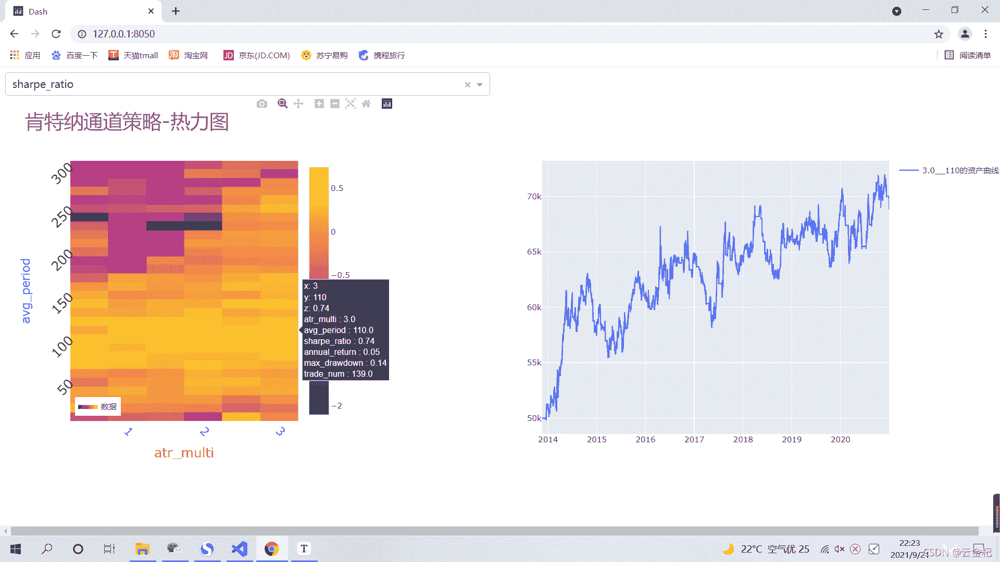
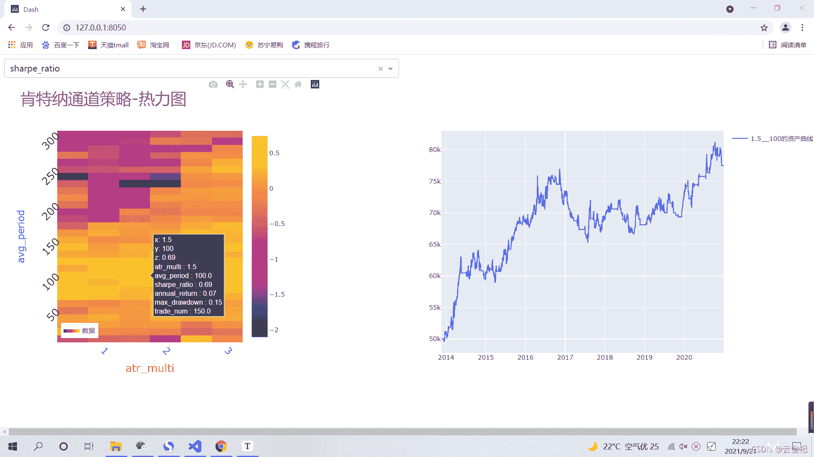

# 67、backtrader 的一些高级技巧---用 dash 和 plotly 画出参数与资金曲线的关系图

> 原文：<https://yunjinqi.blog.csdn.net/article/details/120406504>

这篇文章写起来真不容易，从下午到现在，中间除了跑了半小时步，吃了点东西，估计有六七个小时的时间了，主要是解决使用 plotly 和 dash 回调的时候不显示图形的问题。最后发现，不是我 dash 和 plotly 代码的问题，而是搜狗浏览器的问题，我换了谷歌浏览器就正常了。吃一堑长一智，以后还是多用谷歌浏览器吧！

如果[使用上篇文章](https://yunjinqi.blog.csdn.net/article/details/120400145)的代码运行策略，得到参数优化后的数据之后，就可以使用本文的代码，展示参数优化后的结果了。

#### 参数优化展示结果




#### 展示代码

```py
import os
import pandas as pd
import plotly.graph_objs as go
import plotly.offline as py 
import dash
from dash import dcc                  # 交互式组件
from dash import html                 # 代码转 html
from dash.dependencies import Input, Output         # 回调
import dash_bootstrap_components as dbc
# from jupyter_plotly_dash import JupyterDash 

### 数据预处理，读取相关的数据
datas = {}
result = []
file_list = os.listdir("./鸡蛋-肯特纳策略参数优化结果/")
for file in file_list:
    df = pd.read_csv("./鸡蛋-肯特纳策略参数优化结果/"+file,index_col=0)
    param = file[:-4] 
    avg_period,atr_multi,sharpe_ratio,annual_return,max_drawdown,trade_num = param.split("__")
    datas[avg_period+"__"+atr_multi] = df
    result.append([avg_period,atr_multi,sharpe_ratio,annual_return,max_drawdown,trade_num])
df = pd.DataFrame(result,columns=['avg_period','atr_multi','sharpe_ratio','annual_return','max_drawdown','trade_num'])
df = df.astype("float")
### 运行 dash
app = dash.Dash('肯特纳策略-参数优化结果分析')

app.layout =  html.Div([

    html.Div([
            dcc.Dropdown(
                id = 'indicator_value',
                options = [{'label': i, 'value': i} for i in ['sharpe_ratio','annual_return','max_drawdown','trade_num']],
                value = 'sharpe_ratio'),
            dcc.Graph(id = 'crossfilter-indicator-heatmap',
            hoverData = dict(points = [{'customdata': (2.0,100)}]))
                ],
            style = dict(width = '49%', display = 'inline-block')),

    # 设置交互数据对象及默认值
    html.Div([
        # 设置交互的子图表
        dcc.Graph(id = 'value-time-series')],
        style = dict(width = '49%', display = 'inline-block')),  
])

# 回调 1 个指标值
@app.callback(
    Output('crossfilter-indicator-heatmap', 'figure'),
    [ Input('indicator_value', 'value'),
     ])
def update_figure(indicator_value):
    df['text']="atr_multi"+" : "+df['atr_multi'].astype("str")+"<br>"+\
            "avg_period"+" : "+df['avg_period'].astype("str")+"<br>"+\
            "sharpe_ratio"+" : "+df['sharpe_ratio'].astype("str")+"<br>"+\
            "annual_return"+" : "+df['annual_return'].astype("str")+"<br>"+\
            "max_drawdown"+" : "+df['max_drawdown'].astype("str")+"<br>"+\
            "trade_num"+" : "+df['trade_num'].astype("str")+"<br>"
    print(df.head())
    layout = go.Layout(
            # plot_bgcolor='red',  # 图背景颜色
            paper_bgcolor='white',  # 图像背景颜色
            autosize=True,
            width=600,
            height=600,
            title='肯特纳通道策略-热力图',
            titlefont=dict(size=30, color='gray'),

            # 图例相对于左下角的位置
            legend=dict(
                x=0.02,
                y=0.02
            ),

            # x 轴的刻度和标签
            xaxis=dict(title='atr_multi',  # 设置坐标轴的标签
                    titlefont=dict(color='red', size=20),
                    tickfont=dict(color='blue', size=18, ),
                    tickangle=45,  # 刻度旋转的角度
                    showticklabels=True,  # 是否显示坐标轴
                    # 刻度的范围及刻度
                    # autorange=False,
                    # range=[0, 100],
                    # type='linear',
                    ),

            # y 轴的刻度和标签
            yaxis=dict(title='avg_period',  # 坐标轴的标签
                    titlefont=dict(color='blue', size=18),  # 坐标轴标签的字体及颜色
                    tickfont=dict(color='green', size=20, ),  # 刻度的字体大小及颜色
                    showticklabels=True,  # 设置是否显示刻度
                    tickangle=-45,
                    # 设置刻度的范围及刻度
                    autorange=True,
                    # range=[0, 100],
                    # type='linear',
                    ),
        )
    fig = go.Figure(data=go.Heatmap(
            showlegend=True,
            name='数据',
            x=df["atr_multi"],
            y=df['avg_period'],
            z=df[indicator_value],
            type='heatmap',
            text = df['text'],
            customdata = df[["atr_multi",'avg_period']],
            # hoverinfo = "skip",
            hovertext = df['text']),
        layout=layout
    )

    fig.update_layout(margin=dict(t=100, r=150, b=100, l=100), autosize=True),

    return fig 

# # 回调--设置上子图表的交互
@app.callback(
    Output('value-time-series', 'figure'),
    [Input('crossfilter-indicator-heatmap', 'hoverData'),
     ])
def update_figure(hoverData):
    atr_multi,avg_period = hoverData['points'][0]['customdata']
    atr_multi = str(atr_multi)
    if len(str(atr_multi))==1:
        atr_multi = str(atr_multi)+".0"
    data = datas[str(avg_period)+"__"+atr_multi]
    data.index = pd.to_datetime(data.index)
    layout = go.Layout(
            # plot_bgcolor='red',  # 图背景颜色
            paper_bgcolor='white',  # 图像背景颜色
            autosize=True,
            width=800,
            height=600,)
    fig = go.Figure(data=go.Scatter(
            showlegend=True,
            name=f"{atr_multi}__{avg_period}的资产曲线",
            x=data.index,
            y=data['value'],

        ),layout = layout)

    return fig 

app.run_server() 
```

#### 参数优化结果的数据

链接: https://pan.baidu.com/s/1whFc68Ct8rCeZmmA83WPtA 提取码: 7qv9 复制这段内容后打开百度网盘手机 App，操作更方便哦

* * *

祝大家中秋节快乐。