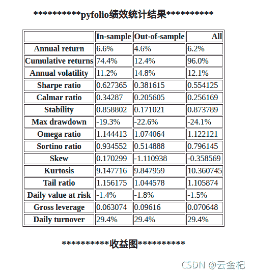
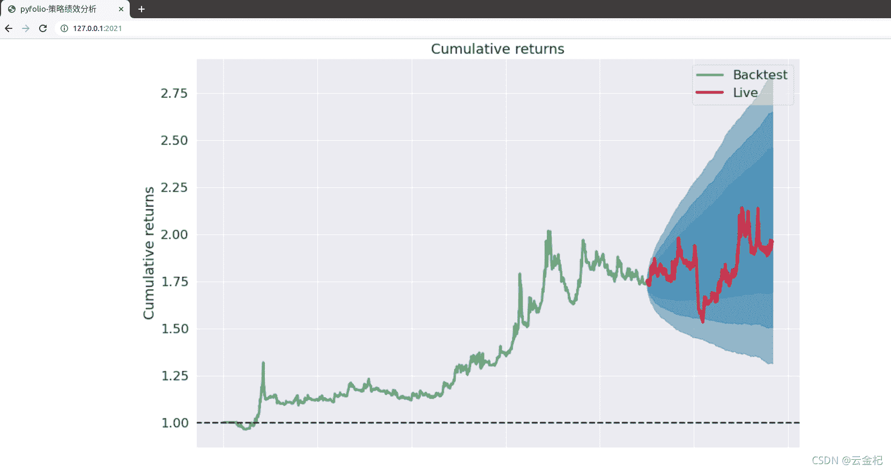

# 76 使用 flask 给 pyfolio 做一个界面,可以在 spyder\pycharm\vscode 中呈现策略绩效分析结果(2021-10-29 更新)

> 原文：<https://yunjinqi.blog.csdn.net/article/details/121025639>

有几个策略在优化参数,还没有来得及更新,先更新下 pyfolio 的使用问题.
2021-10-29 19:40 修复了 pyfolio 模块的几个已知的 bug.
在考试前就有一些读者提出,pyfolio 的回测结果只能在 notebook 中显示,当我使用 pycharm 或者 spyder 等运行代码的时候,策略回测结果的分析不能够完全展示出来,当时提出了一个间接的方案,是把 pyfolio 分析过程的图片保存到本地,这样去查看.这段考试完了,正好前几天有读者提出了这个问题,那我就去解决下这个问题吧.

最开始的设想是使用 dash 作一个策略的绩效展示,[想要做成类似 dash 中的一个展示](https://dash-gallery.plotly.host/dash-financial-report/),但是 dash 支持 plotly 比较好,对 matplotlib 等画图支持比较弱,百度上,官方论坛上提供了一些解决办法,效果都不好,所以,不得不放弃使用 dash,转而使用 dash 更底层的框架-flask.

从周一到现在,每个晚上 2 个小时左右,大概花了 8 个小时,搞定了这个简陋的界面,大家可以先简单的使用,后续等专栏写完了,到时候好好整合下 backtrader 和 pyfolio 模块.

效果展示:



#### 使用方法

##### pyfolio 的配置

把我修改过后的 pyfolio 代码,复制到 python 模块所在的位置,如果使用的是集成环境 anaconda,

*   在 windows 中,应该把 pyfolio 的代码复制到 anaconda/lib/site-packages/中,
*   在 ubuntu 中,应该把 pyfolio 的代码放到 anaconda3/lib/python3.x/site-packages/中.

##### 在回测的时候

```py
import pyfolio as pd
import backtrader as bt

# 省略大部分代码,只保留关键部分

cerebro.addanalyzer(bt.analyzers.PyFolio)
# 运行回测
results = cerebro.run()

pyfoliozer = results[0].analyzers.getbyname('pyfolio')
returns, positions, transactions, gross_lev = pyfoliozer.get_pf_items()
pf.create_full_tear_sheet_by_flask(
    returns,
    positions=positions,
    transactions=transactions,
    # gross_lev=gross_lev,
    live_start_date='2019-01-01',
    run_flask_app = True,# 默认是 True,运行之后,会弹出一个网址,打开这个网址,就会显示结果,需要使用 ctrl + c 等方式取消代码的运行,参数优化中不太适合使用
    ) 
```

#### pyfolio 代码在这个仓库中

https://gitee.com/yunjinqi/backtrader_cn/tree/master/pyfolio

注:第一次用 flask 和 html 写网页来展示数据,技术有限,时间有限,写的比较简陋.大家有时间和精力,可以在这个基础上,美化下.