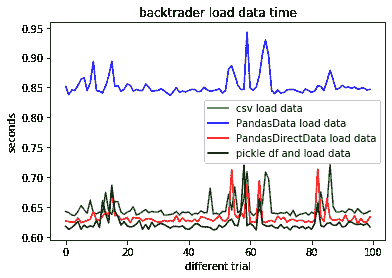
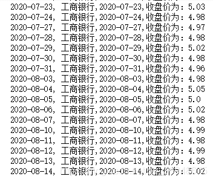
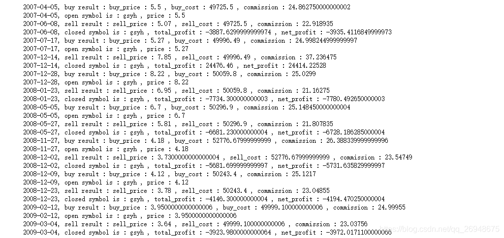
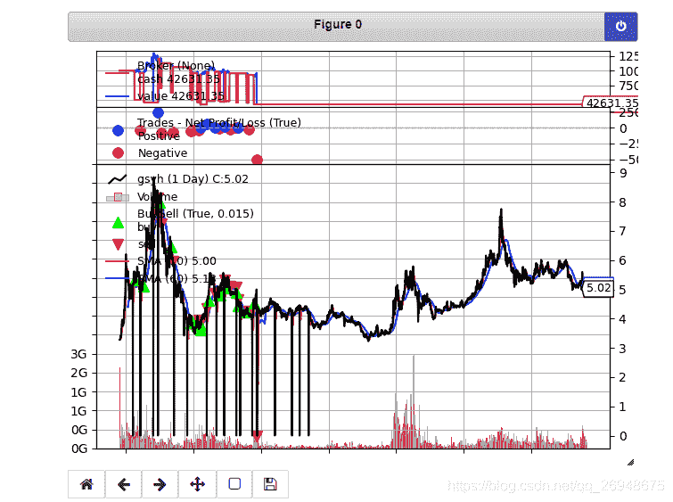
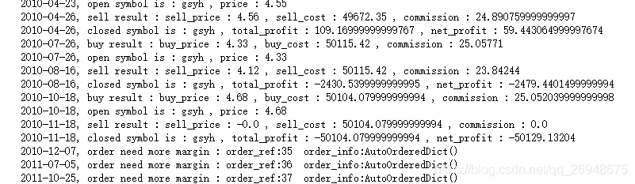
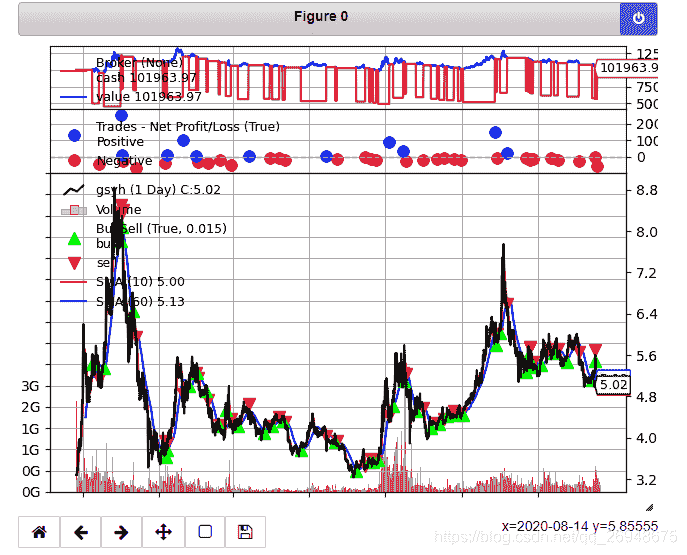
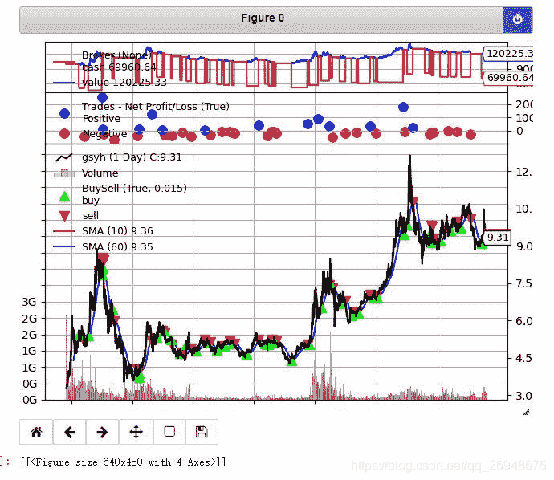

# 6、如何用 backtrader 实现双均线策略？以工商银行为例

> 原文：<https://yunjinqi.blog.csdn.net/article/details/108039373>

###         在第五讲中，我们配置好了 backtrader 的运行，在这一讲中，我将会和一步步分享下，如何使用 backtrader,验证下双均线交易策略（均线金叉做多，均线死叉做空）在工商银行上的表现。

# 一、交易策略

###        首先，我们是要有具体的交易策略和交易逻辑，然后我们尝试去验证这个交易策略和交易逻辑在过去 N 年中，是否是表现不好，如果在过去 N 年表现不好，我们也没有理由期待，未来会表现很好。

> ### 猜想：使用 10 日的移动平均线作为短期均线，60 日的移动平均线作为长期均线，当短期均线金叉长期均线的时候，买入 1 万元的股票；当短期均线死叉长期均线的时候，卖出清仓。
> 
> ### 银行股票市值一般比较大，被操纵的可能性比较小，并且买卖的交易者比较多，信息扩散比较快，市场相对比较有效。

### 这是一个简单的双均线策略，是 toy strategy,期待中的表现，虽然说不上太好，也不能太差。

### 让我们一步步去验证这个策略怎么样。

# 二、数据

### 有了交易策略，我们要验证这个策略，肯定需要相应的数据，我们从网易财经下载工商银行的股票数据。可以打开网易财经，找到工商银行的股票，在股票页面，点击历史数据，就会打开如下的页面，下载数据到本地：


### 下载完数据，就该进入到 backtrader 的使用环节。

# 三、加载数据到 backtrader 中

### 在这一步，先不讲策略。因为数据是基础，需要先加载到 backtrader 中，让 backtrader 能够识别数据，处理数据(这是一个很复杂的流程，整个量化框架有时候都可以看作是数据流或者信息流），官网上讲解多用的 csv 文件，现实实践中，为了易用性或者提高回测的速度，有用各种各样的数据形式，backtrader 在 feed 上做的很灵活，你可以继承 feed.database，写自己的想要的，我自己比较常用的是 PandasDirectData，使用这个加载数据的时候，你可以先把数据用 pandas 读取之后，做成 df 的形式，传入到 backtrader。生产环境当中，建议使用其他的，因为这个加载的速度并不是最快的，我以前曾经对比过各种途径加载数据的速度，详情参考[这篇文章](https://community.backtrader.com/topic/2261/four-ways-to-load-data-and-it-s-different-time "这篇文章")。



### 我们使用的 PandasDirectData 的速度还是相对比较快的，加载到 backtrader 里面的形式比较固定，每次套用这些代码就可以了，代码模板如下:

```py
# 回测数据的参数
 params = dict(
                fromdate = datetime.datetime(2010,1,4),
                todate = datetime.datetime(2020,3,20),
                timeframe = bt.TimeFrame.Minutes,
                compression = 1,
                dtformat=('%Y-%m-%d %H:%M:%S'),
                tmformat=('%H:%M:%S'),
                datetime=0,
                high=2,
                low=3,
                open=1,
                close=4,
                volume=5,
                openinterest=6)
 # 获取数据

 data_path="xxx"
 df=pd.read_csv(data_path,encoding='gbk') #df=pd.read_csv(data_path,encoding='gbk')
 df.columns=['datetime','open','high','low','close','volume','openinterest']
 df.index=pd.to_datetime(df['datetime'])
 df=df[['open','high','low','close','volume','openinterest']]
 feed =  bt.feeds.PandasDirectData(dataname=df,**params)
 # 添加合约数据
 cerebro.adddata(feed, name = "RB8888.XSGE")
 cerebro.broker.setcommission(commission=0.0005)
```

### 调整后的加载数据的代码如下：

```py
import pandas as pd
import numpy as np

params = dict(
                fromdate = datetime.datetime(2010,1,4),
                todate = datetime.datetime(2020,3,20),
                timeframe = bt.TimeFrame.Days,
                compression = 1,
                #dtformat=('%Y-%m-%d %H:%M:%S'),
                # tmformat=('%H:%M:%S'),
                datetime=0,
                high=2,
                low=3,
                open=1,
                close=4,
                volume=5,
                openinterest=6)

data_path = 'C:/data/股票/零散/工商银行.csv'
df = pd.read_csv(data_path,encoding='gbk')
df =df[['日期','开盘价','最高价','最低价','收盘价','成交量','成交金额']]
df.columns = ['datetime','open','high','low','close','volume','openinterest']
df = df.sort_values("datetime")
df.index=pd.to_datetime(df['datetime'])
df=df[['open','high','low','close','volume','openinterest']]
feed =  bt.feeds.PandasDirectData(dataname=df,**params)
# 添加合约数据
cerebro.adddata(feed, name = "gsyh")
# 添加交易的手续费，按照万分之五算
cerebro.broker.setcommission(commission=0.0005)
```

### 加载数据到 backtrader 中，在 strategy 中，调用数据并打印数据，检查下数据是否正常：

```py
import pandas as pd
import numpy as np
import backtrader as bt 
import datetime

class TestStrategy(bt.Strategy):

    def log(self, txt, dt=None):
        ''' log 信息的功能'''
        dt = dt or self.datas[0].datetime.date(0)
        print('%s, %s' % (dt.isoformat(), txt))

    def __init__(self):
        # 一般用于计算指标或者预先加载数据，定义变量使用
        pass

    def next(self):
        # Simply log the closing price of the series from the reference
        self.log(f"工商银行,{self.datas[0].datetime.date(0)},收盘价为：{self.datas[0].close[0]}")
# 添加 cerebro
cerebro = bt.Cerebro()
# 添加策略
cerebro.addstrategy(TestStrategy)
# 准备数据        
params = dict(
                fromdate = datetime.datetime(2006,10,27),
                todate = datetime.datetime(2020,8,14),
                timeframe = bt.TimeFrame.Days,
                compression = 1,
                #dtformat=('%Y-%m-%d %H:%M:%S'),
                # tmformat=('%H:%M:%S'),
                datetime=0,
                high=2,
                low=3,
                open=1,
                close=4,
                volume=5,
                openinterest=6)

data_path = 'C:/data/股票/零散/工商银行.csv'
df = pd.read_csv(data_path,encoding='gbk')
df =df[['日期','开盘价','最高价','最低价','收盘价','成交量','成交金额']]
df.columns = ['datetime','open','high','low','close','volume','openinterest']
df = df.sort_values("datetime")
df.index=pd.to_datetime(df['datetime'])
df=df[['open','high','low','close','volume','openinterest']]
feed =  bt.feeds.PandasDirectData(dataname=df,**params)
# 添加合约数据
cerebro.adddata(feed, name = "gsyh")
cerebro.broker.setcommission(commission=0.0005)

# 添加资金
cerebro.broker.setcash(100000.0)

# 开始运行
cerebro.run()
```



# 四、编写策略

### 编写策略也是非常关键的一个环节。

### 策略编写有多种多样的方式可以实现，不局限一种特定的方式；指标可以在 init 中一次计算完毕加载上去，也可以在每个 next 中进行计算；

### 下面，让我们一点点实现这个双均线策略。

## 1、定义参数

### 我们使用了两个参数，把参数先写到 params 里面，这样后期如果需要优化参数的时候，我们也可以直接去优化。

### 定义参数的时候，一般是使用元组的元组进行，如（（参数 1，参数值），（参数 2,参数值),(参数 3，参数值)),也可以直接使用 python 的字典格式，如{"参数 1":参数值，"参数 2"：参数值}

### 根据我们双均线的需要，我们定义两个参数，short_window,long_window

### 参数 params 直接放到 strategy 里面，作为 self 可以直接调用的变量。

```py
# params = (('short_window',10),('long_window',60))
params = {"short_window":10,"long_window":60}
```

## 2、计算均线的值

### backtrader 里面有很多预先写好的指标的算法，计算很多指标的时候，只需要简单调用即可，简单快捷。但是，使用的时候需要注意，有些指标的算法并不完全相同，和国内的软件对比，可能有出入。

### 我们在策略的 init 中，定义两条均线，代码如下：

```py
self.short_ma = bt.indicators.SMA(self.datas[0].close,period=self.p.short_window) 

self.long_ma = bt.indicators.SMA(self.datas[0].close,period=self.p.long_window)
```

### 我们可以在 next 中，用这行代码，打印出每个交易日的均线值

```py
self.log(f"short_ma:{self.short_ma[0]},long_ma:{self.long_ma[0]}")
```

### 一般情况，在实际的工作或者研究中，我们要核对下这些指标计算是否存在问题，以某个软件为基准，核对两者的指标计算是否完全一致。

## 3、计算交易信号并下单

### 当持仓为 0 的时候，短期均线金叉长期均线，做多 5 万元。当持仓大于 0 的时候，短期均线死叉长期均线，平仓。

### 在下单的时候，直接使用了 order_target_value 函数，实际情况下，我使用更多的是 self.buy 做多，self.sell 做空，这样可以控制交易的股票数目，一般 A 股是需要交易一手 100 股的倍数的。

```py
# 得到当前的 size
size = self.getposition(self.datas[0]).size 
# 做多
if size==0 and self.short_ma[-1]<self.long_ma[-1] and self.short_ma[0]>self.long_ma[0] :
    # 开仓
    self.order_target_value(self.datas[0], target=50000)
# 平多
if size>0 and self.short_ma[-1]>self.long_ma[-1] and self.short_ma[0]<self.long_ma[0]:
    self.close(self.datas[0])
```

### 按照我们以上的步骤，做完成，并运行，就可以得到相应的结果了，如下图：





### 好了，开始到了高潮了，接下来也要进入收费环节了。在这篇文章的收费环节中，将会分享如下的内容：

### 1、整个策略的代码

### 2、在做这个 toy strategy 的时候，哪里出错了

### 3、如何做一个更真实的策略，更加符合真实的世界？

* * *

### 1、整个策略的代码

```py
import pandas as pd
import numpy as np
import backtrader as bt 
import datetime

class SmaStrategy(bt.Strategy):

    # params = (('short_window',10),('long_window',60))
    params = {"short_window":10,"long_window":60}

    def log(self, txt, dt=None):
        ''' log 信息的功能'''
        dt = dt or self.datas[0].datetime.date(0)
        print('%s, %s' % (dt.isoformat(), txt))

    def __init__(self):
        # 一般用于计算指标或者预先加载数据，定义变量使用
        self.short_ma = bt.indicators.SMA(self.datas[0].close,period=self.p.short_window)
        self.long_ma = bt.indicators.SMA(self.datas[0].close,period=self.p.long_window)

    def next(self):
        # Simply log the closing price of the series from the reference
        # self.log(f"工商银行,{self.datas[0].datetime.date(0)},收盘价为：{self.datas[0].close[0]}")
        # self.log(f"short_ma:{self.short_ma[0]},long_ma:{self.long_ma[0]}")
        # 得到当前的 size
        size = self.getposition(self.datas[0]).size 
        # 做多
        if size==0 and self.short_ma[-1]<self.long_ma[-1] and self.short_ma[0]>self.long_ma[0] :
            # 开仓
            self.order_target_value(self.datas[0], target=50000)
        # 平多
        if size>0 and self.short_ma[-1]>self.long_ma[-1] and self.short_ma[0]<self.long_ma[0]:
            self.close(self.datas[0])

    def notify_order(self, order):
        if order.status in [order.Submitted, order.Accepted]:
            # order 被提交和接受
            return
        if order.status == order.Rejected:
            self.log(f"order is rejected : order_ref:{order.ref}  order_info:{order.info}")
        if order.status == order.Margin:
            self.log(f"order need more margin : order_ref:{order.ref}  order_info:{order.info}")
        if order.status == order.Cancelled:
            self.log(f"order is concelled : order_ref:{order.ref}  order_info:{order.info}")
        if order.status == order.Partial:
            self.log(f"order is partial : order_ref:{order.ref}  order_info:{order.info}")
        # Check if an order has been completed
        # Attention: broker could reject order if not enougth cash
        if order.status == order.Completed:
            if order.isbuy():
                self.log("buy result : buy_price : {} , buy_cost : {} , commission : {}".format(
                            order.executed.price,order.executed.value,order.executed.comm))

            else:  # Sell
                self.log("sell result : sell_price : {} , sell_cost : {} , commission : {}".format(
                            order.executed.price,order.executed.value,order.executed.comm))

    def notify_trade(self, trade):
        # 一个 trade 结束的时候输出信息
        if trade.isclosed:
            self.log('closed symbol is : {} , total_profit : {} , net_profit : {}' .format(
                            trade.getdataname(),trade.pnl, trade.pnlcomm))
        if trade.isopen:
            self.log('open symbol is : {} , price : {} ' .format(
                            trade.getdataname(),trade.price))

# 添加 cerebro
cerebro = bt.Cerebro()
# 添加策略
cerebro.addstrategy(SmaStrategy)
# 准备数据        
params = dict(
                fromdate = datetime.datetime(2006,10,27),
                todate = datetime.datetime(2020,8,14),
                timeframe = bt.TimeFrame.Days,
                compression = 1,
                #dtformat=('%Y-%m-%d %H:%M:%S'),
                # tmformat=('%H:%M:%S'),
                datetime=0,
                high=2,
                low=3,
                open=1,
                close=4,
                volume=5,
                openinterest=6)
# 数据的地址，使用自己的数据地址 
data_path = 'C:/data/股票/零散/工商银行.csv'
df = pd.read_csv(data_path,encoding='gbk')
df =df[['日期','开盘价','最高价','最低价','收盘价','成交量','成交金额']]
df.columns = ['datetime','open','high','low','close','volume','openinterest']
df = df.sort_values("datetime")
df.index=pd.to_datetime(df['datetime'])
df=df[['open','high','low','close','volume','openinterest']]
feed =  bt.feeds.PandasDirectData(dataname=df,**params)
# 添加合约数据
cerebro.adddata(feed, name = "gsyh")
cerebro.broker.setcommission(commission=0.0005)

# 添加资金
cerebro.broker.setcash(100000.0)

# 开始运行
cerebro.run()

# 打印相关信息
cerebro.plot()
```

### 2、在这个 toy strategy 中，哪里出错了？

### 刚看到这个回测结果的时候，其实蛮失望的，这个策略在运行几年之后，钱基本上就亏完了。

### 这跟我们的猜想不一样。简单的均线策略，就算盈利效果不那么好，也不至于在银行股票上，亏那么惨吧。

### 我们认真分析每笔交易的结果，发现，工商银行的某些价格是 0，原来，是数据出错了。如下图，在 2010 年 11 月 18 日平仓的时候，平仓价是 0，工商银行的价格从 4.68 在一个月内，跌倒了 0 元，开什么玩笑？



### 重新去分析下从网易财经下载的数据，发现，确实有很多的 K 线的价格是 0，有些特别无语。可用的，好用的数据可能是 quant 一生的痛，找到这样的数据实在是太难了。在工作中，也经常发现，各种途径获得的数据，可能也存在问题。这是一个特别特别关键的问题，在做策略的开始，我就特别强调给大家了，如果数据有问题，只能是“垃圾进垃圾出”。

### 怎么办呢？需要专门的数据清洗工作。有时间专门讲一下，如何做基本的数据清洗，在这里，为了简单（实际中，应该尽可能获取完整的准确的数据)，我们把收盘价和开盘价数据为 0 的 K 线给删除掉，重新运行一遍策略，新的策略代码只需要在添加数据的部分，多添加两行代码即可：

```py
data_path = 'C:/data/股票/零散/工商银行.csv'
df = pd.read_csv(data_path,encoding='gbk')
df =df[['日期','开盘价','最高价','最低价','收盘价','成交量','成交金额']]
df.columns = ['datetime','open','high','low','close','volume','openinterest']
df = df.sort_values("datetime")
df = df[df['close']>0] # 新添加
df = df[df['open']>0]  # 新添加
df.index=pd.to_datetime(df['datetime'])
df=df[['open','high','low','close','volume','openinterest']]
feed =  bt.feeds.PandasDirectData(dataname=df,**params)
```

### 重新运行，得到新的结果：



### 从结果来看，我们赚钱了，虽然赚钱的数目还不到 2000 元。

## 3、如何做一个更真实的策略，更加符合真实的世界？

### 我们做策略，保持真实性非常重要，不能自欺欺人，虽然我们都特别善于“自我欺骗”。

### 第一、交易量的问题

### 一般情况而言，股票的交易都是要 100 股的倍数，不能小于 100 股，也不能太大，太大除了会造成冲击成本非常大之外，还有可能会造成监管上的问题。

### 在实际回测中，如果我们一次交易的量，占到了这一日交易量的 10%以上，我们就可以认为，会给这个市场造成冲击，交易量占比越大，回测越不真实。

### 如果交易量太大，出现交易信号的时候，把交易量分拆为多份，在接下来的多个交易日下单成交。

## 第二、老生常谈的交易成本问题

### 回测的时候除了交易费用，还要考虑冲击成本造成的“滑点”，如果交易频率比较高的策略，一定要合理考虑交易成本的问题。

## 第三、股票的股利发放、送股、分拆、合并等问题

### 如果没有考虑到这些问题，回测的时候，肯定存在很多的问题。我们在实际的回测中，要考虑到这些问题。一种比较简单的替代方法是使用复权的数据，尤其是后复权的数据。

### 同样的这个策略，当我使用后复权数据(来自聚宽）的时候，回测结果如下：

### 我们使用的资金是 5 万元，最终盈利 2 万多，40%多一点的收益，看着跟理财产品的收益差不多，但是实际上，我们只在一部分的时间中使用了资金，在不使用的时候，其实我们可以是额外做其他投资获取收益的。



### 在下一讲中，将会和大家分享下，如何获取聚宽的数据，并使用后复权数据做股票的回测。