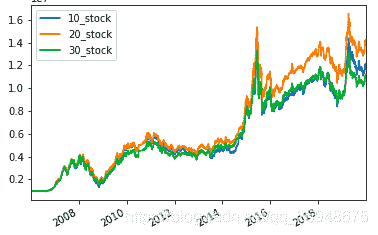
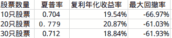

# 11、【股票策略】用 backtrader 回测在 A 股上复利年化收益率超 20%的“狗股策略”？

> 原文：<https://yunjinqi.blog.csdn.net/article/details/109275924>

## 11、用 backtrader 回测在 A 股上复利年化收益率超 20%的“狗股策略”？

更进一步的回测代码可以参考版本 4：[【股票策略】使用 backtrader 测试狗股策略版本 4—在版本 3 的基础上进行代码改进优化](https://yunjinqi.blog.csdn.net/article/details/111414937)

### 1、什么是攻守兼备的“狗股策略”？

​ 狗股理论是美国基金经理迈克尔·奥希金斯于 1991 年提出的一种投资策略。具体的做法是，投资者每年年底从道琼斯工业平均指数成份股中找出 10 只股息率最高的股票，新年买入，一年后再找出 10 只股息率最高的成分股，卖出手中不在名单中的股票，买入新上榜单的股票，每年年初年底都重复这一投资动作，便可获取超过大盘的回报。据有关统计，1975 至 1999 年运用"狗股理论"，投资的平均复利回报达 18%，远高于市场 3%的平均水平。

​ 投资高息股，可以称得上是攻守兼备的策略。当股价低迷时，只要能获得高于银行定期存款的股息，就相当于为资金构建了一个保护伞，此为“守”；而当股价上扬时，不但能继续享受股息收入，还能让资产像坐轿子一样升值，高位抛出的话，可赚取资本利得，此为“攻”。

​ 从量化的角度来看，这个策略，本质上是一个单因子策略—以股息率为因子，买入股息率较高的策略。

​ 此策略比较适合不会基本面分析，难于找到价值被低估的股票却又希望能够找到一个跑赢大盘的散户使用。

### 2、策略回测

​ 策略原理：每年 8 月的第一个交易日结束，先清仓过去持有的股票，然后筛选出 N 只股息率最高的股票，每次开仓的时候使用 90%的资金，并且平分到 N 只股票上，然后在第二个交易日开盘买入，持有一年时间，到第二年的 8 月份。不断重复同样的操作，期待能够获取超过超额收益率。

​ 策略有效性分析：高的股息率一般代表着这个公司的经营比较好，客观上能够获得股息收益，这个是实实在在的。投资 30 个股票，在某种程度上，分散了个股的特有风险。之所以在每年 8 月份调整仓位，是因为 A 股的好多股息发放是在每年的六七月份，发放过股息之后，才能确定这个股票的股息率怎么样。

​ 交易费用：每次交易按照万分之二的手续费

​ 数据来源：A 股后复权的日数据来自于聚宽；股息率数据来自于优矿。

### 3、回测结果





最大回撤发生在 2008 年股灾。除了这个，股息率策略，表现算得上比较好的了，操作简单，收益率不错。从 2006 年到 2019 年底，复利年化收益率能够达到 20%以上的，有多少人呢？坚持这个简单的策略，你就很可能跑赢 95%以上的投资者了。

### 4、回测代码

analyzer 设置[参考文章](https://zhuanlan.zhihu.com/p/98544551)

主要代码：

```py
import backtrader as bt
import datetime
import pandas as pd
import numpy as np
import os,sys

# 我们使用的时候，直接用我们新的类读取数据就可以了。
class test_divdend_rate_strategy(bt.Strategy):

    params = (('window',200),)

    def log(self, txt, dt=None):
        ''' Logging function fot this strategy'''
        dt = dt or self.datas[0].datetime.date(0)
        print('{}, {}'.format(dt.isoformat(), txt))

    def __init__(self):
        # Keep a reference to the "close" line in the data[0] dataseries
        self.bar_num=0
        self.stock_divdend_info = pd.read_csv("/home/yun/data/股票历史股息率数据.csv",index_col=0)
        self.buy_list=[]
        self.value_list = []
        self.trade_list = []
        self.order_list = []

    def prenext(self):

        self.next()

    def next(self):
        # 假设有 100 万资金，每次成份股调整，每个股票使用 1 万元
        self.bar_num+=1
        self.log(self.bar_num)
        # 需要调仓的时候
        pre_current_date = self.datas[0].datetime.date(-1).strftime("%Y-%m-%d")
        current_date = self.datas[0].datetime.date(0).strftime("%Y-%m-%d")
        total_value = self.broker.get_value()
        self.value_list.append([current_date,total_value])
        # 如果是 8 月的第一个交易日
        if current_date[5:7]=='08' and pre_current_date[5:7]!='08':
            # 获取当前股息率前 10 的股票
            divdend_info  = self.stock_divdend_info[self.stock_divdend_info['tradeDate']==current_date]
            divdend_info = divdend_info.sort_values("divRate",ascending=False)
            divdend_info = divdend_info.drop_duplicates("secID")
            divdend_stock_list= [i.split('.')[0] for i in list(divdend_info['secID'])]
            if len(divdend_stock_list)>10:
                stock_list= divdend_stock_list[:10]
            else:
                stock_list= divdend_stock_list
            self.log(stock_list)
            # 平掉原来的仓位
            for stock in self.buy_list:
                data = self.getdatabyname(stock)
                if self.getposition(data).size>0:
                    self.close(data)
            # 取消所有未成交的订单
            for order in self.order_list:
                self.cancel(order)
                # self.log(order)
            self.buy_list = stock_list

            value =0.90*self.broker.getvalue()/len(stock_list)
            # 开新的仓位，按照 90%的比例开
            for stock in stock_list:
                data = self.getdatabyname(stock)
                # 没有把手数设定为 100 的倍数
                lots = value/data.close[0]
                order = self.buy(data,size = lots)
                self.log(f"symbol:{data._name},price:{data.close[0]}")
                self.order_list.append(order)

    def notify_order(self, order):
        if order.status in [order.Submitted, order.Accepted]:
            # order 被提交和接受
            return
        if order.status == order.Rejected:
            self.log(f"order is rejected : order_ref:{order.ref} order_info:{order.info}")
        if order.status == order.Margin:
            self.log(f"order need more margin : order_ref:{order.ref} order_info:{order.info}")
        if order.status == order.Cancelled:
            self.log(f"order is concelled : order_ref:{order.ref} order_info:{order.info}")
        if order.status == order.Partial:
            self.log(f"order is partial : order_ref:{order.ref} order_info:{order.info}")
        # Check if an order has been completed
        # Attention: broker could reject order if not enougth cash
        if order.status == order.Completed:
            if order.isbuy():
                self.log("buy result : buy_price : {} , buy_cost : {} , commission : {}".format(
                            order.executed.price,order.executed.value,order.executed.comm))

            else:  # Sell
                self.log("sell result : sell_price : {} , sell_cost : {} , commission : {}".format(
                            order.executed.price,order.executed.value,order.executed.comm))

    def notify_trade(self, trade):
        # 一个 trade 结束的时候输出信息
        if trade.isclosed:
            self.log('closed symbol is : {} , total_profit : {} , net_profit : {}' .format(
                            trade.getdataname(),trade.pnl, trade.pnlcomm))
            self.trade_list.append([self.datas[0].datetime.date(0),trade.getdataname(),trade.pnl,trade.pnlcomm])

        if trade.isopen:
            self.log('open symbol is : {} , price : {} ' .format(
                            trade.getdataname(),trade.price))
    def stop(self):

        value_df = pd.DataFrame(self.value_list)
        value_df.columns=['datetime','value']
        value_df.to_csv("股息率 value 结果.csv")

        trade_df = pd.DataFrame(self.trade_list)
        # trade_df.columns =['datetime','name','pnl','net_pnl']
        trade_df.to_csv("股息率-trade 结果.csv")

# 初始化 cerebro,获得一个实例
cerebro = bt.Cerebro()
# cerebro.broker = bt.brokers.BackBroker(shortcash=True)  # 0.5%
data_root = "/home/yun/data/stock/day/"
file_list =sorted(os.listdir(data_root))
params=dict(

    fromdate = datetime.datetime(2006,1,4),
    todate = datetime.datetime(2019,12,31),
    timeframe = bt.TimeFrame.Days,
    dtformat = ("%Y-%m-%d"),
    compression = 1,
    datetime = 0,
    open = 1,
    high = 2,
    low =3,
    close =4,
    volume =5,
    openinterest=-1)

# 读取数据
for file in file_list:
    feed = bt.feeds.GenericCSVData(dataname = data_root+file,**params)
    # 添加数据到 cerebro
    cerebro.adddata(feed, name = file.split('.')[0])
print("加载数据完毕")
# 添加手续费，按照万分之二收取
cerebro.broker.setcommission(commission=0.0002,stocklike=True)
# 设置初始资金为 100 万
cerebro.broker.setcash(1000000.0)
# 添加策略
cerebro.addstrategy(test_divdend_rate_strategy)
cerebro.addanalyzer(bt.analyzers.TotalValue, _name='_TotalValue')
# 运行回测
results = cerebro.run() 
```

5、股票日数据及股息率数据

百度网盘：链接: https://pan.baidu.com/s/1yIps-8tOfi5m57qIwLFSAw 提取码: kksu 复制这段内容后打开百度网盘手机 App，操作更方便哦