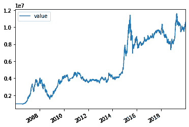

# 12、【股票策略】使用 backtrader 回测升级版的狗股策略-基于股息率和市净率两个因子

> 原文：<https://yunjinqi.blog.csdn.net/article/details/109429273>

### 12、使用 backtrader 回测升级版的狗股策略-基于股息率和市净率两个因子

更进一步的回测代码可以参考版本 4：[【股票策略】使用 backtrader 测试狗股策略版本 4—在版本 3 的基础上进行代码改进优化](https://yunjinqi.blog.csdn.net/article/details/111414937)

​ 在上一篇文章中，我们使用了 backtrader 回测了著名的“狗股策略”，使用了单个因子“股息率”，在 A 股上，近 15 年来，测试结果显示复利年化收益率能够打到 20%以上，效果已经非常好了，但是，美中不足的是，历史回撤也比较大，尤其是 2008 年的股灾，回撤达到 60%以上。本文尝试加入另外一个因子，看是否能够明显改善这个策略？

​ 在《Buffett“s Alpha》一文中提到巴菲特购买的股票一般都是安全的（低 beta,低波动率)，便宜的(低的市净率 P/B)以及优质的(盈利的，稳定的，高分红的)成长股。我们在[上一篇文章](https://yunjinqi.blog.csdn.net/article/details/109275924)中，使用了股息率因子，高股息率的股票一般代表着优质的。在[以前的文章《用 backtrader 测试波动率因子》](https://zhuanlan.zhihu.com/p/100274429)中，尝试使用了波动率因子来验证在上证 50 成分股上的效果。这次我们在优质股票中，加入一个便宜的维度，即低市净率（低 P/B)，尝试使用两个因子来选股并持有，看下，是否会比单独一个因子，效果更好。

### 1\. 策略回测

策略原理：每年 8 月份，筛选出股息率排名前 40 的股票，并且从中选出市净率 P/B 最低的 20 只股票，平掉过去所有的仓位，资金平分到 20 只股票上，持有一年到明年的 8 月份。然后，重复同样的操作。

交易费用：买卖按照万分之二计算。

数据来源：后复权的日数据来自于聚宽，市净率数据也来自聚宽；股息率数据来自优矿。

### 2\. 回测结果



```py
夏普率					复利年化收益率          最大回撤率
0.7024928138549442, 0.1837164091687502, -0.6171990573010956 
```

看起来，策略的效果，和单独用一个股息率因子差不多。我们的 pb 因子使用方法可能有些问题，既然我们用 pb 因子来衡量股价的是否被低估，那么，我们就需要基于时间序列的角度来考虑问题，即横截面的角度上用股息率因子来选股，时间序列角度上用市净率来确定股价是否被低估。

在下一篇文章中，将尝试按照横截面和时间序列结合，看是否能够提高策略的绩效。

### 3\. 策略代码

```py
import backtrader as bt
import datetime
import pandas as pd
import numpy as np
import os,sys

# 我们使用的时候，直接用我们新的类读取数据就可以了。
class test_dog_strategy(bt.Strategy):

    params = (('window',200),)

    def log(self, txt, dt=None):
        ''' Logging function fot this strategy'''
        dt = dt or self.datas[0].datetime.date(0)
        print('{}, {}'.format(dt.isoformat(), txt))

    def __init__(self):
        # Keep a reference to the "close" line in the data[0] dataseries
        self.bar_num=0
        self.stock_divdend_info = pd.read_csv("/home/yun/data/股票历史股息率数据.csv",index_col=0)
        self.pb_info = pd.read_csv("/home/yun/data/股票历史市值数据.csv",index_col=0)
        self.buy_list=[]
        self.value_list = []
        self.trade_list = []
        self.order_list = []

    def prenext(self):

        self.next()

    def next(self):
        # 假设有 100 万资金，每次成份股调整，每个股票使用 1 万元
        self.bar_num+=1
        self.log(self.bar_num)
        # 需要调仓的时候
        pre_current_date = self.datas[0].datetime.date(-1).strftime("%Y-%m-%d")
        current_date = self.datas[0].datetime.date(0).strftime("%Y-%m-%d")
        total_value = self.broker.get_value()
        self.value_list.append([current_date,total_value])
        # 如果是 8 月的第一个交易日
        if current_date[5:7]=='08' and pre_current_date[5:7]!='08':
            # 获取当前股息率前 30 的股票
            divdend_info  = self.stock_divdend_info[self.stock_divdend_info['tradeDate']==current_date]
            divdend_info = divdend_info.sort_values("divRate",ascending=False)
            divdend_info = divdend_info.drop_duplicates("secID")
            divdend_stock_list= list(divdend_info['secID'])
            # divdend_stock_list= [i.split('.')[0] for i in list(divdend_info['secID'])]
            if len(divdend_stock_list)>40:
                stock_list= divdend_stock_list[:40]
            else:
                stock_list= divdend_stock_list
            pb_info = self.pb_info[self.pb_info['day']==current_date]
            pb_info = pb_info[pb_info['code'].isin(stock_list)]
            pb_info = pb_info.sort_values("pb_ratio")
            pb_stock_list = list(pb_info['code'])
            # 选出 pb 最小的 20 个股票
            if len(pb_stock_list)>=20:
                stock_list = pb_stock_list[:20]
            else:
                stock_list = pb_stock_list
            stock_list = [i.split('.')[0] for i in stock_list]
            self.log(stock_list)
            # 平掉原来的仓位
            for stock in self.buy_list:
                data = self.getdatabyname(stock)
                if self.getposition(data).size>0:
                    self.close(data)
            # 取消所有未成交的订单
            for order in self.order_list:
                self.cancel(order)
                # self.log(order)
            self.buy_list = stock_list

            value =0.90*self.broker.getvalue()/len(stock_list)
            # 开新的仓位，按照 90%的比例开
            for stock in stock_list:
                data = self.getdatabyname(stock)
                # 没有把手数设定为 100 的倍数
                lots = value/data.close[0]
                order = self.buy(data,size = lots)
                self.log(f"symbol:{data._name},price:{data.close[0]}")
                self.order_list.append(order)

    def notify_order(self, order):
        if order.status in [order.Submitted, order.Accepted]:
            # order 被提交和接受
            return
        if order.status == order.Rejected:
            self.log(f"order is rejected : order_ref:{order.ref}  order_info:{order.info}")
        if order.status == order.Margin:
            self.log(f"order need more margin : order_ref:{order.ref}  order_info:{order.info}")
        if order.status == order.Cancelled:
            self.log(f"order is concelled : order_ref:{order.ref}  order_info:{order.info}")
        if order.status == order.Partial:
            self.log(f"order is partial : order_ref:{order.ref}  order_info:{order.info}")
        # Check if an order has been completed
        # Attention: broker could reject order if not enougth cash
        if order.status == order.Completed:
            if order.isbuy():
                self.log("buy result : buy_price : {} , buy_cost : {} , commission : {}".format(
                            order.executed.price,order.executed.value,order.executed.comm))

            else:  # Sell
                self.log("sell result : sell_price : {} , sell_cost : {} , commission : {}".format(
                            order.executed.price,order.executed.value,order.executed.comm))

    def notify_trade(self, trade):
        # 一个 trade 结束的时候输出信息
        if trade.isclosed:
            self.log('closed symbol is : {} , total_profit : {} , net_profit : {}' .format(
                            trade.getdataname(),trade.pnl, trade.pnlcomm))
            self.trade_list.append([self.datas[0].datetime.date(0),trade.getdataname(),trade.pnl,trade.pnlcomm])

        if trade.isopen:
            self.log('open symbol is : {} , price : {} ' .format(
                            trade.getdataname(),trade.price))
    def stop(self):

        value_df = pd.DataFrame(self.value_list)
        value_df.columns=['datetime','value']
        value_df.to_csv("股息率 value 结果.csv")

        trade_df = pd.DataFrame(self.trade_list)
        # trade_df.columns =['datetime','name','pnl','net_pnl']
        trade_df.to_csv("股息率-trade 结果.csv")

# 初始化 cerebro,获得一个实例
cerebro = bt.Cerebro()
# cerebro.broker = bt.brokers.BackBroker(shortcash=True)  # 0.5%
data_root = "/home/yun/data/stock/day/"
file_list =sorted(os.listdir(data_root))
params=dict(

    fromdate = datetime.datetime(2006,1,4),
    todate = datetime.datetime(2019,12,31),
    timeframe = bt.TimeFrame.Days,
    dtformat = ("%Y-%m-%d"),
    compression = 1,
    datetime = 0,
    open = 1,
    high = 2,
    low =3,
    close =4,
    volume =5,
    openinterest=-1)

# 读取数据
for file in file_list:
    feed = bt.feeds.GenericCSVData(dataname = data_root+file,**params)
    # 添加数据到 cerebro
    cerebro.adddata(feed, name = file.split('.')[0])
print("加载数据完毕")
# 添加手续费，按照万分之二收取
cerebro.broker.setcommission(commission=0.0002,stocklike=True)
# 设置初始资金为 100 万
cerebro.broker.setcash(1000000.0)
# 添加策略
cerebro.addstrategy(test_dog_strategy)
cerebro.addanalyzer(bt.analyzers.TotalValue, _name='_TotalValue')
# 运行回测
results = cerebro.run() 
```

### 4\. 数据

日数据和股息率数据去上篇文章中找，本篇文章新使用的 pb 数据可以从下面的网盘中下载：

链接: https://pan.baidu.com/s/1gG7Cik2JhVIHcYvVonZjGQ 提取码: gn8n 复制这段内容后打开百度网盘手机 App，操作更方便哦
–来自百度网盘超级会员 v1 的分享