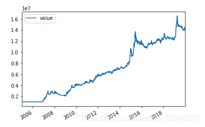

# 13、【股票策略】使用 backtrader 测试狗股策略版本 3-基于横截面和时间序列角度进行选股

> 原文：<https://yunjinqi.blog.csdn.net/article/details/109708385>

更进一步的回测代码可以参考版本 4：[【股票策略】使用 backtrader 测试狗股策略版本 4—在版本 3 的基础上进行代码改进优化](https://yunjinqi.blog.csdn.net/article/details/111414937)

在前两篇文章中，使用了 backtrader 回测了[狗股策略(股息率策略)在 A 股市场上的应用](https://yunjinqi.blog.csdn.net/article/details/109275924)以及[股息率和市净率在 A 股市场上的应用](https://yunjinqi.blog.csdn.net/article/details/109429273)，虽然总体上盈利不错，但是，在 2008 年股灾的时候，回撤也非常大，大部分投资者可能很难承受超过 60%的回撤。

在这篇文章中，基于股息率进行横截面选股，在选出来的股票上，基于简单的均线策略进行买卖，策略整体效果大大提升，在保存策略逻辑简单的基础上，夏普率达到了 1.15,复利年化收益率达到 19.5%(经历 2008 年股灾，从 2005 年到 2019 年底)，最大回撤率为-31.5%

#### 策略回测

1.  数据来源：和前两篇文章的数据来源一样，股票后复权数据来自聚宽、股息率数据来自优矿；需要相应的数据可以到前两篇文章中下载，数据已经传到百度网盘。
2.  交易费用：按照万分之二收取手续费。
3.  策略原理：相对于简单的狗股策略来说，狗股策略升级版 3 逻辑上复杂了一步。首先，在每年的 8 月初，选出来股息率最高的 30 只股票；如果现在有股票持仓，全部平掉；然后，把资金的 98%(资金未使用完全，留下来一少部分备用)平分为 30 份，对于这 30 只股票的每一只股票，如果股价在 60 日均线之上，就用一份资金买入该股票，如果股价在 60 日均线之下，就平仓，一直持续到明年 8 月份；每年 8 月份，重复操作一次，就实现了这个策略。

#### 回测结果



```py
夏普率					复利年化收益率          最大回撤率
1.1467, 				0.1952,				 -0.3153 
```

#### 测试代码

```py
import backtrader as bt
import datetime
import pandas as pd
import numpy as np
import os,sys
import copy
import talib

# 我们使用的时候，直接用我们新的类读取数据就可以了。
class test_dog_strategy(bt.Strategy):

    params = (('period',60),)

    def log(self, txt, dt=None):
        ''' Logging function fot this strategy'''
        dt = dt or self.datas[0].datetime.date(0)
        print('{}, {}'.format(dt.isoformat(), txt))

    def __init__(self):
        # Keep a reference to the "close" line in the data[0] dataseries
        self.bar_num=0
        self.stock_divdend_info = pd.read_csv("/home/yun/data/股票历史股息率数据.csv",index_col=0)
        # self.pb_info = pd.read_csv("/home/yun/data/股票历史市值数据.csv",index_col=0)
        # 保存均线数据
        self.stock_ma_dict={data._name:bt.talib.SMA(data.close,timeperiod=self.p.period) for data in self.datas}
        # 保存每个股票分的 value
        self.value = 0
        # 保存股息率前 30 的股票
        self.buy_list=[]
        # 保存现有持仓的股票
        self.position_dict={}

        self.value_list = []
        self.trade_list = []
        self.order_list = []

    def prenext(self):

        self.next()

    def next(self):
        # 假设有 100 万资金，每次成份股调整，每个股票使用 1 万元
        self.bar_num+=1
        self.log(self.bar_num)
        # 需要调仓的时候
        pre_current_date = self.datas[0].datetime.date(-1).strftime("%Y-%m-%d")
        current_date = self.datas[0].datetime.date(0).strftime("%Y-%m-%d")
        total_value = self.broker.get_value()
        self.value_list.append([current_date,total_value])
        # 如果是 8 月的第一个交易日
        if current_date[5:7]=='08' and pre_current_date[5:7]!='08':
            self.position_dict ={}
            # 获取当前股息率前 30 的股票
            divdend_info  = self.stock_divdend_info[self.stock_divdend_info['tradeDate']==current_date]
            divdend_info = divdend_info.sort_values("divRate",ascending=False)
            divdend_info = divdend_info.drop_duplicates("secID")
            divdend_stock_list= list(divdend_info['secID'])
            # divdend_stock_list= [i.split('.')[0] for i in list(divdend_info['secID'])]
            if len(divdend_stock_list)>30:
                stock_list= divdend_stock_list[:30]
            else:
                stock_list= divdend_stock_list

            # 平掉原来的仓位
            for stock in self.buy_list:
                data = self.getdatabyname(stock)
                if self.getposition(data).size>0:
                    self.close(data)
            # 取消所有未成交的订单
            for order in self.order_list:
                self.cancel(order)
                # self.log(order)
            # 目标股票是股息率前 30 的股票
            self.buy_list = stock_list
            # 挑选股票，如果股票在均线之上，买入；在均线之下，卖出
            target_stock_list=[]
            for stock in stock_list:
                ma_info =self.stock_ma_dict[stock]
                close = self.getdatabyname(stock).close[0]
                ma=ma_info[0]
                if close >=ma:
                    target_stock_list.append(stock)
            # 如果要买入的股票数目大于 0,就开始买入 
            if len(stock_list)>0:
                self.log(target_stock_list)
                self.value =  0.98*self.broker.getvalue()/len(self.buy_list)
                # 开新的仓位，按照 90%的比例开
                for stock in target_stock_list:
                    data = self.getdatabyname(stock)
                    # 没有把手数设定为 100 的倍数
                    lots = self.value/data.close[0]
                    order = self.buy(data,size = lots)
                    self.position_dict[data._name] = order
                    self.log(f"symbol:{data._name},price:{data.close[0]}")
                    # self.order_list.append(order)
        # 检查下是否大于均线，如果小于均线，就平仓,如果大于均线，但是空仓，就重新开仓
        buy_list = copy.deepcopy(self.buy_list)
        for stock in buy_list:
            ma_info =self.stock_ma_dict[stock]
            data = self.getdatabyname(stock)
            close = data.close[0]
            ma=ma_info[0]
            # 如果价格小于均线
            if close<ma:
                if self.getposition(data).size>0:
                    self.close(data)
                    if stock in self.position_dict:
                        self.position_dict.pop(stock)
                    # self.buy_list.remove(stock)
                # 已经下单，但是订单没有成交
                if stock in self.position_dict and self.getposition(data).size==0:
                    order = self.position_dict[stock]
                    self.cancel(order)
                    self.position_dict.pop(stock)
            if close>ma:
                if self.getposition(data).size==0 and stock not in self.position_dict:
                    value = min(self.value,0.90*self.broker.getvalue()/len(self.buy_list))
                    data = self.getdatabyname(stock)
                    # 没有把手数设定为 100 的倍数
                    lots = value/data.close[0]
                    order = self.buy(data,size = lots)
                    self.log(f"stock:{data._name},price:{data.close[0]}")
                    #self.log(self.position_dict)
                    self.position_dict[data._name]=order

    def notify_order(self, order):
        if order.status in [order.Submitted, order.Accepted]:
            # order 被提交和接受
            return
        if order.status == order.Rejected:
            self.log(f"order is rejected : order_ref:{order.ref}  order_info:{order.info}")
        if order.status == order.Margin:
            self.log(f"order need more margin : order_ref:{order.ref}  order_info:{order.info}")
        if order.status == order.Cancelled:
            self.log(f"order is concelled : order_ref:{order.ref}  order_info:{order.info}")
        if order.status == order.Partial:
            self.log(f"order is partial : order_ref:{order.ref}  order_info:{order.info}")
        # Check if an order has been completed
        # Attention: broker could reject order if not enougth cash
        if order.status == order.Completed:
            if order.isbuy():
                self.log("buy result : buy_price : {} , buy_cost : {} , commission : {}".format(
                            order.executed.price,order.executed.value,order.executed.comm))

            else:  # Sell
                self.log("sell result : sell_price : {} , sell_cost : {} , commission : {}".format(
                            order.executed.price,order.executed.value,order.executed.comm))

    def notify_trade(self, trade):
        # 一个 trade 结束的时候输出信息
        if trade.isclosed:
            self.log('closed symbol is : {} , total_profit : {} , net_profit : {}' .format(
                            trade.getdataname(),trade.pnl, trade.pnlcomm))
            self.trade_list.append([self.datas[0].datetime.date(0),trade.getdataname(),trade.pnl,trade.pnlcomm])

        if trade.isopen:
            self.log('open symbol is : {} , price : {} ' .format(
                            trade.getdataname(),trade.price))
    def stop(self):

        value_df = pd.DataFrame(self.value_list)
        value_df.columns=['datetime','value']
        value_df.to_csv("股息率 value 结果.csv")

        trade_df = pd.DataFrame(self.trade_list)
        # trade_df.columns =['datetime','name','pnl','net_pnl']
        trade_df.to_csv("股息率-trade 结果.csv")

# 初始化 cerebro,获得一个实例
cerebro = bt.Cerebro()
# cerebro.broker = bt.brokers.BackBroker(shortcash=True)  # 0.5%
data_root = "/home/yun/data/stock/day/"
file_list =sorted(os.listdir(data_root))
params=dict(

    fromdate = datetime.datetime(2005,1,4),
    todate = datetime.datetime(2019,12,31),
    timeframe = bt.TimeFrame.Days,
    dtformat = ("%Y-%m-%d"),
    compression = 1,
    datetime = 0,
    open = 1,
    high = 2,
    low =3,
    close =4,
    volume =5,
    openinterest=-1)

# 读取数据
for file in file_list:
    # 排除上市未满 300 天的股票
    df = pd.read_csv(data_root+file)
    if len(df)<300:
        continue 
    # 加载上市满 300 天的股票
    feed = bt.feeds.GenericCSVData(dataname = data_root+file,**params)
    # 添加数据到 cerebro
    cerebro.adddata(feed, name = file[:-4])
print("加载数据完毕")
# 添加手续费，按照万分之二收取
cerebro.broker.setcommission(commission=0.0002,stocklike=True)
# 设置初始资金为 100 万
cerebro.broker.setcash(1000000.0)
# 添加策略
cerebro.addstrategy(test_dog_strategy)
cerebro.addanalyzer(bt.analyzers.TotalValue, _name='_TotalValue')
# 运行回测
results = cerebro.run() 
```