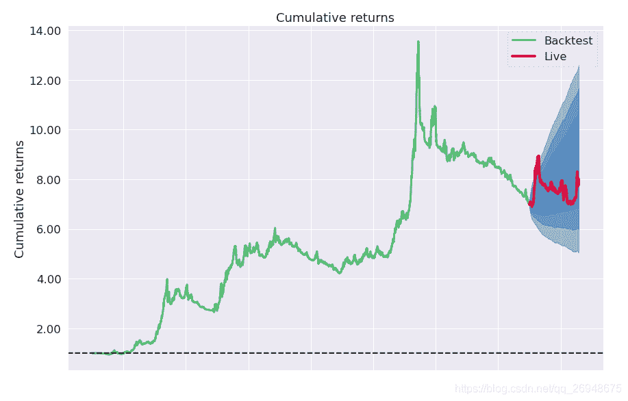
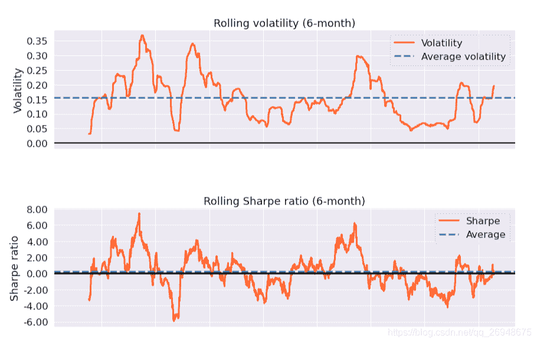
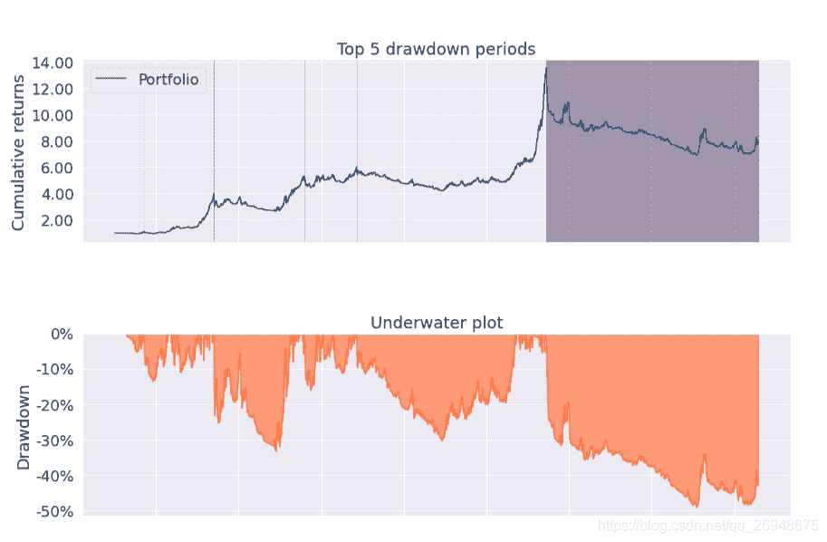
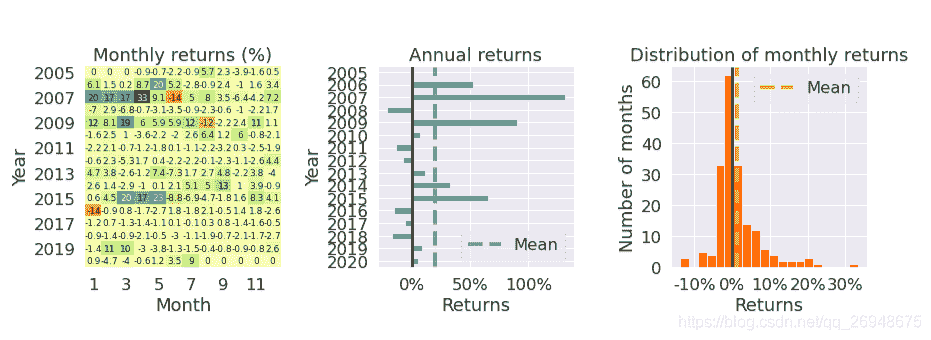

# 22、【股票策略】《151 trading strategies》中的 simple moving average

> 原文：<https://yunjinqi.blog.csdn.net/article/details/111657938>

《151 trading strategies》中的 3.11—strategy: simple moving average

这个策略的逻辑非常简单，入门级别。首先，定义一个均线，可以是简单均线或者是指数平滑均线，当价格大于均线的时候，做多或者平空；当价格小于均线的时候，做空或者平多。

#### 策略逻辑

我们使用全市场的 A 股日数据进行测试，只做多头。

首先，在当前交易日，分析一下，有多少个股票的均线已经存在，然后把资金平分成多少份；

当前一个收盘价小于均线，这个收盘价大于均线的时候，做多这支股票，根据资金，计算出应该买的股票数目；当前一个收盘价大于均线，当前的收盘价小于均线的时候，平仓这支股票。

假设初始资金有 1 个亿。

假设手续费为万分之二。

#### 策略实现难点

如果是测试一个股票，随随便便写几行代码就行了。但是涉及到全市场的股票，如何分配资金呢？在本文我们按照等资金分配到每支股票上，如何确定要分配给每支股票多少资金是一个难点。

很容易导致新出现的信号资金不足，导致开仓失败。

1.  如果回测结束的时候的股票数目平均分配资金，会导致前期资金利用效率不足。
2.  如果按照当前市场上拥有的股票数目分配资金，一般情况下，股票数目是慢慢增加的，在前期分配给每个股票的资金相对比较多，后期理论上要分配的资金相对少一些，如果全部股票都有信号，会导致后面这部分股票新开仓时资金不足。
3.  尝试实现动态等分资金法
    *   首先，统计一下现有的持仓股票的数目 n,以及总的目标股票数 m
    *   然后，获取当前总体上的 value，以及可用的现金 cash
    *   最后，使用 cash/(m-n)计算出，最多分给每个股票的资金,然后用 value/m 计算出一个应该分配给每个股票的资金，两者取一个较小的资金量
    *   求出来相应的资金之后，计算每个股票交易多少手就相对容易一些了

#### 测试代码

```py
import backtrader as bt
import datetime
import pandas as pd
import numpy as np
import os,sys
import copy
import talib
import math 
import warnings
warnings.filterwarnings("ignore")
import pyfolio as pf

# 我们使用的时候，直接用我们新的类读取数据就可以了。
class test_simple_ma_strategy(bt.Strategy):

    params = (('period',60),)

    def log(self, txt, dt=None):
        ''' Logging function fot this strategy'''
        dt = dt or self.datas[0].datetime.date(0)
        print('{}, {}'.format(dt.isoformat(), txt))

    def __init__(self):
        # Keep a reference to the "close" line in the data[0] dataseries
        self.bar_num=0
        # 保存均线数据
        self.stock_ma_dict={data._name:bt.talib.SMA(data.close,timeperiod=self.p.period) for data in self.datas}
        # 保存现有持仓的股票
        self.position_dict={}
        # 当前有交易的股票
        self.stock_dict={}

    def prenext(self):

        self.next()

    def next(self):
        # 假设有 100 万资金，每次成份股调整，每个股票使用 1 万元
        self.bar_num+=1

        # 前一交易日和当前的交易日
        pre_date = self.datas[0].datetime.date(-1).strftime("%Y-%m-%d")
        current_date     = self.datas[0].datetime.date(0).strftime("%Y-%m-%d")
        # 总的价值
        total_value      = self.broker.get_value()
        total_cash  = self.broker.get_cash()
        # 第一个数据是指数，校正时间使用，不能用于交易
        # 循环所有的股票,计算股票的数目
        for data in self.datas[1:]:
            data_date = data.datetime.date(0).strftime("%Y-%m-%d")
            # 如果两个日期相等，说明股票在交易
            if current_date == data_date:
                stock_name = data._name
                if stock_name not in self.stock_dict:
                    self.stock_dict[stock_name]=1
        total_target_stock_num = len(self.stock_dict)
        # 现在持仓的股票数目
        total_holding_stock_num = len(self.position_dict)
        # 计算理论上的手数
        if total_holding_stock_num<total_target_stock_num:
            now_value = total_cash/(total_target_stock_num-total_holding_stock_num)
            stock_value = total_value/total_target_stock_num
            now_value =min(now_value,stock_value)
        else:
            now_value = total_value/total_target_stock_num

        # 循环股票，开始交易
        for data in self.datas[1:]:
            data_date = data.datetime.date(0).strftime("%Y-%m-%d")
            # 如果两个日期相等，说明股票在交易
            if current_date == data_date:
                close = data.close[0]
                pre_close = data.close[-1]
                ma_info = self.stock_ma_dict[data._name]
                ma = ma_info[0]
                pre_ma = ma_info[-1]
                # 平多信号
                if pre_close>pre_ma and close<ma:
                    # 已经下单并且成交了
                    if self.getposition(data).size>0:
                        self.close(data)
                        if data._name in self.position_dict:
                            self.position_dict.pop(data._name)
                        # self.buy_list.remove(stock)
                    # 已经下单，但是订单没有成交
                    if data._name in self.position_dict and self.getposition(data).size==0:
                        order = self.position_dict[data._name]
                        self.cancel(order)
                        self.position_dict.pop(data._name) 
                # 开多信号,价格站到均线上方，并且持仓量为 0 
                if pre_close<pre_ma and close>ma and self.getposition(data).size==0 and data._name not in self.position_dict:
                    lots = now_value/data.close[0]
                    lots = int(lots/100)*100 # 计算能下的手数，取整数
                    order = self.buy(data,size = lots)
                    self.position_dict[data._name] = order

    def notify_order(self, order):

        if order.status in [order.Submitted, order.Accepted]:
            return

        if order.status == order.Rejected:
            self.log(f"Rejected : order_ref:{order.ref} data_name:{order.p.data._name}")

        if order.status == order.Margin:
            self.log(f"Margin : order_ref:{order.ref} data_name:{order.p.data._name}")

        if order.status == order.Cancelled:
            self.log(f"Concelled : order_ref:{order.ref} data_name:{order.p.data._name}")

        if order.status == order.Partial:
            self.log(f"Partial : order_ref:{order.ref} data_name:{order.p.data._name}")

        if order.status == order.Completed:
            if order.isbuy():
                self.log(f" BUY : data_name:{order.p.data._name} price : {order.executed.price} , cost : {order.executed.value} , commission : {order.executed.comm}")

            else:  # Sell
                self.log(f" SELL : data_name:{order.p.data._name} price : {order.executed.price} , cost : {order.executed.value} , commission : {order.executed.comm}")

    def notify_trade(self, trade):
        # 一个 trade 结束的时候输出信息
        if trade.isclosed:
            self.log('closed symbol is : {} , total_profit : {} , net_profit : {}' .format(
                            trade.getdataname(),trade.pnl, trade.pnlcomm))
            # self.trade_list.append([self.datas[0].datetime.date(0),trade.getdataname(),trade.pnl,trade.pnlcomm])

        if trade.isopen:
            self.log('open symbol is : {} , price : {} ' .format(
                            trade.getdataname(),trade.price))
    def stop(self):

        pass 

# 初始化 cerebro,获得一个实例
cerebro = bt.Cerebro()
# cerebro.broker = bt.brokers.BackBroker(shortcash=True)  # 0.5%
data_root = "/home/yun/data/stock/day/"
file_list =sorted(os.listdir(data_root))
params=dict(

    fromdate = datetime.datetime(2005,1,4),
    todate = datetime.datetime(2020,7,31),
    timeframe = bt.TimeFrame.Days,
    dtformat = ("%Y-%m-%d"),
    compression = 1,
    datetime = 0,
    open = 1,
    high = 2,
    low =3,
    close =4,
    volume =5,
    openinterest=-1)

# 加载指数数据
feed = bt.feeds.GenericCSVData(dataname = "/home/yun/data/stock/index.csv",**params)
# 添加数据到 cerebro
cerebro.adddata(feed, name = 'index')

# 读取数据
for file in file_list:
    #剔除不满一年的股票
    if len(pd.read_csv(data_root+file))<252:
        continue
    feed = bt.feeds.GenericCSVData(dataname = data_root+file,**params)
    # 添加数据到 cerebro
    cerebro.adddata(feed, name = file[:-4])
print("加载数据完毕")
# 添加手续费，按照万分之二收取
cerebro.broker.setcommission(commission=0.0002,stocklike=True)
# 设置初始资金为 1 亿
cerebro.broker.setcash(1_0000_0000)
# 添加策略
cerebro.addstrategy(test_simple_ma_strategy)
cerebro.addanalyzer(bt.analyzers.TotalValue, _name='_TotalValue')
cerebro.addanalyzer(bt.analyzers.PyFolio)
# 运行回测
results = cerebro.run()
# 打印相关信息
pyfoliozer = results[0].analyzers.getbyname('pyfolio')
returns, positions, transactions, gross_lev = pyfoliozer.get_pf_items()
pf.create_full_tear_sheet(
    returns,
    positions=positions,
    transactions=transactions,
    # gross_lev=gross_lev,
    live_start_date='2019-01-01',
    ) 
```

#### 测试结果

| Start date | 2005-01-04 |  |  |
| --: | --: | --: | --: |
| End date | 2020-07-30 |  |  |
| In-sample months | 162 |  |  |
| Out-of-sample months | 18 |  |  |
|  | In-sample | Out-of-sample | All |
| Annual return | 15.5% | 9.2% | 14.8% |
| Cumulative returns | 599.4% | 14.3% | 699.1% |
| Annual volatility | 17.3% | 16.5% | 17.3% |
| Sharpe ratio | 0.92 | 0.62 | 0.89 |
| Calmar ratio | 0.32 | 0.42 | 0.30 |
| Stability | 0.79 | 0.12 | 0.75 |
| Max drawdown | -48.4% | -21.9% | -49.1% |
| Omega ratio | 1.21 | 1.14 | 1.20 |
| Sortino ratio | 1.24 | 0.83 | 1.20 |
| Skew | -1.11 | -0.85 | -1.09 |
| Kurtosis | 7.85 | 7.33 | 7.81 |
| Tail ratio | 1.08 | 1.04 | 1.08 |
| Daily value at risk | -2.1% | -2.0% | -2.1% |
| Gross leverage | 0.53 | 0.52 | 0.53 |
| Daily turnover | 12.4% | 14.3% | 12.6% |

| Worst drawdown periods | Net drawdown in % | Peak date | Valley date | Recovery date | Duration |
| --: | --: | --: | --: | --: | --: |
| 0 | 49.11 | 2015-06-12 | 2019-01-31 | NaT | NaN |
| 1 | 33.24 | 2007-05-29 | 2008-11-25 | 2007-05-29 | 486 |
| 2 | 30.21 | 2010-11-10 | 2012-11-29 | 2010-11-10 | 1011 |
| 3 | 15.98 | 2009-08-05 | 2009-09-29 | 2009-08-05 | 79 |
| 4 | 13.51 | 2005-09-19 | 2005-12-06 | 2005-09-19 | 146 |






#### 测试结果简单分析

这个策略在 2015 年的大牛市的时候出现了净值的快速上涨和快速下跌，表现不稳定，尤其是近些年一直亏损。可以考虑增加或者减少均线的周期，看一下策略绩效是否会明显改进。