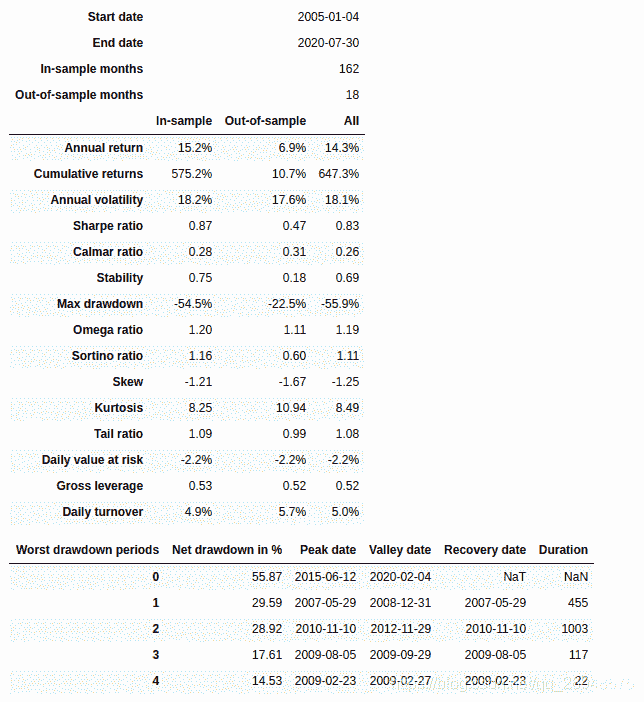
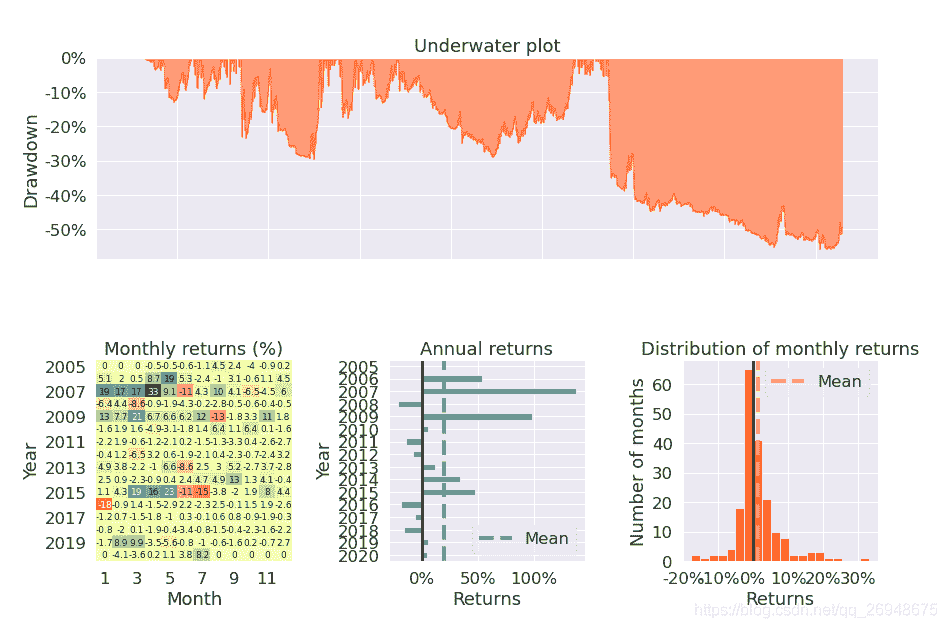
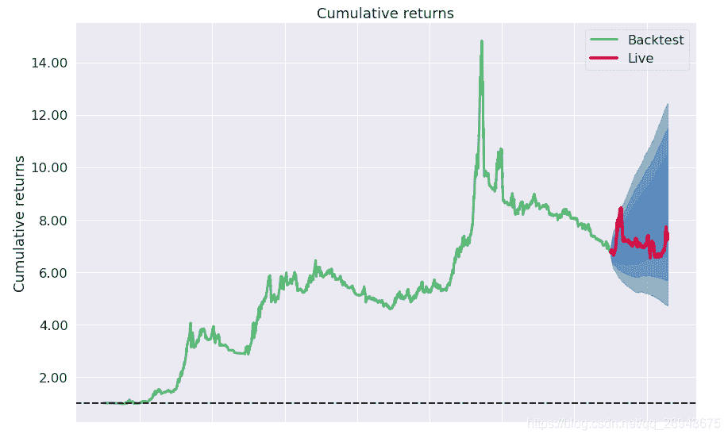
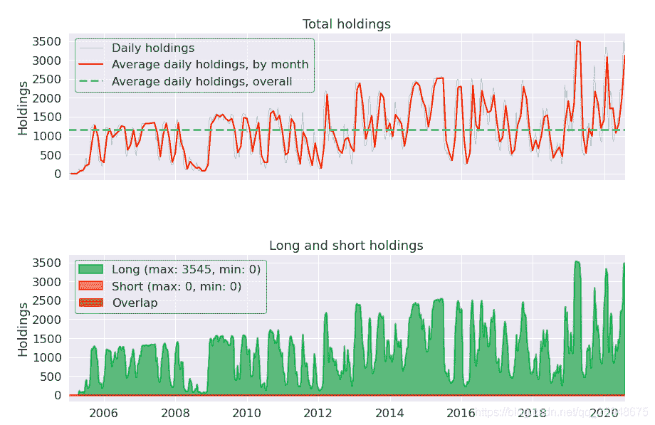

# 23、【股票策略】《151 trading strategies》中的 two moving averages-在 A 股全部股票上测试双均线策略

> 原文：<https://yunjinqi.blog.csdn.net/article/details/111712818>

《151 trading strategies》中的 3.12—strategy: two moving averages

这个策略的逻辑非常简单，入门级别。并且和上个单均线的策略逻辑很像，可以参考上个策略：[《151 trading strategies》中的 simple moving average](https://yunjinqi.blog.csdn.net/article/details/111657938)

#### 策略逻辑

我们使用全市场的 A 股日数据进行测试，只做多头。

资金管理方法和上个策略一样。

首先，使用 10 日和 60 日均线，当 10 日均线金叉 60 日均线的时候，做多；当 10 日均线死叉 60 日均线的时候，平多。

假设初始资金有 1 个亿。

假设手续费为万分之二。

#### 策略代码

```py
import backtrader as bt
import datetime
import pandas as pd
import numpy as np
import os,sys
import copy
import talib
import math 
import warnings
warnings.filterwarnings("ignore")
import pyfolio as pf

# 我们使用的时候，直接用我们新的类读取数据就可以了。
class test_two_ma_strategy(bt.Strategy):

    params = (('short_period',10),
              ("long_period",60),
             )

    def log(self, txt, dt=None):
        ''' Logging function fot this strategy'''
        dt = dt or self.datas[0].datetime.date(0)
        print('{}, {}'.format(dt.isoformat(), txt))

    def __init__(self):
        # Keep a reference to the "close" line in the data[0] dataseries
        self.bar_num=0
        # 保存均线数据
        # self.stock_short_ma_dict={data._name:bt.talib.SMA(data.close,timeperiod=self.p.short_period) for data in self.datas}
        # self.stock_short_ma_dict={data._name:bt.talib.SMA(data.close,timeperiod=self.p.long_period) for data in self.datas}
        self.stock_ma_diff_dict = {data._name:bt.talib.SMA(data.close,timeperiod=self.p.short_period)-
                                   bt.talib.SMA(data.close,timeperiod=self.p.long_period) for data in self.datas}
        # 保存现有持仓的股票
        self.position_dict={}
        # 当前有交易的股票
        self.stock_dict={}

    def prenext(self):

        self.next()

    def next(self):
        # 假设有 100 万资金，每次成份股调整，每个股票使用 1 万元
        self.bar_num+=1

        # 前一交易日和当前的交易日
        pre_date = self.datas[0].datetime.date(-1).strftime("%Y-%m-%d")
        current_date = self.datas[0].datetime.date(0).strftime("%Y-%m-%d")
        # 总的价值
        total_value = self.broker.get_value()
        total_cash  = self.broker.get_cash()
        # 第一个数据是指数，校正时间使用，不能用于交易
        # 循环所有的股票,计算股票的数目
        for data in self.datas[1:]:
            data_date = data.datetime.date(0).strftime("%Y-%m-%d")
            # 如果两个日期相等，说明股票在交易
            if current_date == data_date:
                stock_name = data._name
                if stock_name not in self.stock_dict:
                    self.stock_dict[stock_name]=1
        total_target_stock_num = len(self.stock_dict)
        # 现在持仓的股票数目
        total_holding_stock_num = len(self.position_dict)
        # 计算理论上的手数
        if total_holding_stock_num<total_target_stock_num:
            now_value = total_cash/(total_target_stock_num-total_holding_stock_num)
            stock_value = total_value/total_target_stock_num
            now_value =min(now_value,stock_value)
        else:
            now_value = total_value/total_target_stock_num

        # 循环股票，开始交易
        for data in self.datas[1:]:
            data_date = data.datetime.date(0).strftime("%Y-%m-%d")
            # 如果两个日期相等，说明股票在交易
            if current_date == data_date:
                ma_diff_info = self.stock_ma_diff_dict[data._name]
                ma_diff = ma_diff_info[0]
                pre_ma_diff = ma_diff_info[-1]
                # 平多信号
                if pre_ma_diff>0 and ma_diff<0:
                    # 已经下单并且成交了
                    if self.getposition(data).size>0:
                        self.close(data)
                        if data._name in self.position_dict:
                            self.position_dict.pop(data._name)
                        # self.buy_list.remove(stock)
                    # 已经下单，但是订单没有成交
                    if data._name in self.position_dict and self.getposition(data).size==0:
                        order = self.position_dict[data._name]
                        self.cancel(order)
                        self.position_dict.pop(data._name) 
                # 开多信号,价格站到均线上方，并且持仓量为 0 
                if pre_ma_diff<0 and ma_diff>0 and self.getposition(data).size==0 :
                    lots = now_value/data.close[0]
                    lots = int(lots/100)*100 # 计算能下的手数，取整数
                    order = self.buy(data,size = lots)
                    self.position_dict[data._name] = order

    def notify_order(self, order):

        if order.status in [order.Submitted, order.Accepted]:
            return

        if order.status == order.Rejected:
            self.log(f"Rejected : order_ref:{order.ref} data_name:{order.p.data._name}")

        if order.status == order.Margin:
            self.log(f"Margin : order_ref:{order.ref} data_name:{order.p.data._name}")

        if order.status == order.Cancelled:
            self.log(f"Concelled : order_ref:{order.ref} data_name:{order.p.data._name}")

        if order.status == order.Partial:
            self.log(f"Partial : order_ref:{order.ref} data_name:{order.p.data._name}")

        if order.status == order.Completed:
            if order.isbuy():
                self.log(f" BUY : data_name:{order.p.data._name} price : {order.executed.price} , cost : {order.executed.value} , commission : {order.executed.comm}")

            else:  # Sell
                self.log(f" SELL : data_name:{order.p.data._name} price : {order.executed.price} , cost : {order.executed.value} , commission : {order.executed.comm}")

    def notify_trade(self, trade):
        # 一个 trade 结束的时候输出信息
        if trade.isclosed:
            self.log('closed symbol is : {} , total_profit : {} , net_profit : {}' .format(
                            trade.getdataname(),trade.pnl, trade.pnlcomm))
            # self.trade_list.append([self.datas[0].datetime.date(0),trade.getdataname(),trade.pnl,trade.pnlcomm])

        if trade.isopen:
            self.log('open symbol is : {} , price : {} ' .format(
                            trade.getdataname(),trade.price))
    def stop(self):

        pass 

# 初始化 cerebro,获得一个实例
cerebro = bt.Cerebro()
# cerebro.broker = bt.brokers.BackBroker(shortcash=True)  # 0.5%
data_root = "/home/yun/data/stock/day/"
file_list =sorted(os.listdir(data_root))
params=dict(

    fromdate = datetime.datetime(2005,1,4),
    todate = datetime.datetime(2020,7,31),
    timeframe = bt.TimeFrame.Days,
    dtformat = ("%Y-%m-%d"),
    compression = 1,
    datetime = 0,
    open = 1,
    high = 2,
    low =3,
    close =4,
    volume =5,
    openinterest=-1)

# 加载指数数据
feed = bt.feeds.GenericCSVData(dataname = "/home/yun/data/stock/index.csv",**params)
# 添加数据到 cerebro
cerebro.adddata(feed, name = 'index')

# 读取数据
for file in file_list:
    #剔除不满一年的股票
    if len(pd.read_csv(data_root+file))<252:
        continue
    feed = bt.feeds.GenericCSVData(dataname = data_root+file,**params)
    # 添加数据到 cerebro
    cerebro.adddata(feed, name = file[:-4])
print("加载数据完毕")
# 添加手续费，按照万分之二收取
cerebro.broker.setcommission(commission=0.0002,stocklike=True)
# 设置初始资金为 1 亿
cerebro.broker.setcash(1_0000_0000)
# 添加策略
cerebro.addstrategy(test_two_ma_strategy)
cerebro.addanalyzer(bt.analyzers.TotalValue, _name='_TotalValue')
cerebro.addanalyzer(bt.analyzers.PyFolio)
# 运行回测
results = cerebro.run()
# 打印相关信息
pyfoliozer = results[0].analyzers.getbyname('pyfolio')
returns, positions, transactions, gross_lev = pyfoliozer.get_pf_items()
pf.create_full_tear_sheet(
    returns,
    positions=positions,
    transactions=transactions,
    # gross_lev=gross_lev,
    live_start_date='2019-01-01',
    ) 
```

#### 测试结果







#### 策略分析

这个策略的结果和单均线策略差不多，并没有重大的改善。优化参数可能使得结果会好一些，但是相对来说，优化策略交易的逻辑，可能效果更好。可以考虑放弃这个策略。