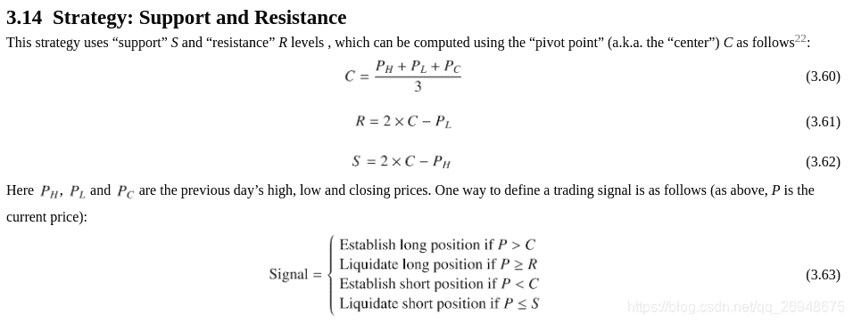
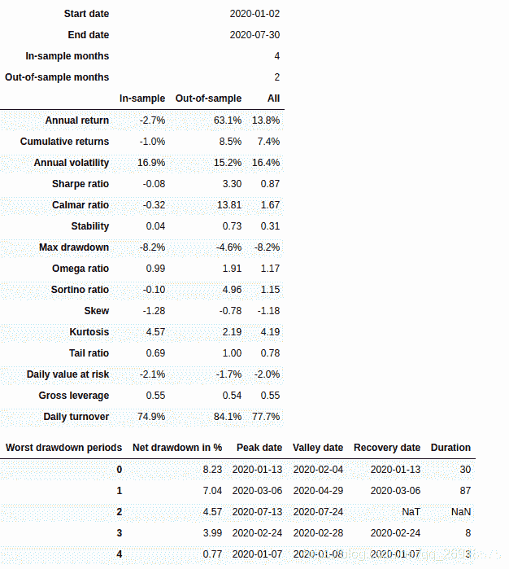
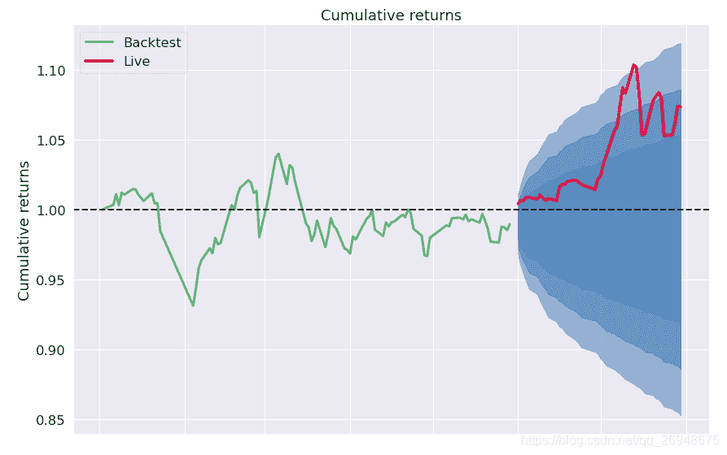
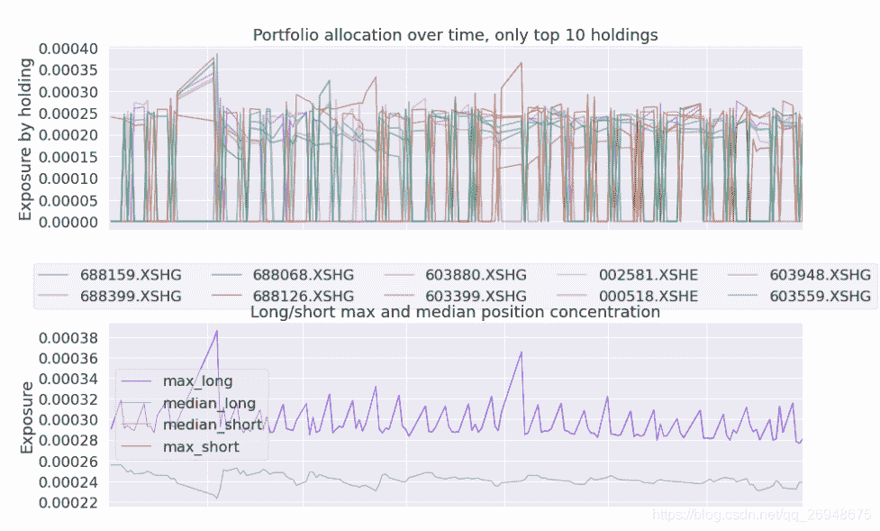
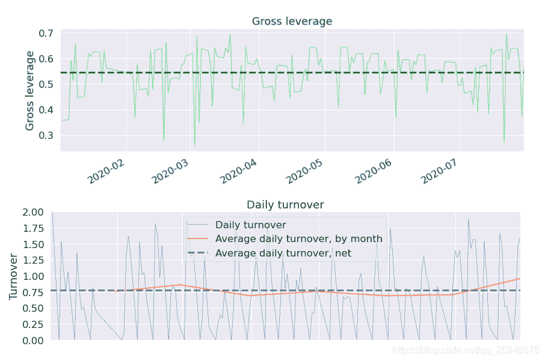
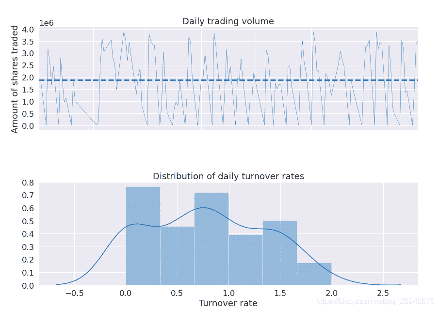
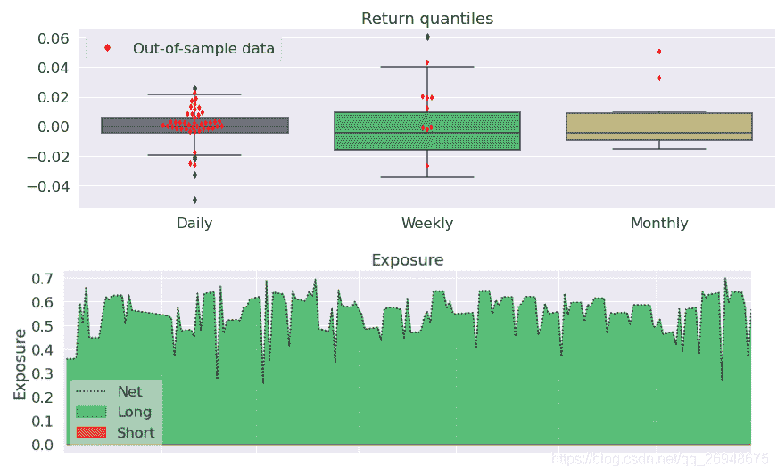
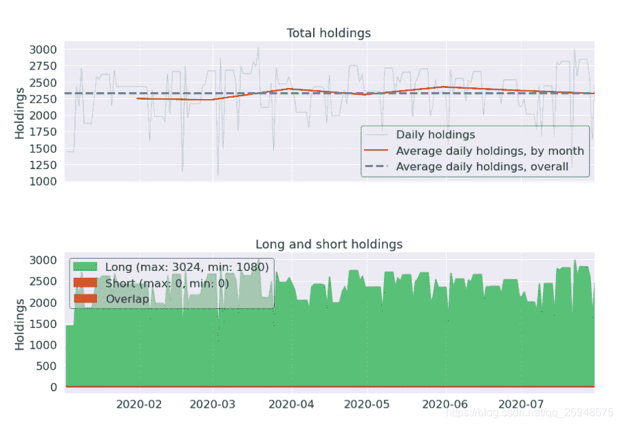
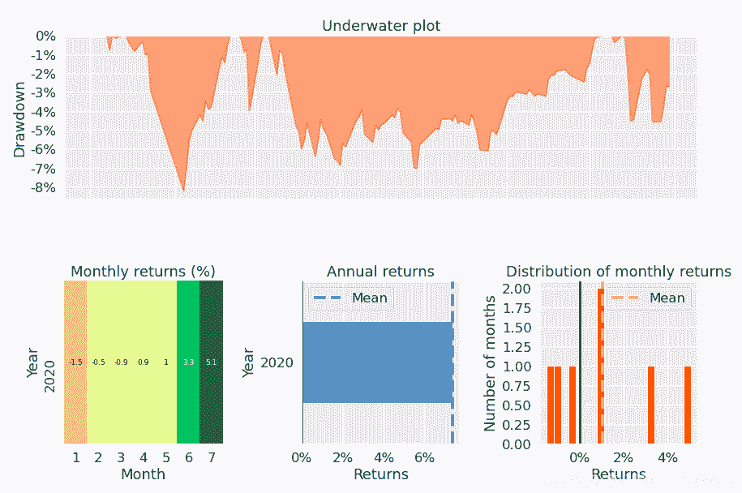

# 30、【backtrader 股票策略】《151 trading strategies》中的支撑与阻力策略(support and resistance)

> 原文：<https://yunjinqi.blog.csdn.net/article/details/111828267>



在《151 trading strategies》中的 3.14 节，提到了一个关于支撑与阻力的策略，在本策略中，将尝试在全 A 股中进行测试这个策略，本节主要包含四个部分：

*   策略逻辑的说明
*   策略实现代码
*   策略测试结果
*   策略绩效的简单分析

#### 策略逻辑

我们使用全市场的 A 股日数据进行测试，只做多头。

资金管理方法和上个策略一样。

假设初始资金有 1 个亿。

假设手续费为万分之二。

首先，根据昨日的最高价、最低价、收盘价按照 3.60 求出来 C,按照 3.61 求出来 R，当今日价格大于 C 的时候，如果没有多头仓位，就做多；当今日价格大于等于 R 的时候，如果有多头仓位，就平多；

#### 策略实现代码

```py
import backtrader as bt
import datetime
import pandas as pd
import numpy as np
import os,sys
import copy
import talib
import math 
import warnings
warnings.filterwarnings("ignore")
import pyfolio as pf

# 我们使用的时候，直接用我们新的类读取数据就可以了。
class test_two_ma_strategy(bt.Strategy):

    params = (('short_period',10),
              ("middle_period",60),
              ("long_period",250),
             )

    def log(self, txt, dt=None):
        ''' Logging function fot this strategy'''
        dt = dt or self.datas[0].datetime.date(0)
        print('{}, {}'.format(dt.isoformat(), txt))

    def __init__(self):
        # Keep a reference to the "close" line in the data[0] dataseries
        self.bar_num=0
        # 保存均线数据
        # self.stock_short_ma_dict={data._name:bt.talib.SMA(data.close,timeperiod=self.p.short_period) for data in self.datas}
        # 当前有交易的股票
        self.stock_dict={}
        # 现在持仓的股票
        self.position_dict = {}

    def prenext(self):

        self.next()

    def next(self):
        # 假设有 100 万资金，每次成份股调整，每个股票使用 1 万元
        self.bar_num+=1

        # 前一交易日和当前的交易日
        pre_date = self.datas[0].datetime.date(-1).strftime("%Y-%m-%d")
        current_date = self.datas[0].datetime.date(0).strftime("%Y-%m-%d")
        # 总的价值
        total_value = self.broker.get_value()
        total_cash  = self.broker.get_cash()
        # 第一个数据是指数，校正时间使用，不能用于交易
        # 循环所有的股票,计算股票的数目
        self.position_dict = {}
        for data in self.datas[1:]:
            try:
                data_date = data.datetime.date(0).strftime("%Y-%m-%d")
            except:
                continue 
            size = self.getposition(data).size
            if size>0:
                self.position_dict[data._name]=size
            # 如果两个日期相等，说明股票在交易
            if current_date == data_date:
                self.stock_dict[data._name]=1

        total_target_stock_num = len(self.stock_dict)
        # 现在持仓的股票数目
        total_holding_stock_num = len(self.position_dict)
        # 计算理论上的每个股票的持有的市值
        if total_holding_stock_num<total_target_stock_num:
            now_value = total_cash/(total_target_stock_num-total_holding_stock_num)
            stock_value = total_value/total_target_stock_num
            now_value =min(now_value,stock_value)
        else:
            now_value = total_value/total_target_stock_num

        # 循环股票，开始交易
        for data in self.datas[1:]:
            try:
                data_date = data.datetime.date(0).strftime("%Y-%m-%d")
            except:
                continue 
            # 如果两个日期相等，说明股票在交易
            if current_date == data_date:
                # 三条均线，保存成 line 的数据结构
                pre_high = data.high[-1]
                pre_low = data.low[-1]
                pre_close = data.close[-1]
                # c 的价格
                C_price = (pre_high+pre_low+pre_close)/3
                # R_price 
                R_price = 2*C_price - pre_low
                # 当前的仓位
                size = self.getposition(data).size

                # 平多信号
                if size>0:
                    order = self.sell(data,size = size,exectype=bt.Order.Limit, price=R_price,
                                     valid=self.datas[0].datetime.date(0)+datetime.timedelta(days=1)) 
                # 开多信号,设置一个 C_price 的买入止损单，当价格达到 C_price 的时候买入
                if  size==0 :
                    lots = now_value/data.close[0]
                    lots = int(lots/100)*100 # 计算能下的手数，取整数
                    order = self.buy(data,size = lots,exectype=bt.Order.Stop, price=C_price,
                                     valid=self.datas[0].datetime.date(0)+datetime.timedelta(days=1))
                    # self.position_dict[data._name] = order

    def notify_order(self, order):

        if order.status in [order.Submitted, order.Accepted]:
            return

        if order.status == order.Rejected:
            self.log(f"Rejected : order_ref:{order.ref} data_name:{order.p.data._name}")

        if order.status == order.Margin:
            self.log(f"Margin : order_ref:{order.ref} data_name:{order.p.data._name}")

        if order.status == order.Cancelled:
            self.log(f"Concelled : order_ref:{order.ref} data_name:{order.p.data._name}")

        if order.status == order.Partial:
            self.log(f"Partial : order_ref:{order.ref} data_name:{order.p.data._name}")

        if order.status == order.Completed:
            if order.isbuy():
                self.log(f" BUY : data_name:{order.p.data._name} price : {order.executed.price} , cost : {order.executed.value} , commission : {order.executed.comm}")

            else:  # Sell
                self.log(f" SELL : data_name:{order.p.data._name} price : {order.executed.price} , cost : {order.executed.value} , commission : {order.executed.comm}")

    def notify_trade(self, trade):
        # 一个 trade 结束的时候输出信息
        if trade.isclosed:
            self.log('closed symbol is : {} , total_profit : {} , net_profit : {}' .format(
                            trade.getdataname(),trade.pnl, trade.pnlcomm))
            # self.trade_list.append([self.datas[0].datetime.date(0),trade.getdataname(),trade.pnl,trade.pnlcomm])

        if trade.isopen:
            self.log('open symbol is : {} , price : {} ' .format(
                            trade.getdataname(),trade.price))
    def stop(self):

        pass 

# 初始化 cerebro,获得一个实例
cerebro = bt.Cerebro()
# cerebro.broker = bt.brokers.BackBroker(shortcash=True)  # 0.5%
data_root = "/home/yun/data/stock/day/"
file_list =sorted(os.listdir(data_root))
params=dict(

    fromdate = datetime.datetime(2020,1,1),
    todate = datetime.datetime(2020,7,30),
    timeframe = bt.TimeFrame.Days,
    dtformat = ("%Y-%m-%d"),
    compression = 1,
    datetime = 0,
    open = 1,
    high = 2,
    low =3,
    close =4,
    volume =5,
    openinterest=-1)

# 加载指数数据
df = pd.read_csv("/home/yun/data/stock/index.csv")
df.columns = ['datetime','open','high','low','close','volume','openinterest']
df.index = pd.to_datetime(df['datetime'])
df = df[['open','high','low','close','volume','openinterest']]
df = df[(df.index<=params['todate'])&(df.index>=params['fromdate'])]
# feed = bt.feeds.GenericCSVData(dataname = "/home/yun/data/stock/index.csv",**params)
feed = bt.feeds.PandasDirectData(dataname = df)
# 添加数据到 cerebro
cerebro.adddata(feed, name = 'index')

# 读取数据
for file in file_list:
    df = pd.read_csv(data_root+file)
    df.columns = ['datetime','open','high','low','close','volume','openinterest']
    df.index = pd.to_datetime(df['datetime'])
    df = df[['open','high','low','close','volume','openinterest']]
    df = df[(df.index<=params['todate'])&(df.index>=params['fromdate'])]
    if len(df)==0:
        continue 
    # feed = bt.feeds.GenericCSVData(dataname = data_root+file,**params)
    feed = bt.feeds.PandasDirectData(dataname = df)
    # 添加数据到 cerebro
    cerebro.adddata(feed, name = file[:-4])
print("加载数据完毕")
# 添加手续费，按照万分之二收取
cerebro.broker.setcommission(commission=0.0002,stocklike=True)
# 设置初始资金为 1 亿
cerebro.broker.setcash(1_0000_0000)
# 添加策略
cerebro.addstrategy(test_two_ma_strategy)
cerebro.addanalyzer(bt.analyzers.TotalValue, _name='_TotalValue')
cerebro.addanalyzer(bt.analyzers.PyFolio)
# 运行回测
results = cerebro.run()
# 打印相关信息
pyfoliozer = results[0].analyzers.getbyname('pyfolio')
returns, positions, transactions, gross_lev = pyfoliozer.get_pf_items()
pf.create_full_tear_sheet(
    returns,
    positions=positions,
    transactions=transactions,
    # gross_lev=gross_lev,
    live_start_date='2020-06-01',
    ) 
```

#### 测试结果








#### 策略分析

使用 stop order 和 limit order 导致回测效率都降低好多，原先普通的策略使用 market order,全市场 A 股数据从 05 年跑到 2020 年上半年才用一二十分钟，结果这个策略，跑了这半年的数据都要快一个小时了，明天白天跑一天，看能不能把这个结果回测出来。

这个策略总体上是蛮有意义的，后续考虑和狗股策略的选股结合起来，看会不会有更好的效果。

总体看起来，潜力不错，适合深入研究。

* * *

智慧、心灵、财富，总要有一个在路上，愿我们能在人生的道路上，不断成长、不断成熟～～～

感兴趣可以关注我的专栏：

[my_quant_study_note](https://www.zhihu.com/column/quant-study)：分享一些关于量化投资、量化交易相关的思考

[backtrader 量化投资回测与交易](https://zhuanlan.zhihu.com/c_1189276087837011968)：本专栏免费，分享 backtrader 相关的内容。

[量化投资神器-backtrader 源码解析-从入门到精通：本专栏目前收费 99 元，预计更新 100 篇策略+20 篇 backtrader 讲解+80 篇源代码分析。](https://link.zhihu.com/?target=https%3A//yunjinqi.blog.csdn.net/article/details/107594251)