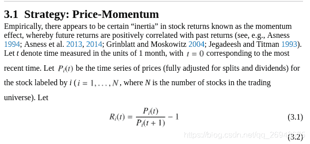
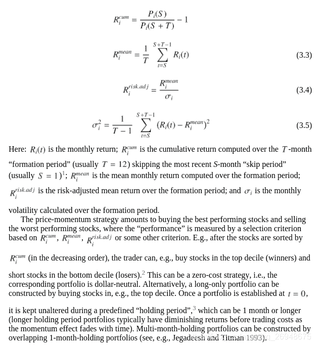
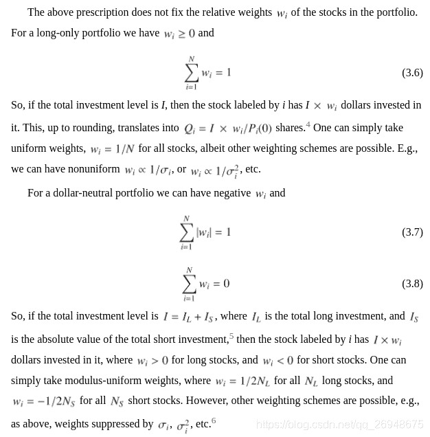
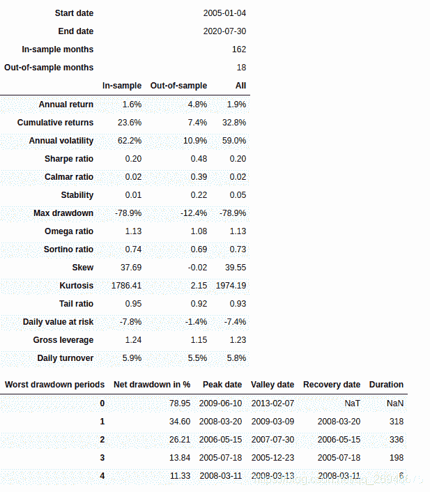
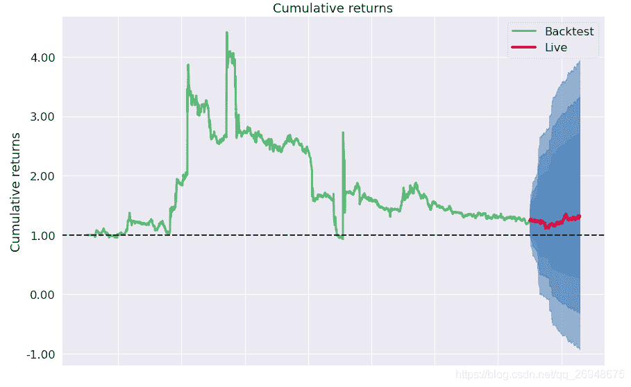
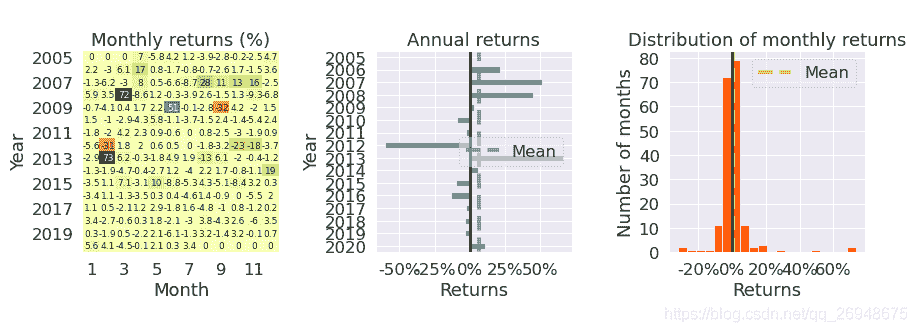

# 37、【backtrader 股票策略 】《151 trading strategies》中的价格动量策略(price-momentum)

> 原文：<https://yunjinqi.blog.csdn.net/article/details/113075382>


在《151 trading strategies》中的 3.1 节，提到了一个动量策略，在本策略中，将尝试在全 A 股中进行测试这个策略，本节主要包含四个部分：

*   策略逻辑的说明
*   策略实现代码
*   策略测试结果
*   策略绩效的简单分析

#### 策略逻辑说明

动量策略是一个常见的策略类型，包括绝对动量和相对动量。绝对动量是指在时间序列上，如果过去一段时间的收益率为正，那么就持有多头；如果过去一段时间的收益率为负数，那么就持有空头。相对动量，是分析过去一段时间中，多个股票上的收益率，做多收益率最高的一组；做空收益率最低的一组。这个策略使用的是相对动量策略。

1.  和前几个策略的资金、资金分配、交易手续费都是一样的，不一样的是开平仓信号。

2.  我们使用全市场的 A 股日数据进行测试，做多头，也做空头。多头和空头都占用资金。

3.  假设初始资金有 1 个亿，手续费为万分之二。

首先，计算过去 60 个交易日股票的累计收益率，根据累计收益率的高低，把股票分为 10 组，做多收益率高的一组，做空收益率低的一组。资金在各个股票之间等权重分配。缺点在于忽略停牌的交易日，比如，这只股票在过去 30 天停牌了，计算累计收益率的时候，依然是计算过去的有 bar 的 60 个交易日。

#### 策略实现代码

```py
import backtrader as bt
import datetime
import pandas as pd
import numpy as np
import os,sys
import copy
import talib
import math 
import warnings
warnings.filterwarnings("ignore")
import pyfolio as pf

# 我们使用的时候，直接用我们新的类读取数据就可以了。
class test_two_ma_strategy(bt.Strategy):

    params = (('period',30),
              ('hold_percent',0.02)
             )

    def log(self, txt, dt=None):
        ''' Logging function fot this strategy'''
        dt = dt or self.datas[0].datetime.date(0)
        print('{}, {}'.format(dt.isoformat(), txt))

    def __init__(self):
        # Keep a reference to the "close" line in the data[0] dataseries
        self.bar_num=0    
        # 保存现有持仓的股票
        self.position_dict={}
        # 当前有交易的股票
        self.stock_dict={}

    def prenext(self):

        self.next()

    def next(self):
        # 假设有 100 万资金，每次成份股调整，每个股票使用 1 万元
        self.bar_num+=1
        # 前一交易日和当前的交易日
        pre_date = self.datas[0].datetime.date(-1).strftime("%Y-%m-%d")
        current_date = self.datas[0].datetime.date(0).strftime("%Y-%m-%d")
        # 总的价值
        total_value = self.broker.get_value()
        total_cash  = self.broker.get_cash()
        self.log(f"total_value : {total_value}")
        # 第一个数据是指数，校正时间使用，不能用于交易
        # 循环所有的股票,计算股票的数目
        for data in self.datas[1:]:
            data_date = data.datetime.date(0).strftime("%Y-%m-%d")
            # 如果两个日期相等，说明股票在交易
            if current_date == data_date:
                stock_name = data._name
                if stock_name not in self.stock_dict:
                    self.stock_dict[stock_name]=1
        total_target_stock_num = len(self.stock_dict)
        # 现在持仓的股票数目
        total_holding_stock_num = len(self.position_dict)
        # 计算理论上的手数
        now_value = total_value/int(total_target_stock_num*self.p.hold_percent*2)
        # 如果今天是调仓日
        if self.bar_num%self.p.period == 0:

            # 循环股票，平掉所有的股票，计算现在可以交易的股票的累计收益率
            result = []
            for data in self.datas[1:]:
                data_date = data.datetime.date(0).strftime("%Y-%m-%d")
                size = self.getposition(data).size
                # 如果有仓位
                if size!=0:
                    self.close(data)
                    if data._name in self.position_dict:
                        self.position_dict.pop(data._name)

                # 已经下单，但是订单没有成交
                if data._name in self.position_dict and size==0:
                    order = self.position_dict[data._name]
                    self.cancel(order)
                    self.position_dict.pop(data._name) 
                # 如果两个日期相等，说明股票在交易,就计算收益率，进行排序
                if current_date == data_date:
                    close_info = data.close
                    if len(close_info)>self.p.period:
                        now_close = close_info[0]
                        pre_close = close_info[-self.p.period+1]
                        cumsum_rate = (now_close - pre_close)/pre_close
                        result.append([data,cumsum_rate])
            # 根据计算出来的累计收益率进行排序，选出前 10%的股票做多，后 10%的股票做空
            new_result = sorted(result,key=lambda x:x[1])
            num = int(self.p.hold_percent * total_target_stock_num)
            sell_list = new_result[:num]
            buy_list = new_result[-num:]
            # 根据计算出来的信号，买卖相应的股票
            for data,cumsum_rate in buy_list:
                lots = now_value/data.close[0]
                lots = int(lots/100)*100 # 计算能下的手数，取整数
                order = self.buy(data,size = lots)
                self.position_dict[data._name] = order
            for data,cumsum_rate in sell_list:
                lots = now_value/data.close[0]
                lots = int(lots/100)*100 # 计算能下的手数，取整数
                order = self.sell(data,size = lots)
                self.position_dict[data._name] = order

    def notify_order(self, order):

        if order.status in [order.Submitted, order.Accepted]:
            return

        if order.status == order.Rejected:
            self.log(f"Rejected : order_ref:{order.ref} data_name:{order.p.data._name}")

        if order.status == order.Margin:
            self.log(f"Margin : order_ref:{order.ref} data_name:{order.p.data._name}")

        if order.status == order.Cancelled:
            self.log(f"Concelled : order_ref:{order.ref} data_name:{order.p.data._name}")

        if order.status == order.Partial:
            self.log(f"Partial : order_ref:{order.ref} data_name:{order.p.data._name}")

        if order.status == order.Completed:
            if order.isbuy():
                self.log(f" BUY : data_name:{order.p.data._name} price : {order.executed.price} , cost : {order.executed.value} , commission : {order.executed.comm}")

            else:  # Sell
                self.log(f" SELL : data_name:{order.p.data._name} price : {order.executed.price} , cost : {order.executed.value} , commission : {order.executed.comm}")

    def notify_trade(self, trade):
        # 一个 trade 结束的时候输出信息
        if trade.isclosed:
            self.log('closed symbol is : {} , total_profit : {} , net_profit : {}' .format(
                            trade.getdataname(),trade.pnl, trade.pnlcomm))
            # self.trade_list.append([self.datas[0].datetime.date(0),trade.getdataname(),trade.pnl,trade.pnlcomm])

        if trade.isopen:
            self.log('open symbol is : {} , price : {} ' .format(
                            trade.getdataname(),trade.price))
    def stop(self):

        pass 

# 初始化 cerebro,获得一个实例
cerebro = bt.Cerebro()
# cerebro.broker = bt.brokers.BackBroker(shortcash=True)  # 0.5%
data_root = "/home/yun/data/stock/day/"
file_list =sorted(os.listdir(data_root))
params=dict(

    fromdate = datetime.datetime(2005,1,4),
    todate = datetime.datetime(2020,7,31),
    timeframe = bt.TimeFrame.Days,
    dtformat = ("%Y-%m-%d"),
    compression = 1,
    datetime = 0,
    open = 1,
    high = 2,
    low =3,
    close =4,
    volume =5,
    openinterest=-1)

# 加载指数数据
feed = bt.feeds.GenericCSVData(dataname = "/home/yun/data/stock/index.csv",**params)
# 添加数据到 cerebro
cerebro.adddata(feed, name = 'index')

# 读取数据
for file in file_list:
    #剔除不满一年的股票
    if len(pd.read_csv(data_root+file))<252:
        continue
    feed = bt.feeds.GenericCSVData(dataname = data_root+file,**params)
    # 添加数据到 cerebro
    cerebro.adddata(feed, name = file[:-4])
print("加载数据完毕")
# 添加手续费，按照万分之二收取
cerebro.broker.setcommission(commission=0.0002,stocklike=True)
# 设置初始资金为 1 亿
cerebro.broker.setcash(1_0000_0000)
# 添加策略
cerebro.addstrategy(test_two_ma_strategy)
cerebro.addanalyzer(bt.analyzers.TotalValue, _name='_TotalValue')
cerebro.addanalyzer(bt.analyzers.PyFolio)
# 运行回测
results = cerebro.run()
# 打印相关信息
pyfoliozer = results[0].analyzers.getbyname('pyfolio')
returns, positions, transactions, gross_lev = pyfoliozer.get_pf_items()
pf.create_full_tear_sheet(
    returns,
    positions=positions,
    transactions=transactions,
    # gross_lev=gross_lev,
    live_start_date='2019-01-01',
    ) 
```

#### 策略绩效




#### 策略简单分析

从策略的绩效上来看，基于价格动量，使用多空对冲的策略来看，其实效果并不好。然而，动量策略，作为一个长久有效的策略来看，有值得研究的地方。

改进的方向可以考虑：

1.  使用不同的计算动量的方法
2.  使用不同的回顾周期和持有周期
3.  对不同的行业或者不同的板块进行动量策略
4.  把动量因子和其他因子进行结合

在实践中，基本上一个策略，研究一两个月是很正常的事情。本文只是起到抛砖引玉的作用。

#### 股票数据

百度网盘：链接: https://pan.baidu.com/s/1yIps-8tOfi5m57qIwLFSAw 提取码: kksu 复制这段内容后打开百度网盘手机 App，操作更方便哦

* * *

智慧、心灵、财富，总要有一个在路上，愿我们能在人生的道路上，不断成长、不断成熟～～～

感兴趣可以关注我的专栏：

[my_quant_study_note](https://www.zhihu.com/column/quant-study)：分享一些关于量化投资、量化交易相关的思考

[backtrader 量化投资回测与交易](https://zhuanlan.zhihu.com/c_1189276087837011968)：本专栏免费，分享 backtrader 相关的内容。

[量化投资神器-backtrader 源码解析-从入门到精通：本专栏目前收费 99 元，预计更新 100 篇策略+20 篇 backtrader 讲解+80 篇源代码分析。](https://link.zhihu.com/?target=https%3A//yunjinqi.blog.csdn.net/article/details/107594251)