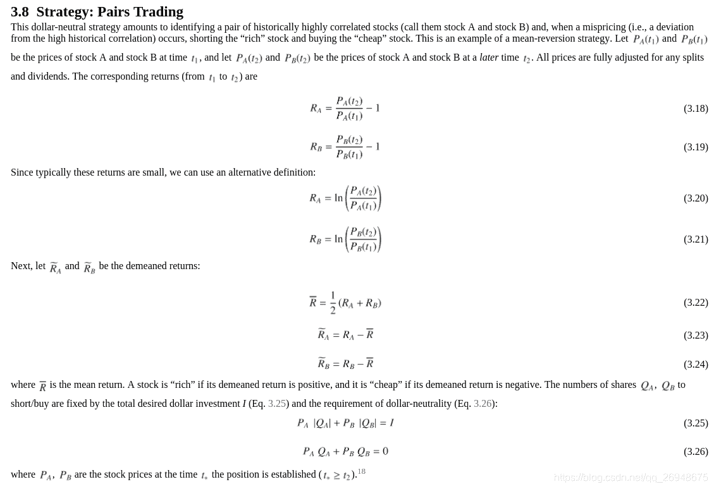
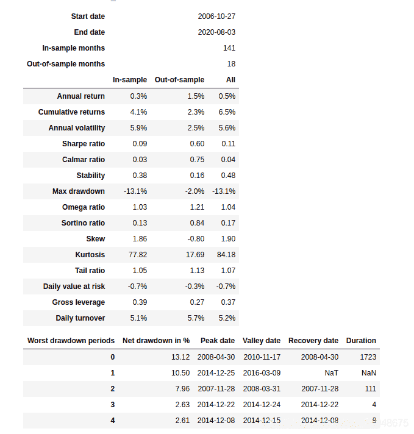
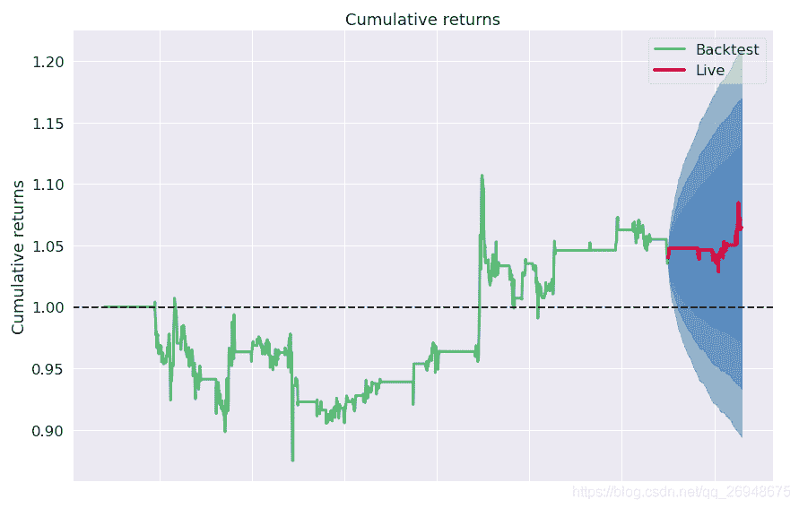

# 58、【backtrader 股票策略】两资产的配对交易策略(pairs trading strategy)

> 原文：<https://yunjinqi.blog.csdn.net/article/details/116174738>


这个策略的思路来自于《151 trading strategies》，本文主要分为四个部分：策略逻辑描述、策略代码、策略绩效、策略简单分析

#### 策略逻辑说明

这个策略的逻辑有些简单，一般而言，配对交易策略属于相对价值策略，通过一定的方法(基于基本面逻辑或者基于统计分析)选择具有相关性的两个股票，当两个股票的价差（A-B)比较低的时候,选择做多 A，做空 B；当价差比较高的时候，做空 A，做多 B ；基于的基本原理就是价差是均值回归的，涨的太高了，会下跌；下跌的太多了，会升高。

1.  选定两支股票，建设银行与工商银行，因为都是属于银行股票，经营业务有一定的相似性，假设两者可以做配对交易(可以做一定的统计检验，暂时忽略)；
2.  计算建设银行减去工商银行的价差（正常情况下，至少要做个回归，分析下两个股票计算价差的时候的比例，我们默认是 1；而且需要检验一下价差是否是均值回归的，我们也默认是均值回归的）
3.  如果价差小于 60 天均值减去二倍的 60 天标准差，做多价差，即做多建设银行，做空工商银行；如果价差大于 60 天均值加上 2 倍的 60 天标准差，做空价差，即做空建设银行，做多工商银行。
4.  如果做多了价差，当价差从 60 天均值上方死叉均线，平掉做多价差的仓位；如果做空了价差，当价差从 60 日均线下方金叉 60 日均线，平掉做空价差的仓位；
5.  工商银行和建设银行，每次交易的时候，资金都使用二分之一，即资金平分。
6.  交易手续费按照万分之二计算。

#### 策略代码

```py
import backtrader as bt
import statsmodels.api as sm
import datetime
import pandas as pd
import numpy as np
import os,sys
import copy
import talib
import math 
import warnings
warnings.filterwarnings("ignore")
import pyfolio as pf

# 我们使用的时候，直接用我们新的类读取数据就可以了。
class test_two_ma_strategy(bt.Strategy):

    params = (('period',30),
              ('mult',2)
             )

    def log(self, txt, dt=None):
        ''' Logging function fot this strategy'''
        dt = dt or self.datas[0].datetime.date(0)
        print('{}, {}'.format(dt.isoformat(), txt))

    def __init__(self):
        # Keep a reference to the "close" line in the data[0] dataseries
        self.bar_num=0    
        # 保存现有持仓的股票
        self.position_dict={}
        # 当前有交易的股票
        self.stock_dict={}
        # 当天持仓状态
        self.marketposition = 0
        # 计算价差
        self.diff = self.datas[0].close - self.datas[1].close
        # 计算布林带
        bbbands = bt.indicators.BollingerBands(self.diff,period = self.p.period,devfactor=self.p.mult)
        self.mid = bbbands.mid
        self.top = bbbands.top
        self.bot = bbbands.bot

    def prenext(self):

        self.next()

    def next(self):
        # 假设有 100 万资金，每次成份股调整，每个股票使用 1 万元
        self.bar_num+=1
        # 前一交易日和当前的交易日
        pre_date = self.datas[0].datetime.date(-1).strftime("%Y-%m-%d")
        current_date = self.datas[0].datetime.date(0).strftime("%Y-%m-%d")
        # 总的价值
        total_value = self.broker.get_value()
        total_cash  = self.broker.get_cash()
        self.log(f"total_value : {total_value}")
        diff = self.diff
        # 做多价差
        if self.marketposition==0 and diff[-1]<self.bot[-1] and diff[0]>self.bot[0]:

            self.order_target_percent(self.datas[0],target=0.5)
            self.order_target_percent(self.datas[1],target=-0.5)
            self.marketposition=1
        # 做空价差
        if self.marketposition==0 and diff[-1]>self.top[-1] and diff[0]<self.bot[0]:

            self.order_target_percent(self.datas[0],target=-0.5)
            self.order_target_percent(self.datas[1],target=0.5)
            self.marketposition=-1
        # 平仓多头价差
        if self.marketposition==1 and diff[-1]>self.mid[-1] and diff[0]<self.mid[0]:

            self.order_target_percent(self.datas[0],target=0)
            self.order_target_percent(self.datas[1],target=0)
            self.marketposition=0

        # 平仓空头价差
        if self.marketposition==-1 and diff[-1]<self.mid[-1] and diff[0]>self.mid[0]:

            self.order_target_percent(self.datas[0],target=0)
            self.order_target_percent(self.datas[1],target=0)
            self.marketposition=0

    def notify_order(self, order):

        if order.status in [order.Submitted, order.Accepted]:
            return

        if order.status == order.Rejected:
            self.log(f"Rejected : order_ref:{order.ref} data_name:{order.p.data._name}")

        if order.status == order.Margin:
            self.log(f"Margin : order_ref:{order.ref} data_name:{order.p.data._name}")

        if order.status == order.Cancelled:
            self.log(f"Concelled : order_ref:{order.ref} data_name:{order.p.data._name}")

        if order.status == order.Partial:
            self.log(f"Partial : order_ref:{order.ref} data_name:{order.p.data._name}")

        if order.status == order.Completed:
            if order.isbuy():
                self.log(f" BUY : data_name:{order.p.data._name} price : {order.executed.price} , cost : {order.executed.value} , commission : {order.executed.comm}")

            else:  # Sell
                self.log(f" SELL : data_name:{order.p.data._name} price : {order.executed.price} , cost : {order.executed.value} , commission : {order.executed.comm}")

    def notify_trade(self, trade):
        # 一个 trade 结束的时候输出信息
        if trade.isclosed:
            self.log('closed symbol is : {} , total_profit : {} , net_profit : {}' .format(
                            trade.getdataname(),trade.pnl, trade.pnlcomm))
            # self.trade_list.append([self.datas[0].datetime.date(0),trade.getdataname(),trade.pnl,trade.pnlcomm])

        if trade.isopen:
            self.log('open symbol is : {} , price : {} ' .format(
                            trade.getdataname(),trade.price))
    def stop(self):

        pass 

# 初始化 cerebro,获得一个实例
cerebro = bt.Cerebro()
# cerebro.broker = bt.brokers.BackBroker(shortcash=True)  # 0.5%
data_root = "/home/yun/data/stock/day/"

params=dict(

    fromdate = datetime.datetime(2009,1,4),
    todate = datetime.datetime(2020,7,31),
    timeframe = bt.TimeFrame.Days,
    dtformat = ("%Y-%m-%d"),
    # compression = 1,
    datetime = 0,
    open = 1,
    high = 2,
    low =3,
    close =4,
    volume =5,
    openinterest=-1)
# 加载建设银行
df = pd.read_csv("/home/yun/data/stock/day/601939.XSHG.csv")
df.columns = ['datetime','open','high','low','close','volume','openinterest']
df.index = pd.to_datetime(df['datetime'])
df = df[['open','high','low','close','volume','openinterest']]
# df = df[(df.index<=params['todate'])&(df.index>=params['fromdate'])]
feed = bt.feeds.PandasDirectData(dataname = df)
# 添加数据到 cerebro
cerebro.adddata(feed, name = "jsyh")
# 加载工商银行
df = pd.read_csv("/home/yun/data/stock/day/601398.XSHG.csv")
df.columns = ['datetime','open','high','low','close','volume','openinterest']
df.index = pd.to_datetime(df['datetime'])
df = df[['open','high','low','close','volume','openinterest']]
# df = df[(df.index<=params['todate'])&(df.index>=params['fromdate'])]
feed = bt.feeds.PandasDirectData(dataname = df)
# 添加数据到 cerebro
cerebro.adddata(feed, name = "gsyh")

print("加载数据完毕")
# 添加手续费，按照万分之二收取
cerebro.broker.setcommission(commission=0.0002,stocklike=True)
# 设置初始资金为 1 亿
cerebro.broker.setcash(1_0000_0000)
# 添加策略
cerebro.addstrategy(test_two_ma_strategy)
cerebro.addanalyzer(bt.analyzers.TotalValue, _name='_TotalValue')
cerebro.addanalyzer(bt.analyzers.PyFolio)
# 运行回测
results = cerebro.run()
# 打印相关信息
pyfoliozer = results[0].analyzers.getbyname('pyfolio')
returns, positions, transactions, gross_lev = pyfoliozer.get_pf_items()
pf.create_full_tear_sheet(
    returns,
    positions=positions,
    transactions=transactions,
    # gross_lev=gross_lev,
    live_start_date='2019-01-01',
    ) 
```

#### 策略绩效




#### 策略简单分析

这是一份 toy strategy ，真实的配对交易策略，可能比这复杂的多，这个策略只是给大家提供了一个方向，供大家参考。但是，看起来，已经比书上给我配对交易的案例复杂一些了。

做配对交易，很可能实际交易的时候，需要有很多的多个配对资产同时进行交易，以便能够分散，获得比较稳定的收益。

#### 数据

1.  股票后复权等数据

链接: https://pan.baidu.com/s/1dGngnBApUMHvUYJ4qM2GZA 提取码: m4ck 复制这段内容后打开百度网盘手机 App，操作更方便哦

* * *

智慧、心灵、财富，总要有一个在路上，愿我们能在人生的道路上，不断成长、不断成熟～～～

感兴趣可以关注我的专栏：

[my_quant_study_note](https://www.zhihu.com/column/quant-study)：分享一些关于量化投资、量化交易相关的思考

[backtrader 量化投资回测与交易](https://zhuanlan.zhihu.com/c_1189276087837011968)：本专栏免费，分享 backtrader 相关的内容。

[量化投资神器-backtrader 源码解析-从入门到精通：本专栏目前收费 99 元，预计更新 100 篇策略+20 篇 backtrader 讲解+80 篇源代码分析。](https://link.zhihu.com/?target=https%3A//yunjinqi.blog.csdn.net/article/details/107594251)