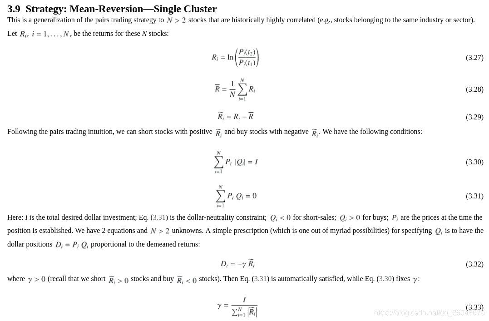
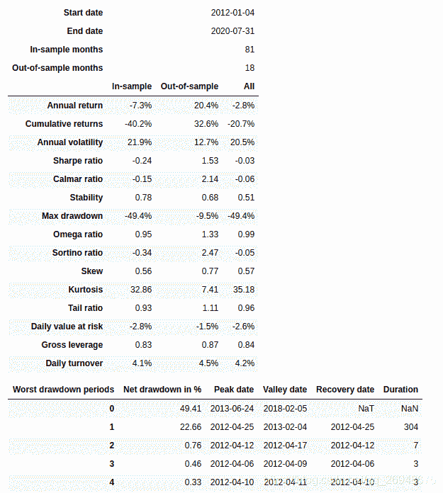
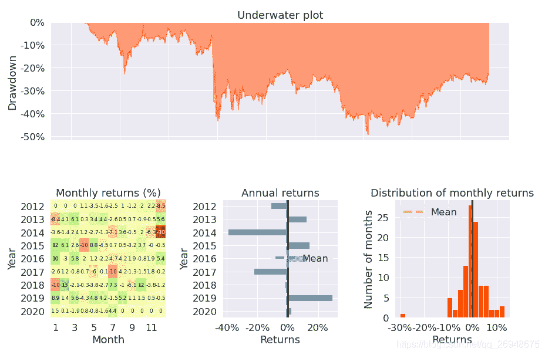

# 59、【backtrader 股票策略】多资产的配对交易策略(mean reversion - single cluster)

> 原文：<https://yunjinqi.blog.csdn.net/article/details/116244402>



这个策略的思路来自于《151 trading strategies》，本文主要分为四个部分：策略逻辑描述、策略代码、策略绩效、策略简单分析
策略逻辑说明

常见的配对交易策略往往是两个资产的配对交易，涉及到多个资产的配对交易策略很少见，我知道的就一个外汇上的三角套利，绞尽脑瓜想了两天也不知道有什么好策略思路，就完全按照这个策略里面的逻辑来了。

#### 策略逻辑

1.  选定了三只股票，建设银行、工商银行和农业银行，计算它们三个的日收益率
2.  求出三个股票的平均收益率以及每个股票的超额收益率，以平均收益率为基准
3.  每个股票分配的金额是：该股票的超额收益率*总的资产/(N 个股票的超额收益率的绝对值的和)
4.  该股票的超额收益率大于 0,就做空；该股票的超额收益率小于 0,就做多；
5.  交易手续费按照万分之二计算。

#### 策略代码

```py
import backtrader as bt
import statsmodels.api as sm
import datetime
import pandas as pd
import numpy as np
import os,sys
import copy
import talib
import math 
import warnings
warnings.filterwarnings("ignore")
import pyfolio as pf

# 我们使用的时候，直接用我们新的类读取数据就可以了。
class test_two_ma_strategy(bt.Strategy):

    params = (('period',30),
              ('mult',2)
             )

    def log(self, txt, dt=None):
        ''' Logging function fot this strategy'''
        dt = dt or self.datas[0].datetime.date(0)
        print('{}, {}'.format(dt.isoformat(), txt))

    def __init__(self):
        # Keep a reference to the "close" line in the data[0] dataseries
        self.bar_num=0    
        # 保存现有持仓的股票
        self.position_dict={}
        # 当前有交易的股票
        self.stock_dict={}
        # 当天持仓状态
        self.marketposition = 0
        # 计算每个资产的收益率
        self.data_rate_dict = {data._name:bt.indicators.PercentChange(data.close,period = self.p.period) for data in self.datas}

    def prenext(self):

        self.next()

    def next(self):
        # 假设有 100 万资金，每次成份股调整，每个股票使用 1 万元
        self.bar_num+=1
        # 前一交易日和当前的交易日
        pre_date = self.datas[0].datetime.date(-1).strftime("%Y-%m-%d")
        current_date = self.datas[0].datetime.date(0).strftime("%Y-%m-%d")
        # 总的价值
        total_value = self.broker.get_value()
        total_cash  = self.broker.get_cash()
        self.log(f"total_value : {total_value}")
        # 平均收益
        mean_rate = sum([i[0] for i in self.data_rate_dict.values()])/len(self.data_rate_dict)
        # 每个资产的超额收益
        self.data_car_dict = {data._name:self.data_rate_dict[data._name][0]- mean_rate   for data in self.datas}
        # 数据准备不足，返回
        if self.bar_num<=self.p.period:
            return 
        # 计算仓位，下单
        if self.bar_num%self.p.period==0:
            for data in self.datas:
                data_name = data._name
                # 先平仓
                data_date = data.datetime.date(0).strftime("%Y-%m-%d")
                size = self.getposition(data).size
                # 如果有仓位
                if size!=0:
                    self.close(data)
                    if data._name in self.position_dict:
                        self.position_dict.pop(data._name)

                # 已经下单，但是订单没有成交
                if data._name in self.position_dict and size==0:
                    order = self.position_dict[data._name]
                    self.cancel(order)
                    self.position_dict.pop(data._name) 
                # 如果两个日期相等，说明股票在交易,就计算收益率，进行排序
                if current_date == data_date:
                    data_rate = self.data_rate_dict[data_name][0]
                    self.log(data_rate)
                    data_invest_value = abs(data_rate)*total_value/sum([abs(i[0]) for i in self.data_rate_dict.values()])
                    lots = int((data_invest_value/(data.close[0]))/100)*100
                    # 如果收益率大于 0,做空
                    if data_rate>0:
                        order = self.sell(data,size = lots)
                        self.position_dict[data._name] = order

                    if data_rate<0:
                        order = self.buy(data,size = lots)
                        self.position_dict[data._name] = order

        """
        diff = self.diff
        # 做多价差
        if self.marketposition==0 and diff[-1]<self.bot[-1] and diff[0]>self.bot[0]:

            self.order_target_percent(self.datas[0],target=0.5)
            self.order_target_percent(self.datas[1],target=-0.5)
            self.marketposition=1
        # 做空价差
        if self.marketposition==0 and diff[-1]>self.top[-1] and diff[0]<self.bot[0]:

            self.order_target_percent(self.datas[0],target=-0.5)
            self.order_target_percent(self.datas[1],target=0.5)
            self.marketposition=-1
        # 平仓多头价差
        if self.marketposition==1 and diff[-1]>self.mid[-1] and diff[0]<self.mid[0]:

            self.order_target_percent(self.datas[0],target=0)
            self.order_target_percent(self.datas[1],target=0)
            self.marketposition=0

        # 平仓空头价差
        if self.marketposition==-1 and diff[-1]<self.mid[-1] and diff[0]>self.mid[0]:

            self.order_target_percent(self.datas[0],target=0)
            self.order_target_percent(self.datas[1],target=0)
            self.marketposition=0
        """

    def notify_order(self, order):

        if order.status in [order.Submitted, order.Accepted]:
            return

        if order.status == order.Rejected:
            self.log(f"Rejected : order_ref:{order.ref} data_name:{order.p.data._name}")

        if order.status == order.Margin:
            self.log(f"Margin : order_ref:{order.ref} data_name:{order.p.data._name}")

        if order.status == order.Cancelled:
            self.log(f"Concelled : order_ref:{order.ref} data_name:{order.p.data._name}")

        if order.status == order.Partial:
            self.log(f"Partial : order_ref:{order.ref} data_name:{order.p.data._name}")

        if order.status == order.Completed:
            if order.isbuy():
                self.log(f" BUY : data_name:{order.p.data._name} price : {order.executed.price} , cost : {order.executed.value} , commission : {order.executed.comm}")

            else:  # Sell
                self.log(f" SELL : data_name:{order.p.data._name} price : {order.executed.price} , cost : {order.executed.value} , commission : {order.executed.comm}")

    def notify_trade(self, trade):
        # 一个 trade 结束的时候输出信息
        if trade.isclosed:
            self.log('closed symbol is : {} , total_profit : {} , net_profit : {}' .format(
                            trade.getdataname(),trade.pnl, trade.pnlcomm))
            # self.trade_list.append([self.datas[0].datetime.date(0),trade.getdataname(),trade.pnl,trade.pnlcomm])

        if trade.isopen:
            self.log('open symbol is : {} , price : {} ' .format(
                            trade.getdataname(),trade.price))
    def stop(self):

        pass 

# 初始化 cerebro,获得一个实例
cerebro = bt.Cerebro()
# cerebro.broker = bt.brokers.BackBroker(shortcash=True)  # 0.5%
data_root = "/home/yun/data/stock/day/"

params=dict(

    fromdate = datetime.datetime(2012,1,4),
    todate = datetime.datetime(2020,7,31),
    timeframe = bt.TimeFrame.Days,
    dtformat = ("%Y-%m-%d"),
    # compression = 1,
    datetime = 0,
    open = 1,
    high = 2,
    low =3,
    close =4,
    volume =5,
    openinterest=-1)
# 加载建设银行
df = pd.read_csv("/home/yun/data/stock/day/601939.XSHG.csv")
df.columns = ['datetime','open','high','low','close','volume','openinterest']
df.index = pd.to_datetime(df['datetime'])
df = df[['open','high','low','close','volume','openinterest']]
df = df[(df.index<=params['todate'])&(df.index>=params['fromdate'])]
feed = bt.feeds.PandasDirectData(dataname = df)
# 添加数据到 cerebro
cerebro.adddata(feed, name = "jsyh")

# 加载工商银行
df = pd.read_csv("/home/yun/data/stock/day/601398.XSHG.csv")
df.columns = ['datetime','open','high','low','close','volume','openinterest']
df.index = pd.to_datetime(df['datetime'])
df = df[['open','high','low','close','volume','openinterest']]
df = df[(df.index<=params['todate'])&(df.index>=params['fromdate'])]
feed = bt.feeds.PandasDirectData(dataname = df)
# 添加数据到 cerebro
cerebro.adddata(feed, name = "gsyh")

# 加载农业银行
df = pd.read_csv("/home/yun/data/stock/day/601288.XSHG.csv")
df.columns = ['datetime','open','high','low','close','volume','openinterest']
df.index = pd.to_datetime(df['datetime'])
df = df[['open','high','low','close','volume','openinterest']]
df = df[(df.index<=params['todate'])&(df.index>=params['fromdate'])]
feed = bt.feeds.PandasDirectData(dataname = df)
# 添加数据到 cerebro
cerebro.adddata(feed, name = "nyyh")

print("加载数据完毕")
# 添加手续费，按照万分之二收取
cerebro.broker.setcommission(commission=0.0002,stocklike=True)
# 设置初始资金为 1 亿
cerebro.broker.setcash(1_0000_0000)
# 添加策略
cerebro.addstrategy(test_two_ma_strategy)
cerebro.addanalyzer(bt.analyzers.TotalValue, _name='_TotalValue')
cerebro.addanalyzer(bt.analyzers.PyFolio)
# 运行回测
results = cerebro.run()
# 打印相关信息
pyfoliozer = results[0].analyzers.getbyname('pyfolio')
returns, positions, transactions, gross_lev = pyfoliozer.get_pf_items()
pf.create_full_tear_sheet(
    returns,
    positions=positions,
    transactions=transactions,
    # gross_lev=gross_lev,
    live_start_date='2019-01-01',
    ) 
```

#### 策略绩效



#### 策略简单分析

从测试的结果来看，策略是亏损的，策略表现不好，这个其实也在意料之中；这个策略逻辑中，对多资产配对交易，处理的不是很好，应该存在更好的逻辑，欢迎大家尝试，我起一个抛砖引玉的作用。

#### 数据

股票后复权等数据

链接: https://pan.baidu.com/s/1dGngnBApUMHvUYJ4qM2GZA 提取码: m4ck 复制这段内容后打开百度网盘手机 App，操作更方便哦

* * *

智慧、心灵、财富，总要有一个在路上，愿我们能在人生的道路上，不断成长、不断成熟～～～

感兴趣可以关注我的专栏：

[my_quant_study_note](https://www.zhihu.com/column/quant-study)：分享一些关于量化投资、量化交易相关的思考

[backtrader 量化投资回测与交易](https://zhuanlan.zhihu.com/c_1189276087837011968)：本专栏免费，分享 backtrader 相关的内容。

[量化投资神器-backtrader 源码解析-从入门到精通：本专栏目前收费 99 元，预计更新 100 篇策略+20 篇 backtrader 讲解+80 篇源代码分析。](https://link.zhihu.com/?target=https%3A//yunjinqi.blog.csdn.net/article/details/107594251)