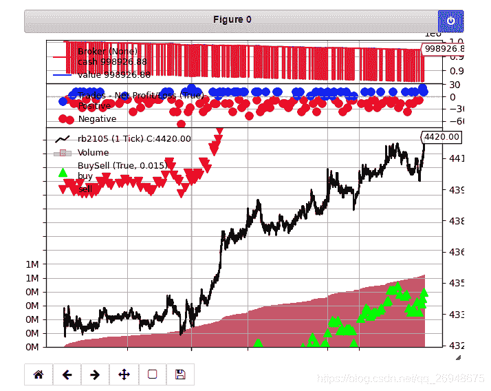

# 60、【backtrader 期货策略】如何用 backtrader 回测期货 tick 数据？(2022-01-02 修改)

> 原文：<https://yunjinqi.blog.csdn.net/article/details/116767719>

原生的 backtrader 并不支持 tick 数据的回测，论坛里面也有一些使用者讨论如何用 backtrader 回测 tick 数据，其实，最近也一直有在思考这个问题，这篇文章就分享下，如何做。在开始之前，先分析下，这么做的一些缺点。

文章修改记录：
2021-01-02 在代码中 init 中增加了 self.buy_order= None 和 self.sell_order = None

#### 高频回测的测不准原理

对于中低频的趋势交易策略，如果交易量不是很大的话，单个交易策略对市场的影响微乎其微，可以只考虑市场什么情况，在这种情况下，考虑交易成本之后，回测有一定的可靠性。

高频的交易，本身可能对这个市场就有很大的影响，自身的行为就可能导致市场行为发生改变，使用历史数据回测，即使不考虑交易成本，也很难得到准确的结果。听说，很多高频策略都是直接上模拟盘，小仓位测试，到实盘。高频策略主要是靠理论支撑的，主要是以速度制胜，回测可能没有那么重要。

上面是一个没有做过高频策略的 quant 的一家之言，也可能不准确哈，仅供参考。

#### 用 python 去回测 tick 数据的不足

backtrader 是基于 python 的量化交易框架，python 作为一门解释性语言，相对于 C++等编译性语言，运行速度会慢上好多。而 tick 数据本身数据量就比较多，导致 python 写的量化框架，回测 tick 数据的时候，都需要耗时比较多。

backtrader 本身机制比较完善，里面的 order 等，自带了丰富的信息，会导致在运行的过程中，内存会不断增大，如果回测的 tick 数据比较多，几十个 G 的内存很有可能不够。

总结一下，使用 python 本身速度比较慢，使用 backtrader 会额外消耗内存，导致，用 backtrader 回测大量的 tick 数据，是一个又慢又占内存的事，是一个事倍功半的努力。

#### 为什么还要用 backtrader 来回测 tick 数据

*   不会 c++等语言是一个限制

    如果是专门做高频的策略的话，建议就换个平台吧。不要用 backtrader 了，即使用 backtrader,实盘的时候也得改平台。用 python 去做高频，如果你有一颗慈善的心，愿意捐钱的话，当我没说。

*   没找到其他更好的 python 框架

    python 语言很容易学，有很多基于 python 的量化框架。但是，到目前为止，还没有找到，或者没有注意到，有哪家是能够支持 tick 数据的回测的。

*   backtrader 本身有很大的优势

    backtrader 的优势，就不需要我一遍遍去强调了。

#### 如何用 backtrader 来回测期货的 tick 数据

因为 backtrader 对数据提供了很好的扩展功能，对于高开低收成交量持仓量等之外的数据，可以很容易添加进来。[具体的扩展数据的案例，可以参考本文。](https://yunjinqi.blog.csdn.net/article/details/108991405)

如果要改造 tick 数据，应该怎么做呢？

##### 1\. 期货的 tick 数据，都包含哪些内容？

这是我用一个软件采集的期货的 tick 数据，包含了下面的字段：

> localtime (本机写入 TICK 的时间),
> InstrumentID (合约名),
> TradingDay (交易日),
> ActionDay (业务日期),
> UpdateTime （时间）,
> UpdateMillisec（时间毫秒）,
> LastPrice （最新价）,
> Volume（成交量） ,
> HighestPrice （最高价）,
> LowestPrice（最低价） ,
> OpenPrice（开盘价） ,
> ClosePrice（收盘价）,
> AveragePrice（均价）,
> AskPrice1（申卖价一）,
> AskVolume1（申卖量一）,
> BidPrice1（申买价一）,
> BidVolume1（申买量一）,
> UpperLimitPrice（涨停板价）
> LowerLimitPrice（跌停板价）
> OpenInterest（持仓量）,
> Turnover（成交金额）,
> PreClosePrice (昨收盘),
> PreOpenInterest (昨持仓),
> PreSettlementPrice (上次结算价),

##### 2\. backtrader 在回测的时候需要传入的数据

backtrader 传入数据的时候，一般都是需要使用到 open\high\low\close 这四个价格，为了符合回测的逻辑，让最新价等于 open\high\low\close，并且可以额外添加几个列，比如 AskVolume1(卖量一）,BidVolume1(买量一)。

> 这样做有一个缺陷：使用限价单的时候，其实并不能知道能不能成交。比如价格 6 元的买订单，最新价在 5.9 元的时候，是会成交的，但是并不能知道最新价在 6.00 的时候会不会成交。这是一个缺陷。
> 
> 如果想要避免这个，就需要开发逐 tick 回测的模式。
> 
> 目前这个只是基于 bar 进行的改造，是对现实的一个逼近。理论上是存在更好的回测方法的。

###### 处理原始数据，生成 backtrader 需要的数据

```py
import pandas as pd
import numpy as np
data = pd.read_csv("c:/result/rb2105.csv")
data['datetime']=pd.to_datetime([str(x)+" "+str(y)+"."+str(z) for x,y,z in zip(data['ActionDay'], data["UpdateTime"],data['UpdateMillisec'])])
data['open'] = data['LastPrice']
data['close'] = data['LastPrice']
data['high'] = data['LastPrice']
data['low'] = data['LastPrice']
data['volume'] = data['Volume']
data= data[['datetime','open','high','low','close','volume','AskPrice1','AskVolume1','BidPrice1','BidVolume1']]
data.to_csv("rb2105.csv",index=False) 
```

##### 3\. 使用 backtrader 回测期货 tick 数据的一个小案例

注：这个策略是 toy strategy,仅仅是为了测试 tick 数据随手编写的，大家可以根据自己的需要，改进相关的策略逻辑。

```py
import backtrader as bt
from backtrader import num2date
import datetime
# 在交易信息之外，额外增加了 PE、PB 指标，做涉及到基本面信息的策略使用
class GenericTickCSV(bt.feeds.GenericCSVData):

    # 增加两个 line,每个 line 的名称，就是 csv 文件中，额外增加的列的名称
    lines = ('AskPrice1','AskVolume1','BidPrice1','BidVolume1',)

    # 具体每个新增加的变量 index 是多少，要根据自己的 csv 文件去决定，从 0 开始数
    params = (('AskPrice1',6),('AskVolume1',7),('BidPrice1',8),('BidVolume1',9))

# 我们使用的时候，直接用我们新的类读取数据就可以了。
class TestTickStrategy(bt.Strategy):

    params = (('window',200),)

    def log(self, txt, dt=None):
        ''' Logging function fot this strategy'''
        dt = dt or num2date(self.datas[0].datetime[0])
        print('{}, {}'.format(dt.isoformat(), txt))

    def __init__(self):
        # Keep a reference to the "close" line in the data[0] dataseries
        self.bar_num=0
        # 持仓状态
        self.marketposition = 0
        # 订单的初始值
        self.buy_order = None
        self.sell_order = None

    def prenext(self):

        pass 

    def next(self):
        # 假设有 100 万资金，每次成份股调整，每个股票使用 1 万元
        self.bar_num+=1
        # 获取并打印当前的数据
        data = self.datas[0]
        now_datetime = num2date(data.datetime[0])
        now_open = data.open[0]
        now_high = data.high[0]
        now_low = data.low[0]
        now_close = data.close[0]
        # 卖一价、量
        now_ask_volume = data.AskVolume1[0]
        now_ask_price = data.AskPrice1[0]
        # 买一价、量
        now_bid_price = data.BidPrice1[0]
        now_bid_volume = data.BidVolume1[0]
        # 输出信息
        self.log(f"now_open\high\low\close\lastprice:{now_open},\
                now_ask_volume:{now_ask_volume},\
                now_ask_volume:{now_ask_volume},\
                now_bid_price:{now_bid_price},\
               now_bid_volume:{now_bid_volume}")
        hold_size = self.getposition(data).size
        # 平仓
        if  self.bar_num%120 == 0:

            # 限价买单没成交
            if self.buy_order is not None and self.marketposition == 1:
                self.cancel(self.buy_order)
                self.buy_order = None
            # 限价卖单没成交
            if self.sell_order is not None and hold_size>0:
                self.cancel(self.sell_order)
                self.sell_order = None
                # 平仓
                self.close()
            self.marketposition = 0 
        # 开仓
        if hold_size == 0 and self.marketposition==0 and self.bar_num%120==0:

            self.buy_order = self.buy(self.datas[0],size = 1,exectype=bt.Order.Limit,price = now_bid_price-1)
            self.marketposition = 1
        # 限价单平仓
        if self.marketposition == 1 and hold_size>0 and  self.bar_num%120!=0:

            self.sell_order = self.sell(self.datas[0],size = 1,exectype=bt.Order.Limit,price = now_ask_price+2)
            self.marketposition = 0

    def notify_order(self, order):

        if order.status in [order.Submitted, order.Accepted]:
            return

        if order.status == order.Rejected:
            self.log(f"Rejected : order_ref:{order.ref} data_name:{order.p.data._name}")

        if order.status == order.Margin:
            self.log(f"Margin : order_ref:{order.ref} data_name:{order.p.data._name}")

        if order.status == order.Cancelled:
            self.log(f"Concelled : order_ref:{order.ref} data_name:{order.p.data._name}")

        if order.status == order.Partial:
            self.log(f"Partial : order_ref:{order.ref} data_name:{order.p.data._name}")

        if order.status == order.Completed:
            if order.isbuy():
                self.log(f" BUY : data_name:{order.p.data._name} price : {order.executed.price} , cost : {order.executed.value} , commission : {order.executed.comm}")

            else:  # Sell
                self.log(f" SELL : data_name:{order.p.data._name} price : {order.executed.price} , cost : {order.executed.value} , commission : {order.executed.comm}")

    def notify_trade(self, trade):
        # 一个 trade 结束的时候输出信息
        if trade.isclosed:
            self.log('closed symbol is : {} , total_profit : {} , net_profit : {}' .format(
                            trade.getdataname(),trade.pnl, trade.pnlcomm))
            # self.trade_list.append([self.datas[0].datetime.date(0),trade.getdataname(),trade.pnl,trade.pnlcomm])

        if trade.isopen:
            self.log('open symbol is : {} , price : {} ' .format(
                            trade.getdataname(),trade.price))
    def stop(self):

        pass 

params = dict(
            fromdate = datetime.datetime(2021,1,4), # 回测开始时间
            todate = datetime.datetime(2021,3,20),  # 回测结束时间
            timeframe = bt.TimeFrame.Ticks,
            compression = 1,
            dtformat=('%Y-%m-%d %H:%M:%S.%f'), # 日期和时间格式
            tmformat=('%H:%M:%S.%f'), # 时间格式
            datetime=0, # 下面几行是导入的数据，要和传入的数据列进行一一对应，以这个参数为准
            high=2,
            low=3,
            open=1,
            close=4,
            volume=5,
            openinterest=-1)

# 初始化 cerebro,获得一个实例
cerebro = bt.Cerebro()
# cerebro.broker = bt.brokers.BackBroker(shortcash=True)  # 0.5%
# 读取数据
feed = GenericTickCSV(dataname = "rb2105.csv",**params)
# 添加数据到 cerebro
cerebro.adddata(feed, name = "rb2105")
# 添加手续费，按照万分之五收取
cerebro.broker.setcommission(commission=0.0005,stocklike=False)
# 设置初始资金为 100 万
cerebro.broker.setcash(1000000.0)
# 添加策略
cerebro.addstrategy(TestTickStrategy)
# 运行回测
cerebro.run()
# 画图
cerebro.plot() 
```



#### 使用数据

链接: https://pan.baidu.com/s/12nB0yHMgo_AQ_pz9s0PfTQ 提取码: djzi 复制这段内容后打开百度网盘手机 App，操作更方便哦