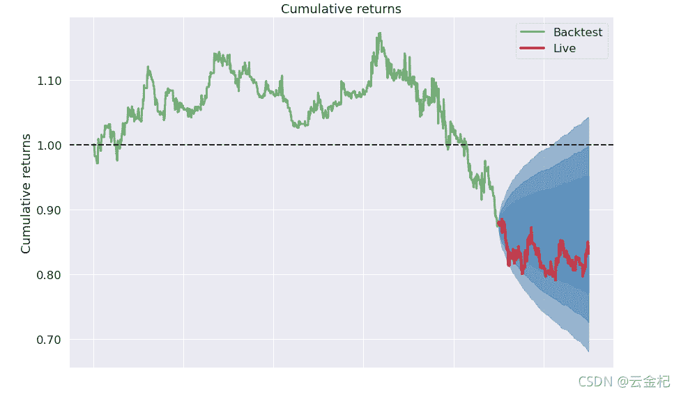
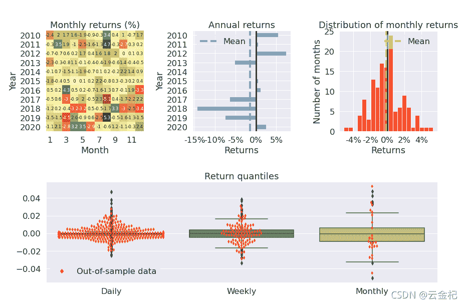
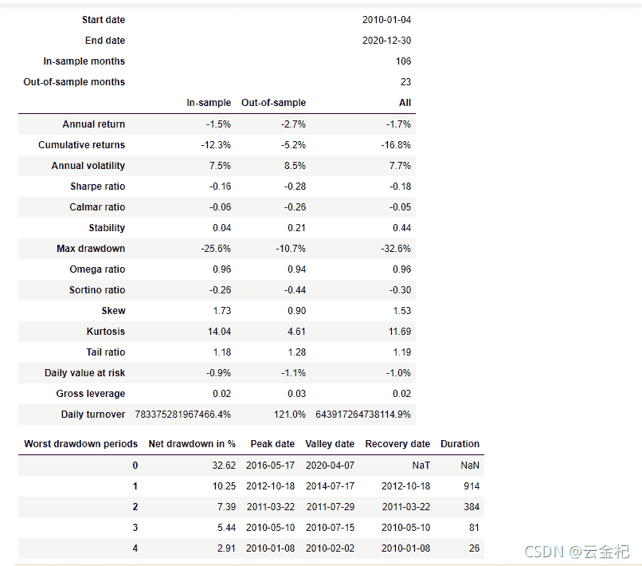

# 64、【backtrader 期货策略】基于 macd 与 ema 的简单的趋势跟踪策略(已更新)

> 原文：<https://yunjinqi.blog.csdn.net/article/details/120319481>

2021-09-18 更新 ，主要更新了策略里面的 log 函数以及加载数据的方式，另外策略是运行在 30 分钟上的

理想总是很丰满，现实总是很骨感，做策略也一样。我总是以为，这个策略一个小时就可以写出来代码，很快就能回测出来结果，回测的结果大概也会很好，但是，现实一次次的打脸，让我学会了谦虚。熬了两个晚上，都没能把海龟交易策略做好(真正的海龟交易策略哦，并非本文这样的 toy strategy),本来想把海龟策略作为期货交易策略的第一篇，看来这一两天是搞不定了，先来一个读者希望实现的简单策略。

#### 策略逻辑

###### 策略逻辑：

```py
 做多：当 macd 在 0 轴的上方，10 周期的 ema 上穿 20 周期的 ema，做多；
 平多: 价格跌破 10 周期的 ema，平多；
 做空：当 macd 在 0 轴的下方，10 周期的 ema 下穿 20 周期的 ema，做空；
 平空: 当价格在 10 周期的 ema 上方的时候，平空。 
```

###### 交易手数：每次交易 1 手。

###### 初始资金： 5 万元

###### 交易费用： 万分之二。

###### 运行周期： 30 分钟

###### 运行方式：运行在 30 分钟指数合约上，在这个 30 分钟指数合约上产生了信号(读者希望是运行在合约上,下一篇改进)

#### 策略代码

```py
from __future__ import (absolute_import, division, print_function,
                        unicode_literals)
import time,datetime
import os,sys
import pickle 
# import talib
import numpy as np
import pandas as pd
import random
import statsmodels.api as sm
from sklearn import linear_model

import backtrader as bt  # backtrader
from backtrader.comminfo import ComminfoFuturesPercent,ComminfoFuturesFixed # 期货交易的手续费用，按照比例或者按照金额
# from backtrader.plot.plot import run_cerebro_and_plot  # 个人编写，非 backtrader 自带
import pyfolio as pf
### 编写相应的策略,每个策略逻辑需要单独编写，回测和实盘直接运行策略类就行

class MACDStrategy(bt.Strategy):
    # 策略作者
    author = 'yunjinqi'
    # 策略的参数
    params = (  ("period_me1",10),                  
                ("period_me2",20),                      
                ("period_signal",9),             

            )
    # log 相应的信息
    def log(self, txt, dt=None):
        ''' Logging function fot this strategy'''
        dt = dt or bt.num2date(self.datas[0].datetime[0])
        print('{}, {}'.format(dt.isoformat(), txt))

    # 初始化策略的数据
    def __init__(self):
        # 基本上常用的部分属性变量
        self.bar_num = 0                 # next 运行了多少个 bar
        self.current_date = None        # 当前交易日
        # 保存 macd 指标
        self.bt_macd_indicator = bt.indicators.MACD(self.datas[0],period_me1=self.p.period_me1,period_me2=self.p.period_me2,period_signal=self.p.period_signal)
        # 保存 ema 指标
        self.ema = bt.indicators.ExponentialMovingAverage(self.datas[0],period = self.p.period_me1 )

    def prenext(self):
        # 由于期货数据有几千个，每个期货交易日期不同，并不会自然进入 next
        # 需要在每个 prenext 中调用 next 函数进行运行
        # self.next() 
        pass 

    # 在 next 中添加相应的策略逻辑
    def next(self):
        # 每次运行一次，bar_num 自然加 1,并更新交易日
        # self.current_date = self.datas[0].datetime.date(0)
        # self.log(self.current_date)
        # current_date = self.current_date.strftime("%Y-%m-%d")
        self.bar_num+=1
        # self.log(f"{self.bar_num},{self.broker.getvalue()}")
        # self.log(bt.num2date(self.datas[0].datetime[0]))
        # 计算相应的指标
        dif = self.bt_macd_indicator.macd
        dea = self.bt_macd_indicator.signal
        macd = 2*(dif - dea)
        # 当前状态
        data = self.datas[0]
        size = self.getposition(self.datas[0]).size # 持仓大小
        # 开仓，先平后开
        # 平多
        if size>0 and data.close[0]<self.ema[0]:
            self.close(data)
            size = 0
        # 平空
        if size<0 and data.close[0]>self.ema[0]:
            self.close(data)
            size = 0

        # 开多
        if size==0 and dif[-1]<0 and dif[0]>0 and macd>0:
            self.buy(data,size=1)

        # 开空
        if size==0 and dif[-1]>0 and dif[0]<0 and macd<0:
            self.sell(data,size=1)                        

    def notify_order(self, order):

        if order.status in [order.Submitted, order.Accepted]:
            return

        if order.status == order.Rejected:
            self.log(f"Rejected : order_ref:{order.ref} data_name:{order.p.data._name}")

        if order.status == order.Margin:
            self.log(f"Margin : order_ref:{order.ref} data_name:{order.p.data._name}")

        if order.status == order.Cancelled:
            self.log(f"Concelled : order_ref:{order.ref} data_name:{order.p.data._name}")

        if order.status == order.Partial:
            self.log(f"Partial : order_ref:{order.ref} data_name:{order.p.data._name}")

        if order.status == order.Completed:
            if order.isbuy():
                self.log(f" BUY : data_name:{order.p.data._name} price : {order.executed.price} , cost : {order.executed.value} , commission : {order.executed.comm}")

            else:  # Sell
                self.log(f" SELL : data_name:{order.p.data._name} price : {order.executed.price} , cost : {order.executed.value} , commission : {order.executed.comm}")

    def notify_trade(self, trade):
        # 一个 trade 结束的时候输出信息
        if trade.isclosed:
            self.log('closed symbol is : {} , total_profit : {} , net_profit : {}' .format(
                            trade.getdataname(),trade.pnl, trade.pnlcomm))
            # self.trade_list.append([self.datas[0].datetime.date(0),trade.getdataname(),trade.pnl,trade.pnlcomm])

        if trade.isopen:
            self.log('open symbol is : {} , price : {} ' .format(
                            trade.getdataname(),trade.price))

    def stop(self):
        # 策略停止的时候输出信息
        # with open("C:/data/filter_data_contract.pkl",'wb') as f:
        #    pickle.dump(self.my_datases,f)
        # df = pd.DataFrame(self.trade_result)
        # df.columns=['datetime','symbol','size','current_price','order_price','pnl','net_profit']
        # df.to_csv("C:/result/test1_trade_history.csv")

        # df1 = pd.DataFrame(self.position_result)
        # df1.columns=['datetime','symbol','size','close']
        # df1.to_csv("c:/result/test1_position_history.csv")

        # df2=pd.DataFrame(self.order_result)
        # df2.columns=["datetime",'symbol','size','0','direction']
        # df2.to_csv("C:/result/test1_order_history.csv")
        pass 

# 准备配置策略
cerebro = bt.Cerebro()
# 参数设置
data_kwargs = dict(
            fromdate = datetime.datetime(2010,1, 1),
            todate = datetime.datetime(2020,12,31),
            timeframe = bt.TimeFrame.Minutes,
            compression = 1,
            dtformat=('%Y-%m-%d %H:%M:%S'), # 日期和时间格式
            tmformat=('%H:%M:%S'), # 时间格式
            datetime=0,
            high=3,
            low=4,
            open=1,
            close=2,
            volume=5,
            openinterest=7)

# 加载螺纹钢指数数据
# feed = bt.feeds.GenericCSVData(dataname = "c:/data/future/15m/RB99.csv", **data_kwargs)
name = "RB99"
df = pd.read_csv("c:/data/future/15m/RB99.csv")
# 只要数据里面的这几列
df = df[['datetime','open','high','low','close','volume','openinterest']]
# 修改列的名字
df.index = pd.to_datetime(df['datetime'])
df = df[['open','high','low','close','volume','openinterest']]
df = df[(df.index<=data_kwargs['todate'])&(df.index>=data_kwargs['fromdate'])]
# feed = bt.feeds.GenericCSVData(dataname = data_root+file,**params)
# print(name,len(df))
feed = bt.feeds.PandasDirectData(dataname = df)
cerebro.adddata(feed, name = name)
# 设置合约的交易信息，佣金设置为 2%%，保证金率为 10%，杠杆按照真实的杠杆来
comm=ComminfoFuturesPercent(commission=0.0002,margin=0.1, mult=10)
cerebro.broker.addcommissioninfo(comm, name= name)
cerebro.broker.setcash(50000.0)
# 添加策略
cerebro.addstrategy(MACDStrategy)
cerebro.addanalyzer(bt.analyzers.TotalValue, _name='_TotalValue')
cerebro.addanalyzer(bt.analyzers.PyFolio)
# 运行回测
results = cerebro.run()

pyfoliozer = results[0].analyzers.getbyname('pyfolio')
returns, positions, transactions, gross_lev = pyfoliozer.get_pf_items()
pf.create_full_tear_sheet(
    returns,
    positions=positions,
    transactions=transactions,
    # gross_lev=gross_lev,
    live_start_date='2019-01-01',
    ) 
```

##### 测试结果





##### 测试用的数据

注：更正一下，测试用的数据是 30 分钟的，并且剔除了部分错乱的数据

链接: https://pan.baidu.com/s/19ZKJM7i4-9WJVRWef5KwNg 提取码: 7y7z 复制这段内容后打开百度网盘手机 App，操作更方便哦

##### 策略点评

开篇就提到了，这是一个玩具策略(toy strategy),只适合看看与玩玩，不适合实盘，这是因为回测与实盘差距太大了。如果您经常用一些商业平台进行回测，您应该很熟悉这种回测模式，但是，这种回测中存在巨大的问题。这些问题是什么，造成这样的回测的策略是玩具策略，您知道吗？

在下一篇的文章中，将会分享一个更准确一些的回测方式，使得回测与实际情况更接近一些。