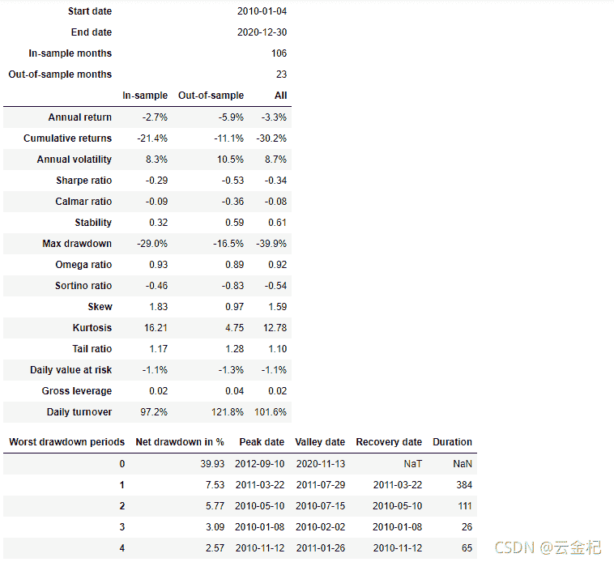
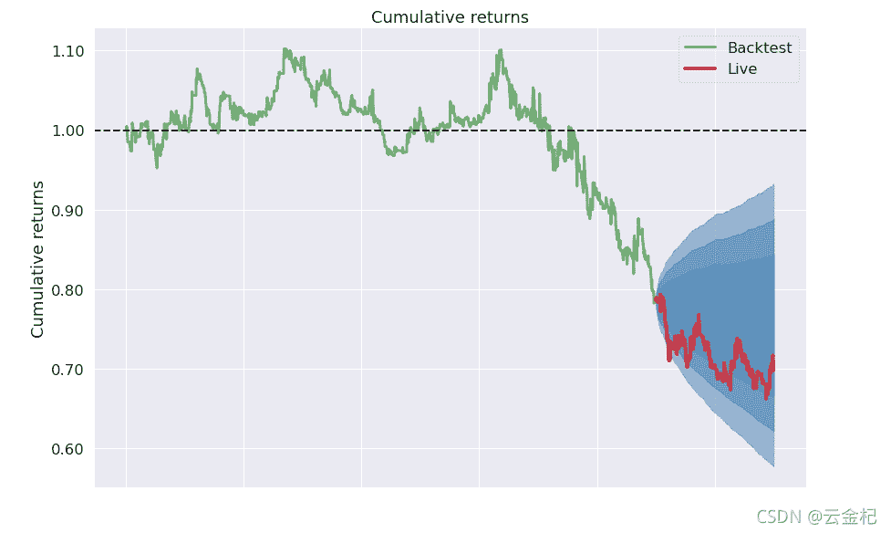
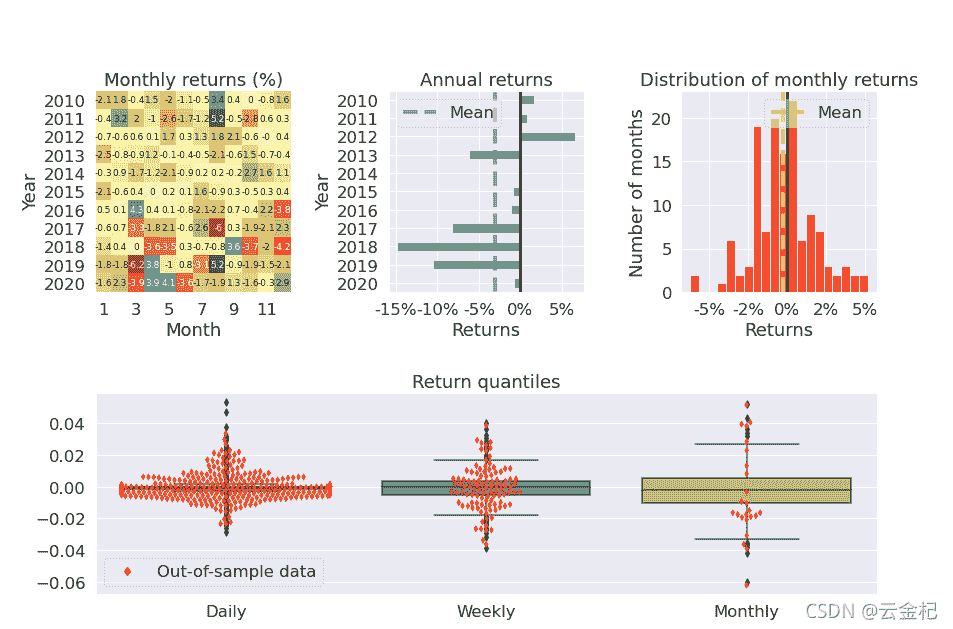

# 64、【backtrader 期货策略】基于 macd 与 ema 的趋势跟踪策略(真实回测-2021-09-19 更新)

> 原文：<https://yunjinqi.blog.csdn.net/article/details/120368787>

开始这篇文章，我觉得，有必要新建一篇文章，整合起来所有的 backtrader 的教程与配置方法，让对于策略感兴趣的朋友可以直接上手策略，而无需通读整个专栏教程(虽然我觉得，通读整个专栏的文章是有必要的)。写完这篇文章之后，开始做一个这样的文章合集，大家有什么样的问题，以后可以在这篇文章里面找答案，没有答案的可以咨询我。

* * *

写这篇文章的过程中，又发现了 pyfolio 里面的一个小 bug，然后更新了以下，大家使用的过程中，可以使用新的代码。

[17、backtrader 的一些基本概念—如何使用 analyzer 及创建新的 analyzer(4)—策略绩效评价模块 pyfolio 的使用](https://yunjinqi.blog.csdn.net/article/details/110842730)

[backtrader 上新建了一个 analyzer,获取每个交易日的总的账户价值](https://zhuanlan.zhihu.com/p/98544551)

准备开始今天的正文了，这篇文章花了估计六七个小时，写篇有点质量的原创文章，真不容易。

* * *

#### 关于期货的回测

在上一篇文章里面，我们谈到，我们上一篇文章的策略回测是 toy strategy,之所以如此，就是这样的回测方式与实际差距比较大，回测出来的结果，是很难在实际中去复制的。

##### 使用指数合约作为交易的合约

回测的一个核心原则就是要尽可能接近过去的实际情况，并且能够让这个策略逻辑能够应用到未来的交易中。

我们上个策略回测的时候，是直接在期货的指数合约上产生交易信号，然后在指数合约上产生交易，这样的回测很可能不准的，毕竟，在实际的交易中，很少有人能够复制期货指数去交易吧？大多都是交易流动量比较充足的合约，比如主力合约与次主力合约。

所以，用不可能复制的数据产生交易，是一种不合理的回测方式。

##### 使用前复权、后复权、不复权的期货主力连续合约作为交易的合约

这种方式比较适合日内交易等交易频率比较高的策略，不持仓过夜，或者策略不会经历移仓换月。对于中长周期的策略，如果移仓换月，就必然导致回测结果出现问题。

##### 用什么数据产生交易信号

这个没有具体的原则，用指数数据，后复权或者不复权的期货合约，甚至使用其他品种的数据产生交易信号都可以！一般情况下需要参考自己的策略，来决定使用哪种数据。在知乎上有关于这个的讨论。

##### 总结

一般而言，中长期的趋势策略，一般要在真实的合约上产生交易信号；日内等不经历移仓换月的，使用主力连续合约也可以，这样回测可以减少加载的合约数量，使得回测速度快一些；套利类的策略，一般是需要使用真实的合约。

#### 关于移仓换月

期货中由于合约的有效期都比较短，市场参与者需要不断转换交易的合约，比如在 2021 年年初可能需要交易 RB2105,到 2021 年 4 月份，可能就是需要交易 RB2109,因为合约的流动性比较好，有些特殊的交易者也有可能交易其他的合约。不同类型的交易者可能采用不同的移仓换月方法，但是不论采用哪种方式，大体上都是需要的。一些商业的行情软件，在形成主力连续合约的时候，会使用特定的标准，这些标准逐渐被大家接受，使用范围比较广。

#### 1\. 以持仓量确定主力合约

比如那个合约的持仓量比较大，那个就是主力合约。本文采用的主力合约的确认方式就是按照这种方式。

再比如，当下个合约的持仓量超过了当前主力合约的持仓量的 1.2 倍，就确定下个合约是主力合约，并且还可以制定规则是否允许主力合约往后退，比如现在主力合约的持仓量 RB2105 小于了 RB2019，那么主力合约在下个交易日就会变成 RB2109,如果允许主力合约往后退，近期的合约 RB2105 或者 RB2107 的持仓量超过了 RB2109，就确认 RB2105 或者 rb2107 作为主力合约。

#### 2.以交易量确定主力合约

同持仓量的确认方法一样，不过相对于持仓量，合约的交易量或者交易额，变动相对比较快一些。与以持仓量确认的主力合约的方式相比，两者移仓换月的交易日可能不一样。

#### 3\. 以持仓量与交易量的一定比例确定主力合约

一般情况下，比较活跃的期货，持仓量一般小于当日的成交量。比如，按照持仓量的 80%与成交量的 20%来确定哪个合约是主力合约，这也是一种方法。

#### 总结

其实还有一些其他的确认那个合约是主力合约的方法。选择哪种方法，最主要的关键是要考虑使用的交易策略，最好的换月方法是能够和使用的交易策略相匹配的。

* * *

#### 策略逻辑：

做多：当 macd 在 0 轴的上方，10 周期的 ema 上穿 20 周期的 ema，做多；
平多: 价格跌破 10 周期的 ema，平多；
做空：当 macd 在 0 轴的下方，10 周期的 ema 下穿 20 周期的 ema，做空；
平空: 当价格在 10 周期的 ema 上方的时候，平空。

交易手数：每次交易 1 手。
初始资金： 5 万元
交易费用： 万分之二。
运行周期： 30 分钟
运行方式：运行在 30 分钟指数合约上，在这个 30 分钟主力合约上产生了信号

#### 策略代码：

#### [上篇文章的真实的回测代码](https://yunjinqi.blog.csdn.net/article/details/120319481)，可以和上一篇的文章对比下，是同一个策略。

```py
from __future__ import (absolute_import, division, print_function,
                        unicode_literals)
import time,datetime
import os,sys
import pickle 
# import talib
import numpy as np
import pandas as pd
import random
import statsmodels.api as sm
from sklearn import linear_model

import backtrader as bt  # backtrader
from backtrader.comminfo import ComminfoFuturesPercent,ComminfoFuturesFixed # 期货交易的手续费用，按照比例或者按照金额

# from backtrader.plot.plot import run_cerebro_and_plot  # 个人编写，非 backtrader 自带
import pyfolio as pf

# 编写一个新的 macd 的指标，使得和国内的常用 macd 指标接轨

### 编写相应的策略,每个策略逻辑需要单独编写，回测和实盘直接运行策略类就行

class MACDStrategy(bt.Strategy):
    # 策略作者
    author = 'yunjinqi'
    # 策略的参数
    params = (  ("period_me1",10),                  
                ("period_me2",20),                      
                ("period_dif",9),             

            )
    # log 相应的信息
    def log(self, txt, dt=None):
        ''' Logging function fot this strategy'''
        dt = dt or bt.num2date(self.datas[0].datetime[0])
        print('{}, {}'.format(dt.isoformat(), txt))

    # 初始化策略的数据
    def __init__(self):
        # 基本上常用的部分属性变量
        self.bar_num = 0                 # next 运行了多少个 bar
        self.current_date = None        # 当前交易日
        # 计算 macd 指标
        self.ema_1 = bt.indicators.ExponentialMovingAverage(self.datas[0].close, period=self.p.period_me1)
        self.ema_2 = bt.indicators.ExponentialMovingAverage(self.datas[0].close, period=self.p.period_me2)
        self.dif = self.ema_1 - self.ema_2
        self.dea = bt.indicators.ExponentialMovingAverage(self.dif,period=self.p.period_dif)
        self.macd = (self.dif - self.dea)*2
        # 保存现在持仓的合约是哪一个
        self.holding_contract_name = None

    def prenext(self):
        # 由于期货数据有几千个，每个期货交易日期不同，并不会自然进入 next
        # 需要在每个 prenext 中调用 next 函数进行运行
        self.next() 
        # pass 

    # 在 next 中添加相应的策略逻辑
    def next(self):
        # 每次运行一次，bar_num 自然加 1,并更新交易日
        self.current_date = bt.num2date(self.datas[0].datetime[0])
        self.bar_num+=1
        # self.log(f"{self.bar_num},{self.datas[0]._name},{self.broker.getvalue()}")
        # self.log(f"{self.ema_1[0]},{self.ema_2[0]},{self.dif[0]},{self.dea[0]},{self.macd[0]}")
        data = self.datas[0]
        # 开仓，先平后开
        # 平多
        if self.holding_contract_name is not None and self.getpositionbyname(self.holding_contract_name).size>0 and data.close[0]<self.ema_1[0]:
            data = self.getdatabyname(self.holding_contract_name)
            self.close(data)
            self.holding_contract_name = None
        # 平空
        if self.holding_contract_name is not None  and self.getpositionbyname(self.holding_contract_name).size<0 and data.close[0]>self.ema_1[0]:
            data = self.getdatabyname(self.holding_contract_name)
            self.close(data)
            self.holding_contract_name = None

        # 开多
        if self.holding_contract_name is None and self.ema_1[-1]<self.ema_2[-1] and self.ema_1[0]>self.ema_2[0] and self.macd[0]>0:
            dominant_contract = self.get_dominant_contract()
            next_data = self.getdatabyname(dominant_contract)
            self.buy(next_data,size=1)
            self.holding_contract_name = dominant_contract

        # 开空
        if self.holding_contract_name is None and self.ema_1[-1]>self.ema_2[-1] and self.ema_1[0]<self.ema_2[0] and self.macd[0]<0:
            dominant_contract = self.get_dominant_contract()
            next_data = self.getdatabyname(dominant_contract)
            self.sell(next_data,size=1)
            self.holding_contract_name = dominant_contract

        # 移仓换月
        if self.holding_contract_name is not None:
            dominant_contract = self.get_dominant_contract()
            # 如果出现了新的主力合约，那么就开始换月
            if dominant_contract!=self.holding_contract_name:
                # 下个主力合约
                next_data = self.getdatabyname(dominant_contract)
                # 当前合约持仓大小及数据
                size = self.getpositionbyname(self.holding_contract_name).size # 持仓大小
                data = self.getdatabyname(self.holding_contract_name)
                # 平掉旧的
                self.close(data)
                # 开新的
                if size>0:
                    self.buy(next_data,size=abs(size))
                if size<0:
                    self.sell(next_data,size=abs(size))
                self.holding_contract_name = dominant_contract

    def get_dominant_contract(self):

        # 以持仓量最大的合约作为主力合约,返回数据的名称
        # 可以根据需要，自己定义主力合约怎么计算

        # 获取当前在交易的品种
        target_datas=[]
        for data in self.datas[1:]: 
            try:
                data_date = bt.num2date(data.datetime[0])
                # self.log(f"{data._name},{data_date}")
                if self.current_date==data_date:
                    target_datas.append([data._name,data.openinterest[0]])
            except:
                self.log(f"{data._name}还未上市交易")

        target_datas = sorted(target_datas,key = lambda x:x[1])
        # print(target_datas)
        return target_datas[-1][0]

    def notify_order(self, order):

        if order.status in [order.Submitted, order.Accepted]:
            return

        if order.status == order.Rejected:
            self.log(f"Rejected : order_ref:{order.ref} data_name:{order.p.data._name}")

        if order.status == order.Margin:
            self.log(f"Margin : order_ref:{order.ref} data_name:{order.p.data._name}")

        if order.status == order.Cancelled:
            self.log(f"Concelled : order_ref:{order.ref} data_name:{order.p.data._name}")

        if order.status == order.Partial:
            self.log(f"Partial : order_ref:{order.ref} data_name:{order.p.data._name}")

        if order.status == order.Completed:
            if order.isbuy():
                self.log(f" BUY : data_name:{order.p.data._name} price : {order.executed.price} , cost : {order.executed.value} , commission : {order.executed.comm}")

            else:  # Sell
                self.log(f" SELL : data_name:{order.p.data._name} price : {order.executed.price} , cost : {order.executed.value} , commission : {order.executed.comm}")

    def notify_trade(self, trade):
        # 一个 trade 结束的时候输出信息
        if trade.isclosed:
            self.log('closed symbol is : {} , total_profit : {} , net_profit : {}' .format(
                            trade.getdataname(),trade.pnl, trade.pnlcomm))
            # self.trade_list.append([self.datas[0].datetime.date(0),trade.getdataname(),trade.pnl,trade.pnlcomm])

        if trade.isopen:
            self.log('open symbol is : {} , price : {} ' .format(
                            trade.getdataname(),trade.price))

    def stop(self):
        # 策略停止的时候输出信息
        # with open("C:/data/filter_data_contract.pkl",'wb') as f:
        #    pickle.dump(self.my_datases,f)
        # df = pd.DataFrame(self.trade_result)
        # df.columns=['datetime','symbol','size','current_price','order_price','pnl','net_profit']
        # df.to_csv("C:/result/test1_trade_history.csv")

        # df1 = pd.DataFrame(self.position_result)
        # df1.columns=['datetime','symbol','size','close']
        # df1.to_csv("c:/result/test1_position_history.csv")

        # df2=pd.DataFrame(self.order_result)
        # df2.columns=["datetime",'symbol','size','0','direction']
        # df2.to_csv("C:/result/test1_order_history.csv")
        pass 

# 准备配置策略
cerebro = bt.Cerebro()
# 参数设置
data_kwargs = dict(
            fromdate = datetime.datetime(2010,1, 1),
            todate = datetime.datetime(2020,12,31),
            timeframe = bt.TimeFrame.Minutes,
            compression = 1,
            dtformat=('%Y-%m-%d %H:%M:%S'), # 日期和时间格式
            tmformat=('%H:%M:%S'), # 时间格式
            datetime=0,
            high=3,
            low=4,
            open=1,
            close=2,
            volume=5,
            openinterest=6)

data_root = "c:/data/future/15m/"
# 加载具体的合约数据
file_list =os.listdir(data_root)
file_list.remove("RB99.csv")
# 确保传入的第一个数据是指数数据
for file in ["RB99.csv"]+file_list:
    name = file[:-4]
    df = pd.read_csv(data_root+file)
    # 只要数据里面的这几列
    df = df[['datetime','open','high','low','close','volume','open_interest']]
    # 修改列的名字
    df.index = pd.to_datetime(df['datetime'])
    df = df[['open','high','low','close','volume','open_interest']]
    df.columns = ['open','high','low','close','volume','openinterest']
    df = df[(df.index<=data_kwargs['todate'])&(df.index>=data_kwargs['fromdate'])]
    # feed = bt.feeds.GenericCSVData(dataname = data_root+file,**params)
    # print(name,len(df))
    if len(df)==0:
        continue 
    feed = bt.feeds.PandasDirectData(dataname = df)
    cerebro.adddata(feed, name = name)
    # 设置合约的交易信息，佣金设置为 2%%，保证金率为 10%，杠杆按照真实的杠杆来
    comm=ComminfoFuturesPercent(commission=0.0002,margin=0.1, mult=10)
    cerebro.broker.addcommissioninfo(comm, name= name)
cerebro.broker.setcash(50000.0)
# 添加策略
cerebro.addstrategy(MACDStrategy)
cerebro.addanalyzer(bt.analyzers.TotalValue, _name='_TotalValue')
cerebro.addanalyzer(bt.analyzers.PyFolio)
# 运行回测
results = cerebro.run()

pyfoliozer = results[0].analyzers.getbyname('pyfolio')
returns, positions, transactions, gross_lev = pyfoliozer.get_pf_items()
pf.create_full_tear_sheet(
    returns,
    positions=positions,
    transactions=transactions,
    # gross_lev=gross_lev,
    live_start_date='2019-01-01',
    ) 
```

#### 回测结果





#### 策略点评

这个趋势策略本身不怎么样，关键是本文提供的回测的思想与具体的实现方式。大家可以自己体会下，这两种回测方式有什么差别？有没有什么差别？为什么会有这种差别呢？

#### 测试数据

链接: https://pan.baidu.com/s/1FgXe5xf8L8qX9ZJ-tYugeg 提取码: mq7k 复制这段内容后打开百度网盘手机 App，操作更方便哦