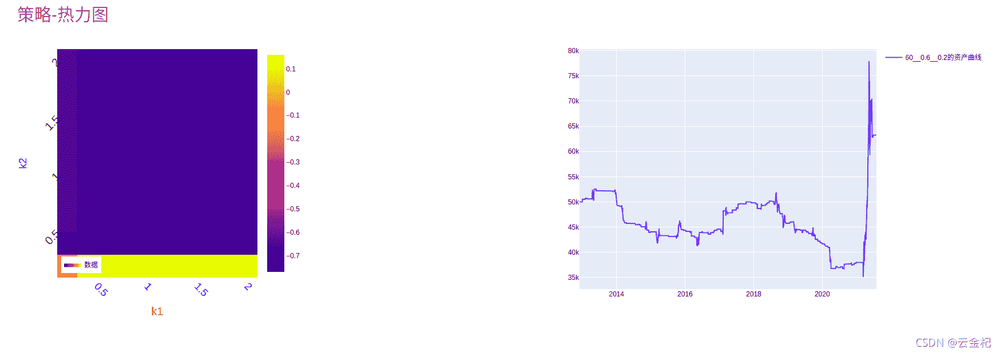

# 69、【backtrader 期货策略】十大经典策略之 Dual Thrust 策略(2021-10-28 更新)

> 原文：<https://yunjinqi.blog.csdn.net/article/details/120572676>

原本计划是实现《151 trading strategies》中的商品与期货部分的策略，今天又看了一下，好多都是多空交易的横截面策略，实现起来一般都是需要的资金量比较多，不太适合普通投资者使用，所以综合考虑后，决定实现一些网上开源的期货策略。

今天实现的是一个经典的日内交易策略 Dual Thrust，以捕捉价格突破为主。该策略由 Michael Chalek 在 20 世纪 80 年代开发，曾被 Future Thruth 杂志评为最赚钱的策略之一。

#### 策略逻辑

1.  计算过去 N 个交易日的四个价格：最高价的最高价(HH)，收盘价的最低价(LC)，收盘价的最高价(HC)，最低价的最低价(LL);

2.  计算 range 的大小，令 range = max(HH-LC,HC-LL)

3.  以当天的开盘价 openD(0)为中枢，加上 k1 倍的 range 形成上轨，减去 k2 倍的 range 形成下轨

4.  当日价格突破上轨的时候，平空开多，1 手；

5.  当日价格跌破下轨的时候，平多开空，1 手；

6.  交易费用按照万分之二计算。没有单独设置滑点。需要可以自己单独设置，在教程里面有。因为随着市场条件不同，滑点也不同，建议后续单独评估。

7.  测试数据

    使用后复权的玻璃期货 1 分钟的主力连续合约。

#### 策略代码

```py
from __future__ import (absolute_import, division, print_function,
                        unicode_literals)
import time,datetime
import os,sys
import pickle 
# import talib
import numpy as np
import pandas as pd
import random
import statsmodels.api as sm
from sklearn import linear_model

import backtrader as bt  # backtrader
from backtrader.comminfo import ComminfoFuturesPercent,ComminfoFuturesFixed # 期货交易的手续费用，按照比例或者按照金额

# from backtrader.plot.plot import run_cerebro_and_plot  # 个人编写，非 backtrader 自带
import pyfolio as pf

# 编写一个新的 macd 的指标，使得和国内的常用 macd 指标接轨

### 编写相应的策略,每个策略逻辑需要单独编写，回测和实盘直接运行策略类就行

class KeltnerStrategy(bt.Strategy):
    # 策略作者
    author = 'yunjinqi'
    # 策略的参数
    params = (  ("look_back_days",10),                  
                ("k1",0.5), 
                ("k2",0.5),
            )
    # log 相应的信息
    def log(self, txt, dt=None):
        ''' Logging function fot this strategy'''
        dt = dt or bt.num2date(self.datas[0].datetime[0])
        print('{}, {}'.format(dt.isoformat(), txt))

    # 初始化策略的数据
    def __init__(self):
        # 基本上常用的部分属性变量
        self.bar_num = 0       # next 运行了多少个 bar
        self.pre_date = None   # 保存上个交易日的日期
        # 使用未来数据，分析下个交易日是否存在夜盘
        self.has_night_trading = False 
        # 保存当前交易日的最高价、最低价，收盘价
        self.now_high = 0 
        self.now_low = 999999999 
        self.now_close = None
        self.now_open = None 
        # 保存历史上的每日的最高价、最低价与收盘价
        self.day_high_list = []
        self.day_low_list = []
        self.day_close_list = []
        # 保存交易状态
        self.marketposition = 0

    def prenext(self):
        # 由于期货数据有几千个，每个期货交易日期不同，并不会自然进入 next
        # 需要在每个 prenext 中调用 next 函数进行运行
        # self.next() 
        pass 

    # 在 next 中添加相应的策略逻辑
    def next(self):
        # 每次运行一次，bar_num 自然加 1,并更新交易日
        self.current_datetime = bt.num2date(self.datas[0].datetime[0])
        self.current_hour = self.current_datetime.hour
        self.current_minute = self.current_datetime.minute
        self.bar_num+=1
        # 数据
        data = self.datas[0]

        # 更新最高价、最低价、收盘价
        self.now_high = max(self.now_high,data.high[0])
        self.now_low = min(self.now_low,data.low[0])
        if self.now_close is None:
            self.now_open = data.open[0]
        self.now_close = data.close[0]
        # 如果是新的交易日的最后一分钟的数据
        if self.current_hour==15:
            # 保存当前的三个价格
            self.day_high_list.append(self.now_high)
            self.day_low_list.append(self.now_low)
            self.day_close_list.append(self.now_close)
            # 初始化四个价格
            self.now_high = 0 
            self.now_low = 999999999 
            self.now_close = None 
        # 长度足够，开始计算指标、交易信号
        if len(self.day_high_list)>self.p.look_back_days:
            # 计算 range
            hh = max(self.day_high_list[-1*self.p.look_back_days:])
            lc = min(self.day_close_list[-1*self.p.look_back_days:])
            hc = max(self.day_close_list[-1*self.p.look_back_days:])
            ll = min(self.day_low_list[-1*self.p.look_back_days:])
            range_price = max(hh-lc,hc-ll)
            # 计算上轨与下轨
            close = data.close[0]
            upper_line = self.now_open + self.p.k1*range_price
            lower_line = self.now_open - self.p.k2*range_price
            # self.log(f"close: {close},upper_line:{upper_line},lower_line:{lower_line}，range:{range_price},hh:{hh},lc:{lc},hc:{hc},ll:{ll}")
            # 其实可以把计算指标的过程写成一个函数，这样在 next 中只保留策略逻辑，看起来会更简洁一些。
            # 开始交易
            open_time_1 = self.current_hour>=21 and self.current_hour<=23
            open_time_2 = self.current_hour>=9 and self.current_hour<=11
            if open_time_1 or open_time_2:
                # 开多
                if self.marketposition == 0 and close>upper_line:
                    self.buy(data,size = 1)
                    self.marketposition = 1

                # 开空
                if self.marketposition == 0 and close<lower_line:
                    self.sell(data,size = 1)
                    self.marketposition = -1

            # 平多开空
            if self.marketposition == 1 and close<lower_line:
                # 使用 target_order 也可以，不同的下单方法，本质一样
                self.close(data)
                self.sell(data,size = 1)
                self.marketposition = -1

            # 平空开多
            if self.marketposition == -1 and close>upper_line:
                # 使用 target_order 也可以，不同的下单方法，本质一样
                self.close(data)
                self.buy(data,size = 1)
                self.marketposition = 1

            # 收盘前平仓
            if self.marketposition!=0 and self.current_hour == 14 and self.current_minute == 55 :
                self.close(data)
                self.marketposition = 0

    def notify_order(self, order):

        if order.status in [order.Submitted, order.Accepted]:
            return

        if order.status == order.Rejected:
            self.log(f"Rejected : order_ref:{order.ref} data_name:{order.p.data._name}")

        if order.status == order.Margin:
            self.log(f"Margin : order_ref:{order.ref} data_name:{order.p.data._name}")

        if order.status == order.Cancelled:
            self.log(f"Concelled : order_ref:{order.ref} data_name:{order.p.data._name}")

        if order.status == order.Partial:
            self.log(f"Partial : order_ref:{order.ref} data_name:{order.p.data._name}")

        if order.status == order.Completed:
            if order.isbuy():
                self.log(f" BUY : data_name:{order.p.data._name} price : {order.executed.price} , cost : {order.executed.value} , commission : {order.executed.comm}")

            else:  # Sell
                self.log(f" SELL : data_name:{order.p.data._name} price : {order.executed.price} , cost : {order.executed.value} , commission : {order.executed.comm}")

    def notify_trade(self, trade):
        # 一个 trade 结束的时候输出信息
        if trade.isclosed:
            self.log('closed symbol is : {} , total_profit : {} , net_profit : {}' .format(
                            trade.getdataname(),trade.pnl, trade.pnlcomm))
            # self.trade_list.append([self.datas[0].datetime.date(0),trade.getdataname(),trade.pnl,trade.pnlcomm])

        if trade.isopen:
            self.log('open symbol is : {} , price : {} ' .format(
                            trade.getdataname(),trade.price))

    def stop(self):
        # 策略停止的时候输出信息
        # with open("C:/data/filter_data_contract.pkl",'wb') as f:
        #    pickle.dump(self.my_datases,f)
        # df = pd.DataFrame(self.trade_result)
        # df.columns=['datetime','symbol','size','current_price','order_price','pnl','net_profit']
        # df.to_csv("C:/result/test1_trade_history.csv")

        # df1 = pd.DataFrame(self.position_result)
        # df1.columns=['datetime','symbol','size','close']
        # df1.to_csv("c:/result/test1_position_history.csv")

        # df2=pd.DataFrame(self.order_result)
        # df2.columns=["datetime",'symbol','size','0','direction']
        # df2.to_csv("C:/result/test1_order_history.csv")
        pass 

# 准备配置策略
cerebro = bt.Cerebro()
# 参数设置
data_kwargs = dict(
            fromdate = datetime.datetime(2012,12, 3),
            todate = datetime.datetime(2021,7,31),
            timeframe = bt.TimeFrame.Minutes,
            compression = 1,
            dtformat=('%Y-%m-%d %H:%M:%S'), # 日期和时间格式
            tmformat=('%H:%M:%S'), # 时间格式
            datetime=0,
            high=3,
            low=4,
            open=1,
            close=2,
            volume=5,
            openinterest=6)

# 玻璃后复权数据
data_path = "d:/data/future/1m/FG889.csv"
# 加载该数据
name = "FG"
df = pd.read_csv(data_path)
# 只要数据里面的这几列
df = df[['datetime','open','high','low','close','volume','open_interest']]
df.columns = ['datetime','open','high','low','close','volume','openinterest']
# 修改列的名字
df.index = pd.to_datetime(df['datetime'])
# 如果对数据的时间顺序比较确定是从小到大的，可以不用排序，否则最好做下排序
df = df[['open','high','low','close','volume','openinterest']]
df = df[(df.index<=data_kwargs['todate'])&(df.index>=data_kwargs['fromdate'])]
feed = bt.feeds.PandasDirectData(dataname = df)
cerebro.adddata(feed, name = name)
# 设置合约的交易信息，交易 1 手需要 6 元手续费，我们额外增加 1 跳的交易成本做滑点(也可以通过滑点设置)
comm=ComminfoFuturesFixed(commission=26,margin=0.15, mult=20)
cerebro.broker.addcommissioninfo(comm, name= name)
cerebro.broker.setcash(50000.0)
# 添加策略
cerebro.addstrategy(KeltnerStrategy)
cerebro.addanalyzer(bt.analyzers.TotalValue, _name='_TotalValue')
cerebro.addanalyzer(bt.analyzers.PyFolio)

# 运行回测
results = cerebro.run()

pyfoliozer = results[0].analyzers.getbyname('pyfolio')
returns, positions, transactions, gross_lev = pyfoliozer.get_pf_items()
pf.create_full_tear_sheet(
    returns,
    positions=positions,
    transactions=transactions,
    # gross_lev=gross_lev,
    # live_start_date='2019-01-01',
    ) 
```

#### 在玻璃期货上的表现



#### 策略点评

前几年，这个策略在玻璃期货上表现很一般。但是最近一段时间一来，该期货行情明显发生了变化，该策略表现比较好。我也是最近观察到这个期货比较活跃，就测试了一下，该策略在玻璃期货上的表现。除了在玻璃期货上，在其他品种上，也有一些表现比较好。

#### 数据与代码

链接: https://pan.baidu.com/s/1Nqgr2vJJUpr5A-2aiIed5w 提取码: khta 复制这段内容后打开百度网盘手机 App，操作更方便哦