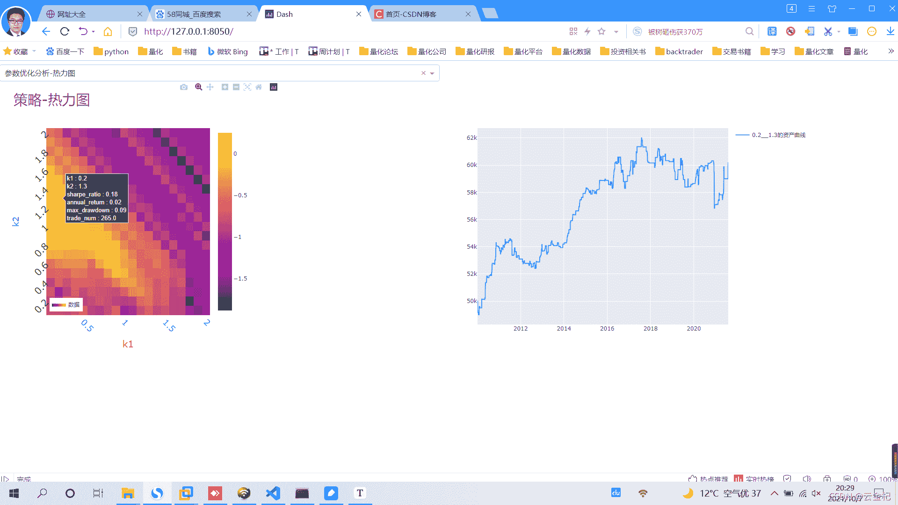
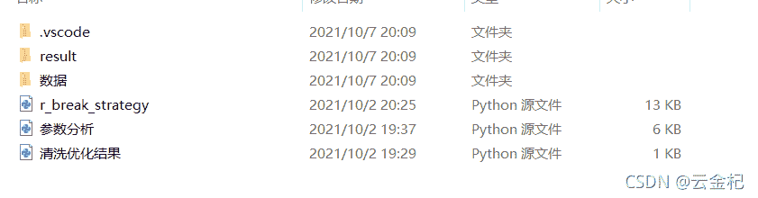

# 70、【backtrader 期货策略】十大经典策略之 R-break(优化版)

> 原文：<https://yunjinqi.blog.csdn.net/article/details/120641844>

本文尝试在 backtrader 上实现 R-break,并对该策略的逻辑进行一定的优化，然后在螺纹钢 5 分钟后复权的连续合约上进行参数优化，分析参数优化后的结果。

#### 策略逻辑

经典的策略逻辑在网上随便一找就一大把，我们梳理下本文使用的优化后的 R-break 的逻辑。

1.  使用前一天的最高价、最低价、收盘价三个价格的平均值作为均价-pivot

2.  使用前一天的最高价与最低价的差值作为带宽-price_range

3.  设置两个参数，k1 和 k2(k1<k2)

4.  计算四个轨道，突破开多价格：r3 = pivot+k2*price_range;跌破平多开空价格：r1 = pivot+k1*price_range;跌破开空价格：s3 = pivot-k2*price_range;升破平空开多价格：s1 = pivot-k1*price_range;

5.  如果没有仓位，当价格突破 r3,开多；如果持有多头，当价格跌破 r1,平多开空；

    如果没有仓位，当价格跌破 s3,开空；如果持有空头，当价格升破 s1,平空开多；

6.  交易在 5 分钟的后复权的连续合约上；

7.  默认手续费万分之 3 可以覆盖真实的交易成本(手续费与滑点)

#### 参数优化结果



#### 策略代码

由于 csdn 好像不能直接复制付费专栏的内容了，代码和数据都会上传到百度云盘上，链接在文末。

```py
from __future__ import (absolute_import, division, print_function,
                        unicode_literals)
import time,datetime
import os,sys
import pickle 
# import talib
import numpy as np
import pandas as pd
import random
import statsmodels.api as sm
from sklearn import linear_model

import backtrader as bt  # backtrader
from backtrader.comminfo import ComminfoFuturesPercent,ComminfoFuturesFixed # 期货交易的手续费用，按照比例或者按照金额

# from backtrader.plot.plot import run_cerebro_and_plot  # 个人编写，非 backtrader 自带
import pyfolio as pf
from multiprocessing import Pool
from itertools import product

# 编写一个新的 macd 的指标，使得和国内的常用 macd 指标接轨

### 编写相应的策略,每个策略逻辑需要单独编写，回测和实盘直接运行策略类就行

class RBreakStrategy(bt.Strategy):
    # 策略作者
    author = 'yunjinqi'
    # 策略的参数
    params = (  ("k1",0.5), 
            ("k2",0.5),                     
            )
    # log 相应的信息
    def log(self, txt, dt=None):
        ''' Logging function fot this strategy'''
        dt = dt or bt.num2date(self.datas[0].datetime[0])
        print('{}, {}'.format(dt.isoformat(), txt))

    # 初始化策略的数据
    def __init__(self):
        # 基本上常用的部分属性变量
        self.bar_num = 0       # next 运行了多少个 bar
        self.pre_date = None   # 保存上个交易日的日期
        # 使用未来数据，分析下个交易日是否存在夜盘
        self.has_night_trading = False 
        # 保存当前交易日的最高价、最低价，收盘价
        self.now_high = 0 
        self.now_low = 999999999 
        self.now_close = None
        self.now_open = None 
        # 保存历史上的每日的最高价、最低价与收盘价
        self.day_high_list = []
        self.day_low_list = []
        self.day_close_list = []
        # 保存交易状态
        self.marketposition = 0

    def prenext(self):
        # 由于期货数据有几千个，每个期货交易日期不同，并不会自然进入 next
        # 需要在每个 prenext 中调用 next 函数进行运行
        # self.next() 
        pass 

    # 在 next 中添加相应的策略逻辑
    def next(self):
        # 每次运行一次，bar_num 自然加 1,并更新交易日
        self.current_datetime = bt.num2date(self.datas[0].datetime[0])
        self.current_hour = self.current_datetime.hour
        self.current_minute = self.current_datetime.minute
        self.bar_num+=1
        # 数据
        data = self.datas[0]

        # 更新最高价、最低价、收盘价
        self.now_high = max(self.now_high,data.high[0])
        self.now_low = min(self.now_low,data.low[0])
        if self.now_close is None:
            self.now_open = data.open[0]
        self.now_close = data.close[0]
        # 如果是新的交易日的最后一分钟的数据
        if self.current_hour==15:
            # 保存当前的三个价格
            self.day_high_list.append(self.now_high)
            self.day_low_list.append(self.now_low)
            self.day_close_list.append(self.now_close)
            # 初始化四个价格
            self.now_high = 0 
            self.now_low = 999999999 
            self.now_close = None 
        # 长度足够，开始计算指标、交易信号
        if len(self.day_high_list)>1:
            # 计算 range
            pre_high = self.day_high_list[-1]
            pre_low = self.day_low_list[-1]
            pre_close = self.day_close_list[-1]
            pivot = (pre_high+pre_low+pre_close)/3
            # r1 = 2*pivot - pre_low 
            # r2 = pivot+pre_high-pre_low 
            # r3 = pre_high + 2*(pivot - pre_low)
            # s1 = 2*pivot - pre_high 
            # s2 = pivot - (pre_high  - pre_low)
            # s3 = pre_low  - 2*(pre_high-pivot)
            # 六个价格等价于
            # r1 = 2/3*pre_high+2/3*pre_close-1/3*pre_low
            # r3 = 5/3*pre_high+2/3*pre_close-4/3*pre_low
            # s1 = -1/3*pre_high+2/3*pre_close+1/3*pre_low
            # S3 = -4/3*pre_high+2/3*pre_close+5/3*pre_low
            # r1 = self.p.percent_value*pre_high+self.p.percent_value*pre_close-(1-self.p.percent_value)*pre_low
            # r3 = (1+self.p.percent_value)*pre_high+self.p.percent_value*pre_close-2*self.p.percent_value*pre_low
            # s1 = (self.p.percent_value-1)*pre_high+self.p.percent_value*pre_close+(1-self.p.percent_value)*pre_low
            # s3 = -2*self.p.percent_value*pre_high+self.p.percent_value*pre_close+(1+self.p.percent_value)*pre_low
            # 这样设置参数还有一些绕，接下来简化下，设置两个参数，k1 和 k2，分别代表 s1,s2,r1,r2
            r1 = pivot + (self.p.k1)*(pre_high-pre_low)
            r3 = pivot + (self.p.k1+self.p.k2)*(pre_high-pre_low)
            s1 = pivot - (self.p.k1)*(pre_high-pre_low)
            s3 = pivot - (self.p.k1+self.p.k2)*(pre_high-pre_low)

            # 开始交易
            open_time_1 = self.current_hour>=21 and self.current_hour<=23
            open_time_2 = self.current_hour>=9 and self.current_hour<=11
            close = data.close[0]
            if open_time_1 or open_time_2:
                # 开多
                if self.marketposition == 0 and close >  r3:
                    self.buy(data,size = 1)
                    self.marketposition = 1

                # 开空
                if self.marketposition == 0 and close < s3:
                    self.sell(data,size = 1)
                    self.marketposition = -1

                # 平多开空
                if self.marketposition == 1 and close<r1:
                    # 使用 target_order 也可以，不同的下单方法，本质一样
                    self.close(data)
                    self.sell(data,size = 1)
                    self.marketposition = -1

                # 平空开多
                if self.marketposition == -1 and close>s1:
                    # 使用 target_order 也可以，不同的下单方法，本质一样
                    self.close(data)
                    self.buy(data,size = 1)
                    self.marketposition = 1

        # 收盘前平仓
        # self.log(f"{self.current_hour},{self.current_minute}")
        if self.marketposition!=0 and self.current_hour == 14 and self.current_minute == 55 :
            self.close(data)
            self.marketposition = 0

    # def notify_order(self, order):

    #     if order.status in [order.Submitted, order.Accepted]:
    #         return

    #     if order.status == order.Rejected:
    #         self.log(f"Rejected : order_ref:{order.ref}  data_name:{order.p.data._name}")

    #     if order.status == order.Margin:
    #         self.log(f"Margin : order_ref:{order.ref}  data_name:{order.p.data._name}")

    #     if order.status == order.Cancelled:
    #         self.log(f"Concelled : order_ref:{order.ref}  data_name:{order.p.data._name}")

    #     if order.status == order.Partial:
    #         self.log(f"Partial : order_ref:{order.ref}  data_name:{order.p.data._name}")

    #     if order.status == order.Completed:
    #         if order.isbuy():
    #             self.log(f" BUY : data_name:{order.p.data._name} price : {order.executed.price} , cost : {order.executed.value} , commission : {order.executed.comm}")

    #         else:  # Sell
    #             self.log(f" SELL : data_name:{order.p.data._name} price : {order.executed.price} , cost : {order.executed.value} , commission : {order.executed.comm}")

    # def notify_trade(self, trade):
    #     # 一个 trade 结束的时候输出信息
    #     if trade.isclosed:
    #         self.log('closed symbol is : {} , total_profit : {} , net_profit : {}' .format(
    #                         trade.getdataname(),trade.pnl, trade.pnlcomm))
    #         # self.trade_list.append([self.datas[0].datetime.date(0),trade.getdataname(),trade.pnl,trade.pnlcomm])

    #     if trade.isopen:
    #         self.log('open symbol is : {} , price : {} ' .format(
    #                         trade.getdataname(),trade.price))

    def stop(self):
        # 策略停止的时候输出信息
        # with open("C:/data/filter_data_contract.pkl",'wb') as f:
        #    pickle.dump(self.my_datases,f)
        # df = pd.DataFrame(self.trade_result)
        # df.columns=['datetime','symbol','size','current_price','order_price','pnl','net_profit']
        # df.to_csv("C:/result/test1_trade_history.csv")

        # df1 = pd.DataFrame(self.position_result)
        # df1.columns=['datetime','symbol','size','close']
        # df1.to_csv("c:/result/test1_position_history.csv")

        # df2=pd.DataFrame(self.order_result)
        # df2.columns=["datetime",'symbol','size','0','direction']
        # df2.to_csv("C:/result/test1_order_history.csv")
        pass 

def run(params):
    print(f"开始运行{params}")  
    # 准备配置策略
    cerebro = bt.Cerebro()
    # 参数设置
    data_kwargs = dict(
                # fromdate = datetime.datetime(2012,12, 3),
                # todate = datetime.datetime(2021,7,31),
                timeframe = bt.TimeFrame.Minutes,
                compression = 1,
                dtformat=('%Y-%m-%d %H:%M:%S'), # 日期和时间格式
                tmformat=('%H:%M:%S'), # 时间格式
                datetime=0,
                high=3,
                low=4,
                open=1,
                close=2,
                volume=5,
                openinterest=6)

    # 后复权数据
    data_path = "./数据/RB889.csv"
    # 加载该数据
    name = "RB"
    df = pd.read_csv(data_path)
    # 只要数据里面的这几列
    df = df[['datetime','open','high','low','close','volume','open_interest']]
    df.columns = ['datetime','open','high','low','close','volume','openinterest']
    # 修改列的名字
    df = df.sort_values("datetime")
    df = df.drop_duplicates("datetime")
    df.index = pd.to_datetime(df['datetime'])
    # 如果对数据的时间顺序比较确定是从小到大的，可以不用排序，否则最好做下排序
    df = df[['open','high','low','close','volume','openinterest']]
    # df = df[(df.index<=data_kwargs['todate'])&(df.index>=data_kwargs['fromdate'])]
    feed = bt.feeds.PandasDirectData(dataname = df)
    # feed = bt.feeds.GenericCSVData(dataname = data_path,**data_kwargs)
    cerebro.adddata(feed, name = name)
    # 设置合约的交易信息，交易 1 手需要 6 元手续费，我们额外增加 1 跳的交易成本做滑点(也可以通过滑点设置)
    # comm =ComminfoFuturesFixed(commission=26,margin=0.15, mult=20)
    comm = ComminfoFuturesPercent(commission=0.0003,margin=0.10, mult=10)
    cerebro.broker.addcommissioninfo(comm, name= name)
    cerebro.broker.setcash(50000.0)
    # 添加策略
    kwags={"k1":params[0],                  
            "k2":params[1],
             }
    # 添加策略
    cerebro.addstrategy(RBreakStrategy,**kwags)
    cerebro.addanalyzer(bt.analyzers.TotalValue, _name='my_value')
    cerebro.addanalyzer(bt.analyzers.SharpeRatio, _name='my_sharpe')
    cerebro.addanalyzer(bt.analyzers.Returns, _name='my_returns')
    cerebro.addanalyzer(bt.analyzers.DrawDown, _name='my_drawdown')
    cerebro.addanalyzer(bt.analyzers.TradeAnalyzer, _name='my_trade_analyzer')

    # cerebro.addanalyzer(bt.analyzers.PyFolio)

    # 运行回测
    results = cerebro.run()
    sharpe_ratio = results[0].analyzers.my_sharpe.get_analysis()['sharperatio']
    annual_return = results[0].analyzers.my_returns.get_analysis()['rnorm']
    max_drawdown = results[0].analyzers.my_drawdown.get_analysis()["max"]["drawdown"]/100
    trade_num = results[0].analyzers.my_trade_analyzer.get_analysis()['total']['total']
    value_df = pd.DataFrame([results[0].analyzers.my_value.get_analysis()]).T
    value_df.columns=['value']
    # print(value_df.head())
    file_name = str(params[0])+"__"+str(params[1])+"__"+str(round(sharpe_ratio,2))+"__"+str(round(annual_return,2))+"__"+str(round(max_drawdown,2))+"__"+str(trade_num)
    value_df.to_csv("./result/参数优化结果/"+file_name+".csv")
    return [params[0],params[1],sharpe_ratio,annual_return,max_drawdown,trade_num]

if __name__=="__main__":
    period_list = [20]
    k1_list = [i/100 for i in range(10,201,10)]
    k2_list = [i/100 for i in range(10,201,10)]
    params_list = product(k1_list,k2_list)
    with Pool(8) as p:
        results = p.map(run,params_list)
    df = pd.DataFrame(results,columns=['percent_value',"period","sharpe_ratio","annual_return","max_drawdown","trade_num"])
    df.to_csv("./result/rb_ 参数优化结果.csv")
    # run([0.8,0.8]) 
```

#### 策略点评

从回测结果来看，这个策略并不是很好，但是，交易次数相对比较多，可以考虑做一个过滤，过滤掉部分交易，提高交易的胜率与盈亏比。

#### 数据及代码



链接: https://pan.baidu.com/s/1F1OosfpHKckf-YEizLIlYA 提取码: nbfi 复制这段内容后打开百度网盘手机 App，操作更方便哦