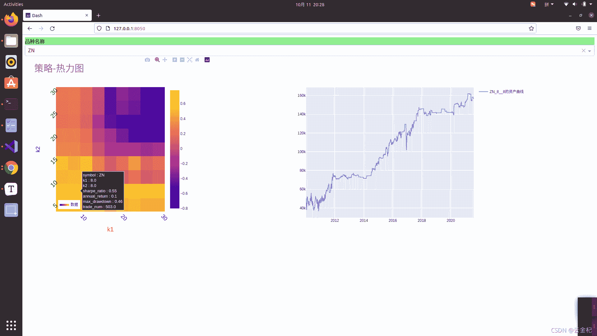

# 71、【backtrader 期货策略】十大经典策略-空中花园(各品种参数优化版本)

> 原文：<https://yunjinqi.blog.csdn.net/article/details/120711501>

这篇文章尝试在 5 分钟的期货后复权连续合约上实现空中花园的日内交易策略，对众多的期货品种分别进行参数优化，并更新了前几篇文章的分析参数优化结果的代码。

#### 策略逻辑

开多：如果当日开盘价比前一日的收盘价高一定的比例，并且当前的价格大于了当日开盘前 5 分钟形成的最高价，开多；

开空：如果当日的开盘价比前一日的收盘价小一定的比例，并且当前的价格小于了当日开盘前 5 分钟形成的最低价，开空；

平仓：收盘前 5 分钟平仓。

#### 策略绩效

日内交易策略一般普适性没有那么高，很难在很多品种上都同时盈利。这篇文章里面展示了一些表现表现相对比较好的品种。另外特别说明的是，在做多个品种的回测的时候，统一设置的品种的乘数、保证金、以及交易费用，这种设置是不合理的，需要针对每个品种单独设置，尤其是乘数、交易费用。



#### 策略代码

```py
from __future__ import (absolute_import, division, print_function,
                        unicode_literals)

import os,sys 
import numpy as np
import pandas as pd

import backtrader as bt  # backtrader
from backtrader.comminfo import ComminfoFuturesPercent,ComminfoFuturesFixed # 期货交易的手续费用，按照比例或者按照金额

# from backtrader.plot.plot import run_cerebro_and_plot  # 个人编写，非 backtrader 自带
import pyfolio as pf
from multiprocessing import Pool
from itertools import product

### 编写相应的策略,每个策略逻辑需要单独编写，回测和实盘直接运行策略类就行

class RBreakStrategy(bt.Strategy):
    # 策略作者
    author = 'yunjinqi'
    # 策略的参数
    params = (  ("k1",0.5), 
            ("k2",0.5),                     
            )
    # log 相应的信息
    def log(self, txt, dt=None):
        ''' Logging function fot this strategy'''
        dt = dt or bt.num2date(self.datas[0].datetime[0])
        print('{}, {}'.format(dt.isoformat(), txt))

    # 初始化策略的数据
    def __init__(self):
        # 基本上常用的部分属性变量
        self.day_bar_num = 0       # 当天的第几根 bar
        self.pre_date = None   # 保存上个交易日的日期
        # 使用未来数据，分析下个交易日是否存在夜盘
        self.has_night_trading = False 
        # 保存当前交易日的最高价、最低价，收盘价
        self.now_high = 0 
        self.now_low = 999999999 
        self.now_close = None
        self.now_open = None 
        # 保存历史上的每日的最高价、最低价与收盘价
        self.day_high_list = []
        self.day_low_list = []
        self.day_close_list = []
        # 保存交易状态
        self.marketposition = 0

    def prenext(self):
        # 由于期货数据有几千个，每个期货交易日期不同，并不会自然进入 next
        # 需要在每个 prenext 中调用 next 函数进行运行
        # self.next() 
        pass 

    # 在 next 中添加相应的策略逻辑
    def next(self):
        # 每次运行一次，bar_num 自然加 1,并更新交易日
        self.current_datetime = bt.num2date(self.datas[0].datetime[0])
        self.current_hour = self.current_datetime.hour
        self.current_minute = self.current_datetime.minute
        self.day_bar_num+=1
        # 数据
        data = self.datas[0]

        # 更新最高价、最低价、收盘价
        self.now_high = max(self.now_high,data.high[0])
        self.now_low = min(self.now_low,data.low[0])
        if self.now_close is None:
            self.now_open = data.open[0]
        self.now_close = data.close[0]
        # 如果是新的交易日的最后一分钟的数据
        if self.current_hour==15:
            # 保存当前的三个价格
            self.day_high_list.append(self.now_high)
            self.day_low_list.append(self.now_low)
            self.day_close_list.append(self.now_close)
            # 初始化四个价格
            self.now_high = 0 
            self.now_low = 999999999 
            self.now_close = None
            # 初始化 k 线数
            self.day_bar_num = 0 
        # 长度足够，开始计算指标、交易信号
        if len(self.day_high_list)>1:
            # 计算 range
            pre_high = self.day_high_list[-1]
            pre_low = self.day_low_list[-1]
            pre_close = self.day_close_list[-1]
            # 计算空中花园的开仓条件
            # 如果现在是开盘的第一根 K 线
            if self.day_bar_num==0:
                self.first_bar_high_price = data.high[0]
                self.first_bar_low_price = data.low[0]

            # 开始交易
            open_time_1 = self.current_hour>=21 and self.current_hour<=23
            open_time_2 = self.current_hour>=9 and self.current_hour<=11
            close = data.close[0]
            if open_time_1 or open_time_2:
                # 开多
                if self.marketposition == 0 and self.now_open > pre_close*(self.p.k1/1000+1) and data.close[0]>self.first_bar_high_price:
                    self.buy(data,size = 1)
                    self.marketposition = 1

                # 开空
                if self.marketposition == 0 and self.now_open < pre_close*(-1*self.p.k2/1000+1) and data.close[0]<self.first_bar_low_price:
                    self.sell(data,size = 1)
                    self.marketposition = -1     
        # 收盘前平仓
        # self.log(f"{self.current_hour},{self.current_minute}")
        if self.marketposition!=0 and self.current_hour == 14 and self.current_minute == 55 :
            self.close(data)
            self.marketposition = 0

    # def notify_order(self, order):

    #     if order.status in [order.Submitted, order.Accepted]:
    #         return

    #     if order.status == order.Rejected:
    #         self.log(f"Rejected : order_ref:{order.ref}  data_name:{order.p.data._name}")

    #     if order.status == order.Margin:
    #         self.log(f"Margin : order_ref:{order.ref}  data_name:{order.p.data._name}")

    #     if order.status == order.Cancelled:
    #         self.log(f"Concelled : order_ref:{order.ref}  data_name:{order.p.data._name}")

    #     if order.status == order.Partial:
    #         self.log(f"Partial : order_ref:{order.ref}  data_name:{order.p.data._name}")

    #     if order.status == order.Completed:
    #         if order.isbuy():
    #             self.log(f" BUY : data_name:{order.p.data._name} price : {order.executed.price} , cost : {order.executed.value} , commission : {order.executed.comm}")

    #         else:  # Sell
    #             self.log(f" SELL : data_name:{order.p.data._name} price : {order.executed.price} , cost : {order.executed.value} , commission : {order.executed.comm}")

    # def notify_trade(self, trade):
    #     # 一个 trade 结束的时候输出信息
    #     if trade.isclosed:
    #         self.log('closed symbol is : {} , total_profit : {} , net_profit : {}' .format(
    #                         trade.getdataname(),trade.pnl, trade.pnlcomm))
    #         # self.trade_list.append([self.datas[0].datetime.date(0),trade.getdataname(),trade.pnl,trade.pnlcomm])

    #     if trade.isopen:
    #         self.log('open symbol is : {} , price : {} ' .format(
    #                         trade.getdataname(),trade.price))

    def stop(self):

        pass 

def run(params):
    print(f"开始运行{params}")  
    # 准备配置策略
    cerebro = bt.Cerebro()
    # 参数设置
    data_kwargs = dict(
                # fromdate = datetime.datetime(2012,12, 3),
                # todate = datetime.datetime(2021,7,31),
                timeframe = bt.TimeFrame.Minutes,
                compression = 1,
                dtformat=('%Y-%m-%d %H:%M:%S'), # 日期和时间格式
                tmformat=('%H:%M:%S'), # 时间格式
                datetime=0,
                high=3,
                low=4,
                open=1,
                close=2,
                volume=5,
                openinterest=6)

    # 分解参数
    name ,k1,k2 = params
    # 获取当前的已经优化的文件名
    file_list = list(os.listdir("./71 讲/result/参数优化结果/"))
    param_list=["__".join(i.split("__")[:3]) for i in file_list]
    if "__".join([str(i) for i in params]) in param_list:
        print("__".join([str(i) for i in params]),"has run")
        return [name,k1,k2,0,0,0,0]
    else:

        # 后复权数据
        data_path = "/home/yun/data/期货/5m/rq_5min_after/"+name+"889.csv"

        df = pd.read_csv(data_path)
        # 只要数据里面的这几列
        df = df[['datetime','open','high','low','close','volume','open_interest']]
        df.columns = ['datetime','open','high','low','close','volume','openinterest']
        # 修改列的名字
        df = df.sort_values("datetime")
        df = df.drop_duplicates("datetime")
        df.index = pd.to_datetime(df['datetime'])
        # 如果对数据的时间顺序比较确定是从小到大的，可以不用排序，否则最好做下排序
        df = df[['open','high','low','close','volume','openinterest']]
        # df = df[(df.index<=data_kwargs['todate'])&(df.index>=data_kwargs['fromdate'])]
        feed = bt.feeds.PandasDirectData(dataname = df)
        # feed = bt.feeds.GenericCSVData(dataname = data_path,**data_kwargs)
        cerebro.adddata(feed, name = name)
        # 设置合约的交易信息
        # comm =ComminfoFuturesFixed(commission=10,margin=0.15, mult=10)
        comm = ComminfoFuturesPercent(commission=0.0003,margin=0.10, mult=10)
        cerebro.broker.addcommissioninfo(comm, name= name)
        cerebro.broker.setcash(50000.0)
        # 添加策略
        kwags={"k1":k1,                  
                "k2":k2,
                }
        # 添加策略
        cerebro.addstrategy(RBreakStrategy,**kwags)
        cerebro.addanalyzer(bt.analyzers.TotalValue, _name='my_value')
        cerebro.addanalyzer(bt.analyzers.SharpeRatio, _name='my_sharpe')
        cerebro.addanalyzer(bt.analyzers.Returns, _name='my_returns')
        cerebro.addanalyzer(bt.analyzers.DrawDown, _name='my_drawdown')
        cerebro.addanalyzer(bt.analyzers.TradeAnalyzer, _name='my_trade_analyzer')

        # cerebro.addanalyzer(bt.analyzers.PyFolio)

        # 运行回测
        results = cerebro.run()
        sharpe_ratio = results[0].analyzers.my_sharpe.get_analysis()['sharperatio']
        annual_return = results[0].analyzers.my_returns.get_analysis()['rnorm']
        max_drawdown = results[0].analyzers.my_drawdown.get_analysis()["max"]["drawdown"]/100
        trade_num = results[0].analyzers.my_trade_analyzer.get_analysis()['total']['total']
        value_df = pd.DataFrame([results[0].analyzers.my_value.get_analysis()]).T
        value_df.columns=['value']
        value_df['datetime']=pd.to_datetime(value_df.index)
        value_df['date']=[i.date() for i in value_df['datetime']]
        value_df= value_df.drop_duplicates("date",keep="last")
        value_df = value_df[['value']]
        # print(value_df.head())
        try:
            file_name = name+"__"+str(k1)+"__"+str(k2)+"__"+str(round(sharpe_ratio,2))+"__"+str(round(annual_return,2))+"__"+str(round(max_drawdown,2))+"__"+str(trade_num)
        except:
            file_name = name+"__"+str(k1)+"__"+str(k2)+"__"+str(0)+"__"+str(0)+"__"+str(0)+"__"+str(0)
        value_df.to_csv("./71 讲/result/参数优化结果/"+file_name+".csv")
        return [name,k1,k2,sharpe_ratio,annual_return,max_drawdown,trade_num]

if __name__=="__main__":
    symbol_list = ['A', 'JD', 'J', 'JM', 'MA', 'Y', 'IF', 'BU', 'SF', 'CU', 'RB', 'HC', 'OI', 'ZC', 'P', 'RU', 'RM', 'C', 'IC', 'SR', 'T', 'AU', 'M', 
                'FG', 'CY', 'SM', 'SS', 'AP', 'CF', 'AG', 'L', 'TS', 'NI', 'ZN', 'EG', 'B', 'PB', 'V', 'TA', 'FU', 'CS', 'SP', 'PP', 'TF', 'SC', 'AL']
    k1_list = [i for i in range(5,30,3)]
    k2_list = [i for i in range(5,30,3)]
    params_list = product(symbol_list,k1_list,k2_list)
    with Pool(4) as p:
        results = p.map(run,params_list)
    df = pd.DataFrame(results,columns=["name",'k1',"k2","sharpe_ratio","annual_return","max_drawdown","trade_num"])
    df.to_csv("./71 讲/result/all_ 参数优化结果.csv")
    # run([5,5]) 
```

#### 策略点评

这个策略逻辑比较简单，而且在多个品种上表现还可以，适合作为基础的逻辑，然后进行一定的优化。日内策略的核心在于寻找可重复的价格模式，通过多个价格模式的有机结合，可以形成一个完整的日内交易策略。比如，这个空中花园策略的价格模式就是认为：如果价格高开，以前 5 分钟的价格最高点形成上轨道，如果后续的收盘价大于这个上轨道，就可以开多，这样收盘前的价格会大概率大于这个上轨道。我们还可以叠加其他的模式进行过滤掉部分交易，目前这个空中花园的逻辑下，交易次数还是满多的。

#### 数据与代码

代码：

链接: https://pan.baidu.com/s/1LbtU9Ac4P_oRxBuFlv2UnQ 提取码: 2pxu 复制这段内容后打开百度网盘手机 App，操作更方便哦

5 分钟后复权数据：

链接: https://pan.baidu.com/s/14HzxmTNJibbradFA8k0saw 提取码: 7rue 复制这段内容后打开百度网盘手机 App，操作更方便哦