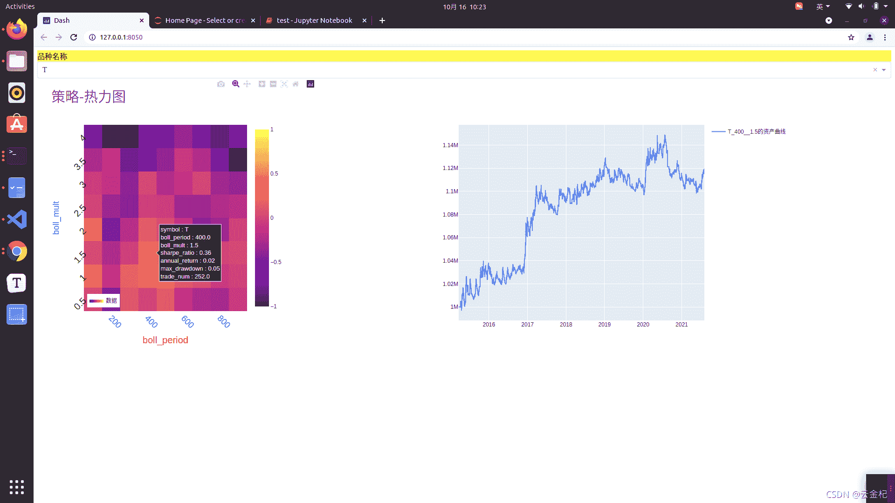
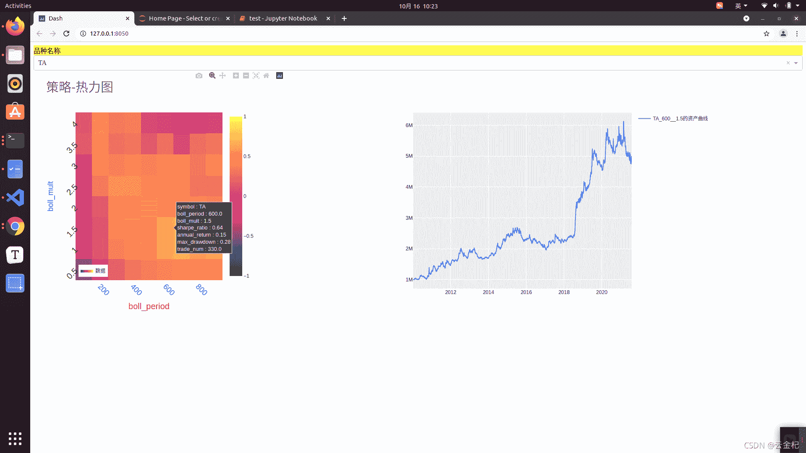
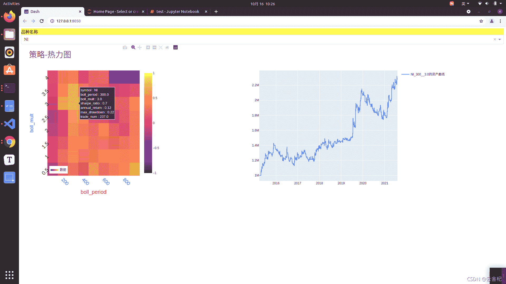
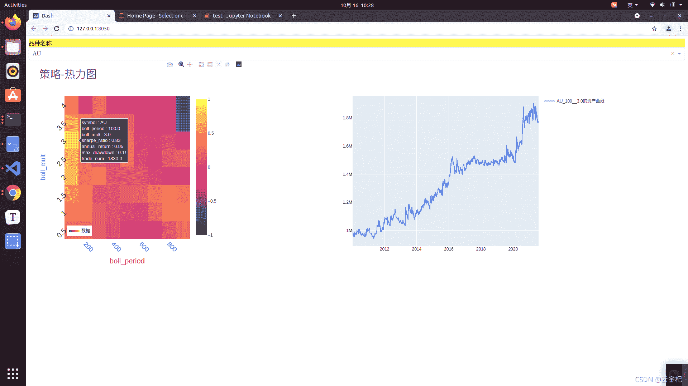
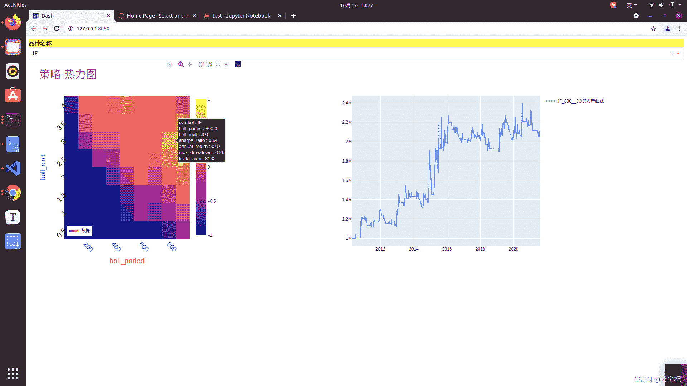
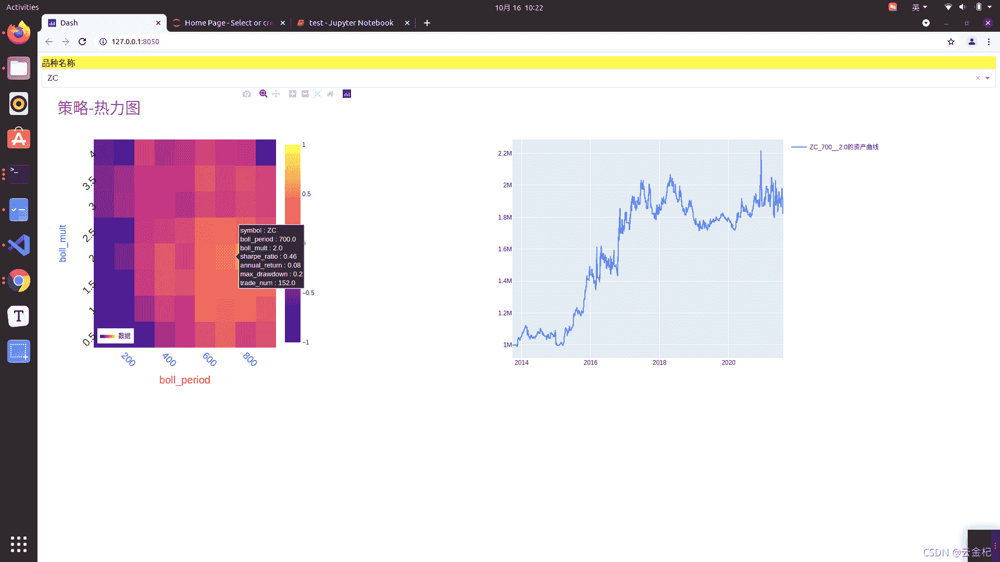
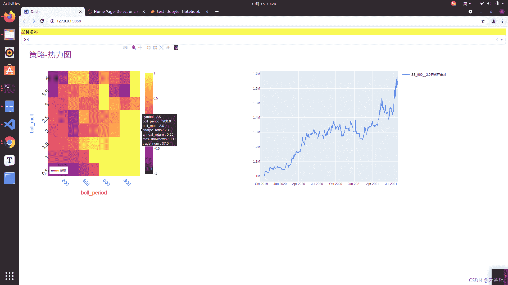

# 72、【backtrader 期货策略】十大经典策略-Aberration 策略(布林带策略)(2021-10-29 更新)

> 原文：<https://yunjinqi.blog.csdn.net/article/details/120795693>

这篇文章使用的是比较经典的 Aberration 策略，传说中盈利能力特别好的策略。在多品种参数优化的过程中，相比于前几篇文章，这篇文章针对不同的品种设置了不同的交易费用、并在每次交易的时候，计算了一跳的滑点，使得会交易回测更加接近真实。

2021-10-29 更新了手续费部分,对于按照百分比收取的品种,从优矿获得的手续费比例单位是百分之多少,所以需要从获取的值的上面除以 100

#### 策略逻辑

1.  使用布林带指标，构建布林带的上轨，中轨，下轨

2.  开仓

    *   当没有持仓的时候，收盘价突破上轨，下个开盘价开多；
    *   当没有持仓的时候，收盘价跌破下轨，下个开盘价开空。
3.  平仓

    当持有多头仓位的时候，收盘价跌破中轨，平多。

    当持有空头仓位的时候，收盘价升破中轨，平空。

4.  数据

    使用了 5 分钟的每个品种的后复权的连续合约

5.  交易费用

    按照当前的交易费用设置，每手收取固定金额或者按照百分比；每次交易收取一个滑点(开平都收)；由于保证金、交易费用、合约乘数可能会随着政策的变动而调整，另外交易产生的滑点可能多于一个点，也有一小部分可能小于一个点，甚至可能是负的，所以回测的结果和真实情况是存在差距的。

6.  交易手数

    按照当前资金的 1 倍杠杆进行下单。我们结果只需要看夏普率就好，在满足条件的情况下，夏普率不随杠杆而变动。

#### 测试结果










#### 策略代码

```py
from __future__ import (absolute_import, division, print_function,
                        unicode_literals)

import os,sys 
import numpy as np
import pandas as pd

import backtrader as bt  # backtrader
from backtrader.comminfo import ComminfoFuturesPercent,ComminfoFuturesFixed # 期货交易的手续费用，按照比例或者按照金额

# from backtrader.plot.plot import run_cerebro_and_plot  # 个人编写，非 backtrader 自带
import pyfolio as pf
from multiprocessing import Pool
from itertools import product

### 编写相应的策略,每个策略逻辑需要单独编写，回测和实盘直接运行策略类就行

class Abbration(bt.Strategy):
    # 策略作者
    author = 'yunjinqi'
    # 策略的参数
    params = (  ("boll_period",200), 
            ("boll_mult",2),                     
            )
    # log 相应的信息
    def log(self, txt, dt=None):
        ''' Logging function fot this strategy'''
        dt = dt or bt.num2date(self.datas[0].datetime[0])
        print('{}, {}'.format(dt.isoformat(), txt))

    # 初始化策略的数据
    def __init__(self):
        # 计算布林带指标，大名鼎鼎的布林带策略
        self.boll_indicator = bt.indicators.BollingerBands(self.datas[0],period=self.p.boll_period,devfactor=self.p.boll_mult)

        # 保存交易状态
        self.marketposition = 0

    def prenext(self):
        # 由于期货数据有几千个，每个期货交易日期不同，并不会自然进入 next
        # 需要在每个 prenext 中调用 next 函数进行运行
        # self.next() 
        pass 

    # 在 next 中添加相应的策略逻辑
    def next(self):
        # 每次运行一次，bar_num 自然加 1,并更新交易日
        self.current_datetime = bt.num2date(self.datas[0].datetime[0])
        self.current_hour = self.current_datetime.hour
        self.current_minute = self.current_datetime.minute
        # 数据
        data = self.datas[0]
        # 指标值
        # 布林带上轨
        top = self.boll_indicator.top
        # 布林带下轨
        bot = self.boll_indicator.bot
        # 布林带中轨
        mid = self.boll_indicator.mid

        # 开多
        if self.marketposition == 0 and data.close[0] > top[0] and data.close[-1]<top[-1]:
            # 获取一倍杠杆下单的手数
            info = self.broker.getcommissioninfo(data)
            symbol_multi = info.p.mult 
            close = data.close[0]
            total_value = self.broker.getvalue()
            lots = total_value/(symbol_multi*close)
            self.buy(data,size = lots)
            self.marketposition = 1

        # 开空
        if self.marketposition == 0 and data.close[0] < bot[0] and data.close[-1]>bot[-1]:
            # 获取一倍杠杆下单的手数
            info = self.broker.getcommissioninfo(data)
            symbol_multi = info.p.mult 
            close = data.close[0]
            total_value = self.broker.getvalue()
            lots = total_value/(symbol_multi*close)
            self.sell(data,size = lots)
            self.marketposition = -1

        # 平多
        if self.marketposition == 1 and data.close[0] < mid[0] and data.close[-1]>mid[-1]:
            self.close()
            self.marketposition = 0

        # 平空
        if self.marketposition == -1 and data.close[0] > mid[0] and data.close[-1]<mid[-1]:
            self.close()
            self.marketposition = 0

    # def notify_order(self, order):

    #     if order.status in [order.Submitted, order.Accepted]:
    #         return

    #     if order.status == order.Rejected:
    #         self.log(f"Rejected : order_ref:{order.ref}  data_name:{order.p.data._name}")

    #     if order.status == order.Margin:
    #         self.log(f"Margin : order_ref:{order.ref}  data_name:{order.p.data._name}")

    #     if order.status == order.Cancelled:
    #         self.log(f"Concelled : order_ref:{order.ref}  data_name:{order.p.data._name}")

    #     if order.status == order.Partial:
    #         self.log(f"Partial : order_ref:{order.ref}  data_name:{order.p.data._name}")

    #     if order.status == order.Completed:
    #         if order.isbuy():
    #             self.log(f" BUY : data_name:{order.p.data._name} price : {order.executed.price} , cost : {order.executed.value} , commission : {order.executed.comm}")

    #         else:  # Sell
    #             self.log(f" SELL : data_name:{order.p.data._name} price : {order.executed.price} , cost : {order.executed.value} , commission : {order.executed.comm}")

    # def notify_trade(self, trade):
    #     # 一个 trade 结束的时候输出信息
    #     if trade.isclosed:
    #         self.log('closed symbol is : {} , total_profit : {} , net_profit : {}' .format(
    #                         trade.getdataname(),trade.pnl, trade.pnlcomm))
    #         # self.trade_list.append([self.datas[0].datetime.date(0),trade.getdataname(),trade.pnl,trade.pnlcomm])

    #     if trade.isopen:
    #         self.log('open symbol is : {} , price : {} ' .format(
    #                         trade.getdataname(),trade.price))

    # def stop(self):

    #     pass 

def run(params):
    print(f"开始运行{params}")  
    # 准备配置策略
    cerebro = bt.Cerebro()
    # 参数设置
    data_kwargs = dict(
                # fromdate = datetime.datetime(2012,12, 3),
                # todate = datetime.datetime(2021,7,31),
                timeframe = bt.TimeFrame.Minutes,
                compression = 1,
                dtformat=('%Y-%m-%d %H:%M:%S'), # 日期和时间格式
                tmformat=('%H:%M:%S'), # 时间格式
                datetime=0,
                high=3,
                low=4,
                open=1,
                close=2,
                volume=5,
                openinterest=6)

    # 分解参数
    name ,boll_period,boll_mult = params
    # 获取当前的已经优化的文件名
    file_list = list(os.listdir("./72 讲/result/参数优化结果/"))
    param_list=["__".join(i.split("__")[:3]) for i in file_list]
    if "__".join([str(i) for i in params]) in param_list:
        print("__".join([str(i) for i in params]),"has run")
        # 严谨一些可以从文件里面获取原来的运行结果，这里省略
        return [name,boll_period,boll_mult,0,0,0,0]
    else:

        # 后复权数据
        data_path = "/home/yun/data/期货/5m/rq_5min_after/"+name+"889.csv"
        df = pd.read_csv(data_path)
        # 只要数据里面的这几列
        df = df[['datetime','open','high','low','close','volume','open_interest']]
        df.columns = ['datetime','open','high','low','close','volume','openinterest']
        # 修改列的名字
        df = df.sort_values("datetime")
        df = df.drop_duplicates("datetime")
        df.index = pd.to_datetime(df['datetime'])
        # 如果对数据的时间顺序比较确定是从小到大的，可以不用排序，否则最好做下排序
        df = df[['open','high','low','close','volume','openinterest']]
        # 删除部分收盘价为 0 的错误数据，大部分数据都有问题哈，免费的，付费的，需要专门对数据进行清洗
        df = df.astype("float")
        df = df[(df["open"]>0)&(df['close']>0)]
        # df = df[(df.index<=data_kwargs['todate'])&(df.index>=data_kwargs['fromdate'])]
        feed = bt.feeds.PandasDirectData(dataname = df)
        # feed = bt.feeds.GenericCSVData(dataname = data_path,**data_kwargs)
        cerebro.adddata(feed, name = name)
        # 设置合约的交易信息
        # 获取该品种的交易手续费、保证金率、乘数，由于保证金率可能会随着政策调控改变，不可控性很大，但是又不影响期货的盈利，默认为 10%。
        data = pd.read_csv("./72 讲/优矿上期货合约数据.csv",index_col=0)
        data['symbol']=["".join([j for j in i.split(".")[0] if j.isalpha()]) for i in data['secID']]
        data = data[["secID","symbol","lastTradeDate","minChgPriceNum","contMultNum","tradeCommiNum","tradeCommiUnit"]]
        symbol_info = data[data['symbol']==name]
        symbol_info = symbol_info.sort_values("lastTradeDate")
        multi = list(symbol_info['contMultNum'])[-1]
        comm_type = list(symbol_info['tradeCommiUnit'])[-1]
        comm = list(symbol_info["tradeCommiNum"])[-1]
        slippage = list(symbol_info['minChgPriceNum'])[-1] 
        # 配置手续费
        if "元" in comm_type:
            comm =ComminfoFuturesFixed(commission=comm,margin=0.10, mult=multi)
        else:
            comm = ComminfoFuturesPercent(commission=comm/100,margin=0.10, mult=multi)
        cerebro.broker.addcommissioninfo(comm, name= name)
        # 配置滑点费用,2 跳
        cerebro.broker.set_slippage_fixed(slippage*1)
        cerebro.broker.setcash(1000000.0)
        # 添加策略
        kwags={"boll_period":boll_period,                  
                "boll_mult":boll_mult,
                }
        # 添加策略
        cerebro.addstrategy(Abbration,**kwags)
        cerebro.addanalyzer(bt.analyzers.TotalValue, _name='my_value')
        cerebro.addanalyzer(bt.analyzers.SharpeRatio, _name='my_sharpe')
        cerebro.addanalyzer(bt.analyzers.Returns, _name='my_returns')
        cerebro.addanalyzer(bt.analyzers.DrawDown, _name='my_drawdown')
        cerebro.addanalyzer(bt.analyzers.TradeAnalyzer, _name='my_trade_analyzer')

        # cerebro.addanalyzer(bt.analyzers.PyFolio)

        # 运行回测
        results = cerebro.run()
        sharpe_ratio = results[0].analyzers.my_sharpe.get_analysis()['sharperatio']
        annual_return = results[0].analyzers.my_returns.get_analysis()['rnorm']
        max_drawdown = results[0].analyzers.my_drawdown.get_analysis()["max"]["drawdown"]/100
        trade_num = results[0].analyzers.my_trade_analyzer.get_analysis()['total']['total']
        value_df = pd.DataFrame([results[0].analyzers.my_value.get_analysis()]).T
        value_df.columns=['value']
        value_df['datetime']=pd.to_datetime(value_df.index)
        value_df['date']=[i.date() for i in value_df['datetime']]
        value_df= value_df.drop_duplicates("date",keep="last")
        value_df = value_df[['value']]
        # print(value_df.head())
        try:
            file_name = name+"__"+str(boll_period)+"__"+str(boll_mult)+"__"+str(round(sharpe_ratio,2))+"__"+str(round(annual_return,2))+"__"+str(round(max_drawdown,2))+"__"+str(trade_num)
        except:
            file_name = name+"__"+str(boll_period)+"__"+str(boll_mult)+"__"+str(0)+"__"+str(0)+"__"+str(0)+"__"+str(0)
        value_df.to_csv("./72 讲/result/参数优化结果/"+file_name+".csv")
        return [name,boll_period,boll_mult,sharpe_ratio,annual_return,max_drawdown,trade_num]

if __name__=="__main__":
    symbol_list = ['A', 'JD', 'J', 'JM', 'MA', 'Y', 'IF', 'BU', 'SF', 'CU', 'RB', 'HC', 'OI', 'ZC', 'P', 'RU', 'RM', 'C', 'IC', 'SR', 'T', 'AU', 'M', 
                'FG', 'CY', 'SM', 'SS', 'AP', 'CF', 'AG', 'L', 'TS', 'NI', 'ZN', 'EG', 'B', 'PB', 'V', 'TA', 'FU', 'CS', 'SP', 'PP', 'TF', 'SC', 'AL']
    k1_list = [i for i in range(100,1000,100)]
    k2_list = [i/10 for i in range(5,41,5)]
    params_list = product(symbol_list,k1_list,k2_list)
    with Pool(8) as p:
        results = p.map(run,params_list)
    df = pd.DataFrame(results,columns=["name",'boll_period',"boll_mult","sharpe_ratio","annual_return","max_drawdown","trade_num"])
    df.to_csv("./72 讲/result/all_ 参数优化结果.csv")
    # run(["A",500,2]) 
```

#### 策略点评

这个策略其实就是基本的布林带策略的，还有很多可以改进的方向，尤其是目前交易次数看起来偏多的情况下，使用一些方法过滤掉部分突破无效的交易，说不定能够在很大程度上改进策略。

#### 策略代码与数据

1.  72 讲代码及回测结果

链接: https://pan.baidu.com/s/1tdk_jdwN7-2FiZZuH4OVYA 提取码: dp3s 复制这段内容后打开百度网盘手机 App，操作更方便哦

2.  数据

    链接: https://pan.baidu.com/s/1ruX1-XPuRE2io3VOuphZlw 提取码: n41f 复制这段内容后打开百度网盘手机 App，操作更方便哦