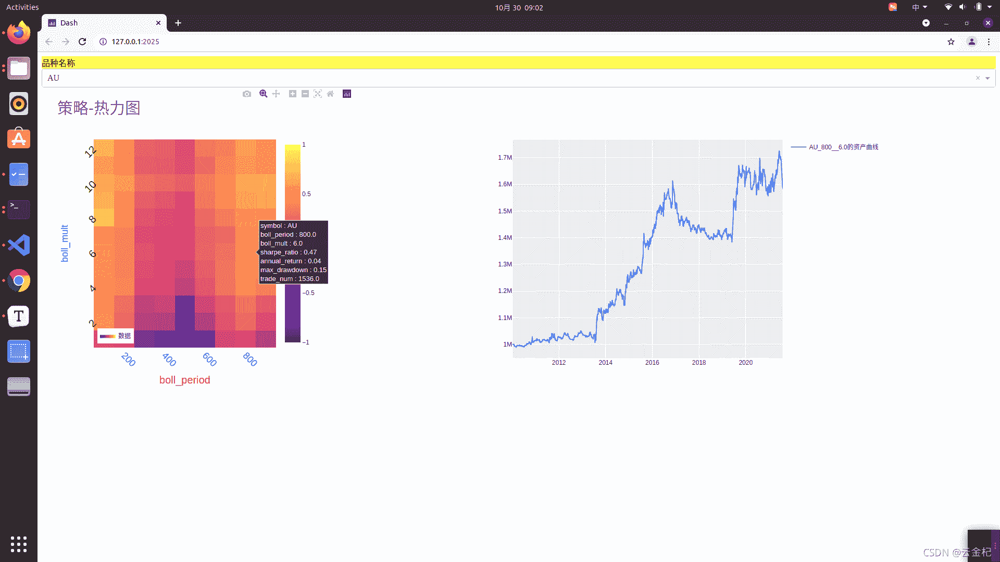
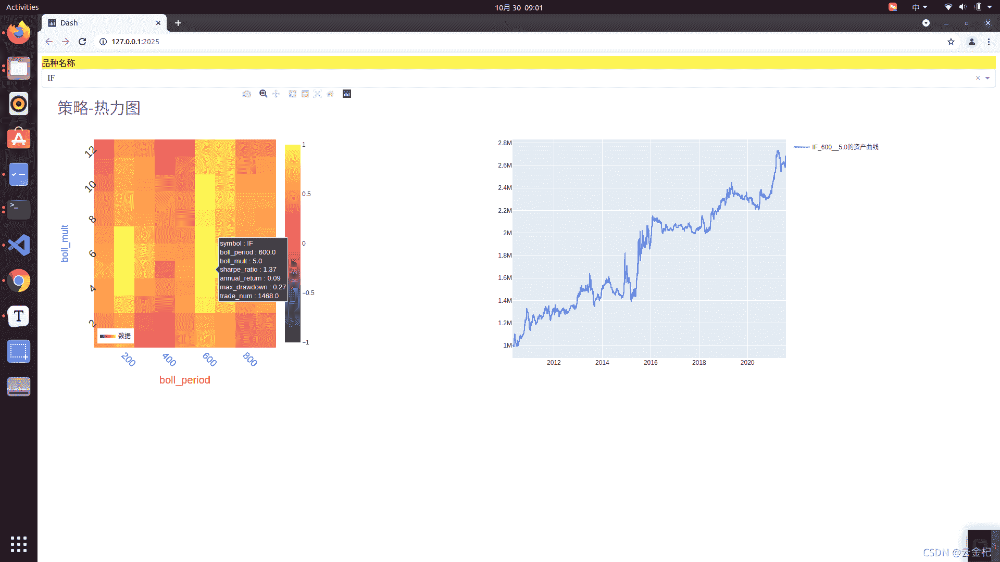
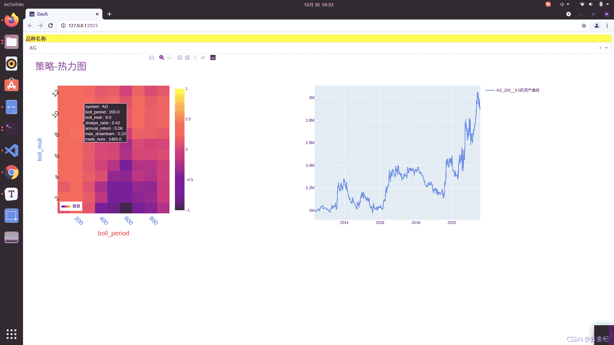
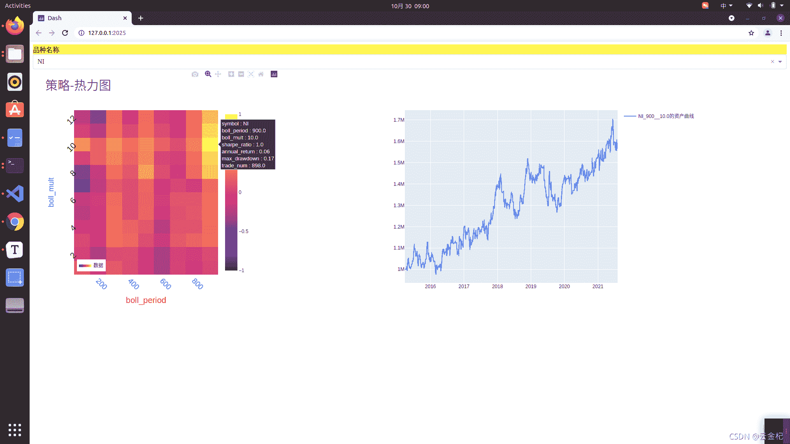
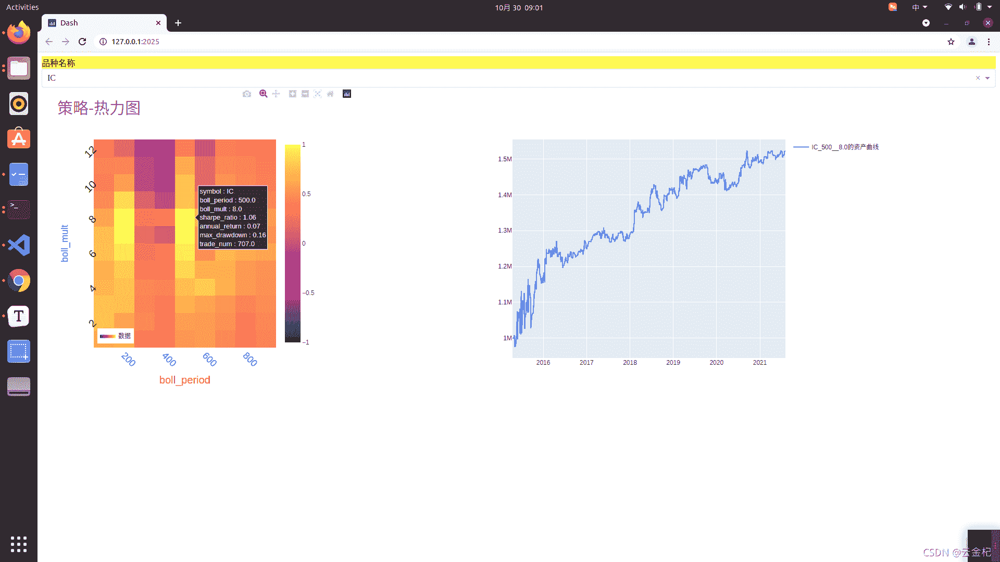

# 74 [backtrader 期货策略] 十大经典策略-汉斯 123 策略(逻辑优化版)

> 原文：<https://yunjinqi.blog.csdn.net/article/details/121046742>

汉斯 123 策略是一个经典的日内突破交易策略,是根据开盘后的一定时间形成的高低点作为价格区间,突破价格区间的上轨做多,突破区间的下轨做空.

这篇文章针对简单的汉斯 123 策略,增加了一个均线过滤,大于均线的时候才能做多,小于均线的时候才能做空,详细的策略逻辑如下.

#### 策略逻辑

1.  根据价格序列,计算一个 ma_period 周期的简单移动平均线,并记录开盘后 bar_num 个 bar 中形成的最高点和最低点(ma_period 对应参数分析中的 boll_period,bar_num 对应参数分析中的 boll_mult)

2.  开仓

    开仓限制时间为每个交易日的上午的 11 点之前.整个交易日分成了三部分,一部分是开盘形成高低点的区间,一部分是观察是否会形成突破的区间,一部分是下单后需要一定时间带来收益.

    当没有持仓的时候，均线向上,并且价格在均线上,并且价格突破价格高点,下个 bar 开盘做多；
    当没有持仓的时候，均线向下,并且价格在均线下,并且价格突破价格低点,下个 bar 开盘做空。

3.  平仓

    收盘前 5 分钟平仓

4.  数据

    使用了 5 分钟的每个品种的后复权的连续合约

5.  交易费用

    按照当前的交易费用设置，每手收取固定金额或者按照百分比；每次交易收取一个滑点(开平都收)；作为突破策略来说,一个点的滑点很可能是负担不了这个市场冲击成本的.所以,这个策略实际上可能会比回测差上一些.

6.  交易手数

    按照当前资金的 1 倍杠杆进行下单。我们结果只需要看夏普率就好，在满足条件的情况下，夏普率不随杠杆而变动。

#### 策略绩效








#### 策略代码

```py
from __future__ import (absolute_import, division, print_function,
                        unicode_literals)

import os,sys 
import numpy as np
import pandas as pd

import backtrader as bt  # backtrader
from backtrader.comminfo import ComminfoFuturesPercent,ComminfoFuturesFixed # 期货交易的手续费用，按照比例或者按照金额

# from backtrader.plot.plot import run_cerebro_and_plot  # 个人编写，非 backtrader 自带
import pyfolio as pf
from multiprocessing import Pool
from itertools import product

### 编写相应的策略,每个策略逻辑需要单独编写，回测和实盘直接运行策略类就行

class Hans123(bt.Strategy):
    # 策略作者
    author = 'yunjinqi'
    # 策略的参数
    params = (  ("ma_period",200), 
            ("bar_num",6),                     
            )
    # log 相应的信息
    def log(self, txt, dt=None):
        ''' Logging function fot this strategy'''
        dt = dt or bt.num2date(self.datas[0].datetime[0])
        print('{}, {}'.format(dt.isoformat(), txt))

    # 初始化策略的数据
    def __init__(self):
        # 计算布林带指标，大名鼎鼎的布林带策略
        self.ma_value = bt.indicators.SMA(self.datas[0].close,period=self.p.ma_period)
        # 每个交易日的 bar 的个数
        self.day_bar_num = 0
        # 保存交易状态
        self.marketposition = 0
        # 保存当前交易日的最高价、最低价，收盘价
        self.now_high = 0 
        self.now_low = 999999999 
        self.now_close = None
        self.now_open = None 
        # 保存历史上的每日的最高价、最低价与收盘价
        # self.day_high_list = []
        # self.day_low_list = []
        # self.day_close_list = []
        #  上轨与下轨 
        self.upper_line = None 
        self.lower_line = None 

    def prenext(self):
        # 由于期货数据有几千个，每个期货交易日期不同，并不会自然进入 next
        # 需要在每个 prenext 中调用 next 函数进行运行
        # self.next() 
        pass 

    # 在 next 中添加相应的策略逻辑
    def next(self):
        # 每次运行一次，bar_num 自然加 1,并更新交易日
        self.current_datetime = bt.num2date(self.datas[0].datetime[0])
        self.current_hour = self.current_datetime.hour
        self.current_minute = self.current_datetime.minute
        self.day_bar_num+=1
        # 数据
        data = self.datas[0]
        # 更新最高价、最低价、收盘价
        self.now_high = max(self.now_high,data.high[0])
        self.now_low = min(self.now_low,data.low[0])
        if self.now_close is None:
            self.now_open = data.open[0]
        self.now_close = data.close[0]
        # 如果当前的 bar 的数目等于计算高低点的时间,计算上下轨的价格
        if self.day_bar_num==self.p.bar_num:
            self.upper_line = self.now_high 
            self.lower_line = self.now_low 
        # 如果是新的交易日的最后一分钟的数据
        if self.current_hour==15:
            # 保存当前的三个价格
            # self.day_high_list.append(self.now_high)
            # self.day_low_list.append(self.now_low)
            # self.day_close_list.append(self.now_close)
            # 初始化四个价格
            self.now_high = 0 
            self.now_low = 999999999 
            self.now_close = None
            # 初始化 k 线数
            self.day_bar_num = 0 

        # hans123 的改进版本：使用均线过滤交易
        # 均线向上，价格大于均线，并且价格突破区间上轨，做多
        # 均线向下，价格小于均线，并且价格跌破下轨，做空
        if len(data.close)>self.p.ma_period and self.day_bar_num>=self.p.bar_num:

            # 开始交易
            open_time_1 = self.current_hour>=21 and self.current_hour<=23
            open_time_2 = self.current_hour>=9 and self.current_hour<=11
            # 开仓
            if open_time_1 or open_time_2:
                # self.log(f"self.ma_value[0]={self.ma_value[0]},data.close[0]={data.close[0]},self.upper_line={self.upper_line},self.lower_line={self.lower_line}")
                # 开多
                if self.marketposition == 0 and self.ma_value[0]>self.ma_value[-1] and data.close[0]>self.ma_value[0] and data.close[0]>self.upper_line:
                    # 获取一倍杠杆下单的手数
                    info = self.broker.getcommissioninfo(data)
                    symbol_multi = info.p.mult 
                    close = data.close[0]
                    total_value = self.broker.getvalue()
                    lots = total_value/(symbol_multi*close)
                    self.buy(data,size = lots)
                    self.marketposition = 1
                # 开空
                if self.marketposition == 0 and  self.ma_value[0]<self.ma_value[-1] and data.close[0]<self.ma_value[0] and data.close[0]<self.lower_line:
                    # 获取一倍杠杆下单的手数
                    info = self.broker.getcommissioninfo(data)
                    symbol_multi = info.p.mult 
                    close = data.close[0]
                    total_value = self.broker.getvalue()
                    lots = total_value/(symbol_multi*close)
                    self.sell(data,size = lots)
                    self.marketposition = -1
            # 平仓 
            if self.marketposition!=0 and self.current_hour == 14 and self.current_minute == 55 :
                self.close(data)
                self.marketposition = 0

    # def notify_order(self, order):

    #     if order.status in [order.Submitted, order.Accepted]:
    #         return

    #     if order.status == order.Rejected:
    #         self.log(f"Rejected : order_ref:{order.ref}  data_name:{order.p.data._name}")

    #     if order.status == order.Margin:
    #         self.log(f"Margin : order_ref:{order.ref}  data_name:{order.p.data._name}")

    #     if order.status == order.Cancelled:
    #         self.log(f"Concelled : order_ref:{order.ref}  data_name:{order.p.data._name}")

    #     if order.status == order.Partial:
    #         self.log(f"Partial : order_ref:{order.ref}  data_name:{order.p.data._name}")

    #     if order.status == order.Completed:
    #         if order.isbuy():
    #             self.log(f" BUY : data_name:{order.p.data._name} price : {order.executed.price} , cost : {order.executed.value} , commission : {order.executed.comm}")

    #         else:  # Sell
    #             self.log(f" SELL : data_name:{order.p.data._name} price : {order.executed.price} , cost : {order.executed.value} , commission : {order.executed.comm}")

    # def notify_trade(self, trade):
    #     # 一个 trade 结束的时候输出信息
    #     if trade.isclosed:
    #         self.log('closed symbol is : {} , total_profit : {} , net_profit : {}' .format(
    #                         trade.getdataname(),trade.pnl, trade.pnlcomm))
    #         # self.trade_list.append([self.datas[0].datetime.date(0),trade.getdataname(),trade.pnl,trade.pnlcomm])

    #     if trade.isopen:
    #         self.log('open symbol is : {} , price : {} ' .format(
    #                         trade.getdataname(),trade.price))

    # def stop(self):

    #     pass 

def run(params):
    print(f"开始运行策略——汉斯 123,参数{params}")  
    # 准备配置策略
    cerebro = bt.Cerebro()
    # 参数设置
    data_kwargs = dict(
                # fromdate = datetime.datetime(2012,12, 3),
                # todate = datetime.datetime(2021,7,31),
                timeframe = bt.TimeFrame.Minutes,
                compression = 1,
                dtformat=('%Y-%m-%d %H:%M:%S'), # 日期和时间格式
                tmformat=('%H:%M:%S'), # 时间格式
                datetime=0,
                high=3,
                low=4,
                open=1,
                close=2,
                volume=5,
                openinterest=6)

    # 分解参数
    name ,boll_period,boll_mult = params
    # 获取当前的已经优化的文件名
    file_list = list(os.listdir("./74 讲/result/参数优化结果/"))
    param_list=["__".join(i.split("__")[:3]) for i in file_list]
    if "__".join([str(i) for i in params]) in param_list:
        print("__".join([str(i) for i in params]),"has run")
        # 严谨一些可以从文件里面获取原来的运行结果，这里省略
        return [name,boll_period,boll_mult,0,0,0,0]
    else:

        # 后复权数据
        data_path = "/home/yun/data/期货/5m/rq_5min_after/"+name+"889.csv"
        df = pd.read_csv(data_path)
        # 只要数据里面的这几列
        df = df[['datetime','open','high','low','close','volume','open_interest']]
        df.columns = ['datetime','open','high','low','close','volume','openinterest']
        # 修改列的名字
        df = df.sort_values("datetime")
        df = df.drop_duplicates("datetime")
        df.index = pd.to_datetime(df['datetime'])
        # 如果对数据的时间顺序比较确定是从小到大的，可以不用排序，否则最好做下排序
        df = df[['open','high','low','close','volume','openinterest']]
        # 删除部分收盘价为 0 的错误数据，大部分数据都有问题哈，免费的，付费的，需要专门对数据进行清洗
        df = df.astype("float")
        df = df[(df["open"]>0)&(df['close']>0)]
        # df = df[(df.index<=data_kwargs['todate'])&(df.index>=data_kwargs['fromdate'])]
        feed = bt.feeds.PandasDirectData(dataname = df)
        # feed = bt.feeds.GenericCSVData(dataname = data_path,**data_kwargs)
        cerebro.adddata(feed, name = name)
        # 设置合约的交易信息
        # 获取该品种的交易手续费、保证金率、乘数，由于保证金率可能会随着政策调控改变，不可控性很大，但是又不影响期货的盈利，默认为 10%。
        data = pd.read_csv("./74 讲/优矿上期货合约数据.csv",index_col=0)
        data['symbol']=["".join([j for j in i.split(".")[0] if j.isalpha()]) for i in data['secID']]
        data = data[["secID","symbol","lastTradeDate","minChgPriceNum","contMultNum","tradeCommiNum","tradeCommiUnit"]]
        symbol_info = data[data['symbol']==name]
        symbol_info = symbol_info.sort_values("lastTradeDate")
        multi = list(symbol_info['contMultNum'])[-1]
        comm_type = list(symbol_info['tradeCommiUnit'])[-1]
        comm = list(symbol_info["tradeCommiNum"])[-1]
        slippage = list(symbol_info['minChgPriceNum'])[-1] 
        # 配置手续费
        if "元" in comm_type:
            comm =ComminfoFuturesFixed(commission=comm,margin=0.10, mult=multi)
        else:
            comm = ComminfoFuturesPercent(commission=comm/100,margin=0.10, mult=multi)
        cerebro.broker.addcommissioninfo(comm, name= name)
        # 配置滑点费用,1 跳
        cerebro.broker.set_slippage_fixed(slippage*1)
        cerebro.broker.setcash(1000000.0)
        # 添加策略
        kwags={"ma_period":boll_period,                  
                "bar_num":boll_mult,
                }
        # 添加策略
        cerebro.addstrategy(Hans123,**kwags)
        cerebro.addanalyzer(bt.analyzers.TotalValue, _name='my_value')
        cerebro.addanalyzer(bt.analyzers.SharpeRatio, _name='my_sharpe')
        cerebro.addanalyzer(bt.analyzers.Returns, _name='my_returns')
        cerebro.addanalyzer(bt.analyzers.DrawDown, _name='my_drawdown')
        cerebro.addanalyzer(bt.analyzers.TradeAnalyzer, _name='my_trade_analyzer')

        # cerebro.addanalyzer(bt.analyzers.PyFolio)

        # 运行回测
        results = cerebro.run()
        sharpe_ratio = results[0].analyzers.my_sharpe.get_analysis()['sharperatio']
        annual_return = results[0].analyzers.my_returns.get_analysis()['rnorm']
        max_drawdown = results[0].analyzers.my_drawdown.get_analysis()["max"]["drawdown"]/100
        trade_num = results[0].analyzers.my_trade_analyzer.get_analysis()['total']['total']
        value_df = pd.DataFrame([results[0].analyzers.my_value.get_analysis()]).T
        value_df.columns=['value']
        value_df['datetime']=pd.to_datetime(value_df.index)
        value_df['date']=[i.date() for i in value_df['datetime']]
        value_df= value_df.drop_duplicates("date",keep="last")
        value_df = value_df[['value']]
        # print(value_df.head())
        try:
            file_name = name+"__"+str(boll_period)+"__"+str(boll_mult)+"__"+str(round(sharpe_ratio,2))+"__"+str(round(annual_return,2))+"__"+str(round(max_drawdown,2))+"__"+str(trade_num)
        except:
            file_name = name+"__"+str(boll_period)+"__"+str(boll_mult)+"__"+str(0)+"__"+str(0)+"__"+str(0)+"__"+str(0)
        value_df.to_csv("./74 讲/result/参数优化结果/"+file_name+".csv")
        return [name,boll_period,boll_mult,sharpe_ratio,annual_return,max_drawdown,trade_num]

if __name__=="__main__":
    symbol_list = ['A', 'JD', 'J', 'JM', 'MA', 'Y', 'IF', 'BU', 'SF', 'CU', 'RB', 'HC', 'OI', 'ZC', 'P', 'RU', 'RM', 'C', 'IC', 'SR', 'T', 'AU', 'M', 
                'FG', 'CY', 'SM', 'SS', 'AP', 'CF', 'AG', 'L', 'TS', 'NI', 'ZN', 'EG', 'B', 'PB', 'V', 'TA', 'FU', 'CS', 'SP', 'PP', 'TF', 'SC', 'AL']
    k1_list = [i for i in range(100,1000,100)]
    k2_list = [i for i in range(1,13)]
    params_list = product(symbol_list,k1_list,k2_list)
    with Pool(10) as p:
        results = p.map(run,params_list)
    df = pd.DataFrame(results,columns=["name",'boll_period',"boll_mult","sharpe_ratio","annual_return","max_drawdown","trade_num"])
    df.to_csv("./74 讲/result/all_ 参数优化结果.csv")
    # run(["MA",200,2]) 
```

#### 策略分析

原始策略比较特殊的地方在于是根据当日的交易形成的价格区间,仅仅利用了当日的信息.在设计的时候,增加了一个简单均线,过滤一部分交易.并且对于每个品种,设定了一个不同的参数,用于确定这个品种需要多久的交易会形成这个振荡区间.

这个日内策略,目前依然是相对比较简单的,大家需要考虑加入其他条件,来进一步提高各个品种的收益风险比,以及策略的稳定性.

#### 代码及数据

代码:

链接: https://pan.baidu.com/s/1CoMXgr1nbrsxLc9ekCgE4Q 提取码: zqd5 复制这段内容后打开百度网盘手机 App，操作更方便哦

数据:

链接: https://pan.baidu.com/s/1ptDG6hUxp_W5CeKlmrjC9w 提取码: fh3v 复制这段内容后打开百度网盘手机 App，操作更方便哦