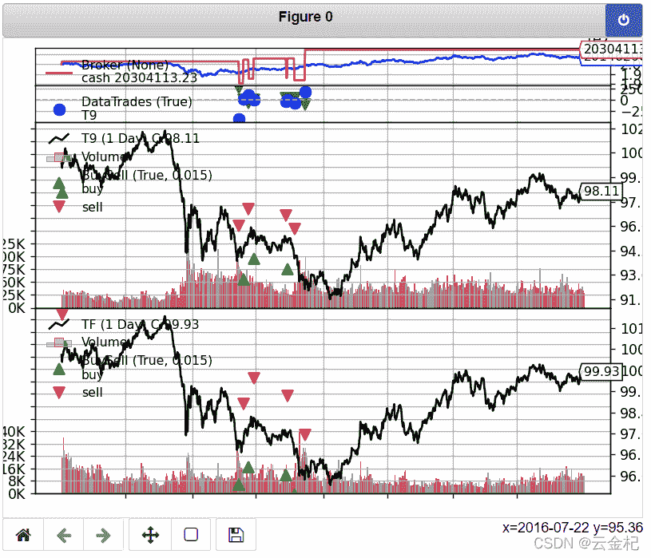

# 3、【债券策略】基于利差的债券多空策略(2021-12-27 修改)

> 原文：<https://yunjinqi.blog.csdn.net/article/details/107600077>

### 策略逻辑

#### 策略原理

策略原理来自于《151 trading strategies》 中 5.11 Stategy : Carry Factor

carry 被定义为是债券随着收益率曲线的下移导致的债券的升值带来的收益。一个零成本的债券策略可以通过做多高 carry 的债券，做空低 carry 的债券。

### 策略逻辑

在每个交易日判断，10 年期国债和 5 年期国债的收益率的差别，如果十年期国债的收益率大于五年期国债的收益率，那么，就做多 10 年期国债，做空 5 年期国债；
如果十年期国债的收益率小于五年期国债的收益率，那么，就做空 10 年期国债，做多 5 年期国债。

忽略每次交易的手续费用。

### 数据准备

10 年期国债收益率与五年期国债收益率的数据均来自英为财经。
10 年期国债价格(全价)使用 10 年期国债期货价格指数代替；
5 年期国债价格(全价)使用 5 年期国债期货价格指数代替；

### 在 backtrader 上实现的逻辑

有两种不同的方式，一种是把四个数据都加载到 backtrader 中，通过两个收益率来判断两个国债价格的多空；另外一个就是只加载两个债券的价格数据，另外的数据保存到内存中，每次在 next 中进行调用。

在策略的 next 当中，每个 bar 先获取当前的十年期国债与五年期国债的收益率，然后计算两个数据的多空方向，以及交易量。

> 代码运行输出 Starting Portfolio Value: 20000000.00 2016-01-05, BUY EXECUTED,
> Price: 99.76, Cost: 7993569.28, Comm 0.00 2016-01-05, SELL EXECUTED,
> Price: 100.49, Cost: -8052062.72, Comm 0.00 2017-05-16, SELL EXECUTED,
> Price: 94.52, Cost: 7993569.28, Comm 0.00 2017-05-16, SELL EXECUTED,
> Price: 94.52, Cost: -7929713.99, Comm 0.00 2017-05-16, BUY EXECUTED,
> Price: 97.29, Cost: -8052062.72, Comm 0.00 2017-05-16, BUY EXECUTED,
> Price: 97.29, Cost: 8162533.71, Comm 0.00 2017-05-16, OPERATION
> PROFIT, GROSS -420271.36, NET -420271.36 2017-05-16, OPERATION PROFIT,
> GROSS 256409.60, NET 256409.60 2017-05-26, BUY EXECUTED, Price: 94.31,
> Cost: -7929713.99, Comm 0.00 2017-05-26, BUY EXECUTED, Price: 94.31,
> Cost: 7930810.83, Comm 0.00 2017-05-26, SELL EXECUTED, Price: 97.23,
> Cost: 8162533.71, Comm 0.00 2017-05-26, SELL EXECUTED, Price: 97.23,
> Cost: -8176362.39, Comm 0.00 2017-05-26, OPERATION PROFIT, GROSS
> 17199.29, NET 17199.29 2017-05-26, OPERATION PROFIT, GROSS -5033.94, NET -5033.94 2017-06-13, SELL EXECUTED, Price: 95.58, Cost:
> 7930810.83, Comm 0.00 2017-06-13, SELL EXECUTED, Price: 95.58, Cost: -7974300.12, Comm 0.00 2017-06-13, BUY EXECUTED, Price: 97.94, Cost: -8176362.39, Comm 0.00 2017-06-13, BUY EXECUTED, Price: 97.94, Cost: 8172041.07, Comm 0.00 2017-06-13, OPERATION PROFIT, GROSS 106377.65, NET 106377.65 2017-06-13, OPERATION PROFIT, GROSS -60126.49, NET
> -60126.49 2017-06-26, BUY EXECUTED, Price: 95.48, Cost: -7974300.12, Comm 0.00 2017-06-26, BUY EXECUTED, Price: 95.48, Cost: 7970002.04,
> Comm 0.00 2017-06-26, SELL EXECUTED, Price: 98.02, Cost: 8172041.07,
> Comm 0.00 2017-06-26, SELL EXECUTED, Price: 98.02, Cost: -8182023.46,
> Comm 0.00 2017-06-26, OPERATION PROFIT, GROSS 7926.32, NET 7926.32
> 2017-06-26, OPERATION PROFIT, GROSS 6257.63, NET 6257.63 2017-09-19,
> SELL EXECUTED, Price: 95.08, Cost: 7970002.04, Comm 0.00 2017-09-19,
> SELL EXECUTED, Price: 95.08, Cost: -7967094.85, Comm 0.00 2017-09-19,
> BUY EXECUTED, Price: 97.50, Cost: -8182023.46, Comm 0.00 2017-09-19,
> BUY EXECUTED, Price: 97.50, Cost: 8169886.01, Comm 0.00 2017-09-19,
> OPERATION PROFIT, GROSS -33806.57, NET -33806.57 2017-09-19, OPERATION
> PROFIT, GROSS 43823.32, NET 43823.32 2017-09-21, BUY EXECUTED, Price:
> 95.06, Cost: -7967094.85, Comm 0.00 2017-09-21, BUY EXECUTED, Price: 95.06, Cost: 7962169.08, Comm 0.00 2017-09-21, SELL EXECUTED, Price: 97.49, Cost: 8169886.01, Comm 0.00 2017-09-21, SELL EXECUTED, Price: 97.49, Cost: -8165274.95, Comm 0.00 2017-09-21, OPERATION PROFIT, GROSS 837.98, NET 837.98 2017-09-21, OPERATION PROFIT, GROSS -418.99,
> NET -418.99 2017-10-17, SELL EXECUTED, Price: 94.30, Cost: 7962169.08,
> Comm 0.00 2017-10-17, SELL EXECUTED, Price: 94.30, Cost: -7955669.15,
> Comm 0.00 2017-10-17, BUY EXECUTED, Price: 97.00, Cost: -8165274.95,
> Comm 0.00 2017-10-17, BUY EXECUTED, Price: 97.00, Cost: 8183890.00,
> Comm 0.00 2017-10-17, OPERATION PROFIT, GROSS -64491.35, NET -64491.35
> 2017-10-17, OPERATION PROFIT, GROSS 41039.95, NET 41039.95 2017-11-14,
> BUY EXECUTED, Price: 92.14, Cost: -7955669.15, Comm 0.00 2017-11-14,
> BUY EXECUTED, Price: 92.14, Cost: 7994250.68, Comm 0.00 2017-11-14,
> SELL EXECUTED, Price: 95.86, Cost: 8183890.00, Comm 0.00 2017-11-14,
> SELL EXECUTED, Price: 95.86, Cost: -8317005.32, Comm 0.00 2017-11-14,
> OPERATION PROFIT, GROSS 181817.35, NET 181817.35 2017-11-14, OPERATION
> PROFIT, GROSS -96181.80, NET -96181.80 Final Portfolio Value:
> 20146206.39

backtrader 原生的输出图形，比较丑，我自己一般不会用这个，用 plotly 写的图形化界面输出结果，看起来更加简洁。

注：以上代码仅仅是尝试实现这样一个策略，实际上并没有考虑手续费、杠杆、合约乘数、滑点等情况，建议阅读完整个专栏之后再做债券策略。

### 策略代码

```py
import datetime  # For datetime objects
import os.path  # To manage paths
import sys  # To find out the script name (in argv[0])

# Import the backtrader platform
import backtrader as bt
import pandas as pd

# Create a Stratey
class BondCarryStrategy(bt.Strategy):
    params = (
        ('author', 'yunjinqi'),
    )

    def log(self, txt, dt=None):
        ''' Logging function fot this strategy'''
        dt = dt or self.datas[0].datetime.date(0)
        print('%s, %s' % (dt.isoformat(), txt))

    def __init__(self):
        self.t9_rate_df = pd.read_csv("C:/result/T9_rate.csv")
        self.t9_rate_df['date']=pd.to_datetime(self.t9_rate_df['date'])
        self.tf_rate_df = pd.read_csv("C:/result/TF_rate.csv") 
        self.tf_rate_df['date']=pd.to_datetime(self.tf_rate_df['date'])

    def notify_order(self, order):
        if order.status in [order.Submitted, order.Accepted]:
            # Buy/Sell order submitted/accepted to/by broker - Nothing to do
            return

        # Check if an order has been completed
        # Attention: broker could reject order if not enough cash
        if order.status in [order.Completed]:
            if order.isbuy():
                self.log(
                    'BUY EXECUTED, Price: %.2f, Cost: %.2f, Comm %.2f' %
                    (order.executed.price,
                     order.executed.value,
                     order.executed.comm))

                self.buyprice = order.executed.price
                self.buycomm = order.executed.comm
            else:  # Sell
                self.log('SELL EXECUTED, Price: %.2f, Cost: %.2f, Comm %.2f' %
                         (order.executed.price,
                          order.executed.value,
                          order.executed.comm))

            self.bar_executed = len(self)

        elif order.status in [order.Canceled, order.Margin, order.Rejected]:
            self.log('Order Canceled/Margin/Rejected')

        # Write down: no pending order
        self.order = None

    def notify_trade(self, trade):
        if not trade.isclosed:
            return

        self.log('OPERATION PROFIT, GROSS %.2f, NET %.2f' %
                 (trade.pnl, trade.pnlcomm))

    def next(self):
        current_date = pd.to_datetime(self.datas[0].datetime.date(0))
        # 根据在 init 里面的数据，读取十年期国债和五年期国债的收益率
        t9_rate = float(self.t9_rate_df[self.t9_rate_df['date']==current_date]['close'])
        tf_rate = float(self.tf_rate_df[self.tf_rate_df['date']==current_date]['close'])
        # 读取十年期国债和五年期国债的数据
        t9_data = self.getdatabyname("T9")
        tf_data = self.getdatabyname("TF")
        # 读取十年期国债和五年期国债的持仓
        t9_position = self.getpositionbyname("T9")
        tf_position = self.getpositionbyname("TF")
        # 如果两个国债的持仓都是 0，根据收益率新开仓位
        if t9_position.size == tf_position.size == 0:
            # 十年期国债大于五年期国债
            if t9_rate>tf_rate:
                ### 做多十年期国债
                # 获取总的资金，一半用于开多，一半用于开空
                total_value = self.broker.getvalue()
                t9_close = t9_data.close[0]
                t9_lots = int(0.4*total_value/t9_close)
                self.buy(t9_data,size=t9_lots)
                ### 做空五年期国债
                tf_close = tf_data.close[0]
                tf_lots = int(0.4*total_value/t9_close)
                self.sell(tf_data,size=tf_lots)
            # 如果十年期国债小于等于五年期国债，做空十年期国债，做多五年期国债
            else:
                total_value = self.broker.getvalue()
                t9_close = t9_data.close[0]
                t9_lots = int(0.4*total_value/t9_close)
                self.sell(t9_data,size=t9_lots)
                ### 做多五年期国债
                tf_close = tf_data.close[0]
                tf_lots = int(0.4*total_value/tf_close)
                self.buy(tf_data,size=tf_lots)
        else:
            # 如果当前是十年期国债多头，五年期国债空头
            if t9_position.size>0 and tf_position.size<0:
                # 如果当前的十年期国债收益率大于五年期国债的收益率，忽略
                if t9_rate>tf_rate:
                    pass 
                # 如果当前的十年期国债收益率小于五年期国债的收益率，平仓，然后反向开仓
                if t9_rate<tf_rate:
                    total_value = self.broker.getvalue()
                    t9_close = t9_data.close[0]
                    self.close(t9_data)
                    t9_lots = int(0.4*total_value/t9_close)
                    self.sell(t9_data,size=t9_lots)
                    ### 做空五年期国债
                    tf_close = tf_data.close[0]
                    self.close(tf_data)
                    tf_lots = int(0.4*total_value/t9_close)
                    self.buy(tf_data,size=tf_lots)

            # 如果当前是十年期国债空头，五年期国债多头
            if t9_position.size<0 and tf_position.size>0:
                # 如果当前的十年期国债收益率大于五年期国债的收益率，忽略
                if t9_rate<tf_rate:
                    pass 
                # 如果当前的十年期国债收益率小于五年期国债的收益率，平仓，然后反向开仓
                if t9_rate>tf_rate:
                    total_value = self.broker.getvalue()
                    t9_close = t9_data.close[0]
                    self.close(t9_data)
                    t9_lots = int(0.4*total_value/t9_close)
                    self.buy(t9_data,size=t9_lots)
                    ### 做空五年期国债
                    tf_close = tf_data.close[0]
                    self.close(tf_data)
                    tf_lots = int(0.4*total_value/t9_close)
                    self.sell(tf_data,size=tf_lots)

if __name__ == '__main__':
    # Create a cerebro entity
    cerebro = bt.Cerebro()

    # Add a strategy
    cerebro.addstrategy(BondCarryStrategy)

    # Datas are in a subfolder of the samples. Need to find where the script is
    # because it could have been called from anywhere
    df1 = pd.read_excel("C:/result/T9.xlsx")
    df1.index = df1.datetime
    df1=df1[['open','high','low','close','volume','open_interest']]
    df1.columns = ['open','high','low','close','volume','openinterest']
    feed =  bt.feeds.PandasDirectData(dataname=df1)
    cerebro.adddata(feed, name = "T9")

    df2 = pd.read_excel("C:/result/TF.xlsx")
    df2.index = df2.datetime
    df2=df2[['open','high','low','close','volume','open_interest']]
    df2.columns = ['open','high','low','close','volume','openinterest']
    feed =  bt.feeds.PandasDirectData(dataname=df2)
    cerebro.adddata(feed, name = "TF")

    # Set our desired cash start
    cerebro.broker.setcash(20000000)

    # Set the commission
    cerebro.broker.setcommission(commission=0.0)

    # Print out the starting conditions
    print('Starting Portfolio Value: %.2f' % cerebro.broker.getvalue())

    # Run over everything
    cerebro.run()

    # Print out the final result
    print('Final Portfolio Value: %.2f' % cerebro.broker.getvalue())

    # Plot the result
    cerebro.plot() 
```

### 数据

[下载地址：](https://download.csdn.net/download/qq_26948675/12663386)数据刚上传，未审核通过，尚不能下载。过几个小时就可以了。

### 注意

该策略是 toy strategy，在实际中，债券策略，应该比这复杂的多,比如，使用数据的真实性，要不要用过去历史当中真实的债券数据；交易手续费以及冲击成本的设置等，都是需要考虑的。设计好一个能够实盘跑的策略，可能需要 1 到 3 个月的时间。