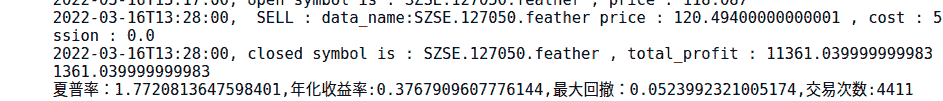
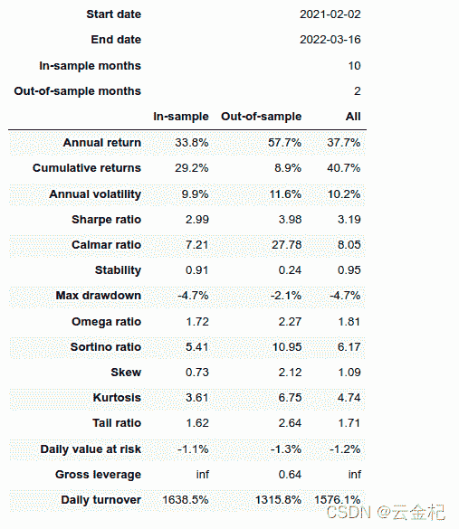
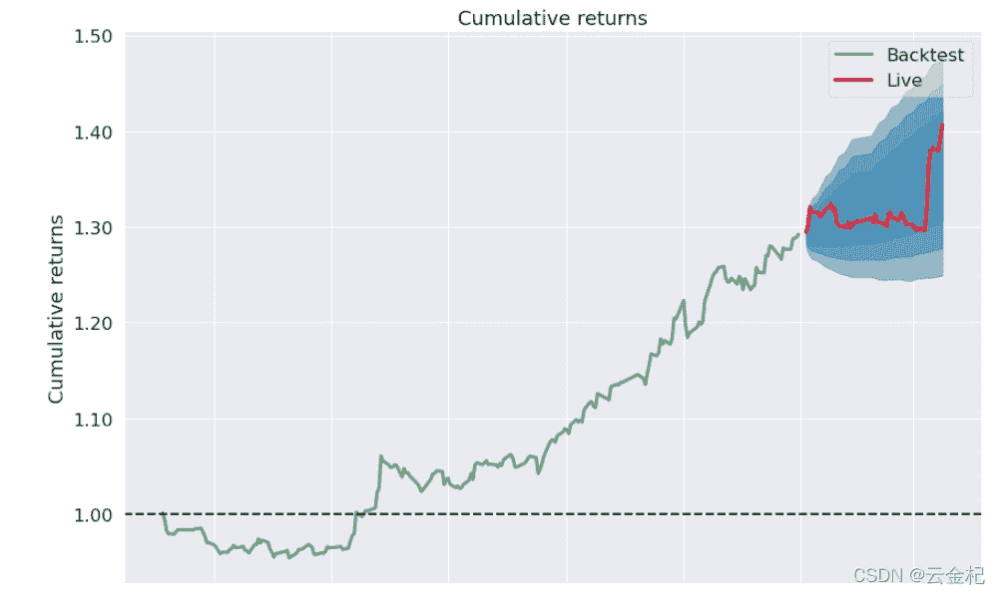

# 【76 backtrader 可转债策略】一个基础的可转债交易策略回测(供参考的可转债回测模板)

> 原文：<https://yunjinqi.blog.csdn.net/article/details/123598380>

这个可转债的策略并不复杂，由于是交易在 1 分钟上，所以交易特别频繁，对交易手续费特别敏感，如果不考虑手续费，曲线特别好，考虑过手续费(万分之二)之后，亏的很惨。如果在这种频繁交易的话，需要考虑和券商协商下是否能降低一些手续费；如果不能，需要考虑在更大的周期上进行交易，以降低交易频率，减少部分手续费。

#### 策略逻辑

1.  在 1 分钟的可转债上进行交易，只能做多，可以 T+0 平仓。
2.  遍历所有可交易的可转债，如果同时满足下面的五个条件，就准备用 40%的资金进行买入，同一时间最多持有两个可转债
    1.  当前价格大于 20 均线
    2.  当前价格大于分时均价
    3.  当前涨幅小于 1%,大于-1%
    4.  最近没有大于 30 分钟均量 4 倍以上的 K 线(策略中只判断了最近的一根，根据自己的需要循环几根 K 线判断最近是否满足)
    5.  近期 20 均线上移降速 但是并没有向下
3.  平仓条件
    1.  当价格跌破 前期低点平仓(用 20 周期的最低价替代低点)
    2.  当盈利 3%的时候止盈
    3.  当持有超过 10 分钟的时候平仓

#### 策略代码

```py
from __future__ import (absolute_import, division, print_function,
                        unicode_literals)

import os,sys
from matplotlib.style import available 
import numpy as np
import pandas as pd

import backtrader as bt  # backtrader
# from backtrader.comminfo import ComminfoFuturesPercent,ComminfoFuturesFixed # 期货交易的手续费用，按照比例或者按照金额

# from backtrader.plot.plot import run_cerebro_and_plot  # 个人编写，非 backtrader 自带
import pyfolio as pf
from multiprocessing import Pool
from itertools import product

### 编写相应的策略,每个策略逻辑需要单独编写，回测和实盘直接运行策略类就行

class CbStrategy(bt.Strategy):
    # 策略作者
    author = 'yunjinqi'
    # 策略的参数
    params = (  ("ma_period",200), 
            ("bar_num",6),                     
            )
    # log 相应的信息
    def log(self, txt, dt=None):
        ''' Logging function fot this strategy'''
        dt = dt or bt.num2date(self.datas[0].datetime[0])
        print('{}, {}'.format(dt.isoformat(), txt))

    # 初始化策略的数据
    def __init__(self):
        # 同时持仓的可转债的数目，超过这个数目就不交易了
        self.can_trade_num = 2
        # 计算每个可转债数据的 20 周期均线
        self.cb_ma_dict={data._name:bt.indicators.SMA(data.close,period=20) for data in self.datas[1:]}
        # 计算分时均价线，由于可转债没有持仓量，这里的持仓量等于可转债的成交额的数据，这样可以避免额外创造一条 line
        self.cb_avg_line_dict = {data._name:data.openinterest/data.volume for data in self.datas[1:]}
        # 计算最近 30 分钟的平均成交量
        self.cb_avg_volume_dict = {data._name:bt.indicators.SMA(data.volume,period=30) for data in self.datas[1:]}
        # 记录前一天的收盘价
        self.cb_pre_close_dict = {data._name:None for data in self.datas[1:]}
        # 记录开仓的时候的 bar 的根数
        self.bar_num = 0 
        self.cb_bar_num_dict = {data._name:None for data in self.datas[1:]}
        # 记录开仓的价格
        self.cb_open_position_price_dict = {data._name:None for data in self.datas[1:]}
        # 用最近 20 个周期的最低点作为前期低点
        self.cb_low_point_dict={data._name:bt.indicators.Lowest(data.low,period=20) for data in self.datas[1:]}

    def prenext(self):
        # 由于期货数据有几千个，每个期货交易日期不同，并不会自然进入 next
        # 需要在每个 prenext 中调用 next 函数进行运行
        self.next() 

    # 在 next 中添加相应的策略逻辑
    def next(self):
        # 每次运行一次，bar_num 自然加 1,并更新交易日
        self.bar_num +=1 
        self.current_datetime = bt.num2date(self.datas[0].datetime[0])
        current_hour = self.current_datetime.hour 
        total_value = self.broker.get_value()
        available_cash = self.broker.get_cash()
        # self.log(f"{self.bar_num},{self.can_trade_num},{total_value},{available_cash}")
        for data in self.datas[1:]:
            # 首先判断当前可转债是否已经上市交易
            data_datetime = bt.num2date(data.datetime[0])
            if data_datetime == self.current_datetime:
                data_name = data._name
                close_price = data.close[0]
                # 判断是否存在前一天的收盘价，如果不存在，代表是第一个交易日，用开盘价代替，如果存在就用前一个交易日的收盘价代替
                pre_close = self.cb_pre_close_dict[data_name]
                if pre_close is None:
                    pre_close = data.open[0]
                    self.cb_pre_close_dict[data_name] = pre_close 
                # 更新收盘价
                if current_hour == 15:
                    self.cb_pre_close_dict[data_name] = close_price 
                # 额外增加一个到期平仓逻辑，即如果后面两个周期之后不存在数据了，就平仓
                position_size = self.getposition(data).size
                if position_size>0:
                    try:
                        open_price = data.open[2]
                    except:
                        self.close(data)
                        self.cb_bar_num_dict[data_name] = None 
                        self.can_trade_num+=1
                ##### 准备平仓，先平后开
                open_bar_num = self.cb_bar_num_dict[data_name]
                # 不是 None 代表有持仓
                if open_bar_num is not None:
                    # 持仓超过 10 个 bar，平了
                    if open_bar_num<self.bar_num-10:
                        self.close(data)
                        self.cb_bar_num_dict[data_name] = None 
                        self.can_trade_num+=1
                open_bar_num = self.cb_bar_num_dict[data_name]
                # 不是 None 代表有持仓
                if open_bar_num is not None:
                    # 如果跌破前期低点，平了
                    low_point = self.cb_low_point_dict[data_name][0]
                    if close_price<low_point:
                        self.close(data)
                        self.cb_bar_num_dict[data_name] = None
                        self.can_trade_num+=1
                open_bar_num = self.cb_bar_num_dict[data_name]
                # 不是 None 代表有持仓
                if open_bar_num is not None:
                    # 如果收益率大于 3%，止盈
                    open_position_price = self.cb_open_position_price_dict[data_name] 
                    if close_price/open_position_price>1.03:
                        self.close(data)
                        self.cb_bar_num_dict[data_name] = None
                        self.can_trade_num+=1

                ##### 准备开仓
                # 判断当前价格是否大于 20 周期均线
                ma_line = self.cb_ma_dict[data_name]
                ma_price = ma_line[0]
                if close_price>ma_price:
                    # self.log(f"{data_name},进入第一个条件")
                    # 判断当前价格是否大于分时均线
                    avg_line_price = self.cb_avg_line_dict[data_name][0]
                    if close_price>avg_line_price:
                        # self.log(f"{data_name},进入第二个条件")
                        # 判断是否大于-1%但是小于 1%
                        up_percent = close_price/pre_close
                        if up_percent>0.99 and up_percent<1.01:
                            # self.log(f"{data_name},进入第三个条件")
                            # 判断当前成交量是否小于最近 30 周期成交量的 4 倍
                            volume = data.volume[0]
                            avg_volume = self.cb_avg_volume_dict[data_name][0]
                            if volume < avg_volume*4:
                                # self.log(f"{data_name},进入第四个条件")
                                # 如果均线还在上涨，但是上涨速度在变慢，就满足开仓条件了
                                if ma_line[0]>ma_line[-1] and ma_line[0]-ma_line[-1]<ma_line[-1]-ma_line[-2]:
                                    # self.log(f"{data_name},进入第五个条件")
                                    # 如果当前的交易数目没有超过限制
                                    open_bar_num = self.cb_bar_num_dict[data_name]
                                    if self.can_trade_num>0 and open_bar_num is None:
                                        # 准备买入
                                        available_cash = self.broker.getcash()
                                        total_value = self.broker.getvalue()
                                        # 简化期间，使用 40%的资金下单，避免保证金不足
                                        plan_tobuy_value = 0.4*total_value 
                                        # plan_tobuy_cash = available_cash
                                        # 可以买入多少手
                                        lots = 10* int(plan_tobuy_value/(close_price*10))
                                        self.log(f"{data_name},准备买入,{lots}手，此时账户价值:{total_value},可用现金:{available_cash}，可交易次数:{self.can_trade_num}")
                                        # 准备买入
                                        self.buy(data,size = lots)
                                        # 更新可以交易的次数
                                        self.can_trade_num -=1
                                        # 更新当前开仓的 bar 的位置
                                        self.cb_bar_num_dict[data_name] = self.bar_num
                                        # 更新开仓的价格,如果有下个开盘价，就尝试用下个开盘价的，否则用当前收盘价
                                        try:
                                            self.cb_open_position_price_dict[data_name] = data.open[1]
                                        except:
                                            self.cb_open_position_price_dict[data_name] = close_price

    def notify_order(self, order):

        if order.status in [order.Submitted, order.Accepted]:
            return

        if order.status == order.Rejected:
            self.log(f"Rejected : order_ref:{order.ref}  data_name:{order.p.data._name}")

        if order.status == order.Margin:
            self.log(f"Margin : order_ref:{order.ref}  data_name:{order.p.data._name}")

        if order.status == order.Cancelled:
            self.log(f"Concelled : order_ref:{order.ref}  data_name:{order.p.data._name}")

        if order.status == order.Partial:
            self.log(f"Partial : order_ref:{order.ref}  data_name:{order.p.data._name}")

        if order.status == order.Completed:
            if order.isbuy():
                self.log(f" BUY : data_name:{order.p.data._name} price : {order.executed.price} , cost : {order.executed.value} , commission : {order.executed.comm}")

            else:  # Sell
                self.log(f" SELL : data_name:{order.p.data._name} price : {order.executed.price} , cost : {order.executed.value} , commission : {order.executed.comm}")

    def notify_trade(self, trade):
        # 一个 trade 结束的时候输出信息
        if trade.isclosed:
            self.log('closed symbol is : {} , total_profit : {} , net_profit : {}' .format(
                            trade.getdataname(),trade.pnl, trade.pnlcomm))
            # self.trade_list.append([self.datas[0].datetime.date(0),trade.getdataname(),trade.pnl,trade.pnlcomm])

        if trade.isopen:
            self.log('open symbol is : {} , price : {} ' .format(
                            trade.getdataname(),trade.price))

    # def stop(self):

    #     pass 

def run():

    # 准备配置策略
    cerebro = bt.Cerebro()
    # 参数设置
    # data_kwargs = dict(
    #             # fromdate = datetime.datetime(2012,12, 3),
    #             # todate = datetime.datetime(2021,7,31),
    #             timeframe = bt.TimeFrame.Minutes,
    #             compression = 1,
    #             dtformat=('%Y-%m-%d %H:%M:%S'), # 日期和时间格式
    #             tmformat=('%H:%M:%S'), # 时间格式
    #             datetime=0,
    #             high=3,
    #             low=4,
    #             open=1,
    #             close=2,
    #             volume=5,
    #             openinterest=6)

    # 数据文件
    data_path = '/home/yun/data/可转债/1min/'
    # 保存可转债数据，用于合成一个指数，作为第一个数据加载到 cerebro 中
    datas  = {}
    index_time_list = []
    file_list = list(os.listdir(data_path))

    print(f"一共有多少个数据:{len(file_list)}")
    for file in file_list[:10]:
        # print(file)
        df = pd.read_feather(data_path+file)
        # df.columns =['open','high','low','close','volume',"amount","datetime"]
        df.index = pd.to_datetime(df["date"])
        # df.index.name = "datetime"
        # df['datetime'] = pd.to_datetime(df["date"])
        df = df[['open','high','low','close','volume',"amount"]]
        df.columns = ['open','high','low','close','volume','openinterest']
        datas[file] = df
        index_time_list = list(set(index_time_list+list(df.index)))
    index_df = pd.DataFrame(index = sorted(index_time_list))
    index_df['open'] =1
    index_df['high'] = 1
    index_df['low'] = 1
    index_df['close']=1
    index_df['volume']=1
    index_df['openinterest']=1
    feed = bt.feeds.PandasDirectData(dataname = index_df)
    # feed = bt.feeds.GenericCSVData(dataname = data_path,**data_kwargs)
    cerebro.adddata(feed, name = "index")
    # 循环加载每个数据
    for file,df in datas.items():
        feed = bt.feeds.PandasDirectData(dataname = df)
        # feed = bt.feeds.GenericCSVData(dataname = data_path,**data_kwargs)
        cerebro.adddata(feed, name = file)
    # 设置初始资金
    cerebro.broker.setcash(1000000.0)
    # 添加手续费，按照万分之二收取，频繁交易，加上手续费亏的很惨，这里先忽略手续费
    # cerebro.broker.setcommission(commission=0.0002,stocklike=True)
    cerebro.addstrategy(CbStrategy)
    cerebro.addanalyzer(bt.analyzers.TotalValue, _name='my_value')
    cerebro.addanalyzer(bt.analyzers.SharpeRatio, _name='my_sharpe')
    cerebro.addanalyzer(bt.analyzers.Returns, _name='my_returns')
    cerebro.addanalyzer(bt.analyzers.DrawDown, _name='my_drawdown')
    cerebro.addanalyzer(bt.analyzers.TradeAnalyzer, _name='my_trade_analyzer')

    # cerebro.addanalyzer(bt.analyzers.PyFolio)

    # 运行回测
    results = cerebro.run()
    sharpe_ratio = results[0].analyzers.my_sharpe.get_analysis()['sharperatio']
    annual_return = results[0].analyzers.my_returns.get_analysis()['rnorm']
    max_drawdown = results[0].analyzers.my_drawdown.get_analysis()["max"]["drawdown"]/100
    trade_num = results[0].analyzers.my_trade_analyzer.get_analysis()['total']['total']
    value_df = pd.DataFrame([results[0].analyzers.my_value.get_analysis()]).T
    value_df.columns=['value']
    value_df['datetime']=pd.to_datetime(value_df.index)
    value_df['date']=[i.date() for i in value_df['datetime']]
    value_df= value_df.drop_duplicates("date",keep="last")
    value_df = value_df[['value']]
    value_df.to_csv("可转债的测试结果.csv")
    print(f"夏普率：{sharpe_ratio},年化收益率:{annual_return},最大回撤：{max_drawdown},交易次数:{trade_num}")
    return results

if __name__=="__main__":
    run() 
```

#### 测试结果

backtrader 自身计算结果：
pyfolio 绩效分析结果：




#### 测试数据

数据仅供测试策略使用，请勿用于商业用途。需要完整数据，请去掘金下载。
链接: https://pan.baidu.com/s/1TIHL_l8dt5HUom8zMDAJtQ 提取码: epq9 复制这段内容后打开百度网盘手机 App，操作更方便哦