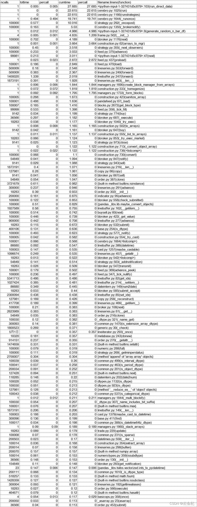

# 【backtrader 源码解析 1】从一个使用 backtrader 编写的双均线策略运行效率分析谈起

> 原文：<https://yunjinqi.blog.csdn.net/article/details/122748084>

使用 cProfile 测试了一个简单的双均线策略的运行，10 万行的数据，在效率分析中，总共用时 28 秒，回测最终的资产价值为 100028.99946889437。

#### 效率分析

下面是剔除了总体累计时间小于 0.1 的函数之后剩下消耗时间比较多的函数，在接下来的源码解析系列，将会重点关注这些函数并尝试看是否能够使用 cython 改写这些函数，从而提高 backtrader 的运行效率。目前用时约 28 秒，目标提高 10 倍的效率，这个测试希望时间能在 3 秒之内运行完；同时兼顾 100 万行和 1000 万行数据的效率提升问题，希望在这两个级别也能达到 10 倍的提升。不知道能不能实现这个目标，坚持去探索尝试一下，万一能实现呢？


#### 测试代码

```py
import numpy as np
import pandas as pd
import random 
import datetime
import backtrader as bt 
from cProfile import Profile

def generate_random_n_bar_df(n):
    start_datetime = datetime.datetime(1990,1,1,9,0,0)
    np.random.seed(1)
    a = np.random.random(n)
    np.random.seed(2)
    b = np.random.random(n)
    np.random.seed(3)
    c = np.random.random(n)
    np.random.seed(4)
    d = np.random.random(n)
    np.random.seed(5)
    e = np.random.random(n)
    np.random.seed(6)
    f = np.random.random(n)
    # bar 的数据和时间都是乱生成的，估计没有那种行情是这种，但是应该是不影响测试结果的可靠性
    result=[a,b,c,d,e,f]
    result_df = pd.DataFrame(result).T
    result_df.columns=['open',"high","low","close","volume","openinterest"]
    result_df.index=pd.to_datetime([start_datetime+datetime.timedelta(seconds=i) for i in list(range(n))])
    result_df['high']=result_df[['open','high','low','close']].max(axis=1)
    result_df['low']=result_df[['open','high','low','close']].min(axis=1)
    return result_df

class DirectStrategy(bt.Strategy):

    # params = (('short_window',10),('long_window',60))
    params = {"short_window":10,"long_window":20}

    def log(self, txt, dt=None):
        ''' log 信息的功能'''
        dt = dt or bt.num2date(self.datas[0].datetime[0])
        print('%s, %s' % (dt.isoformat(), txt))

    def __init__(self):
        # 一般用于计算指标或者预先加载数据，定义变量使用
        self.short_ma = bt.indicators.SMA(self.datas[0].close,period=self.p.short_window)
        self.long_ma = bt.indicators.SMA(self.datas[0].close,period=self.p.long_window)

    def next(self):
        # Simply log the closing price of the series from the reference
        # self.log(f"工商银行,{self.datas[0].datetime.date(0)},收盘价为：{self.datas[0].close[0]}")
        # self.log(f"short_ma:{self.short_ma[0]},long_ma:{self.long_ma[0]}")
        # 得到当前的 size
        data = self.datas[0]
        size = self.getposition(data).size

        # 平多
        if size>0 and self.short_ma[0]<self.long_ma[0] and self.short_ma[-1]>self.long_ma[-1]:
            self.close(data,size=1)
        # 平空
        if size<0 and self.short_ma[0]>self.long_ma[0] and self.short_ma[-1]<self.long_ma[-1]:
            self.close(data,size=1)

        # 开多
        if size==0 and self.short_ma[0]>self.long_ma[0] and self.short_ma[-1]<self.long_ma[-1]:
            self.buy(data,size=1)
        # 开空
        if size==0 and self.short_ma[0]<self.long_ma[0] and self.short_ma[-1]>self.long_ma[-1]:
            self.sell(data,size=1)

        # self.log(f"close:{self.datas[0].close[0]},short_ma:{self.short_ma[0]},long_ma:{self.long_ma[0]}")

#     def notify_order(self, order):
#         if order.status in [order.Submitted, order.Accepted]:
#             # order 被提交和接受
#             return
#         if order.status == order.Rejected:
#             self.log(f"order is rejected : order_ref:{order.ref}  order_info:{order.info}")
#         if order.status == order.Margin:
#             self.log(f"order need more margin : order_ref:{order.ref}  order_info:{order.info}")
#         if order.status == order.Cancelled:
#             self.log(f"order is concelled : order_ref:{order.ref}  order_info:{order.info}")
#         if order.status == order.Partial:
#             self.log(f"order is partial : order_ref:{order.ref}  order_info:{order.info}")
#         # Check if an order has been completed
#         # Attention: broker could reject order if not enougth cash
#         if order.status == order.Completed:
#             if order.isbuy():
#                 self.log("buy result : buy_price : {} , buy_cost : {} , commission : {}".format(
#                             order.executed.price,order.executed.value,order.executed.comm))

#             else:  # Sell
#                 self.log("sell result : sell_price : {} , sell_cost : {} , commission : {}".format(
#                             order.executed.price,order.executed.value,order.executed.comm))

#     def notify_trade(self, trade):
#         # 一个 trade 结束的时候输出信息
#         if trade.isclosed:
#             self.log('closed symbol is : {} , total_profit : {} , net_profit : {}' .format(
#                             trade.getdataname(),trade.pnl, trade.pnlcomm))
#         if trade.isopen:
#             self.log('open symbol is : {} , price : {} ' .format(
#                             trade.getdataname(),trade.price))

def run_direct_data(n):
    print("begin")

    df = generate_random_n_bar_df(n)
    df.index = pd.to_datetime(df.index)
    datetime_list = list(df.index)
    # 添加 cerebro
    cerebro = bt.Cerebro()
    # 添加策略
    cerebro.addstrategy(DirectStrategy)
    # 准备数据 
    params = dict(
                    fromdate = datetime_list[0],
                    todate = datetime_list[-1],
                    timeframe = bt.TimeFrame.Minutes,
                    compression = 1,
                    dtformat=('%Y-%m-%d %H:%M:%S'), # 日期和时间格式
                    tmformat=('%H:%M:%S'), # 时间格式
                    )

    feed =  bt.feeds.PandasDirectData(dataname=df,**params)
    # 添加合约数据
    cerebro.adddata(feed, name = "xxxxxx")
    cerebro.broker.setcommission(commission=0.0005)

    # 添加资金
    cerebro.broker.setcash(100000.0)

    # 开始运行
    cerebro.run()

    print(f"end value is {cerebro.broker.getvalue()}")

if __name__ =="__main__":

    prof = Profile()
    prof.enable()
    run_direct_data(100000)
    prof.create_stats()
    prof.print_stats() 
```