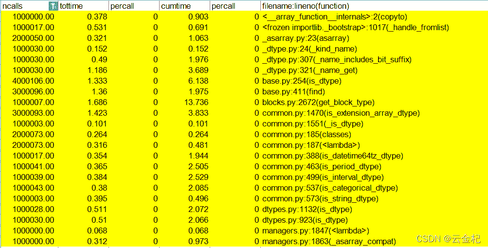

# 【backtrader 源码解析 6】使用 cython 改写 utils 中几个时间相关函数之后，单个函数效率提升但是总体上效率下降的原因（2022-02-21 修改)

> 原文：<https://yunjinqi.blog.csdn.net/article/details/123027301>

对比分析了纯 python 版本的结果和使用 cython 改写几个函数的结果，分析之后发现，使用 cython 改写之后，调用的函数增加了，主要是 python 函数内部的类型确认函数，找出来了一部分增加比较明显的函数调用：

尝试修改下 cython 的函数，使得返回的数据类型是 python 的数据类型，然后对比下看整体上的运行效率会不会提升。

使用 python 函数直接声明变量，提升效果也一般，可能哪里出错了，需要进一步分析。

另外还因为不知名的原因，导致上周测试成功的可以提升 2 倍左右的函数，在这次测试中基本没有提升，感觉 cython 的坑还是挺多的。（这个原因找到了，我从 backtrader 引入的是 cython 改进后的函数，所以两个函数其实是同一个，没啥差别，改了之后就可以了。)

注：在知乎去付费咨询了一个大神关于 cython 改进 python datetime 处理相关的函数,他以前也碰到过相关的问题，建议使用 numba 或者 pypy，并且如果 cython 改进后的结果写入数据库的话，也可以考虑使用，但是如果还是返回给 python 调用的话，就不太建议了，因为从 cython 调用 c 处理后的结果返回到 python，是一个巨大的开销，一般改进提升后的效率小于这个开销，所以会造成在整个 backtrader 的运行中，会导致时间反而更多。

在下一篇文章，考虑使用 numba 加速，看能否提高 backtrader 这几个函数的运行效率。

```py
import cython
import datetime as _datetime
from cpython.datetime cimport datetime,time

def time2num(tm:time) :

    num:cython.double 
    num = (tm.hour / 24.0 +
           tm.minute / 1440.0 +
           tm.second / 86400.0 +
           tm.microsecond / 86400000000.0)

    return num

def date2num(dt:datetime, tz=None) :

    base:cython.double 
    num:cython.double 
    if tz is not None:
        dt = tz.localize(dt)

    if hasattr(dt, 'tzinfo') and dt.tzinfo is not None:
        delta = dt.tzinfo.utcoffset(dt)
        if delta is not None:
            dt -= delta

    base = dt.toordinal()
    if hasattr(dt, 'hour'):
        # base = math.fsum(
        #    (base, dt.hour / 24.0, dt.minute / 1440.0,
        #     dt.second / 86400.0, dt.microsecond / 86400000000.0))
        num = (dt.hour / 24.0 +
              dt.minute / 1440.0 +
              dt.second / 86400.0 +
              dt.microsecond / 86400000000.0)
        base = base+num

    return base

class _UTC(_datetime.tzinfo):

    # UTC 类
    def utcoffset(self, dt):
        return _datetime.timedelta(0)

    def tzname(self, dt):
        return "UTC"

    def dst(self, dt):
        return _datetime.timedelta(0)

    def localize(self, dt):
        return dt.replace(tzinfo=self)

def num2date(x:cython.double, tz=None, naive=True) :

    ix:cython.int 
    dt:datetime 
    hour:cython.int 
    minute:cython.int 
    second:cython.int 
    microsecond:cython.int 
    remainder:cython.double 

    ix = int(x)                                                     # 对 x 进行取整数
    dt = _datetime.datetime.fromordinal(ix)                          # 返回对应 Gregorian 日历时间对应的 datetime 对象
    remainder = x - ix                                              # x 的小数部分
    hour, remainder = divmod(24 * remainder, 1)          # 小时
    minute, remainder = divmod(60.0 * remainder, 1)     # 分钟
    second, remainder = divmod(60.0 * remainder, 1)   # 秒
    microsecond = int(1000000.0 * remainder)             # 微妙
    # 如果微秒数小于 10,舍去
    if microsecond < 10:
        microsecond = 0  # compensate for rounding errors

    if  tz is not None:
        # 合成时间
        dt = _datetime.datetime(dt.year, dt.month, dt.day, hour, minute, second,microsecond,tzinfo=_UTC())
        dt = dt.astimezone(tz)
        if naive:
            dt = dt.replace(tzinfo=None)
    else:
        dt = _datetime.datetime(dt.year, dt.month, dt.day, hour, minute, second,microsecond)

    if microsecond > 999990:  # compensate for rounding errors
        dt += _datetime.timedelta(microseconds=1e6 - microsecond)

    return dt

# 数字转换成日期

def  num2dt(num:cython.double, tz=None, naive=True) :
    return num2date(num, tz=tz, naive=naive).date()

# 数字转换成时间

def  num2time(num:cython.double, tz=None, naive=True) :
    return num2date(num, tz=tz, naive=naive).time() 
```