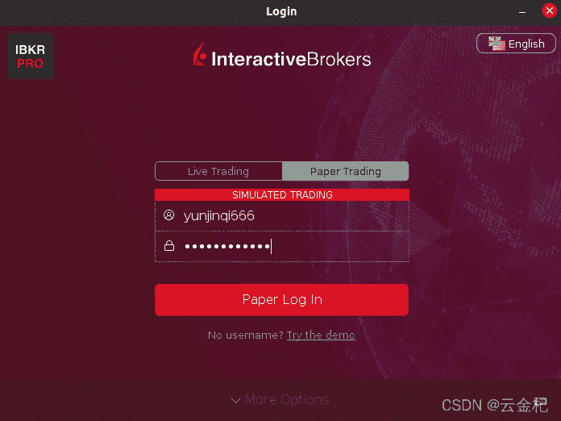
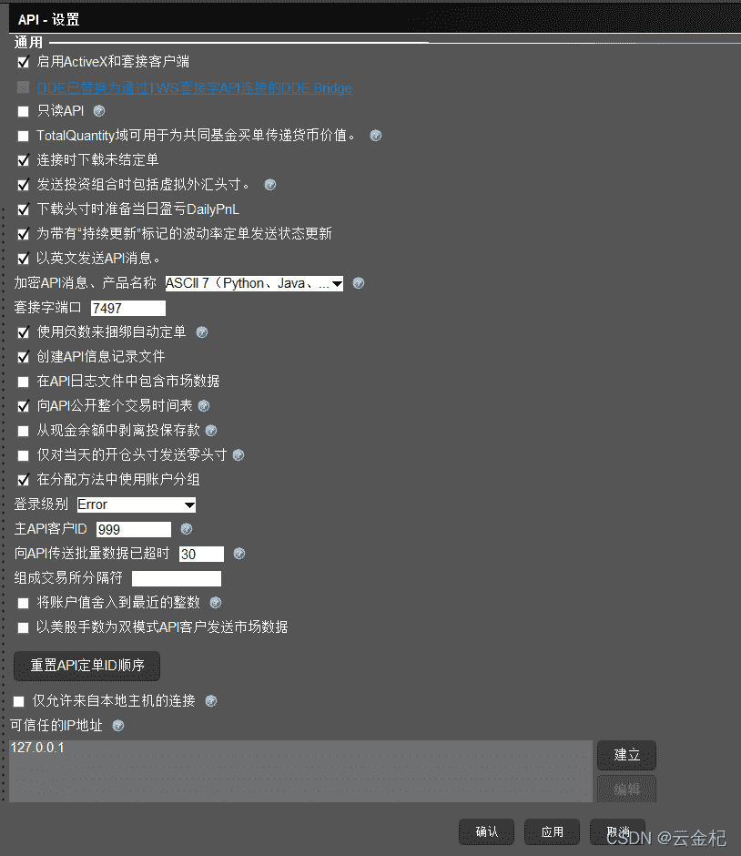
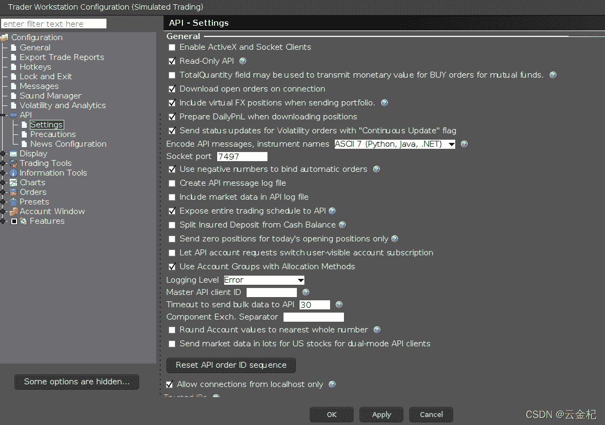

# 1、TWS API 的相关配置

> 原文：<https://yunjinqi.blog.csdn.net/article/details/121730477>

一、模拟账户注册

[打开 ib 的网站](https://www.ibkr.com.cn/Universal/Application?ft=T)，注册一个模拟账户，用于在 backtrader 上进行模拟交易。

二、安装 TWS

​ [安装 IB 的软件 TWS](https://www.interactivebrokers.com/en/trading/trading-platforms.php)，里面有详细的步骤，ubuntu 安装之前可能需要安装下面的依赖包。

```py
sudo apt-get install -y libcanberra-gtk-module 
```




登录之后，API settings 里面的内容保持默认就好



三、安装 ibpy

官网上的方法可以参考，但是似乎比较旧了，实际上直接使用下面的命令就可以直接安装

```py
pip install IBPy2 
```

四、测试 TWS 和 ibpy 的功能是否正常

参考文献：

1.  https://www.quantstart.com/articles/Interactive-Brokers-Demo-Account-Signup-Tutorial/
2.  https://www.quantstart.com/articles/using-python-ibpy-and-the-interactive-brokers-api-to-automate-trades/