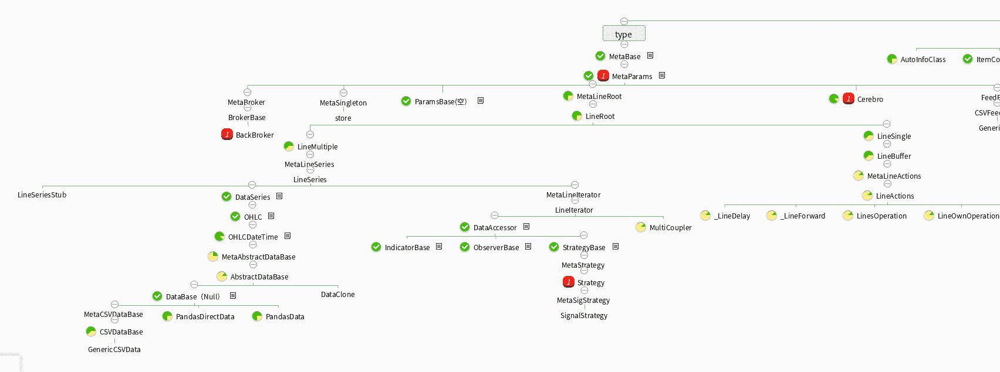

# 2、backtrader 能实现什么功能？

> 原文：<https://yunjinqi.blog.csdn.net/article/details/107595545>

想要回答 backtrader 能实现什么功能，这个实在是太难了。因为 backtrader 可以实现的功能非常多，数不胜数。

我们尝试用逆向思维法，分析一下 backtrader 比较难实现的功能吧。

## **backtrader 无所不能，除了---**

### 1\. 比较难实现高频的回测与交易(回测速度慢）

backtrader 框架是基于 Python 开发的，本身要受到 python 速度的局限，不太适合高频(频率比较高)的回测与交易。如果你想要实现高频的回测与交易，建议你去使用 C++或者 java。

### 2\. 没有 bid 和 ask 这样的 tick 数据结构，基于盘口语言的回测比较难实现

backtrader 的基本的数据是基于 bar 数据的高开低收成交量持仓量数据，还可以增加自定义的额外数据，如 pe,pb 等，本质上是基于 bar 的回测。

### 3\. 不是精通 python 语言的 quant，比较难 debug

backtrader 大量使用了元编程技术，并且创建了特殊的类---line，出现 bug 的时候 debug，可能需要查找很多类。下图是我很早之前读过 backtrader 的源码做的 backtrader 类之间继承关系的一个百度脑图的一部分，从中可以看出其复杂之处。

本身 backtrader 的目标就是要提供一个简单的好用的框架，如果你不是量化系统开发工程师，Python 水平一般也是可以使用的，因为写策略的时候特别简单和容易。如果你是量化系统开发工程师，想要从源码层面了解 backtrader，你需要确信，自己的 python 水平是足够的。

除了比较难实现的功能之外，剩下的就是 backtrader 的优点了，可以列出来一大堆。

具体可以参考我以前的知乎文章：

[为什么又重新用 backtrader 了？](https://zhuanlan.zhihu.com/p/97399549 "为什么又重新用 backtrader 了？")

[回测框架 PyAlgoTrade 和 backtrader 哪个好?](https://www.zhihu.com/question/351183213/answer/969200530 "回测框架 PyAlgoTrade 和 backtrader 哪个好?")

[目前哪个国内量化回测平台最好？](https://www.zhihu.com/question/402894422/answer/1304591164 "目前哪个国内量化回测平台最好？")