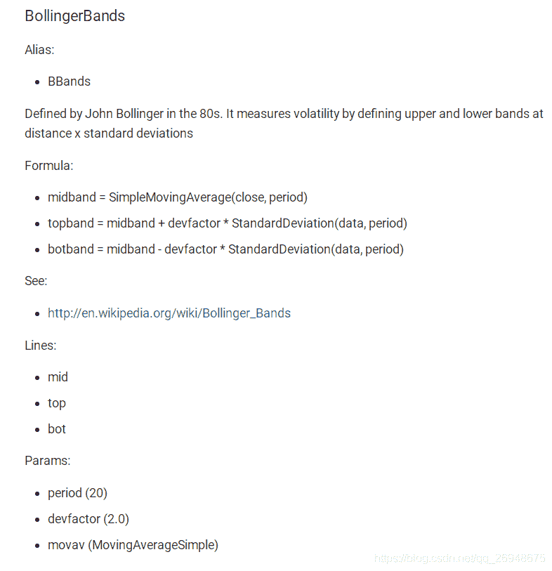
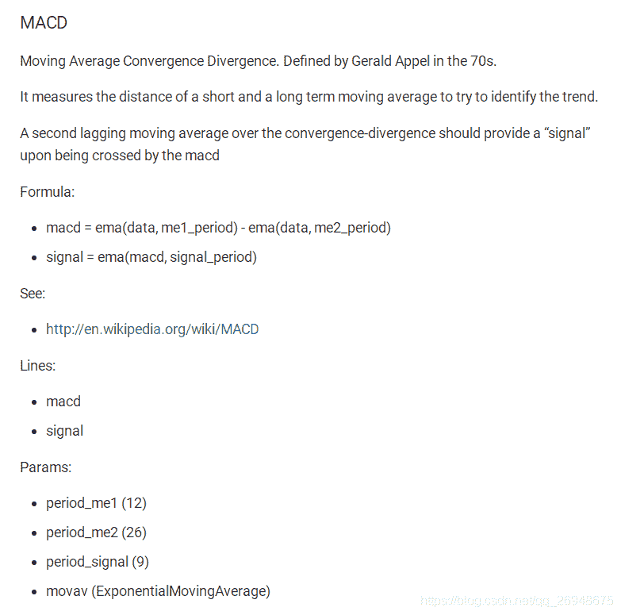

# 【答读者问 10】backtrader 如何调用技术指标的值？

> 原文：<https://yunjinqi.blog.csdn.net/article/details/117531690>

[云子量化免费阅读传送链接](https://www.yunjinqi.top/article/39)

答读者问为免费文章，不计入专栏里面。

今天在群里面见有人问如何调用技术指标的值，backtrader 内置了大量的技术指标，在使用的时候可以直接调用，非常方便。但是也有一些新的使用者，不知道如何调用，在这篇文章中，就分享下这个问题。

47、backtrader 的一些基本概念—技术指标(indicator)的使用教程

48、backtrader 的一些基本概念----如何创建一个新的技术指标(indicator)

49、【backtrader 股票策略】如何实现跨周期调用技术指标的策略？

在 47、48、49 三篇文章里面，分别介绍了技术指标的使用教程，如何创建新的技术指标以及如何实现跨周期调用技术指标。但是，对于某些比较新的技术指标，如果没有接触过，想要正确使用，还是需要一定的英文阅读能力和源码理解能力，本文举一些比较常用的例子。

1.  可以在官网上，找到具体的指标的说明

    talib 技术指标的说明

    backtrader 自带的技术指标的说明

    我个人比较倾向于 backtrader 自带的指标，因为在对比一些指标值的时候，发现有些指标的值算出来是不一样的，在某些情形下，backtrader 计算的值，和传统行情软件更兼容。

    假如想要使用布林带和 macd 两个指标，我们就可以在指标描述里面找到，并且还有详细的描述。

    
    

在布林带这个指标里面，有具体的计算公式：formula；有输出的值：lines,这个就是我们可以调用的值了；有需要的参数:params,我们可以根据参数的值，设定我们自己想要的。

一个完整调用布林带的指标的例子可以设定为：

```py
Class TestStragtegy(bt.strategy):
    def __init__(self):
        # 计算布林带指标
        self.bollinger = bt.indicators.BollingerBands(data.close,period = 252)

    # 使用布林带指标的值
    def next(self):
        # 布林带上轨
        top = self.bollinger.top
        # 布林带下轨
        bot = self.bollinger.bot
        # 布林带中轨
        mid = self.bollinger.mid
        # top\bot\mid 都是 line 格式，可以用常规的 line 的方法进行操作，如当前的上轨为 top[0],前一个交易日的下轨值为 bot[-1],还可以取到下个交易日的中轨值：mid[1],但是不太建议取，这个是未来数据。
        # 大家可以自行尝试一下 macd,并且分析下 macd 的输出的 line 中，macd 和 signal 分别对应常用的 macd 的哪些值 
```

智慧、心灵、财富，总要有一个在路上，愿我们能在人生的道路上，不断成长、不断成熟～～～

感兴趣可以关注我的专栏：

[my_quant_study_note](https://www.zhihu.com/column/quant-study)：分享一些关于量化投资、量化交易相关的思考

[backtrader 量化投资回测与交易](https://zhuanlan.zhihu.com/c_1189276087837011968)：本专栏免费，分享 backtrader 相关的内容。

[量化投资神器-backtrader 源码解析-从入门到精通：本专栏目前收费 299 元，预计更新 100 篇策略+20 篇 backtrader 讲解+80 篇源代码分析。](https://link.zhihu.com/?target=https%3A//yunjinqi.blog.csdn.net/article/details/107594251)