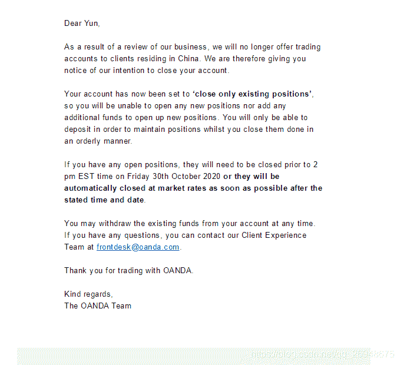

# 【答读者问 14】backtrader 实盘交易中应该注意些什么(风险管理篇)？

> 原文：<https://yunjinqi.blog.csdn.net/article/details/118309630>

[云子量化免费阅读传送链接](https://www.yunjinqi.top/article/43)

上篇讲了实盘交易的时候需要注意的一些关于数据方面的问题，接下来，谈一谈实盘交易(不仅仅是 backtrader 实盘交易)面临哪些风险。

FRM 参考教材中，把风险分成了八类，包含信用风险、市场风险、操作风险、流动性风险、法律风险、经营风险、战略风险与声誉风险。

作为一个考过 FRM 的 quant，结合我自身的经历，谈一谈各种风险类型。

#### 信用风险

*   交易所安全性

做交易，最大的风险在于你账面亏损时，你亏钱；你账面盈利时，钱取不出来，是纸面利润。比如，某某比特币交易所跑路了，导致某个投资人投资赚的几百万取不出来。

交易场所的安全，主要是指交易所公平、公正、公开、流动性充足，这个安全是我们做交易的基础。

谈一下我自己的惨痛的教训吧。

前两年我在 oanda 上做外汇的网格交易，我们都知道，网格交易，只要抗过亏损阶段，总会盈利(外汇稍微有些特殊，涉及利息费用问题)，在我亏损的阶段，oanda 关闭了中国的业务，限制开仓并且需要在一定时间内对账户进行平仓，导致最终亏损了一些出场的。

#### 市场风险

*   提高承受黑天鹅事件的能力

    这个和我们的交易策略与投资组合的管理直接相关。

    市场风险的要义在于不论你赚了多少个 100%，只要经历一次 100%的亏损你就全部亏完了。在盈利与亏损上，盈亏是不平衡的，这个也可以从损失厌恶上来解释。所以，需要经常对自己的策略做压力测试与情景测试(关于如何做压力测试与情景测试的资料相对来说比较少，这可能算是一个核心技能)，避免黑天鹅来临的时候，会导致账户资产的大幅度缩水。

*   衡量市场风险的模型的不可靠性

    大部分衡量市场风险的模型，如 VAR 之类的，只能参考，不能全信。但是最好还是能有。

#### 操作风险

我们用字面意思来理解这个风险类型，和 FRM 中对操作风险的定义略有不同。

操作风险就是因为操作不当导致的损失。

量化交易中有哪些操作风险呢？

*   断网风险

    2017 年，在阿里云上做比特币交易的时候，曾经断网了，我隔了几天才发现，找他们客服去理论，就赔了我 50 块钱，还是不真钱，是优惠券。

    网络是一个基础，如果断网了，量化交易也就不可能进行下去了。

    所以，在使用服务器之类的，能够实时监控这个服务器网络是否正常。虽然这种事情发生的概率会非常小，发生了影响也不一定非常大，但是，总归是一种风险，需要去避免。

*   交易系统 bug 未发现

    这个说起来，历史上有很多次事件，因为设计的量化交易系统有问题导致的亏损。比如，骑士资本的高频交易。

    backtrader 可能也存在某些系统上的 bug，不能因为没有发现，就认为不存在。需要时刻保持警惕的心理。

*   操作失误

    不多说了，我自己有时候都恨不得砍掉自己的手。乌龙指就是专门形容这种类型的失误的。

#### 流动性风险

流动性风险包含多个方面，比如某个资产的流动性不足，另外就是账户资金不足的风险。个体的流动性不足是策略需要考虑的。账户资金不足的风险，如果是在杠杆交易中，就可能导致爆仓。这个需要额外注意。交易的时候，一定要保证，账户里面有足够的保证金，不会面临爆仓风险。

#### 法律风险、经营风险、战略风险与声誉风险

不在法规不允许的地方进行量化交易。比如比特币，比如炒鞋。

* * *

注：量化交易本身追求的是基于大数定律的情况下，通过量化模型获取交易上的优势，并不是追求某个交易。所以，一定不能毕其功于一役。

* * *