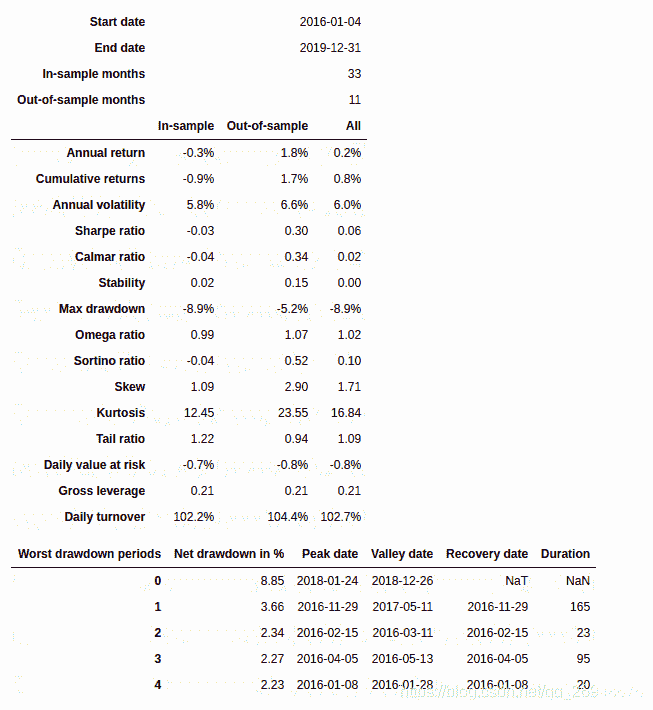
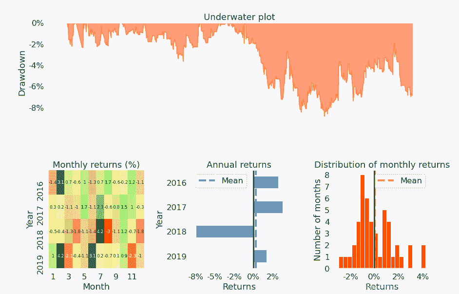
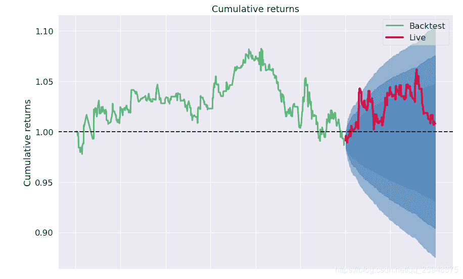

# 【答读者问 15】backtrader 如何使用其他软件产生的交易信号做回测？

> 原文：<https://yunjinqi.blog.csdn.net/article/details/118769993>

[云子量化免费阅读传送链接](https://www.yunjinqi.top/article/44)

本文是免费文章，不计入专栏文章中。

[在后来，经读者提醒，发现可能存在一个更好的解决方案，可以先参考该文：63、backtrader 的一些高级技巧—如何根据历史订单信息进行回测？](https://yunjinqi.blog.csdn.net/article/details/118915060)

虽然使用 backtrader 自己本身就可以做策略逻辑的处理，自己产生交易信号，并且根据信号计算账户的盈亏、净值，然而，如果仅仅只有交易信号的情况下，使用 backtrader 也可以做回测、根据交易信号产生盈亏，并对账户的绩效进行分析。


举例说明：

由于股票是 T+1,所以假设是有底仓的情况下实现的交易。

假设有这样的一系列的信号数据，给出了日期，当 signal 为 1 的时候，以开盘价买入 45%资金，然后以收盘价*(1+rate)的价格卖出(昨日的全部底仓)；当 signal 为-1 的时候，以开盘价卖出 45%资金，以收盘价*(1+rate)的价格买入平仓(卖空得到数量)，如果 45%资金卖出的股票手数大于现有的底仓，只能以底仓的手数卖出。

注：为什么用的 45%的资金，是因为使用 50%的资金，容易导致下个交易日资金不足，如果用 50%,需要处理一下资金的问题，这个只是一个小 demo，就不多做介绍了。

如何实现这样一个信号的回测呢？可以参考下面的代码

```py
import backtrader as bt
import datetime
import pandas as pd
import numpy as np
import os,sys
import copy
import talib
import math 
import warnings
warnings.filterwarnings("ignore")
import pyfolio as pf

# 我们使用的时候，直接用我们新的类读取数据就可以了。
class TestSignalStrategy(bt.Strategy):

    params = (('period',30),
              ('hold_percent',0.02)
             )

    def log(self, txt, dt=None):
        ''' Logging function fot this strategy'''
        dt = dt or self.datas[0].datetime.date(0)
        print('{}, {}'.format(dt.isoformat(), txt))

    def __init__(self):
        # Keep a reference to the "close" line in the data[0] dataseries
        self.bar_num=0    
        # 读取交易信号
        self.signal_df = pd.read_csv("/home/yun/data/交易信号.csv")
        self.signal_df['date']=pd.to_datetime(self.signal_df['date'])
        # 交易的初始状态
        self.first_trade = True 

    def prenext(self):

        self.next()

    def next(self):
        # 假设有 100 万资金，每次成份股调整，每个股票使用 1 万元
        self.bar_num+=1
        # 前一交易日和当前的交易日
        current_date = self.datas[0].datetime.date(0).strftime("%Y-%m-%d")
        # 获取下一个交易日，历史数据的最后一个 bar 没有下个交易日，是 None
        try:
            next_date = self.datas[0].datetime.date(1)
        except:
            next_date = None
        if next_date is not None:
            # 获取当前的信号信息 
            next_signal_df = self.signal_df[self.signal_df['date']==pd.to_datetime(next_date)]
            if len(next_signal_df)==0:
                self.log("下个交易日的信号不存在")
            else: 
                signal = int(next_signal_df['signal'])
                close_price = float(next_signal_df['close'])
                rate = float(next_signal_df['rate'])

                # 如果是第一次交易，由于没有底仓，只允许做多
                if self.first_trade:
                    # 如果是做空信号，忽略
                    if signal==-1:
                        pass 
                    # 做多信号
                    if signal == 1:
                        total_value = self.broker.get_value()
                        next_open_price = self.datas[0].open[1]
                        # 45%仓位
                        target_size = (0.01*0.45*total_value/next_open_price )*100
                        # 下单
                        self.buy(self.datas[0],size = target_size)
                        # 接下来就不是第一次交易了
                        self.first_trade = False 
                else:
                    # 现有持仓
                    now_hold_size = self.getposition(self.datas[0]).size 
                    # 做多,持仓会变化
                    if signal == 1:
                        total_value = self.broker.get_value()
                        next_open_price = self.datas[0].open[1]
                        # 45%仓位
                        target_size = (0.01*0.45*total_value/next_open_price )*100
                        # 下单开仓
                        self.buy(self.datas[0],size = target_size)
                        # 同时下单平仓
                        self.sell(self.datas[0],size = now_hold_size,exectype=bt.Order.Limit,
                                  price=close_price*(1+rate))
                    # 做空，底仓不变
                    if signal == -1:
                        total_value = self.broker.get_value()
                        next_open_price = self.datas[0].open[1]
                        # 50%仓位
                        target_size = (0.01*0.45*total_value/next_open_price )*100
                        # 卖出开仓,手数不能超过底仓
                        if target_size>now_hold_size:
                            target_size = now_hold_size

                        self.sell(self.datas[0],size = target_size)
                        # 同时下单平仓
                        self.buy(self.datas[0],size = now_hold_size,exectype=bt.Order.Limit,
                                  price=close_price*(1+rate))

    def notify_order(self, order):

        if order.status in [order.Submitted, order.Accepted]:
            return

        if order.status == order.Rejected:
            self.log(f"Rejected : order_ref:{order.ref}  data_name:{order.p.data._name}")

        if order.status == order.Margin:
            self.log(f"Margin : order_ref:{order.ref}  data_name:{order.p.data._name}")

        if order.status == order.Cancelled:
            self.log(f"Concelled : order_ref:{order.ref}  data_name:{order.p.data._name}")

        if order.status == order.Partial:
            self.log(f"Partial : order_ref:{order.ref}  data_name:{order.p.data._name}")

        if order.status == order.Completed:
            if order.isbuy():
                self.log(f" BUY : data_name:{order.p.data._name} price : {order.executed.price} , cost : {order.executed.value} , commission : {order.executed.comm}")

            else:  # Sell
                self.log(f" SELL : data_name:{order.p.data._name} price : {order.executed.price} , cost : {order.executed.value} , commission : {order.executed.comm}")

    def notify_trade(self, trade):
        # 一个 trade 结束的时候输出信息
        if trade.isclosed:
            self.log('closed symbol is : {} , total_profit : {} , net_profit : {}' .format(
                            trade.getdataname(),trade.pnl, trade.pnlcomm))
            # self.trade_list.append([self.datas[0].datetime.date(0),trade.getdataname(),trade.pnl,trade.pnlcomm])

        if trade.isopen:
            self.log('open symbol is : {} , price : {} ' .format(
                            trade.getdataname(),trade.price))
    def stop(self):

        pass 

# 初始化 cerebro,获得一个实例
cerebro = bt.Cerebro()
# cerebro.broker = bt.brokers.BackBroker(shortcash=True)  # 0.5%
data_root = "/home/yun/data/stock/day/"
file_list =sorted(os.listdir(data_root))
params=dict(

    fromdate = datetime.datetime(2016,1,1),
    todate = datetime.datetime(2019,12,31),
    timeframe = bt.TimeFrame.Days,
    dtformat = ("%Y-%m-%d"),
    # compression = 1,
    datetime = 0,
    open = 1,
    high = 2,
    low =3,
    close =4,
    volume =5,
    openinterest=-1)

# 加载指数数据
df = pd.read_csv("/home/yun/data/stock/day/600000.XSHG.csv")
df.columns = ['datetime','open','high','low','close','volume','openinterest']
df.index = pd.to_datetime(df['datetime'])
df = df[['open','high','low','close','volume','openinterest']]
df = df[(df.index<=params['todate'])&(df.index>=params['fromdate'])]
# feed = bt.feeds.GenericCSVData(dataname = "/home/yun/data/stock/index.csv",**params)
feed = bt.feeds.PandasDirectData(dataname = df)
# 添加数据到 cerebro
cerebro.adddata(feed, name = '600000')

# 添加手续费，按照万分之二收取
cerebro.broker.setcommission(commission=0.0002,stocklike=True)
# 设置初始资金为 100 万
cerebro.broker.setcash(1_0000_0000)
# 添加策略
cerebro.addstrategy(TestSignalStrategy)
cerebro.addanalyzer(bt.analyzers.PyFolio)
# 运行回测
results = cerebro.run()
# 打印相关信息
pyfoliozer = results[0].analyzers.getbyname('pyfolio')
returns, positions, transactions, gross_lev = pyfoliozer.get_pf_items()
pf.create_full_tear_sheet(
    returns,
    positions=positions,
    transactions=transactions,
    # gross_lev=gross_lev,
    live_start_date='2019-01-01',
    ) 
```

#### 绩效





#### 提醒

平仓的时候都是使用的限价单，限价单的逻辑是以其本身限定的价格或者更优的价格成交，所以如果开盘有跳空之类的，有可能导致以更优价格成交，导致和日内 tick 回测的时候的目标价格有一定的偏离。

建议可以用分钟线或者小时线进行回测，可以进一步提高回测的精确度。

时间统计：写作本文，大致花费 87 分钟。