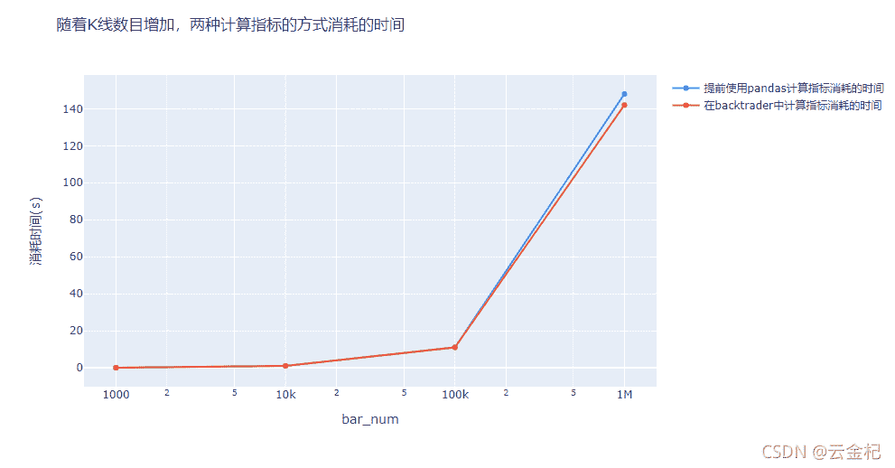

# 【答读者问 23】计算指标的时候是直接使用 pandas 计算好指标加载进去速度快，还是在 backtrader 中计算指标速度快？（2021-11-17 更新，修复 pandas 增加列添加问题)

> 原文：<https://yunjinqi.blog.csdn.net/article/details/121068157>

[云子量化免费阅读传送链接](https://www.yunjinqi.top/article/52)

如题所示：想要验证下，是直接通过 backtrader 计算所需要的指标速度快，还是通过 pandas 计算好指标，通过扩展数据加载进去速度快，废话不多说，直接说下验证的思路，罗列验证的代码，给出测试的结果。

#### 详细的验证步骤

1.  生成一个 1 千，1 万，10 万，100 万的随机数，保存本地，形成 csv 文件。

2.  然后分别使用两种方法读取，计算指标

    *   方法一：使用 pandas 读取数据，并计算 10 周期和 20 周期的均线，分别保存为两个新的列：“short_ma"和”long_ma"，然后加载到 cerebro 中，写策略的时候，就不再计算均线
    *   方法二：使用 pandas 数据直接加载到 cerebro 中，然后在策略里面计算 10 周期和 20 周期的均线，分别命名为“short_ma"和"long_ma"
3.  测试在不同的数据量级别下使用的时间，然后画图。

#### 测试代码

```py
import numpy as np
import pandas as pd
import random 
import datetime
import backtrader as bt 
def generate_random_n_bar_df(n):
    start_datetime = datetime.datetime(1990,1,1,9,0,0)
    # bar 的数据和时间都是乱生成的，估计没有那种行情是这种，但是应该是不影响测试结果的可靠性
    result=[[random.random(),random.random(),random.random(),random.random(),random.random(),random.random()] for i in range(n)]
    result_df = pd.DataFrame(result,columns=['open',"high","low","close","volume","openinterest"])
    result_df.index=pd.to_datetime([start_datetime+datetime.timedelta(seconds=i) for i in list(range(n))])
    return result_df
# 从 1000 到 100 万的 bar 的数目模拟生成
for n in [1000,10000,100000,1000000]:
    data = generate_random_n_bar_df(n)
    data.to_csv(f"data_{n}.csv")
    print(f"{n}个 bar 的模拟数据成功保存到工作目录")

class DirectStrategy(bt.Strategy):

    # params = (('short_window',10),('long_window',60))
    params = {"short_window":10,"long_window":20}

    def log(self, txt, dt=None):
        ''' log 信息的功能'''
        dt = dt or bt.num2date(self.datas[0].datetime[0])
        print('%s, %s' % (dt.isoformat(), txt))

    def __init__(self):
        # 一般用于计算指标或者预先加载数据，定义变量使用
        self.short_ma = bt.indicators.SMA(self.datas[0].close,period=self.p.short_window)
        self.long_ma = bt.indicators.SMA(self.datas[0].close,period=self.p.long_window)

    def next(self):
        # Simply log the closing price of the series from the reference
        # self.log(f"工商银行,{self.datas[0].datetime.date(0)},收盘价为：{self.datas[0].close[0]}")
        # self.log(f"short_ma:{self.short_ma[0]},long_ma:{self.long_ma[0]}")
        # 得到当前的 size
        data = self.datas[0]
        # self.log(f"close:{self.datas[0].close[0]},short_ma:{self.short_ma[0]},long_ma:{self.long_ma[0]}")

#     def notify_order(self, order):
#         if order.status in [order.Submitted, order.Accepted]:
#             # order 被提交和接受
#             return
#         if order.status == order.Rejected:
#             self.log(f"order is rejected : order_ref:{order.ref}  order_info:{order.info}")
#         if order.status == order.Margin:
#             self.log(f"order need more margin : order_ref:{order.ref}  order_info:{order.info}")
#         if order.status == order.Cancelled:
#             self.log(f"order is concelled : order_ref:{order.ref}  order_info:{order.info}")
#         if order.status == order.Partial:
#             self.log(f"order is partial : order_ref:{order.ref}  order_info:{order.info}")
#         # Check if an order has been completed
#         # Attention: broker could reject order if not enougth cash
#         if order.status == order.Completed:
#             if order.isbuy():
#                 self.log("buy result : buy_price : {} , buy_cost : {} , commission : {}".format(
#                             order.executed.price,order.executed.value,order.executed.comm))

#             else:  # Sell
#                 self.log("sell result : sell_price : {} , sell_cost : {} , commission : {}".format(
#                             order.executed.price,order.executed.value,order.executed.comm))

#     def notify_trade(self, trade):
#         # 一个 trade 结束的时候输出信息
#         if trade.isclosed:
#             self.log('closed symbol is : {} , total_profit : {} , net_profit : {}' .format(
#                             trade.getdataname(),trade.pnl, trade.pnlcomm))
#         if trade.isopen:
#             self.log('open symbol is : {} , price : {} ' .format(
#                             trade.getdataname(),trade.price))

class NotDirectStrategy(bt.Strategy):

    # params = (('short_window',10),('long_window',60))
    params = {"short_window":10,"long_window":20}

    def log(self, txt, dt=None):
        ''' log 信息的功能'''
        dt = dt or bt.num2date(self.datas[0].datetime[0])
        print('%s, %s' % (dt.isoformat(), txt))

    def __init__(self):
        # 一般用于计算指标或者预先加载数据，定义变量使用
        pass

    def next(self):
        # Simply log the closing price of the series from the reference
        # self.log(f"工商银行,{self.datas[0].datetime.date(0)},收盘价为：{self.datas[0].close[0]}")
        # self.log(f"short_ma:{self.short_ma[0]},long_ma:{self.long_ma[0]}")
        # 得到当前的 size
        data = self.datas[0]
        # self.log(f"close:{data.close[0]},short_ma:{data.short_ma[0]},long_ma:{data.long_ma[0]}")

#     def notify_order(self, order):
#         if order.status in [order.Submitted, order.Accepted]:
#             # order 被提交和接受
#             return
#         if order.status == order.Rejected:
#             self.log(f"order is rejected : order_ref:{order.ref}  order_info:{order.info}")
#         if order.status == order.Margin:
#             self.log(f"order need more margin : order_ref:{order.ref}  order_info:{order.info}")
#         if order.status == order.Cancelled:
#             self.log(f"order is concelled : order_ref:{order.ref}  order_info:{order.info}")
#         if order.status == order.Partial:
#             self.log(f"order is partial : order_ref:{order.ref}  order_info:{order.info}")
#         # Check if an order has been completed
#         # Attention: broker could reject order if not enougth cash
#         if order.status == order.Completed:
#             if order.isbuy():
#                 self.log("buy result : buy_price : {} , buy_cost : {} , commission : {}".format(
#                             order.executed.price,order.executed.value,order.executed.comm))

#             else:  # Sell
#                 self.log("sell result : sell_price : {} , sell_cost : {} , commission : {}".format(
#                             order.executed.price,order.executed.value,order.executed.comm))

#     def notify_trade(self, trade):
#         # 一个 trade 结束的时候输出信息
#         if trade.isclosed:
#             self.log('closed symbol is : {} , total_profit : {} , net_profit : {}' .format(
#                             trade.getdataname(),trade.pnl, trade.pnlcomm))
#         if trade.isopen:
#             self.log('open symbol is : {} , price : {} ' .format(
#                             trade.getdataname(),trade.price))

def run_direct_data(n):
    data_name = f"data_{n}.csv"  
    df = pd.read_csv(data_name,index_col=0)
    df.index = pd.to_datetime(df.index)
    datetime_list = list(df.index)
    # 添加 cerebro
    cerebro = bt.Cerebro()
    # 添加策略
    cerebro.addstrategy(DirectStrategy)
    # 准备数据        
    params = dict(
                    fromdate = datetime_list[0],
                    todate = datetime_list[-1],
                    timeframe = bt.TimeFrame.Minutes,
                    compression = 1,
                    dtformat=('%Y-%m-%d %H:%M:%S'), # 日期和时间格式
                    tmformat=('%H:%M:%S'), # 时间格式
                    )

    feed =  bt.feeds.PandasDirectData(dataname=df,**params)
    # 添加合约数据
    cerebro.adddata(feed, name = "gsyh")
    cerebro.broker.setcommission(commission=0.0005)

    # 添加资金
    cerebro.broker.setcash(100000.0)

    # 开始运行
    cerebro.run()

class ExtendPandasFeed(bt.feeds.PandasDirectData):

    params = (
        ('datetime', 0),
        ('open', 1),
        ('high', 2),
        ('low', 3),
        ('close', 4),
        ('volume', 5),
        ('openinterest', 6),
        ("short_ma",7),
        ("long_ma",8)
        )
	lines = ("short_ma","long_ma",)
    datafields = [
        'datetime', 'open', 'high', 'low', 'close', 'volume', 'openinterest',"short_ma","long_ma"
    ]

def run_not_direct_data(n):
    data_name = f"data_{n}.csv"  
    df = pd.read_csv(data_name,index_col=0)
    df.index = pd.to_datetime(df.index)
    # 计算指标
    df['short_ma']=df['close'].rolling(10).mean()
    df['long_ma']=df['close'].rolling(20).mean()
    datetime_list = list(df.index)
    # 添加 cerebro
    cerebro = bt.Cerebro()
    # 添加策略
    cerebro.addstrategy(NotDirectStrategy)
    # 准备数据        
    params = dict(
                    fromdate = datetime_list[0],
                    todate = datetime_list[-1],
                    timeframe = bt.TimeFrame.Minutes,
                    compression = 1,

                    )

    feed =  ExtendPandasFeed(dataname=df,**params)
    # 添加合约数据
    cerebro.adddata(feed, name = "gsyh")
    cerebro.broker.setcommission(commission=0.0005)

    # 添加资金
    cerebro.broker.setcash(100000.0)

    # 开始运行
    cerebro.run()
# 对比了一下，两个输出的结果是一样的。
# run_not_direct_data(1000)   
# run_direct_data(1000)
# 统计两种方法需要的时间
direct_time_list =[]
not_direct_time_list =[]
bar_num_list = [1000,10000,100000,1000000]
for bar_num in bar_num_list:
    begin_time = datetime.datetime.now()
    run_direct_data(bar_num)
    end_time = datetime.datetime.now()
    consume_time = (end_time-begin_time).seconds
    direct_time_list.append(consume_time)
    begin_time = datetime.datetime.now()
    run_not_direct_data(bar_num)
    end_time = datetime.datetime.now()
    consume_time = (end_time-begin_time).seconds
    not_direct_time_list.append(consume_time)
# 画出相关的图
data = [

    go.Scatter(
        x=bar_num_list,
        y=not_direct_time_list,
        name = '提前使用 pandas 计算指标消耗的时间'
    ),
     go.Scatter(
        x=bar_num_list,
        y=direct_time_list,
        name = '在 backtrader 中计算指标消耗的时间'
    )
]

layout = go.Layout(
    title = '随着 K 线数目增加，两种计算指标的方式消耗的时间'
)

fig = go.Figure(data = data)
# 步骤四
fig.update_layout(
  title= '随着 K 线数目增加，两种计算指标的方式消耗的时间',
  xaxis_title="bar_num",
  yaxis_title="消耗时间(s)",
  xaxis = {"type":"log"}
)
fig.show() 
```

#### 测试结果



#### 结果分析

使用 pandas 计算完指标，加载到 cerebro 之中，居然比在 backtrader 中直接计算指标消耗的时间多，我推测的要不然是一样，要不然就是使用 pandas 计算更优，结果和我想的不一样。可能原因在于我们扩展数据的时候是直接继承的 PandasDirectData,没有做特别的优化。

理论上来说，如果 backtrader 计算指标的时候采用的是向量式的，那么两者的时间应该比较接近。如果 backtrader 使用的是事件驱动式来计算指标，那么 backtrader 应该消耗的时间更多一些。

backtrader 计算指标即可以采用向量式的，也可以采用事件驱动式的，所以具体情形具体分析吧。

如果有很多指标需要计算，但是在回测的时候，这些指标又可以保持不变，那么使用 pandas 计算之后，使用 pickle 等序列化的工具保存到本地，然后每次需要的时候从 pickle 直接读取，会比从 pandas 读取重新计算指标快很多。