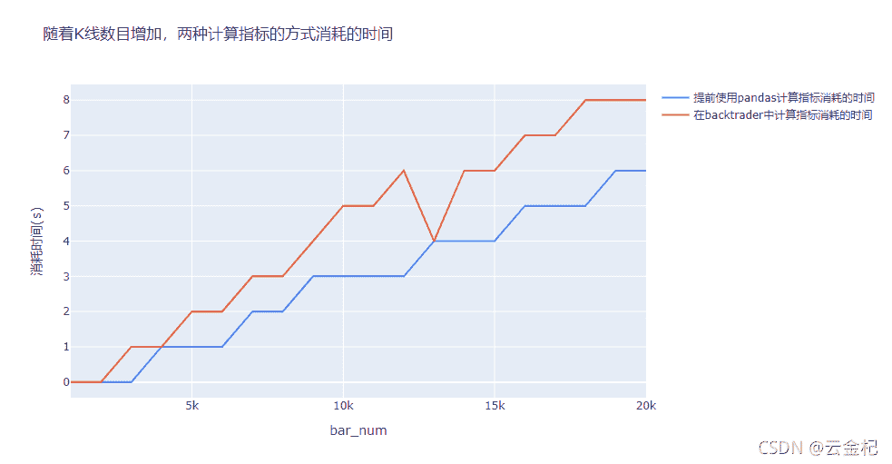

# 【答读者问 25】如何把一个 pandas 计算的指标改造成一个 backtrader 的指标？

> 原文：<https://yunjinqi.blog.csdn.net/article/details/121194176>

[云子量化免费阅读传送链接](https://www.yunjinqi.top/article/54)

在[【答读者问 23】计算指标的时候是直接使用 pandas 计算好指标加载进去速度快，还是在 backtrader 中计算指标速度快？](https://yunjinqi.blog.csdn.net/article/details/121068157)经过一个简单的测试，发现在 pandas 中计算指标然后加载开高低收等数据及指标值到 backtrader 中和在 backtrader 直接计算指标，如果都是用向量的方法，速度是差不多的。今天正好有读者咨询，如果把 pandas 中计算好的指标改造成 backtrader 的指标，本篇文章就做一个示范。在开始之前，backtrader 的教程部分，已经讲解过好几篇关于 backtrader 技术指标的相关问题，以下文章供参考：

[47、backtrader 的一些基本概念—技术指标(indicator)的使用教程](https://yunjinqi.blog.csdn.net/article/details/115044810)

[48、backtrader 的一些基本概念----如何创建一个新的技术指标(indicator)-(2021-10-17 更新)](https://yunjinqi.blog.csdn.net/article/details/115057596)

[49、【backtrader 股票策略】如何实现跨周期调用技术指标的策略？](https://yunjinqi.blog.csdn.net/article/details/115185899)

[75 [backtrader 期货策略]十大经典策略-分时均线交叉策略](https://yunjinqi.blog.csdn.net/article/details/121047388)

好了，开始今天的主题~

* * *

问题：有一个 pandas 计算的指标，希望能够转换到 backtrader 中，如何实现呢？pandas 计算的公式主要内容如下：

```py
def get_mtm_atr(df):
	# 对 mtm 计算 atr 指标,在原有数据的基础上，输出增加了一个列，mtm_atr
	col_list = list(df.columns)
    df['mtm_l'] = df['low'] / df['low'].shift(n1) - 1
    df['mtm_h'] = df['high'] / df['high'].shift(n1) - 1
    df['mtm_c'] = df['close'] / df['close'].shift(n1) - 1
    df['mtm_c1'] = df['mtm_h'] - df['mtm_l']
    df['mtm_c2'] = abs(df['mtm_h'] - df['mtm_c'].shift(1))
    df['mtm_c3'] = abs(df['mtm_l'] - df['mtm_c'].shift(1))
    df['mtm_tr'] = df[['mtm_c1', 'mtm_c2', 'mtm_c3']].max(axis=1)
    df['mtm_atr'] = df['mtm_tr'].rolling(window=n1, min_periods=1).mean()
    return df[col_list+['mtm_atr']] 
```

我们继续接着【答读者问 23】的代码，测试一下在 pandas 中实现 mtm_atr 指标与在 backtrader 中实现 mtm_atr 指标。

```py
import numpy as np
import pandas as pd
import random 
import datetime
import backtrader as bt 
import plotly.offline as py
import plotly.graph_objs as go
"""
# 生成一个 1 万，10 万，100 万，1000 万的随机数，保存本地，行程 csv 文件。
# 然后分别使用两种方法读取，计算指标
# 方法一：使用 pandas 读取数据，并计算 mtm_atr 指标，分别保存为两个新的列："mtm_atr"并 adddata 到 cerebro 中，写策略的时候，就不再计算 mtm_atr 指标
# 方法二：读取 csv 文件形成 feed,然后 adddata 到 cerebro 中，然后在策略里面计算 mtm_atr 指标
# 测试在不同的数据量级别下使用的时间
"""
def generate_random_n_bar_df(n):
    start_datetime = datetime.datetime(1990,1,1,9,0,0)
    # bar 的数据和时间都是乱生成的，估计没有那种行情是这种，但是应该是不影响测试结果的可靠性
    result=[[random.randint(100,200),random.randint(100,200),random.randint(100,200),random.randint(100,200),random.randint(100,200),random.randint(100,200)] for i in range(n)]
    result_df = pd.DataFrame(result,columns=['open',"high","low","close","volume","openinterest"])
    result_df.index=pd.to_datetime([start_datetime+datetime.timedelta(seconds=i) for i in list(range(n))])
    return result_df
# 从 1000 到 100 万的 bar 的数目模拟生成
for i in range(1,21):
    n=i*1000
    data = generate_random_n_bar_df(n)
    data.to_csv(f"data_{n}.csv")
    print(f"{n}个 bar 的模拟数据成功保存到工作目录")

# 直接使用 pandas 的方法,非直接使用 backtrader 计算指标
class ExtendPandasFeed(bt.feeds.PandasData):

    params = (
        ('datetime', 0),
        ('open', 1),
        ('high', 2),
        ('low', 3),
        ('close', 4),
        ('volume', 5),
        ('openinterest', 6),
        ("mtm_atr",7),
        )
    lines = ('mtm_atr',)
    datafields = [
        'datetime', 'open', 'high', 'low', 'close', 'volume', 'openinterest',"mtm_atr"
    ]

    def start(self):
        super(ExtendPandasFeed, self).start()

        # reset the iterator on each start
        self._rows = self.p.dataname.itertuples()

    def _load(self):
        try:
            row = next(self._rows)
        except StopIteration:
            return False

        # Set the standard datafields - except for datetime
        # print(self.getlinealiases())
        for datafield in self.getlinealiases():
            if datafield == 'datetime':
                continue

            # get the column index
            colidx = getattr(self.params, datafield)
            # print(datafield,colidx)
            if colidx < 0:
                # column not present -- skip
                continue

            # get the line to be set
            line = getattr(self.lines, datafield)
            # print(colidx)
            # indexing for pandas: 1st is colum, then row
            line[0] = row[colidx]

        # datetime
        colidx = getattr(self.params, 'datetime')
        tstamp = row[colidx]

        # convert to float via datetime and store it
        dt = pd.to_datetime(tstamp)
        dtnum = bt.date2num(dt)

        # get the line to be set
        line = getattr(self.lines, 'datetime')
        line[0] = dtnum

        # Done ... return
        return True

class NotDirectStrategy(bt.Strategy):

    # params = (('short_window',10),('long_window',60))
    params = {"n1":20}

    def log(self, txt, dt=None):
        ''' log 信息的功能'''
        dt = dt or bt.num2date(self.datas[0].datetime[0])
        print('%s, %s' % (dt.isoformat(), txt))

    def __init__(self):
        # 一般用于计算指标或者预先加载数据，定义变量使用
        pass

    def next(self):
        # Simply log the closing price of the series from the reference
        # self.log(f"工商银行,{self.datas[0].datetime.date(0)},收盘价为：{self.datas[0].close[0]}")
        # self.log(f"short_ma:{self.short_ma[0]},long_ma:{self.long_ma[0]}")
        # 得到当前的 size
        data = self.datas[0]
        self.log(f"close:{data.close[0]},mtm_atr:{data.mtm_atr[0]}")

#     def notify_order(self, order):
#         if order.status in [order.Submitted, order.Accepted]:
#             # order 被提交和接受
#             return
#         if order.status == order.Rejected:
#             self.log(f"order is rejected : order_ref:{order.ref}  order_info:{order.info}")
#         if order.status == order.Margin:
#             self.log(f"order need more margin : order_ref:{order.ref}  order_info:{order.info}")
#         if order.status == order.Cancelled:
#             self.log(f"order is concelled : order_ref:{order.ref}  order_info:{order.info}")
#         if order.status == order.Partial:
#             self.log(f"order is partial : order_ref:{order.ref}  order_info:{order.info}")
#         # Check if an order has been completed
#         # Attention: broker could reject order if not enougth cash
#         if order.status == order.Completed:
#             if order.isbuy():
#                 self.log("buy result : buy_price : {} , buy_cost : {} , commission : {}".format(
#                             order.executed.price,order.executed.value,order.executed.comm))

#             else:  # Sell
#                 self.log("sell result : sell_price : {} , sell_cost : {} , commission : {}".format(
#                             order.executed.price,order.executed.value,order.executed.comm))

#     def notify_trade(self, trade):
#         # 一个 trade 结束的时候输出信息
#         if trade.isclosed:
#             self.log('closed symbol is : {} , total_profit : {} , net_profit : {}' .format(
#                             trade.getdataname(),trade.pnl, trade.pnlcomm))
#         if trade.isopen:
#             self.log('open symbol is : {} , price : {} ' .format(
#                             trade.getdataname(),trade.price))

def get_mtm_atr(df,n1):
    # 对 mtm 计算 atr 指标,在原有数据的基础上，输出增加了一个列，mtm_atr
    col_list = list(df.columns)
    df['mtm_l'] = df['low'] / df['low'].shift(n1) - 1
    df['mtm_h'] = df['high'] / df['high'].shift(n1) - 1
    df['mtm_c'] = df['close'] / df['close'].shift(n1) - 1
    df['mtm_c1'] = df['mtm_h'] - df['mtm_l']
    df['mtm_c2'] = abs(df['mtm_h'] - df['mtm_c'].shift(1))
    df['mtm_c3'] = abs(df['mtm_l'] - df['mtm_c'].shift(1))
    df['mtm_tr'] = df[['mtm_c1', 'mtm_c2', 'mtm_c3']].max(axis=1)
    df['mtm_atr'] = df['mtm_tr'].rolling(n1,min_periods=1).mean()
    # df = df.dropna()
    # print(df[df.index>=pd.to_datetime("1990-01-01 09:00:19")])
    return df[col_list+['mtm_atr']]

def run_not_direct_data(n):
    data_name = f"data_{n}.csv"  
    df = pd.read_csv(data_name,index_col=0)
    df.index = pd.to_datetime(df.index)
    # 计算指标
    df = get_mtm_atr(df,20)
    # print(df)
    datetime_list = list(df.index)
    # 添加 cerebro
    cerebro = bt.Cerebro()
    # 添加策略
    cerebro.addstrategy(NotDirectStrategy)
    # 准备数据 
    params = dict(
                    fromdate = datetime_list[0],
                    todate = datetime_list[-1],
                    timeframe = bt.TimeFrame.Minutes,
                    compression = 1,

                    )

    feed =  ExtendPandasFeed(dataname=df,**params)
    # 添加合约数据
    cerebro.adddata(feed, name = "xxx")
    cerebro.broker.setcommission(commission=0.0005)

    # 添加资金
    cerebro.broker.setcash(100000.0)

    # 开始运行
    cerebro.run()

run_not_direct_data(1000) 

# 直接加载数据到 backtrader 中，然后计算相应的指标，由于 backtrader 自带的指标库中没有 mtm_atr 指标，所以，需要我们自建一个指标
class MtmAtr(bt.Indicator):
    # 需要在 lines 里面声明指标带的名称,line 的名称，可以使用 self.lines.xxx 或者 self.l.xxx 或者甚至使用 self.xxx
    lines = ('mtm_atr','mtm_tr')
    # 可能需要的参数值，可以不需要
    params = (("n1",20),)
    # 可以在 init 里面计算相应的逻辑，能够在 init 实现，就可以只使用 init,如果在 init 里面不能够完全实现，那么，就可以考虑使用 next 和 once
    # 另外，如果想要避免因为数据不足导致计算指标不准，希望等到数据充足之后在计算，可以增加一个 self.addminperiod
    def __init__(self):
        self.addminperiod(self.p.n1-1)
        # 保存今日的价格
        pre_low = self.data.low(-1*self.p.n1)
        pre_high = self.data.high(-1*self.p.n1)
        pre_close = self.data.close(-1*self.p.n1)
        self.mtm_l = self.data.low/pre_low - 1
        self.mtm_h = self.data.high/pre_high - 1
        self.mtm_c = self.data.close/pre_close -1

        # self.mtm_tr = bt.Max(mtm_c1,mtm_c2,mtm_c3)
        # 向量法计算会忽略一部分 pandas 计算的时候时间不够就开始计算平均值的问题，min_periods,和原先的 pandas 计算相比，
        # 忽略了一部分数据，直到全部数据够平均才会开始计算
        # self.lines.mtm_atr = bt.indicators.SMA(self.mtm_tr,period = self.p.n1)
        # 保存 mtm_tr 不为 0 的 bar 的根数
        self.mtm_tr_bar_num = None
    def next(self):
        # 在 next 中计算的时候，在数据不够的时候，如果求最大值，bt.Max 需要三个值都存在了，才不会是 nan,
        # df.max(axis=1)只要有一列不为 nan，就会出现不为 nan 的值，这导致了如果使用 bt.Max 会和原先 pandas 计算的结果不一样
        # 所以，mtm_c1,mtm_c2,mtm_c3,mtm_atr 也需要在向量中计算
        # 下面的方法可以和 pandas 计算的结果一致。
        # 不太建议使用这种方法去实现，更好的方法是用上面的向量法
        try:
            mtm_c1 = self.mtm_h[0] - self.mtm_l[0]
        except:
            mtm_c1=-np.inf
        try:
            mtm_c2 = abs(self.mtm_h[0] - self.mtm_c[-1])
        except:
            mtm_c2=-np.inf
        try:
            mtm_c3 = abs(self.mtm_l[0]-self.mtm_c[-1])
        except:
            mtm_c3=-np.inf
        if mtm_c1!= -np.inf or mtm_c2!= -np.inf or mtm_c3!= -np.inf:
            mtm_tr_value = self.mtm_tr[0] = max(mtm_c1,mtm_c2,mtm_c3)
        else:
            mtm_tr_value = np.NaN
        if self.mtm_tr_bar_num is not None:
            self.mtm_tr_bar_num+=1
        if self.mtm_tr_bar_num is None and not np.isnan(mtm_tr_value):
            self.mtm_tr_bar_num = 1
        # print(bt.num2date(self.data.datetime[0]),mtm_tr_value,self.mtm_tr_bar_num)
        if self.mtm_tr_bar_num>=self.p.n1:
            self.lines.mtm_atr[0]=sum(self.mtm_tr.get(size = self.p.n1))/self.p.n1
        if self.mtm_tr_bar_num>0 and self.mtm_tr_bar_num<self.p.n1:
            self.lines.mtm_atr[0]=sum(self.mtm_tr.get(size = self.mtm_tr_bar_num))/ self.mtm_tr_bar_num

class DirectStrategy(bt.Strategy):

    # params = (('short_window',10),('long_window',60))
    params = {"n1":20}

    def log(self, txt, dt=None):
        ''' log 信息的功能'''
        dt = dt or bt.num2date(self.datas[0].datetime[0])
        print('%s, %s' % (dt.isoformat(), txt))

    def __init__(self):
        # 一般用于计算指标或者预先加载数据，定义变量使用
        self.mtm_atr = MtmAtr(self.datas[0],n1 = self.p.n1)

    def next(self):
        # Simply log the closing price of the series from the reference
        # self.log(f"工商银行,{self.datas[0].datetime.date(0)},收盘价为：{self.datas[0].close[0]}")
        # self.log(f"short_ma:{self.short_ma[0]},long_ma:{self.long_ma[0]}")
        # 得到当前的 size
        data = self.datas[0]
        self.log(f"close:{data.close[0]},mtm_atr:{self.mtm_atr[0]}")

#     def notify_order(self, order):
#         if order.status in [order.Submitted, order.Accepted]:
#             # order 被提交和接受
#             return
#         if order.status == order.Rejected:
#             self.log(f"order is rejected : order_ref:{order.ref}  order_info:{order.info}")
#         if order.status == order.Margin:
#             self.log(f"order need more margin : order_ref:{order.ref}  order_info:{order.info}")
#         if order.status == order.Cancelled:
#             self.log(f"order is concelled : order_ref:{order.ref}  order_info:{order.info}")
#         if order.status == order.Partial:
#             self.log(f"order is partial : order_ref:{order.ref}  order_info:{order.info}")
#         # Check if an order has been completed
#         # Attention: broker could reject order if not enougth cash
#         if order.status == order.Completed:
#             if order.isbuy():
#                 self.log("buy result : buy_price : {} , buy_cost : {} , commission : {}".format(
#                             order.executed.price,order.executed.value,order.executed.comm))

#             else:  # Sell
#                 self.log("sell result : sell_price : {} , sell_cost : {} , commission : {}".format(
#                             order.executed.price,order.executed.value,order.executed.comm))

#     def notify_trade(self, trade):
#         # 一个 trade 结束的时候输出信息
#         if trade.isclosed:
#             self.log('closed symbol is : {} , total_profit : {} , net_profit : {}' .format(
#                             trade.getdataname(),trade.pnl, trade.pnlcomm))
#         if trade.isopen:
#             self.log('open symbol is : {} , price : {} ' .format(
#                             trade.getdataname(),trade.price))

def run_direct_data(n):
    data_name = f"data_{n}.csv"  
    df = pd.read_csv(data_name,index_col=0)
    df.index = pd.to_datetime(df.index)

    datetime_list = list(df.index)
    # 添加 cerebro
    cerebro = bt.Cerebro()
    # 添加策略
    cerebro.addstrategy(DirectStrategy)
    # 准备数据 
    params = dict(
                    fromdate = datetime_list[0],
                    todate = datetime_list[-1],
                    timeframe = bt.TimeFrame.Minutes,
                    compression = 1,
                    dtformat=('%Y-%m-%d %H:%M:%S'), # 日期和时间格式
                    tmformat=('%H:%M:%S'), # 时间格式
                    )

    feed =  bt.feeds.PandasDirectData(dataname=df,**params)
    # 添加合约数据
    cerebro.adddata(feed, name = "xxx")
    cerebro.broker.setcommission(commission=0.0005)

    # 添加资金
    cerebro.broker.setcash(100000.0)

    # 开始运行
    cerebro.run()

run_direct_data(1000)

# 测试运行时间
direct_time_list =[]
not_direct_time_list =[]
bar_num_list =[]
for i in range(1,21):
    bar_num=i*1000
    begin_time = datetime.datetime.now()
    run_direct_data(bar_num)
    end_time = datetime.datetime.now()
    consume_time = (end_time-begin_time).seconds
    direct_time_list.append(consume_time)
    begin_time = datetime.datetime.now()
    run_not_direct_data(bar_num)
    end_time = datetime.datetime.now()
    consume_time = (end_time-begin_time).seconds
    not_direct_time_list.append(consume_time)
    bar_num_list.append(bar_num)

# 画图
data = [

    go.Scatter(
        x=bar_num_list,
        y=not_direct_time_list,
        name = '提前使用 pandas 计算指标消耗的时间'
    ),
     go.Scatter(
        x=bar_num_list,
        y=direct_time_list,
        name = '在 backtrader 中计算指标消耗的时间'
    )
]

layout = go.Layout(
    title = '随着 K 线数目增加，两种计算指标的方式消耗的时间'
)

fig = go.Figure(data = data)
# 步骤四
fig.update_layout(
  title= '随着 K 线数目增加，两种计算指标的方式消耗的时间',
  xaxis_title="bar_num",
  yaxis_title="消耗时间(s)",
  # xaxis = {"type":"log"}
)
fig.show() 
```



意料之中的 backtrader 会跑输，毕竟在 next 中计算了好多的东西，降低了速度。