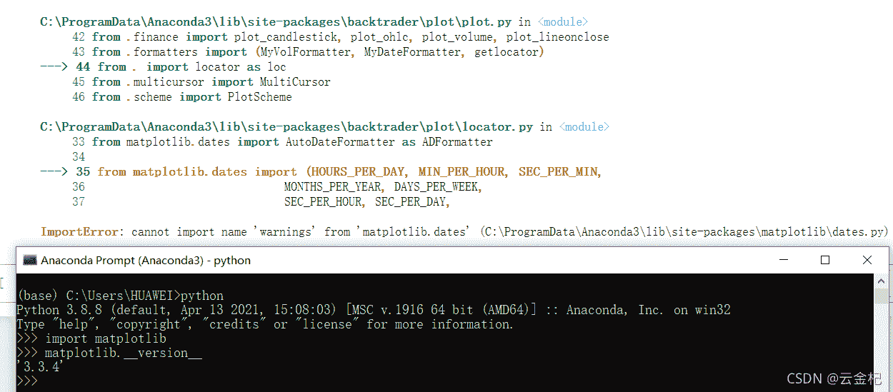
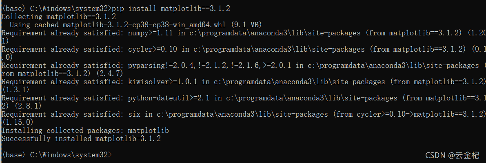

# 【答读者问 27】backtrader 不支持最新版本的 matplotlib 怎么办以及 backtrader 画图的解决方案

> 原文：<https://yunjinqi.blog.csdn.net/article/details/121412412>

[云子量化免费阅读传送链接](https://www.yunjinqi.top/article/12)

backtrader 的版本由于相对比较完善了，所以最近更新的比较慢，这就导致了一个问题，如果依赖的模块进行更新了，就可能导致 backtrader 的某些功能不可用，即版本兼容问题。比如，当使用最新版本的 matplotlib 的时候，在 backtrader 中，使用 cerebro.plot()进行画图会保持，出现兼容问题，如果把 matplotlib 的版本进行倒退到 3.1.2,就可以使用了。



### 简单点的解决方式

直接尝试把 matplotlib 的版本倒退到 3.1.2



这种向后兼容的方式是不合理的，但是可以作为权宜之计，暂时使用。比较合理的方式是修改 backtrader 的源码，使得 backtrader 能够使用最新版的 matplotlib。

### 尝试从 backtrader 上进行修改

直接在 backtrader.plot.locator 上进行修改，把从 matplotlib.dates 中引用的 warnings 换成直接引用就好了。如下所示

```py
import datetime

from matplotlib.dates import AutoDateLocator as ADLocator
from matplotlib.dates import RRuleLocator as RRLocator
from matplotlib.dates import AutoDateFormatter as ADFormatter

from matplotlib.dates import (HOURS_PER_DAY, MIN_PER_HOUR, SEC_PER_MIN,
                              MONTHS_PER_YEAR, DAYS_PER_WEEK,
                              SEC_PER_HOUR, SEC_PER_DAY,
                              num2date, rrulewrapper, YearLocator,
                              # MicrosecondLocator, warnings)
                              MicrosecondLocator)
import warnings 
from dateutil.relativedelta import relativedelta
import numpy as np 
```

修改完这两行代码之后，就可以直接使用最新版的 matplotlib 了，目前使用的是 3.5.0 版本，没有报错。

### 谈一谈 backtrader 画图的替代方案

这个世界上不存在真正完美的东西。作为一个量化投资框架，使用 matplotlib 进行画图分析，确实有些丢面子，因为好多好用的功能，在 matplotlib 上实现起来特别难，所以，建议考虑其他的数据展示方案。

为了解决这个问题，很多人也进行过尝试，其中一个比较好的方案是 backtrader_plotting,使用画图工具 bokeh,对相关数据进行形象化展示，但是最近应该很长时间没有维护了，使用起来是有 bug 的。如果您想要使用 bokeh 作为您数据分析的工具，可以考虑在这个包的基础上改一改 bug，然后使用，避免重复造轮子。

#### 画图工具

当时想要形象化展示 backtrader 的回测结果的时候，bokeh 是一个备选方案，还有 pyechart,这个也是非常有名的画图工具；另外一个备选方案是 plotly 和 dash,最终的选择是使用了 plotly 和 dash 作为画图工具和数据分析展示工具，在公司开发了一个 backtrader 的回测结果分析小脚本，暂时不太好开源。

这三个工具的优劣，不太好说。看起来，plotly 和 dash 更贴近金融一些，所以选择的是这个。

#### 前后端框架形成网页

使用简单的画图工具，有时候可能过于简略了，不能完全满足我们的需要，可以考虑使用一些前端框架和后端框架，做一套比较精美的数据分析、回测结果分析的网页。前端一般使用 html、css、vue,后端一般使用 flask、fastapi、django 等。

#### 客户端界面

也有一些模块支持创建图形化界面，比如 python 的 thinker，但是考虑下性能，还是不建议了。可以考虑 QT，比如 pyqt6(号称最强大的客户端界面)，做成类似于 vnpy 的那种界面。

使用画图工具仅仅是权宜之计，可以考虑后两种方案，相对来说，使用起来会比较舒服。但是，任何事情都有两面性，使用起来舒服的东西，开发出来一般需要更多的时间和精力。

后期我可能会用 flask 写一个集历史数据分析、回测结果分析的小模块，作为 backtrader 的补充。前面已经实现了一个简单的用 flask 展示 pyfolio 回测结果的小脚本，后续会进一步完善改进。