# 【答读者问 37】如何使用 pyfolio 对比基准收益率和策略收益率？(2022-08-21 修改)

> 原文：<https://yunjinqi.blog.csdn.net/article/details/122012247>

[云子量化免费阅读传送链接](https://www.yunjinqi.top/article/65)

前两天有读者咨询，如何使用 pyfolio 对比策略的收益与基准收益？其实很简单，直接拷贝原先的 pyfolio 包就可以使用，但是实现的时候有一些需要注意的地方，基准收益率和策略的收益率序列，两个的时间一定是要一致的，需要一一对齐，所以，最好放到一个 dataframe 中，一列表示基准收益率，一列表示策略的收益率。

另外，原先的 backtrader_cn 包结合了 backtrader 和 pyfolio 包两个，管理起来比较麻烦，尝试把两个进行分开，分别建一个包，这样方便大家直接安装使用。

本文先介绍 pyfolio 如何对比策略的收益率和基准的收益率，然后提供优化后的 baktrader 版本和 pyfolio 版本。

*   2022-08-21 更改了回撤开始日期、结束日期和恢复日期的算法

##### 效果展示

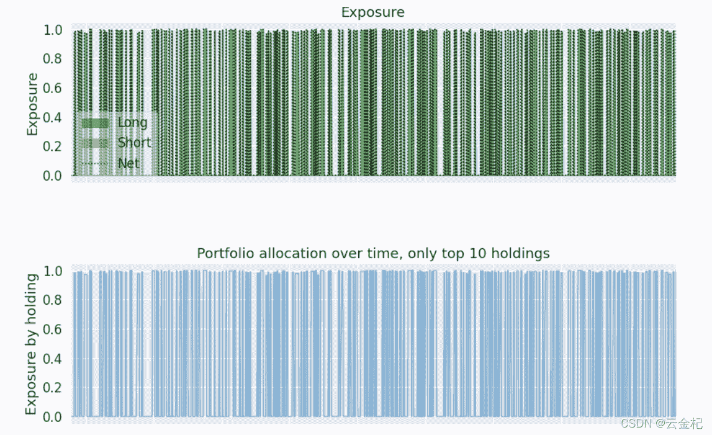
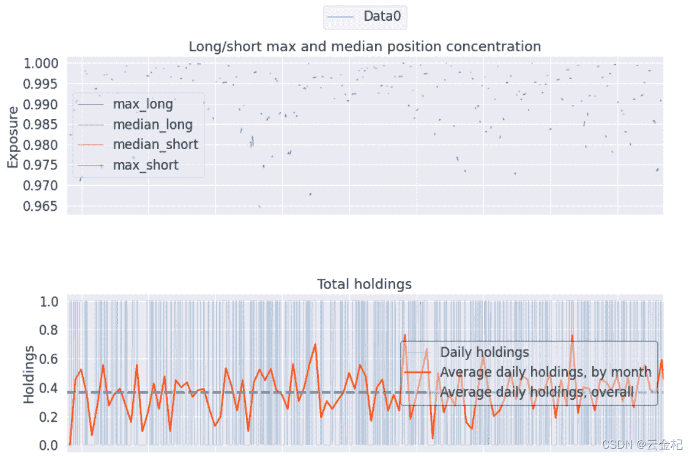
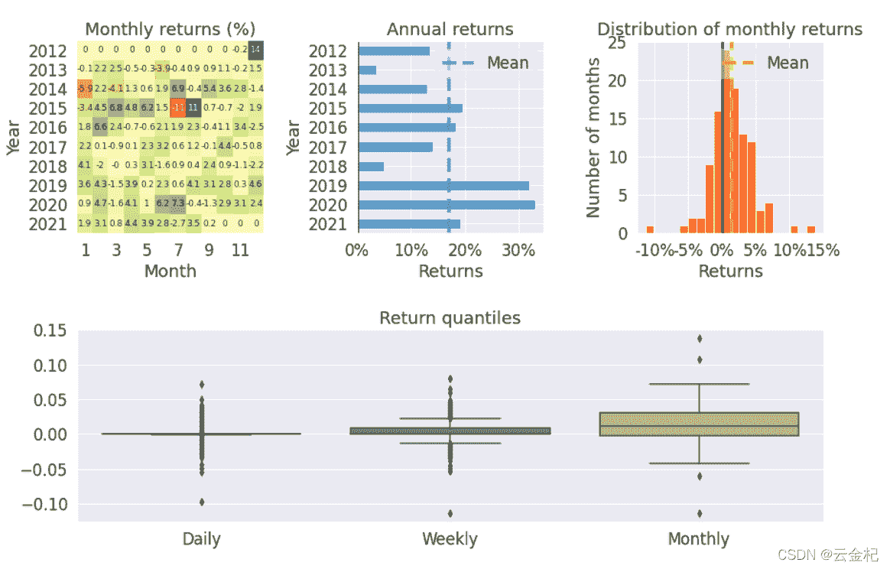
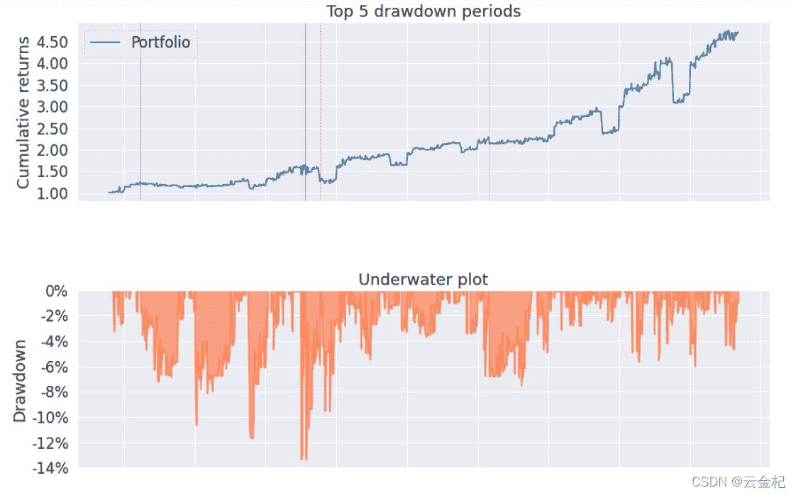
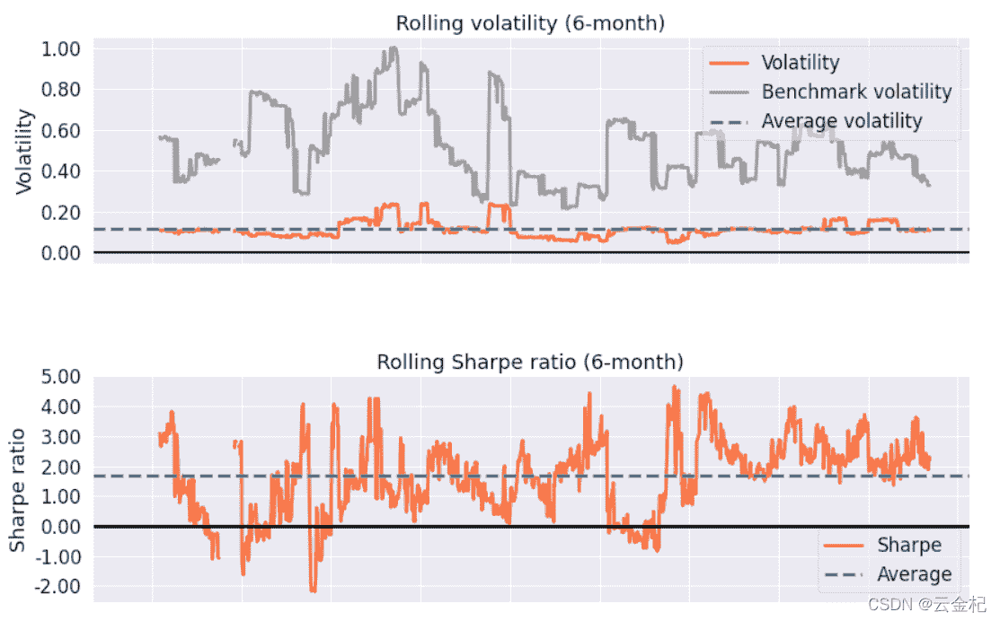
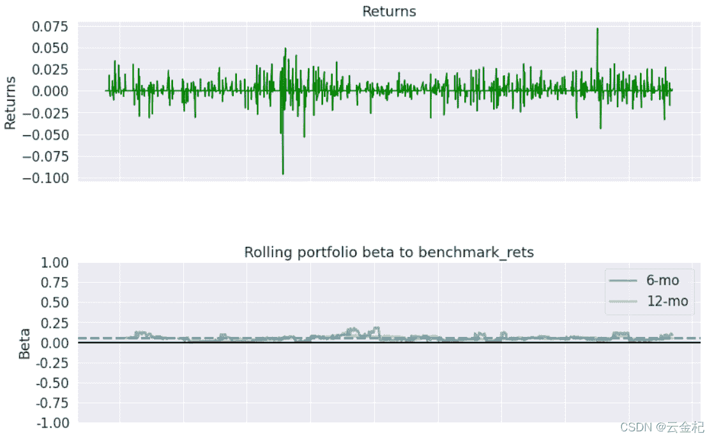
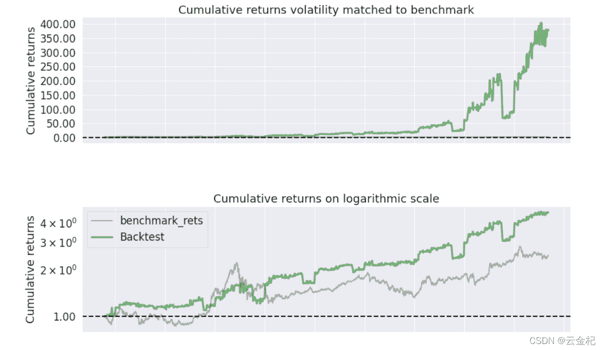
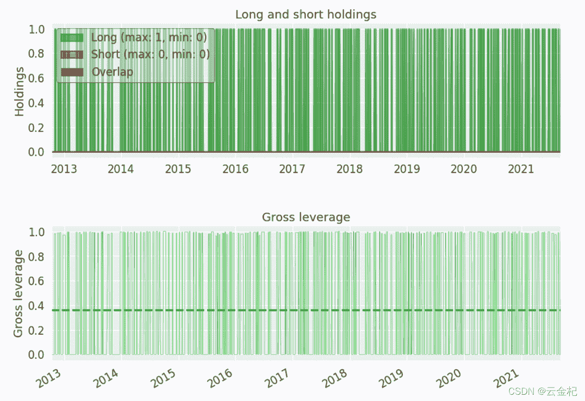
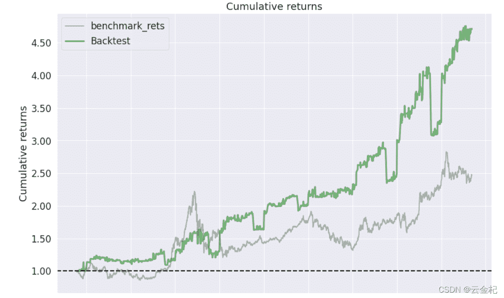
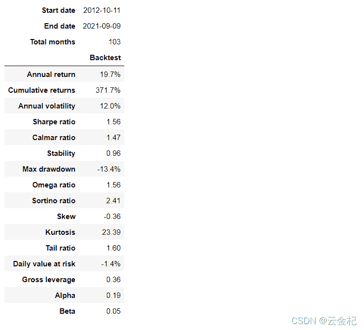
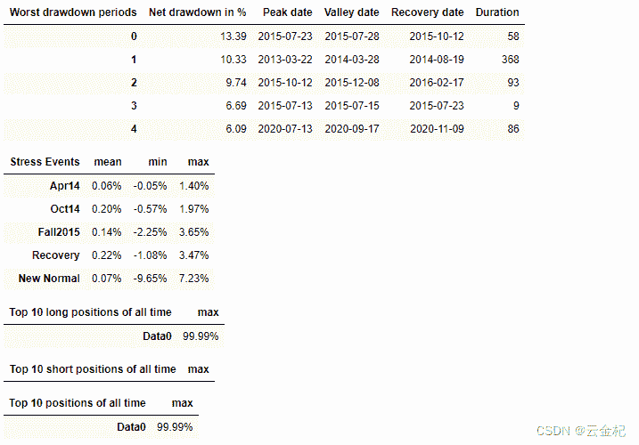

#### 数据

可以直接在新的 pyfolio 模块的 datas 下载获得。

#### 测试代码

```py
import pandas as pd
import pyfolio as pf
import os
import warnings
warnings.filterwarnings("ignore")
# 加载数据
pf_path = os.path.dirname(pf.__file__)
df = pd.read_csv(pf_path+"/datas/基准收益率和日收益率序列.csv",index_col = 0)
df.index = pd.to_datetime(df.index)
positions = pd.read_csv(pf_path+"/datas/positions.csv",index_col = 0)
positions.index = pd.to_datetime(positions.index)
pf.create_full_tear_sheet(df['returns'],benchmark_rets=df['benchmark_rets'],positions= positions) 
```

#### pyfolio 包的安装地址

这个 pyfolio 包是我部分修改之后的哈，不是原版的，修改了部分的 bug。pyfolio 模块地址：

https://gitee.com/yunjinqi/pyfolio