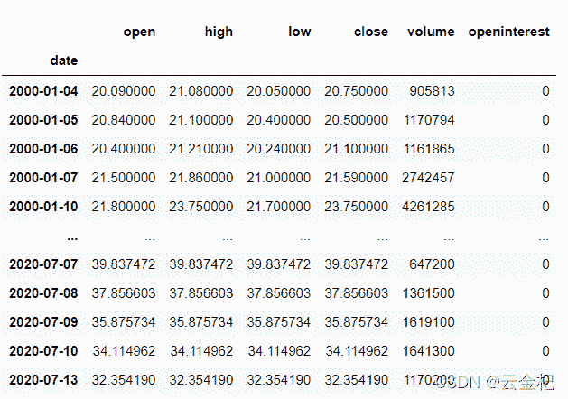
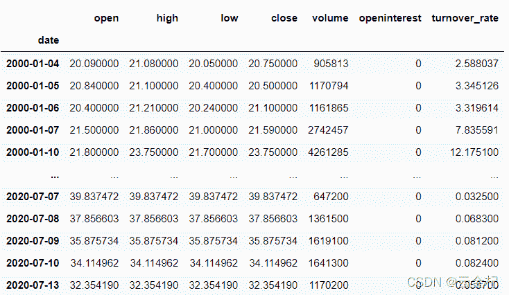

# 【答读者问 45】谈一谈扩展 backtrader 中用于回测数据的列的问题(入门级别难度)

> 原文：<https://yunjinqi.blog.csdn.net/article/details/123190576>

[云子量化免费阅读传送链接](https://www.yunjinqi.top/article/95)

今天有读者咨询这个问题，其实在前面的文章中已经讲过这个问题了，发给他了相关文章，还是没能解决，可能是我写的不够详细，在这篇文章中，尝试出一个入门级别的解决方案。

[【答读者问 23】计算指标的时候是直接使用 pandas 计算好指标加载进去速度快，还是在 backtrader 中计算指标速度快？（2021-11-17 更新，修复 pandas 增加列添加问题)](https://blog.csdn.net/qq_26948675/article/details/121068157?utm_source=app&app_version=5.0.1&code=app_1562916241&uLinkId=usr1mkqgl919blen)

[10、backtrader 的一些基本概念—feed 讲解(2)—如何增加新的数据及一个基于 pe-pb 的小策略](https://yunjinqi.blog.csdn.net/article/details/108991405)

学习 python 的读者，应该很快就会对 pandas 进行操作了。正常的 backtrader 接收的 pandas 的数据结构大概是这个样子的：index 是具体的时间格式，如果不确定是不是时间，最好使用
`df.index = pd.to_datetime(df.index)`进行下转换，然后接下来的数据依次是 open,high,low,close,volume,openinterest

正常加载 dataframe 数据到 cerebro 中是这样的：

```py
 data_name = "xxx"
    # df 数据已经在前面生成好了 
    datetime_list = list(df.index)
    # 添加 cerebro
    cerebro = bt.Cerebro()
    # 添加策略
    cerebro.addstrategy(策略类名称)
    # 准备数据 
    params = dict(
                    fromdate = datetime_list[0],
                    todate = datetime_list[-1],
                    )

    feed =  bt.feeds.PandasDirectData(dataname=df,**params)
    # 添加合约数据
    cerebro.adddata(feed, name = data_name)
    # 添加手续费
    cerebro.broker.setcommission(commission=0.0005)
    # 添加资金
    cerebro.broker.setcash(100000.0)
    # 开始运行
    cerebro.run() 
```

但是我们接下来要用到别的数据，比如 turnover_rate 这样的换手率,那么，我们准备的 df 数据就应该考虑做成这样：


使用下面的方法加载数据到 cerebro 中：

```py
class ExtendPandasFeed(bt.feeds.PandasDirectData):
    # 根据需要定制这个列，其中把 turnover_rate 等超出 openinterest 的变量修改为自己想要的变量
    params = (
        ('datetime', 0),
        ('open', 1),
        ('high', 2),
        ('low', 3),
        ('close', 4),
        ('volume', 5),
        ('openinterest', 6),
        ("turnover_rate",7),

        )
    lines = ("turnover_rate",)
    datafields = [
        'datetime', 'open', 'high', 'low', 'close', 'volume', 'openinterest',"turnover_rate"
    ]
    # 形成的 pandas 的数据，index 要是 datetime,然后列一次要为 open，high,low，volume,openinterest,turnover_rate 
```

```py
 data_name = "xxx"
    # df 数据已经在前面生成好了 
    datetime_list = list(df.index)
    # 添加 cerebro
    cerebro = bt.Cerebro()
    # 添加策略
    cerebro.addstrategy(策略类名称)
    # 准备数据        
    params = dict(
                    fromdate = datetime_list[0],
                    todate = datetime_list[-1],
                    )
    # 唯一需要修改的地方就是 feed 的生成，在这里直接使用
    # feed =  bt.feeds.PandasDirectData(dataname=df,**params)
    feed =  ExtendPandasFeed(dataname=data,**params)
    # 添加合约数据
    cerebro.adddata(feed, name = data_name)
    # 添加手续费
    cerebro.broker.setcommission(commission=0.0005)
    # 添加资金
    cerebro.broker.setcash(100000.0)
    # 开始运行
    cerebro.run() 
```

在 strategy 中，可以直接使用`self.datas[0].turnover_rate`访问具体的 turnover_rate 的数据，就跟 open,high,low,close 这些常用的数据一样。