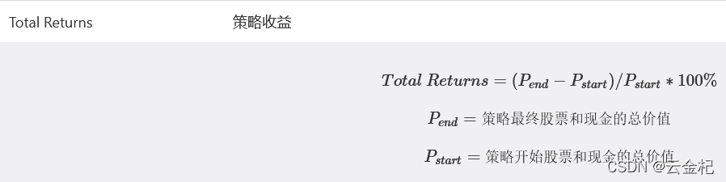
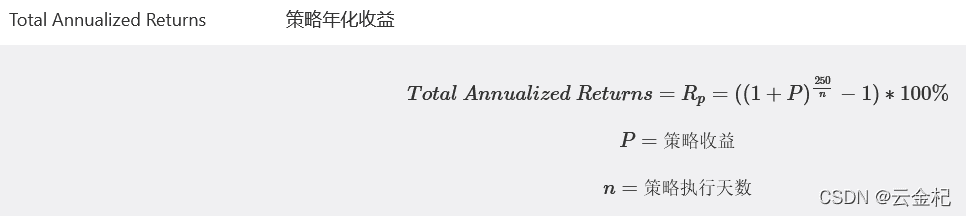
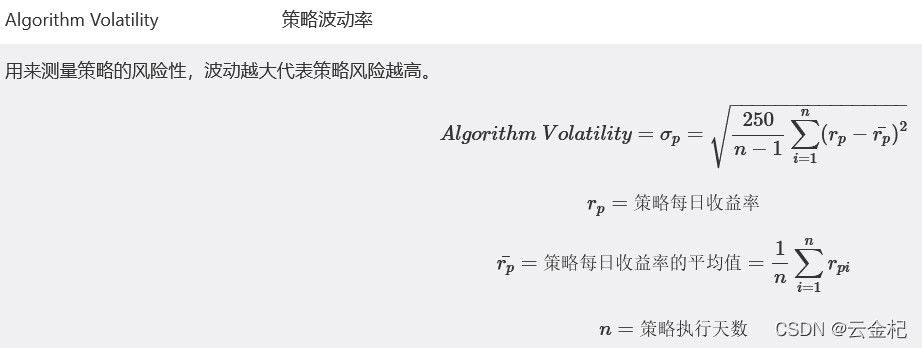
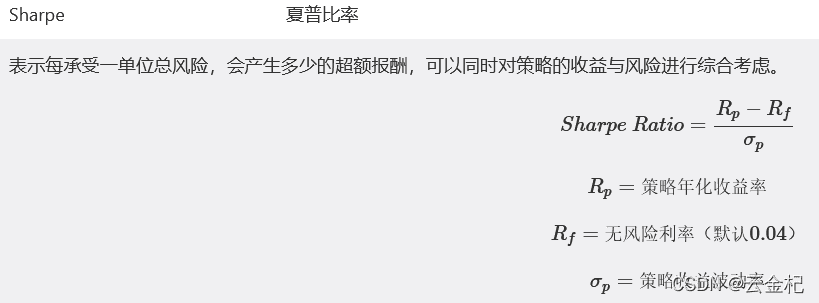

# 【答读者问 46】一场由夏普率引发的乱斗(backtrader，pyfolio 和聚宽都是怎么计算夏普率的？）

> 原文：<https://yunjinqi.blog.csdn.net/article/details/123599239>

[云子量化免费阅读传送链接](https://www.yunjinqi.top/article/96)

在很早之前的文章中，对绩效分析的指标夏普率做过一些简单的探索，对比了不同平台上夏普率的计算方式，这次再次深入探索一下，为啥各个平台的夏普率的结果存在很大差别。这次主要探索 backtrader、pyfolio 和聚宽，对于夏普率如何计算。
[多变的夏普率（一）（2022-03-18 更新)](https://blog.csdn.net/qq_26948675/article/details/80386920)
[使用 Python 计算 omega 指标](https://zhuanlan.zhihu.com/p/136357433)
[omega 指标与 sharpe_ratio 之间的关系](https://zhuanlan.zhihu.com/p/137074288)
[【干货】使用 backtrader 计算 omega 指标](https://zhuanlan.zhihu.com/p/141632467)

#### 聚宽的夏普率计算方式

这是一个读者找到并提供给我的
对于上一篇文章的可转债策略，最后输出了一个每日结束的时候的账户价值，尝试用这个相对比较真实的值按照聚宽的算法计算夏普率。

```py
data = pd.read_csv("/home/yun/backtrader 专栏/77 讲/可转债的测试结果.csv",index_col=0)
# 计算年化收益率
value_list = list(data['value'])
total_return = value_list[-1]/value_list[0]-1
total_annual_return = (1+total_return)**(250/len(data))-1
# 计算收益率
data['rets'] = data['value'].pct_change()
data = data.dropna()
# 计算波动
avg_ret = data['rets'].mean()
ret_std = (sum([(i-avg_ret)**2 for i in data['rets']])*250/len(data))**0.5
jq_sharpe = (total_annual_return - 0.04)/ret_std
print(f"计算出来的聚宽的夏普率为:{jq_sharpe}")
# 计算出来的聚宽的夏普率为:3.2647287122066317 
```

#### backtrader 的夏普率计算方式

backtrader 计算夏普率的方式 写在了文件 sharpe.py 中,在这篇文章[【backtrader 源代码解析 17】sharpe.py 源代码解析(backtrader 计算夏普率的方式)](https://yunjinqi.blog.csdn.net/article/details/123600980)中对 backtrader 夏普率计算的源代码进行了解析，感兴趣可以参考下。
本文尝试脱离 backtrader 的环境，直接按照 backtrader 的逻辑计算下夏普率：

```py
# backtrader 夏普率的计算方式
# 先把年化的无风险收益率降级到每日的无风险收益率，然后计算每日的超额收益率，计算每日超额收益率的平均值和标准差，
# 用平均值除以标准差就计算得到日夏普率,然后转化成年夏普率
day_risk_free_rate = (1+0.04)**(1/250)-1
data['day_excess_rate'] = data['rets']-day_risk_free_rate
avg_day_excess_rate = data['day_excess_rate'].mean()
std_day_excess_rate = data['day_excess_rate'].std()
day_sharpe = avg_day_excess_rate/std_day_excess_rate
year_sharpe = day_sharpe*250**0.5
print(f"按照 backtrader 的方法计算出来的夏普率为:{year_sharpe}")
# 按照 backtrader 的方法计算出来的夏普率为:2.7833366546477807 
```

#### pyfolio 的夏普率计算方式

pyfolio 的夏普率的计算方式是直接调用的 empyrical 的夏普率计算函数，我们直接调用这个函数来计算夏普率，看差别会有多少

```py
import empyrical as ep
from empyrical.periods import DAILY, WEEKLY, MONTHLY, QUARTERLY, YEARLY
sharpe_ratio = ep.sharpe_ratio(data['rets'],
                 risk_free=day_risk_free_rate,
                 period=DAILY,
                 annualization=None)
print(f"pyfolio 计算的夏普率为:{sharpe_ratio}")  
# pyfolio 计算的夏普率为:2.794447823197053 
```

#### 总结

相对情况下，聚宽计算的夏普率比较虚高一些，backtrader 和 pyfolio 计算的夏普率比较接近。下一篇来点好玩的，尝试用蒙特卡洛模拟的思想，看看哪种方式计算的夏普率更稳定一些。