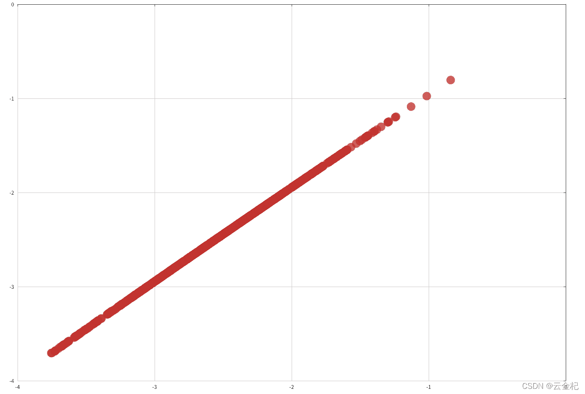
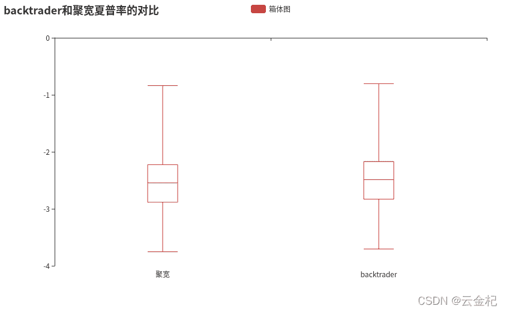

# 【答读者问 47】一场由夏普率引发的乱斗(backtrader 和 joinquant 计算夏普率的方式哪一种更稳定？）

> 原文：<https://yunjinqi.blog.csdn.net/article/details/123601611>

[云子量化免费阅读传送链接](https://www.yunjinqi.top/article/97)

接着上一篇文章[【答读者问 46】一场由夏普率引发的乱斗(backtrader，pyfolio 和聚宽都是怎么计算夏普率的？）](https://yunjinqi.blog.csdn.net/article/details/123599239)，本文尝试用蒙特卡洛模拟的思想，模拟 1000 次，随机生成 1000 个交易日的收益率序列，然后按照 backtrader 和聚宽计算夏普率的方式计算出结果，并分别画出一一对应的散点图，箱体图。

#### 测试代码

```py
import numpy as np
from functools import reduce
from operator import mul
import pyecharts.options as opts
from pyecharts.charts import Scatter,Boxplot
def cal_sharpe(days):
    n = days
    # 生成 n 个收益率序列
    rate_arr=np.random.randn(n)/1000
    value_arr = rate_arr+1
    end_value = reduce(mul,value_arr)
    total_return = end_value - 1
    total_annual_return = (1+total_return)**(250/n)-1
    avg_ret = np.mean(rate_arr)
    ret_std = (sum([(i-avg_ret)**2 for i in rate_arr])*250/(n-1))**0.5
    jq_sharpe = (total_annual_return - 0.04)/ret_std

    day_risk_free_rate = (1+0.04)**(1/250)-1
    day_excess_rate_arr = rate_arr-day_risk_free_rate
    avg_day_excess_rate = np.mean(day_excess_rate_arr)
    std_day_excess_rate = np.std(day_excess_rate_arr)
    day_sharpe = avg_day_excess_rate/std_day_excess_rate
    bt_year_sharpe = day_sharpe*250**0.5
    return [jq_sharpe,bt_year_sharpe]

def plot_results(days=1000,times=1000):
    # times 是模拟的次数
    # days 是生成的日收益率的序列
    results= []
    for i in range(times):
        results.append(cal_sharpe(days))
    # 对于计算的夏普率，按照聚宽的结果从小到大进行排列
    sorted_results = sorted(results,key=lambda x:x[0])
    # 使用 pyecharts 进行画图
    x_data = [d[0] for d in sorted_results]
    y_data = [d[1] for d in sorted_results]

    (
        Scatter(init_opts=opts.InitOpts(width="1600px", height="1000px"))
        .add_xaxis(xaxis_data=x_data)
        .add_yaxis(
            series_name="",
            y_axis=y_data,
            symbol_size=20,
            label_opts=opts.LabelOpts(is_show=False),
        )
        .set_series_opts()
        .set_global_opts(
            xaxis_opts=opts.AxisOpts(
                type_="value", splitline_opts=opts.SplitLineOpts(is_show=True)
            ),
            yaxis_opts=opts.AxisOpts(
                type_="value",
                axistick_opts=opts.AxisTickOpts(is_show=True),
                splitline_opts=opts.SplitLineOpts(is_show=True),
            ),
            tooltip_opts=opts.TooltipOpts(is_show=False),
        )
        .render(f"模拟{times}次随机生成{days}天的收益率序列时 backtrader 和聚宽夏普率的散点图对比.html")
    )

    print(x_data[-10:])
    print(y_data[-10:])
    c = Boxplot()
    c.add_xaxis(["聚宽", "backtrader"])
    c.add_yaxis("",c.prepare_data([x_data,y_data]))
    c.set_global_opts(title_opts=opts.TitleOpts(title="backtrader 和聚宽夏普率的对比"))
    c.render(f"模拟{times}次随机生成{days}天的收益率序列时 backtrader 和聚宽夏普率的箱体图对比.html")

plot_results(days=1000,times=1000) 
```

#### 散点图

#### 箱体图
#### 结论

从散点图和箱体图来看，两家计算的夏普率都有很高的一致性，夏普率的核心作用主要用于衡量承担了一单位的风险可以带来多少超额收益，在不同资产之间对比的时候，使用任意一个算法去计算夏普率都是可以的。