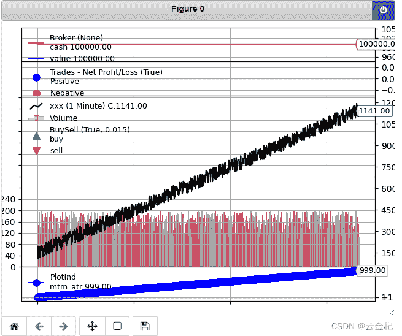

# 【答读者问 48】backtrader 如何画出来一些其他列的数据，比如 PB、PE 等财务数据

> 原文：<https://yunjinqi.blog.csdn.net/article/details/124561495>

今天有读者读到文章：[backtrader 的一些基本概念—feed 讲解(2)—如何增加新的数据及一个基于 pe-pb 的小策略](https://yunjinqi.blog.csdn.net/article/details/108991405)，想要使用 cerebro.plot 的时候，能够显示出来 PE、PB 等数据，并且希望能够画出来 pandas 计算的指标能够在幅图中显示。

其实，在以前的文章中，已经在各方面做过分享，可能大家还没能够灵活运用这些知识，我就结合前面的一些知识，看一看怎么实现这个需求。

参考下面的文章：

[48、backtrader 的一些基本概念----如何创建一个新的技术指标(indicator)-(2021-10-17 更新)](https://yunjinqi.blog.csdn.net/article/details/115057596)

[53、backtrader 的一些基本概念—如何用 backtrader 画图？](https://yunjinqi.blog.csdn.net/article/details/115279045)

[【答读者问 25】如何把一个 pandas 计算的指标改造成一个 backtrader 的指标？](https://yunjinqi.blog.csdn.net/article/details/121194176)

#### 实现的思路

我们可以很容易的通过 pandas 增加数据的列并让 backtrader 读取调用，也可以通过扩展的 csv feed 让 backtrader 读取调用，但是仅仅是数据的扩展，并不能导致在画图的时候显示具体的数据。

一种方法是去修改具体的源代码，另一种择中的方法就是创建一个具体的指标，使得这个指标的值等于想要画出来的值。

#### 代码

具体的使用，在代码里面进行解释，可以简单看一下代码。

```py
import numpy as np
import pandas as pd
import random 
import datetime
import backtrader as bt 

"""
# 生成一个 1 万，10 万，100 万，1000 万的随机数，保存本地，行程 csv 文件。
# 然后分别使用两种方法读取，计算指标
# 方法一：使用 pandas 读取数据，并计算 mtm_atr 指标，分别保存为两个新的列："mtm_atr"并 adddata 到 cerebro 中，写策略的时候，就不再计算 mtm_atr 指标
# 方法二：读取 csv 文件形成 feed,然后 adddata 到 cerebro 中，然后在策略里面计算 mtm_atr 指标
# 测试在不同的数据量级别下使用的时间
"""
# 下面的代码会生成一些随机的数据，用于下面策略调用，运行一次就好了

# def generate_random_n_bar_df(n):
#     start_datetime = datetime.datetime(1990,1,1,9,0,0)
#     # bar 的数据和时间都是乱生成的，估计没有那种行情是这种，但是应该是不影响测试结果的可靠性
#     result=[[random.randint(100,200),random.randint(100,200),random.randint(100,200),random.randint(100,200),random.randint(100,200),random.randint(100,200)] for i in range(n)]
#     result_df = pd.DataFrame(result,columns=['open',"high","low","close","volume","openinterest"])
#     result_df['sum'] =range(len(result_df)) 
#     result_df['open'] = result_df['open'] + result_df['sum']
#     result_df['high'] = result_df['high'] + result_df['sum']
#     result_df['low'] = result_df['low'] + result_df['sum']
#     result_df['close'] = result_df['close'] + result_df['sum']
#     result_df.index=pd.to_datetime([start_datetime+datetime.timedelta(seconds=i) for i in list(range(n))])
#     return result_df
# # 从 1000 到 100 万的 bar 的数目模拟生成
# for i in range(1,21):
#     n=i*1000
#     data = generate_random_n_bar_df(n)
#     data.to_csv(f"data_{n}.csv")
#     print(f"{n}个 bar 的模拟数据成功保存到工作目录")

# 创建一个技术指标，用于控制画图，这个指标和想要画出的数据的值要一样，比如想要画出 PB 的值，就让指标输出的值等于 PB 的值，可以根据这些参数设置想要实现的功能
class PlotInd(bt.Indicator):
    lines = ('mtm_atr_0',)
    # 可能需要的参数值，可以不需要
    plotinfo = dict(
        plot = True, # 是否显示这个指标值，True 的时候显示，False 的时候不显示
        subplot = True,# 是否把指标显示到另一个窗口，True 是显示到另一个窗口，False 是显示在主图
        plotname = "",# 显示 line 的名称，默认是 class.__name__
        plotskip=False,# 旧版本的 matplotlib 上使用，已经移除
        plotabove = False,# 默认情况下，指标是在主图或者主图下面，当是 True 的时候，指标值会画在主图上面的图上
        plotlinelabels = False,# 默认情况下，如果计算的是指标 1 的指标 2，只显示指标 2,当是 True 的时候，两个都显示
        plotlinevalues=True,# 控制是否显示指标以及 observer 的最后一个数据的值
        plotvaluetags=True,# 控制是否显示最后一个值得 value tag
        plotymargin=0.15,# 画图的时候距离顶部和底部的距离是 0.15
        plotyticks=[1.0, -1.0],# 计算 y 的边界值，当是空列表的时候会自动计算
        plothlines=[1.0, -1.0],# 计算水平的边界值，默认在 1 到-1 的范围
        plotyhlines=[],# 用同一个参数，控制垂直和水平范围
        plotforce=False,# 当认为一个指标应该被画出来，但是实际上并没有，就把这个设置成 True，作为最后的手段
         plotmaster=None,# 是否显示指标是在哪个数据上计算的
        plotylimited=True,# 计算的指标控制数据显示的范围；如果是 False，是数据控制显示范围，指标可能超出图形的边界
    )
    plotlines = dict(
                mtm_atr_0=dict(_name='mtm_atr',
                 marker='o', color='blue',
                 markersize=8.0, fillstyle='full'))

    def __init__(self):
        self.l.mtm_atr_0 = self.data.mtm_atr

# 直接使用 pandas 的方法,非直接使用 backtrader 计算指标，使用这个类可以扩展 backtrader 自带的数据
class ExtendPandasFeed(bt.feeds.PandasData):

    params = (
        ('datetime', 0),
        ('open', 1),
        ('high', 2),
        ('low', 3),
        ('close', 4),
        ('volume', 5),
        ('openinterest', 6),
        ("mtm_atr",7),
        )
    lines = ('mtm_atr',)

    datafields = [
        'datetime', 'open', 'high', 'low', 'close', 'volume', 'openinterest',"mtm_atr"
    ]

    def start(self):
        super(ExtendPandasFeed, self).start()

        # reset the iterator on each start
        self._rows = self.p.dataname.itertuples()

    def _load(self):
        try:
            row = next(self._rows)
        except StopIteration:
            return False

        # Set the standard datafields - except for datetime
        # print(self.getlinealiases())
        for datafield in self.getlinealiases():
            if datafield == 'datetime':
                continue

            # get the column index
            colidx = getattr(self.params, datafield)
            # print(datafield,colidx)
            if colidx < 0:
                # column not present -- skip
                continue

            # get the line to be set
            line = getattr(self.lines, datafield)
            # print(colidx)
            # indexing for pandas: 1st is colum, then row
            line[0] = row[colidx]

        # datetime
        colidx = getattr(self.params, 'datetime')
        tstamp = row[colidx]

        # convert to float via datetime and store it
        dt = pd.to_datetime(tstamp)
        dtnum = bt.date2num(dt)

        # get the line to be set
        line = getattr(self.lines, 'datetime')
        line[0] = dtnum

        # Done ... return
        return True

class NotDirectStrategy(bt.Strategy):

    # params = (('short_window',10),('long_window',60))
    params = {"n1":20}

    def log(self, txt, dt=None):
        ''' log 信息的功能'''
        dt = dt or bt.num2date(self.datas[0].datetime[0])
        print('%s, %s' % (dt.isoformat(), txt))

    def __init__(self):
        # 一般用于计算指标或者预先加载数据，定义变量使用
#         self.datas[0].mtm_atr.plotinfo.plot = True
#         self.datas[0].mtm_atr.plotinfo.subplot = True
        self.mtm_atr_0  = PlotInd(self.datas[0])

    def next(self):
        # Simply log the closing price of the series from the reference
        # self.log(f"工商银行,{self.datas[0].datetime.date(0)},收盘价为：{self.datas[0].close[0]}")
        # self.log(f"short_ma:{self.short_ma[0]},long_ma:{self.long_ma[0]}")
        # 得到当前的 size
        data = self.datas[0]
        # self.log(f"close:{data.close[0]},mtm_atr:{data.mtm_atr[0]}")

#     def notify_order(self, order):
#         if order.status in [order.Submitted, order.Accepted]:
#             # order 被提交和接受
#             return
#         if order.status == order.Rejected:
#             self.log(f"order is rejected : order_ref:{order.ref}  order_info:{order.info}")
#         if order.status == order.Margin:
#             self.log(f"order need more margin : order_ref:{order.ref}  order_info:{order.info}")
#         if order.status == order.Cancelled:
#             self.log(f"order is concelled : order_ref:{order.ref}  order_info:{order.info}")
#         if order.status == order.Partial:
#             self.log(f"order is partial : order_ref:{order.ref}  order_info:{order.info}")
#         # Check if an order has been completed
#         # Attention: broker could reject order if not enougth cash
#         if order.status == order.Completed:
#             if order.isbuy():
#                 self.log("buy result : buy_price : {} , buy_cost : {} , commission : {}".format(
#                             order.executed.price,order.executed.value,order.executed.comm))

#             else:  # Sell
#                 self.log("sell result : sell_price : {} , sell_cost : {} , commission : {}".format(
#                             order.executed.price,order.executed.value,order.executed.comm))

#     def notify_trade(self, trade):
#         # 一个 trade 结束的时候输出信息
#         if trade.isclosed:
#             self.log('closed symbol is : {} , total_profit : {} , net_profit : {}' .format(
#                             trade.getdataname(),trade.pnl, trade.pnlcomm))
#         if trade.isopen:
#             self.log('open symbol is : {} , price : {} ' .format(
#                             trade.getdataname(),trade.price))

def get_mtm_atr(df,n1):
    # 对 mtm 计算 atr 指标,在原有数据的基础上，输出增加了一个列，mtm_atr
    col_list = list(df.columns)
    df['mtm_l'] = df['low'] / df['low'].shift(n1) - 1
    df['mtm_h'] = df['high'] / df['high'].shift(n1) - 1
    df['mtm_c'] = df['close'] / df['close'].shift(n1) - 1
    df['mtm_c1'] = df['mtm_h'] - df['mtm_l']
    df['mtm_c2'] = abs(df['mtm_h'] - df['mtm_c'].shift(1))
    df['mtm_c3'] = abs(df['mtm_l'] - df['mtm_c'].shift(1))
    df['mtm_tr'] = df[['mtm_c1', 'mtm_c2', 'mtm_c3']].max(axis=1)
    df['mtm_atr'] = df['mtm_tr'].rolling(n1,min_periods=1).mean()
    # df = df.dropna()
    # print(df[df.index>=pd.to_datetime("1990-01-01 09:00:19")])
    return df[col_list+['mtm_atr']]

def run_not_direct_data(n):
    data_name = f"data_{n}.csv"  
    df = pd.read_csv(data_name,index_col=0)
    df.index = pd.to_datetime(df.index)
    # 计算指标
    df = get_mtm_atr(df,20)
    # print(df)
    datetime_list = list(df.index)
    # 添加 cerebro
    cerebro = bt.Cerebro()
    # 添加策略
    cerebro.addstrategy(NotDirectStrategy)
    # 准备数据 
    params = dict(
                    fromdate = datetime_list[0],
                    todate = datetime_list[-1],
                    timeframe = bt.TimeFrame.Minutes,
                    compression = 1,

                    )

    feed =  ExtendPandasFeed(dataname=df,**params)
    # 添加合约数据
    cerebro.adddata(feed, name = "xxx")
    cerebro.broker.setcommission(commission=0.0005)

    # 添加资金
    cerebro.broker.setcash(100000.0)

    # 开始运行
    cerebro.run()

    # 画图
    cerebro.plot()

run_not_direct_data(1000) 
```

运行一下，很明显就实现了想要的需求，见下图：



#### 提醒

backtrader 调用了 matplotlib 进行画图，对于小数据量的图，matplotlib 比较能够胜任，但是对于金融上来说，可能使用的数据量比较大，matplotlib 使用起来会比较吃力，不太建议深入研究。

后期有精力，会使用 plotly 或者 pyechart 对 backtrader 的画图功能进行扩展。

大家如果想要实现想要的画图功能，可以考虑使用这两个库去实现。更推荐 pyechart 多一些。