# 经典神经网络架构参考

## 一、线性模型

### 1.1 线性回归


```
digraph LinearRegression {
	rankdir=BT
    node [
		style=filled, 
		color=Black
		fontcolor=White, 
		fillcolor="#30638e", 
		fontname="SimHei",
		fontsize=32,
		width=5, height=2,
		shape="box",
	]
	
	
	inp [label="输入\n[BatchSize, NFeature]", shape="Mrecord"]
	ll  [label="Linear\n[NFeature, 1]"]
	oup [label="输出\n[BatchSise, 1]", shape="Mrecord"]
	
	inp -> ll -> oup
}
```

### 1.2 逻辑回归


```
digraph SoftmaxRegression {
	rankdir=BT
    node [
		style=filled, 
		color=Black
		fontcolor=White, 
		fillcolor="#30638e", 
		fontname="SimHei",
		fontsize=32,
		width=5, height=2,
		shape="box",
	]
	
	
	inp     [label="输入\n[BatchSize, NFeature]", shape="Mrecord"]
	ll      [label="Linear\n[NFeature, NLabel]"]
	softmax [label="Softmax"]
	oup     [label="输出\n[BatchSise, NLabel]", shape="Mrecord"]
	
	inp -> ll -> softmax -> oup
}
```

### 1.3 Softmax 回归

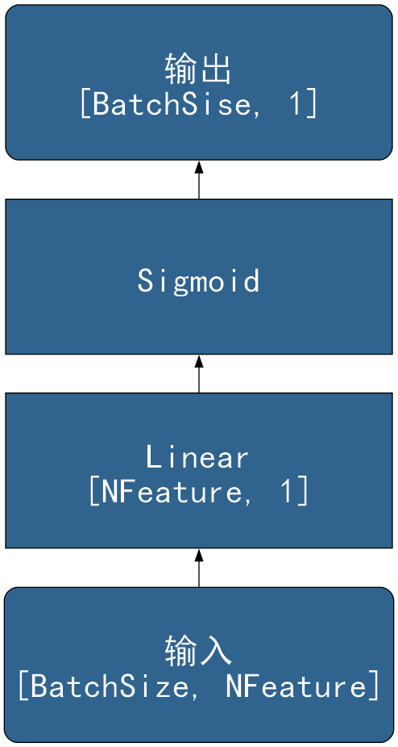

```
digraph SoftmaxRegression {
	rankdir=BT
    node [
		style=filled, 
		color=Black
		fontcolor=White, 
		fillcolor="#30638e", 
		fontname="SimHei",
		fontsize=32,
		width=5, height=2,
		shape="box",
	]
	
	
	inp     [label="输入\n[BatchSize, NFeature]", shape="Mrecord"]
	ll      [label="Linear\n[NFeature, NLabel]"]
	softmax [label="Softmax"]
	oup     [label="输出\n[BatchSise, NLabel]", shape="Mrecord"]
	
	inp -> ll -> softmax -> oup
}
```

# 二、MLP

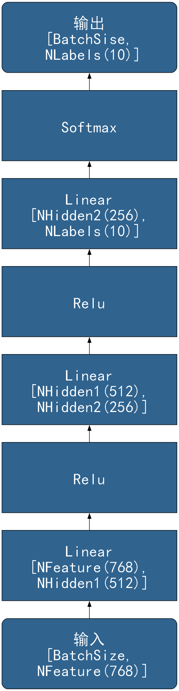

```
digraph MLP {
	rankdir=BT
    node [
		style=filled, 
		color=Black
		fontcolor=White, 
		fillcolor="#30638e", 
		fontname="SimHei",
		fontsize=32,
		width=5, height=2,
		shape="box",
	]
	
	
	inp     [label="输入\n[BatchSize,\n NFeature(768)]", shape="Mrecord"]
	ll1     [label="Linear\n[NFeature(768),\n NHidden1(512)]"]
    relu1   [label="Relu"]
    ll2     [label="Linear\n[NHidden1(512),\n NHidden2(256)]"]
    relu2   [label="Relu"]
    ll3     [label="Linear\n[NHidden2(256),\n NLabels(10)]"]
    softmax [label="Softmax"]
	oup     [label="输出\n[BatchSise,\n NLabels(10)]", shape="Mrecord"]
	
	inp -> ll1 -> relu1 -> ll2 -> relu2
        -> ll3 -> softmax -> oup
}
```

## 三、卷积神经网络

### 3.1 LeNet

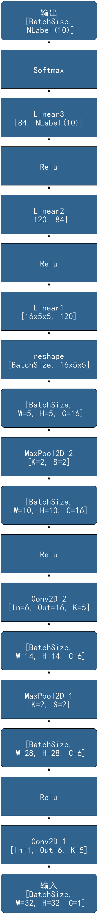

```
digraph Lenet {
	rankdir=BT
    node [
		style=filled, 
		color=Black
		fontcolor=White, 
		fillcolor="#30638e", 
		fontname="SimHei",
		fontsize=32,
		width=5, height=2,
		shape="box",
	]
	
	
	inp [label="输入\n[BatchSize,\n W=32, H=32, C=1]", shape="Mrecord"]
    conv1 [label="Conv2D 1\n[In=1, Out=6, K=5]"]
    relu1 [label="Relu"]
    featmap11 [label="[BatchSize,\n W=28, H=28, C=6]", shape="Mrecord"]
    pool1 [label="MaxPool2D 1\n[K=2, S=2]"]
    featmap12 [label="[BatchSize,\n W=14, H=14, C=6]", shape="Mrecord"]
    conv2 [label="Conv2D 2\n[In=6, Out=16, K=5]"]
    relu2 [label="Relu"]
    featmap21 [label="[BatchSize,\n W=10, H=10, C=16]", shape="Mrecord"]
    pool2 [label="MaxPool2D 2\n[K=2, S=2]"]
    featmap22 [label="[BatchSize,\n W=5, H=5, C=16]", shape="Mrecord"]
    reshape [label="reshape\n[BatchSize, 16x5x5]"]
    ll1 [label="Linear1\n[16x5x5, 120]"]
    relu3 [label="Relu"]
    ll2 [label="Linear2\n[120, 84]"]
    relu4 [label="Relu"]
	ll3  [label="Linear3\n[84, NLabel(10)]"]
    softmax [label="Softmax"]
	oup [label="输出\n[BatchSise,\n NLabel(10)]", shape="Mrecord"]
	
	inp -> conv1 -> relu1 -> featmap11 -> pool1 -> featmap12 ->
           conv2 -> relu2 -> featmap21 -> pool2 -> featmap22 ->
           reshape -> ll1 -> relu3 -> ll2 -> relu4 -> ll3 -> 
           softmax -> oup
	
}
```

### 3.2 AlexNet

块 #1：

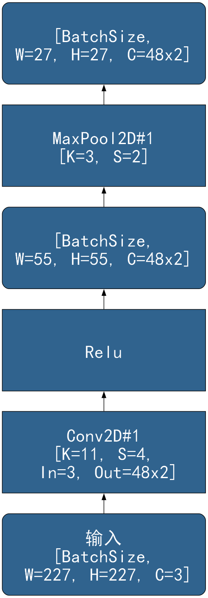

```
digraph AlexNetL1 {
	rankdir=BT
    node [
		style=filled, 
		color=Black
		fontcolor=White, 
		fillcolor="#30638e", 
		fontname="SimHei",
		fontsize=32,
		width=5, height=2,
		shape="box",
	]

	inp [label="输入\n[BatchSize,\n W=227, H=227, C=3]", shape="Mrecord"]
	conv1 [label="Conv2D#1\n[K=11, S=4,\n In=3, Out=48x2]"]
    relu1 [label="Relu"]
    featmap11 [label="[BatchSize,\nW=55, H=55, C=48x2]", shape="Mrecord"]
    maxpool1 [label="MaxPool2D#1\n[K=3, S=2]"]
    featmap12 [label="[BatchSize,\nW=27, H=27, C=48x2]", shape="Mrecord"]

    inp -> conv1 -> relu1 -> featmap11 -> maxpool1 -> featmap12

}
```

块 #2：

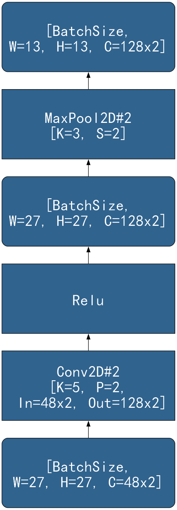

```
digraph AlexNetL2 {
	rankdir=BT
    node [
		style=filled, 
		color=Black
		fontcolor=White, 
		fillcolor="#30638e", 
		fontname="SimHei",
		fontsize=32,
		width=5, height=2,
		shape="box",
	]

    featmap12 [label="[BatchSize,\nW=27, H=27, C=48x2]", shape="Mrecord"]
	conv2 [label="Conv2D#2\n[K=5, P=2,\n In=48x2, Out=128x2]"]
    relu2 [label="Relu"]
    featmap21 [label="[BatchSize,\nW=27, H=27, C=128x2]", shape="Mrecord"]
    maxpool2 [label="MaxPool2D#2\n[K=3, S=2]"]
    featmap22 [label="[BatchSize,\nW=13, H=13, C=128x2]", shape="Mrecord"]

    featmap12 -> conv2 -> relu2 -> featmap21 -> maxpool2 -> featmap22
}
```

块 #3 和 #4：

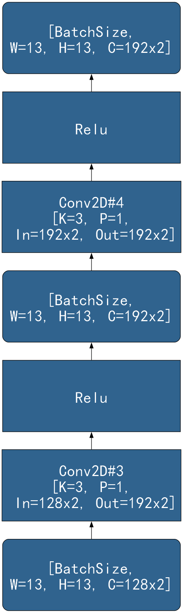

```
digraph AlexNetL34 {
	rankdir=BT
    node [
		style=filled, 
		color=Black
		fontcolor=White, 
		fillcolor="#30638e", 
		fontname="SimHei",
		fontsize=32,
		width=5, height=2,
		shape="box",
	]

    featmap22 [label="[BatchSize,\nW=13, H=13, C=128x2]", shape="Mrecord"]
	conv3 [label="Conv2D#3\n[K=3, P=1,\n In=128x2, Out=192x2]"]
    relu3 [label="Relu"]
    featmap3 [label="[BatchSize,\nW=13, H=13, C=192x2]", shape="Mrecord"]
	conv4 [label="Conv2D#4\n[K=3, P=1,\n In=192x2, Out=192x2]"]
    relu4 [label="Relu"]
    featmap4 [label="[BatchSize,\nW=13, H=13, C=192x2]", shape="Mrecord"]

    featmap22 -> conv3 -> relu3 -> featmap3 -> conv4 -> relu4 -> featmap4
}
```

块 #5：

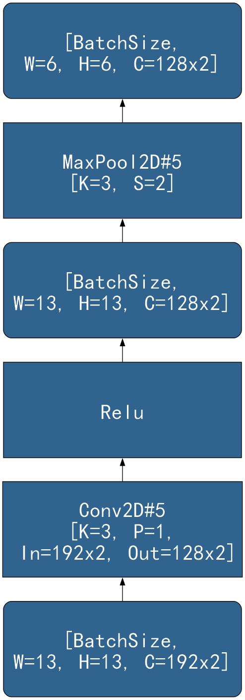

```
digraph AlexNetL5 {
	rankdir=BT
    node [
		style=filled, 
		color=Black
		fontcolor=White, 
		fillcolor="#30638e", 
		fontname="SimHei",
		fontsize=32,
		width=5, height=2,
		shape="box",
	]

    featmap4 [label="[BatchSize,\nW=13, H=13, C=192x2]", shape="Mrecord"]
    conv5 [label="Conv2D#5\n[K=3, P=1,\n In=192x2, Out=128x2]"]
    relu5 [label="Relu"]
    featmap51 [label="[BatchSize,\nW=13, H=13, C=128x2]", shape="Mrecord"]
    maxpool5 [label="MaxPool2D#5\n[K=3, S=2]"]
    featmap52 [label="[BatchSize,\nW=6, H=6, C=128x2]", shape="Mrecord"]

    featmap4 -> conv5 -> relu5 -> featmap51 -> maxpool5 -> featmap52
}
```

块 #6 #7 #8：

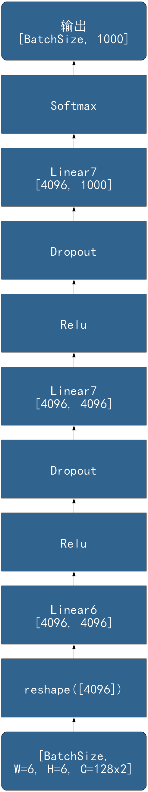

```
digraph AlexNetL678 {
	rankdir=BT
    node [
		style=filled, 
		color=Black
		fontcolor=White, 
		fillcolor="#30638e", 
		fontname="SimHei",
		fontsize=32,
		width=5, height=2,
		shape="box",
	]


    featmap52 [label="[BatchSize,\nW=6, H=6, C=128x2]", shape="Mrecord"]
    reshape [label="reshape([4096])"]
    linear6 [label="Linear6\n[4096, 4096]"]
    relu6 [label="Relu"]
    dropout6 [label="Dropout"]
    linear7 [label="Linear7\n[4096, 4096]"]
    relu7 [label="Relu"]
    dropout7 [label="Dropout"]
    linear8 [label="Linear7\n[4096, 1000]"]
    softmax [label="Softmax"]
    oup [label="输出\n[BatchSize, 1000]", shape="Mrecord"]

    featmap52 -> reshape -> linear6 -> relu6 -> dropout6 ->
        linear7 -> relu7 -> dropout7 -> linear8 -> softmax -> oup

}
```

### 3.3 VGG16

主体：

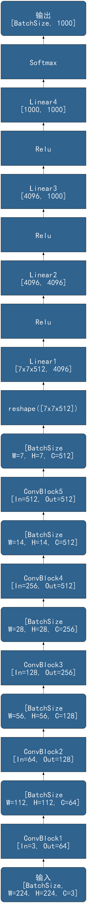

```
digraph VGG16 {
	rankdir=BT
    node [
		style=filled, 
		color=Black
		fontcolor=White, 
		fillcolor="#30638e", 
		fontname="SimHei",
		fontsize=32,
		width=5, height=2,
		shape="box",
	]

    inp [label="输入\n[BatchSize,\nW=224, H=224, C=3]", shape="Mrecord"]
	convblock1 [label="ConvBlock1\n[In=3, Out=64]"]
	featmap1 [label="[BatchSize\nW=112, H=112, C=64]", shape="Mrecord"]
	convblock2 [label="ConvBlock2\n[In=64, Out=128]"]
	featmap2 [label="[BatchSize\nW=56, H=56, C=128]", shape="Mrecord"]
	convblock3 [label="ConvBlock3\n[In=128, Out=256]"]
	featmap3 [label="[BatchSize\nW=28, H=28, C=256]", shape="Mrecord"]
	convblock4 [label="ConvBlock4\n[In=256, Out=512]"]
	featmap4 [label="[BatchSize\nW=14, H=14, C=512]", shape="Mrecord"]
	convblock5 [label="ConvBlock5\n[In=512, Out=512]"]
	featmap5 [label="[BatchSize\nW=7, H=7, C=512]", shape="Mrecord"]
	reshape [label="reshape([7x7x512])"]
	linear1 [label="Linear1\n[7x7x512, 4096]"]
	relu1 [label="Relu"]
	linear2 [label="Linear2\n[4096, 4096]"]
	relu2 [label="Relu"]
	linear3 [label="Linear3\n[4096, 1000]"]
	relu3 [label="Relu"]
	linear4 [label="Linear4\n[1000, 1000]"]
	softmax [label="Softmax"]
	oup [label="输出\n[BatchSize, 1000]", shape="Mrecord"]

	inp -> convblock1 -> featmap1 -> convblock2 -> featmap2 ->
		convblock3 -> featmap3 -> convblock4 -> featmap4 -> 
		convblock5 -> featmap5 -> reshape -> linear1 -> relu1 ->
		linear2 -> relu2 -> linear3 -> relu3 -> linear4 -> softmax ->
		oup
}
```

卷积块：

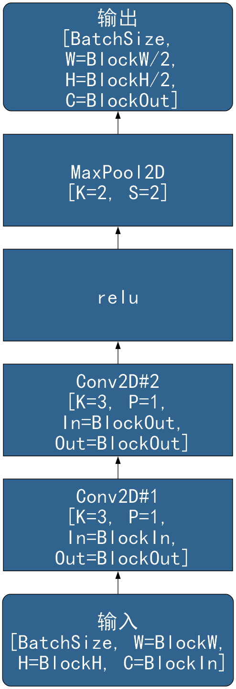

```
digraph VGG16ConvBlock {
	rankdir=BT
    node [
		style=filled, 
		color=Black
		fontcolor=White, 
		fillcolor="#30638e", 
		fontname="SimHei",
		fontsize=32,
		width=5, height=2,
		shape="box",
	]
    inp [label="输入\n[BatchSize, W=BlockW,\n H=BlockH, C=BlockIn]", shape="Mrecord"]
	conv1 [label="Conv2D#1\n[K=3, P=1,\n In=BlockIn,\n Out=BlockOut]"]
	conv2 [label="Conv2D#2\n[K=3, P=1,\n In=BlockOut,\n Out=BlockOut]"]
	relu  [label="relu"]
	maxpool [label="MaxPool2D\n[K=2, S=2]"]
    oup [label="输出\n[BatchSize,\n W=BlockW/2,\n H=BlockH/2,\n C=BlockOut]", shape="Mrecord"]

	inp -> conv1 -> conv2 -> relu -> maxpool -> oup

}
```

### 3.4 ResNet18

主体：

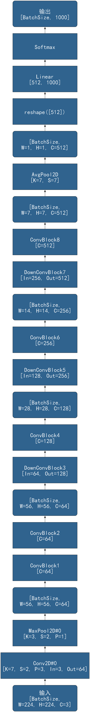

```
digraph ResNet18 {
	rankdir=BT
    node [
		style=filled, 
		color=Black
		fontcolor=White, 
		fillcolor="#30638e", 
		fontname="SimHei",
		fontsize=32,
		width=5, height=2,
		shape="box",
	]
    inp [label="输入\n[BatchSize,\nW=224, H=224, C=3]", shape="Mrecord"]
    conv0 [label="Conv2D#0\n[K=7, S=2, P=3, In=3, Out=64]"]
    maxpool0 [label="MaxPool2D#0\n[K=3, S=2, P=1]"]
    featmap0 [label="[BatchSize,\nW=56, H=56, C=64]", shape="Mrecord"]
	convblock1 [label="ConvBlock1\n[C=64]"]
	convblock2 [label="ConvBlock2\n[C=64]"]
    featmap2 [label="[BatchSize,\nW=56, H=56, C=64]", shape="Mrecord"]
    downconvblock3 [label="DownConvBlock3\n[In=64, Out=128]"]
	convblock4 [label="ConvBlock4\n[C=128]"]
    featmap4 [label="[BatchSize,\nW=28, H=28, C=128]", shape="Mrecord"]
    downconvblock5 [label="DownConvBlock5\n[In=128, Out=256]"]
	convblock6 [label="ConvBlock6\n[C=256]"]
    featmap6 [label="[BatchSize,\nW=14, H=14, C=256]", shape="Mrecord"]
    downconvblock7 [label="DownConvBlock7\n[In=256, Out=512]"]
	convblock8 [label="ConvBlock8\n[C=512]"]
    featmap8 [label="[BatchSize,\nW=7, H=7, C=512]", shape="Mrecord"]
    avgpool [label="AvgPool2D\n[K=7, S=7]"]
    featmap9 [label="[BatchSize,\nW=1, H=1, C=512]", shape="Mrecord"]
    reshape [label="reshape([512])"]
    linear [label="Linear\n[512, 1000]"]
    softmax [label="Softmax"]
	oup [label="输出\n[BatchSize, 1000]", shape="Mrecord"]

    inp -> conv0 -> maxpool0 -> featmap0 -> convblock1 -> convblock2 -> 
        featmap2 -> downconvblock3 -> convblock4 -> featmap4 ->
        downconvblock5 -> convblock6 -> featmap6 ->
        downconvblock7 -> convblock8 -> featmap8 -> avgpool ->
        featmap9 -> reshape -> linear -> softmax -> oup

}
```

卷积块：

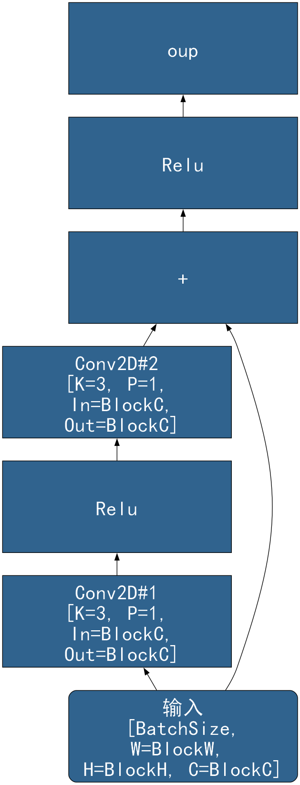

```
digraph ResNet18ConvBlock {
	rankdir=BT
    node [
		style=filled, 
		color=Black
		fontcolor=White, 
		fillcolor="#30638e", 
		fontname="SimHei",
		fontsize=32,
		width=5, height=2,
		shape="box",
	]
    
    inp [label="输入\n[BatchSize,\nW=BlockW, \nH=BlockH, C=BlockC]", shape="Mrecord"]
    conv1 [label="Conv2D#1\n[K=3, P=1,\n In=BlockC,\n Out=BlockC]"]
    relu1 [label="Relu"]
    conv2 [label="Conv2D#2\n[K=3, P=1,\n In=BlockC,\n Out=BlockC]"]
    add   [label="+"]
    relu2 [label="Relu"]

    inp -> conv1 -> relu1 -> conv2 -> add -> relu2 -> oup
    inp -> add
}
```

下卷积块：

!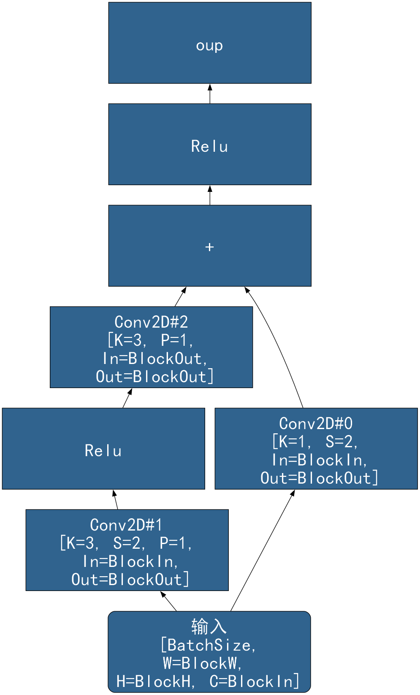

```
digraph ResNet18DownConvBlock {
	rankdir=BT
    node [
		style=filled, 
		color=Black
		fontcolor=White, 
		fillcolor="#30638e", 
		fontname="SimHei",
		fontsize=32,
		width=5, height=2,
		shape="box",
	]
    
    inp [label="输入\n[BatchSize,\nW=BlockW, \nH=BlockH, C=BlockIn]", shape="Mrecord"]
    conv1 [label="Conv2D#1\n[K=3, S=2, P=1,\n In=BlockIn,\n Out=BlockOut]"]
    relu1 [label="Relu"]
    conv2 [label="Conv2D#2\n[K=3, P=1,\n In=BlockOut,\n Out=BlockOut]"]
    downconv [label="Conv2D#0\n[K=1, S=2,\n In=BlockIn,\n Out=BlockOut]"]
    add   [label="+"]
    relu2 [label="Relu"]

    inp -> conv1 -> relu1 -> conv2 -> add -> relu2 -> oup
    inp -> downconv -> add
}
```

### 3.5 DenseNet

主体：

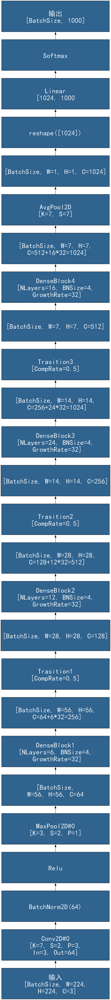

```
digraph DenseNet {
	rankdir=BT
    node [
		style=filled, 
		color=Black
		fontcolor=White, 
		fillcolor="#30638e", 
		fontname="SimHei",
		fontsize=32,
		width=7, height=2,
		shape="box",
	]
    inp [label="输入\n[BatchSize, W=224,\n H=224, C=3]"]
    conv0 [label="Conv2D#0\n[K=7, S=2, P=3,\nIn=3, Out=64]"]
    bn0 [label="BatchNorm2D(64)"]
    relu0 [label="Relu"]
    maxpool0 [label="MaxPool2D#0\n[K=3, S=2, P=1]"]
    featmap0 [label="[BatchSize,\nW=56, H=56, C=64"]
    dense1 [label="DenseBlock1\n[NLayers=6, BNSize=4,\n GrowthRate=32]"]
    featmap11 [label="[BatchSize, W=56, H=56,\n C=64+6*32=256]"]
    trans1 [label="Trasition1\n[CompRate=0.5]"]
    featmap12 [label="[BatchSize, W=28, H=28, C=128]"]
    dense2 [label="DenseBlock2\n[NLayers=12, BNSize=4,\n GrowthRate=32]"]
    featmap21 [label="[BatchSize, W=28, H=28,\n C=128+12*32=512]"]
    trans2 [label="Trasition2\n[CompRate=0.5]"]
    featmap22 [label="[BatchSize, W=14, H=14, C=256]"]
    dense3 [label="DenseBlock3\n[NLayers=24, BNSize=4,\n GrowthRate=32]"]
    featmap31 [label="[BatchSize, W=14, H=14,\n C=256+24*32=1024]"]
    trans3 [label="Trasition3\n[CompRate=0.5]"]
    featmap32 [label="[BatchSize, W=7, H=7, C=512]"]
    dense4 [label="DenseBlock4\n[NLayers=16, BNSize=4,\n GrowthRate=32]"]
    featmap4 [label="[BatchSize, W=7, H=7,\n C=512+16*32=1024]"]
    avgpool [label="AvgPool2D\n[K=7, S=7]"]
    featmap5 [label="[BatchSize, W=1, H=1, C=1024]"]
    reshape [label="reshape([1024])"]
    linear [label="Linear\n[1024, 1000"]
    softmax [label="Softmax"]
    oup [label="输出\n[BatchSize, 1000]"]

    inp -> conv0 -> bn0 -> relu0 -> maxpool0 ->  featmap0 ->
        dense1 -> featmap11 -> trans1 -> featmap12 ->
        dense2 -> featmap21 -> trans2 -> featmap22 ->
        dense3 -> featmap31 -> trans3 -> featmap32 ->
        dense4 -> featmap4 -> avgpool -> featmap5 ->
        reshape -> linear -> softmax -> oup
}
```

密集块：

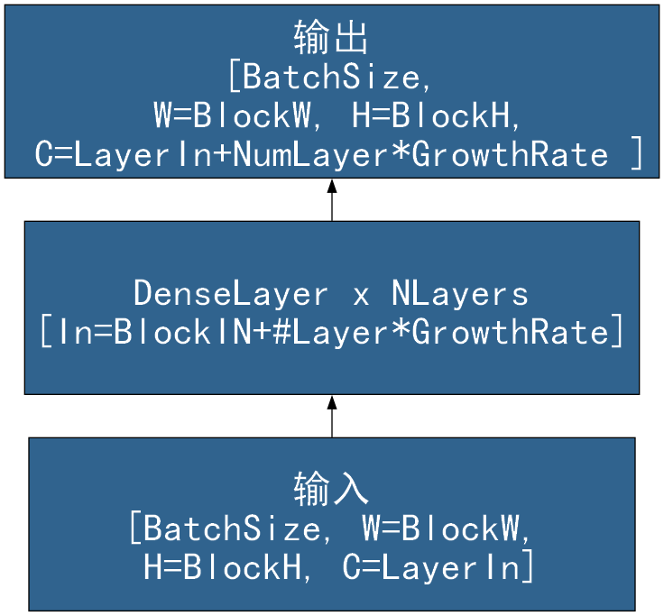

```
digraph DenseBlock {
	rankdir=BT
    node [
		style=filled, 
		color=Black
		fontcolor=White, 
		fillcolor="#30638e", 
		fontname="SimHei",
		fontsize=32,
		width=7, height=2,
		shape="box",
	]
    inp [label="输入\n[BatchSize, W=BlockW,\n H=BlockH, C=LayerIn]"]
	DenseLayers [label="DenseLayer x NLayers\n[In=BlockIN+#Layer*GrowthRate]"]
	oup [label="输出\n[BatchSize,\n W=BlockW, H=BlockH,\n C=LayerIn+NumLayer*GrowthRate ]"]

	inp -> DenseLayers -> oup

}
```

密集层：

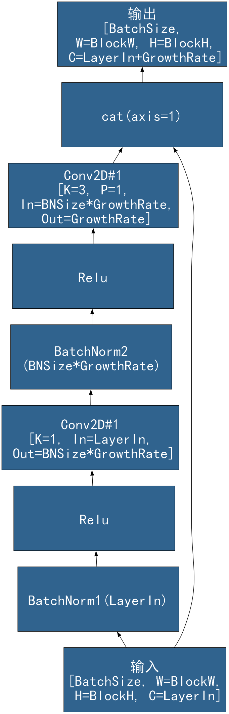

```
digraph DenseLayer {
	rankdir=BT
    node [
		style=filled, 
		color=Black
		fontcolor=White, 
		fillcolor="#30638e", 
		fontname="SimHei",
		fontsize=32,
		width=5, height=2,
		shape="box",
	]
    inp [label="输入\n[BatchSize, W=BlockW,\n H=BlockH, C=LayerIn]"]
    bn1 [label="BatchNorm1(LayerIn)"]
    relu1  [label="Relu"]
    conv1 [label="Conv2D#1\n[K=1, In=LayerIn,\n Out=BNSize*GrowthRate]"]
    bn2 [label="BatchNorm2\n(BNSize*GrowthRate)"]
    relu2  [label="Relu"]
    conv2 [label="Conv2D#1\n[K=3, P=1,\n In=BNSize*GrowthRate,\n Out=GrowthRate]"]
    cat [label="cat(axis=1)"]
    oup [label="输出\n[BatchSize,\n W=BlockW, H=BlockH,\n C=LayerIn+GrowthRate]"]

    inp -> bn1 -> relu1 -> conv1 -> bn2 -> relu2 -> conv2 -> cat -> oup
    inp -> cat
}
```

过渡块：

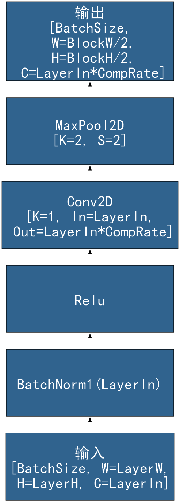

```
digraph TransitionLayer {
	rankdir=BT
    node [
		style=filled, 
		color=Black
		fontcolor=White, 
		fillcolor="#30638e", 
		fontname="SimHei",
		fontsize=32,
		width=5, height=2,
		shape="box",
	]
    inp [label="输入\n[BatchSize, W=LayerW,\n H=LayerH, C=LayerIn]"]
    bn [label="BatchNorm1(LayerIn)"]
    relu  [label="Relu"]
    conv [label="Conv2D\n[K=1, In=LayerIn,\n Out=LayerIn*CompRate]"]
    maxpool [label="MaxPool2D\n[K=2, S=2]"]
    oup [label="输出\n[BatchSize,\n W=BlockW/2,\n H=BlockH/2,\n C=LayerIn*CompRate]"]

    inp -> bn -> relu -> conv -> maxpool -> oup
}
```

## 四、自编码器

### 4.1 栈式自编码器

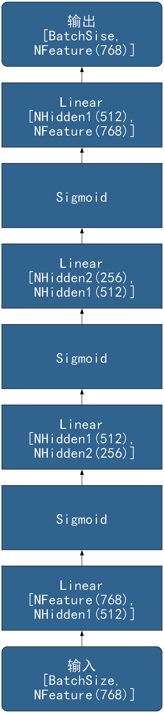

```
digraph StackAutoEncoder {
	rankdir=BT
    node [
		style=filled, 
		color=Black
		fontcolor=White, 
		fillcolor="#30638e", 
		fontname="SimHei",
		fontsize=32,
		width=5, height=2,
		shape="box",
	]
	
	
	inp     [label="输入\n[BatchSize,\n NFeature(768)]", shape="Mrecord"]
	ll1     [label="Linear\n[NFeature(768),\n NHidden1(512)]"]
    σ1      [label="Sigmoid"]
    ll2     [label="Linear\n[NHidden1(512),\n NHidden2(256)]"]
    σ2      [label="Sigmoid"]
    ll3     [label="Linear\n[NHidden2(256),\n NHidden1(512)]"]
    σ3      [label="Sigmoid"]
    ll4     [label="Linear\n[NHidden1(512),\n NFeature(768)]"]
	oup     [label="输出\n[BatchSise,\n NFeature(768)]", shape="Mrecord"]
	
	inp -> ll1 -> σ1 -> ll2 -> σ2
        -> ll3 -> σ3 -> ll4 -> oup
}
```

### 4.2 去噪自编码器

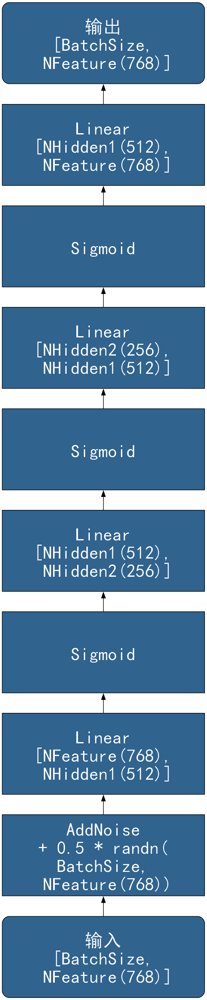

```
digraph DenoiseAutoEncoder {
	rankdir=BT
    node [
		style=filled, 
		color=Black
		fontcolor=White, 
		fillcolor="#30638e", 
		fontname="SimHei",
		fontsize=32,
		width=5, height=2,
		shape="box",
	]
	
	
	inp       [label="输入\n[BatchSize,\n NFeature(768)]", shape="Mrecord"]
	noise     [label="AddNoise\n+ 0.5 * randn(\nBatchSize,\n NFeature(768))"]
	ll1       [label="Linear\n[NFeature(768),\n NHidden1(512)]"]
    σ1        [label="Sigmoid"]
    ll2       [label="Linear\n[NHidden1(512),\n NHidden2(256)]"]
    σ2        [label="Sigmoid"]
    ll3       [label="Linear\n[NHidden2(256),\n NHidden1(512)]"]
    σ3        [label="Sigmoid"]
    ll4       [label="Linear\n[NHidden1(512),\n NFeature(768)]"]
	oup       [label="输出\n[BatchSize,\n NFeature(768)]", shape="Mrecord"]
	
	inp -> noise ->  ll1 -> σ1 -> ll2 -> σ2
        -> ll3 -> σ3 -> ll4 -> oup
}
```

### 4.3 变分自编码器

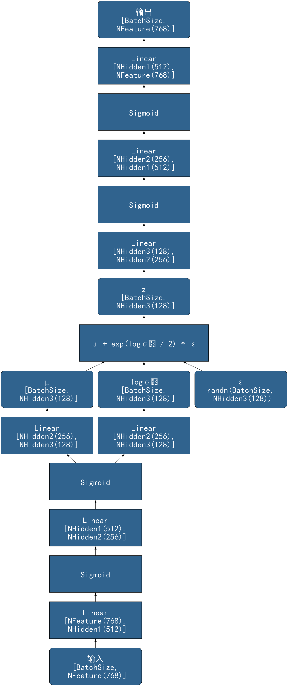

```
digraph VariationAutoEncoder {
	rankdir=BT
    node [
		style=filled, 
		color=Black
		fontcolor=White, 
		fillcolor="#30638e", 
		fontname="SimHei",
		fontsize=32,
		width=5, height=2,
		shape="box",
	]
	
	
	inp           [label="输入\n[BatchSize,\n NFeature(768)]", shape="Mrecord"]
	ll1           [label="Linear\n[NFeature(768),\n NHidden1(512)]"]
    σ1            [label="Sigmoid"]
    ll2           [label="Linear\n[NHidden1(512),\n NHidden2(256)]"]
    σ2            [label="Sigmoid"]
	ll3_mean      [label="Linear\n[NHidden2(256),\n NHidden3(128)]"]
	ll3_log_var   [label="Linear\n[NHidden2(256),\n NHidden3(128)]"]
	z_mean        [label="μ\n[BatchSize,\n NHidden3(128)]", shape="Mrecord"]
	z_log_var     [label="logσ²\n[BatchSize,\n NHidden3(128)]", shape="Mrecord"]
	eps           [label="ε\nrandn(BatchSize,\n NHidden3(128))", shape="Mrecord"]
	sample        [label="μ + exp(logσ² / 2) * ε", width=7]
	z             [label="z\n[BatchSize,\n NHidden3(128)]", shape="Mrecord"]
    ll4           [label="Linear\n[NHidden3(128),\n NHidden2(256)]"]
    σ4            [label="Sigmoid"]
    ll5           [label="Linear\n[NHidden2(256),\n NHidden1(512)]"]
    σ5            [label="Sigmoid"]
    ll6           [label="Linear\n[NHidden1(512),\n NFeature(768)]"]
	oup           [label="输出\n[BatchSize,\n NFeature(768)]", shape="Mrecord"]
	
	inp -> ll1 -> σ1 -> ll2 -> σ2
    σ2 -> ll3_mean -> z_mean -> sample
	σ2 -> ll3_log_var -> z_log_var -> sample
	eps -> sample -> z -> ll4 -> σ4 -> ll5 -> σ5 -> ll6 -> oup

}
```

### 4.4 卷积自编码器

主体：

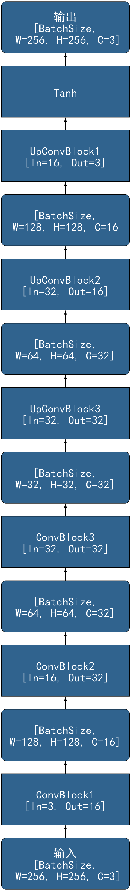

```
digraph ConvAutoEncoder {
	rankdir=BT
    node [
		style=filled, 
		color=Black
		fontcolor=White, 
		fillcolor="#30638e", 
		fontname="SimHei",
		fontsize=32,
		width=5, height=2,
		shape="box",
	]
	
	
	inp         [label="输入\n[BatchSize,\n W=256, H=256, C=3]", shape="Mrecord"]
	conv1       [label="ConvBlock1\n[In=3, Out=16]"]
	featmap_e1  [label="[BatchSize,\nW=128, H=128, C=16]", shape="Mrecord"]
	conv2       [label="ConvBlock2\n[In=16, Out=32]"]
	featmap_e2  [label="[BatchSize,\nW=64, H=64, C=32]", shape="Mrecord"]
	conv3       [label="ConvBlock3\n[In=32, Out=32]"]
	featmap_e3  [label="[BatchSize,\nW=32, H=32, C=32]", shape="Mrecord"]
	upconv3     [label="UpConvBlock3\n[In=32, Out=32]"]
	featmap_d2  [label="[BatchSize,\nW=64, H=64, C=32]", shape="Mrecord"]
	upconv2     [label="UpConvBlock2\n[In=32, Out=16]"]
	featmap_d1  [label="[BatchSize,\nW=128, H=128, C=16", shape="Mrecord"]
	upconv1     [label="UpConvBlock1\n[In=16, Out=3]"]
	tanh        [label="Tanh"]
	oup         [label="输出\n[BatchSize,\n W=256, H=256, C=3]", shape="Mrecord"]

	inp -> conv1 -> featmap_e1 -> conv2 -> featmap_e2
        -> conv3 -> featmap_e3 -> upconv3 -> featmap_d2
        -> upconv2 -> featmap_d1 -> upconv1
        -> tanh -> oup 
}
```

卷积块：

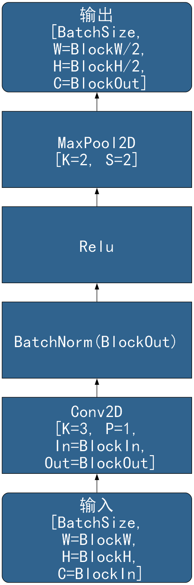

```
digraph CAEConvBlock {
	rankdir=BT
    node [
		style=filled, 
		color=Black
		fontcolor=White, 
		fillcolor="#30638e", 
		fontname="SimHei",
		fontsize=32,
		width=5, height=2,
		shape="box",
	]
	
	
	inp         [label="输入\n[BatchSize,\n W=BlockW,\n H=BlockH,\n C=BlockIn]", shape="Mrecord"]
	conv        [label="Conv2D\n[K=3, P=1,\n In=BlockIn,\n Out=BlockOut]"]
	batchnorm   [label="BatchNorm(BlockOut)"]
    relu        [label="Relu"]
    maxpool     [label="MaxPool2D\n[K=2, S=2]"]
	oup         [label="输出\n[BatchSize,\n W=BlockW/2,\n H=BlockH/2,\n C=BlockOut]", shape="Mrecord"]

	inp -> conv -> batchnorm -> relu -> maxpool -> oup 
}
```

反卷积块：

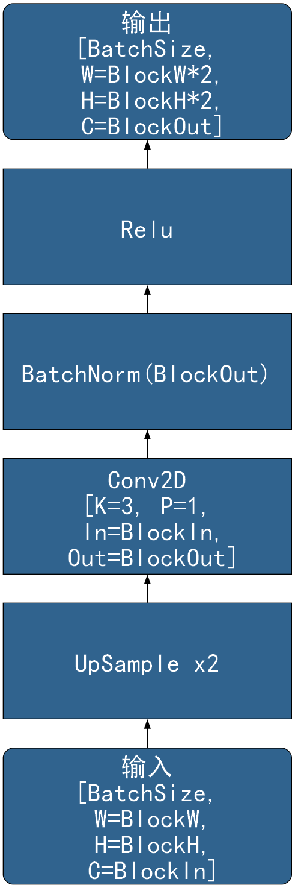

```
digraph CAEDeconvBlock {
	rankdir=BT
    node [
		style=filled, 
		color=Black
		fontcolor=White, 
		fillcolor="#30638e", 
		fontname="SimHei",
		fontsize=32,
		width=5, height=2,
		shape="box",
	]
	
	
	inp         [label="输入\n[BatchSize,\n W=BlockW,\n H=BlockH,\n C=BlockIn]", shape="Mrecord"]
    upsamp      [label="UpSample x2"]
	conv        [label="Conv2D\n[K=3, P=1,\n In=BlockIn,\n Out=BlockOut]"]
	batchnorm   [label="BatchNorm(BlockOut)"]
    relu        [label="Relu"]
	oup         [label="输出\n[BatchSize,\n W=BlockW*2,\n H=BlockH*2,\n C=BlockOut]", shape="Mrecord"]

	inp -> upsamp -> conv -> batchnorm -> relu -> oup 
}
```

# 五、循环神经网络

## 5.1 时序 RNN

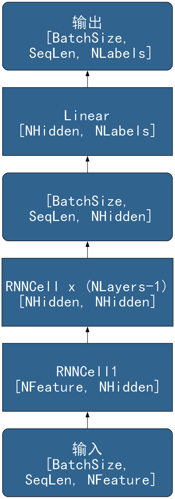

```
digraph TimeRNN {
	rankdir=BT
    node [
		style=filled, 
		color=Black
		fontcolor=White, 
		fillcolor="#30638e", 
		fontname="SimHei",
		fontsize=32,
		width=5, height=2,
		shape="box",
	]
	
	
	inp      [label="输入\n[BatchSize,\n SeqLen, NFeature]", shape="Mrecord"]
    rnn1     [label="RNNCell1\n[NFeature, NHidden]"]
    rnn_rest [label="RNNCell x (NLayers-1)\n[NHidden, NHidden]"]
    hidst    [label="[BatchSize,\n SeqLen, NHidden]", shape="Mrecord"]
	ll       [label="Linear\n[NHidden, NLabels]"]
	oup      [label="输出\n[BatchSize,\n SeqLen, NLabels]", shape="Mrecord"]
	
	inp -> rnn1 -> rnn_rest -> hidst -> ll -> oup
}
```

## 5.2 NLP RNN

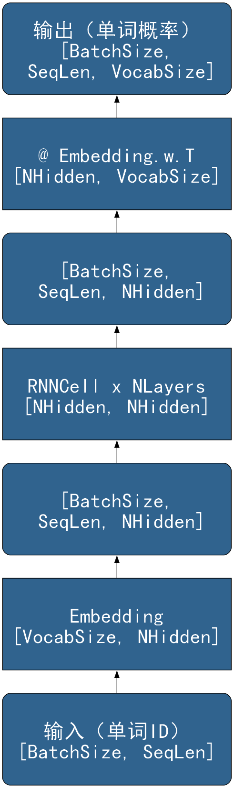

```
digraph NLPRNN {
	rankdir=BT
    node [
		style=filled, 
		color=Black
		fontcolor=White, 
		fillcolor="#30638e", 
		fontname="SimHei",
		fontsize=32,
		width=5, height=2,
		shape="box",
	]
	
	
	inp      [label="输入（单词ID）\n[BatchSize, SeqLen]", shape="Mrecord"]
	emb      [label="Embedding\n[VocabSize, NHidden]"]
	inp_emb  [label="[BatchSize,\n SeqLen, NHidden]", shape="Mrecord"]
    rnn      [label="RNNCell x NLayers\n[NHidden, NHidden]"]
    hidst    [label="[BatchSize,\n SeqLen, NHidden]", shape="Mrecord"]
	emb_w_t  [label="@ Embedding.w.T\n[NHidden, VocabSize]"]
	oup      [label="输出（单词概率）\n[BatchSize,\n SeqLen, VocabSize]", shape="Mrecord"]
	
	inp -> emb -> inp_emb -> rnn -> hidst -> emb_w_t -> oup
}
```

### 5.3 RNN 单元

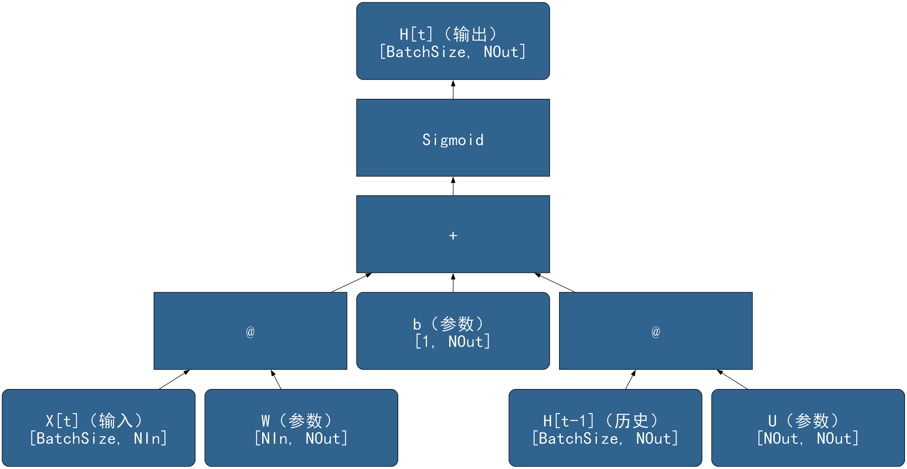

```
digraph RNNCell {
	rankdir=BT
    node [
		style=filled, 
		color=Black
		fontcolor=White, 
		fillcolor="#30638e", 
		fontname="SimHei",
		fontsize=32,
		width=5, height=2,
		shape="box",
	]

    x [label="X[t]（输入）\n[BatchSize, NIn]", shape="Mrecord"]
    his [label="H[t-1]（历史）\n[BatchSize, NOut]", shape="Mrecord"]
    w_x [label="W（参数）\n[NIn, NOut]", shape="Mrecord"]
    w_h [label="U（参数）\n[NOut, NOut]", shape="Mrecord"]
    b   [label="b（参数）\n[1, NOut]", shape="Mrecord"]
    σ   [label="Sigmoid"]
    matmul1 [label="@"]
    matmul2 [label="@"]
    plus  [label="+"]
    h   [label="H[t]（输出）\n[BatchSize, NOut]", shape="Mrecord"]

    x -> matmul1
    w_x -> matmul1
    his -> matmul2
    w_h -> matmul2
    matmul1 -> plus
    matmul2 -> plus
    b -> plus
    plus -> σ
    σ -> h

}
```

### 5.4 LSTM 单元

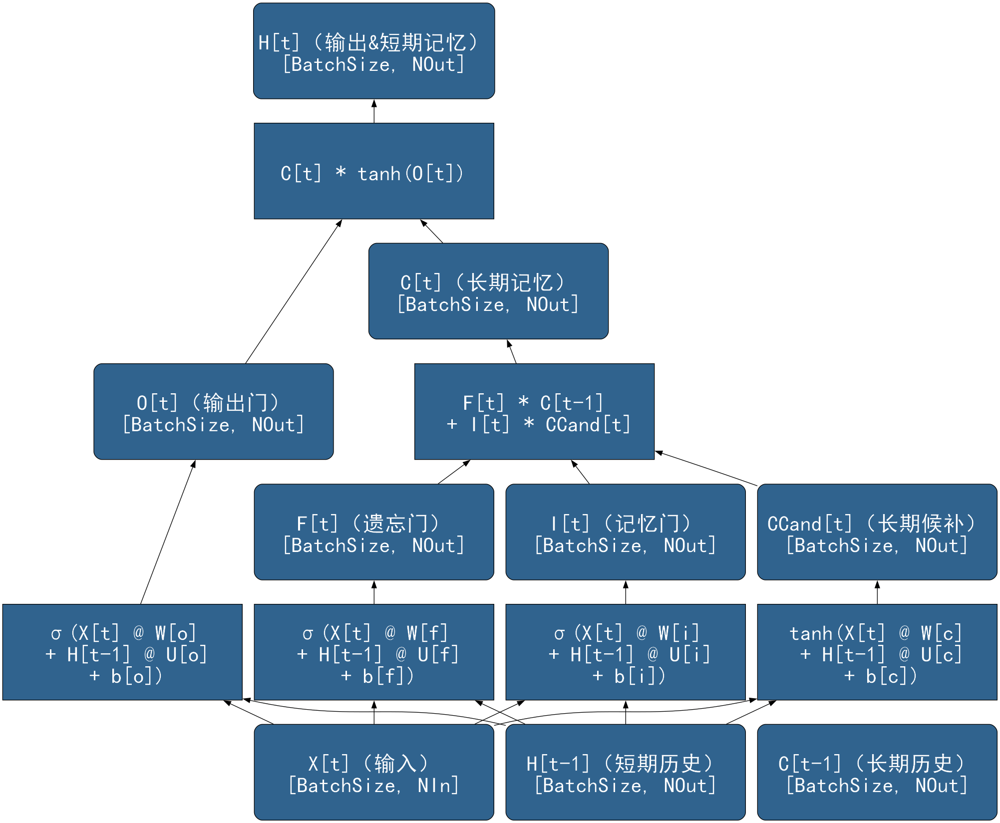

```
digraph GRUCell {
	rankdir=BT
    node [
		style=filled, 
		color=Black
		fontcolor=White, 
		fillcolor="#30638e", 
		fontname="SimHei",
		fontsize=32,
		width=5, height=2,
		shape="box",
	]

    x [label="X[t]（输入）\n[BatchSize, NIn]", shape="Mrecord"]
    his_h [label="H[t-1]（短期历史）\n[BatchSize, NOut]", shape="Mrecord"]
    his_c [label="C[t-1]（长期历史）\n[BatchSize, NOut]", shape="Mrecord"]
    
    calc_f [label="σ(X[t] @ W[f]\n + H[t-1] @ U[f]\n + b[f])"]
    calc_i [label="σ(X[t] @ W[i]\n + H[t-1] @ U[i]\n + b[i])"]
    calc_c_cand [label="tanh(X[t] @ W[c]\n + H[t-1] @ U[c]\n + b[c])"]
    calc_o [label="σ(X[t] @ W[o]\n + H[t-1] @ U[o]\n + b[o])"]
    
    f   [label="F[t]（遗忘门）\n[BatchSize, NOut]", shape="Mrecord"]
    i   [label="I[t]（记忆门）\n[BatchSize, NOut]", shape="Mrecord"]
    c_cand   [label="CCand[t]（长期候补）\n[BatchSize, NOut]", shape="Mrecord"]
    o   [label="O[t]（输出门）\n[BatchSize, NOut]", shape="Mrecord"]

    calc_c [label="F[t] * C[t-1]\n + I[t] * CCand[t]"]
    calc_h [label="C[t] * tanh(O[t])"]

    h [label="H[t]（输出&短期记忆）\n[BatchSize, NOut]", shape="Mrecord"]
    c [label="C[t]（长期记忆）\n[BatchSize, NOut]", shape="Mrecord"]

    x -> calc_f
    x -> calc_i
    x -> calc_c_cand
    x -> calc_o

    his_h -> calc_f -> f
    his_h -> calc_i -> i
    his_h -> calc_c_cand -> c_cand
    his_h -> calc_o -> o

    f -> calc_c
    i -> calc_c
    c_cand -> calc_c

    calc_c -> c

    c -> calc_h
    o -> calc_h
    calc_h -> h


}
```

### 5.5 GRU 单元

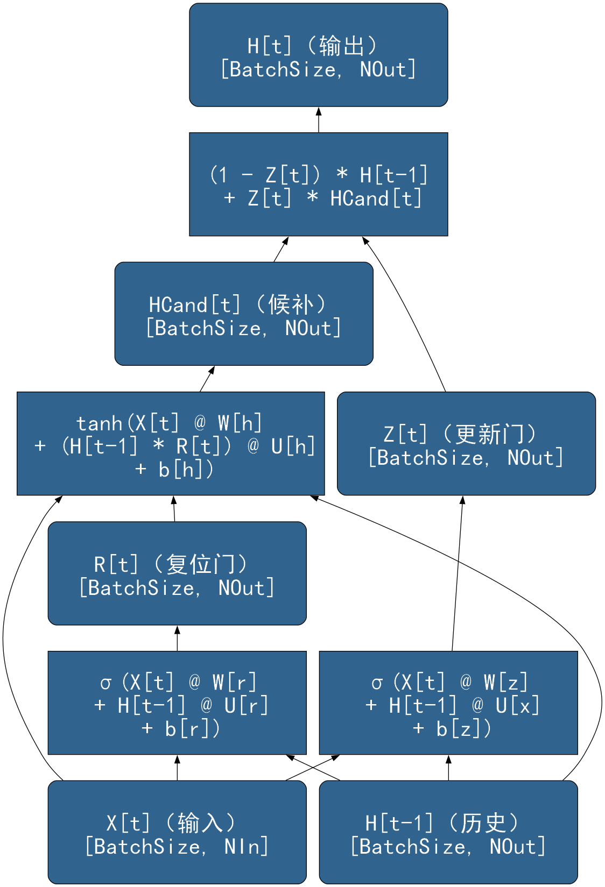

```
digraph LSTMCell {
	rankdir=BT
    node [
		style=filled, 
		color=Black
		fontcolor=White, 
		fillcolor="#30638e", 
		fontname="SimHei",
		fontsize=32,
		width=5, height=2,
		shape="box",
	]

    x [label="X[t]（输入）\n[BatchSize, NIn]", shape="Mrecord"]
    his_h [label="H[t-1]（历史）\n[BatchSize, NOut]", shape="Mrecord"]
    
    calc_z [label="σ(X[t] @ W[z]\n + H[t-1] @ U[x]\n + b[z])"]
    calc_r [label="σ(X[t] @ W[r]\n + H[t-1] @ U[r]\n + b[r])"]
    calc_h_cand [label="tanh(X[t] @ W[h]\n + (H[t-1] * R[t]) @ U[h]\n + b[h])"]
    
    z   [label="Z[t]（更新门）\n[BatchSize, NOut]", shape="Mrecord"]
    r   [label="R[t]（复位门）\n[BatchSize, NOut]", shape="Mrecord"]
    h_cand   [label="HCand[t]（候补）\n[BatchSize, NOut]", shape="Mrecord"]

    calc_h [label="(1 - Z[t]) * H[t-1]\n + Z[t] * HCand[t]"]

    h [label="H[t]（输出）\n[BatchSize, NOut]", shape="Mrecord"]

    x -> calc_z
    x -> calc_r
    x -> calc_h_cand

    his_h -> calc_z -> z
    his_h -> calc_r -> r
    his_h -> calc_h_cand
    r -> calc_h_cand -> h_cand

    z -> calc_h
    h_cand -> calc_h
    calc_h -> h
}
```