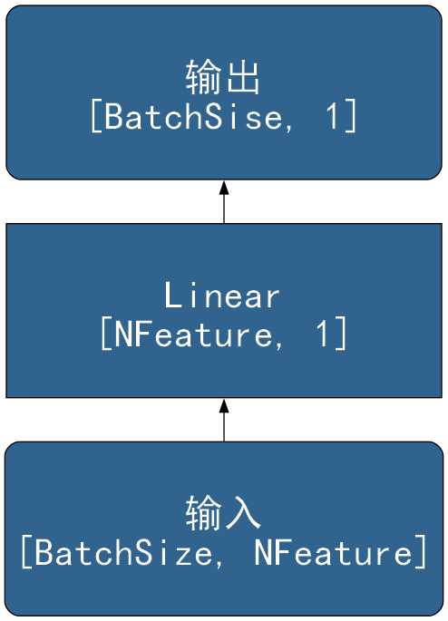
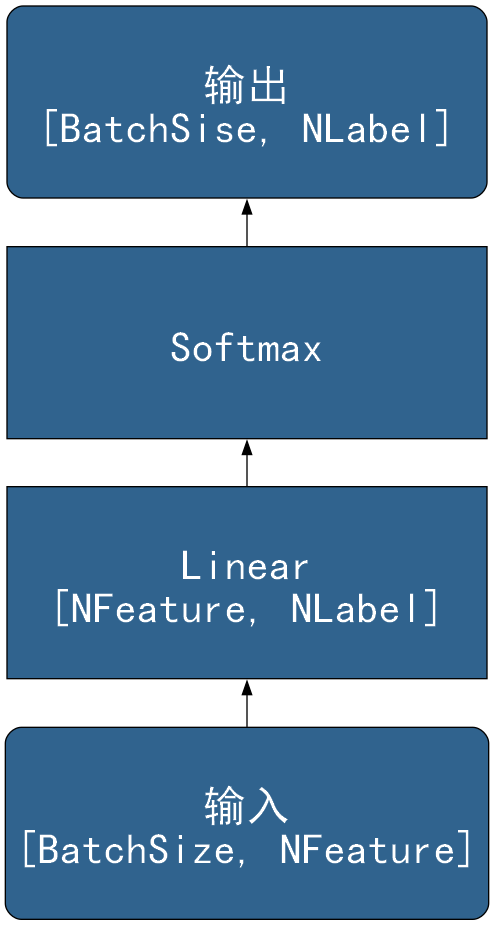

# 经典神经网络架构参考

## 一、线性模型

### 1.1 线性回归



```
digraph LinearRegression {
	rankdir=BT
    node [
		style=filled, 
		color=Black
		fontcolor=White, 
		fillcolor="#30638e", 
		fontname="SimHei",
		fontsize=32,
		width=5, height=2,
		shape="box",
	]
	
	
	inp [label="输入\n[BatchSize, NFeature]", shape="Mrecord"]
	ll  [label="Linear\n[NFeature, 1]"]
	oup [label="输出\n[BatchSise, 1]", shape="Mrecord"]
	
	inp -> ll -> oup
}
```

### 1.2 逻辑回归



```
digraph SoftmaxRegression {
	rankdir=BT
    node [
		style=filled, 
		color=Black
		fontcolor=White, 
		fillcolor="#30638e", 
		fontname="SimHei",
		fontsize=32,
		width=5, height=2,
		shape="box",
	]
	
	
	inp     [label="输入\n[BatchSize, NFeature]", shape="Mrecord"]
	ll      [label="Linear\n[NFeature, NLabel]"]
	softmax [label="Softmax"]
	oup     [label="输出\n[BatchSise, NLabel]", shape="Mrecord"]
	
	inp -> ll -> softmax -> oup
}
```