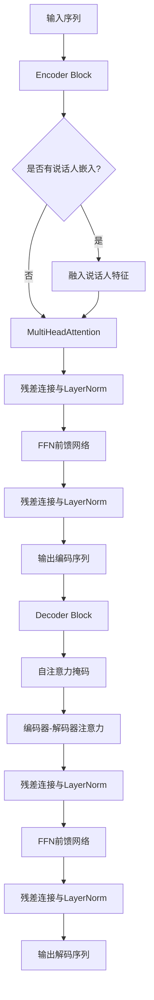
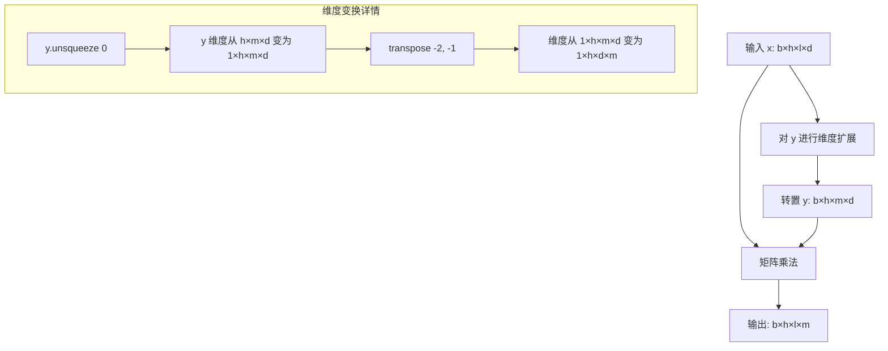
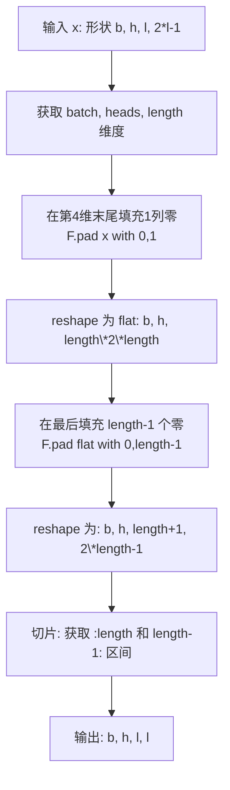
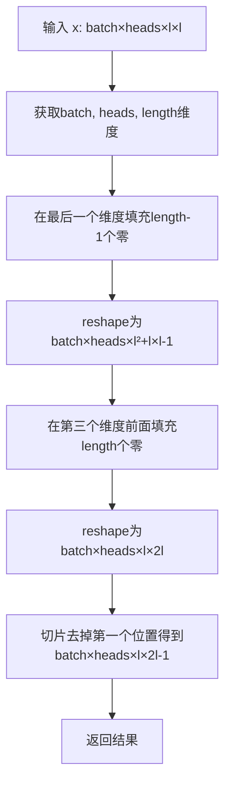
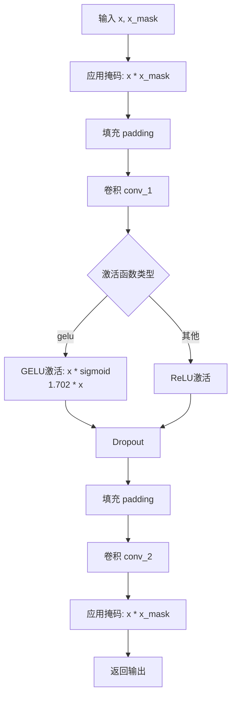

# `Bert-VITS2\attentions.py` 详细设计文档

该代码实现了一套基于Transformer架构的神经网络模块，包括层归一化、多头注意力机制、前馈神经网络、编码器和解码器，用于语音合成或序列到序列任务，支持相对位置编码、因果卷积和说话人嵌入等高级特性。

## 整体流程



## 类结构

```
nn.Module (PyTorch基类)
├── LayerNorm (层归一化)
├── Encoder (Transformer编码器)
│   ├── MultiHeadAttention
│   ├── LayerNorm
│   └── FFN
├── Decoder (Transformer解码器)
│   ├── MultiHeadAttention (自注意力)
 │   ├── MultiHeadAttention (编码器-解码器注意力)
│   ├── LayerNorm
│   └── FFN
├── MultiHeadAttention (多头注意力)
└── FFN (前馈神经网络)
```

## 全局变量及字段


### `logger`
    
模块级日志记录器

类型：`logging.Logger`
    


### `LayerNorm.channels`
    
输入通道数

类型：`int`
    


### `LayerNorm.eps`
    
数值稳定项，默认为1e-5

类型：`float`
    


### `LayerNorm.gamma`
    
可学习缩放参数

类型：`nn.Parameter`
    


### `LayerNorm.beta`
    
可学习偏移参数

类型：`nn.Parameter`
    


### `Encoder.hidden_channels`
    
隐藏层维度

类型：`int`
    


### `Encoder.filter_channels`
    
前馈网络过滤器维度

类型：`int`
    


### `Encoder.n_heads`
    
注意力头数

类型：`int`
    


### `Encoder.n_layers`
    
编码器层数

类型：`int`
    


### `Encoder.kernel_size`
    
卷积核大小

类型：`int`
    


### `Encoder.p_dropout`
    
dropout概率

类型：`float`
    


### `Encoder.window_size`
    
相对注意力窗口大小

类型：`int`
    


### `Encoder.cond_layer_idx`
    
条件嵌入层索引

类型：`int`
    


### `Encoder.gin_channels`
    
说话人嵌入通道数

类型：`int`
    


### `Encoder.spk_emb_linear`
    
说话人嵌入线性层

类型：`nn.Linear`
    


### `Encoder.drop`
    
Dropout层

类型：`nn.Dropout`
    


### `Encoder.attn_layers`
    
多头注意力层列表

类型：`nn.ModuleList`
    


### `Encoder.norm_layers_1`
    
注意力后归一化层列表

类型：`nn.ModuleList`
    


### `Encoder.ffn_layers`
    
前馈网络层列表

类型：`nn.ModuleList`
    


### `Encoder.norm_layers_2`
    
FFN后归一化层列表

类型：`nn.ModuleList`
    


### `Decoder.hidden_channels`
    
隐藏层维度

类型：`int`
    


### `Decoder.filter_channels`
    
前馈网络过滤器维度

类型：`int`
    


### `Decoder.n_heads`
    
注意力头数

类型：`int`
    


### `Decoder.n_layers`
    
解码器层数

类型：`int`
    


### `Decoder.kernel_size`
    
卷积核大小

类型：`int`
    


### `Decoder.p_dropout`
    
dropout概率

类型：`float`
    


### `Decoder.proximal_bias`
    
是否使用近邻偏置

类型：`bool`
    


### `Decoder.proximal_init`
    
是否使用近邻初始化

类型：`bool`
    


### `Decoder.drop`
    
Dropout层

类型：`nn.Dropout`
    


### `Decoder.self_attn_layers`
    
自注意力层列表

类型：`nn.ModuleList`
    


### `Decoder.norm_layers_0`
    
自注意力后归一化层列表

类型：`nn.ModuleList`
    


### `Decoder.encdec_attn_layers`
    
编码器-解码器注意力层列表

类型：`nn.ModuleList`
    


### `Decoder.norm_layers_1`
    
编码器-解码器注意力后归一化层列表

类型：`nn.ModuleList`
    


### `Decoder.ffn_layers`
    
前馈网络层列表

类型：`nn.ModuleList`
    


### `Decoder.norm_layers_2`
    
FFN后归一化层列表

类型：`nn.ModuleList`
    


### `MultiHeadAttention.channels`
    
输入通道数

类型：`int`
    


### `MultiHeadAttention.out_channels`
    
输出通道数

类型：`int`
    


### `MultiHeadAttention.n_heads`
    
注意力头数

类型：`int`
    


### `MultiHeadAttention.p_dropout`
    
dropout概率

类型：`float`
    


### `MultiHeadAttention.window_size`
    
相对注意力窗口大小

类型：`int`
    


### `MultiHeadAttention.heads_share`
    
头之间是否共享相对位置嵌入

类型：`bool`
    


### `MultiHeadAttention.block_length`
    
局部注意力块长度

类型：`int`
    


### `MultiHeadAttention.proximal_bias`
    
是否使用近邻偏置

类型：`bool`
    


### `MultiHeadAttention.proximal_init`
    
是否使用近邻初始化

类型：`bool`
    


### `MultiHeadAttention.attn`
    
注意力权重缓存

类型：`Tensor`
    


### `MultiHeadAttention.k_channels`
    
每个头的key维度

类型：`int`
    


### `MultiHeadAttention.conv_q`
    
查询投影卷积

类型：`nn.Conv1d`
    


### `MultiHeadAttention.conv_k`
    
键投影卷积

类型：`nn.Conv1d`
    


### `MultiHeadAttention.conv_v`
    
值投影卷积

类型：`nn.Conv1d`
    


### `MultiHeadAttention.conv_o`
    
输出投影卷积

类型：`nn.Conv1d`
    


### `MultiHeadAttention.drop`
    
Dropout层

类型：`nn.Dropout`
    


### `MultiHeadAttention.emb_rel_k`
    
键的相对位置嵌入

类型：`nn.Parameter`
    


### `MultiHeadAttention.emb_rel_v`
    
值的相对位置嵌入

类型：`nn.Parameter`
    


### `FFN.in_channels`
    
输入通道数

类型：`int`
    


### `FFN.out_channels`
    
输出通道数

类型：`int`
    


### `FFN.filter_channels`
    
隐藏层过滤器维度

类型：`int`
    


### `FFN.kernel_size`
    
卷积核大小

类型：`int`
    


### `FFN.p_dropout`
    
dropout概率

类型：`float`
    


### `FFN.activation`
    
激活函数类型

类型：`str`
    


### `FFN.causal`
    
是否使用因果卷积

类型：`bool`
    


### `FFN.padding`
    
填充函数

类型：`Callable`
    


### `FFN.conv_1`
    
第一个卷积层

类型：`nn.Conv1d`
    


### `FFN.conv_2`
    
第二个卷积层

类型：`nn.Conv1d`
    


### `FFN.drop`
    
Dropout层

类型：`nn.Dropout`
    
    

## 全局函数及方法


### `fused_add_tanh_sigmoid_multiply`

融合的tanh-sigmoid激活函数计算，用于WaveNet等神经网络模型，通过将tanh和sigmoid激活结果逐元素相乘，实现高效的gate激活机制，减少内存访问和计算开销。

参数：

- `input_a`：`Tensor`，第一个输入张量，通常为上一层输出或残差连接的主路径激活
- `input_b`：`Tensor`，第二个输入张量，通常为残差连接的辅助路径激活
- `n_channels`：`Tensor`，包含通道数的标量张量，用于将输入分割为tanh和sigmoid两部分

返回值：`Tensor`，返回tanh激活与sigmoid激活逐元素相乘后的结果张量，形状与输入张量一致

#### 流程图

```mermaid
flowchart TD
    A[input_a: Tensor] --> D
    B[input_b: Tensor] --> D
    D[in_act = input_a + input_b] --> E[通道分割]
    E --> F[t_act = tanh in_act[:n_channels]]
    E --> G[s_act = sigmoid in_act[n_channels:]]
    F --> H[acts = t_act * s_act]
    G --> H
    H --> I[return acts: Tensor]
```

#### 带注释源码

```python
@torch.jit.script  # 使用TorchScript编译装饰器，提升执行效率并支持模型导出
def fused_add_tanh_sigmoid_multiply(input_a, input_b, n_channels):
    """
    融合的tanh-sigmoid乘法计算，用于WaveNet的 gating 机制
    
    该函数将传统的两段独立计算（tanh激活 + sigmoid激活 + 逐元素相乘）
    融合为单次 kernel 执行，减少 GPU kernel _launch 开销和中间显存占用
    
    参数:
        input_a: 第一个输入张量，形状通常为 [B, C, T]
        input_b: 第二个输入张量，形状通常为 [B, C, T]
        n_channels: 通道数标量张量，用于指定gate分割位置
    
    返回:
        融合激活结果，形状为 [B, C, T]
    """
    # 从张量中提取通道数整数值为标量
    n_channels_int = n_channels[0]
    
    # 输入激活相加（残差连接或输入融合）
    in_act = input_a + input_b
    
    # 对前半部分通道应用tanh激活（value分支）
    t_act = torch.tanh(in_act[:, :n_channels_int, :])
    
    # 对后半部分通道应用sigmoid激活（gate分支）
    s_act = torch.sigmoid(in_act[:, n_channels_int:, :])
    
    # 逐元素相乘，实现 gated activation
    acts = t_act * s_act
    
    return acts
```

#### 设计说明

| 特性 | 说明 |
|------|------|
| **融合目的** | WaveNet模型中经典的gated activation需要计算 `tanh(W*f) * sigmoid(W*g)`，融合计算可减少kernel launch次数 |
| **通道分割** | 输入通道数需为 `2 * n_channels`，前半部分作为value，后半部分作为gate |
| **TorchScript** | 装饰器 `@torch.jit.script` 使函数被JIT编译，可获得GPU优化和Python-free导出能力 |
| **典型应用** | VITS、Glow-TTS等基于Flow的声码器模型中的激活层 |


### `LayerNorm.forward`

执行层归一化（Layer Normalization），对输入张量在特征维度上进行标准化处理，使用可学习的缩放参数（gamma）和偏移参数（beta），并通过转置操作确保在正确的维度上应用归一化。

参数：

- `x`：`Tensor`，输入张量，形状为 (batch, channels, time) 或类似的多维张量

返回值：`Tensor`，返回经过层归一化处理后的张量，形状与输入张量相同

#### 流程图

```mermaid
flowchart TD
    A[输入张量 x] --> B[transpose: (1, -1)<br/>将通道维移到最后]
    B --> C[F.layer_norm<br/>应用 PyTorch 层归一化]
    C --> D[参数: channels, gamma, beta, eps]
    D --> E[transpose: (1, -1)<br/>恢复原始维度顺序]
    E --> F[输出归一化后的张量]
```

#### 带注释源码

```python
def forward(self, x):
    """
    执行层归一化的前向传播
    
    参数:
        x: 输入张量，形状为 (batch, channels, time) 或类似多维张量
    
    返回:
        经过层归一化后的张量，形状与输入相同
    """
    # 第一次转置：将通道维从位置1移到最后位置
    # 输入形状: (batch, channels, time) -> (batch, time, channels)
    x = x.transpose(1, -1)
    
    # 调用 PyTorch 的 F.layer_norm 进行层归一化
    # 参数:
    #   - x: 转置后的张量，形状 (batch, time, channels)
    #   - (self.channels,): 归一化的特征维度大小
    #   - self.gamma: 可学习的缩放参数 (scale)，初始值为全1
    #   - self.beta: 可学习的偏移参数 (bias)，初始值为全0
    #   - self.eps: 防止除零的小常数，默认1e-5
    x = F.layer_norm(x, (self.channels,), self.gamma, self.beta, self.eps)
    
    # 第二次转置：恢复原始的维度顺序
    # (batch, time, channels) -> (batch, channels, time)
    return x.transpose(1, -1)
```


### `Encoder.forward`

编码器前向传播方法，执行自注意力机制和前馈网络处理输入序列，支持可选的说话人嵌入条件化，最终输出编码后的序列表示。

参数：

- `x`：`Tensor`，输入特征序列，形状为 [batch, channels, time]
- `x_mask`：`Tensor`，输入掩码，用于标识有效时间步，形状为 [batch, 1, time]
- `g`：`Tensor`，可选的说话人嵌入，形状为 [batch, gin_channels, 1]，默认为 None

返回值：`Tensor`，编码后的特征序列，形状为 [batch, hidden_channels, time]

#### 流程图

```mermaid
flowchart TD
    A[输入 x, x_mask, g] --> B[创建注意力掩码<br/>attn_mask = x_mask.unsqueeze(2) × x_mask.unsqueeze(-1)]
    B --> C[应用输入掩码<br/>x = x × x_mask]
    C --> D{i < n_layers}
    D -->|是| E{i == cond_layer_idx<br/>且 g 不为 None?}
    E -->|是| F[说话人嵌入线性变换<br/>g = spk_emb_linear(g.transpose(1,2)).transpose(1,2)]
    F --> G[融合说话人嵌入<br/>x = x + g]
    G --> H[再次掩码<br/>x = x × x_mask]
    H --> I[自注意力层<br/>y = attn_layers[i](x, x, attn_mask)]
    I --> J[Dropout<br/>y = drop(y)]
    J --> K[残差连接与归一化<br/>x = norm_layers_1[i](x + y)]
    K --> L[前馈网络<br/>y = ffn_layers[i](x, x_mask)]
    L --> M[Dropout<br/>y = drop(y)]
    M --> N[残差连接与归一化<br/>x = norm_layers_2[i](x + y)]
    N --> D
    E -->|否| I
    D -->|否| O[最终掩码处理<br/>x = x × x_mask]
    O --> P[返回编码结果]
```

#### 带注释源码

```python
def forward(self, x, x_mask, g=None):
    """
    编码器前向传播
    
    参数:
        x: 输入特征 [batch, channels, time]
        x_mask: 输入掩码 [batch, 1, time]
        g: 可选的说话人嵌入 [batch, gin_channels, 1]
    
    返回:
        编码后的特征 [batch, hidden_channels, time]
    """
    # 1. 创建注意力掩码：将x_mask扩展为二维掩码矩阵
    # 用于注意力计算时屏蔽无效位置
    attn_mask = x_mask.unsqueeze(2) * x_mask.unsqueeze(-1)
    
    # 2. 应用输入掩码：将padding位置置零
    x = x * x_mask
    
    # 3. 遍历每一层编码器块
    for i in range(self.n_layers):
        # 4. 条件处理：在指定层加入说话人嵌入
        if i == self.cond_layer_idx and g is not None:
            # 说话人嵌入线性变换: [batch, gin_channels, 1] -> [batch, hidden_channels, 1]
            g = self.spk_emb_linear(g.transpose(1, 2))
            g = g.transpose(1, 2)
            # 残差连接：将说话人信息融入主特征
            x = x + g
            # 重新应用掩码
            x = x * x_mask
        
        # 5. 自注意力层：捕捉序列内的依赖关系
        # query, key, value 均来自输入 x
        y = self.attn_layers[i](x, x, attn_mask)
        # Dropout 正则化
        y = self.drop(y)
        # 残差连接 + 层归一化
        x = self.norm_layers_1[i](x + y)
        
        # 6. 前馈网络层：特征变换与非线性映射
        y = self.ffn_layers[i](x, x_mask)
        # Dropout 正则化
        y = self.drop(y)
        # 残差连接 + 层归一化
        x = self.norm_layers_2[i](x + y)
    
    # 7. 最终输出掩码处理
    x = x * x_mask
    return x
```


### Decoder.forward

该方法是Transformer架构中解码器（Decoder）的前向传播函数，接收编码器输出和 decoder 输入，通过自注意力机制、编码器-解码器注意力机制和前馈网络的多次堆叠，实现序列到序列的转换，是VITS语音合成模型的核心组件。

参数：

- `x`：`Tensor`，decoder 输入序列，形状为 [batch, hidden_channels, time_steps]
- `x_mask`：`Tensor`，decoder 输入的掩码，用于标识有效时间步，形状为 [batch, 1, time_steps]
- `h`：`Tensor`，encoder 输出，形状为 [batch, hidden_channels, encoder_time_steps]
- `h_mask`：`Tensor`，encoder 输出的掩码，用于标识有效时间步，形状为 [batch, 1, encoder_time_steps]

返回值：`Tensor`，解码后的隐藏状态序列，形状为 [batch, hidden_channels, time_steps]

#### 流程图

```mermaid
flowchart TD
    A[开始 Decoder.forward] --> B[生成自注意力掩码 self_attn_mask]
    B --> C[生成编码器-解码器注意力掩码 encdec_attn_mask]
    C --> D[应用输入掩码: x = x * x_mask]
    D --> E{循环 i in range(n_layers)}
    E --> F[自注意力层: y = self_attn_layersi]
    F --> G[Dropout: y = drop(y)]
    G --> H[残差连接与归一化: x = norm_layers_0i]
    H --> I[编码器-解码器注意力: y = encdec_attn_layersi]
    I --> J[Dropout: y = drop(y)]
    J --> K[残差连接与归一化: x = norm_layers_1i]
    K --> L[前馈网络: y = ffn_layersi]
    L --> M[Dropout: y = drop(y)]
    M --> N[残差连接与归一化: x = norm_layers_2i]
    N --> O{循环结束?}
    O -->|否| E
    O -->|是| P[最终掩码: x = x * x_mask]
    P --> Q[返回输出 Tensor]
```

#### 带注释源码

```python
def forward(self, x, x_mask, h, h_mask):
    """
    x: decoder input
    h: encoder output
    """
    # 生成自注意力掩码，用于掩盖后续位置，实现因果注意力
    # 使用 subsequent_mask 生成下三角掩码
    self_attn_mask = commons.subsequent_mask(x_mask.size(2)).to(
        device=x.device, dtype=x.dtype
    )
    # 生成编码器-解码器注意力掩码
    # 形状: [batch, 1, decoder_time] * [batch, encoder_time, 1] -> [batch, decoder_time, encoder_time]
    encdec_attn_mask = h_mask.unsqueeze(2) * x_mask.unsqueeze(-1)
    
    # 对输入应用掩码，将填充位置置零
    x = x * x_mask
    
    # 遍历每一层解码器层
    for i in range(self.n_layers):
        # === 自注意力层 (Self-Attention) ===
        # 计算自注意力，查询、键、值都来自 decoder 输入 x
        y = self.self_attn_layers[i](x, x, self_attn_mask)
        # 应用 dropout 正则化
        y = self.drop(y)
        # 残差连接后进行层归一化
        x = self.norm_layers_0[i](x + y)

        # === 编码器-解码器注意力层 (Encoder-Decoder Attention) ===
        # 查询来自 decoder 状态 x，键和值来自 encoder 输出 h
        y = self.encdec_attn_layers[i](x, h, encdec_attn_mask)
        y = self.drop(y)
        # 残差连接后进行层归一化
        x = self.norm_layers_1[i](x + y)

        # === 前馈网络层 (FFN) ===
        # 两层卷积网络，包含激活函数
        y = self.ffn_layers[i](x, x_mask)
        y = self.drop(y)
        # 残差连接后进行层归一化
        x = self.norm_layers_2[i](x + y)
    
    # 最终应用掩码，确保输出与输入长度对齐
    x = x * x_mask
    return x
```


### `MultiHeadAttention.forward`

该方法实现了多头注意力机制的前向传播，将输入通过三个卷积层分别生成查询、键和值，然后通过注意力计算模块处理，最后通过输出卷积层生成最终输出。

#### 参数

- **`x`**：`Tensor`，查询（Query）输入张量，形状为 [batch, channels, time]
- **`c`**：`Tensor`，键（Key）和值（Value）输入张量，形状为 [batch, channels, time]
- **`attn_mask`**：`Tensor`，可选，注意力掩码，用于屏蔽某些位置的张量，形状为 [batch, time, time]

#### 返回值

`Tensor`，多头注意力机制的输出，形状为 [batch, out_channels, time]

#### 流程图

```mermaid
flowchart TD
    A[输入 x, c, attn_mask] --> B[conv_q: x → q]
    A --> C[conv_k: c → k]
    A --> D[conv_v: c → v]
    
    B --> E[attention函数]
    C --> E
    D --> E
    E --> F{attn_mask存在?}
    F -->|是| G[应用掩码到scores]
    F -->|否| H[直接计算softmax]
    
    G --> H
    H --> I[softmax → p_attn]
    I --> J[dropout p_attn]
    J --> K[matmul: p_attn × value]
    K --> L[相对位置编码处理<br/>window_size不为空?]
    L -->|是| M[添加相对位置偏置]
    L -->|否| N[跳过相对位置处理]
    
    M --> O[reshape: [b, n_h, t_t, d_k] → [b, d, t_t]]
    N --> O
    
    O --> P[conv_o: 输出投影]
    P --> Q[返回 Tensor]
```

#### 带注释源码

```python
def forward(self, x, c, attn_mask=None):
    """
    多头注意力前向传播
    
    参数:
        x: 查询张量 [batch, channels, time]
        c: 键和值张量 [batch, channels, time]
        attn_mask: 可选掩码 [batch, time, time]
    
    返回:
        输出张量 [batch, out_channels, time]
    """
    # 第一步：通过卷积层生成查询、键、值
    # 使用三个1D卷积将输入通道转换为注意力所需的表示
    q = self.conv_q(x)  # [b, channels, t] → [b, channels, t]
    k = self.conv_k(c)  # [b, channels, t] → [b, channels, t]
    v = self.conv_v(c)  # [b, channels, t] → [b, channels, t]

    # 第二步：调用attention方法计算注意力输出和注意力权重
    # self.attn 保存了注意力权重用于可视化或后续分析
    x, self.attn = self.attention(q, k, v, mask=attn_mask)

    # 第三步：通过输出卷积层将注意力输出转换为目标输出通道数
    x = self.conv_o(x)  # [b, channels, t] → [b, out_channels, t]
    return x
```


### `MultiHeadAttention.attention`

该方法实现了多头注意力机制（Multi-Head Attention）的核心计算逻辑。通过对查询（Query）、键（Key）、值（Value）进行线性变换和分头处理，计算token之间的相关性分数（attention scores），并结合相对位置编码、邻近偏置和掩码进行修正。最终通过Softmax归一化并dropout后，将注意力权重应用于值（Value）得到上下文相关的输出表示，同时返回注意力权重矩阵以供分析或可视化。

参数：

- `query`：`Tensor`，输入的查询张量，形状通常为 `[batch, channels, time]`（来自 `conv_q` 的输出）。
- `key`：`Tensor`，输入的键张量，形状通常为 `[batch, channels, time]`（来自 `conv_k` 的输出）。
- `value`：`Tensor`，输入的值张量，形状通常为 `[batch, channels, time]`（来自 `conv_v` 的输出）。
- `mask`：`Tensor`，可选的注意力掩码（Attention Mask），用于屏蔽无效位置（如padding），默认为 `None`。

返回值：`Tuple[Tensor, Tensor]`
- 第一个元素：`Tensor`，加权求和后的输出，形状为 `[batch, channels, time]`。
- 第二个元素：`Tensor`，注意力权重矩阵 `p_attn`，形状为 `[batch, n_heads, target_time, source_time]`。

#### 流程图

```mermaid
graph TD
    A[开始: 输入 Q, K, V] --> B[Reshape: 维度重塑与转置]
    B --> C[计算基础分数: Scores = Q x K^T / sqrt(d_k)]
    C --> D{是否配置了相对位置编码 window_size?}
    D -- 是 --> E[计算相对位置Logits并叠加到Scores]
    D -- 否 --> F{是否启用Proximal Bias?}
    F -- 是 --> G[叠加邻近位置偏置]
    F -- 否 --> H{是否传入Mask?}
    H -- 是 --> I[应用Mask与Block Mask]
    H -- 否 --> J[Softmax与Dropout]
    I --> J
    G --> J
    E --> J
    J --> K[计算输出: Output = Attn x V]
    K --> L{是否配置了相对位置编码?}
    L -- 是 --> M[叠加相对位置Value并得到最终Output]
    L -- 否 --> N[Reshape: 恢复原始维度]
    M --> N
    N --> O[返回 Output 与 Attention Weights]
```

#### 带注释源码

```python
def attention(self, query, key, value, mask=None):
    # 1. 维度变换：将 [batch, channels, time] 转换为 [batch, n_heads, time, k_channels]
    # 其中 k_channels = channels / n_heads
    b, d, t_s, t_t = (*key.size(), query.size(2))
    query = query.view(b, self.n_heads, self.k_channels, t_t).transpose(2, 3)
    key = key.view(b, self.n_heads, self.k_channels, t_s).transpose(2, 3)
    value = value.view(b, self.n_heads, self.k_channels, t_s).transpose(2, 3)

    # 2. 计算注意力分数 (Attention Scores): Q * K^T，并进行缩放防止梯度消失
    scores = torch.matmul(query / math.sqrt(self.k_channels), key.transpose(-2, -1))
    
    # 3. 处理相对位置编码 (Relative Position Encoding) - 如果启用
    if self.window_size is not None:
        # 验证：相对位置编码通常只用于自注意力 (source_len == target_len)
        assert (
            t_s == t_t
        ), "Relative attention is only available for self-attention."
        # 获取相对位置的key嵌入并计算logits
        key_relative_embeddings = self._get_relative_embeddings(self.emb_rel_k, t_s)
        rel_logits = self._matmul_with_relative_keys(
            query / math.sqrt(self.k_channels), key_relative_embeddings
        )
        # 将相对位置logits转换为绝对位置logits并叠加
        scores_local = self._relative_position_to_absolute_position(rel_logits)
        scores = scores + scores_local
        
    # 4. 处理邻近偏置 (Proximal Bias) - 如果启用，鼓励模型关注相近的位置
    if self.proximal_bias:
        assert t_s == t_t, "Proximal bias is only available for self-attention."
        scores = scores + self._attention_bias_proximal(t_s).to(
            device=scores.device, dtype=scores.dtype
        )
        
    # 5. 应用掩码 (Masking) - 屏蔽无效区域或实现局部注意力
    if mask is not None:
        # 将mask为0的位置设为极小值(-1e4)，使其在Softmax后概率接近0
        scores = scores.masked_fill(mask == 0, -1e4)
        if self.block_length is not None:
            # 实现块状局部注意力 (Block Attention)
            assert (
                t_s == t_t
            ), "Local attention is only available for self-attention."
            # 创建下三角矩阵，保留block_length以内的注意力
            block_mask = (
                torch.ones_like(scores)
                .triu(-self.block_length)
                .tril(self.block_length)
            )
            scores = scores.masked_fill(block_mask == 0, -1e4)
            
    # 6. Softmax 归一化得到概率分布，并应用 Dropout
    p_attn = F.softmax(scores, dim=-1)  # [b, n_h, t_t, t_s]
    p_attn = self.drop(p_attn)
    
    # 7. 加权求和：概率分布乘以Value得到输出
    output = torch.matmul(p_attn, value)
    
    # 8. 处理相对位置编码的输出部分 - 如果启用
    if self.window_size is not None:
        # 将注意力权重从绝对位置转换回相对位置
        relative_weights = self._absolute_position_to_relative_position(p_attn)
        value_relative_embeddings = self._get_relative_embeddings(
            self.emb_rel_v, t_s
        )
        # 叠加相对位置的Value信息
        output = output + self._matmul_with_relative_values(
            relative_weights, value_relative_embeddings
        )
        
    # 9. 维度恢复：从 [batch, n_heads, time, k_channels] 变回 [batch, channels, time]
    output = (
        output.transpose(2, 3).contiguous().view(b, d, t_t)
    )  # [b, n_h, t_t, d_k] -> [b, d, t_t]
    return output, p_attn
```


### `MultiHeadAttention._matmul_with_relative_values`

该方法实现了相对位置注意力机制（Relative Position Attention）中的核心运算，即**相对值矩阵乘法**。它将相对注意力权重（relative attention weights）与相对位置的值嵌入（relative value embeddings）进行矩阵相乘，从而在计算上下文向量时引入相对位置偏移信息。

参数：

- `x`：`Tensor`，形状为 `[b, h, l, m]`。其中 `b` 表示批量大小（batch size），`h` 表示注意力头数（heads），`l` 表示目标序列长度（query length），`m` 表示相对位置的维度（通常为 `2 * window_size + 1`）。代表相对注意力权重矩阵。
- `y`：`Tensor`，形状为 `[h or 1, m, d]`。其中 `d` 表示值的维度（value dimension）。代表相对位置的值嵌入向量。如果 `heads_share` 为真，`y` 的第一维为 `h`，否则为 1。

返回值：`Tensor`，形状为 `[b, h, l, d]`。返回经过相对位置加权后的上下文向量（context vector）。

#### 流程图

```mermaid
graph LR
    A[输入 x: 相对注意力权重, y: 相对值嵌入] --> B{执行 y.unsqueeze(0) 扩展维度}
    B --> C[执行 torch.matmul 矩阵乘法]
    C --> D[返回结果 Tensor]
```

#### 带注释源码

```python
def _matmul_with_relative_values(self, x, y):
    """
    实现相对值的矩阵乘法。
    x: [b, h, l, m] - 相对注意力权重 (relative attention weights)
    y: [h or 1, m, d] - 相对值嵌入 (relative value embeddings)
    ret: [b, h, l, d] - 加权后的输出上下文向量
    """
    # 对 y 在第 0 维进行扩展（unsqueeze），将其形状从 [h, m, d] 变为 [1, h, m, d]
    # 这样可以利用 PyTorch 的广播机制，与 x [b, h, l, m] 进行批量矩阵相乘。
    # 相乘结果形状为 [b, h, l, d]。
    ret = torch.matmul(x, y.unsqueeze(0))
    return ret
```


### `MultiHeadAttention._matmul_with_relative_keys`

该方法执行相对键（relative keys）的矩阵乘法运算，用于在自注意力机制中引入相对位置编码。通过计算查询向量与相对位置嵌入键的乘积，得到相对位置注意力分数（rel_logits），后续会与绝对位置注意力分数相加。

参数：
- `x`：`Tensor`，形状为 `[b, h, l, d]`，其中 b 是 batch size，h 是注意力头数，l 是序列长度，d 是每个头的维度（k_channels）
- `y`：`Tensor`，形状为 `[h or 1, m, d]`，其中 h 或 1 是注意力头数（取决于 heads_share 参数），m 是相对位置数量（通常为 2*window_size+1），d 是每个头的维度

返回值：`Tensor`，形状为 `[b, h, l, m]`，返回相对位置的注意力 logits

#### 流程图



#### 带注释源码

```python
def _matmul_with_relative_keys(self, x, y):
    """
    执行相对键的矩阵乘法，用于计算相对位置编码的注意力分数
    
    参数:
        x: [b, h, l, d] - 归一化后的查询向量
        y: [h or 1, m, d] - 相对位置键嵌入，h 或 1 取决于 heads_share
    返回:
        ret: [b, h, l, m] - 相对位置注意力 logits
    """
    # y.unsqueeze(0) 将 y 从 [h, m, d] 扩展为 [1, h, m, d]
    # transpose(-2, -1) 将最后两个维度交换，从 [1, h, m, d] 变为 [1, h, d, m]
    # 这样可以进行矩阵乘法: [b, h, l, d] @ [1, h, d, m] -> [b, h, l, m]
    ret = torch.matmul(x, y.unsqueeze(0).transpose(-2, -1))
    return ret
```


### `MultiHeadAttention._get_relative_embeddings`

该方法用于从预定义的相对位置嵌入表中提取指定长度的嵌入向量，处理序列长度与窗口大小不匹配时的填充和切片逻辑，确保相对位置注意力机制能够适应不同长度的输入序列。

参数：

- `relative_embeddings`：`torch.Tensor`，形状为 `[n_heads_rel, window_size * 2 + 1, k_channels]` 的相对位置嵌入参数，包含从头尾两个方向的相对位置编码
- `length`：`int`，目标嵌入的长度，通常对应输入序列的时间步长

返回值：`torch.Tensor`，形状为 `[n_heads_rel, 2 * length - 1, k_channels]` 的提取后的相对位置嵌入，用于后续相对位置注意力计算

#### 流程图

```mermaid
flowchart TD
    A[开始: _get_relative_embeddings] --> B[计算pad_length]
    B --> B1{length > window_size + 1?}
    
    B1 -- Yes --> C[需要填充]
    B1 -- No --> D[不需要填充]
    
    C --> E[计算slice_start_position]
    D --> E
    
    E --> F[计算slice_end_position]
    F --> G{pad_length > 0?}
    
    G -- Yes --> H[使用F.pad填充relative_embeddings]
    G -- No --> I[直接使用relative_embeddings]
    
    H --> J[获取切片: padded_relative_embeddings[:, slice_start:slice_end]]
    I --> J
    
    J --> K[返回 used_relative_embeddings]
```

#### 带注释源码

```python
def _get_relative_embeddings(self, relative_embeddings, length):
    """
    从预定义的相对位置嵌入表中提取指定长度的嵌入向量。
    
    该方法处理序列长度与预设窗口大小不匹配的情况，通过填充和切片
    提取出与当前输入序列长度相对应的相对位置嵌入向量。
    
    参数:
        relative_embeddings: 形状为 [n_heads_rel, window_size*2+1, k_channels] 
                            的相对位置嵌入参数
        length: 目标嵌入的长度，通常等于输入序列的时间步数
    
    返回:
        形状为 [n_heads_rel, 2*length-1, k_channels] 的相对位置嵌入
    """
    # 计算完整的相对位置范围长度 (2 * window_size + 1)
    # 注：原代码中此行未赋值给变量，可能是冗余代码或意图不明确
    2 * self.window_size + 1
    
    # 计算需要填充的长度，确保提取的嵌入能覆盖length范围内的所有相对位置
    # 例如当length较小(小于window_size+1)时，需要正向填充来调整索引
    pad_length = max(length - (self.window_size + 1), 0)
    
    # 计算切片起始位置，当length小于等于window_size时，slice从非0位置开始
    # 这样可以确保提取的嵌入范围正确覆盖[-(length-1), length-1]的相对位置
    slice_start_position = max((self.window_size + 1) - length, 0)
    
    # 计算切片结束位置，范围为[slice_start, slice_start + 2*length - 1]
    # 这确保了提取的嵌入可以表示2*length-1个相对位置
    slice_end_position = slice_start_position + 2 * length - 1
    
    # 如果需要填充，在嵌入的两侧进行对称填充
    # 填充长度为pad_length，这样切片后的长度正好为2*length-1
    if pad_length > 0:
        padded_relative_embeddings = F.pad(
            relative_embeddings,
            commons.convert_pad_shape([[0, 0], [pad_length, pad_length], [0, 0]]),
        )
    else:
        # 不需要填充时直接使用原始嵌入
        padded_relative_embeddings = relative_embeddings
    
    # 从填充后的嵌入中切取出需要的范围
    used_relative_embeddings = padded_relative_embeddings[
        :, slice_start_position:slice_end_position
    ]
    
    return used_relative_embeddings
```


### `MultiHeadAttention._relative_position_to_absolute_position`

该方法用于将相对位置编码（relative position）转换为绝对位置编码（absolute position），在多头注意力机制中处理相对位置嵌入时调用。

参数：

-  `self`：类的实例方法隐含参数
-  `x`：`Tensor`，输入张量，形状为 `[b, h, l, 2*l-1]`，其中 b 为批量大小，h 为注意力头数，l 为序列长度，第四维为相对位置范围

返回值：`Tensor`，输出张量，形状为 `[b, h, l, l]`，即转换后的绝对位置编码

#### 流程图



#### 带注释源码

```python
def _relative_position_to_absolute_position(self, x):
    """
    x: [b, h, l, 2*l-1]
    ret: [b, h, l, l]
    """
    # 获取输入张量的维度信息
    batch, heads, length, _ = x.size()
    
    # 步骤1：在第4维（相对位置维度）的末尾填充一列零
    # 作用：从相对索引转向绝对索引
    # 原形状 [b, h, l, 2*l-1] -> [b, h, l, 2*l]
    x = F.pad(x, commons.convert_pad_shape([[0, 0], [0, 0], [0, 0], [0, 1]]))

    # 步骤2：将张量展平为2D形状，为后续填充做准备
    # 形状从 [b, h, l, 2*l] -> [b, h, l*2*l]
    x_flat = x.view([batch, heads, length * 2 * length])
    
    # 步骤3：在序列长度维度填充，使总长度达到 length+1
    # 为后续 reshape 到 (len+1, 2*len-1) 做准备
    x_flat = F.pad(
        x_flat, commons.convert_pad_shape([[0, 0], [0, 0], [0, length - 1]])
    )

    # 步骤4：reshape 回 4D 张量
    # 形状: [b, h, l*2*l + (l-1)] -> [b, h, length+1, 2*length-1]
    x_final = x_flat.view([batch, heads, length + 1, 2 * length - 1])
    
    # 步骤5：切片提取需要的绝对位置编码
    # 取 :length 行（去除第一行），从 length-1 列开始（去除第一列）
    # 最终形状: [b, h, length, length]
    x_final = x_final[:, :, :length, length - 1 :]
    
    return x_final
```


### `MultiHeadAttention._absolute_position_to_relative_position`

该方法将自注意力机制中的绝对位置注意力权重矩阵转换为相对位置编码形式，用于实现相对位置偏移的注意力计算。

参数：

- `self`：类的实例方法隐含参数
- `x`：`Tensor`，形状为 `[batch, heads, length, length]` 的四维张量，表示绝对位置注意力权重矩阵

返回值：`Tensor`，形状为 `[batch, heads, length, 2*length-1]` 的四维张量，表示相对位置编码

#### 流程图



#### 带注释源码

```python
def _absolute_position_to_relative_position(self, x):
    """
    将绝对位置注意力权重转换为相对位置编码
    
    参数:
        x: [batch, heads, length, length] 绝对位置注意力权重
    返回:
        [batch, heads, length, 2*length-1] 相对位置编码
    """
    # 获取输入张量的维度信息
    batch, heads, length, _ = x.size()
    
    # 步骤1: 在最后一个维度(列)右侧填充 length-1 个零
    # 将 [batch, heads, length, length] 扩展为 [batch, heads, length, length + length - 1]
    x = F.pad(
        x, commons.convert_pad_shape([[0, 0], [0, 0], [0, 0], [0, length - 1]])
    )
    
    # 步骤2: 将填充后的张量展平为二维
    # 从 [batch, heads, length, 2*length-1] 展平为 [batch, heads, length**2 + length*(length-1)]
    x_flat = x.view([batch, heads, length**2 + length * (length - 1)])
    
    # 步骤3: 在展开后的第三个维度(对应位置索引)前面填充 length 个零
    # 这一步是为了在重新 reshape 后产生错位效果，从而实现相对位置编码
    x_flat = F.pad(x_flat, commons.convert_pad_shape([[0, 0], [0, 0], [length, 0]]))
    
    # 步骤4: 重新 reshape 为 [batch, heads, length, 2*length]
    # 然后切片去掉第一个位置，得到最终的相对位置编码
    x_final = x_flat.view([batch, heads, length, 2 * length])[:, :, :, 1:]
    
    # 返回结果形状: [batch, heads, length, 2*length-1]
    return x_final
```


### `MultiHeadAttention._attention_bias_proximal`

该方法用于生成近邻注意力偏置矩阵，通过计算位置间的距离并应用负对数变换（-log(1+|diff|)），使得模型在自注意力计算时更倾向于关注相近的位置，从而捕捉局部依赖关系。

参数：

- `self`：隐式参数，MultiHeadAttention 实例本身
- `length`：`int`，需要生成偏置的序列长度

返回值：`torch.Tensor`，形状为 `[1, 1, length, length]` 的注意力偏置矩阵

#### 流程图

```mermaid
flowchart TD
    A[开始] --> B[创建位置索引序列 r = torch.arange(length)]
    B --> C[计算位置差异矩阵 diff = r.unsqueeze(0) - r.unsqueeze(1)]
    C --> D[计算绝对差异 abs_diff = torch.abs(diff)]
    D --> E[应用负对数变换 -torch.log1p(abs_diff)]
    E --> F[扩展维度至 [1, 1, length, length]]
    F --> G[返回偏置矩阵]
```

#### 带注释源码

```python
def _attention_bias_proximal(self, length):
    """Bias for self-attention to encourage attention to close positions.
    Args:
      length: an integer scalar.
    Returns:
      a Tensor with shape [1, 1, length, length]
    """
    # 步骤1: 创建从0到length-1的位置索引向量
    # 例如: length=5 时, r = [0, 1, 2, 3, 4]
    r = torch.arange(length, dtype=torch.float32)
    
    # 步骤2: 计算每对位置之间的差异
    # unsqueeze在第0维增加维度，使r变为行向量[1, length]
    # 然后广播相减得到[length, length]的差异矩阵
    # diff[i][j] = i - j
    diff = torch.unsqueeze(r, 0) - torch.unsqueeze(r, 1)
    
    # 步骤3: 对差异取绝对值并应用负对数变换
    # torch.log1p(x) 等价于 log(1+x)，更数值稳定
    # 距离越近（diff越小），偏置值越大（接近0）
    # 距离越远（diff越大），偏置值越小（负值越大）
    # 这鼓励模型关注邻近位置
    return torch.unsqueeze(torch.unsqueeze(-torch.log1p(torch.abs(diff)), 0), 0)
```


### `FFN.forward`

前馈网络（FFN）的前向传播方法，通过两层卷积结构对输入进行非线性变换，支持 GELU 和 ReLU 激活函数，并利用因果或同态填充保持序列长度，适用于 Transformer 架构中的前馈层。

参数：

- `x`：`torch.Tensor`，输入张量，形状为 `[batch, channels, time]`
- `x_mask`：`torch.Tensor`，掩码张量，形状为 `[batch, time]`，用于标识有效时间步

返回值：`torch.Tensor`，经过前馈网络变换后的输出张量，形状为 `[batch, out_channels, time]`

#### 流程图



#### 带注释源码

```python
def forward(self, x, x_mask):
    """
    前馈网络的前向传播
    
    参数:
        x: 输入张量 [batch, in_channels, time]
        x_mask: 掩码张量 [batch, time]
    
    返回:
        输出张量 [batch, out_channels, time]
    """
    # 第一步：对输入应用掩码，屏蔽无效时间步
    x = self.conv_1(self.padding(x * x_mask))
    
    # 第二步：应用激活函数
    if self.activation == "gelu":
        # GELU 激活函数的近似实现
        x = x * torch.sigmoid(1.702 * x)
    else:
        # 默认使用 ReLU 激活函数
        x = torch.relu(x)
    
    # 第三步：Dropout 正则化
    x = self.drop(x)
    
    # 第四步：第二个卷积层变换
    x = self.conv_2(self.padding(x * x_mask))
    
    # 第五步：输出前再次应用掩码
    return x * x_mask
```


### `FFN._causal_padding`

该方法为 FFN（前馈网络）层实现因果填充，通过在时间维度左侧添加 padding 而右侧不添加 padding，确保自回归模型在生成时无法访问未来信息，符合因果卷积的设计要求。

参数：

- `x`：`Tensor`，输入的张量，通常为形状 `[batch, channels, time]` 的三维张量

返回值：`Tensor`，填充后的张量，形状与输入相同，但在时间维度左侧增加了 `(kernel_size - 1)` 个采样点的 padding

#### 流程图

```mermaid
flowchart TD
    A[开始 _causal_padding] --> B{self.kernel_size == 1?}
    B -- 是 --> C[直接返回输入 x]
    B -- 否 --> D[计算左侧填充量: pad_l = kernel_size - 1]
    D --> E[设置右侧填充量: pad_r = 0]
    E --> F[构建填充形状: [[0, 0], [0, 0], [pad_l, pad_r]]]
    F --> G[使用 F.pad 进行填充]
    G --> H[返回填充后的张量]
    C --> H
```

#### 带注释源码

```python
def _causal_padding(self, x):
    """
    对输入张量进行因果填充（causal padding）。
    因果填充确保在卷积操作中，输出时刻 t 只依赖于输入时刻 ≤ t 的信息，
    避免未来信息泄露，这在自回归模型中至关重要。
    
    参数:
        x: 输入张量，形状为 [batch, channels, time_steps]
    
    返回:
        填充后的张量，在时间维度左侧填充 (kernel_size - 1) 个零
    """
    # 如果卷积核大小为1，则不需要填充（1x1卷积不改变时间长度）
    if self.kernel_size == 1:
        return x
    
    # 计算左侧填充量：确保输出时间步 t 只看到输入 ≤ t 的内容
    # 对于 kernel_size=k，需要在左侧填充 k-1 个位置
    pad_l = self.kernel_size - 1
    
    # 右侧不填充（pad_r = 0），保证因果性
    pad_r = 0
    
    # 填充形状格式: [[dim0_left, dim0_right], [dim1_left, dim1_right], [dim2_left, dim2_right]]
    # 这里只对时间维度（dim2）进行填充，batch和channel维度不填充
    padding = [[0, 0], [0, 0], [pad_l, pad_r]]
    
    # 使用 PyTorch 的 F.pad 进行填充，commons.convert_pad_shape 将列表转换为 pad 参数格式
    x = F.pad(x, commons.convert_pad_shape(padding))
    
    return x
```


### `FFN._same_padding`

对输入张量进行“相同填充”（Same Padding），根据卷积核大小自动计算左右两侧的填充数量，使得卷积后输出特征图的空间维度（时间步长）与输入保持一致。

参数：
- `x`：`Tensor`，输入的三维张量，形状为 (batch, channels, time_steps)

返回值：`Tensor`，填充后的张量，形状与输入相同（当卷积核大小大于1时）

#### 流程图

```mermaid
flowchart TD
    A[输入 x] --> B{kernel_size == 1?}
    B -- 是 --> C[直接返回 x]
    B -- 否 --> D[计算 pad_l = (kernel_size - 1) // 2]
    D --> E[计算 pad_r = kernel_size // 2]
    E --> F[构建 padding 列表: [[0, 0], [0, 0], [pad_l, pad_r]]]
    F --> G[调用 F.pad 进行填充]
    G --> H[返回填充后的 x]
    C --> H
```

#### 带注释源码

```python
def _same_padding(self, x):
    """
    对输入 x 进行 'same' 模式的填充。
    所谓 same padding，是指在卷积核大小为 k 时，在序列左侧填充 (k-1)//2，右侧填充 k//2，
    这样可以使得卷积后的输出序列长度与输入保持一致（当 stride=1 时）。
    
    参数:
        x: 输入张量，形状为 (batch, channels, time_steps)
    
    返回:
        填充后的张量，形状与输入相同
    """
    # 如果卷积核大小为1，不需要填充（卷积操作不会改变维度）
    if self.kernel_size == 1:
        return x
    
    # 计算左侧填充量：卷积核大小减1后整除2
    pad_l = (self.kernel_size - 1) // 2
    
    # 计算右侧填充量：卷积核大小整除2
    pad_r = self.kernel_size // 2
    
    # 构造填充形状列表
    # PyTorch 的 F.pad 需要特定格式的填充列表
    # 对于三维张量 (batch, channel, length)，填充顺序为 (left, right) 作用于最后一个维度
    # 这里列表元素顺序对应不同的维度：[batch维度, channel维度, 时间维度]
    # 0 表示 batch 和 channel 维度不需要填充
    padding = [[0, 0], [0, 0], [pad_l, pad_r]]
    
    # 使用 PyTorch 的 F.pad 函数进行填充
    # commons.convert_pad_shape 可能将列表转换为 F.pad 需要的元组格式
    x = F.pad(x, commons.convert_pad_shape(padding))
    
    # 返回填充后的张量
    return x
```

## 关键组件


### 张量索引与形状变换

代码中大量使用张量索引和形状变换操作，特别是在MultiHeadAttention类中。例如在attention方法中，将[b, d, t]形状reshape为[b, n_h, t, d_k]并进行转置操作，以及在输出时通过transpose和view恢复原始形状。这些索引操作涉及批次维度、注意力头数和通道数的灵活切换。

### 惰性加载

Encoder类中实现了条件初始化的惰性加载模式。例如gin_channels、cond_layer_idx和spk_emb_linear等属性仅在kwargs中提供对应参数时才被创建。这种设计允许模型在不同配置下灵活运行，无需为所有场景预先分配资源。

### 相对位置编码

MultiHeadAttention类支持相对位置编码机制，通过window_size参数实现局部注意力范围控制。emb_rel_k和emb_rel_v参数存储相对位置嵌入，_get_relative_embeddings方法处理变长序列的嵌入提取，_relative_position_to_absolute_position和_absolute_position_to_relative_position方法完成相对位置与绝对位置之间的转换。

### 因果卷积支持

FFN类中通过causal参数区分因果卷积和普通卷积。当causal=True时使用_causal_padding方法，仅在左侧添加padding确保未来信息不被泄漏；否则使用_same_padding进行对称padding。这在Decoder中用于自回归生成。

### 融合激活函数

fused_add_tanh_sigmoid_multiply函数实现了融合的tanh-sigmoid乘法运算，通过@torch.jit.script装饰器进行JIT编译优化。这种融合计算相比分离计算能减少内存访问开销，在WaveNet类模型中常用。

### 注意力偏置机制

MultiHeadAttention实现了proximal_bias和block_length两种注意力偏置。proximal_bias通过_attention_bias_proximal方法添加对近距离位置的注意力奖励；block_length实现局部注意力块限制，使用triu和tril操作创建掩码。

### 条件层注入

Encoder类支持在特定层（cond_layer_idx）注入说话人embedding条件。通过spk_emb_linear线性变换将gin_channels维度的embedding映射到hidden_channels维度，并在前向传播中通过加法注入到特征中。


## 问题及建议


### 已知问题

-   **语法错误**：MultiHeadAttention类的`_get_relative_embeddings`方法中存在语法错误，第237行`2 * self.window_size + 1`没有赋值给任何变量，这行代码似乎未完成。
-   **注释代码未清理**：Encoder类中第47-52行有大量被注释掉的条件层代码（cond_layer等），属于未清理的技术债务。
- **硬编码魔数**：代码中存在多个硬编码的魔数，如GELU激活函数中的`1.702`、attention mask中的`-1e4`等，缺乏常量定义，可读性和可维护性差。
- **潜在空引用**：当`gin_channels`不在kwargs中或为0时，`self.spk_emb_linear`不会被创建，但在forward中如果传入g参数会导致AttributeError。
- **状态管理问题**：MultiHeadAttention类中`self.attn`用于存储attention weights，但在多次forward调用间可能保留旧状态，可能导致意外的内存占用或状态泄漏。
- **GELU激活函数实现不标准**：FFN类中GELU使用手动近似`x * torch.sigmoid(1.702 * x)`，未使用PyTorch原生的`F.gelu()`。
- **缺少类型注解和文档**：所有类的forward方法均无返回类型注解，类和方法缺少docstring，不利于API理解和使用。
- **Encoder缺少最终LayerNorm**：Transformer架构通常在最后有一个final LayerNorm，但Encoder的forward返回前未做归一化处理。

### 优化建议

-   修复`_get_relative_embeddings`方法中的语法错误，完成或删除未完成的代码行。
-   清理Encoder类中所有被注释的代码块，或使用版本控制保留历史记录。
-   将魔数提取为类级别或模块级别的常量，如定义`GELU_APPROX_CONST = 1.702`、`ATTN_MASK_VALUE = -1e4`等。
-   在Encoder的__init__或forward中添加对speaker embedding相关属性的空值检查或断言，确保传入参数的一致性。
-   考虑将`self.attn`改为局部变量或在forward开始时显式清空，避免状态残留。
-   统一使用`F.gelu()`替代手动GELU近似，提升计算效率和数值稳定性。
-   为所有类和方法添加完整的类型注解（PEP 484）和docstring，说明参数含义、返回值类型及使用示例。
-   考虑在Encoder输出前添加final LayerNorm以匹配标准Transformer架构，提升模型收敛性和稳定性。
-   添加单元测试覆盖关键模块（LayerNorm、attention计算、FFN等），确保逻辑正确性。


## 其它


### 设计目标与约束

本模块旨在实现基于Transformer架构的语音合成编解码器核心组件，支持流式推理和非流式推理。设计约束包括：1) 必须保持与commons模块的依赖关系以获取mask生成工具；2) Encoder采用双向自注意力，Decoder采用单向自注意力和交叉注意力；3) 支持条件说话人嵌入注入（gin_channels参数）；4) 相对位置编码window_size参数仅适用于自注意力场景。

### 错误处理与异常设计

代码中使用assert进行关键约束检查：1) MultiHeadAttention中检查通道数能被头数整除；2) Encoder中检查cond_layer_idx小于n_layers；3) 相对位置编码检查序列长度相等；4) proximal bias仅支持自注意力。当前未实现自定义异常类，错误以assertionError形式抛出。

### 数据流与状态机

数据流如下：Encoder接收(x, x_mask, g)→自注意力层→FFN层→输出编码表示；Decoder接收(x, x_mask, h, h_mask)→自注意力层→交叉注意力层→FFN层→输出解码表示。MultiHeadAttention内部状态通过self.attn保存上一次计算的注意力权重，用于可能的可视化和分析。

### 外部依赖与接口契约

核心依赖包括：1) torch库提供张量操作和神经网络基础；2) torch.nn提供层定义；3) torch.nn.functional提供函数式操作（F.layer_norm, F.softmax等）；4) commons模块需提供subsequent_mask和convert_pad_shape函数。模块采用PyTorch nn.Module标准接口，forward方法遵循(x, x_mask, ...)的调用约定。

### 配置参数说明

关键超参数说明：hidden_channels为隐藏层维度；filter_channels为FFN中间层维度；n_heads为注意力头数；n_layers为Transformer层数；kernel_size为卷积核大小（影响padding策略）；p_dropout为Dropout概率；window_size为相对位置编码的窗口大小；proximal_bias启用近端位置偏置以改善局部建模能力；causal控制FFN是否为因果卷积。

### 数学公式与实现原理

LayerNorm采用F.layer_norm实现，公式为x = (x - E[x]) / sqrt(Var[x] + eps) * gamma + beta。MultiHeadAttention实现标准缩放点积注意力：Attention(Q,K,V)=softmax(QK^T/sqrt(d_k))V。相对位置编码通过emb_rel_k和emb_rel_v参数化，计算相对位置logits后转换为绝对位置格式。FFN采用两层卷积实现，激活函数支持ReLU和GELU。

### 性能考虑与优化空间

fused_add_tanh_sigmoid_multiply使用@torch.jit.script装饰器实现JIT编译融合。MultiHeadAttention中attention方法包含多个reshape和transpose操作，可考虑使用einops简化。当前Encoder和Decoder的层循环无法并行，建议评估torch.compile或torch.utils.checkpoint的适用性。相对位置编码的_pad操作在每次forward中执行，可考虑缓存策略。

### 版本与兼容性

代码基于PyTorch 1.x编写，使用torch.jit.script需保证PyTorch版本兼容。LayerNorm的F.layer_norm接口要求PyTorch 1.5+。所有模块继承nn.Module，自动兼容nn.DataParallel和DistributedDataParallel。

### 安全性考虑

当前代码未实现输入验证，调用者需保证：1) x和x_mask的batch维度一致；2) g的gin_channels维度与配置匹配；3) x_mask为二元掩码（0或1）。未发现潜在的安全风险，如除零错误可通过eps参数防止。


    