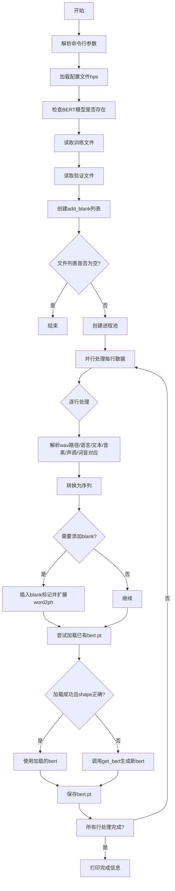
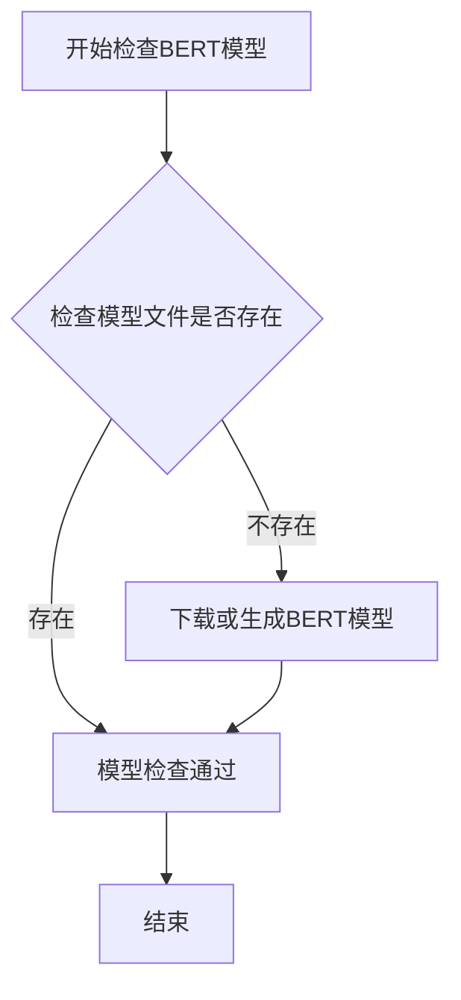
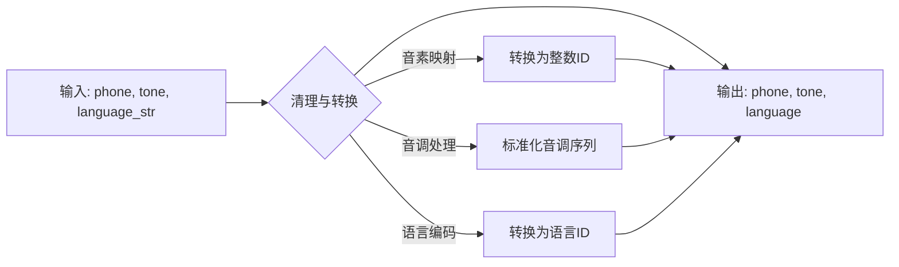
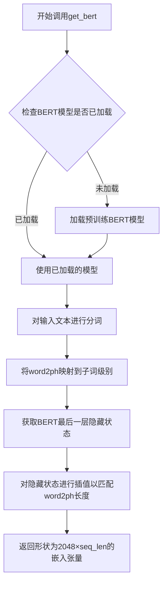
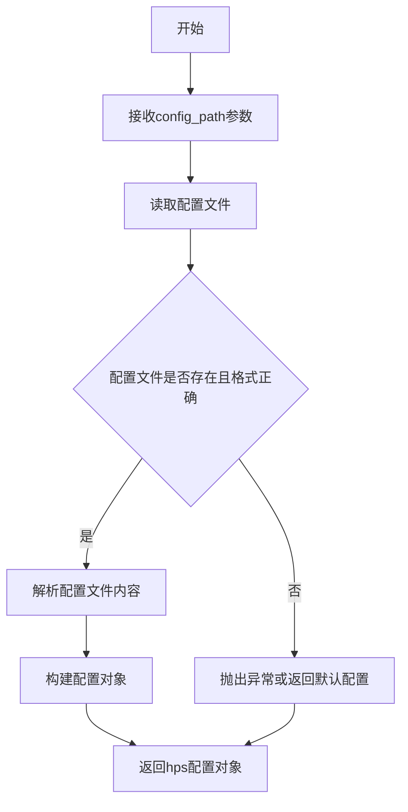
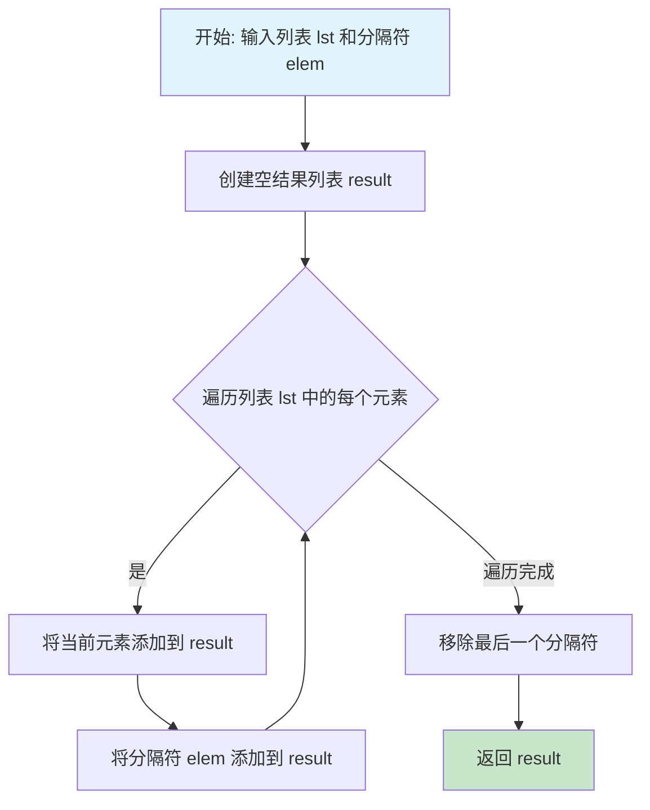

# `Bert-VITS2\bert_gen.py` 详细设计文档

这是一个BERT特征生成脚本，用于TTS（文本到语音）预处理流程。该脚本读取训练和验证文件，解析文本、韵律和语言信息，通过多进程并行生成BERT嵌入特征，并保存为.pt文件供后续语音合成使用。

## 整体流程



## 类结构

```
无类定义（面向过程编程）
└── 全局函数: process_line (主处理函数)
```

## 全局变量及字段


### `config`
    
全局配置对象，包含bert生成、预处理等所有配置项

类型：`Any`
    


### `preprocess_text_config`
    
文本预处理配置对象，定义文本处理的相关参数

类型：`Any`
    


### `hps`
    
超参数配置对象，从配置文件加载的训练和模型参数

类型：`HParams`
    


### `config_path`
    
配置文件路径，指向包含模型配置的yaml文件

类型：`str`
    


### `args`
    
命令行参数对象，解析用户输入的配置和进程数参数

类型：`argparse.Namespace`
    


### `lines`
    
训练和验证文件的所有行列表，每行包含音频路径、语言、文本等信息

类型：`List[str]`
    


### `add_blank`
    
是否添加blank标记的布尔列表，用于音素级别的空白插入

类型：`List[bool]`
    


### `num_processes`
    
并行进程数，指定使用多少个子进程进行BERT特征生成

类型：`int`
    


    

## 全局函数及方法


### `process_line`

该函数是BERT特征生成流程的核心处理函数，接收一行包含音频路径、语言、文本、韵律标记等信息的记录，解析后生成对应的BERT嵌入向量。首先根据配置选择合适的计算设备（CPU或GPU），然后对输入的文本序列进行预处理，包括分词、添加空白符等操作。接着尝试加载预计算的BERT特征文件，如果文件不存在或格式错误，则调用BERT模型生成新的特征向量，最后将生成的特征保存到磁盘以供后续使用。

参数：

- `x`：`Tuple[str, bool]`，包含一行数据字符串和是否添加空白符的布尔值。其中line是以"|"分隔的字符串，格式为"wav_path|unused|language_str|text|phones|tone|word2ph"，add_blank表示是否需要在音素序列中插入空白符

返回值：`None`，该函数无返回值，通过副作用（生成并保存.pt文件）完成处理

#### 流程图

```mermaid
flowchart TD
    A[接收参数 x = (line, add_blank)] --> B[解包参数并获取设备信息]
    B --> C{use_multi_device?}
    C -->|是| D[根据进程rank计算GPU id]
    C -->|否| E[使用默认device]
    D --> F[设置device为cuda或cpu]
    E --> F
    F --> G[解析line字符串]
    G --> H[提取wav_path, language_str, text, phones, tone, word2ph]
    H --> I[预处理phone/tone/word2ph数据]
    I --> J[调用cleaned_text_to_sequence]
    J --> K{add_blank?}
    K -->|是| L[使用intersperse添加空白符]
    K -->|否| M[跳过添加空白]
    L --> M
    M --> N[构造bert_path]
    N --> O{尝试加载bert.pt}
    O -->|成功| P[验证bert shape == 2048]
    O -->|失败| Q[调用get_bert生成特征]
    P --> R[验证特征长度]
    Q --> R
    R --> S[保存bert到bert_path]
    S --> T[结束]
```

#### 带注释源码

```python
def process_line(x):
    """
    处理单行数据，生成BERT特征向量
    参数:
        x: tuple, (line: str, add_blank: bool)
           line格式: "wav_path|unused|language_str|text|phones|tone|word2ph"
    返回:
        None (通过副作用保存BERT特征到文件)
    """
    # 解包输入参数：line为数据行，add_blank为是否添加空白符
    line, add_blank = x
    
    # 获取默认设备（CPU或第一个GPU）
    device = config.bert_gen_config.device
    
    # 多进程GPU分配逻辑：根据进程rank分配不同GPU
    if config.bert_gen_config.use_multi_device:
        # 获取当前进程ID标识
        rank = mp.current_process()._identity
        # 取第一个rank值，默认为0
        rank = rank[0] if len(rank) > 0 else 0
        # 检查CUDA可用性并分配GPU
        if torch.cuda.is_available():
            gpu_id = rank % torch.cuda.device_count()
            device = torch.device(f"cuda:{gpu_id}")
        else:
            device = torch.device("cpu")
    
    # 解析数据行，按"|"分割提取各字段
    # 格式: wav_path|unused|language_str|text|phones|tone|word2ph
    wav_path, _, language_str, text, phones, tone, word2ph = line.strip().split("|")
    
    # 将字符串格式的phones转换为列表（以空格分隔）
    phone = phones.split(" ")
    
    # 将tone字符串转换为整数列表
    tone = [int(i) for i in tone.split(" ")]
    
    # 将word2ph字符串转换为整数列表
    word2ph = [int(i) for i in word2ph.split(" ")]
    # 再次转换为列表（此处重复操作，可优化）
    word2ph = [i for i in word2ph]
    
    # 调用文本处理函数，将文本转换为序列表示
    # 返回处理后的phone, tone, language序列
    phone, tone, language = cleaned_text_to_sequence(phone, tone, language_str)
    
    # 如果需要添加空白符（在音素间插入0）
    if add_blank:
        # 使用intersperse在每个元素间插入0
        phone = commons.intersperse(phone, 0)
        tone = commons.intersperse(tone, 0)
        language = commons.intersperse(language, 0)
        # word2ph每个值翻倍（因为插入了空白符）
        for i in range(len(word2ph)):
            word2ph[i] = word2ph[i] * 2
        # 第一个位置加1（补偿起始空白符）
        word2ph[0] += 1
    
    # 构造BERT特征文件路径
    # 将.wav替换为.bert.pt后缀
    bert_path = wav_path.replace(".WAV", ".wav").replace(".wav", ".bert.pt")
    
    # 尝试加载已存在的BERT特征
    try:
        bert = torch.load(bert_path)
        # 验证BERT向量维度是否为2048
        assert bert.shape[0] == 2048
    except Exception:
        # 加载失败时，调用get_bert生成新的特征
        bert = get_bert(text, word2ph, language_str, device)
        # 验证生成的特征长度与phone序列长度一致
        assert bert.shape[-1] == len(phone)
        # 保存生成的BERT特征到文件
        torch.save(bert, bert_path)
```

---

### 文件整体运行流程

该脚本用于批量生成BERT嵌入特征文件，主要流程如下：

1. **初始化配置**：从命令行参数和配置文件读取配置路径和进程数
2. **加载数据**：从训练集和验证集文件读取所有数据行
3. **多进程处理**：使用`multiprocessing.Pool`创建进程池，调用`process_line`函数处理每一行数据
4. **进度显示**：使用`tqdm`显示处理进度
5. **完成提示**：打印生成的BERT文件数量

---

### 关键组件信息

| 组件名称 | 一句话描述 |
|---------|-----------|
| `config.bert_gen_config` | 包含BERT生成相关配置（设备、多进程、进程数等） |
| `cleaned_text_to_sequence` | 将处理后的文本转换为音素序列的函数 |
| `get_bert` | 调用BERT模型生成文本嵌入特征的函数 |
| `commons.intersperse` | 在列表元素间插入指定值的工具函数 |
| `mp.current_process()._identity` | 获取当前多进程worker的rank标识 |

---

### 潜在的技术债务或优化空间

1. **重复的数据转换**：`word2ph = [i for i in word2ph]`这行代码没有实际作用，属于冗余代码
2. **异常处理过于宽泛**：使用`except Exception`捕获所有异常，建议区分文件不存在和模型加载错误
3. **硬编码的维度验证**：`bert.shape[0] == 2048`硬编码了BERT维度，应从配置读取
4. **设备管理逻辑重复**：在多设备分支和默认分支中都有设备赋值，可简化
5. **缺乏日志记录**：生成失败时没有日志记录错误信息，不利于调试
6. **内存占用**：加载大型BERT模型到内存可能在显存受限环境下导致问题

---

### 其它项目

#### 设计目标与约束

- **目标**：批量为音频数据生成BERT嵌入特征，用于后续的语音合成模型
- **约束**：需要保证生成的BERT特征维度与音素序列长度一致，且第一维固定为2048

#### 错误处理与异常设计

- 使用`try-except`捕获BERT文件加载失败的情况
- 加载失败时自动调用`get_bert`重新生成
- 使用`assert`验证生成的特征维度是否符合预期
- 建议：可增加文件损坏、磁盘空间不足等异常的专门处理

#### 数据流与状态机

- 输入：文本文件每行 → 解析为结构化数据 → 生成BERT特征 → 保存为.pt文件
- 状态：等待处理 → 处理中（加载/生成） → 已完成

#### 外部依赖与接口契约

- 依赖`torch`、`multiprocessing`、`config`、`commons`、`utils`、`text`等模块
- 输入数据格式强依赖`line.strip().split("|")`的7字段格式
- 输出文件路径基于输入的wav_path转换而来


### `check_bert_models`

该函数用于检查BERT模型文件是否存在，如果不存在则进行下载或生成，确保后续文本处理流程可以正常使用BERT嵌入。

参数：
- （无参数）

返回值：`无返回值`，该函数仅执行模型检查和可能的下载操作，不返回任何数据。

#### 流程图



#### 带注释源码

```
# 注意：此函数定义不在当前代码文件中
# 该函数从 text 模块导入: from text import check_bert_models, ...
# 在当前代码中的调用方式:

check_bert_models()  # 检查BERT模型是否存在

# 后续代码使用检查后的模型进行文本处理:
# bert = get_bert(text, word2ph, language_str, device)
```

> **备注**：由于`check_bert_models`函数的实际定义位于`text`模块中（当前代码仅展示了导入和调用），无法获取其完整源码。以上信息基于函数调用方式和上下文推断得出。该函数在主程序启动时被调用，用于确保BERT模型可用后再进行文本预处理工作。


### `cleaned_text_to_sequence`

该函数用于将输入的音素序列、音调序列和语言字符串进行清理和标准化，转换为模型可处理的整数序列格式，通常包括音素ID、音调ID和语言ID的序列。

#### 参数

- `phone`：`List[str]`，原始音素序列（字符串列表），由文本分割得到。
- `tone`：`List[int]`，原始音调序列（整数列表），表示每个音素的音调。
- `language_str`：`str`，语言标识字符串（如 "en"、"zh" 等）。

#### 返回值

- `phone`：`List[int]`，清理转换后的音素序列（整数ID序列）。
- `tone`：`List[int]`，清理转换后的音调序列（整数序列）。
- `language`：`List[int]`，清理转换后的语言序列（整数ID序列，可能为单元素列表）。

#### 流程图



#### 带注释源码

由于该函数定义在 `text` 模块中，未在当前代码文件中给出定义，以下为调用处的源码及注释：

```python
# 从text模块导入的函数，用于清理并转换文本为序列
from text import cleaned_text_to_sequence

# 在process_line函数中调用：
# line 包含 wav_path, language_str, text, phones, tone, word2ph 等信息
phone = phones.split(" ")  # 将空格分隔的音素字符串转换为列表
tone = [int(i) for i in tone.split(" ")]  # 将空格分隔的音调字符串转换为整数列表
# 调用 cleaned_text_to_sequence 进行清理和转换
phone, tone, language = cleaned_text_to_sequence(phone, tone, language_str)
# 转换后，phone 和 tone 通常为整数列表，language 为语言ID列表
```


### `get_bert`

获取BERT嵌入特征函数，从text模块导入，用于将文本转换为BERT模型生成的语义嵌入向量。

参数：

- `text`：`str`，输入的原始文本字符串
- `word2ph`：`List[int]`，词到音素的映射列表，表示每个词对应的音素数量
- `language_str`：`str`，语言标识字符串（如"en"、"zh"等）
- `device`：`torch.device`，计算设备（cuda或cpu）

返回值：`torch.Tensor`，形状为`[2048, seq_len]`的BERT嵌入张量，其中2048是BERT模型的隐藏层维度，seq_len与音素序列长度相同

#### 流程图



#### 带注释源码

```python
# 由于get_bert函数定义在text模块中，以下是基于调用的推断源码
def get_bert(text: str, word2ph: List[int], language_str: str, device: torch.device) -> torch.Tensor:
    """
    获取文本的BERT嵌入特征
    
    参数:
        text: 输入文本字符串
        word2ph: 词到音素的映射列表
        language_str: 语言标识符
        device: 计算设备
    
    返回:
        BERT嵌入张量，形状为[2048, len(phone)]
    """
    # 1. 加载或获取BERT模型（由check_bert_models确保模型已下载）
    # 2. 对文本进行分词（使用对应语言的BERT分词器）
    # 3. 将词级别的word2ph映射扩展到子词/字符级别
    # 4. 通过BERT模型获取最后一层隐藏状态
    # 5. 对嵌入进行线性插值以匹配目标长度（len(phone)）
    # 6. 返回形状为[2048, seq_len]的张量
```


### `utils.get_hparams_from_file`

从指定的配置文件路径加载超参数配置，并返回一个包含所有训练、数据和模型配置的配置对象。

参数：

- `config_path`：`str`，配置文件的路径，指向包含超参数定义的 YAML 或类似格式的配置文件

返回值：`配置对象`，返回一个类似于命名空间的对象，包含 `data`、`model`、`train` 等多个子配置项，用于访问训练文件路径、验证文件路径、模型参数等

#### 流程图



#### 带注释源码

```python
# 该函数定义在 utils 模块中，此处展示调用方式
# 函数签名（推断）: def get_hparams_from_file(config_path: str) -> object

# 从命令行参数获取配置文件路径
config_path = args.config  # args.config 来自 -c/--config 参数

# 调用 get_hparams_from_file 加载配置
# 返回的配置对象 hps 包含 data、model、train 等配置命名空间
hps = utils.get_hparams_from_file(config_path)

# 使用返回的配置对象访问数据配置
training_files = hps.data.training_files    # 训练文件路径
validation_files = hps.data.validation_files # 验证文件路径
add_blank = hps.data.add_blank               # 是否添加空白符

# hps 对象结构示例：
# hps.data.training_files  - 训练数据文件列表路径
# hps.data.validation_files - 验证数据文件列表路径
# hps.data.add_blank        - 是否在音素间插入空白符
```


### `commons.intersperse`

在列表中插入分隔符的函数，用于在原始列表的每两个元素之间插入指定的分隔符元素，常用于在音素序列中添加空白符以改善模型对齐效果。

参数：

- `lst`：`List[Any]`，要进行插入操作的原始列表（如音素列表phone、音调列表tone或语言标识列表language）
- `elem`：`Any`，要插入的分隔符元素（代码中传入值为0，用于表示空白符）

返回值：`List[Any]`，插入分隔符后的新列表

#### 流程图



#### 带注释源码

```python
def intersperse(lst: List[Any], elem: Any) -> List[Any]:
    """
    在列表的每两个元素之间插入指定的分隔符元素
    
    参数:
        lst: 要插入分隔符的原始列表
        elem: 要插入的分隔符元素
    
    返回:
        插入分隔符后的新列表
    """
    # 初始化结果列表为空
    result = []
    
    # 遍历原始列表
    for item in lst:
        # 将当前元素添加到结果列表
        result.append(item)
        # 在每个元素后添加分隔符
        result.append(elem)
    
    # 如果列表不为空，需要移除最后一个多余的分隔符
    if lst:
        result.pop()
    
    return result
```

#### 使用示例

```python
# 代码中的实际调用示例：
phone = commons.intersperse(phone, 0)
tone = commons.intersperse(tone, 0)
language = commons.intersperse(language, 0)

# 假设 phone = [1, 2, 3], 插入 0 后:
# result = [1, 0, 2, 0, 3]  (最后一个0被移除)
# 返回 [1, 0, 2, 0, 3]
```

## 关键组件


### 多进程BERT特征生成器

这是VITS文本到语音系统的BERT特征生成模块，通过多进程并行处理训练和验证数据文本，为每个音频样本生成或加载对应的BERT语义特征，用于提升合成语音的韵律自然度。

### 张量索引与惰性加载

代码实现了按需加载BERT模型的机制：首先尝试从磁盘加载已缓存的`.bert.pt`文件（通过音频路径构造特征路径），只有当缓存文件不存在或加载失败时才调用`get_bert`函数重新生成。这种惰性加载策略避免了重复计算，显著提升了大规模数据集的处理效率。

### 多GPU设备分配策略

`process_line`函数中实现了基于进程rank的动态GPU分配逻辑：通过`mp.current_process()._identity`获取进程标识，利用模运算将不同进程映射到不同的GPU设备，实现了多进程下的负载均衡和资源利用最大化。

### 文本到序列预处理

使用`cleaned_text_to_sequence`函数将原始文本（音素序列、韵律标记、词语边界信息）转换为模型可用的数值化表示，支持多语言处理并同步处理tone和language信息。

### 空白符插值机制

通过`commons.intersperse`函数在音素序列中插入blank token（值为0），使模型能够更好地学习音素边界和对齐关系，同时将`word2ph`数组长度同步翻倍以保持词语-音素对齐。

### 缓存验证与一致性检查

代码包含两层验证：加载时检查BERT张量shape是否为`[2048, seq_len]`，生成后验证`shape[-1]`是否与音素序列长度一致，确保缓存数据的完整性和正确性。

### 配置驱动入口

主程序通过`argparse`接收配置文件路径和进程数参数，从配置文件读取训练/验证文件路径、GPU配置等参数，实现与主训练流程的配置统一。

### 多进程进度跟踪

使用`tqdm`库包装`pool.imap_unordered`实现并行处理时的进度可视化，通过`total=len(lines)`参数准确显示处理进度百分比。


## 问题及建议


### 已知问题

-   **设备分配逻辑不可靠**：在`process_line`函数中使用`mp.current_process()._identity`获取进程rank，在Windows或某些配置下可能无法正确工作，导致GPU分配失败
-   **全局配置在多进程中可能失效**：`config`模块作为全局变量在多进程环境中可能无法正确序列化或共享，导致配置读取不一致
-   **冗余的列表操作**：`word2ph = [i for i in word2ph]`没有任何实际作用，只是创建了列表的浅拷贝
-   **硬编码的BERT维度检查**：`assert bert.shape[0] == 2048`是硬编码值，缺乏灵活性，且断言失败时的错误信息不明确
-   **异常处理过于宽泛**：`except Exception`捕获所有异常并静默回退到生成BERT，无法区分是文件不存在、权限问题还是数据损坏
-   **文件扩展名替换逻辑缺陷**：`.WAV`替换为`.wav`后再替换`.wav`为`.bert.pt`会同时匹配原始`.wav`文件，导致路径错误
-   **内存占用问题**：一次性将所有训练和验证文件内容加载到内存（`lines.extend(f.readlines())`），对于大规模数据集可能造成内存压力
-   **进度条中的空循环体**：使用`pass`语句作为循环体的占位符，虽然不影响功能但代码意图不清晰
-   **缺少进度状态保存**：如果任务中断，已处理的数据不会保存，无法实现断点续传

### 优化建议

-   **重构设备分配机制**：使用`multiprocessing.Pool`的`initializer`参数在每个worker进程初始化时设置设备，而不是在每个任务中动态判断
-   **消除冗余代码**：删除`word2ph = [i for i in word2ph]`这一无效操作
-   **改进文件路径处理**：使用`os.path.splitext`或正则表达式更可靠地处理文件扩展名
-   **细化异常处理**：区分不同异常类型，分别处理文件不存在、数据格式错误等情况，并添加日志记录
-   **实现断点续传**：在生成BERT后立即记录进度，或使用数据库/文件记录已完成的文件列表，支持中断后继续
-   **使用生成器或分批处理**：避免一次性加载所有数据，可以采用生成器模式或分批读取
-   **添加资源清理**：在多进程完成后添加适当的资源清理逻辑，如关闭进程池前的等待或清理临时文件
-   **将配置参数化**：将硬编码的2048等值提取到配置文件中，提高代码灵活性
-   **改进进度显示**：可以考虑添加更详细的进度信息，如显示当前处理的文件名而非仅显示计数


## 其它


### 设计目标与约束

本代码的核心设计目标是将文本数据转换为BERT特征向量，用于语音合成模型的训练。具体目标包括：1）批量处理训练和验证数据集中的文本；2）利用多进程并行加速BERT特征生成；3）实现BERT特征的缓存机制，避免重复计算；4）支持多GPU环境下的分布式处理。约束条件包括：依赖PyTorch、transformers库和BERT模型；需要预先配置config配置文件；处理的数据量受限于磁盘I/O和GPU内存；生成的BERT特征维度固定为2048。

### 错误处理与异常设计

代码中包含以下错误处理机制：1）使用try-except捕获torch.load加载BERT文件失败的情况，触发重新生成BERT特征；2）使用assert验证加载的BERT特征维度是否正确（shape[0] == 2048，shape[-1] == len(phone)）；3）命令行参数解析使用parse_known_args允许未知参数；4）文件读取使用UTF-8编码。潜在改进：可增加更详细的错误日志记录、对无效输入数据的校验、异常情况的恢复机制、进程池任务失败的重试逻辑。

### 数据流与状态机

数据流如下：1）主进程读取配置文件获取训练和验证文件路径；2）加载训练文件和验证文件的所有行到内存；3）创建add_blank参数列表；4）使用进程池（Pool）并行处理每一行数据；5）对每行数据解析出wav_path、language、text、phones、tone、word2ph；6）调用cleaned_text_to_sequence转换文本为序列；7）可选地插入blank token；8）尝试加载已缓存的BERT特征，失败则调用get_bert重新生成；9）保存BERT特征到磁盘。状态机转换：初始化 -> 加载配置 -> 读取数据 -> 并行处理 -> 完成。

### 外部依赖与接口契约

主要外部依赖包括：1）torch（PyTorch核心库）；2）multiprocessing（多进程并行处理）；3）tqdm（进度条显示）；4）commons模块（提供intersperse函数）；5）utils模块（提供get_hps_from_file函数）；6）text模块（提供check_bert_models、cleaned_text_to_sequence、get_bert函数）；7）config模块（配置管理）。接口契约：process_line函数接收(line, add_blank)元组，返回None；函数内部根据rank分配GPU设备；输入格式要求每行按"|"分割为7个字段；输出为.bert.pt文件到与wav同目录。

### 性能考虑与优化空间

性能优化点：1）使用进程池实现多进程并行处理；2）BERT特征缓存机制避免重复计算；3）支持多GPU负载均衡（rank % gpu_count）。优化空间：1）可使用共享内存减少进程间数据传输；2）可实现增量处理而非全量重跑；3）可添加批量处理减少I/O次数；4）可使用更高效的序列化格式（如pickle协议）；5）可增加进度保存和断点续传功能；6）对于小数据集可考虑单进程减少进程创建开销。

### 安全性考虑

安全相关考虑：1）文件路径处理需防止路径遍历攻击（当前代码直接使用输入的wav_path替换后缀）；2）模型文件加载需验证文件完整性（当前有shape检查）；3）配置文件读取需防止恶意配置注入；4）多进程环境需注意共享资源的安全性；5）磁盘空间不足时的处理。改进建议：增加文件路径校验、添加文件完整性校验、限制可访问的目录范围。

### 配置文件说明

代码依赖config模块中的bert_gen_config配置对象，包含：1）device（计算设备）；2）use_multi_device（是否使用多设备）；3）config_path（配置文件路径）；4）num_processes（进程数量）。同时依赖preprocess_text_config和hps.data中的training_files、validation_files、add_blank等配置项。配置文件通常为JSON或YAML格式，定义了数据路径、模型参数等。

### 使用示例

命令行使用示例：
```bash
# 使用默认配置生成BERT特征
python bert_gen.py

# 指定配置文件和进程数
python bert_gen.py -c config/config.json --num_processes 4

# 查看帮助信息
python bert_gen.py --help
```

输入文件格式要求：每行包含7个字段，用"|"分隔，依次为wav路径、语言字符串、文本内容、音素序列、音调序列、词到音素对齐。输出为同目录下的.bert.pt文件。

### 部署注意事项

部署时需注意：1）确保所有依赖库已安装（torch、transformers、tqdm等）；2）BERT模型权重文件需提前下载或配置下载路径；3）配置文件的路径需正确；4）确保有足够的磁盘空间存储生成的BERT特征文件；5）多GPU环境需正确配置CUDA_VISIBLE_DEVICES；6）进程数建议设置为CPU核心数或GPU数量；7）注意内存使用，避免同时加载过多数据；8）建议在数据量较小的验证集上先测试流程。

### 版本历史和变更记录

当前代码版本为初始实现。主要功能变更：1）新增多进程并行处理功能；2）新增多GPU支持；3）新增BERT特征缓存机制；4）新增blank token插入功能。未来可能的改进方向：1）支持分布式训练框架集成；2）支持更多的特征类型；3）优化内存使用；4）增加详细的日志和监控。

    