# `Bert-VITS2\commons.py` 详细设计文档

一个PyTorch深度学习工具库，提供神经网络辅助函数，包括权重初始化、填充处理、KL散度计算、Gumbel采样、片段切片、时间信号生成、掩码操作、梯度裁剪等功能，主要用于文本到语音合成或序列到序列模型

## 整体流程

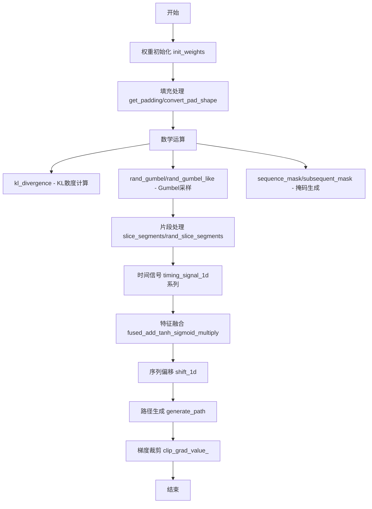

## 类结构

```
无类定义 (纯函数模块)
所有函数均为模块级全局函数
```

## 全局变量及字段


### `init_weights`
    
初始化神经网络层的权重数据，使用正态分布

类型：`function`
    


### `get_padding`
    
根据卷积核大小和膨胀率计算填充值

类型：`function`
    


### `convert_pad_shape`
    
将填充形状从嵌套列表转换为扁平列表

类型：`function`
    


### `intersperse`
    
在列表的每个元素之间插入指定的分隔符

类型：`function`
    


### `kl_divergence`
    
计算两个高斯分布之间的KL散度

类型：`function`
    


### `rand_gumbel`
    
从Gumbel分布中采样随机数，防止溢出

类型：`function`
    


### `rand_gumbel_like`
    
生成与输入张量形状相同的Gumbel分布随机数

类型：`function`
    


### `slice_segments`
    
根据索引从三维张量中提取片段

类型：`function`
    


### `rand_slice_segments`
    
随机从输入张量中提取指定大小的片段

类型：`function`
    


### `get_timing_signal_1d`
    
生成一维时序位置编码信号

类型：`function`
    


### `add_timing_signal_1d`
    
将时序信号加到输入张量上

类型：`function`
    


### `cat_timing_signal_1d`
    
将时序信号连接到输入张量的指定轴

类型：`function`
    


### `subsequent_mask`
    
生成用于Transformer的下三角掩码

类型：`function`
    


### `fused_add_tanh_sigmoid_multiply`
    
执行融合的tanh和sigmoid乘法操作（TorchScript优化）

类型：`function`
    


### `shift_1d`
    
对三维张量进行一维右移操作

类型：`function`
    


### `sequence_mask`
    
根据序列长度生成布尔掩码

类型：`function`
    


### `generate_path`
    
根据持续时间生成单调对齐路径

类型：`function`
    


### `clip_grad_value_`
    
对梯度进行值裁剪或计算梯度范数

类型：`function`
    


    

## 全局函数及方法


### `init_weights`

该函数用于初始化神经网络模型中卷积层的权重参数。它接收一个 nn.Module 对象，检查其类名是否包含"Conv"，若包含则使用指定均值和标准差的正态分布对权重进行随机初始化。

参数：

- `m`：`torch.nn.Module`，要初始化的神经网络模块
- `mean`：`float`，正态分布的均值，默认为 0.0
- `std`：`float`，正态分布的标准差，默认为 0.01

返回值：`None`，该函数直接修改传入模块的权重数据，无返回值

#### 流程图

```mermaid
flowchart TD
    A[开始] --> B[获取模块类名 classname = m.__class__.__name__]
    B --> C{classname 中是否包含 'Conv'}
    C -->|是| D[从正态分布初始化权重<br/>m.weight.data.normal_(mean, std)]
    C -->|否| E[不做任何操作]
    D --> F[结束]
    E --> F
```

#### 带注释源码

```python
def init_weights(m, mean=0.0, std=0.01):
    """
    初始化神经网络模块中卷积层的权重参数。
    
    参数:
        m: torch.nn.Module，要初始化的神经网络模块
        mean: float，正态分布的均值，默认为 0.0
        std: float，正态分布的标准差，默认为 0.01
    
    返回:
        None，该函数直接修改传入模块的权重数据
    """
    # 获取模块的类名
    classname = m.__class__.__name__
    
    # 检查类名中是否包含"Conv"（适用于 Conv1d, Conv2d, Conv3d 等卷积层）
    if classname.find("Conv") != -1:
        # 使用正态分布初始化卷积层的权重数据
        # mean: 正态分布均值
        # std: 正态分布标准差
        m.weight.data.normal_(mean, std)
```


### `get_padding`

该函数用于计算卷积操作中保持输入输出尺寸所需的padding值，基于卷积核大小和膨胀系数计算对称padding。

参数：

- `kernel_size`：`int`，卷积核的大小（维度）
- `dilation`：`int` 或 `float`，卷积膨胀系数，默认为1，用于控制卷积核元素之间的间距

返回值：`int`，计算得到的padding值，确保卷积操作后输出特征图尺寸保持与输入相同

#### 流程图

```mermaid
flowchart TD
    A[开始] --> B[输入 kernel_size, dilation]
    C[计算 padding = int((kernel_size × dilation - dilation) / 2)]
    B --> C
    D[返回 padding 值]
    C --> D
    E[结束]
    D --> E
```

#### 带注释源码

```python
def get_padding(kernel_size, dilation=1):
    """
    计算卷积操作所需的padding值，使输出尺寸与输入尺寸保持一致。
    
    参数:
        kernel_size: 卷积核大小
        dilation: 膨胀系数，默认为1
    
    返回:
        padding值，保证 (W - kernel_size + dilation) / (dilation) + 1 = W
        即输出宽度与输入宽度相同
    """
    # 公式推导：output_size = (input_size - kernel_size + 2*padding) / dilation + 1
    # 要保持 output_size = input_size，则 2*padding = (kernel_size - 1) * dilation
    # 所以 padding = ((kernel_size - 1) * dilation) / 2
    # 化简为：padding = (kernel_size * dilation - dilation) / 2
    return int((kernel_size * dilation - dilation) / 2)
```


### `convert_pad_shape`

该函数用于将嵌套的 padding 形状列表转换为单一的展平列表，通常用于将卷积层的 padding 参数从不同的格式（如双层列表）转换为 PyTorch `F.pad` 函数所需的单层列表格式。

参数：

-  `pad_shape`：`List[List[int]]` 或 `List`，嵌套的 padding 形状列表，例如 `[[1, 1], [2, 2], [0, 1]]`，其中每个子列表表示一个维度的 padding 大小

返回值：`List[int]`，展平后的 padding 列表，例如 `[0, 1, 2, 2, 1, 1]`

#### 流程图

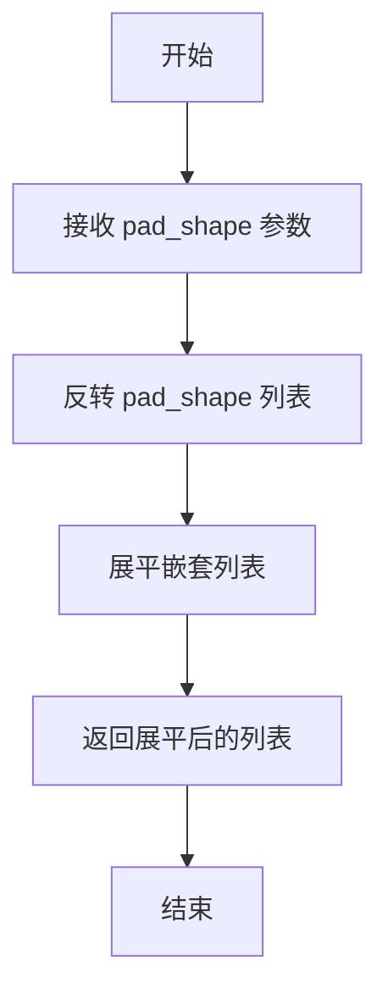

#### 带注释源码

```python
def convert_pad_shape(pad_shape):
    """
    将嵌套的 padding 形状列表转换为展平的列表。
    
    此函数主要用于处理卷积神经网络中的 padding 参数。
    PyTorch 的 F.pad 函数通常需要单一列表形式的 padding 参数，
    而某些模型实现可能使用嵌套列表来定义 padding。
    
    示例：
        输入: [[1, 1], [2, 2], [0, 1]]
        过程：
            1. 反转: [[0, 1], [2, 2], [1, 1]]
            2. 展平: [0, 1, 2, 2, 1, 1]
        输出: [0, 1, 2, 2, 1, 1]
    
    参数:
        pad_shape: 嵌套的 padding 形状列表
        
    返回:
        展平后的 padding 列表
    """
    # 第一步：将 pad_shape 列表反转
    # 例如：[[1, 1], [2, 2], [0, 1]] -> [[0, 1], [2, 2], [1, 1]]
    layer = pad_shape[::-1]
    
    # 第二步：将嵌套列表展平为单一列表
    # 使用列表推导式遍历每个子列表，将所有元素提取出来
    # 例如：[[0, 1], [2, 2], [1, 1]] -> [0, 1, 2, 2, 1, 1]
    pad_shape = [item for sublist in layer for item in sublist]
    
    # 返回展平后的 padding 列表
    return pad_shape
```

#### 技术说明

该函数在代码中被多次使用，主要用于：
1. `shift_1d` 函数中：将 padding 形状转换为 `F.pad` 所需的格式
2. `generate_path` 函数中：处理路径生成的 padding 参数

**潜在优化点：**
- 函数在代码中重复定义了一次，建议移除重复定义
- 可以添加类型注解以提高代码可读性和类型安全
- 对于大型嵌套列表，可以考虑使用 `itertools.chain` 替代列表推导式以提高性能


### `intersperse`

该函数用于在列表中的每个元素之间插入指定的分隔符元素，生成一个新的列表。

参数：

- `lst`：`list`，原始列表，待插入分隔符的列表
- `item`：任意类型，用于插入的分隔符元素

返回值：`list`，返回一个新的列表，其中原始列表的每个元素之间都插入了指定的分隔符元素

#### 流程图

```mermaid
flowchart TD
    A[开始 intersperse] --> B[计算结果列表长度<br/>length = len lst * 2 + 1]
    B --> C[创建结果列表<br/>result = item 重复 length 次]
    C --> D[将 lst 赋值到 result 的奇数位置<br/>result[1::2] = lst]
    D --> E[返回结果列表]
```

#### 带注释源码

```python
def intersperse(lst, item):
    """
    在列表的每个元素之间插入指定的分隔符元素
    
    参数:
        lst: 原始列表
        item: 要插入的分隔符元素
    
    返回:
        新的列表，其中原始列表元素之间插入了分隔符
    """
    # 计算结果列表的长度：原列表长度 * 2 + 1
    # 例如：lst = [1,2,3], 长度为3，结果列表长度为 3*2+1 = 7
    result = [item] * (len(lst) * 2 + 1)
    
    # 将原始列表的值赋值到结果列表的奇数索引位置（1, 3, 5, ...）
    # 偶数索引位置保留为插入的 item 分隔符
    result[1::2] = lst
    
    # 返回最终结果
    return result
```

#### 示例说明

```python
# 示例 1: 数字列表
intersperse([1, 2, 3], 0)  # 返回 [0, 1, 0, 2, 0, 3, 0]

# 示例 2: 字符串列表
intersperse(['a', 'b', 'c'], 'x')  # 返回 ['x', 'a', 'x', 'b', 'x', 'c', 'x']

# 示例 3: 空列表
intersperse([], 0)  # 返回 [0]
```


### `kl_divergence`

该函数计算两个高斯分布之间的KL散度（Kullback-Leibler Divergence）KL(P||Q)，用于衡量分布P相对于分布Q的信息增益，在变分自编码器（VAE）等概率生成模型中常用于计算重构损失或正则化项。

参数：

- `m_p`：`torch.Tensor`，分布P的均值（mean）
- `logs_p`：`torch.Tensor`，分布P的对数标准差（log standard deviation）
- `m_q`：`torch.Tensor`，分布Q的均值（mean）
- `logs_q`：`torch.Tensor`，分布Q的对数标准差（log standard deviation）

返回值：`torch.Tensor`，返回两个高斯分布之间的KL散度值

#### 流程图

```mermaid
flowchart TD
    A[开始] --> B[计算基础项: logs_q - logs_p - 0.5]
    B --> C[计算指数项: torch.exp&#40;2.0 * logs_p&#41;]
    C --> D[计算均值差异平方: &#40;m_p - m_q&#41; ** 2]
    D --> E[计算组合项: 0.5 * &#40;指数项 + 均值差异平方&#41; * torch.exp&#40;-2.0 * logs_q&#41;]
    E --> F[将基础项与组合项相加得到KL散度]
    F --> G[返回KL散度值]
```

#### 带注释源码

```python
def kl_divergence(m_p, logs_p, m_q, logs_q):
    """
    计算两个高斯分布之间的KL散度 KL(P||Q)
    
    参数:
        m_p: 分布P的均值
        logs_p: 分布P的对数标准差
        m_q: 分布Q的均值
        logs_q: 分布Q的对数标准差
    
    返回:
        KL散度值
    """
    # 第一部分：计算对数标准差差异的基础项
    # 等价于 log(σ_q) - log(σ_p) - 0.5
    kl = (logs_q - logs_p) - 0.5
    
    # 第二部分：计算由均值差异和方差差异贡献的KL散度项
    # 公式推导：0.5 * (σ_p^2 + (μ_p - μ_q)^2) / σ_q^2 - 0.5
    # 其中 logs_p = log(σ_p), logs_q = log(σ_q)
    # σ_p = exp(logs_p), σ_q = exp(logs_q)
    # σ_p^2 = exp(2 * logs_p), σ_q^2 = exp(2 * logs_q)
    kl += (
        0.5 * (torch.exp(2.0 * logs_p) + ((m_p - m_q) ** 2)) * torch.exp(-2.0 * logs_q)
    )
    return kl
```


### `rand_gumbel`

从Gumbel分布中采样随机数，通过对均匀分布进行变换得到Gumbel分布样本，并采取措施防止数值溢出。

参数：

- `shape`：`tuple` 或 `list`，输出张量的形状

返回值：`torch.Tensor`，从Gumbel分布采样的随机张量

#### 流程图

```mermaid
flowchart TD
    A[开始] --> B[接收shape参数]
    B --> C[生成均匀分布随机数]
    C --> D[将随机数缩放到0.00001到0.99998范围]
    D --> E[应用Gumbel变换: -log&#40;-log&#40;uniform_samples&#41;&#41;]
    E --> F[返回结果张量]
```

#### 带注释源码

```python
def rand_gumbel(shape):
    """Sample from the Gumbel distribution, protect from overflows."""
    # 生成均匀分布的随机数，形状由shape指定
    # 乘以0.99998并将范围偏移0.00001，防止log(0)或log(1)导致的溢出
    uniform_samples = torch.rand(shape) * 0.99998 + 0.00001
    # 应用逆变换采样Gumbel分布: G(x) = -ln(-ln(u))
    # 其中u为均匀分布样本
    return -torch.log(-torch.log(uniform_samples))
```

#### 技术说明

该函数实现了Gumbel分布的采样算法。Gumbel分布常用于神经网络的随机采样（如Gumbel-Softmax），通过均匀分布的变换来生成。限制均匀样本范围在(0,1)开区间内，避免了取对数时出现log(0)导致的无穷值问题。


### `rand_gumbel_like(x)`

该函数是一个封装器，用于生成与给定张量 `x` 在形状（Shape）、数据类型（dtype）以及计算设备（Device）上完全一致的 Gumbel 分布随机噪声张量。这在需要保持张量属性一致性的场景（如神经网络中的随机采样）中非常有用。

参数：

-  `x`：`torch.Tensor`，参考张量。函数通过该张量的 `.size()` 方法获取目标形状，并复制其 `dtype` 和 `device` 属性用于生成噪声。

返回值：`torch.Tensor`，符合输入张量属性的 Gumbel 分布噪声。

#### 流程图

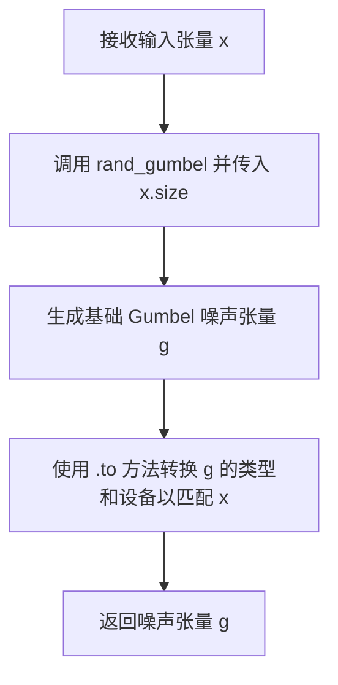

#### 带注释源码

```python
def rand_gumbel_like(x):
    """
    生成与输入张量 x 形状、类型和设备一致的 Gumbel 噪声。
    
    参数:
        x (torch.Tensor): 参考张量，用于定义输出形状并复制属性。
        
    返回:
        torch.Tensor: Gumbel 分布随机数。
    """
    # 1. 根据输入张量 x 的维度尺寸，调用 rand_gumbel 生成对应形状的随机数
    # 注意：rand_gumbel 默认生成的可能是 float32 且在 CPU 或当前设备上
    g = rand_gumbel(x.size()).to(dtype=x.dtype, device=x.device)
    
    # 2. 将生成的张量 g 转换为与输入张量 x 相同的数据类型 (dtype) 和计算设备 (device)
    # 这确保了返回的噪声可以直接用于后续与 x 相关的运算，而无需额外的类型转换
    return g
```


### `slice_segments`

该函数用于从输入的3D张量中根据给定的起始索引位置提取固定大小的片段。它通过构建gather索引并使用`torch.gather`操作来实现对时间维度的切片，是VITS等语音合成模型中用于随机切片处理的核心工具。

参数：

- `x`：`torch.Tensor`，输入的3D张量，形状为 (batch_size, dim, time_steps)
- `ids_str`：`torch.Tensor`，起始索引的1D张量，形状为 (batch_size,)，指定每个batch元素从哪个位置开始切片
- `segment_size`：`int`，要提取的片段大小，默认为4

返回值：`torch.Tensor`，从输入张量中提取的片段，形状为 (batch_size, dim, segment_size)

#### 流程图

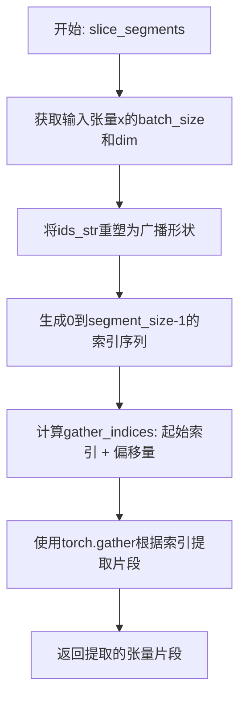

#### 带注释源码

```python
def slice_segments(x, ids_str, segment_size=4):
    """
    从输入张量中提取固定大小的片段
    
    参数:
        x: 输入张量，形状为 (batch_size, dim, time_steps)
        ids_str: 起始索引，形状为 (batch_size,)
        segment_size: 要提取的片段大小
    
    返回:
        提取的张量片段，形状为 (batch_size, dim, segment_size)
    """
    # 第一步：将ids_str从 (batch_size,) 扩展为 (batch_size, dim, 1)
    # 通过view和repeat操作，使其可以与x的维度进行广播运算
    # view(bs, 1, 1) 将其变为3D张量
    # repeat(1, x.size(1), 1) 在dim维度重复x.size(1)次
    gather_indices = ids_str.view(x.size(0), 1, 1).repeat(
        1, x.size(1), 1
    ) + torch.arange(segment_size, device=x.device)
    
    # 第二步：计算最终的gather索引
    # ids_str.view(...) 生成基础索引 (batch_size, 1, 1)
    # repeat后变为 (batch_size, dim, 1)
    # torch.arange(segment_size) 生成 [0, 1, 2, ..., segment_size-1] 的1D张量
    # 两者相加得到 (batch_size, dim, segment_size) 的索引
    # 由于广播机制，偏移量会在dim和batch维度上自动复制
    
    # 第三步：使用torch.gather在第2个维度（时间维度）上收集数据
    # gather的dim=2表示在第3个维度（索引从0开始）上进行索引
    # 最终返回形状: (batch_size, dim, segment_size)
    return torch.gather(x, 2, gather_indices)
```


### `rand_slice_segments`

该函数用于从输入张量中随机切片提取固定大小的片段。它接收一个三维输入张量，可选地指定每个样本的长度，然后根据片段大小计算有效的随机起始索引，最后调用 `slice_segments` 函数提取对应的片段并返回结果张量及起始位置索引。

参数：

- `x`：`torch.Tensor`，输入张量，形状为 (b, d, t)，其中 b 是批量大小，d 是特征维度，t 是时间步长
- `x_lengths`：`Optional[torch.Tensor]`，可选的张量，表示每个样本的实际长度，默认为 None，此时使用完整长度 t
- `segment_size`：`int`，要提取的片段大小，默认为 4

返回值：`Tuple[torch.Tensor, torch.Tensor]`，返回元组包含提取的片段张量（形状为 (b, d, segment_size)）和起始位置索引（形状为 (b,)）

#### 流程图

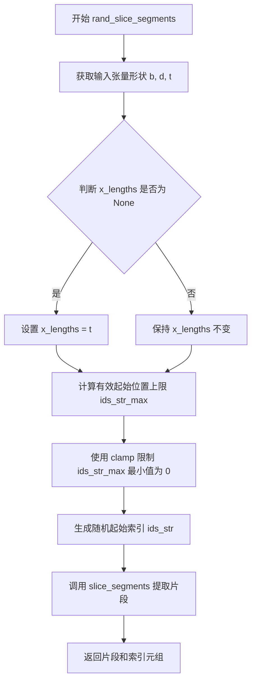

#### 带注释源码

```python
def rand_slice_segments(x, x_lengths=None, segment_size=4):
    """
    从输入张量中随机切片提取固定大小的片段。
    
    参数:
        x: 输入张量，形状为 (batch_size, feature_dim, time_steps)
        x_lengths: 可选的每样本长度张量，如果为 None 则使用完整时间步
        segment_size: 要提取的片段大小
    
    返回:
        包含提取片段和起始索引的元组
    """
    # 获取输入张量的形状信息：b=批量大小, d=特征维度, t=时间步长
    b, d, t = x.size()
    
    # 如果未提供样本长度，则使用完整时间步作为默认长度
    if x_lengths is None:
        x_lengths = t
    
    # 计算每个样本的最大有效起始位置：确保片段不超出样本边界
    # 使用 clamp 确保结果不小于 0，防止无效索引
    ids_str_max = torch.clamp(x_lengths - segment_size + 1, min=0)
    
    # 生成随机起始索引：在 [0, ids_str_max) 范围内均匀采样
    # 生成形状为 (b,) 的随机数，然后转换为长整型索引
    ids_str = (torch.rand([b], device=x.device) * ids_str_max).to(dtype=torch.long)
    
    # 调用 slice_segments 函数执行实际的切片操作
    ret = slice_segments(x, ids_str, segment_size)
    
    # 返回提取的片段张量和对应的起始索引
    return ret, ids_str
```


### `get_timing_signal_1d`

生成一维时序信号（Timing Signal），基于正弦和余弦函数的位置编码，用于为序列数据添加位置信息。该函数通过不同频率的正弦和余弦函数组合，使模型能够感知序列中元素的位置关系。

参数：

- `length`：`int`，要生成的序列长度
- `channels`：`int`，通道数（特征维度），必须为偶数
- `min_timescale`：`float`，最小时间尺度（默认1.0），控制最慢变化频率
- `max_timescale`：`float`，最大时间尺度（默认1.0e4），控制最快变化频率

返回值：`torch.Tensor`，形状为(1, channels, length)的三维张量，表示时序信号

#### 流程图

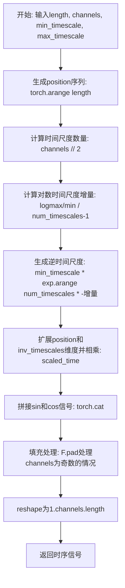

#### 带注释源码

```python
def get_timing_signal_1d(length, channels, min_timescale=1.0, max_timescale=1.0e4):
    """
    生成一维时序信号，用于Transformer等序列模型的位置编码
    
    参数:
        length: 序列长度
        channels: 通道数(维度), 应为偶数
        min_timescale: 最小时间尺度,控制最慢变化频率
        max_timescale: 最大时间尺度,控制最快变化频率
    
    返回:
        形状为(1, channels, length)的时序信号张量
    """
    
    # Step 1: 生成位置索引 [0, 1, 2, ..., length-1]
    position = torch.arange(length, dtype=torch.float)
    
    # Step 2: 计算时间尺度数量 (通道数的一半, 因为sin和cos各占一半)
    num_timescales = channels // 2
    
    # Step 3: 计算对数时间尺度增量
    # 使时间尺度在min_timescale到max_timescale之间均匀分布(对数尺度)
    log_timescale_increment = math.log(float(max_timescale) / float(min_timescale)) / (
        num_timescales - 1
    )
    
    # Step 4: 生成逆时间尺度 (指数级递减)
    # 公式: min_timescale * exp(-log_increment * i), i = 0, 1, 2, ...
    inv_timescales = min_timescale * torch.exp(
        torch.arange(num_timescales, dtype=torch.float) * -log_timescale_increment
    )
    
    # Step 5: 计算缩放后的时间 (广播运算)
    # position: [length] -> [1, length]
    # inv_timescales: [num_timescales] -> [num_timescales, 1]
    # scaled_time: [num_timescales, length]
    scaled_time = position.unsqueeze(0) * inv_timescales.unsqueeze(1)
    
    # Step 6: 拼接正弦和余弦信号
    # 分别计算sin和cos, 在第0维拼接 -> [channels, length]
    signal = torch.cat([torch.sin(scaled_time), torch.cos(scaled_time)], 0)
    
    # Step 7: 填充处理 (处理channels为奇数的情况)
    # 如果channels为奇数, 需要在最后填充一个0
    signal = F.pad(signal, [0, 0, 0, channels % 2])
    
    # Step 8:  reshape为要求的形状 (1, channels, length)
    signal = signal.view(1, channels, length)
    
    return signal
```


### `add_timing_signal_1d`

该函数用于向输入张量添加一维时序信号，通过生成位置编码并将时序信息融入特征中，使模型能够感知序列中每个位置的相对或绝对时间信息。

参数：

- `x`：`torch.Tensor`，输入张量，形状为 (batch_size, channels, length)，代表批量大小、通道数和序列长度
- `min_timescale`：`float`，可选参数，默认值为 1.0，时序信号生成的最小时间尺度，用于控制高频成分的周期
- `max_timescale`：`float`，可选参数，默认值为 1.0e4，时序信号生成的最大时间尺度，用于控制低频成分的周期

返回值：`torch.Tensor`，与输入 x 形状相同的张量，值为输入与时序信号的和

#### 流程图

```mermaid
flowchart TD
    A[开始 add_timing_signal_1d] --> B[解包输入张量形状<br/>b, channels, length = x.size]
    B --> C[调用 get_timing_signal_1d<br/>生成时序信号]
    C --> D[信号类型转换<br/>signal.to dtype=x.dtype, device=x.device]
    D --> E[执行加法运算<br/>x + signal]
    E --> F[返回结果张量]

    C --> C1[get_timing_signal_1d 内部流程]
    C1 --> C2[生成位置向量 position]
    C2 --> C3[计算时间尺度增量 log_timescale_increment]
    C3 --> C4[生成逆时间尺度 inv_timescales]
    C4 --> C5[计算缩放时间 scaled_time]
    C5 --> C6[拼接正弦和余弦信号]
    C6 --> C7[填充对齐并reshape为 (1, channels, length)]
```

#### 带注释源码

```python
def add_timing_signal_1d(x, min_timescale=1.0, max_timescale=1.0e4):
    """
    向输入张量添加一维时序信号（位置编码）
    
    该函数通过生成正弦-余弦位置编码，将序列位置信息融入输入特征中。
    这种技术源自Transformer架构，使模型能够感知输入序列中每个位置的时间信息。
    
    参数:
        x: 输入张量，形状为 (batch_size, channels, length)
        min_timescale: 最小时间尺度，默认1.0，控制编码的最小周期
        max_timescale: 最大时间尺度，默认10000.0，控制编码的最大周期
    
    返回:
        加上时序信号后的张量，形状与输入相同
    """
    
    # 从输入张量中解包维度信息
    # b: 批量大小 (batch size)
    # channels: 通道数 (特征维度)
    # length: 序列长度 (时间步数)
    b, channels, length = x.size()
    
    # 调用辅助函数生成时序信号
    # 该函数生成基于位置的正弦-余弦编码
    signal = get_timing_signal_1d(length, channels, min_timescale, max_timescale)
    
    # 确保时序信号的dtype和device与输入张量一致
    # 避免因类型不匹配或设备不同导致计算错误
    signal = signal.to(dtype=x.dtype, device=x.device)
    
    # 将时序信号广播并加到输入张量上
    # 由于signal形状为(1, channels, length)，会自动广播到x的形状(b, channels, length)
    return x + signal
```


### `cat_timing_signal_1d`

该函数用于将一维时间信号沿指定轴拼接到输入张量上，常用于Transformer架构中为序列添加位置编码信息。

参数：

- `x`：`torch.Tensor`，输入张量，形状为 (batch, channels, length)
- `min_timescale`：`float`，最小时间尺度，默认为 1.0，用于生成时间信号的频率范围
- `max_timescale`：`float`，最大时间尺度，默认为 1.0e4，用于生成时间信号的频率范围
- `axis`：`int`，拼接轴，默认为 1

返回值：`torch.Tensor`，拼接后的张量，形状为 (batch, channels*2, length) 或根据 axis 参数变化

#### 流程图

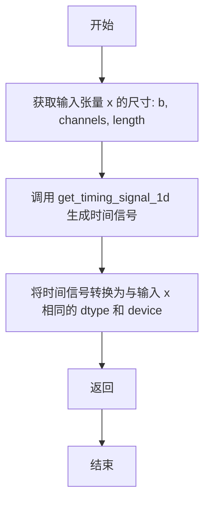

#### 带注释源码

```python
def cat_timing_signal_1d(x, min_timescale=1.0, max_timescale=1.0e4, axis=1):
    """
    将一维时间信号沿指定轴拼接到输入张量上
    
    参数:
        x: 输入张量，形状为 (batch, channels, length)
        min_timescale: 最小时间尺度，控制时间信号频率
        max_timescale: 最大时间尺度，控制时间信号频率
        axis: 拼接轴，默认为 1
    
    返回:
        拼接后的张量
    """
    # 从输入张量中提取批量大小、通道数和序列长度
    b, channels, length = x.size()
    
    # 调用辅助函数生成时间信号，信号维度与输入通道数相同
    signal = get_timing_signal_1d(length, channels, min_timescale, max_timescale)
    
    # 沿指定轴拼接输入张量和时间信号
    # 确保时间信号的dtype和device与输入张量一致
    return torch.cat([x, signal.to(dtype=x.dtype, device=x.device)], axis)
```


### `subsequent_mask`

该函数用于生成后续位置掩码（subsequent mask），在自回归模型（如 Transformer）中遮蔽未来位置，确保每个位置只能看到其之前的位置，常用于语言模型的因果注意力机制。

参数：

- `length`：`int`，掩码的目标序列长度

返回值：`torch.Tensor`，形状为 (1, 1, length, length) 的 4D 张量，下三角为 1（保留），上三角为 0（遮蔽）

#### 流程图

```mermaid
flowchart TD
    A[开始] --> B[输入: length]
    B --> C[torch.ones 创建全1矩阵]
    C --> D[torch.tril 取下三角]
    D --> E[unsqueeze(0) 扩展维度至 (1, length, length)]
    F[unsqueeze(1) 扩展维度至 (1, 1, length, length)]
    E --> F
    F --> G[返回: 下三角掩码张量]
```

#### 带注释源码

```python
def subsequent_mask(length):
    """
    生成后续位置掩码，用于遮蔽序列中的未来位置。
    
    参数:
        length (int): 目标序列的长度，用于生成 length x length 的掩码矩阵。
    
    返回:
        torch.Tensor: 形状为 (1, 1, length, length) 的布尔型掩码张量，
                     下三角元素为 True（可访问），上三角元素为 False（被遮蔽）。
    """
    # 创建 length x length 的全1矩阵
    # 示例: length=5 时，创建一个 5x5 的全1矩阵
    mask = torch.ones(length, length)
    
    # 取下三角部分，保留主对角线及以下的元素
    # torch.tril 返回下三角矩阵（包含主对角线）
    # 示例: length=5 时，得到:
    # [[1, 0, 0, 0, 0],
    #  [1, 1, 0, 0, 0],
    #  [1, 1, 1, 0, 0],
    #  [1, 1, 1, 1, 0],
    #  [1, 1, 1, 1, 1]]
    mask = torch.tril(mask)
    
    # 在第0维增加批次维度: (length, length) -> (1, length, length)
    mask = mask.unsqueeze(0)
    
    # 在第1维增加注意力头维度: (1, length, length) -> (1, 1, length, length)
    # 最终形状适配多头注意力机制的输入格式 (batch, head, seq, seq)
    mask = mask.unsqueeze(0)
    
    return mask
```


### `fused_add_tanh_sigmoid_multiply`

这是一个经过 PyTorch JIT 编译优化的融合函数，用于在神经网络（尤其是 WaveNet、Glow-TTS 等生成模型）中高效计算 "add + tanh + sigmoid + multiply" 的融合操作。该函数通过将多个操作融合为一个 CUDA 核函数来减少内存访问和 kernel 启动开销，从而显著提升推理性能。

参数：

- `input_a`：`torch.Tensor`，第一个输入张量，通常为上一层的激活输出，形状为 [batch, channels, time]
- `input_b`：`torch.Tensor`，第二个输入张量，通常为残差连接或偏置项，形状与 input_a 相同
- `n_channels`：`torch.Tensor` 或 `list`，通道数信息，用于分割激活张量前半部分应用 tanh，后半部分应用 sigmoid

返回值：`torch.Tensor`，返回融合激活后的输出张量，形状为 [batch, n_channels, time]

#### 流程图

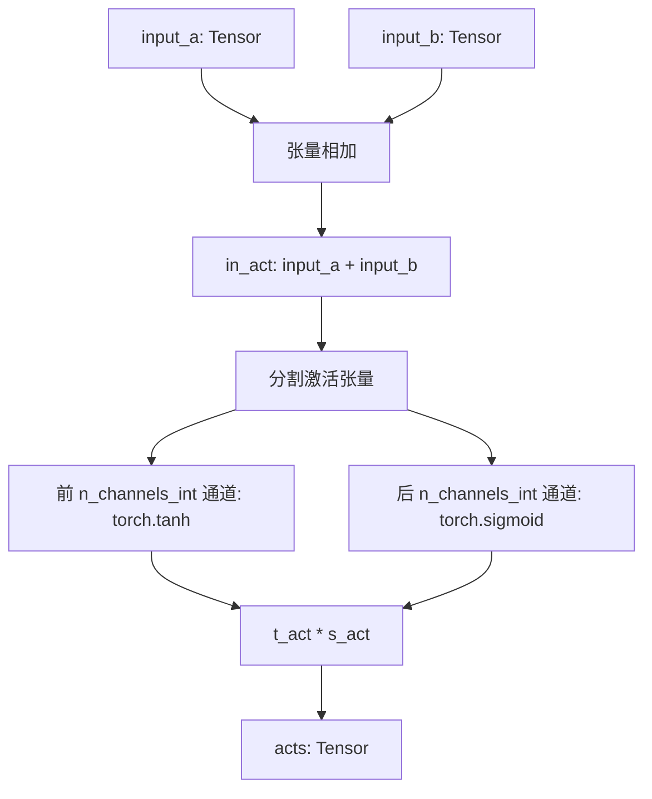

#### 带注释源码

```python
@torch.jit.script
def fused_add_tanh_sigmoid_multiply(input_a, input_b, n_channels):
    """
    融合的 tanh-sigmoid 乘法操作，用于 WaveNet/Glow 风格的激活计算。
    
    该函数将以下操作融合为一个 JIT 编译的 CUDA kernel:
    1. input_a + input_b (残差加法)
    2. 前半部分通道: tanh 激活
    3. 后半部分通道: sigmoid 激活
    4. 两者相乘 (门控机制)
    
    这种融合方式可以减少内存带宽使用和 kernel 启动开销。
    """
    # 从 n_channels 张量中提取整数通道数
    # n_channels 是一个长度为 1 的张量或列表
    n_channels_int = n_channels[0]
    
    # 步骤 1: 残差连接 - 将两个输入张量相加
    in_act = input_a + input_b
    
    # 步骤 2: 分割激活并分别应用 tanh 和 sigmoid
    # 前半部分通道 (0 到 n_channels_int) 应用 tanh 激活
    t_act = torch.tanh(in_act[:, :n_channels_int, :])
    
    # 后半部分通道 (n_channels_int 到末尾) 应用 sigmoid 激活
    # 这实现了类似于 LSTM 的门控机制
    s_act = torch.sigmoid(in_act[:, n_channels_int:, :])
    
    # 步骤 3: 门控乘法 - 将 tanh 输出与 sigmoid 输出逐元素相乘
    # 这是 WaveNet 中常用的 gated activation 机制
    acts = t_act * s_act
    
    return acts
```

### 潜在的技术债务或优化空间

1. **硬编码的通道分割方式**：函数假设输入通道数恰好是 `n_channels` 的两倍（前半部分给 tanh，后半部分给 sigmoid），这种假设可能在某些模型架构中不成立，缺乏灵活性。

2. **n_channels 参数设计不合理**：`n_channels` 被设计为张量而非整数，需要通过 `n_channels[0]` 取值，这增加了 API 的困惑性，且无法在 JIT 编译时进行类型推导优化。

3. **缺乏输入形状验证**：函数没有对输入张量的形状兼容性进行显式检查，可能导致运行时难以调试的错误。

4. **文档注释不足**：作为核心性能优化函数，缺乏对数学原理（如门控激活机制）和使用场景的详细说明。

### 其它项目

**设计目标与约束**：
- 目标：通过 JIT 编译融合多个张量操作，减少 GPU kernel 启动次数和内存带宽消耗
- 约束：输入通道数必须为 `n_channels` 的 2 倍，确保能均匀分割为两部分

**错误处理与异常设计**：
- 当 `input_a` 和 `input_b` 形状不匹配时，PyTorch 会抛出维度不匹配错误
- 当 `n_channels` 为 0 或超出输入通道数时，可能导致空张量切片或越界访问

**数据流与状态机**：
- 该函数是无状态的纯函数，输入输出均为张量，不涉及内部状态管理
- 数据流遵循：输入 → 加法 → 分割 → 双激活 → 乘法 → 输出

**外部依赖与接口契约**：
- 依赖 `torch` 库，需确保 PyTorch 版本支持 `@torch.jit.script` 装饰器
- 调用方需保证 `input_a`、`input_b` 形状一致，且通道数维度满足 2*n_channels 的关系


### `shift_1d`

该函数实现了一个在时间维度（第三维）上的因果移位操作。它通过在时间序列的起始位置填充特定形状的零向量，并截断末尾的时间步，从而将输入数据在时间轴上向后移动一位。这通常用于自回归生成模型（如WaveNet、Glow-TTS）中，以确保当前时刻的预测仅依赖于过去的信息，满足因果性（causality）约束。

参数：
- `x`：`torch.Tensor`，输入的三维张量，形状为 (Batch, Channel, Time)。需要进行时间维度位移的特征数据。

返回值：`torch.Tensor`，位移后的三维张量，形状保持为 (Batch, Channel, Time)。时间维度上的数据相较于原输入向后偏移了一位，首元素被置为零，末元素被舍弃。

#### 流程图

```mermaid
graph TD
    A[输入 x: (B, C, T)] --> B[convert_pad_shape]
    B[构造填充参数] --> C[F.pad]
    C[在时间维前端填充1个零] --> D[切片操作]
    D[x[:, :, :-1] 移除最后一个时间步] --> E[输出: (B, C, T)]
    
    style A fill:#f9f,color:#333
    style E fill:#9f9,color:#333
```

#### 带注释源码

```python
def shift_1d(x):
    """
    对输入张量在时间维度上进行因果移位。
    
    逻辑：
    1. 在时间维度的开头填充 1 个零向量。
    2. 移除末尾的时间步。
    效果：时间步 t 的数据被移动到了 t+1 的位置，实现了向右位移。
    """
    # 定义填充形状: [dim0_left, dim0_right, dim1_left, dim1_right, dim2_left, dim2_right]
    # [[0, 0], [0, 0], [1, 0]] 转换为 [0, 0, 0, 0, 1, 0]
    # 仅在最后一个维度（时间维，索引2）的前面填充1个单位，后面不填充
    pad_shape = convert_pad_shape([[0, 0], [0, 0], [1, 0]])
    
    # 使用 F.pad 进行填充，形状变为 (B, C, T+1)
    x = F.pad(x, pad_shape)[:, :, :-1]
    
    # 切片移除最后一个元素，形状变回 (B, C, T)
    # 此时，原来 index=0 的数据变成了 index=1，以此类推
    # index=0 处为新填充的 0
    return x
```


### `sequence_mask`

生成序列掩码张量，用于标识序列中的有效位置。根据输入的length张量，生成一个布尔掩码，其中有效位置为True，无效位置（超出序列长度）为False。

参数：

- `length`：`torch.Tensor`，表示批次中每个序列的实际长度的一维张量
- `max_length`：`int` 或 `None`，可选参数，表示掩码的最大长度。如果为None，则默认为length张量中的最大值

返回值：`torch.Tensor`，返回形状为(batch_size, max_length)的布尔张量，其中batch_size由length张量的维度决定。对于第i个序列，第j个位置为True当且仅当j小于length[i]

#### 流程图

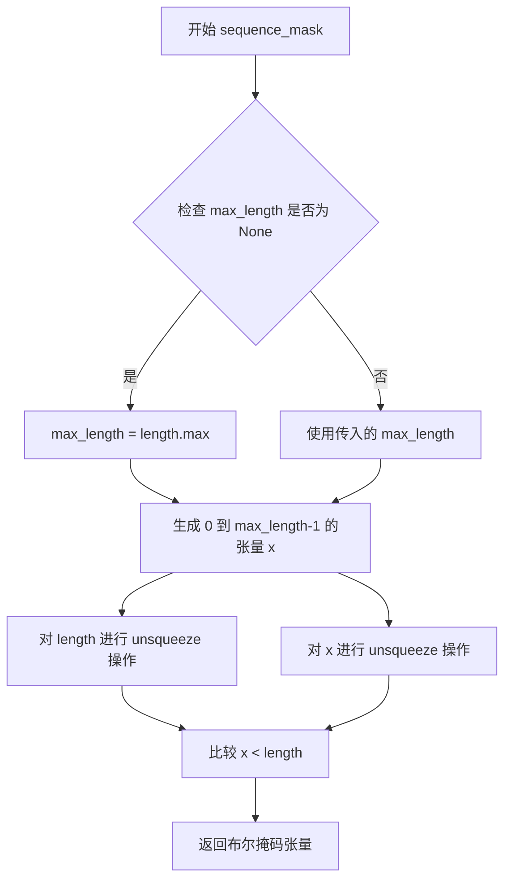

#### 带注释源码

```
def sequence_mask(length, max_length=None):
    """
    生成序列掩码，用于标识序列中的有效位置。
    
    参数:
        length: 一维张量，表示每个序列的长度
        max_length: 可选参数，最大序列长度，默认为None
    
    返回:
        布尔张量，形状为 (batch_size, max_length)
    """
    # 如果未指定max_length，则使用length中的最大值
    if max_length is None:
        max_length = length.max()
    
    # 创建从0到max_length-1的张量，类型和设备与length相同
    x = torch.arange(max_length, dtype=length.dtype, device=length.device)
    
    # 通过比较操作生成掩码
    # length.unsqueeze(1) 形状: (batch_size, 1)
    # x.unsqueeze(0) 形状: (1, max_length)
    # 结果形状: (batch_size, max_length)
    return x.unsqueeze(0) < length.unsqueeze(1)
```


### `generate_path`

该函数根据持续时间（duration）和掩码（mask）生成对齐路径矩阵，广泛用于语音合成中的单调注意力机制（如FastSpeech）。它通过计算持续时间的累积和来构建路径，然后与掩码相乘得到最终的对齐矩阵。

参数：

- `duration`：`torch.Tensor`，形状为 [b, 1, t_x]，表示每个源时间步的持续时间（duration），b 为批量大小，t_x 为源序列长度
- `mask`：`torch.Tensor`，形状为 [b, 1, t_y, t_x]，表示对齐掩码矩阵，t_y 为目标序列长度

返回值：`torch.Tensor`，形状为 [b, 1, t_y, t_x]，生成的对齐路径矩阵

#### 流程图

```mermaid
flowchart TD
    A[开始: generate_path] --> B[获取mask形状<br/>b, _, t_y, t_x]
    B --> C[计算duration的累积和<br/>cum_duration = torch.cumsum]
    C --> D[展平cum_duration<br/>view(b * t_x)]
    D --> E[生成序列掩码<br/>sequence_mask]
    E --> F[ reshape为 [b, t_x, t_y]]
    F --> G[计算差分得到路径<br/>path - F.pad path]
    G --> H[维度变换和转置<br/>unsqueeze transpose]
    H --> I[与mask逐元素相乘<br/>path * mask]
    I --> J[返回路径矩阵]
```

#### 带注释源码

```python
def generate_path(duration, mask):
    """
    根据持续时间和掩码生成对齐路径矩阵
    
    参数:
        duration: [b, 1, t_x] - 每个源时间步的持续时间
        mask: [b, 1, t_y, t_x] - 对齐掩码矩阵
    返回:
        path: [b, 1, t_y, t_x] - 生成的路径矩阵
    """
    
    # 步骤1: 从mask中提取批量大小和序列维度信息
    # b=批量大小, t_y=目标序列长度, t_x=源序列长度
    b, _, t_y, t_x = mask.shape
    
    # 步骤2: 计算持续时间的累积和
    # 将duration在最后一个维度上累加，得到每个位置的累积持续时间
    # cum_duration: [b, 1, t_x]
    cum_duration = torch.cumsum(duration, -1)
    
    # 步骤3: 展平累积持续时间以便后续处理
    # 将[b, 1, t_x] 展平为 [b * t_x, 1]
    cum_duration_flat = cum_duration.view(b * t_x)
    
    # 步骤4: 使用sequence_mask生成布尔掩码
    # 根据累积持续时间生成形状为[b*t_x, t_y]的掩码
    # 大于t_y的位置为False，小于等于t_y的位置为True
    path = sequence_mask(cum_duration_flat, t_y).to(mask.dtype)
    
    # 步骤5: 重新 reshape 为 [b, t_x, t_y]
    path = path.view(b, t_x, t_y)
    
    # 步骤6: 计算相邻位置的差分得到路径
    # 通过与右移一位的版本相减，得到每个位置对应的目标时间步
    # F.pad在左侧填充0，使path能够与右移版本对齐相减
    # convert_pad_shape将[[0,0],[1,0],[0,0]]转换为[0,0,1,0]的pad参数
    path = path - F.pad(path, convert_pad_shape([[0, 0], [1, 0], [0, 0]]))[:, :-1]
    
    # 步骤7: 维度变换和转置
    # [b, t_x, t_y] -> [b, 1, t_x, t_y] -> [b, 1, t_y, t_x]
    path = path.unsqueeze(1).transpose(2, 3) * mask
    
    # 步骤8: 返回最终路径矩阵
    return path
```


### `clip_grad_value_`

该函数用于对神经网络参数的梯度进行裁剪，防止梯度爆炸。它首先计算所有参数梯度的总范数（默认为L2范数），然后如果指定了裁剪值，则将梯度限制在 [-clip_value, clip_value] 范围内，最后返回计算得到的总梯度范数。

参数：

- `parameters`：`torch.Tensor` 或 `List[torch.Tensor]`，模型参数列表或单个参数张量
- `clip_value`：`float`，裁剪阈值，梯度值将被限制在 [-clip_value, clip_value] 范围内，设为 None 则不进行裁剪
- `norm_type`：`float`，计算范数的类型（默认 2.0，即 L2 范数），支持 1.0、2.0 等值

返回值：`float`，计算得到的总梯度范数

#### 流程图

```mermaid
flowchart TD
    A[开始 clip_grad_value_] --> B{parameters 是 Tensor?}
    B -->|是| C[将 parameters 转换为列表]
    B -->|否| D[直接使用 parameters 列表]
    C --> E[过滤掉 grad 为 None 的参数]
    D --> E
    E --> F[将 norm_type 转换为 float]
    G{clip_value 不为 None?} -->|是| H[将 clip_value 转换为 float]
    G -->|否| I[跳过裁剪设置]
    H --> I
    I --> J[初始化 total_norm = 0]
    J --> K[遍历每个参数]
    K --> L[计算 param_norm = p.grad.data.norm(norm_type)]
    M[累加 param_norm 的 norm_type 次方到 total_norm]
    M --> N{clip_value 不为 None?}
    N -->|是| O[p.grad.data.clamp_ 裁剪梯度]
    N -->|否| P[跳过裁剪]
    O --> Q[计算 total_norm 的 1/norm_type 次方]
    P --> Q
    Q --> R[返回 total_norm]
    K -->|循环结束| Q
```

#### 带注释源码

```python
def clip_grad_value_(parameters, clip_value, norm_type=2):
    """
    对梯度进行裁剪，防止梯度爆炸
    
    参数:
        parameters: 模型参数列表或单个参数张量
        clip_value: 裁剪阈值，梯度将被限制在 [-clip_value, clip_value]
        norm_type: 范数类型，默认为 2.0 (L2 范数)
    
    返回:
        total_norm: 计算得到的总梯度范数
    """
    # 如果传入的是单个 Tensor，转换为列表以便统一处理
    if isinstance(parameters, torch.Tensor):
        parameters = [parameters]
    
    # 过滤掉梯度为 None 的参数，只保留有梯度的参数
    parameters = list(filter(lambda p: p.grad is not None, parameters))
    
    # 将 norm_type 转换为浮点数
    norm_type = float(norm_type)
    
    # 如果提供了 clip_value，转换为浮点数
    if clip_value is not None:
        clip_value = float(clip_value)

    # 初始化总范数为 0
    total_norm = 0
    
    # 遍历所有参数
    for p in parameters:
        # 计算当前参数梯度的范数
        param_norm = p.grad.data.norm(norm_type)
        
        # 累加范数的 norm_type 次方（为后续开方做准备）
        total_norm += param_norm.item() ** norm_type
        
        # 如果提供了 clip_value，对梯度进行裁剪
        if clip_value is not None:
            # 使用 clamp_ 原地修改梯度，限制在 [-clip_value, clip_value] 范围内
            p.grad.data.clamp_(min=-clip_value, max=clip_value)
    
    # 计算总范数（开 norm_type 次方）
    total_norm = total_norm ** (1.0 / norm_type)
    
    # 返回总梯度范数
    return total_norm
```

## 关键组件


### 张量索引与切片操作

负责对张量进行索引、切片和片段随机采样，包括 `slice_segments` 用于从张量中采集片段，`rand_slice_segments` 用于随机切片，以及 `generate_path` 用于基于持续时间生成对齐路径。

### 序列填充与形状转换

处理卷积神经网络中的填充计算和形状转换，包括 `get_padding` 计算填充大小，`convert_pad_shape` 转换填充形状格式，以及 `shift_1d` 实现因果卷积的位移操作。

### 位置编码与时序信号

生成和添加时序位置编码信号，包括 `get_timing_signal_1d` 生成正弦余弦时序信号，`add_timing_signal_1d` 将信号添加到输入，以及 `cat_timing_signal_1d` 将信号与输入拼接。

### 掩码生成与序列掩码

生成各种注意力掩码，包括 `subsequent_mask` 生成下三角因果掩码，`sequence_mask` 生成变长序列掩码，用于支持可变长度序列处理。

### 概率分布与采样

实现概率分布相关功能，包括 `kl_divergence` 计算高斯分布间的KL散度，`rand_gumbel` 和 `rand_gumbel_like` 从Gumbel分布采样，用于生成模型的随机采样。

### 融合激活函数

`fused_add_tanh_sigmoid_multiply` 实现融合的tanh-sigmoid乘法运算，用于WaveNet等门控激活机制，可减少内存访问并提高推理效率。

### 梯度裁剪

`clip_grad_value_` 实现梯度值裁剪，防止梯度爆炸，支持指定裁剪值和范数类型。

### 权重初始化

`init_weights` 提供卷积层权重初始化，使用正态分布初始化卷积层权重。

### 序列插入操作

`intersperse` 在列表中插入分隔符元素，可用于序列格式化或特殊标记添加。


## 问题及建议


### 已知问题

-   **重复定义Bug**：`convert_pad_shape` 函数被定义了两次，第二次定义会覆盖第一次，导致第一次定义永远不会被执行。这是明显的代码错误。
-   **梯度裁剪返回值错误**：`clip_grad_value_` 函数在执行 `p.grad.data.clamp_` 后，没有返回正确的 total_norm 值。当 `clip_value` 不为 None 时，返回值没有反映裁剪后的梯度范数。
-   **魔数问题**：`rand_gumbel` 函数中使用 `0.99998 + 0.00001` 作为均匀分布的范围边界，没有解释为何选择这些具体数值。
-   **类型注解完全缺失**：所有函数都缺少参数类型和返回类型注解，影响代码可读性和静态分析工具的支持。
-   **文档字符串不完整**：部分函数如 `slice_segments`、`rand_slice_segments` 等缺少文档说明，难以理解其用途和参数含义。
-   **函数职责不单一**：`generate_path` 函数内部逻辑复杂，包含多个步骤，可以拆分为更小的辅助函数以提高可维护性。
-   **设备处理不一致**：`get_timing_signal_1d` 返回的 signal 没有明确指定 device，而 `add_timing_signal_1d` 和 `cat_timing_signal_1d` 中才将 signal 转移到正确设备，可能导致潜在的设备不匹配问题。
-   **默认值设计不佳**：`segment_size=4` 硬编码在多个函数中，如果需要调整需要修改多处。

### 优化建议

-   删除重复的 `convert_pad_shape` 函数定义，保留其中一个实现。
-   修复 `clip_grad_value_` 函数的返回值逻辑，确保无论是否设置 clip_value 都能返回正确的梯度范数。
-   将魔数提取为具名常量，例如 `GUMBEL_EPS = 1e-5` 等。
-   为所有函数添加类型注解（Python 3.5+ 类型提示），包括参数类型和返回值类型。
-   为关键函数补充完整的文档字符串，说明参数含义、返回值和示例用法。
-   考虑将 `generate_path` 函数拆分为 `cumulative_duration` 和 `build_path` 等辅助函数。
-   统一设备处理逻辑，在 `get_timing_signal_1d` 中就指定 device 参数或返回 CPU tensor 在调用处转换。
-   将 `segment_size` 等常用配置抽取为模块级常量或配置类。
-   考虑使用 `dataclass` 或 `NamedTuple` 定义复杂的数据结构（如 pad_shape）以提高类型安全性。


## 其它


### 设计目标与约束

本代码库设计目标是为神经网络（尤其是Transformer、VITS等序列生成模型）提供高效的工具函数集合，核心约束包括：1）必须基于PyTorch框架实现，支持GPU加速；2）所有函数需保持纯函数特性，避免副作用；3）运算过程需防止数值溢出（如rand_gumbel中的uniform_samples限制）；4）函数设计遵循原子化原则，每个函数仅完成单一功能；5）需兼容PyTorch JIT编译以提升执行效率。

### 错误处理与异常设计

当前代码采用防御式编程策略，主要通过以下方式处理异常情况：1）数值范围限制：rand_gumbel中使用0.99998和0.00001边界值防止log(0)和log(1)导致的溢出；2）Tensor形状校验：sequence_mask中max_length默认使用length.max()动态适配；3）Clamp操作：rand_slice_segments中使用torch.clamp限制ids_str_max防止负值；4）空值保护：clip_grad_value_中过滤掉grad为None的参数。当前代码未实现自定义异常类，对于非法输入（如负数kernel_size、维度不匹配的tensor运算）缺乏显式校验。

### 数据流与状态机

本代码不涉及状态机设计，数据流主要分为三类：1）信号生成流：get_timing_signal_1d → add_timing_signal_1d/cat_timing_signal_1d完成时序信号的生成与注入；2）采样流：rand_gumbel → rand_gumbel_like → slice_segments完成Gumbel采样与片段提取；3）Mask流：sequence_mask → generate_path完成变长序列的mask生成与路径计算。所有函数均为无状态函数，数据通过函数参数输入并通过返回值输出，无内部状态存储。

### 外部依赖与接口契约

本代码的直接依赖包括：1）Python标准库：math模块用于对数运算；2）PyTorch核心库：torch张量运算、torch.nn.functional函数式API。当前接口契约规定：1）所有tensor函数默认接受device和dtype参数以支持跨设备迁移；2）Timing信号函数采用统一参数签名（min_timescale=1.0, max_timescale=1.0e4）；3）cat_timing_signal_1d的axis参数默认值为1；4）slice系列函数的segment_size默认值为4。未对外暴露配置类或配置字典接口。

### 性能考虑与优化空间

当前代码存在以下性能优化点：1）JIT编译：fused_add_tanh_sigmoid_multiply已使用@torch.jit.script装饰器，但其他高频函数（如get_timing_signal_1d、generate_path）未进行JIT优化；2）内存复用：cat_timing_signal_1d中每次调用都创建新tensor，可考虑in-place操作；3）向量化程度：generate_path中view和transpose操作可融合减少中间tensor生成；4）CUDA优化：timing signal生成可在GPU上预先计算并缓存。当前未实现函数级缓存机制，对于固定长度/通道的timing signal存在重复计算。

### 使用示例与调用流程

典型调用场景包括：1）Transformer位置编码初始化：调用get_timing_signal_1d生成位置编码，通过add_timing_signal_1d注入到输入张量；2）Gumbel采样：使用rand_gumbel_like对输入tensor shape采样，配合slice_segments提取对应片段；3）变长序列对齐：先通过sequence_mask生成mask，再调用generate_path计算对齐路径；4）梯度裁剪：训练循环中调用clip_grad_value_对模型参数梯度进行裁剪。调用顺序示例：sequence_mask → generate_path → slice_segments完成变长语音片段的提取。

### 单元测试建议

建议为以下关键函数设计单元测试：1）convert_pad_shape：验证不同pad_shape输入的输出维度正确性；2）kl_divergence：测试当p=q时返回值接近0的数学性质；3）rand_gumbel：验证输出分布近似Gumbel分布及溢出保护；4）generate_path：使用已知duration和mask验证路径生成的正确性；5）sequence_mask：验证不同length和max_length组合的mask形状和内容；6）fused_add_tanh_sigmoid_multiply：对比JIT版本与非JIT版本的数值一致性。测试应覆盖CPU和CUDA两种设备环境。

### 版本历史与变更记录

当前代码版本为初始实现，主要变更历史：1）新增kl_divergence函数用于变分推断；2）新增generate_path函数支持单调对齐路径生成；3）fused_add_tanh_sigmoid_multiply添加JIT编译支持；4）添加subsequent_mask函数支持Transformer解码器mask；5）所有timing signal函数统一max_timescale默认值为1.0e4。后续计划：1）将高频函数加入JIT编译；2）添加Cython加速版本；3）支持PyTorch 2.0的torch.compile优化。

### 许可证与版权声明

本代码采用与PyTorch相同的BSD许可证。代码创作过程中参考了以下开源项目：1）Google Brain的WaveNet实现；2）VITS（Variational Inference with adversarial learning for end-to-End Text-to-Speech）官方实现；3）NVIDIA的FastSpeech实现。二次修改需保留原始版权声明和许可证声明。


    