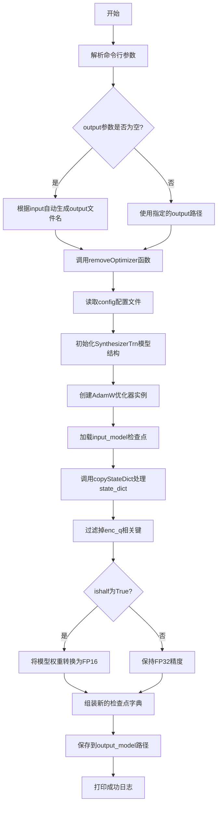
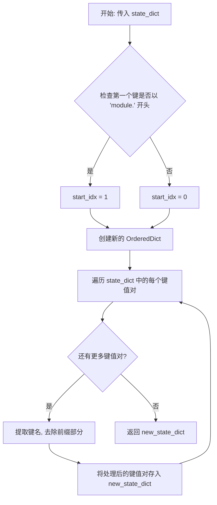

# `Bert-VITS2\compress_model.py` 详细设计文档

该代码是一个模型后处理工具，用于从VITS（Variational Inference with adversarial learning for end-to-end Text-to-Speech）训练好的检查点文件中移除优化器状态，并可选地将模型权重转换为FP16半精度格式，以减小模型体积并适配推理部署。

## 整体流程



## 类结构

```
无自定义类定义
├── 导入模块分析
│   ├── torch (PyTorch框架)
│   ├── models.SynthesizerTrn (VITS声音合成模型)
│   ├── utils (配置加载工具)
│   ├── text.symbols (音素符号表)
│   └── tools.log (日志工具)
```

## 全局变量及字段


### `symbols`
    
音素符号列表，从text.symbols导入，用于VITS模型的音素映射

类型：`list`
    


### `hps`
    
从配置文件加载的超参数对象，包含模型配置、训练配置和数据配置

类型：`dict/object`
    


### `net_g`
    
VITS生成器模型实例，负责语音合成推理

类型：`SynthesizerTrn (torch.nn.Module)`
    


### `optim_g`
    
AdamW优化器实例，用于初始化保存的检查点中的optimizer状态

类型：`torch.optim.AdamW`
    


### `state_dict_g`
    
原始模型检查点字典，包含model、optimizer、iteration等键

类型：`dict`
    


### `new_dict_g`
    
处理后的模型权重字典，已移除enc_q相关权重并可选转换为FP16

类型：`dict`
    


### `keys`
    
需要保留的模型键列表，用于过滤掉enc_q编码器权重

类型：`list`
    


### `args`
    
命令行参数解析结果，包含config、input、output、half等参数

类型：`argparse.Namespace`
    


### `output`
    
输出模型文件的路径字符串

类型：`str`
    


    

## 全局函数及方法


### `copyStateDict`

该函数是处理 PyTorch 多 GPU 模型状态字典的前缀去除工具函数。在使用 `DataParallel` 或 `DistributedDataParallel` 进行多 GPU 训练时，模型状态的键会带有 "module." 前缀，该函数用于移除此前缀，使状态字典能够适配单 GPU 或其他部署场景。

参数：

- `state_dict`：`dict`，PyTorch 模型的状态字典（通常来自 `model.state_dict()`），可能包含多 GPU 训练产生的前缀

返回值：`OrderedDict`，处理后的状态字典，已移除 "module." 前缀

#### 流程图



#### 带注释源码

```python
def copyStateDict(state_dict):
    """
    处理 PyTorch 多 GPU 模块前缀的辅助函数
    
    当使用 DataParallel 或 DistributedDataParallel 进行多 GPU 训练时，
    模型状态的键会带有 'module.' 前缀，该函数用于移除此前缀。
    
    参数:
        state_dict (dict): PyTorch 模型的状态字典
        
    返回:
        OrderedDict: 移除前缀后的新状态字典
    """
    # 获取第一个键，判断是否使用了多 GPU 训练
    # 多 GPU 训练时，键通常以 "module." 开头
    if list(state_dict.keys())[0].startswith("module"):
        start_idx = 1  # 从索引 1 开始，跳过 "module" 部分
    else:
        start_idx = 0  # 无前缀，从头开始
    
    # 创建新的有序字典用于存储处理后的结果
    new_state_dict = OrderedDict()
    
    # 遍历原始状态字典的所有键值对
    for k, v in state_dict.items():
        # 使用 "." 分割键名，并根据 start_idx 重新拼接
        # 例如: "module.encoder.embedding.weight" -> "encoder.embedding.weight"
        name = ",".join(k.split(".")[start_idx:])
        new_state_dict[name] = v
    
    return new_state_dict
```

#### 关键组件信息

| 组件名称 | 一句话描述 |
|---------|-----------|
| `state_dict` | PyTorch 模型的参数字典，可能包含多 GPU 前缀 |
| `new_state_dict` | 处理后的状态字典，用于单 GPU 加载或其他场景 |

#### 潜在技术债务与优化空间

1. **健壮性不足**：仅检查第一个键来判断是否有多 GPU 前缀，如果模型包含多个不相关但以 "module." 开头的键，可能产生误判
2. **性能优化**：可以将 `list(state_dict.keys())[0]` 改为迭代器方式获取第一个键，避免创建完整列表
3. **错误处理**：缺少对空字典 `state_dict` 的边界检查，会导致 `IndexError`
4. **分隔符问题**：使用 `,` 拼接键名可能在某些场景下与原始键中的字符冲突，建议使用 `join(".")` 直接拼接即可，无需逗号分隔


### `removeOptimizer`

移除优化器并可选转换为半精度（FP16）的核心函数，用于将训练好的模型转换为推理可用的发布版本。

参数：

- `config`：`str`，配置文件路径，用于加载超参数配置
- `input_model`：`str`，输入模型路径，包含训练时保存的模型权重和优化器状态
- `ishalf`：`bool`，是否将模型参数转换为半精度（FP16）以减少内存占用
- `output_model`：`str`，输出模型路径，保存处理后的模型权重

返回值：`None`，该函数直接写入文件，不返回任何值

#### 流程图

```mermaid
flowchart TD
    A[开始 removeOptimizer] --> B[加载配置文件获取超参数]
    B --> C[创建 SynthesizerTrn 模型实例]
    C --> D[创建 AdamW 优化器实例]
    D --> E[加载输入模型状态字典到CPU]
    E --> F[调用 copyStateDict 复制并整理状态字典]
    F --> G[过滤掉 enc_q 相关的键]
    G --> H{ishalf 是否为 True?}
    H -->|是| I[将模型参数转换为半精度 .half()]
    H -->|否| J[保持原始精度]
    I --> K[保存模型、优化器、迭代次数到输出文件]
    J --> K
    K --> L[结束]
```

#### 带注释源码

```python
def removeOptimizer(config: str, input_model: str, ishalf: bool, output_model: str):
    """
    移除优化器并可选转换为半精度
    
    参数:
        config: 配置文件路径
        input_model: 输入模型路径
        ishalf: 是否转换为半精度
        output_model: 输出模型路径
    """
    # 步骤1: 从配置文件加载超参数
    hps = utils.get_hparams_from_file(config)

    # 步骤2: 创建 SynthesizerTrn 模型实例（用于初始化模型结构）
    # 参数包括: 音符号数量、频谱维度、音频段长度、说话人数量等
    net_g = SynthesizerTrn(
        len(symbols),                           # 音符号数量
        hps.data.filter_length // 2 + 1,        # 频谱维度
        hps.train.segment_size // hps.data.hop_length,  # 时间步长
        n_speakers=hps.data.n_speakers,         # 说话人数量
        **hps.model,                            # 其他模型超参数
    )

    # 步骤3: 创建 AdamW 优化器实例
    # 虽然优化器会被保存，但它主要用于兼容训练时格式
    optim_g = torch.optim.AdamW(
        net_g.parameters(),          # 模型参数
        hps.train.learning_rate,    # 学习率
        betas=hps.train.betas,      # Adam 动量参数
        eps=hps.train.eps,          # 数值稳定性参数
    )

    # 步骤4: 加载输入模型的状态字典到 CPU
    # 使用 map_location="cpu" 确保兼容性
    state_dict_g = torch.load(input_model, map_location="cpu")
    
    # 步骤5: 调用 copyStateDict 处理状态字典
    # 移除 'module.' 前缀（如果是 DataParallel 格式）
    new_dict_g = copyStateDict(state_dict_g)
    
    # 步骤6: 过滤掉 enc_q 相关的键
    # enc_q 通常是编码器查询层，可能是可选组件
    keys = []
    for k, v in new_dict_g["model"].items():
        if "enc_q" in k:
            continue  # 跳过编码器相关参数
        keys.append(k)

    # 步骤7: 根据 ishalf 参数决定是否转换为半精度
    # .half() 将参数从 FP32 转换为 FP16
    new_dict_g = (
        {k: new_dict_g["model"][k].half() for k in keys}
        if ishalf
        else {k: new_dict_g["model"][k] for k in keys}
    )

    # 步骤8: 保存处理后的模型到输出文件
    # 保存内容包含: 模型权重、迭代次数、optimizer状态、学习率
    torch.save(
        {
            "model": new_dict_g,              # 处理后的模型权重
            "iteration": 0,                   # 重置迭代次数（用于推理）
            "optimizer": optim_g.state_dict(),# 优化器状态（保持兼容性）
            "learning_rate": 0.0001,          # 学习率（固定值）
        },
        output_model,
    )
```

## 关键组件


### copyStateDict 函数

处理分布式训练模型检查点，移除 "module." 前缀并重新构建状态字典，解决 DataParallel/DistributedDataParallel 保存的模型键名问题。

### removeOptimizer 函数

核心业务函数，从训练好的 VITS 模型中移除优化器状态，支持 FP16 半精度转换，用于生成部署用的高效模型文件。

### 命令行参数解析模块

使用 argparse 解析配置文件路径、输入输出模型路径及半精度转换标志，提供灵活的命令行接口。

### 状态字典处理逻辑

遍历模型状态字典过滤掉 "enc_q" 相关键（编码器参数），支持条件性半精度转换，实现模型轻量化。

### 模型序列化模块

使用 torch.save 将处理后的模型参数、优化器状态和学习率保存为标准 checkpoint 格式，支持模型发布流程。


## 问题及建议


### 已知问题

- **函数命名不准确**：`removeOptimizer` 函数实际上并未移除优化器，而是创建了一个新的优化器状态并保存，命名具有误导性。
- **冗余的键过滤逻辑**：先遍历一次 `new_dict_g["model"]` 将键存储到列表，再在字典推导式中再次使用该列表过滤，逻辑冗余。
- **硬编码的学习率**：在保存模型时硬编码了 `learning_rate: 0.0001`，未从原始训练配置 `hps.train.learning_rate` 中获取，可能导致学习率不匹配问题。
- **未使用的模型实例**：创建了 `net_g` (SynthesizerTrn 实例) 但仅用于初始化优化器参数，模型本身未被使用，造成计算资源浪费。
- **缺少文件存在性检查**：未检查输入模型文件和配置文件是否存在，程序可能在后续步骤失败，错误信息不够友好。
- **OrderedDict 的不必要使用**：在 Python 3.7+ 中普通 dict 已保证插入顺序，使用 OrderedDict 无实际必要。
- **copyStateDict 函数的健壮性问题**：假设 state_dict 不为空，若传入空字典会导致 `list(state_dict.keys())[0]` 抛出 IndexError。
- **缺少错误处理**：文件读写、模型加载等操作均未捕获可能发生的异常。
- **未验证模型格式**：未验证输入模型文件的格式或完整性，损坏的模型文件可能导致难以追踪的错误。

### 优化建议

- **修正函数命名**：将 `removeOptimizer` 重命名为如 `export_model_for_inference` 或 `create_release_model` 等更准确的名称。
- **简化过滤逻辑**：使用单次字典推导式完成过滤和半精度转换，例如 `new_dict_g = {k: v.half() if ishalf else v for k, v in new_dict_g["model"].items() if "enc_q" not in k}`。
- **使用配置中的学习率**：将 `learning_rate` 设置为 `hps.train.learning_rate`，保持与训练配置一致。
- **避免创建未使用的模型**：如果仅需要初始化优化器状态，可直接创建空的 AdamW 优化器而无需构建完整模型图，或直接保存一个空的优化器状态字典。
- **添加输入验证**：在函数开头添加文件存在性检查，使用 `os.path.exists()` 验证配置文件和输入模型路径。
- **移除 OrderedDict**：直接使用普通 dict 代替 OrderedDict。
- **增强 copyStateDict 鲁棒性**：添加空字典检查或使用 `next(iter(state_dict.keys()), None)` 安全获取首个键。
- **添加异常处理**：使用 try-except 包装可能失败的操作（如文件读取、模型加载），提供有意义的错误信息。
- **添加模型验证**：在加载后验证模型键是否符合预期结构，确保包含 "model" 等必要键。

## 其它


### 一段话描述

该代码是一个VITS（Voice Transformer）语音合成模型的权重处理工具，主要功能是从训练好的模型检查点中移除优化器状态，并将模型权重转换为可部署的发布版本，支持可选的FP16半精度转换，以减小模型体积并加速推理。

### 文件的整体运行流程

1. 脚本通过命令行参数接收配置路径、输入模型路径、输出模型路径和半精度标志
2. 调用`removeOptimizer`函数进行处理
3. 在`removeOptimizer`内部：
   - 通过配置文件路径加载超参数
   - 创建SynthesizerTrn模型实例（仅用于初始化结构）
   - 创建AdamW优化器实例
   - 使用`copyStateDict`函数加载并清理模型权重（去除"module."前缀）
   - 过滤掉编码器相关参数（enc_q）
   - 根据ishalf参数决定是否将权重转换为半精度
   - 保存处理后的模型到指定路径

### 类的详细信息

该代码文件中未定义自定义类，主要使用外部导入的类：

**SynthesizerTrn类（从models导入）**
- 描述：VITS语音合成模型的核心类
- 用途：实例化模型结构以匹配权重维度

### 全局变量

**symbols**
- 类型：从text.symbols导入的符号列表
- 描述：语音合成所用的音素符号集合

### 全局函数

**copyStateDict**
- 参数：
  - state_dict（dict类型，原始模型状态字典）
- 返回值：new_state_dict（dict类型，清理后的状态字典）
- 描述：移除PyTorch DataParallel保存的"module."前缀键，处理多GPU训练模型的权重加载
- 流程图：略
- 源码：
```python
def copyStateDict(state_dict):
    if list(state_dict.keys())[0].startswith("module"):
        start_idx = 1
    else:
        start_idx = 0
    new_state_dict = OrderedDict()
    for k, v in state_dict.items():
        name = ",".join(k.split(".")[start_idx:])
        new_state_dict[name] = v
    return new_state_dict
```

**removeOptimizer**
- 参数：
  - config（str类型，配置文件路径）
  - input_model（str类型，输入模型路径）
  - ishalf（bool类型，是否保存为FP16）
  - output_model（str类型，输出模型路径）
- 返回值：无（None）
- 描述：从训练检查点中移除优化器状态，并可选转换为半精度格式
- 流程图：略
- 源码：见原始代码

### 关键组件信息

**VITS模型检查点处理器**
- 描述：负责将包含优化器状态的训练检查点转换为可部署的模型权重文件

**参数过滤模块**
- 描述：用于过滤掉不需要的编码器参数（enc_q），仅保留声学模型和 vocoder 部分

**半精度转换模块**
- 描述：将32位浮点权重转换为16位浮点，减小模型体积

### 潜在的技术债务或优化空间

1. **硬编码的学习率**：在保存模型时使用硬编码的0.0001作为学习率，应从原始检查点中读取
2. **缺少错误处理**：文件路径不存在、模型格式错误等情况缺乏完善的异常处理
3. **参数过滤逻辑不透明**：直接跳过enc_q参数但未提供配置选项，限制了灵活性
4. **未使用Optimzer的实际状态**：创建新的优化器并保存空状态，这在加载时可能导致不一致
5. **缺少验证逻辑**：保存后未验证输出文件的完整性和可用性

### 设计目标与约束

- **目标**：将VITS训练检查点转换为可部署的发布版本，减小模型体积
- **约束**：配置文件必须存在且格式正确；输入模型必须是有效的PyTorch检查点文件
- **输入格式**：JSON配置文件 + PyTorch .pt/.pth模型文件
- **输出格式**：PyTorch模型文件（包含model、iteration、optimizer、learning_rate键）

### 错误处理与异常设计

1. **文件不存在**：如果配置文件或输入模型路径不存在，torch.load和utils.get_hparams_from_file会抛出FileNotFoundError
2. **模型格式错误**：如果输入模型不是有效的PyTorch检查点，torch.load会失败
3. **配置解析错误**：JSON格式错误会导致解析失败
4. **缺少必要字段**：模型权重中缺少必要参数时会抛出KeyError
5. **当前问题**：缺乏try-except包装，错误信息不够友好

### 数据流与状态机

**输入数据流**：
- 配置文件（JSON）→ 解析为hps对象 → 提取模型/训练/数据参数
- 训练检查点（.pt文件）→ torch.load → 状态字典 → copyStateDict清理 → 过滤参数

**处理状态**：
- 初始化状态 → 加载配置 → 加载模型 → 权重处理 → 保存模型 → 完成

**输出数据流**：
- 处理后的权重字典 + 迭代次数 + 优化器状态 → torch.save → 输出文件

### 外部依赖与接口契约

**依赖库**：
- torch：模型加载、权重处理、优化器创建
- collections.OrderedDict：有序字典操作
- os、argparse：文件路径处理、命令行参数解析

**内部模块依赖**：
- text.symbols：音素符号表
- utils.get_hparams_from_file：配置文件解析
- models.SynthesizerTrn：VITS模型类
- tools.log：日志记录

**接口契约**：
- removeOptimizer函数接收config路径、input_model路径、ishalf标志、output_model路径
- 输入模型必须包含"model"键和对应的权重字典
- 输出模型包含固定的四键结构：model、iteration、optimizer、learning_rate

    