# `Bert-VITS2\config.py` 详细设计文档

这是一个全局配置文件读取模块，通过YAML配置文件加载和管理整个项目的各类配置参数，包括重采样、文本预处理、BERT生成、情感生成、训练、WebUI、服务器和翻译API等配置，并提供命令行参数解析功能。

## 整体流程

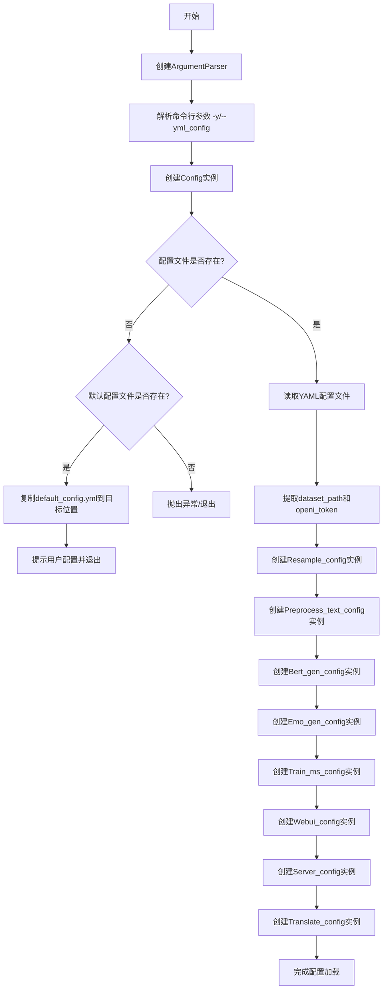

## 类结构

```
Config (主配置类)
├── Resample_config (重采样配置)
├── Preprocess_text_config (文本预处理配置)
├── Bert_gen_config (BERT生成配置)
├── Emo_gen_config (情感生成配置)
├── Train_ms_config (训练配置)
├── Webui_config (WebUI配置)
├── Server_config (服务器配置)
└── Translate_config (翻译API配置)
```

## 全局变量及字段


### `parser`
    
命令行参数解析器对象

类型：`ArgumentParser`
    


### `args`
    
解析后的命令行参数命名空间

类型：`Namespace`
    


### `config`
    
全局配置对象，包含所有配置子项

类型：`Config`
    


### `yaml_config`
    
从YAML文件加载的原始配置字典

类型：`Dict[str, any]`
    


### `dataset_path`
    
数据集根目录路径

类型：`str`
    


### `openi_token`
    
OpenI平台访问令牌

类型：`str`
    


### `Resample_config.sampling_rate`
    
目标采样率

类型：`int`
    


### `Resample_config.in_dir`
    
待处理音频目录路径

类型：`str`
    


### `Resample_config.out_dir`
    
重采样输出路径

类型：`str`
    


### `Preprocess_text_config.transcription_path`
    
原始文本文件路径，文本格式应为{wav_path}|{speaker_name}|{language}|{text}

类型：`str`
    


### `Preprocess_text_config.cleaned_path`
    
数据清洗后文本路径，可以不填，不填则将在原始文本目录生成

类型：`str`
    


### `Preprocess_text_config.train_path`
    
训练集路径，可以不填，不填则将在原始文本目录生成

类型：`str`
    


### `Preprocess_text_config.val_path`
    
验证集路径，可以不填，不填则将在原始文本目录生成

类型：`str`
    


### `Preprocess_text_config.config_path`
    
配置文件路径

类型：`str`
    


### `Preprocess_text_config.val_per_lang`
    
每个speaker的验证集条数

类型：`int`
    


### `Preprocess_text_config.max_val_total`
    
验证集最大条数，多于的会被截断并放到训练集中

类型：`int`
    


### `Preprocess_text_config.clean`
    
是否进行数据清洗

类型：`bool`
    


### `Bert_gen_config.config_path`
    
配置文件路径

类型：`str`
    


### `Bert_gen_config.num_processes`
    
处理进程数

类型：`int`
    


### `Bert_gen_config.device`
    
计算设备

类型：`str`
    


### `Bert_gen_config.use_multi_device`
    
是否使用多设备

类型：`bool`
    


### `Emo_gen_config.config_path`
    
配置文件路径

类型：`str`
    


### `Emo_gen_config.num_processes`
    
处理进程数

类型：`int`
    


### `Emo_gen_config.device`
    
计算设备

类型：`str`
    


### `Emo_gen_config.use_multi_device`
    
是否使用多设备

类型：`bool`
    


### `Train_ms_config.env`
    
需要加载的环境变量

类型：`Dict[str, any]`
    


### `Train_ms_config.base`
    
底模配置

类型：`Dict[str, any]`
    


### `Train_ms_config.model`
    
训练模型存储目录，该路径为相对于dataset_path的路径，而非项目根目录

类型：`str`
    


### `Train_ms_config.config_path`
    
配置文件路径

类型：`str`
    


### `Train_ms_config.num_workers`
    
worker数量

类型：`int`
    


### `Train_ms_config.spec_cache`
    
是否启用spec缓存

类型：`bool`
    


### `Train_ms_config.keep_ckpts`
    
ckpt数量

类型：`int`
    


### `Webui_config.device`
    
设备类型

类型：`str`
    


### `Webui_config.model`
    
模型路径

类型：`str`
    


### `Webui_config.config_path`
    
配置文件路径

类型：`str`
    


### `Webui_config.port`
    
端口号

类型：`int`
    


### `Webui_config.share`
    
是否公开部署，对外网开放

类型：`bool`
    


### `Webui_config.debug`
    
是否开启debug模式

类型：`bool`
    


### `Webui_config.language_identification_library`
    
语种识别库

类型：`str`
    


### `Server_config.models`
    
需要加载的所有模型的配置

类型：`List[Dict[str, any]]`
    


### `Server_config.port`
    
端口号

类型：`int`
    


### `Server_config.device`
    
模型默认使用设备

类型：`str`
    


### `Translate_config.app_key`
    
翻译API应用密钥

类型：`str`
    


### `Translate_config.secret_key`
    
翻译API秘密密钥

类型：`str`
    


### `Config.dataset_path`
    
数据集根目录路径

类型：`str`
    


### `Config.mirror`
    
镜像源地址

类型：`str`
    


### `Config.openi_token`
    
OpenI平台访问令牌

类型：`str`
    


### `Config.resample_config`
    
重采样配置对象

类型：`Resample_config`
    


### `Config.preprocess_text_config`
    
文本预处理配置对象

类型：`Preprocess_text_config`
    


### `Config.bert_gen_config`
    
BERT生成配置对象

类型：`Bert_gen_config`
    


### `Config.emo_gen_config`
    
情感生成配置对象

类型：`Emo_gen_config`
    


### `Config.train_ms_config`
    
训练配置对象

类型：`Train_ms_config`
    


### `Config.webui_config`
    
WebUI配置对象

类型：`Webui_config`
    


### `Config.server_config`
    
服务器配置对象

类型：`Server_config`
    


### `Config.translate_config`
    
翻译API配置对象

类型：`Translate_config`
    
    

## 全局函数及方法


### `argparse.ArgumentParser`

该代码使用 Python 标准库的 `argparse.ArgumentParser` 类来解析命令行参数，主要用于接收配置文件路径的可选参数 `-y/--yml_config`，默认值为 `config.yml`。

参数：

-  无显式参数（使用所有默认参数）

返回值：`argparse.ArgumentParser`，返回命令行参数解析器对象

#### 流程图

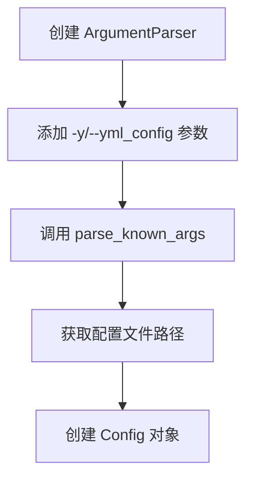

#### 带注释源码

```python
# 创建 ArgumentParser 实例，用于解析命令行参数
# 未显式传递任何参数，使用如下默认行为：
# - prog: 默认使用 sys.argv[0]
# - description: 默认为 None
# - epilog: 默认为 None
# - parents: 默认空列表
# - formatter_class: 默认 argparse.RawDescriptionHelpFormatter
# - prefix_chars: 默认 '-'
# - fromfile_prefix_chars: 默认为 None
# - argument_default: 默认为 None
# - conflict_handler: 默认为 'error'
# - add_help: 默认为 True
# - allow_abbrev: 默认为 True
parser = argparse.ArgumentParser()

# 为避免与以前的 config.json 起冲突，将其更名如下
# 添加 -y/--yml_config 参数，类型为字符串，默认值为 config.yml
parser.add_argument("-y", "--yml_config", type=str, default="config.yml")

# 解析已知参数，args 包含已解析的参数，_ 包含未识别的参数（被忽略）
args, _ = parser.parse_known_args()

# 使用解析到的配置文件路径创建 Config 对象
config = Config(args.yml_config)
```


### `parser.parse_known_args`

解析命令行参数，返回已解析的参数对象和未识别的参数列表。该方法类似于 `parse_args()`，但不会对未知的参数抛出错误，而是将它们单独返回。

参数：

- `args`：可选参数，类型为 `List[str]`，默认为 `None`（即使用 `sys.argv`）。用于指定要解析的参数列表。
- `namespace`：可选参数，类型为 `Namespace`，默认为 `None`。用于指定一个已有的命名空间对象，解析结果将填充到该对象中。

返回值：`Tuple[Namespace, List[str]]`，返回一个元组，包含：
- 第一个元素：已解析的参数命名空间对象（`Namespace` 类型），包含所有已识别参数的值。
- 第二个元素：未识别的参数列表（`List[str]` 类型），即命令行中未被 `ArgumentParser` 定义的参数。

#### 流程图

```mermaid
flowchart TD
    A[开始 parse_known_args] --> B{args 参数是否为空?}
    B -->|是| C[使用 sys.argv[1:] 作为参数列表]
    B -->|否| D[使用传入的 args 列表]
    C --> E[遍历所有定义的参数动作]
    D --> E
    E --> F{当前参数是否匹配定义?}
    F -->|是| G[解析参数值并存储到 namespace]
    F -->|否| H{是否允许未知参数?}
    H -->|是| I[将该参数加入未知参数列表]
    H -->|否| J[跳过该参数或记录]
    G --> K{还有更多参数?}
    I --> K
    J --> K
    K -->|是| E
    K -->|否| L[返回 namespace 和未知参数列表]
    L --> M[结束]
```

#### 带注释源码

```python
# 从 argparse 模块导入 ArgumentParser 类
from argparse import ArgumentParser

# 创建一个命令行参数解析器实例
parser = ArgumentParser()

# 为解析器添加命令行参数选项
# -y 或 --yml_config: 指定 YAML 配置文件路径，默认为 "config.yml"
parser.add_argument("-y", "--yml_config", type=str, default="config.yml")

# 调用 parse_known_args 方法解析命令行参数
# 该方法会：
# 1. 读取命令行传入的参数（默认使用 sys.argv[1:]）
# 2. 与解析器中定义的参数进行匹配
# 3. 返回已解析的参数对象和未识别的参数列表
# 注意：下划线 _ 用于接收未识别的参数列表，表示我们不关心这些参数
args, _ = parser.parse_known_args()

# 解析结果示例：
# 如果命令行输入: python script.py -y my_config.yml unknown_arg
# 则 args 包含: Namespace(yml_config='my_config.yml')
# 未知参数列表: ['unknown_arg']
```


### `Resample_config.__init__`

初始化重采样配置类，设置目标采样率、输入音频目录路径和输出目录路径。

参数：

- `self`：隐式参数，类实例本身
- `in_dir`：`str`，待处理音频目录路径
- `out_dir`：`str`，重采样输出路径
- `sampling_rate`：`int`，目标采样率，默认为 44100

返回值：`None`，构造函数不返回任何值，仅初始化实例属性

#### 流程图

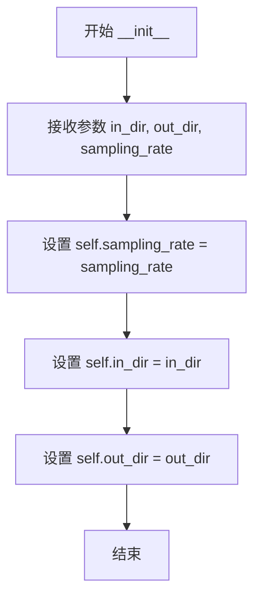

#### 带注释源码

```python
def __init__(self, in_dir: str, out_dir: str, sampling_rate: int = 44100):
    """
    初始化 Resample_config 实例
    
    参数:
        in_dir: str, 待处理音频目录路径
        out_dir: str, 重采样输出路径
        sampling_rate: int, 目标采样率，默认为 44100
    """
    self.sampling_rate: int = sampling_rate  # 目标采样率
    self.in_dir: str = in_dir  # 待处理音频目录路径
    self.out_dir: str = out_dir  # 重采样输出路径
```


### `Resample_config.from_dict`

该类方法是一个工厂方法，用于将包含重采样配置的字典对象转换为 `Resample_config` 实例。它接收数据集根路径和配置字典，通过拼接路径生成完整的输入输出目录，并返回初始化后的配置对象。

参数：

- `cls`：`type`，类本身（classmethod 隐式参数）
- `dataset_path`：`str`，数据集根目录路径，用于与配置字典中的相对路径进行拼接
- `data`：`Dict[str, any]`，包含重采样配置的字典，应包含 `in_dir`、`out_dir` 和可选的 `sampling_rate` 字段

返回值：`Resample_config`，返回新创建的 `Resample_config` 实例对象

#### 流程图

```mermaid
flowchart TD
    A[开始 from_dict] --> B[接收 dataset_path 和 data 参数]
    B --> C[将 data['in_dir'] 与 dataset_path 拼接]
    C --> D[将 data['out_dir'] 与 dataset_path 拼接]
    D --> E[使用修改后的 data 调用 cls 构造函数]
    E --> F[创建 Resample_config 实例]
    F --> G[返回实例]
```

#### 带注释源码

```python
@classmethod
def from_dict(cls, dataset_path: str, data: Dict[str, any]):
    """从字典中生成实例"""

    # 不检查路径是否有效，此逻辑在resample.py中处理
    # 将配置中的相对路径 in_dir 与数据集根路径进行拼接，生成完整的绝对路径
    data["in_dir"] = os.path.join(dataset_path, data["in_dir"])
    
    # 将配置中的相对路径 out_dir 与数据集根路径进行拼接，生成完整的绝对路径
    data["out_dir"] = os.path.join(dataset_path, data["out_dir"])

    # 使用展开后的 data 字典作为关键字参数调用类的构造函数，创建新实例并返回
    return cls(**data)
```


### Preprocess_text_config.__init__

数据预处理配置类的构造函数，用于初始化文本预处理相关的各种路径和参数配置。

参数：

- `transcription_path`：`str`，原始文本文件路径，文本格式应为`{wav_path}|{speaker_name}|{language}|{text}`
- `cleaned_path`：`str`，数据清洗后文本路径，可以不填，不填则将在原始文本目录生成
- `train_path`：`str`，训练集路径，可以不填，不填则将在原始文本目录生成
- `val_path`：`str`，验证集路径，可以不填，不填则将在原始文本目录生成
- `config_path`：`str`，配置文件路径
- `val_per_lang`：`int`，每个speaker的验证集条数，默认值为5
- `max_val_total`：`int`，验证集最大条数，多于的会被截断并放到训练集中，默认值为10000
- `clean`：`bool`，是否进行数据清洗，默认值为True

返回值：`None`，该方法为构造函数，不返回任何值，仅初始化实例属性

#### 流程图

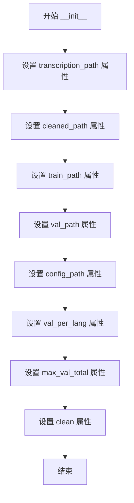

#### 带注释源码

```python
def __init__(
    self,
    transcription_path: str,
    cleaned_path: str,
    train_path: str,
    val_path: str,
    config_path: str,
    val_per_lang: int = 5,
    max_val_total: int = 10000,
    clean: bool = True,
):
    """数据预处理配置类的构造函数"""
    
    # 原始文本文件路径，文本格式应为{wav_path}|{speaker_name}|{language}|{text}
    self.transcription_path: str = transcription_path
    
    # 数据清洗后文本路径，可以不填。不填则将在原始文本目录生成
    self.cleaned_path: str = cleaned_path
    
    # 训练集路径，可以不填。不填则将在原始文本目录生成
    self.train_path: str = train_path
    
    # 验证集路径，可以不填。不填则将在原始文本目录生成
    self.val_path: str = val_path
    
    # 配置文件路径
    self.config_path: str = config_path
    
    # 每个speaker的验证集条数
    self.val_per_lang: int = val_per_lang
    
    # 验证集最大条数，多于的会被截断并放到训练集中
    self.max_val_total: int = max_val_total
    
    # 是否进行数据清洗
    self.clean: bool = clean
```


### `Preprocess_text_config.from_dict`

该类方法用于将字典配置数据转换为 `Preprocess_text_config` 实例，通过将相对路径与 `dataset_path` 拼接生成完整的绝对路径，并处理可选字段的空值情况。

#### 参数

- `cls`：`Preprocess_text_config`，隐式类参数，表示类本身
- `dataset_path`：`str`，数据集根目录路径，用于与配置中的相对路径拼接生成绝对路径
- `data`：`Dict[str, any]`，包含预处理配置的字典，需包含 `transcription_path`、`cleaned_path`、`train_path`、`val_path`、`config_path` 等键

#### 返回值

- `Preprocess_text_config`，返回新创建的实例对象

#### 流程图

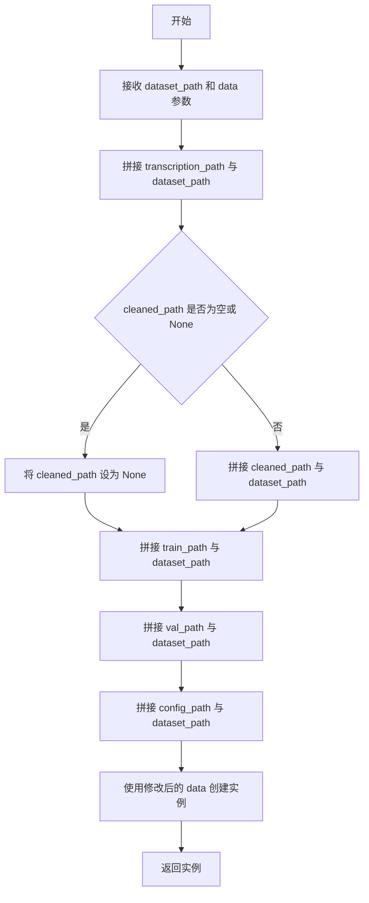

#### 带注释源码

```python
@classmethod
def from_dict(cls, dataset_path: str, data: Dict[str, any]):
    """从字典中生成实例"""
    
    # 将相对路径转换为绝对路径：拼接 transcription_path 与 dataset_path
    data["transcription_path"] = os.path.join(
        dataset_path, data["transcription_path"]
    )
    
    # 处理 cleaned_path：如果为空字符串或 None，则设为 None；
    # 否则拼接为绝对路径
    if data["cleaned_path"] == "" or data["cleaned_path"] is None:
        data["cleaned_path"] = None
    else:
        data["cleaned_path"] = os.path.join(dataset_path, data["cleaned_path"])
    
    # 拼接训练集路径
    data["train_path"] = os.path.join(dataset_path, data["train_path"])
    
    # 拼接验证集路径
    data["val_path"] = os.path.join(dataset_path, data["val_path"])
    
    # 拼接配置文件路径
    data["config_path"] = os.path.join(dataset_path, data["config_path"])

    # 使用处理后的 data 字典解包创建 Preprocess_text_config 实例
    return cls(**data)
```


### `Bert_gen_config.__init__`

该方法是 `Bert_gen_config` 类的构造函数，用于初始化 BERT 生成模型的配置参数，包括配置文件路径、进程数、设备类型和多设备选项。

参数：

- `config_path`：`str`，配置文件路径
- `num_processes`：`int`，并行处理的进程数量，默认为 2
- `device`：`str`，模型运行的设备，默认为 "cuda"
- `use_multi_device`：`bool`，是否启用多设备并行，默认为 False

返回值：`None`，该方法为构造函数，不返回任何值，仅初始化实例属性

#### 流程图

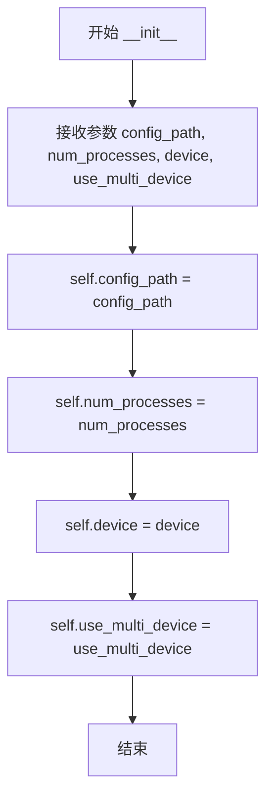

#### 带注释源码

```python
def __init__(
    self,
    config_path: str,
    num_processes: int = 2,
    device: str = "cuda",
    use_multi_device: bool = False,
):
    """bert_gen 配置初始化方法

    Args:
        config_path: 配置文件路径
        num_processes: 并行处理的进程数量，默认为2
        device: 模型运行的设备，默认为cuda
        use_multi_device: 是否启用多设备并行，默认为False
    """
    self.config_path = config_path  # 存储配置文件路径
    self.num_processes = num_processes  # 存储进程数量配置
    self.device = device  # 存储设备类型
    self.use_multi_device = use_multi_device  # 存储多设备标志
```


### `Bert_gen_config.from_dict`

该类方法用于从字典对象中构建 `Bert_gen_config` 实例，主要完成配置路径的绝对路径转换功能。

参数：

- `dataset_path`：`str`，数据集根目录路径，用于拼接相对配置路径
- `data`：`Dict[str, any]`，包含 bert_gen 配置信息的字典，应包含 `config_path`、`num_processes`、`device`、`use_multi_device` 等键

返回值：`Bert_gen_config`，返回配置类实例对象

#### 流程图

```mermaid
flowchart TD
    A[开始 from_dict] --> B[获取 data['config_path']]
    B --> C{检查 config_path}
    C -->|存在| D[使用 os.path.join 拼接 dataset_path 和 config_path]
    C -->|不存在| E[保留原值或使用默认值]
    D --> F[更新 data['config_path']]
    F --> G[调用 cls 构造函数传入更新后的 data]
    G --> H[返回 Bert_gen_config 实例]
    E --> G
```

#### 带注释源码

```python
@classmethod
def from_dict(cls, dataset_path: str, data: Dict[str, any]):
    """
    从字典中生成 Bert_gen_config 实例
    
    参数:
        dataset_path: str, 数据集根目录路径
        data: Dict[str, any], 配置文件字典，包含配置信息
    
    返回:
        Bert_gen_config: 配置类实例
    """
    # 使用 os.path.join 将相对路径转换为绝对路径
    # dataset_path 为数据集根目录，data['config_path'] 为配置文件相对路径
    data["config_path"] = os.path.join(dataset_path, data["config_path"])

    # 使用解包运算符 ** 将字典参数传递给构造函数
    return cls(**data)
```


### `Emo_gen_config.__init__`

Emo_gen_config 类的构造函数，用于初始化 emo_gen（情感生成）模块的配置参数，包括配置文件路径、并行进程数、计算设备和多设备支持选项。

参数：

- `config_path`：`str`， emo_gen 配置文件路径
- `num_processes`：`int`，并行处理的进程数量，默认为 2
- `device`：`str`，计算设备，默认为 "cuda"
- `use_multi_device`：`bool`，是否启用多设备并行，默认为 False

返回值：`None`，构造函数不返回值，仅初始化实例属性

#### 流程图

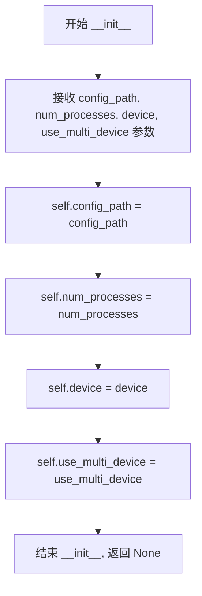

#### 带注释源码

```python
def __init__(
    self,
    config_path: str,
    num_processes: int = 2,
    device: str = "cuda",
    use_multi_device: bool = False,
):
    """emo_gen 配置类的初始化方法

    Args:
        config_path: emo_gen 配置文件路径
        num_processes: 并行处理的进程数量，默认为 2
        device: 计算设备，默认为 "cuda"
        use_multi_device: 是否启用多设备并行，默认为 False

    Returns:
        None
    """
    self.config_path = config_path  # 配置文件路径
    self.num_processes = num_processes  # 并行进程数量
    self.device = device  # 计算设备
    self.use_multi_device = use_multi_device  # 是否使用多设备
```


### `Emo_gen_config.from_dict`

从字典数据生成 `Emo_gen_config` 实例的工厂方法，用于将配置文件中的相对路径转换为绝对路径。

参数：

- `cls`：隐式参数，表示类本身
- `dataset_path`：`str`，数据集根目录路径，用于拼接相对路径
- `data`：`Dict[str, any]`，包含 emo_gen 配置的字典，应包含 `config_path`、`num_processes`、`device`、`use_multi_device` 字段

返回值：`Emo_gen_config`，返回新创建的 `Emo_gen_config` 实例

#### 流程图

```mermaid
flowchart TD
    A[开始: from_dict] --> B[接收 dataset_path 和 data 字典]
    B --> C{检查 data 中的 config_path}
    C -->|存在| D[使用 os.path.join 拼接 dataset_path 和 config_path]
    C -->|不存在| E[保留原 config_path]
    D --> F[更新 data['config_path'] 为绝对路径]
    E --> F
    F --> G[使用 cls(**data) 创建 Emo_gen_config 实例]
    G --> H[返回新创建的实例]
```

#### 带注释源码

```python
@classmethod
def from_dict(cls, dataset_path: str, data: Dict[str, any]):
    """从字典中生成实例"""
    
    # 将配置文件中相对路径的 config_path 与 dataset_path 拼接成绝对路径
    # data["config_path"] 来自 YAML 配置文件，是相对于 dataset_path 的路径
    data["config_path"] = os.path.join(dataset_path, data["config_path"])

    # 使用解包后的参数创建 Emo_gen_config 类实例并返回
    # cls.__init__ 会接收 config_path, num_processes, device, use_multi_device
    return cls(**data)
```


### `Train_ms_config.__init__`

初始化训练配置类，用于设置模型训练所需的各种参数和环境变量。

参数：

-  `config_path`：`str`，配置文件路径
-  `env`：`Dict[str, any]`，需要加载的环境变量
-  `base`：`Dict[str, any]`，底模配置
-  `model`：`str`，训练模型存储目录，该路径为相对于dataset_path的路径，而非项目根目录
-  `num_workers`：`int`，worker数量
-  `spec_cache`：`bool`，是否启用spec缓存
-  `keep_ckpts`：`int`，ckpt数量

返回值：`None`，该方法为构造函数，不返回任何值

#### 流程图

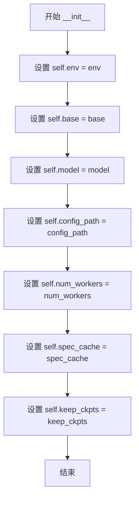

#### 带注释源码

```python
def __init__(
    self,
    config_path: str,
    env: Dict[str, any],
    base: Dict[str, any],
    model: str,
    num_workers: int,
    spec_cache: bool,
    keep_ckpts: int,
):
    """初始化训练配置
    
    参数:
        config_path: 配置文件路径
        env: 需要加载的环境变量
        base: 底模配置
        model: 训练模型存储目录，该路径为相对于dataset_path的路径，而非项目根目录
        num_workers: worker数量
        spec_cache: 是否启用spec缓存
        keep_ckpts: ckpt数量
    """
    self.env = env  # 需要加载的环境变量
    self.base = base  # 底模配置
    self.model = (
        model  # 训练模型存储目录，该路径为相对于dataset_path的路径，而非项目根目录
    )
    self.config_path = config_path  # 配置文件路径
    self.num_workers = num_workers  # worker数量
    self.spec_cache = spec_cache  # 是否启用spec缓存
    self.keep_ckpts = keep_ckpts  # ckpt数量
```


### `Train_ms_config.from_dict`

该方法是一个类方法（@classmethod），用于将配置字典转换为 `Train_ms_config` 类的实例。它接收数据集根路径和配置数据字典，将配置中的相对路径（如 `config_path`）与数据集根路径进行拼接，生成完整的绝对路径，然后实例化并返回配置对象。

参数：

- `cls`：类本身（Python 类方法隐式参数），`type`，表示方法所属的类
- `dataset_path`：`str`，数据集根目录路径，用于与配置中的相对路径进行拼接
- `data`：`Dict[str, any]`，包含训练配置信息的字典，需包含 `config_path`、`env`、`base`、`model`、`num_workers`、`spec_cache`、`keep_ckpts` 等键

返回值：`Train_ms_config`，返回根据配置数据生成的类实例

#### 流程图

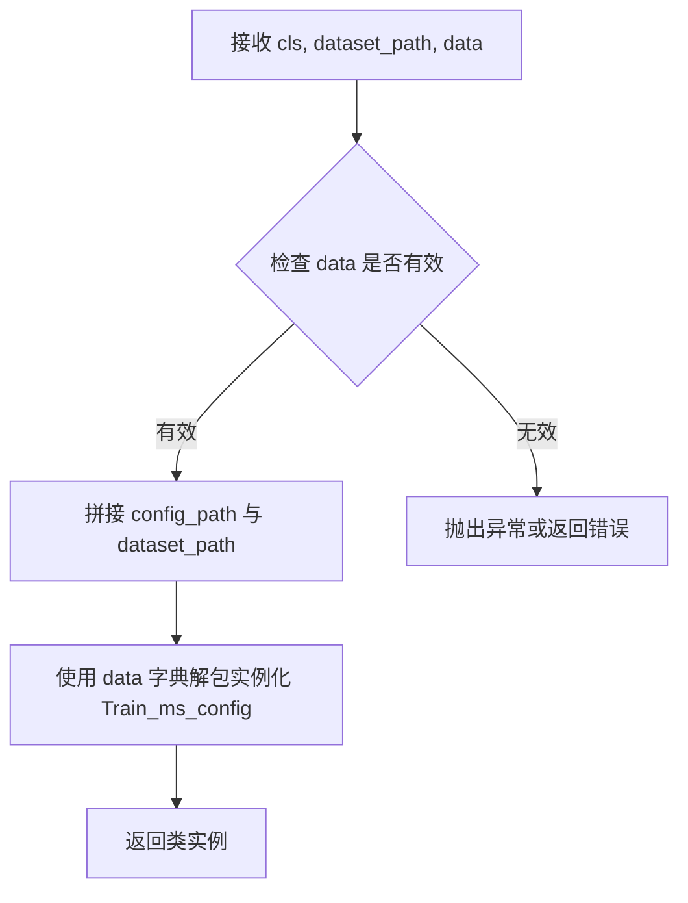

#### 带注释源码

```python
@classmethod
def from_dict(cls, dataset_path: str, data: Dict[str, any]):
    """从字典中生成训练配置实例"""
    
    # 注意：model 路径的拼接已被注释掉
    # 原因：model 路径可能已经是绝对路径，或者相对于其他目录
    # data["model"] = os.path.join(dataset_path, data["model"])
    
    # 将配置文件路径与数据集根路径进行拼接
    # 将相对路径转换为绝对路径，确保配置文件可以被正确读取
    data["config_path"] = os.path.join(dataset_path, data["config_path"])

    # 使用处理后的配置数据实例化类
    # 字典解包将 data 中的键值对作为关键字参数传递给构造函数
    return cls(**data)
```


### `Webui_config.__init__`

Webui_config类的初始化方法，用于配置WebUI服务的各项参数，包括设备类型、模型路径、配置文件、端口号、部署方式和调试模式等。

参数：

- `device`：`str`，运行设备（如"cuda"或"cpu"）
- `model`：`str`，模型路径
- `config_path`：`str`，配置文件路径
- `language_identification_library`：`str`，语种识别库名称
- `port`：`int`，服务端口号，默认值为7860
- `share`：`bool`，是否公开部署（对外网开放），默认值为False
- `debug`：`bool`，是否开启调试模式，默认值为False

返回值：`None`，该方法无返回值，仅初始化实例属性

#### 流程图

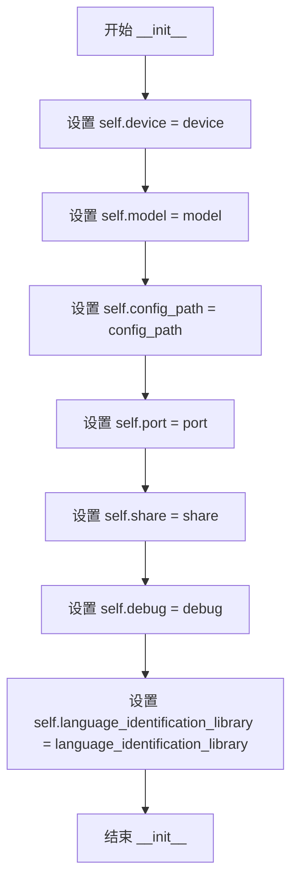

#### 带注释源码

```python
def __init__(
    self,
    device: str,
    model: str,
    config_path: str,
    language_identification_library: str,
    port: int = 7860,
    share: bool = False,
    debug: bool = False,
):
    """WebUI配置类的初始化方法"""
    self.device: str = device  # 运行设备类型，如'cuda'或'cpu'
    self.model: str = model  # 模型文件路径
    self.config_path: str = config_path  # 配置文件路径
    self.port: int = port  # WebUI服务端口号，默认7860
    self.share: bool = share  # 是否公开部署，对外网开放，默认False
    self.debug: bool = debug  # 是否开启debug模式，默认False
    self.language_identification_library: str = (
        language_identification_library  # 语种识别库名称
    )
```


### `Webui_config.from_dict`

该类方法用于将包含 WebUI 配置的字典数据转换为 `Webui_config` 实例，通过将配置中的相对路径与数据集路径进行拼接，生成完整的绝对路径。

参数：

- `cls`：类本身（隐式参数），`type`，Python 类方法的标准隐式参数
- `dataset_path`：`str`，数据集根目录路径，用于与配置中的相对路径进行拼接
- `data`：`Dict[str, any]`，包含 WebUI 配置信息的字典，应包含 `device`、`model`、`config_path`、`language_identification_library` 等键

返回值：`Webui_config`，返回新创建的 `Webui_config` 实例

#### 流程图

```mermaid
flowchart TD
    A[开始 from_dict] --> B{检查 data 字典}
    B -->|有效| C[拼接 config_path: os.path.join(dataset_path, data['config_path'])]
    C --> D[拼接 model: os.path.join(dataset_path, data['model'])]
    D --> E[使用修改后的 data 调用 cls 构造函数]
    E --> F[返回新的 Webui_config 实例]
    B -->|无效| G[抛出异常或返回错误]
```

#### 带注释源码

```python
@classmethod
def from_dict(cls, dataset_path: str, data: Dict[str, any]):
    """从字典中生成实例"""
    
    # 将配置中的相对 config_path 与 dataset_path 拼接成绝对路径
    # data["config_path"] 存储的是相对于 dataset_path 的相对路径
    data["config_path"] = os.path.join(dataset_path, data["config_path"])
    
    # 将配置中的相对 model 路径与 dataset_path 拼接成绝对路径
    # data["model"] 存储的是相对于 dataset_path 的模型路径
    data["model"] = os.path.join(dataset_path, data["model"])
    
    # 使用处理后的完整参数创建并返回 Webui_config 实例
    # 构造函数 __init__ 会接收:
    #   - device: 设备类型 (如 'cuda', 'cpu')
    #   - model: 完整的模型路径
    #   - config_path: 完整的配置文件路径
    #   - language_identification_library: 语种识别库名称
    #   - port: 端口号 (默认 7860)
    #   - share: 是否公开部署 (默认 False)
    #   - debug: 是否开启调试模式 (默认 False)
    return cls(**data)
```


### `Server_config.__init__`

该方法为服务器配置类的构造函数，用于初始化服务器运行所需的模型列表、端口号和设备类型等核心参数。

参数：

- `self`：隐式参数，Server_config实例本身
- `models`：`List[Dict[str, any]]`，需要加载的所有模型的配置列表，每个元素为一个包含模型相关参数的字典
- `port`：`int`，服务器监听端口号，默认为5000
- `device`：`str`，模型默认使用设备，默认为"cuda"（可选"cpu"）

返回值：`None`，该方法为构造函数，不返回任何值，仅通过赋值语句初始化实例属性

#### 流程图

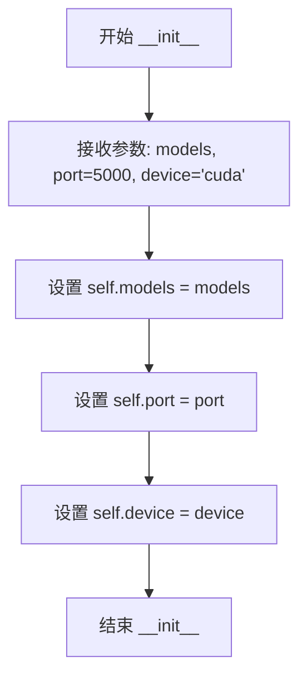

#### 带注释源码

```python
def __init__(
    self, models: List[Dict[str, any]], port: int = 5000, device: str = "cuda"
):
    """
    服务器配置类的构造函数
    
    参数:
        models: 需要加载的所有模型的配置列表
        port: 服务器监听端口号，默认为5000
        device: 模型默认使用设备，默认为"cuda"
    """
    # 将模型配置列表赋值给实例属性
    self.models: List[Dict[str, any]] = models  # 需要加载的所有模型的配置
    
    # 将端口号赋值给实例属性
    self.port: int = port  # 端口号
    
    # 将设备类型赋值给实例属性
    self.device: str = device  # 模型默认使用设备
```


### `Server_config.from_dict`

该方法是一个类工厂方法，用于将字典配置数据转换为 `Server_config` 类实例。

参数：

- `cls`：类本身（隐式参数），类型为 `type[Server_config]`，表示当前类类型
- `data`：`Dict[str, any]`，包含服务器配置的字典数据，应包含 `models`、`port`（可选，默认为 5000）、`device`（可选，默认为 "cuda"）字段

返回值：`Server_config`，返回根据字典数据构造的 `Server_config` 类实例

#### 流程图

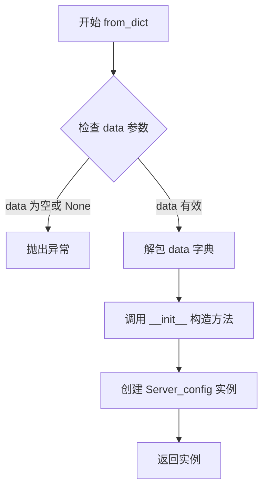

#### 带注释源码

```python
@classmethod
def from_dict(cls, data: Dict[str, any]):
    """
    从字典中生成 Server_config 实例
    
    这是一个类工厂方法（Factory Method），接受一个包含配置信息的字典，
    通过解包字典参数并传递给类的 __init__ 方法来创建实例。
    
    注意：与其他配置类（如 Resample_config、Preprocess_text_config）不同，
    该方法不处理 dataset_path 路径拼接，因为 Server_config 的配置
    不需要相对于数据集路径的路径转换。
    """
    return cls(**data)  # 使用字典解包方式将 data 的键值对作为关键字参数传入 __init__
```


### `Translate_config.__init__`

该方法是`Translate_config`类的构造函数，用于初始化翻译API配置对象，接收应用密钥和密钥作为参数，并将它们存储为实例属性。

参数：

- `self`：隐式参数，代表类的实例本身
- `app_key`：`str`，翻译API的应用密钥（App Key）
- `secret_key`：`str`，翻译API的密钥（Secret Key）

返回值：`None`，无返回值（构造函数）

#### 流程图

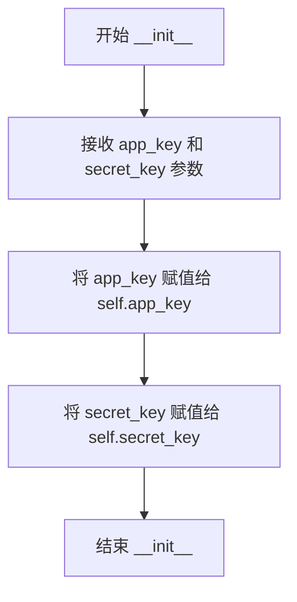

#### 带注释源码

```python
class Translate_config:
    """翻译api配置"""

    def __init__(self, app_key: str, secret_key: str):
        """
        初始化翻译配置
        
        参数:
            app_key: str, 翻译API的应用密钥
            secret_key: str, 翻译API的密钥
        """
        # 将传入的app_key赋值给实例属性
        self.app_key = app_key
        # 将传入的secret_key赋值给实例属性
        self.secret_key = secret_key
```


### `Translate_config.from_dict`

该方法是一个类方法（ClassMethod），用于从字典数据中创建 `Translate_config` 类的实例，实现了配置对象的反序列化功能。

参数：

- `cls`：类本身（ClassMethod 的隐含参数），无需手动传入
- `data`：`Dict[str, any]`，包含翻译 API 配置的字典，键为 `app_key` 和 `secret_key`

返回值：`Translate_config`，返回新创建的 `Translate_config` 实例对象

#### 流程图

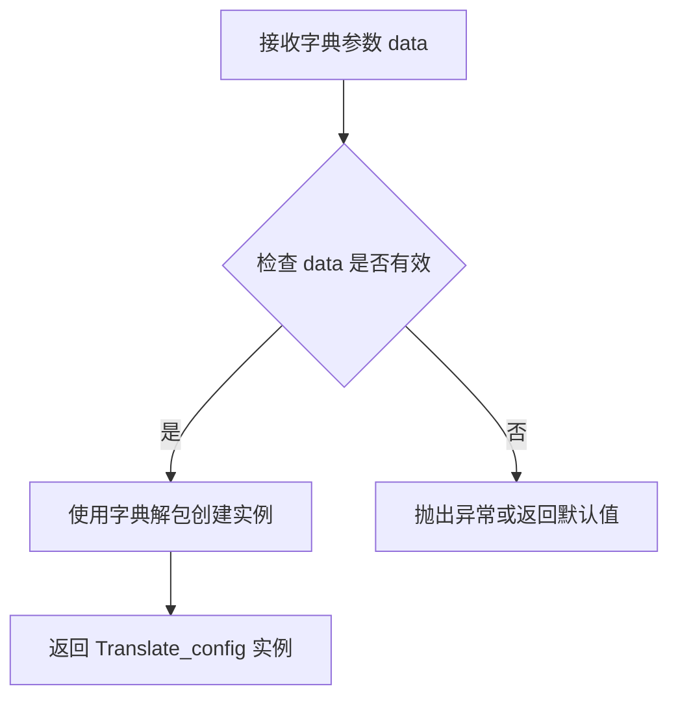

#### 带注释源码

```python
@classmethod
def from_dict(cls, data: Dict[str, any]):
    """从字典中生成 Translate_config 实例"""
    # cls 表示类本身，**data 将字典解包为关键字参数
    # 假设 data = {"app_key": "xxx", "secret_key": "yyy"}
    # 则等价于调用 cls(app_key="xxx", secret_key="yyy")
    return cls(**data)
```


### Config.__init__

这是Config类的构造函数，负责读取YAML配置文件并初始化所有子配置对象。它首先检查配置文件是否存在，如果不存在且存在默认配置，则自动复制默认配置；然后读取YAML文件内容，解析各项配置数据，并通过各配置类的`from_dict`类方法创建对应的配置实例。

参数：

- `config_path`：`str`，配置文件路径，指向YAML格式的配置文件

返回值：`None`，构造函数不返回任何值

#### 流程图

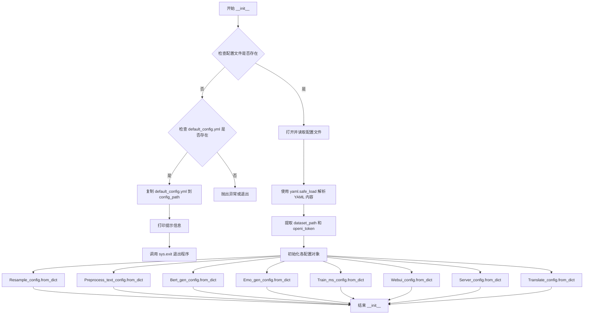

#### 带注释源码

```python
def __init__(self, config_path: str):
    # 检查配置文件是否存在，如果不存在且存在默认配置文件
    if not os.path.isfile(config_path) and os.path.isfile("default_config.yml"):
        # 从默认配置复制生成新的配置文件
        shutil.copy(src="default_config.yml", dst=config_path)
        # 打印提示信息，要求用户按说明配置后重新运行
        print(
            f"已根据默认配置文件default_config.yml生成配置文件{config_path}。请按该配置文件的说明进行配置后重新运行。"
        )
        print("如无特殊需求，请勿修改default_config.yml或备份该文件。")
        # 退出程序，等待用户配置
        sys.exit(0)
    
    # 打开并读取配置文件
    with open(file=config_path, mode="r", encoding="utf-8") as file:
        # 使用 yaml.safe_load 解析 YAML 格式的配置文件
        yaml_config: Dict[str, any] = yaml.safe_load(file.read())
        # 提取数据集路径和 OpenAI Token
        dataset_path: str = yaml_config["dataset_path"]
        openi_token: str = yaml_config["openi_token"]
        
        # 将解析出的基础信息存储为实例属性
        self.dataset_path: str = dataset_path
        self.mirror: str = yaml_config["mirror"]
        self.openi_token: str = openi_token
        
        # 初始化各个子配置对象，使用 from_dict 类方法从字典创建实例
        # 重采样配置
        self.resample_config: Resample_config = Resample_config.from_dict(
            dataset_path, yaml_config["resample"]
        )
        # 文本预处理配置
        self.preprocess_text_config: Preprocess_text_config = (
            Preprocess_text_config.from_dict(
                dataset_path, yaml_config["preprocess_text"]
            )
        )
        # BERT 生成配置
        self.bert_gen_config: Bert_gen_config = Bert_gen_config.from_dict(
            dataset_path, yaml_config["bert_gen"]
        )
        # 情感生成配置
        self.emo_gen_config: Emo_gen_config = Emo_gen_config.from_dict(
            dataset_path, yaml_config["emo_gen"]
        )
        # 训练配置
        self.train_ms_config: Train_ms_config = Train_ms_config.from_dict(
            dataset_path, yaml_config["train_ms"]
        )
        # WebUI 配置
        self.webui_config: Webui_config = Webui_config.from_dict(
            dataset_path, yaml_config["webui"]
        )
        # 服务器配置
        self.server_config: Server_config = Server_config.from_dict(
            yaml_config["server"]
        )
        # 翻译 API 配置
        self.translate_config: Translate_config = Translate_config.from_dict(
            yaml_config["translate"]
        )
```

## 关键组件


### Resample_config

重采样配置类，用于管理音频重采样的相关参数，包括输入输出目录路径和目标采样率。

### Preprocess_text_config

数据预处理配置类，用于管理文本数据清洗和划分训练集/验证集的相关参数，包括各类文件路径、验证集数量限制和清洗开关。

### Bert_gen_config

BERT生成配置类，用于管理BERT特征生成的相关参数，包括配置文件路径、进程数和设备选择。

### Emo_gen_config

情感生成配置类，用于管理情感特征生成的相关参数，结构与Bert_gen_config类似，包含配置文件路径、进程数和设备选择。

### Train_ms_config

训练配置类，用于管理模型训练的相关参数，包括环境变量、底模配置、模型存储路径、worker数量、spec缓存开关和checkpoint保留数量。

### Webui_config

Web UI配置类，用于管理Web界面的相关参数，包括设备类型、模型路径、配置文件路径、端口号、公开部署开关、调试模式开关和语种识别库选择。

### Server_config

服务器配置类，用于管理模型服务器的相关参数，包括模型配置列表、端口号和默认设备。

### Translate_config

翻译API配置类，用于管理翻译服务凭证，包括应用密钥和秘密密钥。

### Config

主配置类，负责从YAML文件加载并初始化所有子配置对象，同时处理默认配置文件生成逻辑。

### 全局配置解析器

命令行参数解析器，用于接收YAML配置文件路径参数（-y/--yml_config），并实例化全局Config对象供其他模块使用。


## 问题及建议


### 已知问题

-   **注释与字段名不匹配**：在`Webui_config`类的`__init__`方法中，字段注释完全错误 - `model`的注释是"端口号"，`port`的注释是"是否开启debug模式"，`share`的注释是"模型路径"，`debug`的注释是"配置文件路径"，这些注释与实际字段功能完全不符。
-   **缺乏配置值验证**：所有配置类在实例化时都没有对输入参数进行有效性校验，例如`Resample_config`的`sampling_rate`可能为负数、`Preprocess_text_config`的`val_per_lang`可能为负、`port`可能为非法端口号等。
-   **缺少错误处理**：`Config`类读取YAML文件时没有捕获可能的`FileNotFoundError`、`yaml.YAMLError`等异常，也没有检查`yaml_config`中是否存在必需的键，会导致程序直接崩溃且错误信息不友好。
-   **全局状态污染**：模块级别直接创建`config = Config(args.yml_config)`全局实例，这使得代码难以测试，且在不同环境或多次导入时可能产生意外行为。
-   **硬编码的文件名**：`default_config.yml`和`config.yml`文件名被硬编码在代码中，缺乏灵活性。
-   **类型标注不规范**：多处使用`any`类型而非具体的Union或Optional类型，如`Dict[str, any]`应为`Dict[str, Any]`（大写Any），且部分类缺少完整的类型注解。
-   **类文档字符串缺失**：`Server_config`类没有文档字符串，与其他类的命名规范不一致。
-   **from_dict方法实现不一致**：不同配置类的`from_dict`方法对空值处理逻辑不统一（如`Preprocess_text_config`检查空字符串和None，而`Config`类直接访问键），增加了维护成本。

### 优化建议

-   **修复注释错误**：更正`Webui_config`类中所有字段的注释，确保注释与字段功能一致。
-   **添加配置验证逻辑**：在配置类的`__init__`方法中添加参数校验逻辑，或使用Pydantic等库进行数据验证，确保关键参数（如采样率、端口号、路径等）的合法性和合理性。
-   **增强错误处理**：在`Config`类中使用try-except捕获文件读取和YAML解析异常，为缺少必需配置键的情况提供清晰的错误提示。
-   **移除全局状态**：将全局`config`变量改为函数返回值或使用依赖注入模式，便于单元测试和模块复用。
-   **统一类型注解**：使用标准库`typing`模块的`Any`（大写），并为所有方法参数和返回值添加完整的类型注解。
-   **规范化from_dict实现**：统一各配置类对空值和路径拼接的处理逻辑，可考虑抽取基类或使用数据类简化实现。
-   **添加日志记录**：将`print`语句替换为Python标准`logging`模块，便于配置日志级别和输出格式。
-   **提取魔法字符串**：将硬编码的文件名定义为常量或配置项，提高代码可维护性。

## 其它


### 设计目标与约束

本配置文件读取模块的设计目标是为整个项目提供统一、集中的配置管理解决方案，支持多模块配置的灵活加载与验证。约束条件包括：配置文件必须为YAML格式且包含所有必需字段；dataset_path必须为有效路径；各配置类负责各自领域配置的解释与路径转换；默认配置文件default_config.yml在config.yml不存在时自动生成；配置加载失败时程序以系统退出码0终止而非抛出异常。

### 错误处理与异常设计

配置模块采用分层错误处理策略：文件不存在时自动复制默认配置并退出；YAML解析失败时抛出yaml.YAMLError异常；配置字段缺失时抛出KeyError异常；路径拼接失败时抛出OSError异常。Config类构造函数中包含隐式假设：yaml_config必须包含dataset_path、mirror、openi_token等顶层字段，以及resample、preprocess_text、bert_gen、emo_gen、train_ms、webui、server、translate等子配置块。异常处理原则是配置文件问题导致程序无法继续运行时采用sys.exit(0)温和退出，用户配置错误导致运行时问题则向上抛出异常。

### 外部依赖与接口契约

本模块依赖以下外部包：argparse（标准库，命令行参数解析）、yaml（PyYAML，配置文件解析）、typing（标准库，类型注解）、os/shutil/sys（标准库，文件与系统操作）。接口契约方面：Config类接受config_path字符串参数，返回包含所有子配置的Config实例；各配置类的from_dict为类方法，接受dataset_path和data字典参数，返回配置实例；全局config对象在模块导入时初始化，支持其他模块通过import config方式直接访问。

### 配置文件格式说明

顶层配置包含：dataset_path（数据集根目录字符串）、mirror（镜像源字符串）、openi_token（开放平台令牌字符串）、resample（重采样配置字典）、preprocess_text（文本预处理配置字典）、bert_gen（BERT生成配置字典）、emo_gen（情感生成配置字典）、train_ms（训练配置字典）、webui（WebUI配置字典）、server（服务器配置字典）、translate（翻译API配置字典）。各子配置字典结构见对应配置类定义。

### 安全性考虑

配置模块存在以下安全风险：openi_token以明文存储在配置文件中，应考虑环境变量或加密存储；未对配置文件路径进行严格的路径遍历检查，dataset_path可能遭受路径注入攻击；配置值未进行输入验证，恶意构造的配置文件可能导致意外行为。建议措施：增加配置值白名单校验、对敏感字段进行加密或从环境变量读取、添加配置文件完整性校验。

### 性能考虑

配置加载发生在模块导入时，属于启动时一次性操作，无运行时性能影响。潜在优化点：Config类在初始化时一次性加载并解析所有子配置，可考虑延迟加载（Lazy Loading）策略；from_dict方法中多次调用os.path.join，可缓存dataset_path避免重复计算；YAML文件读取后直接调用safe_load，未进行缓存，频繁实例化Config时存在重复解析。

### 测试策略

建议测试覆盖以下场景：正常配置文件加载、配置文件缺失时自动生成默认配置、配置文件字段缺失时的异常抛出、配置字段类型错误时的异常处理、各配置类from_dict方法的路径拼接逻辑、命令行参数-y/--yml_config的解析、多次实例化Config类的行为。推荐使用pytest框架编写单元测试，使用mock模拟文件系统操作。

### 版本兼容性

本模块依赖Python 3.6+（支持类型注解语法）、PyYAML 3.12+。向后兼容性策略：配置类采用可选参数设计，新增可选字段不影响现有配置使用；from_dict类方法保持签名一致，子类扩展时保持父类接口兼容。建议在项目根目录保留default_config.yml模板文件，并记录配置版本变更日志。

### 日志设计

当前实现仅使用print语句输出信息，缺少统一日志框架。建议改进：使用Python logging模块替代print语句；配置加载成功时使用INFO级别日志；自动生成默认配置时使用WARNING级别日志；配置文件解析错误时使用ERROR级别日志；支持通过配置控制日志级别和输出格式。

    