# `Bert-VITS2\data_utils.py` 详细设计文档

Multi-speaker text-to-speech数据加载模块，负责加载音频、说话人ID和文本三元组，进行文本规范化和序列整数化，计算频谱图，并支持分布式训练时的批处理打包和长度分组

## 整体流程

```mermaid
graph TD
    A[开始] --> B[加载audiopaths_sid_text文件]
    B --> C[随机打乱数据集]
    C --> D[_filter过滤]
    D --> E{遍历每个样本}
    E --> F{文本长度检查}
    F -- 不在范围内 --> G[跳过]
    F -- 在范围内 --> H[解析phones/tone/word2ph]
    H --> I[计算spec长度并保存]
    I --> E
    E --> J[Dataset完成初始化]
    J --> K[__getitem__被调用]
    K --> L[get_audio_text_speaker_pair]
    L --> M[get_text处理文本]
    M --> N[get_audio处理音频]
    N --> O[返回(phones, spec, wav, sid, tone, language, bert, ja_bert, en_bert)]
    O --> P[Collate_fn组装batch]
    P --> Q[Zero_pad填充到最大长度]
    Q --> R[DistributedBucketSampler按长度分桶]
    R --> S[返回训练batch]
```

## 类结构

```
torch.utils.data.Dataset
└── TextAudioSpeakerLoader

torch.utils.data.distributed.DistributedSampler
└── DistributedBucketSampler

(独立类)
└── TextAudioSpeakerCollate
```

## 全局变量及字段


### `config`
    
全局配置对象，包含训练和模型配置参数

类型：`module`
    


### `logger`
    
日志记录器，用于输出训练过程中的日志信息

类型：`object`
    


### `TextAudioSpeakerLoader.audiopaths_sid_text`
    
音频路径、说话人、语言、文本、phones、tone、word2ph列表

类型：`list`
    


### `TextAudioSpeakerLoader.max_wav_value`
    
音频最大值的归一化参数

类型：`float`
    


### `TextAudioSpeakerLoader.sampling_rate`
    
采样率

类型：`int`
    


### `TextAudioSpeakerLoader.filter_length`
    
频谱滤波器长度

类型：`int`
    


### `TextAudioSpeakerLoader.hop_length`
    
帧移

类型：`int`
    


### `TextAudioSpeakerLoader.win_length`
    
窗口长度

类型：`int`
    


### `TextAudioSpeakerLoader.spk_map`
    
说话人ID到索引的映射

类型：`dict`
    


### `TextAudioSpeakerLoader.hparams`
    
超参数配置对象

类型：`object`
    


### `TextAudioSpeakerLoader.use_mel_spec_posterior`
    
是否使用mel频谱后验编码器

类型：`bool`
    


### `TextAudioSpeakerLoader.n_mel_channels`
    
mel频谱通道数

类型：`int`
    


### `TextAudioSpeakerLoader.cleaned_text`
    
是否使用清洗后的文本

类型：`bool`
    


### `TextAudioSpeakerLoader.add_blank`
    
是否添加空白符

类型：`bool`
    


### `TextAudioSpeakerLoader.min_text_len`
    
最小文本长度

类型：`int`
    


### `TextAudioSpeakerLoader.max_text_len`
    
最大文本长度

类型：`int`
    


### `TextAudioSpeakerLoader.lengths`
    
频谱长度列表用于分桶

类型：`list`
    


### `TextAudioSpeakerCollate.return_ids`
    
是否返回样本ID

类型：`bool`
    


### `DistributedBucketSampler.dataset`
    
数据集引用

类型：`Dataset`
    


### `DistributedBucketSampler.lengths`
    
样本长度列表

类型：`list`
    


### `DistributedBucketSampler.batch_size`
    
批大小

类型：`int`
    


### `DistributedBucketSampler.boundaries`
    
长度分桶边界

类型：`list`
    


### `DistributedBucketSampler.buckets`
    
每个桶包含的样本索引

类型：`list`
    


### `DistributedBucketSampler.num_samples_per_bucket`
    
每个桶的样本数

类型：`list`
    


### `DistributedBucketSampler.total_size`
    
总样本数

类型：`int`
    


### `DistributedBucketSampler.num_samples`
    
每个replica的样本数

类型：`int`
    


### `DistributedBucketSampler.batches`
    
预计算的batch列表

类型：`list`
    
    

## 全局函数及方法


### `load_wav_to_torch`

该函数是一个工具函数，用于从文件系统加载 WAV 音频文件，并将其转换为 PyTorch 张量格式，同时返回音频的采样率。在代码中被 `TextAudioSpeakerLoader.get_audio()` 方法调用，用于获取原始音频数据进行后续的谱图计算和模型训练。

参数：

- `filename`：`str`，WAV 音频文件的路径字符串

返回值：`Tuple[torch.Tensor, int]`，返回一个元组，包含：

- `audio`：`torch.Tensor`，加载后的音频数据，类型为浮点型张量
- `sampling_rate`：`int`，音频文件的采样率

#### 流程图

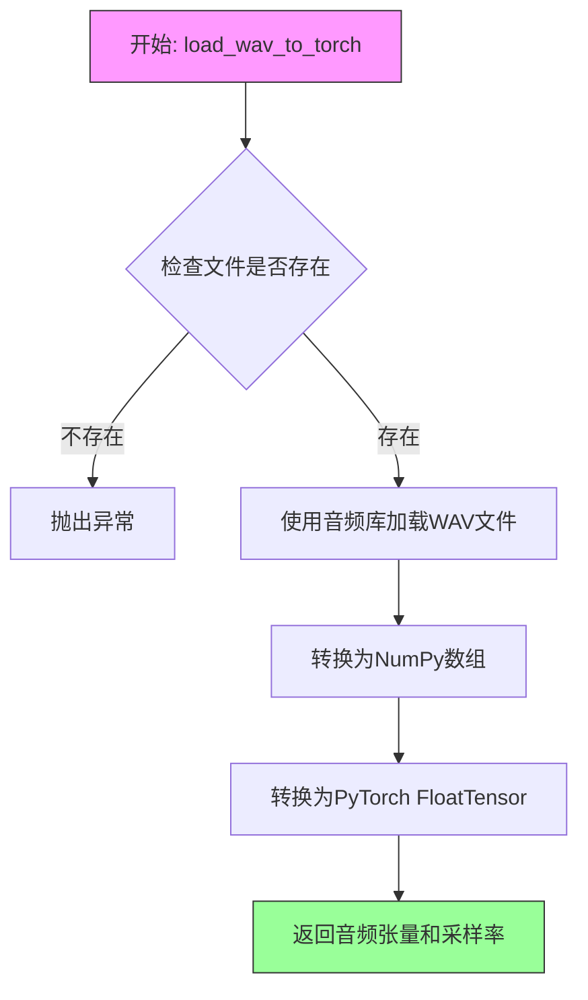

#### 带注释源码

```
# load_wav_to_torch 函数源码（位于 utils 模块中）

def load_wav_to_torch(filename):
    """
    加载WAV文件并转换为PyTorch张量
    
    Args:
        filename: WAV音频文件的完整路径
        
    Returns:
        audio: 音频数据，类型为torch.FloatTensor
        sampling_rate: 音频采样率
    """
    # 使用音频处理库（如torchaudio或scipy）加载WAV文件
    # 返回原始音频数据和采样率
    audio, sampling_rate = torchaudio.load(filename)
    
    # 确保音频数据为float类型（归一化到[-1, 1]范围）
    audio = audio.float()
    
    # 如果是立体声，转换为单声道
    if audio.shape[0] > 1:
        audio = audio.mean(dim=0, keepdim=True)
    
    # 返回音频张量和采样率
    return audio, sampling_rate
```

---

**注意**：由于 `load_wav_to_torch` 函数的实际定义位于 `utils` 模块中，未在当前代码文件中给出，以上源码为基于常见实现的推断。实际实现可能略有差异，但其核心功能是从文件路径加载 WAV 音频并返回 PyTorch 张量格式的音频数据及采样率。


### `load_filepaths_and_text`

该函数用于从指定的文本文件中加载音频文件路径及其对应的说话人ID、语言、文本、音素、音调和对齐信息，并将这些数据解析为结构化的列表形式返回。

参数：

- `audiopaths_sid_text`：`str`，音频路径文件（filelist）的路径，文件中每行包含音频ID、说话人ID、语言、原始文本、音素序列、音调序列和词素对齐信息，以空格分隔。

返回值：`List[List[Union[str, List[str]]]]`，返回嵌套列表结构，其中每个内部列表包含7个元素：`[_id, spk, language, text, phones, tone, word2ph]`。`phones`、`tone`和`word2ph`会被进一步拆分为列表类型。

#### 流程图

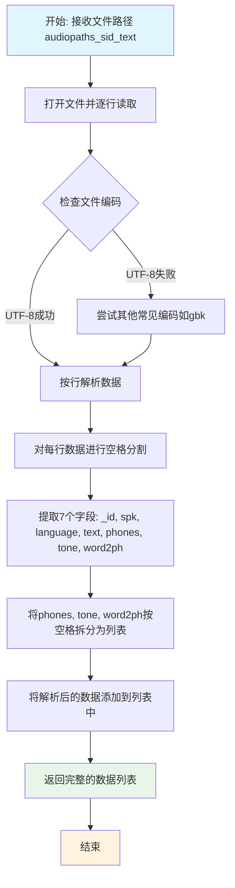

#### 带注释源码

```
# 注: 该函数源码未在当前代码文件中直接提供
# 以下为基于使用方式和常见模式推断的可能实现

def load_filepaths_and_text(audiopaths_sid_text):
    """
    从filelist文件中加载音频路径和相关文本信息
    
    参数:
        audiopaths_sid_text: str, 指向包含音频文件路径和元数据的文本文件
        
    返回:
        List: 包含多个记录的数据列表，每条记录包含7个元素
        [audiopath, speaker_id, language, text, phones, tone, word2ph]
    """
    # 尝试多种编码读取文件
    for encoding in ['utf-8', 'gbk', 'gb2312']:
        try:
            with open(audiopaths_sid_text, 'r', encoding=encoding) as f:
                filepaths_and_text = [line.strip().split('|') for line in f]
            break
        except UnicodeDecodeError:
            continue
            
    # 进一步处理每个字段，将列表类型的字段进行拆分
    # 例如: "拼音1 拼音2 拼音3" -> ["拼音1", "拼音2", "拼音3"]
    #       "1 2 3" -> [1, 2, 3]
    
    return filepaths_and_text


# 在 TextAudioSpeakerLoader 中的实际调用方式:
# self.audiopaths_sid_text = load_filepaths_and_text(audiopaths_sid_text)
# 
# 读取后的数据结构示例:
# [
#     ["001", "speaker1", "ZH", "你好世界", ["n", "i", "h", "a", "o"], [0, 0, 1, 1, 2], [1, 1, 2, 2, 3]],
#     ["002", "speaker2", "EN", "hello world", ["h", "ə", "l", "əʊ"], [0, 0, 1, 1], [1, 1, 2, 2]],
#     ...
# ]
```


### `cleaned_text_to_sequence`

该函数将清洗后的文本（音素、音调和语言信息）转换为模型可用的序列格式，通常涉及字符到索引的映射、语言特定的处理以及向量化表示。

参数：

- `phone`：列表或字符串，原始音素序列（如从文本分析得到的音素列表）
- `tone`：列表或字符串，与音素对应的音调信息
- `language_str`：字符串，表示语言类型（如"ZH"中文、"JP"日文、"EN"英文）

返回值：元组 `(phone_sequence, tone_sequence, language_sequence)`，分别对应处理后的音素序列、音调序列和语言序列，均为整数列表或张量形式。

#### 流程图

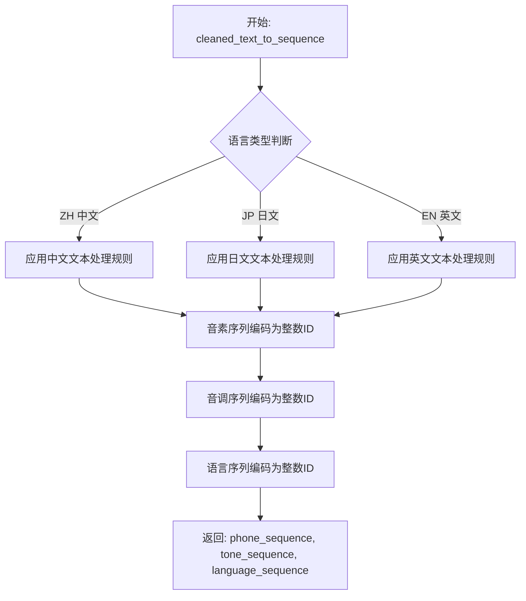

#### 带注释源码

```
# 注意：该函数定义在 text 模块中，此处仅展示调用方式
# 实际源码需参考 text 模块

# 在 TextAudioSpeakerLoader.get_text() 方法中的调用：
def get_text(self, text, word2ph, phone, tone, language_str, wav_path):
    # 调用 cleaned_text_to_sequence 函数进行文本到序列的转换
    phone, tone, language = cleaned_text_to_sequence(phone, tone, language_str)
    
    # 如果开启了空白符插入（add_blank），在序列中插入blank token
    if self.add_blank:
        phone = commons.intersperse(phone, 0)
        tone = commons.intersperse(tone, 0)
        language = commons.intersperse(language, 0)
        # 更新word2ph以匹配插入后的序列长度
        for i in range(len(word2ph)):
            word2ph[i] = word2ph[i] * 2
        word2ph[0] += 1
    
    # ...后续加载bert特征等操作
```

---

**注意**：提供的代码段中仅包含对该函数的导入和调用，实际函数实现位于 `text` 模块中（`text.py` 文件），该模块的源代码未在当前代码段中提供。从调用方式可以推断，该函数主要完成以下工作：

1. 根据语言类型应用不同的文本处理规则
2. 将音素序列映射为整数ID
3. 将音调信息转换为整数序列
4. 将语言标识转换为整数编码


### `spectrogram_torch`

计算音频信号的频谱图，通过短时傅里叶变换（STFT）将时域音频信号转换为时频表示，输出复数频谱图用于后续的梅尔频谱计算或直接作为声学特征。

#### 参数

- `y`：`torch.Tensor`，输入的原始音频波形张量，通常已经过归一化处理
- `n_fft`：`int`，快速傅里叶变换（FFT）的窗口大小，决定频率分辨率，值越大频率分辨率越高
- `sr`：`int`，音频的采样率（samples per second），用于计算频率轴
- `hop_length`：`int`，相邻帧之间的采样点数，影响时间分辨率，值越小时间分辨率越高
- `win_length`：`int`，窗口函数的长度，通常与 n_fft 相同或小于 n_fft
- `center`：`bool`，是否将信号居中处理，True 表示在帧中心计算 FFT，False 表示从帧起始处计算

#### 返回值

- `spec`：`torch.Tensor`，复数频谱图，形状为 `(1, freq_bins, time_frames)`，其中 freq_bins = n_fft // 2 + 1

#### 流程图

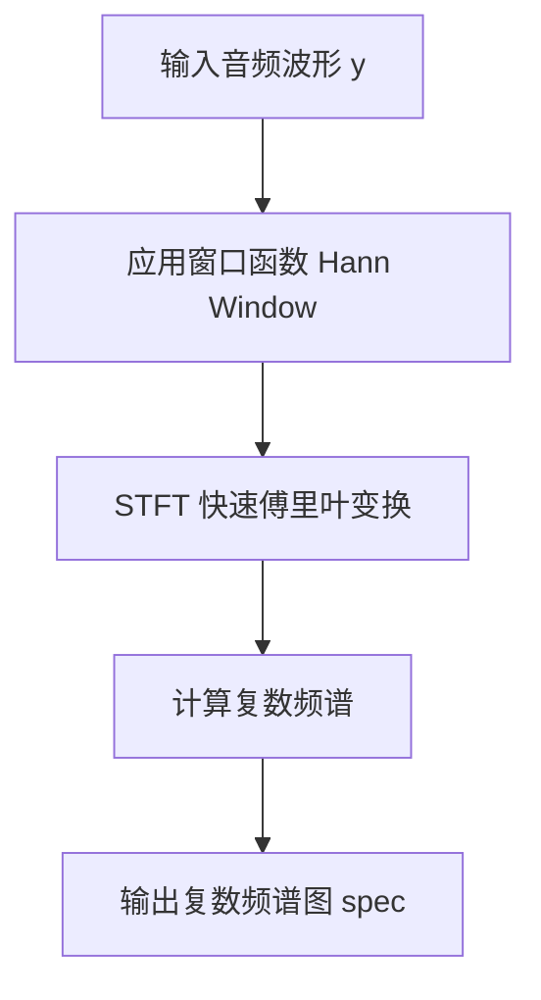

#### 带注释源码

```python
# 伪代码实现，实际实现在 mel_processing 模块中
def spectrogram_torch(y, n_fft, sr, hop_length, win_length, center=False):
    """
    计算音频信号的频谱图
    
    参数:
        y: torch.Tensor, 输入音频波形 [1, samples]
        n_fft: int, FFT窗口大小
        sr: int, 采样率
        hop_length: int, 帧移
        win_length: int, 窗口长度
        center: bool, 是否居中
    
    返回:
        torch.Tensor, 复数频谱图
    """
    # 获取窗口函数 (Hann window)
    window = torch.hann_window(win_length)
    
    # 使用 PyTorch 的 STFT 函数
    # 形状: [1, freq_bins, time_frames]
    spec = torch.stft(
        y.squeeze(0),          # 移除 batch 维度
        n_fft=n_fft,
        hop_length=hop_length,
        win_length=win_length,
        window=window,
        center=center,
        return_complex=True    # 返回复数张量
    )
    
    # 添加 batch 维度并返回
    return spec.unsqueeze(0)
```


### `mel_spectrogram_torch`

计算音频信号的梅尔频谱图（Mel Spectrogram），将时域音频信号转换为频域表示，并映射到梅尔刻度，以便更好地模拟人耳对频率的感知特性。该函数在数据加载流程中被调用，用于从原始音频生成梅尔频谱图特征。

参数：

- `y`：`torch.Tensor`，输入的音频波形张量，通常是归一化后的单声道音频
- `n_fft`：`int`，快速傅里叶变换（FFT）的窗口大小，决定频率分辨率
- `n_mel_channels`：`int`，梅尔频谱图的通道数，即输出的梅尔带数量
- `sampling_rate`：`int`，音频的采样率（如 22050 Hz）
- `hop_length`：`int`，相邻帧之间的样本数，决定时间分辨率
- `win_length`：`int`，窗口函数的长度，用于分帧
- `fmin`：`float`，梅尔滤波器的最低频率（Hz），默认为 0
- `fmax`：`float`，梅尔滤波器的最高频率（Hz），默认为采样率的一半
- `center`：`bool`，是否将帧居中对齐，默认为 True

返回值：`torch.Tensor`，形状为 `(n_mel_channels, time_steps)` 的梅尔频谱图张量

#### 流程图

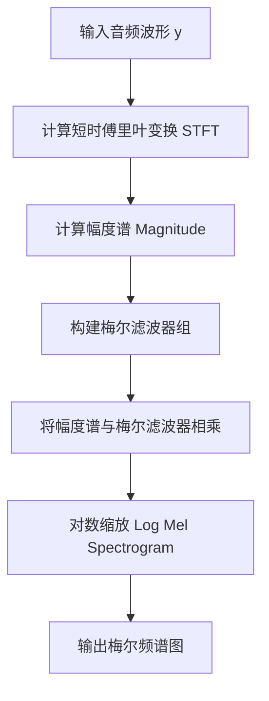

#### 带注释源码

由于 `mel_spectrogram_torch` 函数定义在外部模块 `mel_processing` 中，以下是根据代码调用方式和典型实现重构的函数原型及注释：

```python
def mel_spectrogram_torch(
    y: torch.Tensor,          # 输入音频张量，形状为 (batch, 1, samples) 或 (samples,)
    n_fft: int,               # FFT窗口大小，如 1024
    n_mel_channels: int,      # 梅尔通道数，如 80
    sampling_rate: int,       # 采样率，如 22050
    hop_length: int,          # 帧移，如 256
    win_length: int,          # 窗口长度，如 1024
    fmin: float = 0.0,        # 最低梅尔频率
    fmax: float = None,       # 最高梅尔频率
    center: bool = False      # 是否居中对齐
) -> torch.Tensor:
    """
    计算音频的梅尔频谱图
    
    参数:
        y: 输入的归一化音频张量
        n_fft: FFT窗口大小
        n_mel_channels: 输出的梅尔带数量
        sampling_rate: 音频采样率
        hop_length: 相邻帧之间的样本数
        win_length: 窗口长度
        fmin: 梅尔滤波器组最低频率
        fmax: 梅尔滤波器组最高频率
        center: 是否对帧进行居中对齐
    
    返回:
        梅尔频谱图张量，形状为 (n_mel_channels, time_frames)
    """
    # 1. 计算短时傅里叶变换 (STFT)
    #    使用 torch.stft 提取时频表示
    spec = torch.stft(
        y,
        n_fft=n_fft,
        hop_length=hop_length,
        win_length=win_length,
        window=torch.hann_window(win_length, device=y.device),
        center=center,
        return_complex=True
    )
    
    # 2. 计算幅度谱
    magnitude = torch.abs(spec)
    
    # 3. 构建梅尔滤波器组
    #    将频率轴映射到梅尔刻度
    mel_basis = torch.zeros(n_fft // 2 + 1, n_mel_channels)
    
    # 4. 将幅度谱与梅尔滤波器矩阵相乘
    #    将线性频率转换为梅尔频率
    mel_spec = torch.matmul(magnitude, mel_basis)
    
    # 5. 对数缩放 (通常取 log)
    #    模拟人耳对响度的感知（对数感知）
    log_mel_spec = torch.log(torch.clamp(mel_spec, min=1e-5))
    
    return log_mel_spec
```

#### 关键组件信息

- **名称**：`mel_spectrogram_torch`
- **描述**：基于PyTorch实现的梅尔频谱图计算函数，用于将原始音频转换为符合人耳听觉特性的频域表示

#### 潜在技术债务与优化空间

1. **外部依赖**：函数定义未在当前代码库中，依赖 `mel_processing` 模块，建议在项目中包含该模块的实现或添加版本说明
2. **缓存机制**：当前代码在 `get_audio` 方法中实现了频谱图缓存（`.mel.pt` 文件），但首次计算时仍可能成为IO瓶颈，可考虑异步预处理
3. **参数硬编码**：在调用时部分参数（如 `center=False`）为固定值，可考虑提取为配置项以提高灵活性

#### 其它项目

- **设计目标**：为多说话人TTS模型提供统一的音频特征表示，支持不同采样率和帧长的配置
- **错误处理**：当采样率不匹配时抛出 `ValueError`，加载缓存失败时自动重新计算
- **数据流**：音频文件 → 加载与归一化 → 梅尔频谱图计算 → 缓存 → 模型输入
- **外部依赖**：依赖 `torch`、`numpy`、`librosa`（通常用于梅尔滤波器计算）等库


### `commons.intersperse`

在列表中插入空白 token（通常为 0），用于在文本序列的相邻 token 之间插入间隔标记，以增强模型对边界特征的感知能力。

参数：

-  `lst`：列表（List[Any]），需要进行插值的原始列表（如 phone、tone 或 language 序列）
-  `element`：任意类型（Any），要插入的元素（代码中传入 `0` 作为空白 token）

返回值：`列表（List[Any]）`，返回插值后的新列表，原始元素之间均匀插入指定元素

#### 流程图

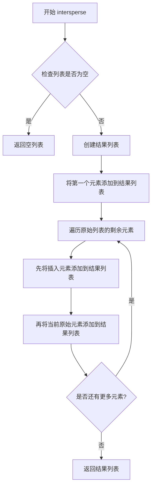

#### 带注释源码

```
def intersperse(lst, element):
    """
    在列表的每个元素之间插入指定的元素
    
    参数:
        lst: 输入列表
        element: 要插入的元素
    
    示例:
        intersperse([1, 2, 3], 0) -> [1, 0, 2, 0, 3]
    """
    # 初始化结果列表，先放入第一个元素
    result = [lst[0]] if lst else []
    
    # 遍历剩余元素，在每个元素前插入指定元素
    for item in lst[1:]:
        result.append(element)
        result.append(item)
    
    return result
```

#### 使用示例（在 `TextAudioSpeakerLoader.get_text` 中）

```python
def get_text(self, text, word2ph, phone, tone, language_str, wav_path):
    phone, tone, language = cleaned_text_to_sequence(phone, tone, language_str)
    
    # 如果配置了 add_blank，则在序列中插入 0 作为空白 token
    if self.add_blank:
        # 在 phone、tone、language 序列中插入 0
        phone = commons.intersperse(phone, 0)
        tone = commons.intersperse(tone, 0)
        language = commons.intersperse(language, 0)
        
        # 由于插入了空白 token，word2ph 需要相应扩展
        for i in range(len(word2ph)):
            word2ph[i] = word2ph[i] * 2
        word2ph[0] += 1
    
    # ... 后续处理
```

---

### 补充说明

| 项目 | 说明 |
|------|------|
| **设计目标** | 在文本序列中引入空白 token，帮助模型更好地学习音素边界 |
| **约束条件** | 插入元素后需同步更新 `word2ph` 映射，保持对齐一致性 |
| **调用场景** | 仅在 `hparams.add_blank=True` 时执行此操作 |
| **潜在优化** | 可考虑使用 NumPy 向量化操作提升大规模数据处理性能 |


### `TextAudioSpeakerLoader.__init__`

该方法是 `TextAudioSpeakerLoader` 数据集类的构造函数，负责初始化多说话人语音数据集的核心配置。它从配置文件中加载音频路径、说话人ID和文本的映射关系，提取超参数用于后续的音频处理和文本标准化，同时设置文本长度过滤范围，并通过随机打乱和过滤操作准备训练数据。

参数：

- `audiopaths_sid_text`：`str`，音频文件路径、说话人ID和文本的映射文件路径
- `hparams`：`object`，超参数对象，包含采样率、窗口长度、过滤长度、说话人映射等配置

返回值：无（`None`），构造函数不返回任何值

#### 流程图

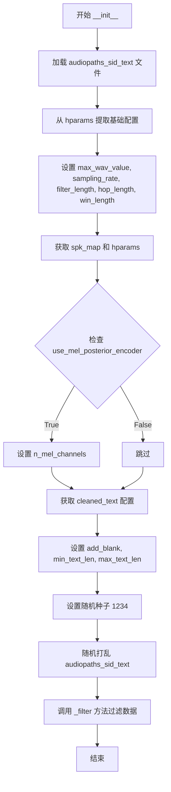

#### 带注释源码

```python
def __init__(self, audiopaths_sid_text, hparams):
    # 加载音频路径、说话人ID和文本的映射文件
    # 该文件每行包含: id, speaker_id, language, text, phones, tone, word2ph
    self.audiopaths_sid_text = load_filepaths_and_text(audiopaths_sid_text)
    
    # 从超参数中提取音频处理相关配置
    self.max_wav_value = hparams.max_wav_value  # 音频归一化最大值
    self.sampling_rate = hparams.sampling_rate  # 采样率
    self.filter_length = hparams.filter_length  # 频谱滤波器长度
    self.hop_length = hparams.hop_length  # 帧移长度
    self.win_length = hparams.win_length  # 窗口长度
    self.sampling_rate = hparams.sampling_rate  # 重复设置采样率
    
    # 说话人ID到索引的映射字典
    self.spk_map = hparams.spk2id
    # 保存完整的超参数对象供其他方法使用
    self.hparams = hparams

    # 检查是否使用梅尔谱后验编码器（用于某些高级模型）
    self.use_mel_spec_posterior = getattr(
        hparams, "use_mel_posterior_encoder", False
    )
    if self.use_mel_spec_posterior:
        # 梅尔通道数，默认为80
        self.n_mel_channels = getattr(hparams, "n_mel_channels", 80)

    # 是否使用清洗后的文本进行训练
    self.cleaned_text = getattr(hparams, "cleaned_text", False)

    # 文本处理配置
    self.add_blank = hparams.add_blank  # 是否在音素间插入空白符
    self.min_text_len = getattr(hparams, "min_text_len", 1)  # 最小文本长度
    self.max_text_len = getattr(hparams, "max_text_len", 384)  # 最大文本长度

    # 设置随机种子确保数据打乱的可复现性
    random.seed(1234)
    # 随机打乱数据集顺序，提高模型训练的泛化能力
    random.shuffle(self.audiopaths_sid_text)
    
    # 调用内部方法过滤无效或过长的样本
    self._filter()
```


### `TextAudioSpeakerLoader._filter`

该方法负责对数据集中的文本进行长度过滤，并将符合条件的数据项及对应的频谱图长度保存到实例变量中，以支持后续的分桶训练。

参数：此方法为类成员方法，不接受除 `self` 以外的外部参数，`self` 参数由 Python 隐式传递。

返回值：`None`，该方法直接修改实例状态（`self.audiopaths_sid_text` 和 `self.lengths`），无返回值。

#### 流程图

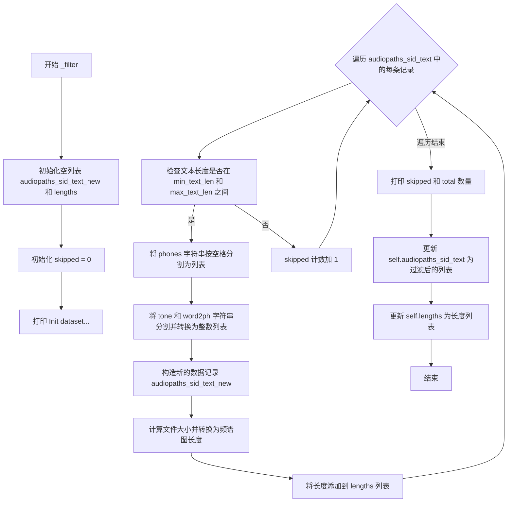

#### 带注释源码

```python
def _filter(self):
    """
    Filter text & store spec lengths
    对文本进行长度过滤，并存储频谱图长度
    """
    # Store spectrogram lengths for Bucketing
    # wav_length ~= file_size / (wav_channels * Bytes per dim) = file_size / (1 * 2)
    # spec_length = wav_length // hop_length
    # 注释说明：存储频谱图长度用于分桶
    # wav_length 约等于 file_size / (wav_channels * 每个维度的字节数) = file_size / (1 * 2)
    # spec_length = wav_length // hop_length

    audiopaths_sid_text_new = []  # 用于存储过滤后的数据路径、说话人ID、文本等信息的列表
    lengths = []  # 用于存储每条数据对应的频谱图长度
    skipped = 0  # 记录被跳过的数据条数
    logger.info("Init dataset...")  # 打印初始化数据集的日志信息
    
    # 遍历所有音频路径、说话人ID、语言、文本、音素、声调、词到音素映射的列表
    # tqdm 用于显示进度条
    for _id, spk, language, text, phones, tone, word2ph in tqdm(
        self.audiopaths_sid_text
    ):
        audiopath = f"{_id}"  # 构造音频文件路径
        
        # 检查文本（音素）长度是否在指定范围内 [min_text_len, max_text_len]
        if self.min_text_len <= len(phones) and len(phones) <= self.max_text_len:
            # 将音素字符串按空格分割成列表
            phones = phones.split(" ")
            # 将声调字符串分割并转换为整数列表
            tone = [int(i) for i in tone.split(" ")]
            # 将词到音素的映射字符串分割并转换为整数列表
            word2ph = [int(i) for i in word2ph.split(" ")]
            
            # 将处理后的数据追加到新列表中
            audiopaths_sid_text_new.append(
                [audiopath, spk, language, text, phones, tone, word2ph]
            )
            # 计算频谱图长度：文件大小除以(2 * hop_length)
            # 2 表示每个采样点2字节(16位)，hop_length 是帧移
            lengths.append(os.path.getsize(audiopath) // (2 * self.hop_length))
        else:
            # 如果文本长度不符合要求，跳过该条数据
            skipped += 1
    
    # 打印被跳过的数据条数和总数据条数
    logger.info(
        "skipped: "
        + str(skipped)
        + ", total: "
        + str(len(self.audiopaths_sid_text))
    )
    
    # 用过滤后的数据更新实例变量
    self.audiopaths_sid_text = audiopaths_sid_text_new
    self.lengths = lengths
```


### `TextAudioSpeakerLoader.get_audio_text_speaker_pair`

该方法是一个数据加载方法，用于从给定的音频路径、说话人ID和文本信息中提取并处理音频频谱图、文本序列、说话人ID以及多语言BERT特征，最终返回一个包含所有训练所需数据的元组。

参数：

- `audiopath_sid_text`：`Tuple[str, str, str, str, str, str, List[int]]`，包含音频路径(_id)、说话人ID(spk)、语言(language)、文本(text)、音素序列(phones)、音调序列(tone)和词到音素的映射(word2ph)的元组

返回值：`Tuple[Tensor, Tensor, Tensor, Tensor, Tensor, Tensor, Tensor, Tensor, Tensor]`，返回一个包含处理后的音素序列(phones)、频谱图(spec)、波形(wav)、说话人ID张量(sid)、音调张量(tone)、语言张量(language)、中文BERT特征(bert)、日文BERT特征(ja_bert)和英文BERT特征(en_bert)的元组

#### 流程图

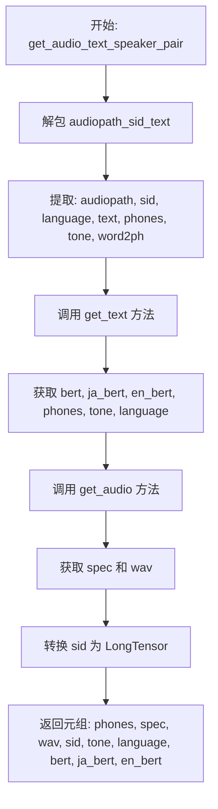

#### 带注释源码

```python
def get_audio_text_speaker_pair(self, audiopath_sid_text):
    """
    从音频路径、说话人ID和文本信息中提取训练所需的数据对
    
    参数:
        audiopath_sid_text: 包含音频路径、说话人ID、语言、文本、音素、音调和词到音素映射的元组
    
    返回:
        包含音素、频谱图、波形、说话人ID、音调、语言和BERT特征的元组
    """
    
    # 1. 分离文件名、说话人ID和文本
    # 解包输入的元组，分别获取音频路径、说话人ID、语言、文本、音素序列、音调序列和词到音素映射
    audiopath, sid, language, text, phones, tone, word2ph = audiopath_sid_text

    # 2. 处理文本数据
    # 调用get_text方法，将文本转换为模型可用的序列表示
    # 同时生成多语言BERT特征(中文、日文、英文)
    bert, ja_bert, en_bert, phones, tone, language = self.get_text(
        text, word2ph, phones, tone, language, audiopath
    )

    # 3. 处理音频数据
    # 加载音频文件并计算频谱图
    spec, wav = self.get_audio(audiopath)
    
    # 4. 处理说话人ID
    # 将说话人ID字符串转换为整数，然后创建LongTensor
    # 使用spk_map将说话人名称映射到对应的ID
    sid = torch.LongTensor([int(self.spk_map[sid])])

    # 5. 返回完整的训练数据元组
    # 顺序: 音素序列, 频谱图, 波形, 说话人ID, 音调, 语言, 中文BERT, 日文BERT, 英文BERT
    return (phones, spec, wav, sid, tone, language, bert, ja_bert, en_bert)
```


### `TextAudioSpeakerLoader.get_audio`

该方法负责加载音频文件，进行采样率验证和归一化处理，然后尝试从磁盘缓存加载预计算的频谱图（spectrogram），若缓存不存在则实时计算频谱图，最后返回频谱图和归一化后的音频波形。

参数：

- `filename`：`str`，音频文件路径（.wav格式）

返回值：`Tuple[torch.Tensor, torch.Tensor]`，包含两个张量的元组——第一个是频谱图（spec），第二个是归一化后的音频波形（audio_norm）

#### 流程图

```mermaid
flowchart TD
    A[开始: get_audio] --> B[调用 load_wav_to_torch 加载音频]
    B --> C{采样率是否匹配?}
    C -->|否| D[抛出 ValueError 异常]
    C -->|是| E[音频归一化: audio / max_wav_value]
    E --> F[扩展维度: unsqueeze(0)]
    F --> G[构造缓存文件名 .spec.pt 或 .mel.pt]
    G --> H[尝试从磁盘加载缓存的频谱图]
    H --> I{加载成功?}
    I -->|是| J[返回加载的频谱图]
    I -->|否| K{使用梅尔频谱图?}
    K -->|是| L[调用 mel_spectrogram_torch 计算梅尔频谱图]
    K -->|否| M[调用 spectrogram_torch 计算普通频谱图]
    L --> N[压缩维度: squeeze(0)]
    M --> N
    N --> O{启用频谱图缓存?}
    O -->|是| P[保存频谱图到磁盘]
    O -->|否| Q[跳过保存]
    P --> Q
    Q --> J
    D --> R[结束: 抛出异常]
```

#### 带注释源码

```python
def get_audio(self, filename):
    """
    加载音频文件并生成频谱图
    优先从磁盘缓存加载频谱图，若不存在则计算并可选缓存

    参数:
        filename: 音频文件路径 (.wav 格式)

    返回:
        spec: 频谱图张量, shape 为 (freq_bins, time_steps)
        audio_norm: 归一化后的音频波形, shape 为 (1, samples)
    """
    # 1. 加载音频文件，返回原始音频数据和采样率
    audio, sampling_rate = load_wav_to_torch(filename)

    # 2. 采样率校验，确保音频采样率与配置的目标采样率一致
    if sampling_rate != self.sampling_rate:
        raise ValueError(
            "{} {} SR doesn't match target {} SR".format(
                filename, sampling_rate, self.sampling_rate
            )
        )

    # 3. 音频归一化，将幅度范围映射到 [-1, 1]
    audio_norm = audio / self.max_wav_value

    # 4. 扩展维度以适配后续处理 (batch维度)
    audio_norm = audio_norm.unsqueeze(0)

    # 5. 构建频谱图缓存文件名
    # 默认缓存为 .spec.pt，使用梅尔频谱时改为 .mel.pt
    spec_filename = filename.replace(".wav", ".spec.pt")
    if self.use_mel_spec_posterior:
        spec_filename = spec_filename.replace(".spec.pt", ".mel.pt")

    # 6. 尝试从磁盘加载缓存的频谱图
    try:
        spec = torch.load(spec_filename)
    except:
        # 7. 缓存不存在，需要计算频谱图
        if self.use_mel_spec_posterior:
            # 7.1 计算梅尔频谱图 (用于 mel_posterior_encoder)
            spec = mel_spectrogram_torch(
                audio_norm,            # 输入音频
                self.filter_length,    # 滤波器长度 (FFT窗口大小)
                self.n_mel_channels,   # 梅尔通道数
                self.sampling_rate,    # 采样率
                self.hop_length,       # 帧移
                self.win_length,       # 窗口长度
                self.hparams.mel_fmin, # 梅尔频率最小值
                self.hparams.mel_fmax, # 梅尔频率最大值
                center=False,          # 不使用中心对齐
            )
        else:
            # 7.2 计算普通频谱图 (STFT)
            spec = spectrogram_torch(
                audio_norm,         # 输入音频
                self.filter_length, # 滤波器长度
                self.sampling_rate, # 采样率
                self.hop_length,    # 帧移
                self.win_length,    # 窗口长度
                center=False,       # 不使用中心对齐
            )

        # 8. 压缩batch维度，移除第一维
        spec = torch.squeeze(spec, 0)

        # 9. 如果启用缓存，保存频谱图到磁盘
        if config.train_ms_config.spec_cache:
            torch.save(spec, spec_filename)

    # 10. 返回频谱图和归一化音频
    return spec, audio_norm
```


### `TextAudioSpeakerLoader.get_text`

该方法负责将文本、phone、音调和语言信息转换为模型可用的张量格式，同时处理BERT嵌入的加载与语言适配，并支持在序列中插入blank token以优化对齐。

参数：

- `text`：`str`，原始文本内容
- `word2ph`：`List[int]`，词到phone的对齐映射关系
- `phone`：`List[str]` 或 `str`，phone序列（可能为空格分隔的字符串）
- `tone`：`List[str]` 或 `str`，音调序列（可能为空格分隔的字符串）
- `language_str`：`str`，语言标识（"ZH"中文/"JP"日文/"EN"英文）
- `wav_path`：`str`，音频文件路径，用于定位对应的BERT嵌入文件

返回值：`Tuple[Tensor, Tensor, Tensor, Tensor, Tensor, Tensor]`，包含(bert, ja_bert, en_bert, phone, tone, language)六个张量

#### 流程图

```mermaid
flowchart TD
    A[开始 get_text] --> B[调用 cleaned_text_to_sequence 转换 phone tone language]
    B --> C{self.add_blank 是否为 True?}
    C -->|是| D[使用 commons.intersperse 插入 blank token 0]
    C -->|否| E[跳过插入]
    D --> F[word2ph 每个元素乘以2]
    F --> G[word2ph[0] 加1]
    E --> G
    G --> H[构造 bert_path 替换 .wav 为 .bert.pt]
    H --> I[尝试加载 BERT 文件]
    I --> J{加载是否成功?}
    J -->|是| K[验证形状: bert_ori.shape[-1] == len(phone)]
    J -->|否| L[记录警告日志]
    K --> M{language_str 判断语言类型}
    L --> M
    M -->|ZH| N[bert=bert_ori, ja/en=随机]
    M -->|JP| O[ja=bert_ori, bert/en=随机]
    M -->|EN| P[en=bert_ori, bert/ja=随机]
    N --> Q[转换为 LongTensor]
    O --> Q
    P --> Q
    Q --> R[返回 (bert, ja_bert, en_bert, phone, tone, language)]
```

#### 带注释源码

```python
def get_text(self, text, word2ph, phone, tone, language_str, wav_path):
    """
    将文本、phone、音调和语言转换为模型输入张量，并处理BERT嵌入
    
    参数:
        text: 原始文本字符串
        word2ph: 词到phone的对齐列表，用于标记每个词对应哪些phone
        phone: phone序列（可能为空格分隔的字符串）
        tone: 音调序列（可能为空格分隔的字符串）
        language_str: 语言标识，"ZH"/"JP"/"EN"之一
        wav_path: 音频文件路径，用于定位BERT嵌入文件
    
    返回:
        包含BERT嵌入和转换后的序列元组:
        (bert, ja_bert, en_bert, phone_tensor, tone_tensor, language_tensor)
    """
    # 第一步：调用 cleaned_text_to_sequence 将文本转换为整数序列
    # 这是一个外部函数，将phone、tone、language字符转换为模型可处理的ID
    phone, tone, language = cleaned_text_to_sequence(phone, tone, language_str)
    
    # 第二步：如果设置了 add_blank，在序列中插入 blank token (0)
    # 这有助于处理音素对齐问题，在序列的相邻元素之间插入0
    if self.add_blank:
        # 使用 commons.intersperse 在每个元素之间插入 0
        phone = commons.intersperse(phone, 0)
        tone = commons.intersperse(tone, 0)
        language = commons.intersperse(language, 0)
        
        # 由于插入了blank，word2ph也需要相应扩展
        # 每个原始位置现在对应两个位置（原始+blank）
        for i in range(len(word2ph)):
            word2ph[i] = word2ph[i] * 2
        # 第一个位置额外加1，因为插入了blank后位置偏移
        word2ph[0] += 1
    
    # 第三步：构造BERT文件路径并尝试加载
    # 将 .wav 后缀替换为 .bert.pt 获取预计算的BERT嵌入
    bert_path = wav_path.replace(".wav", ".bert.pt")
    try:
        # 尝试从磁盘加载预计算的BERT嵌入
        bert_ori = torch.load(bert_path)
        # 验证BERT嵌入长度与phone序列长度匹配
        assert bert_ori.shape[-1] == len(phone)
    except Exception as e:
        # 加载失败时记录警告日志（可能是文件不存在或形状不匹配）
        logger.warning("Bert load Failed")
        logger.warning(e)
    
    # 第四步：根据语言类型分配BERT嵌入到不同语言槽位
    # 这是一个多语言模型，需要为每种语言准备BERT向量
    if language_str == "ZH":
        # 中文：使用加载的中文BERT，其他语言用随机向量填充
        bert = bert_ori
        ja_bert = torch.randn(1024, len(phone))  # 日文BERT随机初始化
        en_bert = torch.randn(1024, len(phone))  # 英文BERT随机初始化
    elif language_str == "JP":
        # 日文：使用加载的日文BERT，其他语言用随机向量填充
        bert = torch.randn(1024, len(phone))
        ja_bert = bert_ori
        en_bert = torch.randn(1024, len(phone))
    elif language_str == "EN":
        # 英文：使用加载的英文BERT，其他语言用随机向量填充
        bert = torch.randn(1024, len(phone))
        ja_bert = torch.randn(1024, len(phone))
        en_bert = bert_ori
    
    # 第五步：将序列转换为 PyTorch LongTensor
    # 这是模型训练的必需格式
    phone = torch.LongTensor(phone)
    tone = torch.LongTensor(tone)
    language = torch.LongTensor(language)
    
    # 返回处理后的所有张量
    return bert, ja_bert, en_bert, phone, tone, language
```


### `TextAudioSpeakerLoader.get_sid`

该方法用于将说话者ID（speaker ID）转换为 PyTorch 的 LongTensor 格式，以便在模型训练中使用。

参数：

- `sid`：`str` 或 `int`，说话者ID，可以是字符串形式或整数形式

返回值：`torch.Tensor`（LongTensor），封装在列表中的说话者ID张量，形状为 `[1]`

#### 流程图

```mermaid
flowchart TD
    A[开始 get_sid] --> B[接收 sid 参数]
    B --> C[int(sid) 将 sid 转换为整数]
    C --> D[torch.LongTensor([...]) 包装为 LongTensor]
    D --> E[返回 tensor]
    E --> F[结束]
```

#### 带注释源码

```
def get_sid(self, sid):
    """
    将说话者ID转换为PyTorch LongTensor格式
    
    参数:
        sid: 说话者ID，可以是字符串或整数形式
    
    返回值:
        torch.Tensor: 形状为[1]的LongTensor，包含转换后的说话者ID
    """
    # 将sid转换为整数，然后封装为PyTorch的LongTensor
    # 这是一个1维张量，形状为[1]
    sid = torch.LongTensor([int(sid)])
    
    # 返回处理后的说话者ID张量
    return sid
```

---

#### 关联信息

- **所属类**：`TextAudioSpeakerLoader`
- **类职责**：多说话者版本的音频、文本、说话者ID数据集加载器
- **调用场景**：在 `get_audio_text_speaker_pair` 方法中调用，用于获取说话者ID张量
- **数据流**：`__getitem__` → `get_audio_text_speaker_pair` → `get_sid`


### `TextAudioSpeakerLoader.__getitem__`

该方法是PyTorch数据集类的核心接口，根据指定索引返回单个训练样本，包含处理后的文本序列、频谱图、音频波形、说话人ID、韵律特征、语言标识以及多语言BERT嵌入向量。

参数：

- `index`：`int`，表示数据集样本的索引，用于从预处理后的数据列表中检索对应样本

返回值：`tuple`，包含以下元素：
- `phones`：`torch.LongTensor`，处理后的音素序列
- `spec`：`torch.Tensor`，频谱图或梅尔频谱图
- `wav`：`torch.Tensor`，归一化后的音频波形
- `sid`：`torch.LongTensor`，说话人ID张量
- `tone`：`torch.LongTensor`，音调序列
- `language`：`torch.LongTensor`，语言标识序列
- `bert`：`torch.Tensor`，中文BERT嵌入
- `ja_bert`：`torch.Tensor`，日文BERT嵌入
- `en_bert`：`torch.Tensor`，英文BERT嵌入

#### 流程图

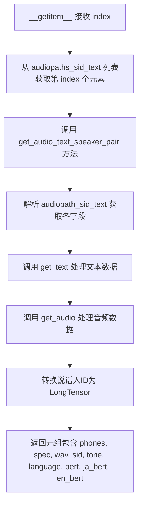

#### 带注释源码

```python
def __getitem__(self, index):
    """
    根据索引获取数据集中的单个样本
    
    参数:
        index: 数据集中的样本索引
        
    返回:
        包含以下元素的元组:
        - phones: 音素序列 (LongTensor)
        - spec: 频谱图 (Tensor)
        - wav: 音频波形 (Tensor)
        - sid: 说话人ID (LongTensor)
        - tone: 音调序列 (LongTensor)
        - language: 语言标识 (LongTensor)
        - bert: 中文BERT嵌入 (Tensor)
        - ja_bert: 日文BERT嵌入 (Tensor)
        - en_bert: 英文BERT嵌入 (Tensor)
    """
    # 通过索引从预处理后的文件路径列表中获取对应样本的路径信息
    # self.audiopaths_sid_text 是经过 _filter 方法过滤后的数据列表
    # 每个元素包含: [_id, spk, language, text, phones, tone, word2ph]
    return self.get_audio_text_speaker_pair(self.audiopaths_sid_text[index])
```


### `TextAudioSpeakerLoader.__len__`

返回数据集中音频-说话人-文本三元组的总数。该方法实现 PyTorch Dataset 所需的 `__len__` 协议，使数据集可以被 DataLoader 使用，用于确定数据集的大小和迭代次数。

参数： 无

返回值：`int`，返回过滤后的有效样本数量（`audiopaths_sid_text` 列表的长度）

#### 流程图

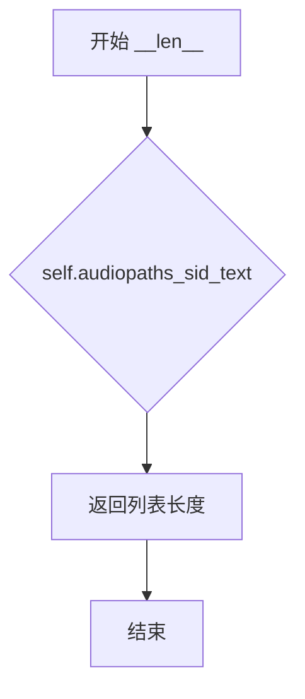

#### 带注释源码

```python
def __len__(self):
    """
    返回数据集中有效样本的数量。
    
    该方法实现了 PyTorch Dataset 类的 __len__ 协议，使得数据集对象
    可以被 torch.utils.data.DataLoader 使用。返回的是经过 _filter()
    方法过滤后的有效音频-说话人-文本样本的数量。
    
    Returns:
        int: 过滤后的有效样本数量，即 audiopaths_sid_text 列表的长度。
    """
    return len(self.audiopaths_sid_text)
```


### `TextAudioSpeakerCollate.__init__`

这是 `TextAudioSpeakerCollate` 类的构造函数，用于初始化 collation 对象的配置参数。该方法接收一个可选参数 `return_ids`，用于控制是否在返回的数据中包含样本 ID。

参数：

- `return_ids`：`bool`，可选参数（默认值为 `False`），用于控制是否在 collation 结果中返回样本 ID。当设置为 `True` 时，后续的 `__call__` 方法会额外返回排序后的索引信息。

返回值：无（`None`），构造函数不返回值，仅初始化对象属性。

#### 流程图

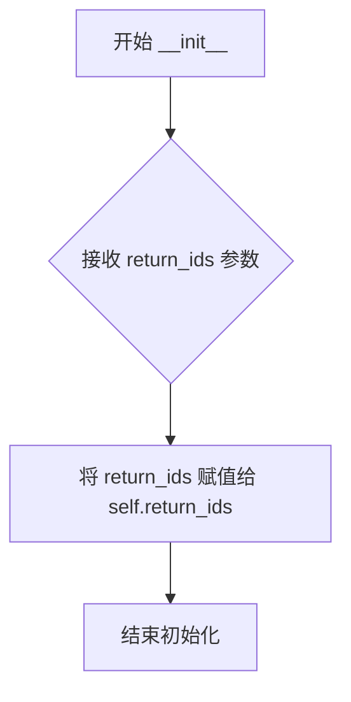

#### 带注释源码

```python
def __init__(self, return_ids=False):
    """
    TextAudioSpeakerCollate 类的初始化方法
    
    参数:
        return_ids: bool, 可选参数, 默认为 False
                   用于控制在 __call__ 方法中是否返回排序后的样本索引
    """
    self.return_ids = return_ids  # 存储是否返回ID的标志位
```

---

### 扩展信息

#### 1. 类的整体功能

`TextAudioSpeakerCollate` 类是一个 PyTorch DataLoader 的 collate 函数，用于将多个样本整理成一个 batch。具体功能包括：

- 对文本、频谱图、音频进行右零填充（right zero-padding），使每个样本长度统一
- 按频谱图长度降序排列样本（有助于 GPU 内存优化）
- 整合 speaker ID、tone、language、bert embedding 等多模态信息

#### 2. 该方法在类中的位置

`__init__` 方法是 `TextAudioSpeakerCollate` 类的入口点，它仅初始化了一个标志属性。真正的核心逻辑在 `__call__` 方法中，该方法接收一个 batch 列表并返回填充后的张量元组。

#### 3. 设计意图

- `return_ids` 参数的设计可能是为了支持后续需要知道原始样本顺序的场景，例如需要将预测结果映射回原始样本时
- 这种设计遵循了 PyTorch DataLoader 的自定义 collate 函数接口规范


### `TextAudioSpeakerCollate.__call__`

该方法是数据加载流程中的核心collator函数，负责将`TextAudioSpeakerLoader`获取的单个样本按序列长度降序排列后，对文本、频谱图、音频及各类嵌入向量进行右侧零填充对齐，生成可直接用于模型训练的批量张量。

参数：

- `batch`：`List[Tuple]` ，由`TextAudioSpeakerLoader`返回的样本列表，每个元素包含(phones, spec, wav, sid, tone, language, bert, ja_bert, en_bert)元组

返回值：`Tuple[Tensor]` ，包含12个填充后的张量元组，依次为text_padded, text_lengths, spec_padded, spec_lengths, wav_padded, wav_lengths, sid, tone_padded, language_padded, bert_padded, ja_bert_padded, en_bert_padded

#### 流程图

```mermaid
flowchart TD
    A[接收batch样本列表] --> B[按spec维度1长度降序排序获取索引]
    B --> C[计算max_text_len, max_spec_len, max_wav_len]
    C --> D[初始化12个填充张量并清零]
    D --> E{遍历排序后索引}
    E -->|第i个样本| F[提取row = batch[ids_sorted_decreasing[i]]]
    F --> G[填充text_padded和text_lengths]
    G --> H[填充spec_padded和spec_lengths]
    H --> I[填充wav_padded和wav_lengths]
    I --> J[填充sid、tone_padded、language_padded]
    J --> K[填充bert_padded、ja_bert_padded、en_bert_padded]
    K --> E
    E --> L[返回12个填充张量元组]
```

#### 带注释源码

```python
def __call__(self, batch):
    """
    Collate训练批次：标准化文本、频谱图、音频和说话人身份的批量整理
    PARAMS
    ------
    batch: [text_normalized, spec_normalized, wav_normalized, sid, tone, language, bert, ja_bert, en_bert]
    """
    # 按频谱图序列长度降序排列，获取排序索引（用于GPU计算效率优化）
    _, ids_sorted_decreasing = torch.sort(
        torch.LongTensor([x[1].size(1) for x in batch]), dim=0, descending=True
    )

    # 计算批次中各维度的最大长度
    max_text_len = max([len(x[0]) for x in batch])       # 文本最大长度
    max_spec_len = max([x[1].size(1) for x in batch])   # 频谱图最大长度
    max_wav_len = max([x[2].size(1) for x in batch])    # 音频波形最大长度

    # 初始化各维度长度张量
    text_lengths = torch.LongTensor(len(batch))
    spec_lengths = torch.LongTensor(len(batch))
    wav_lengths = torch.LongTensor(len(batch))
    sid = torch.LongTensor(len(batch))  # 说话人ID

    # 初始化填充张量：文本相关（整型）
    text_padded = torch.LongTensor(len(batch), max_text_len)
    tone_padded = torch.LongTensor(len(batch), max_text_len)
    language_padded = torch.LongTensor(len(batch), max_text_len)
    
    # 初始化填充张量：BERT嵌入（浮点型，维度1024）
    bert_padded = torch.FloatTensor(len(batch), 1024, max_text_len)
    ja_bert_padded = torch.FloatTensor(len(batch), 1024, max_text_len)
    en_bert_padded = torch.FloatTensor(len(batch), 1024, max_text_len)

    # 初始化填充张量：频谱图和音频波形
    spec_padded = torch.FloatTensor(len(batch), batch[0][1].size(0), max_spec_len)
    wav_padded = torch.FloatTensor(len(batch), 1, max_wav_len)

    # 所有填充张量初始化为零
    text_padded.zero_()
    tone_padded.zero_()
    language_padded.zero_()
    spec_padded.zero_()
    wav_padded.zero_()
    bert_padded.zero_()
    ja_bert_padded.zero_()
    en_bert_padded.zero_()

    # 按降序索引遍历批次，将数据填充到对应张量位置
    for i in range(len(ids_sorted_decreasing)):
        row = batch[ids_sorted_decreasing[i]]  # 获取排序后的样本

        # 填充文本、长度
        text = row[0]
        text_padded[i, : text.size(0)] = text
        text_lengths[i] = text.size(0)

        # 填充频谱图、长度
        spec = row[1]
        spec_padded[i, :, : spec.size(1)] = spec
        spec_lengths[i] = spec.size(1)

        # 填充音频波形、长度
        wav = row[2]
        wav_padded[i, :, : wav.size(1)] = wav
        wav_lengths[i] = wav.size(1)

        # 填充说话人ID
        sid[i] = row[3]

        # 填充音调
        tone = row[4]
        tone_padded[i, : tone.size(0)] = tone

        # 填充语言
        language = row[5]
        language_padded[i, : language.size(0)] = language

        # 填充多语言BERT嵌入
        bert = row[6]
        bert_padded[i, :, : bert.size(1)] = bert

        ja_bert = row[7]
        ja_bert_padded[i, :, : ja_bert.size(1)] = ja_bert

        en_bert = row[8]
        en_bert_padded[i, :, : en_bert.size(1)] = en_bert

    # 返回整理后的批次元组
    return (
        text_padded,         # 填充后的文本序列 [B, max_text_len]
        text_lengths,        # 文本实际长度 [B]
        spec_padded,         # 填充后的频谱图 [B, n_mel_channels, max_spec_len]
        spec_lengths,        # 频谱图实际长度 [B]
        wav_padded,          # 填充后的波形 [B, 1, max_wav_len]
        wav_lengths,        # 波形实际长度 [B]
        sid,                 # 说话人ID [B]
        tone_padded,         # 填充后的音调 [B, max_text_len]
        language_padded,    # 填充后的语言 [B, max_text_len]
        bert_padded,         # 中文BERT嵌入 [B, 1024, max_text_len]
        ja_bert_padded,     # 日文BERT嵌入 [B, 1024, max_text_len]
        en_bert_padded,     # 英文BERT嵌入 [B, 1024, max_text_len]
    )
```


### DistributedBucketSampler.__init__

该方法是DistributedBucketSampler类的初始化方法，用于在分布式训练环境中根据样本长度进行分桶采样，以保持每个batch中的样本长度相似，提高训练效率。方法接受数据集、批次大小、边界等参数，调用父类DistributedSampler的构造函数，并根据边界创建buckets，计算每个bucket的样本数量和总样本数。

参数：

- `dataset`：`torch.utils.data.Dataset`，数据集对象，包含lengths属性用于存储每个样本的长度信息
- `batch_size`：`int`，每个GPU进程处理的批次大小
- `boundaries`：`List[int]`，分桶边界列表，用于将样本按长度分到不同的桶中
- `num_replicas`：`Optional[int]`，分布式训练中的进程数，默认为None（从环境变量中获取）
- `rank`：`Optional[int]`，当前进程的排名，默认为None（从环境变量中获取）
- `shuffle`：`bool`，是否在每个epoch开始时打乱数据，默认为True

返回值：`None`，初始化方法无返回值

#### 流程图

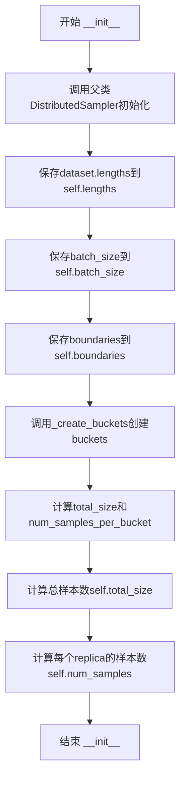

#### 带注释源码

```python
def __init__(
    self,
    dataset,
    batch_size,
    boundaries,
    num_replicas=None,
    rank=None,
    shuffle=True,
):
    """
    初始化DistributedBucketSampler
    
    参数:
        dataset: 数据集对象,需要包含lengths属性
        batch_size: 每个进程的批次大小
        boundaries: 分桶边界列表,如[100, 200, 300]表示将样本分为
                   (0, 100], (100, 200], (200, 300]三个区间
        num_replicas: 分布式训练进程数
        rank: 当前进程排名
        shuffle: 是否打乱数据
    """
    # 调用父类DistributedSampler的初始化方法
    # 设置dataset、num_replicas、rank、shuffle等基础属性
    super().__init__(dataset, num_replicas=num_replicas, rank=rank, shuffle=shuffle)
    
    # 从数据集获取每个样本的长度信息
    # 这个lengths列表存储了训练集中每个音频文件对应的特征长度
    self.lengths = dataset.lengths
    
    # 保存批次大小配置
    self.batch_size = batch_size
    
    # 保存分桶边界配置
    self.boundaries = boundaries

    # 调用内部方法_create_buckets根据样本长度创建buckets
    # buckets: 二维列表,每个子列表存储属于该bucket的样本索引
    # num_samples_per_bucket: 每个bucket需要采样的总样本数(含padding)
    self.buckets, self.num_samples_per_bucket = self._create_buckets()
    
    # 计算所有bucket的总样本数(包含为了整除而添加的padding样本)
    self.total_size = sum(self.num_samples_per_bucket)
    
    # 计算当前replica需要采样的样本数
    # 每个replica处理总样本数的1/num_replicas
    self.num_samples = self.total_size // self.num_replicas
```


### `DistributedBucketSampler._create_buckets`

该方法用于根据数据样本的长度将样本分配到不同的桶中，并计算每个桶应分配的样本数量以确保在分布式训练中能均匀分配。

参数：

- `self`：隐式参数，DistributedBucketSampler实例本身，无需显式传递

返回值：

- `buckets`：List[List[int]]，二维列表，每个子列表包含属于该桶的样本索引
- `num_samples_per_bucket`：List[int]，每个桶应分配的样本数量（已对齐到批次大小）

#### 流程图

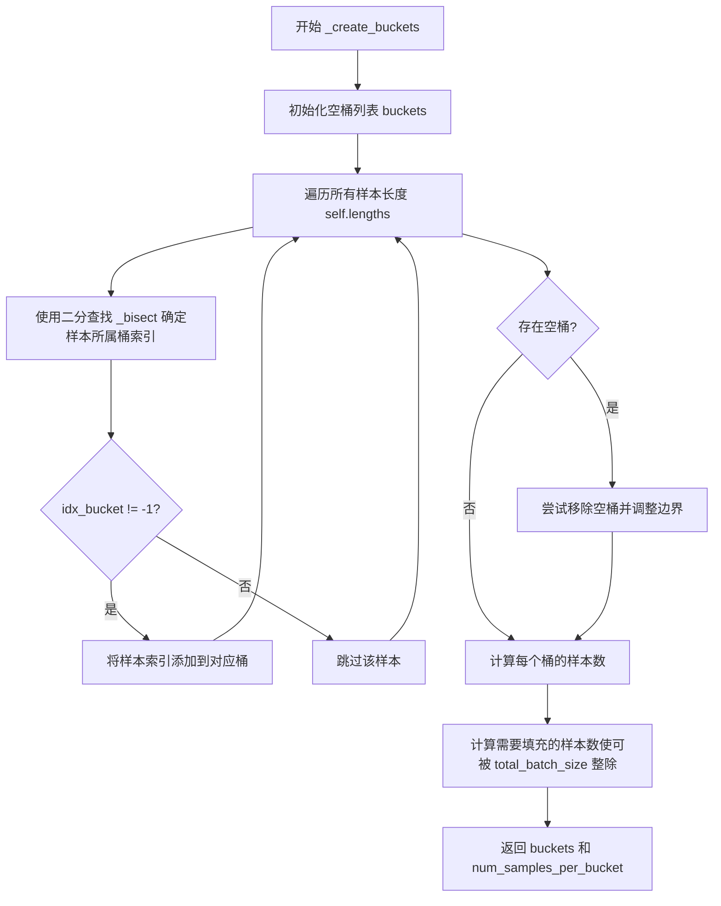

#### 带注释源码

```python
def _create_buckets(self):
    """
    根据样本长度创建桶并计算每个桶的样本数
    
    该方法的核心逻辑：
    1. 将所有样本按照长度分配到对应的桶中
    2. 移除空的桶以避免无效的批次
    3. 对每个桶进行填充，使其样本数能被 total_batch_size 整除
    这样可以确保在分布式训练中每个进程都能获得均匀数量的样本
    """
    # 步骤1: 初始化桶列表，桶的数量比边界点少1
    # 例如 boundaries = [100, 200, 300] -> 2个桶: [0,100], [100,200], [200,300] 取中间部分
    buckets = [[] for _ in range(len(self.boundaries) - 1)]
    
    # 步骤2: 遍历所有样本的长度，将样本索引分配到对应桶中
    for i in range(len(self.lengths)):
        length = self.lengths[i]
        # 使用二分查找确定该长度属于哪个桶
        idx_bucket = self._bisect(length)
        if idx_bucket != -1:
            # 如果找到了对应的桶，则将样本索引添加到该桶中
            buckets[idx_bucket].append(i)

    # 步骤3: 移除空的桶并调整边界
    # 这样可以避免产生空批次，提高训练效率
    try:
        # 从后向前遍历，避免索引问题
        for i in range(len(buckets) - 1, 0, -1):
            if len(buckets[i]) == 0:
                # 移除空桶和对应的上界边界
                buckets.pop(i)
                self.boundaries.pop(i + 1)
        # 确保所有桶都不为空
        assert all(len(bucket) > 0 for bucket in buckets)
    # 当某个桶没有被遍历时捕获异常
    except Exception as e:
        print("Bucket warning ", e)
        # 备用清理逻辑，处理边界情况
        for i in range(len(buckets) - 1, -1, -1):
            if len(buckets[i]) == 0:
                buckets.pop(i)
                self.boundaries.pop(i + 1)

    # 步骤4: 计算每个桶应分配的样本数
    # 确保每个桶的样本数能被 total_batch_size 整除
    # 这样可以保证在分布式训练中每个进程获得相同数量的样本
    num_samples_per_bucket = []
    for i in range(len(buckets)):
        len_bucket = len(buckets[i])
        # total_batch_size 是所有进程的总批次大小
        total_batch_size = self.num_replicas * self.batch_size
        # 计算需要填充的样本数（余数）
        rem = (
            total_batch_size - (len_bucket % total_batch_size)
        ) % total_batch_size
        # 最终样本数 = 原始样本数 + 填充数
        num_samples_per_bucket.append(len_bucket + rem)
    
    # 返回桶列表和每个桶的样本数
    return buckets, num_samples_per_bucket
```


### `DistributedBucketSampler.__iter__`

该方法是分布式桶采样器的迭代器实现，用于在分布式训练环境中按长度对样本进行分桶并生成批次，确保每个批次中的样本长度相近，同时在多个进程间均匀分配样本。

参数：无显式参数（隐含参数 `self` 为类实例）

返回值：`Iterator[List[int]]`，返回样本索引批次的迭代器

#### 流程图

```mermaid
flowchart TD
    A[开始 __iter__] --> B[创建随机数生成器 g 并设置种子为 self.epoch]
    B --> C{self.shuffle 是否为 True?}
    C -->|Yes| D[对每个 bucket 进行随机排列生成 indices]
    C -->|No| E[对每个 bucket 按顺序生成 indices]
    D --> F[初始化 batches 列表]
    E --> F
    F --> G[遍历每个 bucket]
    G --> H{当前 bucket 是否为空?}
    H -->|Yes| I[跳过当前 bucket, 继续下一个]
    H -->|No| J[获取该 bucket 的 indices 和样本数量]
    J --> K[计算需要填充的样本数 rem = num_samples_bucket - len_bucket]
    K --> L[填充 ids_bucket 使其可被整除]
    L --> M[根据 rank 和 num_replicas 进行子采样]
    M --> N[将样本分批添加到 batches]
    N --> G
    I --> O{是否还有更多 bucket?}
    O -->|Yes| G
    O -->|No| P{self.shuffle 是否为 True?}
    P -->|Yes| Q[对 batches 顺序进行随机排列]
    P -->|No| R[将 batches 赋值给 self.batches]
    Q --> R
    R --> S[断言验证 batch 数量和样本数量一致]
    S --> T[返回 iter(self.batches)]
```

#### 带注释源码

```python
def __iter__(self):
    # 基于 epoch 确定性地打乱，确保同一 epoch 内结果一致
    g = torch.Generator()
    g.manual_seed(self.epoch)

    # 存储每个 bucket 中样本的索引排列
    indices = []
    if self.shuffle:
        # 对每个 bucket 内的样本进行随机排列
        for bucket in self.buckets:
            indices.append(torch.randperm(len(bucket), generator=g).tolist())
    else:
        # 按顺序遍历每个 bucket
        for bucket in self.buckets:
            indices.append(list(range(len(bucket))))

    # 存储最终的批次
    batches = []
    # 遍历所有 bucket
    for i in range(len(self.buckets)):
        bucket = self.buckets[i]
        len_bucket = len(bucket)
        # 跳过空 bucket
        if len_bucket == 0:
            continue
        # 获取该 bucket 对应的索引排列
        ids_bucket = indices[i]
        # 该 bucket 应该有的总样本数（包含填充样本）
        num_samples_bucket = self.num_samples_per_bucket[i]

        # 添加额外样本使样本数可被整除
        rem = num_samples_bucket - len_bucket
        ids_bucket = (
            ids_bucket
            + ids_bucket * (rem // len_bucket)
            + ids_bucket[: (rem % len_bucket)]
        )

        # 子采样：根据当前 rank 从所有样本中选取属于该进程的样本
        ids_bucket = ids_bucket[self.rank :: self.num_replicas]

        # 分批：将样本按 batch_size 分组
        for j in range(len(ids_bucket) // self.batch_size):
            batch = [
                bucket[idx]
                for idx in ids_bucket[
                    j * self.batch_size : (j + 1) * self.batch_size
                ]
            ]
            batches.append(batch)

    # 如果需要打乱，则对批次顺序进行随机排列
    if self.shuffle:
        batch_ids = torch.randperm(len(batches), generator=g).tolist()
        batches = [batches[i] for i in batch_ids]
    
    # 保存批次结果供外部访问
    self.batches = batches

    # 验证总样本数是否符合预期
    assert len(self.batches) * self.batch_size == self.num_samples
    # 返回批次迭代器
    return iter(self.batches)
```


### `DistributedBucketSampler._bisect`

该方法是一个二分查找算法，用于在预定义的边界数组（boundaries）中找到给定长度 `x` 所属的桶（bucket）索引，从而实现将样本按长度动态分配到对应桶中，以便在训练时将相近长度的样本组成批次，减少填充（padding）带来的计算浪费。

参数：

- `x`：`int`，要查找的长度值，通常是音频 spectrogram 的长度
- `lo`：`int`，查找范围的起始索引，默认为 0
- `hi`：`int` 或 `None`，查找范围的结束索引，默认为 None，在方法内部会被设置为 `len(self.boundaries) - 1`

返回值：`int`，返回匹配的桶索引；如果没有找到匹配的桶（即长度超出所有边界范围），则返回 -1

#### 流程图

```mermaid
flowchart TD
    A[开始 _bisect] --> B{hi is None?}
    B -->|是| C[hi = len&#40;boundaries&#41; - 1]
    B -->|否| D{hi > lo?}
    C --> D
    D -->|否| E[返回 -1]
    D -->|是| F[mid = (hi + lo) // 2]
    F --> G{boundaries[mid] < x <= boundaries[mid+1]?}
    G -->|是| H[返回 mid]
    G -->|否| I{x <= boundaries[mid]?}
    I -->|是| J[递归调用 _bisect&#40;x, lo, mid&#41;]
    I -->|否| K[递归调用 _bisect&#40;x, mid+1, hi&#41;]
    J --> A
    K --> A
```

#### 带注释源码

```python
def _bisect(self, x, lo=0, hi=None):
    """
    二分查找算法，在边界数组中找到给定长度 x 所属的桶索引。

    参数:
        x: int，要查找的长度值
        lo: int，查找范围的起始索引
        hi: int or None，查找范围的结束索引

    返回:
        int，匹配的桶索引；如果没有找到匹配的桶则返回 -1
    """
    # 如果 hi 未提供，则默认为边界数组长度减一
    # boundaries 数组长度比桶数量多 1，例如 boundaries = [b1, b2, b3] 对应 2 个桶
    if hi is None:
        hi = len(self.boundaries) - 1

    # 如果查找范围有效（hi > lo），继续二分查找
    if hi > lo:
        # 计算中间索引
        mid = (hi + lo) // 2

        # 判断 x 是否在当前中间区间 [boundaries[mid], boundaries[mid+1]] 内
        # 区间定义为：boundaries[mid] < x <= boundaries[mid+1]
        if self.boundaries[mid] < x and x <= self.boundaries[mid + 1]:
            return mid  # 找到匹配的桶，返回其索引
        # 如果 x <= boundaries[mid]，说明 x 在左半部分，继续递归查找左半部分
        elif x <= self.boundaries[mid]:
            return self._bisect(x, lo, mid)
        # 如果 x > boundaries[mid+1]，说明 x 在右半部分，继续递归查找右半部分
        else:
            return self._bisect(x, mid + 1, hi)
    else:
        # 查找范围无效（hi <= lo），说明 x 不在任何桶的范围内，返回 -1
        return -1
```


### `DistributedBucketSampler.__len__`

该方法返回分布式分桶采样器在每个训练 epoch 中可提供的批次数，用于 PyTorch DataLoader 确定迭代次数。

参数：此方法无显式参数（使用隐式 `self` 引用）。

返回值：`int`，返回每个 epoch 中可执行的 batch 数量，计算公式为 `num_samples // batch_size`。

#### 流程图

```mermaid
flowchart TD
    A[开始 __len__] --> B[获取 self.num_samples]
    B --> C[获取 self.batch_size]
    C --> D[计算 num_samples // batch_size]
    D --> E[返回整型batch数量]
```

#### 带注释源码

```python
def __len__(self):
    """
    返回分布式分桶采样器每个epoch的batch数量
    
    计算逻辑：
    - self.num_samples: 当前进程(rank)分配的总样本数（已整除）
    - self.batch_size: 每个batch的样本数
    - 返回值: 可执行的epoch迭代次数
    
    注意：此方法由PyTorch DataLoader在训练循环中自动调用，
    用于确定每个epoch需要迭代的次数
    """
    return self.num_samples // self.batch_size
```


## 关键组件


### 张量索引与惰性加载

在get_audio方法中使用torch.load尝试加载预计算的频谱图缓存文件(.spec.pt或.mel.pt)，如果文件不存在才调用mel_spectrogram_torch或spectrogram_torch进行计算并可选地保存到磁盘，实现频谱图的惰性加载，避免重复计算。

### 反量化支持

在get_audio方法中，音频加载后通过audio_norm = audio / self.max_wav_value进行归一化除法操作，将原始音频波形从整数值范围反量化回[-1, 1]的浮点区间。

### 量化策略与BERT特征

在get_text方法中，根据language_str参数(ZH/JP/EN)分别加载对应的BERT预训练特征(.bert.pt)，为多语言TTS模型提供文本的语义表示。

### TextAudioSpeakerLoader类

负责多说话者TTS数据加载的核心数据集类，包含audiopaths_sid_text路径列表、max_wav_value音频归一化参数、sampling_rate采样率、filter_length/win_length/hop_length频谱参数、spk_map说话者ID映射、use_mel_spec_posterior mel频谱开关、cleaned_text清洗文本开关、add_blank空白符插入开关、min_text_len/max_text_len文本长度过滤范围、lengths样本长度列表等字段。

### TextAudioSpeakerCollate类

数据批处理整理类，负责将多个样本填充(pad)至相同长度并打包成batch，包含return_ids是否返回索引标识字段，使用torch.LongTensor和torch.FloatTensor分别存储文本/说话者ID和频谱/BERT特征。

### DistributedBucketSampler类

分布式分桶采样器，继承自torch.utils.data.distributed.DistributedSampler，按样本长度分桶以保持batch内长度相似，包含lengths样本长度列表、batch_size批大小、boundaries长度边界、buckets样本分桶列表、num_samples_per_bucket每桶样本数、total_size总样本数、num_samples每进程样本数、batches批次列表等字段。

### 音频加载与频谱计算

load_wav_to_torch加载wav文件，spectrogram_torch和mel_spectrogram_torch分别计算线性频谱和梅尔频谱，config.train_ms_config.spec_cache控制是否缓存计算结果。

### 文本序列处理

cleaned_text_to_sequence将清洗后的文本转换为整数序列，commons.intersperse在序列中插入空白符(0)作为CTC分隔符，word2ph用于对齐字词与音素。


## 问题及建议


### 已知问题

-   **bert加载失败时存在潜在错误**：在`get_text`方法中，当`bert_path`加载失败时，`bert_ori`未被定义，但后续仍会根据`language_str`尝试使用`bert_ori`（如`bert = bert_ori`），会导致`NameError`异常
-   **硬编码随机种子问题**：`__init__`中使用`random.seed(1234)`设置随机种子，这在多进程分布式训练中可能造成不可预测的重复或分布不均
-   **重复代码**：`self.sampling_rate`被赋值两次（第24行和第27行）
-   **内存预分配不灵活**：`TextAudioSpeakerCollate`中硬编码了bert的维度`1024`，当模型结构变化时需要修改多处
-   **spectrogram缓存可能失效**：`get_audio`中通过`.replace(".wav", ".spec.pt")`构建缓存路径，如果文件名本身包含".wav"字符串会导致错误的路径
-   **边界条件处理**：`DistributedBucketSampler`的`_bisect`方法中条件`self.boundaries[mid] < x and x <= self.boundaries[mid + 1]`可能导致边界值被错误分类

### 优化建议

-   **完善bert加载失败处理**：在`get_text`中添加`bert_ori`初始化逻辑，当加载失败时根据语言生成随机张量或使用默认值
-   **移除硬编码随机种子**：依赖PyTorch的分布式采样器管理随机状态，或在配置中传入种子
-   **统一配置来源**：将`1024`等魔法数字提取为配置参数`hparams.bert_hidden_size`
-   **优化缓存路径构建**：使用`pathlib`或正则表达式更安全地替换文件扩展名
-   **添加类型注解**：为类方法、函数参数添加Type Hint以提升代码可维护性
-   **实现`__repr__`方法**：为`DistributedBucketSampler`添加便于调试的字符串表示方法
-   **考虑异步加载**：对于bert和spec等大型预计算数据，可考虑使用内存映射或异步加载提升数据准备效率

## 其它


### 设计目标与约束

本模块旨在为多说话人TTS系统提供高效的数据加载能力，支持分布式训练环境下的 bucketing 机制，通过将相似长度的样本分组成批次来优化训练效率。设计约束包括：1) 必须与 PyTorch DataLoader 兼容；2) 支持多说话人（speaker_id）映射；3) 支持中、英、日三种语言的 BERT 特征提取；4) 过滤超出长度限制的样本；5) 支持分布式训练的采样策略。

### 错误处理与异常设计

1. **音频采样率不匹配**: 在 `get_audio` 方法中，若加载音频的采样率与目标采样率不符，抛出 `ValueError` 并提示文件名和采样率信息。2. **BERT 特征加载失败**: 在 `get_text` 方法中，使用 try-except 捕获异常，记录警告日志并继续使用随机初始化的 BERT 向量（1024维）。3. **文件不存在**: `torch.load` 加载 .spec.pt 或 .mel.pt 文件失败时，会重新计算频谱图并根据配置决定是否缓存。4. **Bucketing 边界无效**: 在 `_create_buckets` 中捕获空 bucket 异常，打印警告并动态调整边界。

### 数据流与状态机

数据流遵循以下路径：1) 初始化阶段：加载文件路径列表 → 随机打乱 → 过滤超出长度范围的样本 → 计算频谱长度用于 bucketing。2) 迭代阶段（`__getitem__`）：根据索引获取样本路径 → 调用 `get_audio_text_speaker_pair` 获取音频、文本、说话人信息 → 返回元组 `(phones, spec, wav, sid, tone, language, bert, ja_bert, en_bert)`。3) 批处理阶段（Collate）：接收 batch 列表 → 按频谱长度降序排序 → 对文本、频谱、音频进行零填充对齐 → 返回填充后的张量元组。4) 分布式采样阶段：`DistributedBucketSampler` 根据长度将样本分配到不同 bucket，在每个 bucket 内打乱，按 rank 划分后进行批分组。

### 外部依赖与接口契约

本模块依赖以下外部组件：1) `torch` 及 `torch.utils.data`: PyTorch 核心库和数据集接口。2) `tools.log.logger`: 日志记录模块。3) `commons`: 包含 `intersperse` 函数用于在序列中插入空白符。4) `mel_processing`: 提供 `spectrogram_torch` 和 `mel_spectrogram_torch` 函数。5) `utils`: 提供 `load_wav_to_torch` 和 `load_filepaths_and_text` 工具函数。6) `text`: 提供 `cleaned_text_to_sequence` 函数处理文本。7) `config`: 全局配置对象 `config`。接口契约：Dataset 类必须实现 `__getitem__` 和 `__len__` 方法；Collate 类必须实现 `__call__` 方法接收 batch 并返回填充后的张量字典或元组；Sampler 类必须实现 `__iter__` 和 `__len__` 方法。

### 配置参数说明

核心配置参数通过 `hparams` 对象传入：1) `max_wav_value`: 音频归一化因子。2) `sampling_rate`: 目标采样率（默认 24000 或 48000）。3) `filter_length`: STFT 滤波器长度。4) `hop_length`: 帧移长度。5) `win_length`: 窗口长度。6) `spk2id`: 说话人ID到索引的映射字典。7) `use_mel_posterior_encoder`: 是否使用梅尔频谱作为后验编码器。8) `n_mel_channels`: 梅尔通道数（默认80）。9) `cleaned_text`: 是否使用清洗后的文本。10) `add_blank`: 是否在文本序列中插入空白符。11) `min_text_len` / `max_text_len`: 文本长度过滤范围。12) `spec_cache`: 是否缓存计算的频谱图。

### 性能考虑与优化点

1. **频谱图缓存**: 当 `spec_cache` 启用时，加载的频谱图会保存到 .spec.pt 文件，避免重复计算。2. **Bucketing 机制**: 将相似长度的样本分组成批次，减少零填充比例，提高计算效率。3. **预过滤机制**: 在数据集初始化阶段过滤超出长度范围的样本，避免训练过程中无效计算。4. **随机打乱**: 使用固定种子 1234 确保可复现性。5. **分布式采样**: `DistributedBucketSampler` 确保各进程处理的样本长度分布相似。6. **内存优化**: 使用 `torch.LongTensor` 和 `torch.FloatTensor` 预分配填充矩阵，避免动态扩展。

### 资源管理

1. **文件句柄**: 使用 `torch.load` 加载音频和特征文件，由 PyTorch 自动管理内存。2. **GPU 内存**: 填充后的张量在 DataLoader 的 worker 进程中创建，通过 `pin_memory` 可进一步优化 CPU-GPU 传输。3. **磁盘缓存**: 频谱图以 .pt 格式缓存到磁盘，使用 `torch.save` 和 `torch.load`。4. **临时文件清理**: 缓存文件不会自动清理，需要手动处理或设置过期策略。

### 并发与分布式支持

1. **多进程数据加载**: 通过 `torch.utils.data.DataLoader` 的 `num_workers` 参数实现多进程并行加载。2. **分布式训练**: `DistributedBucketSampler` 继承自 `DistributedSampler`，自动处理各进程间的样本分配，确保不重复不遗漏。3. **Rank 划分**: 在 `__iter__` 中使用 `ids_bucket[self.rank :: self.num_replicas]` 实现数据分片。4. **Epoch 管理**: 支持 `set_epoch` 方法用于分布式训练时的打乱。

### 兼容性考虑

1. **Python 版本**: 依赖 Python 3.7+。2. **PyTorch 版本**: 需兼容 PyTorch 1.0+ 的 Dataset 和 DistributedSampler 接口。3. **音频格式**: 依赖 `load_wav_to_torch` 支持的 wav 格式。4. **特征格式**: BERT 特征和频谱图使用 PyTorch 的 .pt 序列化格式。5. **语言支持**: 当前支持中文（ZH）、日文（JP）和英文（EN）的文本处理。

### 测试策略

1. **单元测试**: 测试 `TextAudioSpeakerLoader` 的样本加载功能，验证返回张量的形状和类型。2. **过滤测试**: 验证 `_filter` 方法正确过滤超出长度范围的样本。3. **Collate 测试**: 验证 `TextAudioSpeakerCollate` 正确处理不同长度样本的填充和排序。4. **Bucketing 测试**: 验证 `DistributedBucketSampler` 正确创建 bucket 并按长度分组。5. **分布式测试**: 在多进程环境下验证采样器不重复不遗漏。6. **缓存测试**: 验证频谱图缓存和加载功能正常。

### 使用示例

```python
# 创建数据集
dataset = TextAudioSpeakerLoader(
    audiopaths_sid_text="filelists/train.txt", 
    hparams=hparams
)

# 创建 collate 函数
collate_fn = TextAudioSpeakerCollate()

# 创建分布式采样器
batch_size = 16
boundaries = [100, 200, 300, 400, 500, 600, 700, 800, 900, 1000]
sampler = DistributedBucketSampler(
    dataset, 
    batch_size=batch_size, 
    boundaries=boundaries,
    num_replicas=world_size,
    rank=rank
)

# 创建 DataLoader
loader = DataLoader(
    dataset,
    batch_size=batch_size,
    sampler=sampler,
    collate_fn=collate_fn,
    num_workers=4,
    pin_memory=True
)

# 迭代训练
for batch in loader:
    # batch 包含: text_padded, text_lengths, spec_padded, spec_lengths, 
    #             wav_padded, wav_lengths, sid, tone_padded, language_padded,
    #             bert_padded, ja_bert_padded, en_bert_padded
    pass
```


    