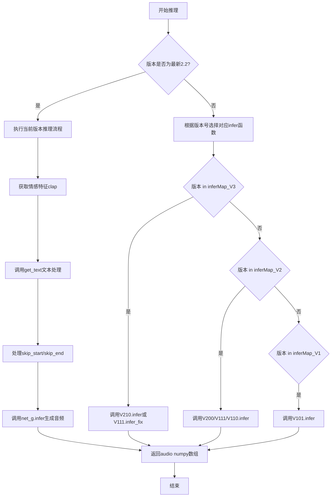
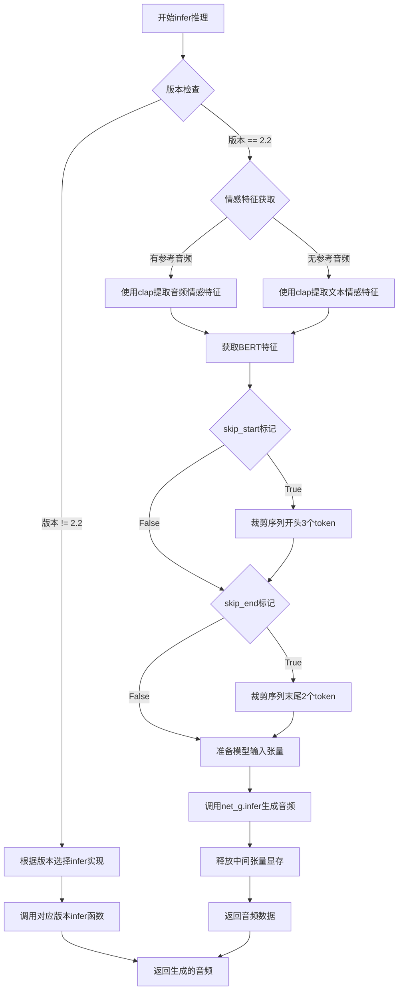
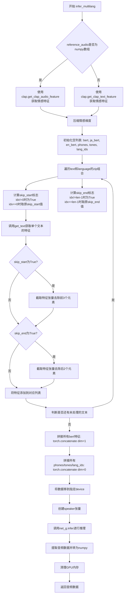

# `Bert-VITS2\for_deploy\infer.py` 详细设计文档

该代码实现了VITS语音合成模型的版本管理、跨版本兼容推理及动态模型加载功能，支持从1.0到2.2的多个模型版本，通过版本映射机制自动选择对应的模型架构、符号表和推理函数，实现多版本模型的统一推理接口。

## 整体流程



## 类结构

```
inference.py (模块根)
├── 全局配置
│   ├── latest_version (当前最新版本号)
│   ├── SynthesizerTrnMap (版本→模型类映射)
│   ├── symbolsMap (版本→符号表映射)
│   ├── inferMap_V3 (v2.1推理函数映射)
│   ├── inferMap_V2 (v2.0.x推理函数映射)
│   └── inferMap_V1 (v1.0.x推理函数映射)
└── 核心函数
    ├── get_net_g (模型加载)
    ├── get_text (文本预处理)
    ├── infer (单文本推理)
    └── infer_multilang (多文本推理)
```

## 全局变量及字段


### `latest_version`
    
当前最新模型版本号，值为"2.2"

类型：`str`
    


### `SynthesizerTrnMap`
    
版本号到SynthesizerTrn模型类的映射字典，用于根据版本加载对应模型

类型：`Dict[str, type]`
    


### `symbolsMap`
    
版本号到符号表(symbols)的映射字典，用于不同版本的字符符号支持

类型：`Dict[str, type]`
    


### `inferMap_V3`
    
V3版本(2.1)的推理函数映射，用于处理2.1版本模型的推理调用

类型：`Dict[str, Callable]`
    


### `inferMap_V2`
    
V2版本(2.0系列及1.1.x)的推理函数映射，用于支持中日英三语版本

类型：`Dict[str, Callable]`
    


### `inferMap_V1`
    
V1版本(1.0.x)的推理函数映射，用于仅支持中文的早期版本

类型：`Dict[str, Callable]`
    


    

## 全局函数及方法


### `get_net_g`

该函数是模型加载的核心入口，根据版本号动态选择对应的模型架构（支持从1.0.0到2.1的多个历史版本），实例化SynthesizerTrn模型后加载预训练权重并返回可用于推理的生成网络模型。

参数：

- `model_path`：`str`，模型权重文件路径，用于加载预训练模型参数
- `version`：`str`，模型版本号，决定使用哪个版本的模型架构（从1.0.0到2.1的版本映射）
- `device`：`str`，模型运行设备（如"cuda"或"cpu"），模型将被移至该设备上
- `hps`：`Namespace/HyperParameters`，包含模型配置的超参数对象，需包含data（数据处理参数）、train（训练参数）和model（模型结构参数）

返回值：`torch.nn.Module`，返回实例化并加载权重后的生成网络模型（net_g），可用于后续推理

#### 流程图

```mermaid
flowchart TD
    A[开始 get_net_g] --> B{version 是否等于 latest_version}
    B -->|否| C[从 SynthesizerTrnMap 获取对应版本的模型类]
    B -->|是| D[使用当前最新版本 SynthesizerTrn 模型类]
    C --> E[根据版本选择对应 symbols]
    D --> E
    E --> F[实例化模型: 传入 symbols 数量、滤波器长度、segment_size、说话人数量等参数]
    F --> G[使用 .to(device) 将模型移至指定设备]
    G --> H[设置 net_g.eval() 评估模式]
    H --> I[调用 utils.load_checkpoint 加载模型权重]
    I --> J[返回 net_g 生成网络模型]
```

#### 带注释源码

```python
def get_net_g(model_path: str, version: str, device: str, hps):
    """
    加载并返回 VITS 声学模型实例
    
    根据 version 参数选择对应版本的模型架构，实现版本兼容性。
    支持从 V101 到 V210 的多个历史版本模型加载。
    
    参数:
        model_path: 预训练模型权重文件路径 (.pt)
        version: 模型版本号字符串，如 "2.1", "2.0", "1.1.1" 等
        device: 模型运行设备，"cuda" 或 "cpu"
        hps: 超参数配置对象，包含 data、train、model 等配置
    
    返回:
        加载完权重的 SynthesizerTrn 模型实例
    """
    
    # 判断是否为当前最新版本
    if version != latest_version:
        # 非最新版本：从版本映射表中获取对应版本的模型类
        # 支持旧版本模型的兼容性加载
        net_g = SynthesizerTrnMap[version](
            # 获取该版本对应的字符符号数量
            len(symbolsMap[version]),
            # 计算频谱维度：filter_length/2 + 1
            hps.data.filter_length // 2 + 1,
            # 计算每段帧数：segment_size / hop_length
            hps.train.segment_size // hps.data.hop_length,
            # 说话人数量，支持多说话人模型
            n_speakers=hps.data.n_speakers,
            # 展开传递模型配置参数（注意力层数、隐藏层维度等）
            **hps.model,
        ).to(device)  # 将模型移至指定计算设备
    else:
        # 当前版本（2.2）：直接使用最新的 SynthesizerTrn 模型类
        # 使用全局 symbols 列表（当前版本字符集）
        net_g = SynthesizerTrn(
            len(symbols),
            hps.data.filter_length // 2 + 1,
            hps.train.segment_size // hps.data.hop_length,
            n_speakers=hps.data.n_speakers,
            **hps.model,
        ).to(device)
    
    # 设置为评估模式，禁用 Dropout、BatchNorm 使用训练均值等
    _ = net_g.eval()
    
    # 加载预训练模型权重
    # 参数: 模型权重路径, 模型实例, 优化器(此处为None), 是否跳过优化器
    _ = utils.load_checkpoint(model_path, net_g, None, skip_optimizer=True)
    
    # 返回可用于推理的生成网络模型
    return net_g
```


### `get_text`

该函数负责将输入文本转换为模型可用的特征向量，包括文本清洗、phoneme序列生成、BERT特征提取以及根据语言分发不同的BERT特征向量。

参数：

- `text`：`str`，要处理的输入文本
- `language_str`：`str`，语言标识符，支持"ZH"（中文）、"JP"（日语）、"EN"（英语）
- `bert`：`对象`，BERT特征提取器，包含不同语言的get_bert_feature方法
- `hps`：`对象`，超参数配置，包含数据处理和模型配置信息
- `device`：`str`，计算设备标识（如"cuda"或"cpu"）

返回值：

- `bert`：`torch.Tensor`，形状为(1024, seq_len)的BERT特征张量
- `ja_bert`：`torch.Tensor`，日语BERT特征张量
- `en_bert`：`torch.Tensor`，英语BERT特征张量
- `phone`：`torch.LongTensor`，phoneme序列张量
- `tone`：`torch.LongTensor`，音调序列张量
- `language`：`torch.LongTensor`，语言ID序列张量

#### 流程图

```mermaid
flowchart TD
    A[开始: get_text] --> B[调用clean_text清理文本]
    B --> C[获取norm_text, phone, tone, word2ph]
    C --> D[调用cleaned_text_to_sequence]
    D --> E[获取phone, tone, language]
    E --> F{检查hps.data.add_blank}
    F -->|是| G[在phone/tone/language中插入空白]
    G --> H[更新word2ph长度]
    H --> I[调用bert[language_str].get_bert_feature]
    F -->|否| I
    I --> J[获取bert_ori特征]
    J --> K{判断language_str}
    K -->|ZH| L[bert=bert_ori, ja_bert/en_bert随机初始化]
    K -->|JP| M[ja_bert=bert_ori, bert/en_bert随机初始化]
    K -->|EN| N[en_bert=bert_ori, bert/ja_bert随机初始化]
    K -->|其他| O[抛出ValueError异常]
    L --> P[验证bert序列长度与phone一致]
    M --> P
    N --> P
    O --> P
    P --> Q[转换phone/tone/language为LongTensor]
    Q --> R[返回bert, ja_bert, en_bert, phone, tone, language]
```

#### 带注释源码

```python
def get_text(text, language_str, bert, hps, device):
    # 第一步：文本清洗
    # 调用clean_text函数进行文本预处理，包括正则化、多音字标注等
    # 返回：norm_text（规范化文本）、phone（音素序列）、tone（声调）、word2ph（词到音素的映射）
    norm_text, phone, tone, word2ph = clean_text(text, language_str)
    
    # 第二步：转换为序列
    # 将清洗后的phone和tone转换为模型所需的序列格式
    # 同时生成language ID序列
    phone, tone, language = cleaned_text_to_sequence(phone, tone, language_str)

    # 第三步：添加空白符（可选）
    # 如果配置中启用了add_blank，则在序列中插入空白符(0)以改善发音连贯性
    # 同时需要将word2ph对应扩展2倍（每个音素后插入一个空白）
    if hps.data.add_blank:
        phone = commons.intersperse(phone, 0)      # 在phone序列中插入0
        tone = commons.intersperse(tone, 0)        # 在tone序列中插入0
        language = commons.intersperse(language, 0) # 在language序列中插入0
        for i in range(len(word2ph)):
            word2ph[i] = word2ph[i] * 2             # 每个word2ph值翻倍
        word2ph[0] += 1                             # 第一个位置额外加1补偿插入
    
    # 第四步：获取BERT特征
    # 调用对应语言模型的BERT特征提取器
    # bert_ori形状: (1024, seq_len)
    bert_ori = bert[language_str].get_bert_feature(norm_text, word2ph, device)
    
    # 释放word2ph内存
    del word2ph
    
    # 第五步：验证BERT特征长度与phone序列长度一致
    assert bert_ori.shape[-1] == len(phone), phone

    # 第六步：根据语言分发BERT特征
    # 当前版本(V2.2)支持三种语言的BERT特征，但模型使用统一的bert字段
    # 需要根据输入语言将对应的BERT特征赋值给相应变量，其他语言随机初始化
    if language_str == "ZH":
        bert = bert_ori                                    # 中文文本使用提取的中文BERT
        ja_bert = torch.randn(1024, len(phone))           # 日语特征随机初始化
        en_bert = torch.randn(1024, len(phone))           # 英语特征随机初始化
    elif language_str == "JP":
        bert = torch.randn(1024, len(phone))              # 中文特征随机初始化
        ja_bert = bert_ori                                # 日语文本使用提取的日语BERT
        en_bert = torch.randn(1024, len(phone))           # 英语特征随机初始化
    elif language_str == "EN":
        bert = torch.randn(1024, len(phone))              # 中文特征随机初始化
        ja_bert = torch.randn(1024, len(phone))           # 日语特征随机初始化
        en_bert = bert_ori                                # 英语文本使用提取的英语BERT
    else:
        # 不支持的语言类型，抛出异常
        raise ValueError("language_str should be ZH, JP or EN")

    # 第七步：验证最终bert特征长度
    assert bert.shape[-1] == len(
        phone
    ), f"Bert seq len {bert.shape[-1]} != {len(phone)}"

    # 第八步：转换为PyTorch张量
    # 将numpy数组或Python列表转换为LongTensor以供模型使用
    phone = torch.LongTensor(phone)
    tone = torch.LongTensor(tone)
    language = torch.LongTensor(language)
    
    # 返回处理后的所有特征向量
    return bert, ja_bert, en_bert, phone, tone, language
```


### `infer`

该函数是VITS语音合成模型的核心推理函数，负责根据输入的文本、情感标签和说话人ID生成对应的音频波形。函数支持多版本模型兼容，能够根据模型版本选择不同的推理实现，并支持中、日、英三种语言的文本转语音任务。

参数：

- `text`：`str`，要转换为语音的输入文本
- `emotion`：`int`或`str`，情感标签，用于控制生成音频的情感风格
- `sdp_ratio`：`float`，SDP（Soft-Depthwise-Convolution）比率，控制随机时长预测器的比例
- `noise_scale`：`float`，噪声尺度，控制音频生成过程中的噪声水平
- `noise_scale_w`：`float`，噪声尺度w，控制时长预测器的噪声水平
- `length_scale`：`float`，长度尺度，用于调整生成音频的速度
- `sid`：`str`，说话人ID，用于指定生成哪个说话人的声音
- `language`：`str`，语言标识（"ZH"、"JP"、"EN"之一），指定输入文本的语言类型
- `hps`：`object`，超参数配置对象，包含模型配置、数据配置和训练配置等信息
- `net_g`：`torch.nn.Module`，生成器神经网络模型，负责将文本特征转换为音频
- `device`：`str`，计算设备（"cuda"或"cpu"），指定模型运行在哪个设备上
- `bert`：`object`，BERT特征提取器对象（可选），用于获取文本的BERT特征表示
- `clap`：`object`，CLAP模型对象（可选），用于提取参考音频或文本的情感特征
- `reference_audio`：`numpy.ndarray`，参考音频数据（可选），用于情感克隆
- `skip_start`：`bool`，是否跳过开始部分（可选），默认False
- `skip_end`：`bool`，是否跳过结束部分（可选），默认False

返回值：`numpy.ndarray`，生成的音频波形数据，一维浮点数数组

#### 流程图



#### 带注释源码

```python
def infer(
    text,                  # 输入文本字符串
    emotion,               # 情感标签，整数或字符串类型
    sdp_ratio,             # SDP随机时长预测比率，float
    noise_scale,           # 噪声尺度，控制生成随机性
    noise_scale_w,         # 时长预测器噪声尺度
    length_scale,          # 音频长度缩放因子，影响语速
    sid,                   # 说话人ID字符串
    language,              # 语言代码："ZH"/"JP"/"EN"
    hps,                   # 超参数配置对象
    net_g,                 # 生成器模型实例
    device,                # 计算设备"cuda"或"cpu"
    bert=None,             # BERT特征提取器（可选）
    clap=None,             # CLAP情感特征提取器（可选）
    reference_audio=None, # 参考音频numpy数组（可选）
    skip_start=False,      # 是否跳过序列开头（可选）
    skip_end=False,        # 是否跳过序列末尾（可选）
):
    # 版本兼容映射：V3版本（2.1）支持新增的情感和参考音频参数
    inferMap_V3 = {
        "2.1": V210.infer,
    }
    # V2版本（1.1.x-2.0.x）支持中日英三语
    inferMap_V2 = {
        "2.0.2-fix": V200.infer,
        "2.0.1": V200.infer,
        "2.0": V200.infer,
        "1.1.1-fix": V111.infer_fix,
        "1.1.1": V111.infer,
        "1.1": V110.infer,
        "1.1.0": V110.infer,
    }
    # V1版本（1.0.x）仅支持中文
    inferMap_V1 = {
        "1.0.1": V101.infer,
        "1.0": V101.infer,
        "1.0.0": V101.infer,
    }
    
    # 获取模型版本，若hps未定义version则默认为最新版本2.2
    version = hps.version if hasattr(hps, "version") else latest_version
    
    # 非当前版本：根据版本号选择对应的历史infer实现进行兼容推理
    if version != latest_version:
        if version in inferMap_V3.keys():
            # V3版本调用：参数顺序包含emotion和reference_audio
            return inferMap_V3[version](
                text, sdp_ratio, noise_scale, noise_scale_w,
                length_scale, sid, language, hps, net_g, device,
                reference_audio, emotion, skip_start, skip_end,
            )
        if version in inferMap_V2.keys():
            # V2版本调用：不支持情感和参考音频参数
            return inferMap_V2[version](
                text, sdp_ratio, noise_scale, noise_scale_w,
                length_scale, sid, language, hps, net_g, device,
            )
        if version in inferMap_V1.keys():
            # V1版本调用：不支持language参数，仅中文
            return inferMap_V1[version](
                text, sdp_ratio, noise_scale, noise_scale_w,
                length_scale, sid, hps, net_g, device,
            )
    
    # ========== 当前版本(2.2)推理实现 ==========
    
    # 获取情感特征：根据是否有参考音频选择不同提取方式
    if isinstance(reference_audio, np.ndarray):
        # 有参考音频时，提取音频的CLAP情感特征用于情感克隆
        emo = clap.get_clap_audio_feature(reference_audio, device)
    else:
        # 无参考音频时，根据emotion标签提取对应的情感特征
        emo = clap.get_clap_text_feature(emotion, device)
    # 移除批次维度：[1, 1024] -> [1024]
    emo = torch.squeeze(emo, dim=1)

    # 文本特征提取：获取BERT、多语言BERT及音素序列
    bert, ja_bert, en_bert, phones, tones, lang_ids = get_text(
        text, language, bert, hps, device
    )
    
    # 可选：跳过序列开头部分（移除前3个token）
    if skip_start:
        phones = phones[3:]
        tones = tones[3:]
        lang_ids = lang_ids[3:]
        bert = bert[:, 3:]
        ja_bert = ja_bert[:, 3:]
        en_bert = en_bert[:, 3:]
    
    # 可选：跳过序列末尾部分（移除末尾2个token）
    if skip_end:
        phones = phones[:-2]
        tones = tones[:-2]
        lang_ids = lang_ids[:-2]
        bert = bert[:, :-2]
        ja_bert = ja_bert[:, :-2]
        en_bert = en_bert[:, :-2]
    
    # 禁用梯度计算，执行推理
    with torch.no_grad():
        # 准备模型输入：将所有张量移到指定设备并添加批次维度
        x_tst = phones.to(device).unsqueeze(0)           # [1, seq_len]
        tones = tones.to(device).unsqueeze(0)            # [1, seq_len]
        lang_ids = lang_ids.to(device).unsqueeze(0)      # [1, seq_len]
        bert = bert.to(device).unsqueeze(0)              # [1, 1024, seq_len]
        ja_bert = ja_bert.to(device).unsqueeze(0)         # [1, 1024, seq_len]
        en_bert = en_bert.to(device).unsqueeze(0)        # [1, 1024, seq_len]
        x_tst_lengths = torch.LongTensor([phones.size(0)]).to(device)  # [1]
        emo = emo.to(device).unsqueeze(0)                # [1, 1024]
        
        del phones  # 释放原始phones张量显存
        
        # 准备说话人向量
        speakers = torch.LongTensor([hps.data.spk2id[sid]]).to(device)
        
        # 调用生成器模型进行推理
        audio = (
            net_g.infer(
                x_tst,              # 音素序列
                x_tst_lengths,      # 序列长度
                speakers,           # 说话人ID
                tones,              # 音调序列
                lang_ids,           # 语言ID序列
                bert,               # 中文BERT特征
                ja_bert,            # 日语BERT特征
                en_bert,            # 英语BERT特征
                emo,                # 情感特征
                sdp_ratio=sdp_ratio,
                noise_scale=noise_scale,
                noise_scale_w=noise_scale_w,
                length_scale=length_scale,
            )[0][0, 0]              # 提取音频数据：[audio_len]
            .data.cpu()              # 移至CPU
            .float()                 # 转换为float32
            .numpy()                 # 转换为numpy数组
        )
        
        # 显式删除中间张量，手动管理显存
        del x_tst, tones, lang_ids, bert, x_tst_lengths, speakers, ja_bert, en_bert, emo
        
        # CUDA可用时清空缓存
        if torch.cuda.is_available():
            torch.cuda.empty_cache()
        
        return audio  # 返回生成的音频波形
```


### `infer_multilang`

该函数是一个多语言文本到语音合成推理函数，支持同时处理中文、日文、英文三种语言的文本输入，通过遍历每个文本片段获取其对应的BERT特征、phoneme序列、音调和语言标识，然后将这些特征拼接后调用神经网络生成器进行统一推理，最终输出合成的音频数据。

参数：

- `text`：`List[str]`，待合成的文本列表，每个元素可以是不同语言的文本
- `sdp_ratio`：`float`，SDP（ Stochastic Duration Predictor）比率，控制音素时长的随机性
- `noise_scale`：`float`，噪声比例，控制音频生成的随机程度
- `noise_scale_w`：`float`，宽度噪声比例，控制音素时长预测的噪声程度
- `length_scale`：`float`，长度比例，控制合成音频的速度
- `sid`：`str`，说话人ID，用于选择特定的说话人声音
- `language`：`List[str]`，语言列表，与text列表一一对应，支持"ZH"、"JP"、"EN"
- `hps`：`object`，超参数配置对象，包含模型配置、数据配置和训练配置
- `net_g`：`torch.nn.Module`，生成神经网络模型
- `device`：`str`，计算设备标识（如"cuda"或"cpu"）
- `bert`：`object`，BERT特征提取器，用于获取文本的BERT嵌入表示
- `clap`：`object`，CLAP特征提取器，用于获取情感特征
- `reference_audio`：`np.ndarray`，可选的参考音频，用于情感克隆
- `emotion`：`int`或`str`，情感标签或文本描述
- `skip_start`：`bool`，是否跳过开头部分（用于去除静音段）
- `skip_end`：`bool`，是否跳过结尾部分（用于去除静音段）

返回值：`np.ndarray`，合成音频的波形数据

#### 流程图



#### 带注释源码

```python
def infer_multilang(
    text,                # List[str]: 多语言文本列表，支持中文、日文、英文
    sdp_ratio,          # float: SDP随机时长预测比率
    noise_scale,        # float: 噪声比例，控制生成随机性
    noise_scale_w,      # float: 时长预测噪声比例
    length_scale,       # float: 音频长度缩放因子
    sid,                # str: 说话人ID
    language,           # List[str]: 与text对应的语言列表
    hps,                # object: 超参数配置对象
    net_g,              # torch.nn.Module: 神经网络生成器
    device,             # str: 计算设备
    bert=None,          # object: BERT特征提取器
    clap=None,          # object: CLAP情感特征提取器
    reference_audio=None,  # np.ndarray: 参考音频
    emotion=None,       # int/str: 情感标签
    skip_start=False,   # bool: 是否跳过开头静音
    skip_end=False,     # bool: 是否跳过结尾静音
):
    # 初始化空列表用于存储各个文本片段的特征
    bert, ja_bert, en_bert, phones, tones, lang_ids = [], [], [], [], [], []
    
    # 获取情感特征：根据是否有参考音频选择不同方式
    # 如果提供了参考音频，使用音频特征提取；否则使用文本情感特征
    if isinstance(reference_audio, np.ndarray):
        emo = clap.get_clap_audio_feature(reference_audio, device)
    else:
        emo = clap.get_clap_text_feature(emotion, device)
    # 压缩情感维度，便于后续处理
    emo = torch.squeeze(emo, dim=1)
    
    # 遍历每个文本片段及其对应语言
    for idx, (txt, lang) in enumerate(zip(text, language)):
        # 计算skip_start：非首片段或原skip_start为True且为首片段时为True
        skip_start = (idx != 0) or (skip_start and idx == 0)
        # 计算skip_end：非末片段或原skip_end为True且为末片段时为True
        skip_end = (idx != len(text) - 1) or (skip_end and idx == len(text) - 1)
        
        # 调用get_text获取单个文本的完整特征表示
        # 返回BERT特征、日文BERT、英文BERT、音素序列、音调序列、语言ID序列
        (
            temp_bert,
            temp_ja_bert,
            temp_en_bert,
            temp_phones,
            temp_tones,
            temp_lang_ids,
        ) = get_text(txt, lang, bert, hps, device)
        
        # 根据skip_start标志截取特征，去除开头部分（通常是静音段）
        if skip_start:
            temp_bert = temp_bert[:, 3:]
            temp_ja_bert = temp_ja_bert[:, 3:]
            temp_en_bert = temp_en_bert[:, 3:]
            temp_phones = temp_phones[3:]
            temp_tones = temp_tones[3:]
            temp_lang_ids = temp_lang_ids[3:]
        
        # 根据skip_end标志截取特征，去除结尾部分
        if skip_end:
            temp_bert = temp_bert[:, :-2]
            temp_ja_bert = temp_ja_bert[:, :-2]
            temp_en_bert = temp_en_bert[:, :-2]
            temp_phones = temp_phones[:-2]
            temp_tones = temp_tones[:-2]
            temp_lang_ids = temp_lang_ids[:-2]
        
        # 将当前片段的特征添加到列表中
        bert.append(temp_bert)
        ja_bert.append(temp_ja_bert)
        en_bert.append(temp_en_bert)
        phones.append(temp_phones)
        tones.append(temp_tones)
        lang_ids.append(temp_lang_ids)
    
    # 拼接所有文本片段的特征
    # BERT特征在维度1（序列维度）拼接
    bert = torch.concatenate(bert, dim=1)
    ja_bert = torch.concatenate(ja_bert, dim=1)
    en_bert = torch.concatenate(en_bert, dim=1)
    # 音素序列在维度0拼接
    phones = torch.concatenate(phones, dim=0)
    tones = torch.concatenate(tones, dim=0)
    lang_ids = torch.concatenate(lang_ids, dim=0)
    
    # 禁用梯度计算，提高推理效率
    with torch.no_grad():
        # 将数据移到指定设备
        x_tst = phones.to(device).unsqueeze(0)  # 添加batch维度
        tones = tones.to(device).unsqueeze(0)
        lang_ids = lang_ids.to(device).unsqueeze(0)
        bert = bert.to(device).unsqueeze(0)
        ja_bert = ja_bert.to(device).unsqueeze(0)
        en_bert = en_bert.to(device).unsqueeze(0)
        emo = emo.to(device).unsqueeze(0)
        
        # 计算输入序列长度
        x_tst_lengths = torch.LongTensor([phones.size(0)]).to(device)
        
        # 释放phones内存
        del phones
        
        # 创建说话人ID张量
        speakers = torch.LongTensor([hps.data.spk2id[sid]]).to(device)
        
        # 调用神经网络进行推理
        audio = (
            net_g.infer(
                x_tst,              # 输入音素序列
                x_tst_lengths,     # 序列长度
                speakers,          # 说话人ID
                tones,             # 音调序列
                lang_ids,          # 语言ID序列
                bert,              # 中文BERT特征
                ja_bert,           # 日文BERT特征
                en_bert,           # 英文BERT特征
                emo,               # 情感特征
                sdp_ratio=sdp_ratio,
                noise_scale=noise_scale,
                noise_scale_w=noise_scale_w,
                length_scale=length_scale,
            )[0][0, 0]              # 提取音频数据
            .data.cpu()             # 移至CPU
            .float()                # 转换为浮点数
            .numpy()                # 转换为numpy数组
        )
        
        # 清理中间变量，释放GPU内存
        del x_tst, tones, lang_ids, bert, x_tst_lengths, speakers, ja_bert, en_bert, emo
        if torch.cuda.is_available():
            torch.cuda.empty_cache()
        
        # 返回合成的音频数据
        return audio
```

## 关键组件


### 版本管理映射系统

维护了SynthesizerTrnMap和symbolsMap两个映射字典，将版本号映射到对应的模型类和符号表，用于支持从1.0.0到2.2等多个版本的模型加载与推理。

### get_net_g 模型加载函数

根据传入的版本号加载对应版本的VITS合成器模型，若版本不等于最新版本2.2则从历史版本映射中获取，否则使用当前版本模型，并将权重加载到指定设备。

### get_text 文本处理函数

实现文本到音素、语调和BERT特征的转换，支持中文、日文、英文三种语言，并根据版本需要添加空白符进行填充，返回各语言对应的BERT特征、phone序列、tone序列和语言ID序列。

### infer 推理函数

核心推理函数，支持单文本推理，根据版本号选择对应的历史版本推理实现或使用最新版本实现，集成了CLAP情感特征提取、文本编码、模型推理和音频生成流程。

### infer_multilang 多语言推理函数

支持多段不同语言文本的联合推理，将多段文本的BERT特征和音素序列进行拼接后一次性送入模型推理，实现跨语言合成。

### 版本兼容推理映射

定义了inferMap_V1、inferMap_V2、inferMap_V3三个字典，分别对应仅支持中文、支持中日英三语、支持情感和参考音频的推理函数版本，用于在版本不匹配时调用正确的历史推理实现。

### 全局变量 latest_version

字符串变量，标识当前最新模型版本号为"2.2"，作为版本比较的基准。


## 问题及建议


### 已知问题

- **硬编码的版本映射缺乏可扩展性**：`SynthesizerTrnMap`和`symbolsMap`字典以硬编码方式维护版本与类的映射，添加新版本需要手动修改多处代码，容易遗漏且不易维护
- **版本判断逻辑重复**：在`infer`函数中使用多个连续的`if version in inferMap_xxx.keys()`进行版本判断，逻辑冗余且可读性差，应使用更优雅的策略模式或字典层级结构
- **代码重复**：核心推理逻辑在`infer`和`infer_multilang`函数中高度重复，包括张量设备转移、CUDA内存清理等，可抽象为通用函数
- **魔法数字缺乏解释**：`word2ph[0] += 1`中的`1`、`phones[3:]`和`phones[:-2]`中的`3`和`2`等数字缺乏注释说明，后续开发者难以理解其含义
- **缺少类型注解**：全局函数如`get_net_g`、`get_text`等缺乏完整的类型注解（参数类型和返回值类型），影响代码可读性和IDE支持
- **异常处理不足**：字典查询（如`SynthesizerTrnMap[version]`）未进行`KeyError`防护，传入未知版本号会导致程序崩溃
- **全局导入耦合**：直接从`oldVersion`模块导入多个旧版本类，形成强耦合，若旧版本模块缺失或结构变化会影响主流程
- **变量命名不一致**：`hps`（推测为hyperparameters缩写）未提供说明，且部分变量命名风格不统一
- **日志缺失**：版本选择、模型加载等关键操作无日志记录，排查问题时会缺少重要线索

### 优化建议

- **引入插件化的版本管理机制**：使用配置文件或自动扫描机制动态注册版本处理器，减少手动维护成本
- **重构版本分发逻辑**：将版本映射改为字典嵌套或策略模式，例如`version_handlers[major_version][minor_version]`，简化判断逻辑
- **抽取公共推理函数**：将设备转移、CUDA清理、模型调用等公共逻辑抽取为`execute_inference`函数，消除重复代码
- **添加常量定义和注释**：为魔法数字定义有意义的常量（如`SKIP_START_PHONE_COUNT = 3`），并添加注释说明其来源和作用
- **完善类型注解**：为所有公开函数添加完整的类型注解，提升代码可维护性
- **增强异常处理**：对版本映射查询添加`KeyError`捕获和友好提示，同时校验`hps.version`属性存在性
- **解耦旧版本依赖**：采用工厂模式或动态导入（`importlib`）延迟加载旧版本模块，降低主模块耦合度
- **引入日志模块**：在版本选择、模型加载、推理开始等关键节点添加日志记录，便于问题追踪
- **优化内存管理**：将`del phones`等张量释放操作提前到使用完毕后立即执行，避免不必要的显存占用
- **考虑使用枚举或常量类**：将版本号定义为枚举或常量类（如`Version`），替代字符串字面量，减少拼写错误风险


## 其它


### 设计目标与约束

本模块主要实现VITS（Vectorized Inconditional Text-to-Speech）模型的版本管理、多版本兼容推理及模型加载功能。设计目标包括：1）支持多版本模型（从V1.0.0到V2.2）的平滑迁移和推理；2）实现中文、日文、英文三种语言的文本到语音合成；3）通过版本号动态选择对应的模型架构和推理逻辑；4）保持向后兼容性的同时支持新版本特性。约束条件包括：模型文件必须在config.json中显式声明version字段；旧版本模型需要保留完整的模型定义和推理逻辑；不同版本的infer函数签名可能不同。

### 错误处理与异常设计

版本号不匹配时抛出KeyError：若传入的version不在SynthesizerTrnMap、inferMap_V3、inferMap_V2、inferMap_V1中，代码会直接触发Python的KeyError异常，建议在调用前进行版本号校验。语言参数校验：get_text函数中language_str必须是"ZH"、"JP"或"EN"之一，否则抛出ValueError。模型加载异常：utils.load_checkpoint可能抛出文件不存在或模型参数不匹配的异常。CUDA内存管理：推理完成后显式调用torch.cuda.empty_cache()释放显存资源。BERT特征维度校验：assert语句检查bert_ori.shape[-1]与phone长度是否一致，不一致时抛出AssertionError。

### 数据流与状态机

单语言推理流程：text输入 → clean_text处理 → cleaned_text_to_sequence转换为音素 → get_text生成BERT特征 → infer函数分发到对应版本推理 → net_g.infer生成音频 → 返回numpy数组。多语言推理流程：infer_multilang接收文本列表和语言列表，遍历每个文本段分别处理后拼接，再调用net_g.infer进行统一推理。版本选择状态机：根据hps.version或latest_version判断当前推理使用哪个版本的SynthesizerTrn类和infer函数，若version等于latest_version使用当前版本逻辑，否则根据version映射到对应的旧版本处理函数。

### 外部依赖与接口契约

核心依赖包括：torch深度学习框架；numpy数值计算；commons库（提供intersperse等工具函数）；text模块（clean_text、cleaned_text_to_sequence等文本处理函数）；models模块（SynthesizerTrn模型定义）；utils模块（load_checkpoint模型加载）；clap模块（get_clap_audio_feature、get_clap_text_feature情感特征提取）。接口契约：get_net_g函数接收model_path、version、device、hps参数，返回加载好的net_g模型；get_text函数接收text、language_str、bert、hps、device参数，返回bert/ja_bert/en_bert特征及音素序列；infer函数为推理主入口，接收文本、情感、噪声参数、说话人ID、语言、模型等参数，返回音频numpy数组；infer_multilang支持多段文本多语言混合推理。

### 性能考虑

GPU内存优化：使用torch.no_grad()禁用梯度计算减少显存占用；推理完成后显式删除中间张量并调用torch.cuda.empty_cache()释放显存。批处理优化：多语言推理时先将各段特征拼接成批量再一次性送入模型，减少模型调用次数。CPU-GPU数据传输：使用.to(device)将数据迁移到指定设备，减少不必要的数据复制。模型缓存：版本映射字典SynthesizerTrnMap和symbolsMap在模块加载时初始化，避免重复查找开销。

### 安全性考虑

输入校验：text参数应进行空值检查和长度限制；sid说话人ID应校验是否在hps.data.spk2id中存在；emotion参数应校验范围有效性。模型路径安全：model_path来自外部输入，需防止路径遍历攻击。设备安全：device参数应限制为"cuda"或"cpu"，避免注入恶意计算设备。内存安全：超大文本输入可能导致内存溢出，应设置max_text_length限制。

### 配置管理

版本配置：latest_version变量定义当前最新版本号"2.2"；版本映射字典SynthesizerTrnMap、symbolsMap、inferMap_V3/V2/V1定义了各版本与对应模型/推理函数的映射关系。模型超参数：通过hps对象传递，包含data.filter_length、data.hop_length、train.segment_size、data.n_speakers、model配置等。语言配置：支持"ZH"中文、"JP"日文、"EN"英文三种语言。

### 测试策略

版本兼容性测试：针对每个版本号测试模型加载和推理流程，验证输出音频格式正确。语言覆盖测试：分别测试中文、日文、英文单语言推理，以及多语言混合推理。参数边界测试：测试各种噪声参数、length_scale的边界值对输出影响。异常场景测试：测试版本号不存在、语言参数错误、模型文件缺失等异常情况。性能基准测试：测量不同版本模型加载时间和推理延迟。

### 部署注意事项

模型文件部署：需同时部署当前版本和旧版本的模型文件、config.json和权重文件。依赖环境：确保安装所有导入的模块（torch、numpy、commons、text、utils、models、clap等）。版本一致性：旧版本模块（V101、V110、V111、V200、V210）需与主模块一起部署。设备配置：根据硬件配置合理选择device参数，GPU推理需安装CUDA。内存需求：VITS模型较大，需确保有足够显存或内存资源。

    