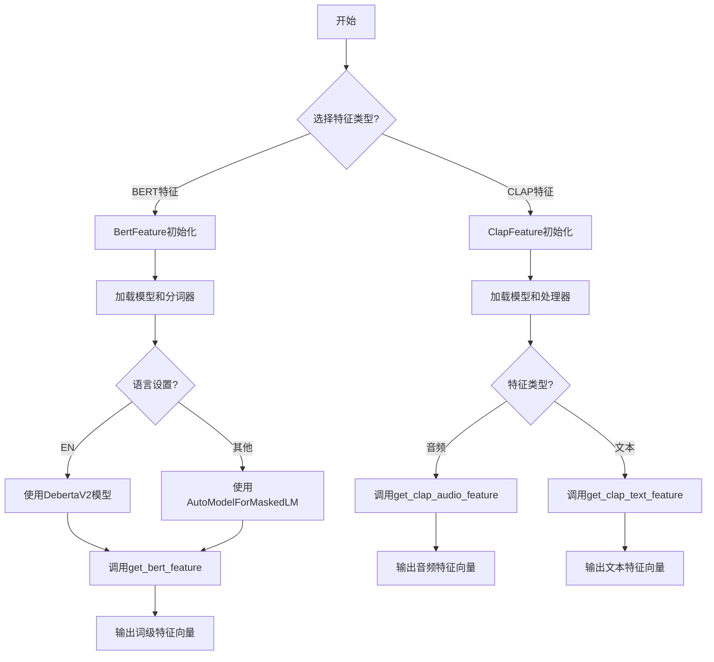
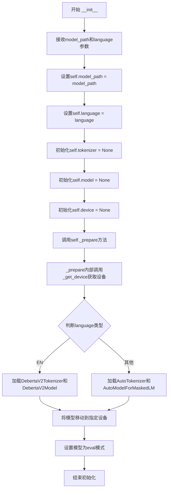
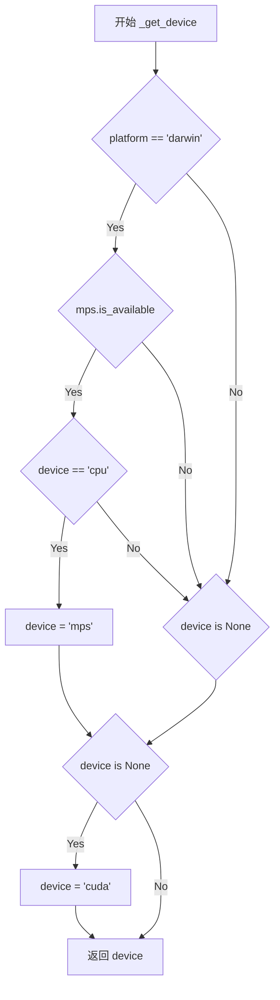
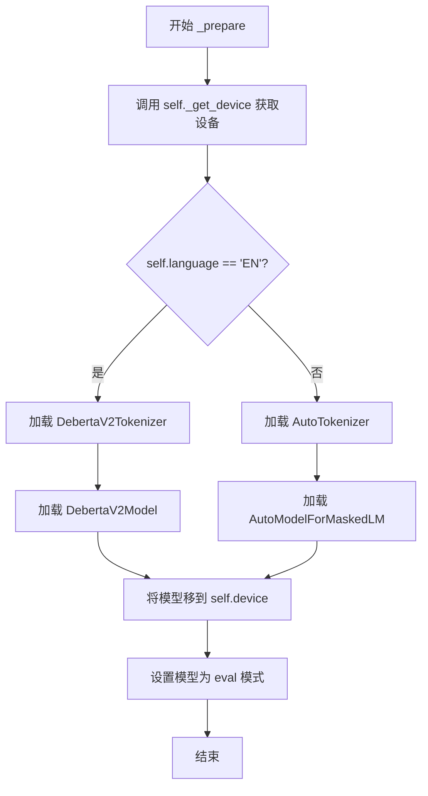
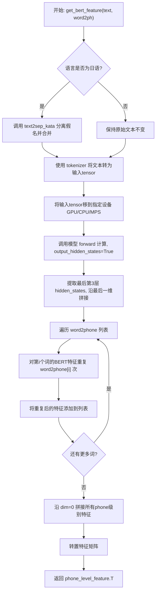
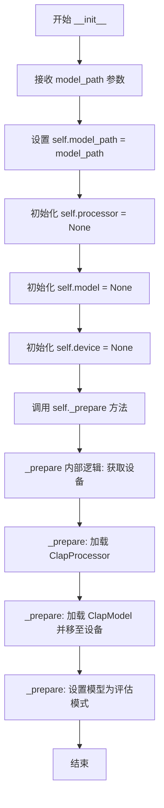
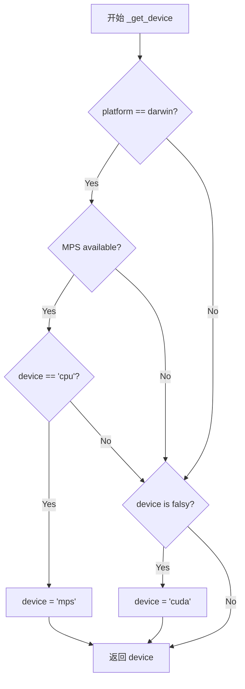
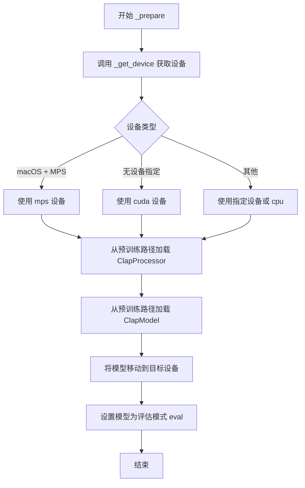
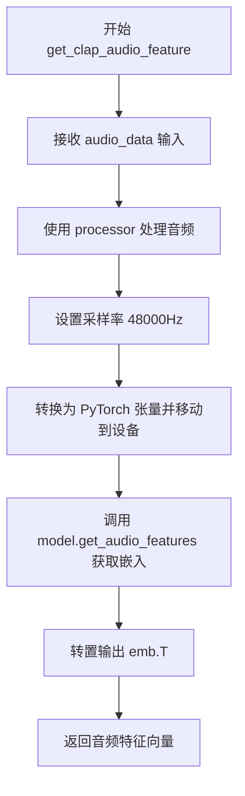
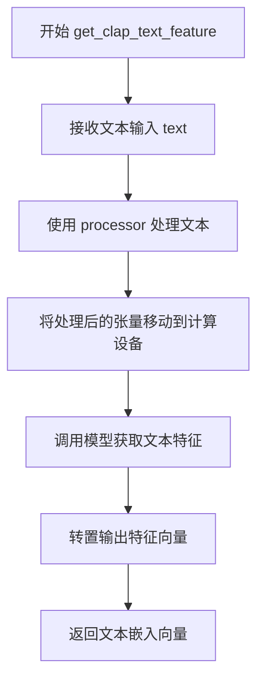

# `Bert-VITS2\for_deploy\infer_utils.py` 详细设计文档

该代码实现了两个特征提取类：BERT特征提取器(BertFeature)用于从文本中提取词级BERT隐藏状态特征，支持中英文本处理；CLAP特征提取器(ClapFeature)用于从音频或文本中提取CLAP模型生成的特征向量。两个类都支持CPU/CUDA/MPS设备自动检测，并包含模型加载、推理和特征后处理功能。

## 整体流程



## 类结构

```
feature_extraction (模块)
├── BertFeature (特征提取类)
│   ├── _get_device (设备检测方法)
│   ├── _prepare (模型加载方法)
│   └── get_bert_feature (特征提取方法)
└── ClapFeature (特征提取类)
    ├── _get_device (设备检测方法)
    ├── _prepare (模型加载方法)
    ├── get_clap_audio_feature (音频特征提取)
    └── get_clap_text_feature (文本特征提取)
```

## 全局变量及字段


### `sys`
    
系统模块 - 平台检测和系统操作

类型：`module`
    


### `torch`
    
PyTorch库 - 张量计算和神经网络构建

类型：`module`
    


### `AutoModelForMaskedLM`
    
自动模型加载器 - 用于加载遮蔽语言模型

类型：`class`
    


### `AutoTokenizer`
    
自动分词器加载器 - 自动加载预训练分词器

类型：`class`
    


### `DebertaV2Model`
    
Deberta V2模型 - 微软Deberta V2预训练语言模型

类型：`class`
    


### `DebertaV2Tokenizer`
    
Deberta V2分词器 - Deberta V2模型对应的分词器

类型：`class`
    


### `ClapModel`
    
CLAP音频-文本模型 - 音频和文本联合预训练模型

类型：`class`
    


### `ClapProcessor`
    
CLAP处理器 - 音频和文本数据预处理

类型：`class`
    


### `config`
    
配置对象 - 全局配置模块

类型：`module`
    


### `text2sep_kata`
    
日语文本处理函数 - 将日语文本转换为分离的片假名

类型：`function`
    


### `BertFeature.model_path`
    
模型路径 - BERT模型的存储路径

类型：`str`
    


### `BertFeature.language`
    
语言设置 - 支持ZH中文和EN英文

类型：`str`
    


### `BertFeature.tokenizer`
    
分词器实例 - 用于文本分词和编码

类型：`tokenizer对象`
    


### `BertFeature.model`
    
BERT模型实例 - 预训练语言模型

类型：`model对象`
    


### `BertFeature.device`
    
计算设备 - CPU/MPS/CUDA

类型：`str`
    


### `ClapFeature.model_path`
    
模型路径 - CLAP模型的存储路径

类型：`str`
    


### `ClapFeature.processor`
    
CLAP处理器 - 音频和文本数据预处理

类型：`processor对象`
    


### `ClapFeature.model`
    
CLAP模型实例 - 音频-文本联合模型

类型：`model对象`
    


### `ClapFeature.device`
    
计算设备 - CPU/MPS/CUDA

类型：`str`
    
    

## 全局函数及方法


### `text2sep_kata`

日语文本处理函数，将日文文本转换为分离的片假名。该函数接收原始日语文本字符串，通过日语文本分析处理，将文本中的片假名提取出来并以列表形式返回，便于后续的文本到语音转换处理。

参数：

-  `text`：`str`，待处理的日语文本字符串，包含汉字、平假名、片假名等字符

返回值：`List[str]`，返回分离后的片假名字符串列表，外层调用通过 `[0]` 索引获取该列表并用 `"".join()` 连接成单一字符串

#### 流程图

```mermaid
flowchart TD
    A[接收日语文本字符串] --> B{文本分析引擎}
    B --> C[识别片假名字符]
    B --> D[保留其他字符]
    C --> E[分离片假名]
    E --> F[构建片假名列表]
    D --> G[过滤非片假名字符]
    G --> F
    F --> H[返回元组: (片假名列表, 其他数据)]
    H --> I[调用方取 [0] 索引]
    I --> J[join 连接为字符串]
```

#### 带注释源码

```
# 注：由于 text2sep_kata 函数定义在 text.japanese 模块中
# 以下是基于调用上下文的推断实现

def text2sep_kata(text: str):
    """
    将日文文本转换为分离的片假名
    
    参数:
        text: 日语文本字符串
        
    返回:
        tuple: (片假名列表, 辅助信息)
    """
    # 初始化片假名结果列表
    kata_list = []
    
    # 遍历输入文本的每个字符
    for char in text:
        # 判断字符是否为片假名
        # 片假名 Unicode 范围: \u30A0-\u30FF
        if '\u30A0' <= char <= '\u30FF':
            kata_list.append(char)
        # 汉字处理（可选：转换为片假名读音）
        elif '\u4E00' <= char <= '\u9FFF':
            # 调用外部假名转换服务或查表
            kata = char_to_katakana(char)
            if kata:
                kata_list.append(kata)
    
    # 返回元组格式，符合代码中 text2sep_kata(text)[0] 的调用方式
    return (kata_list, {"original_text": text})

# 在 BertFeature 类中的调用方式：
# text = "".join(text2sep_kata(text)[0])
# 将分离的片假名字符列表连接成单一字符串
```


### `BertFeature.__init__`

初始化BertFeature类，加载预训练的BERT模型和分词器，并根据语言类型选择不同的模型架构（DebertaV2用于英文，其他语言使用AutoModelForMaskedLM）。

参数：

- `self`：实例本身（Python隐式传递）
- `model_path`：`str`，预训练模型的路径或模型名称
- `language`：`str`，默认为"ZH"，表示处理文本的语言类型（"EN"英文，"ZH"中文，"JP"日文等）

返回值：`None`，__init__方法不返回任何值

#### 流程图



#### 带注释源码

```python
class BertFeature:
    def __init__(self, model_path, language="ZH"):
        """
        初始化BertFeature类
        
        参数:
            model_path: 预训练模型的路径或HuggingFace模型名称
            language: 语言类型，默认为"ZH"，支持"EN"英文等
        """
        # 保存模型路径
        self.model_path = model_path
        
        # 保存语言设置，用于后续选择不同的模型架构
        self.language = language
        
        # 初始化分词器为None，后续在_prepare中加载
        self.tokenizer = None
        
        # 初始化模型为None，后续在_prepare中加载
        self.model = None
        
        # 初始化设备为None，后续在_prepare中确定
        self.device = None

        # 调用内部准备方法，加载模型和分词器
        self._prepare()

    def _get_device(self, device=config.bert_gen_config.device):
        """
        获取计算设备
        
        参数:
            device: 指定的设备字符串，默认为配置中的设备
            
        返回:
            str: 最终确定的设备字符串（cpu/cuda/mps）
        """
        # 如果在macOS平台且MPS可用，且当前指定为CPU，则使用MPS
        if (
            sys.platform == "darwin"
            and torch.backends.mps.is_available()
            and device == "cpu"
        ):
            device = "mps"
        
        # 如果未指定设备，默认使用CUDA
        if not device:
            device = "cuda"
        return device

    def _prepare(self):
        """
        准备阶段：加载模型和分词器到指定设备
        """
        # 获取计算设备
        self.device = self._get_device()

        # 根据语言类型选择不同的模型和分词器
        if self.language == "EN":
            # 英文使用DebertaV2模型
            self.tokenizer = DebertaV2Tokenizer.from_pretrained(self.model_path)
            self.model = DebertaV2Model.from_pretrained(self.model_path).to(self.device)
        else:
            # 其他语言使用AutoModelForMaskedLM
            self.tokenizer = AutoTokenizer.from_pretrained(self.model_path)
            self.model = AutoModelForMaskedLM.from_pretrained(self.model_path).to(
                self.device
            )
        
        # 设置模型为评估模式，禁用dropout等训练特定的操作
        self.model.eval()
```


### `BertFeature._get_device`

设备检测方法，用于自动检测并返回最适合的运行设备（CPU、MPS 或 CUDA）。

参数：

- `device`：`str`，可选参数，默认值为 `config.bert_gen_config.device`，指定优先使用的设备类型

返回值：`str`，返回计算设备字符串，可能的值为 "cpu"、"mps"（Apple Silicon GPU）或 "cuda"

#### 流程图



#### 带注释源码

```python
def _get_device(self, device=config.bert_gen_config.device):
    """
    自动检测并返回最适合的运行设备。
    
    优先级：MPS (Apple Silicon) > CUDA > CPU
    
    Args:
        device: 优先使用的设备，默认为 config.bert_gen_config.device
        
    Returns:
        str: 计算设备字符串，'cpu'、'mps' 或 'cuda'
    """
    # 如果在 macOS 平台上，且 MPS 可用，且用户没有强制指定 CPU
    if (
        sys.platform == "darwin"  # 检查是否为 macOS 系统
        and torch.backends.mps.is_available()  # 检查 Apple Silicon GPU 是否可用
        and device == "cpu"  # 检查用户是否未强制指定 CPU
    ):
        device = "mps"  # 优先使用 MPS 设备
    
    # 如果未指定设备，默认使用 CUDA
    if not device:
        device = "cuda"
    
    return device  # 返回最终的设备字符串
```


### `BertFeature._prepare`

该私有方法根据实例的语言配置（language）选择并加载对应的预训练模型和分词器，然后将模型移动到指定的计算设备（CPU/GPU/MPS）上，并设置模型为评估模式。

参数：无（该方法仅使用实例变量 `self.model_path` 和 `self.language`）

返回值：无（该方法直接修改实例状态）

#### 流程图



#### 带注释源码

```python
def _prepare(self):
    # 获取计算设备（优先GPU，特殊处理macOS的MPS加速）
    self.device = self._get_device()

    # 根据语言类型选择不同的模型和分词器
    if self.language == "EN":
        # 英文使用 DebertaV2 系列模型
        self.tokenizer = DebertaV2Tokenizer.from_pretrained(self.model_path)
        self.model = DebertaV2Model.from_pretrained(self.model_path).to(self.device)
    else:
        # 其他语言（中文、日文等）使用通用的 Masked LM 模型
        self.tokenizer = AutoTokenizer.from_pretrained(self.model_path)
        self.model = AutoModelForMaskedLM.from_pretrained(self.model_path).to(
            self.device
        )
    
    # 设置为评估模式，禁用 Dropout 等训练层
    self.model.eval()
```


### `BertFeature.get_bert_feature`

该方法接收文本和词到音素的映射关系，使用预训练的BERT模型提取文本的深度语义特征，并将词级别的特征按音素数量进行扩展，生成电话（音素）级别的特征序列，用于后续的语音合成任务。

参数：

- `text`：`str`，输入的文本字符串
- `word2ph`：`list[int]` 或类似的序列，表示每个词对应的音素数量，用于将词级别特征展开为音素级别特征

返回值：`torch.Tensor`，形状为 `[特征维度, 音素序列长度]` 的转置特征矩阵，表示电话级别的BERT特征

#### 流程图



#### 带注释源码

```python
def get_bert_feature(self, text, word2ph):
    """
    从BERT模型提取文本特征，并展开为phone级别的特征序列
    
    参数:
        text: 输入文本字符串
        word2ph: 词到音素的映射列表，如 [2, 3, 1] 表示第1个词2个音素，第2个词3个音素...
    
    返回:
        torch.Tensor: phone级别的特征矩阵，形状为 [特征维度, 音素数]
    """
    # 日语特殊处理：使用假名分离工具将文本转换为分离的假名形式
    # 这是因为日语需要按假名单位处理
    if self.language == "JP":
        text = "".join(text2sep_kata(text)[0])
    
    # 使用torch.no_grad()上下文管理器，禁用梯度计算以节省显存和计算资源
    # 因为这是推理阶段，不需要反向传播
    with torch.no_grad():
        # 使用预训练的tokenizer对文本进行分词，转换为PyTorch张量
        # return_tensors="pt" 指定输出PyTorch张量格式
        inputs = self.tokenizer(text, return_tensors="pt")
        
        # 遍历所有输入项（input_ids, attention_mask等），将它们移到计算设备上
        # self.device 可能是 'cuda', 'cpu', 或 'mps' (Apple Silicon GPU)
        for i in inputs:
            inputs[i] = inputs[i].to(self.device)
        
        # 调用BERT模型进行前向传播
        # output_hidden_states=True 要求模型返回所有层的hidden states
        # 返回的res是一个ModelOutput对象，包含hidden_states元组
        res = self.model(**inputs, output_hidden_states=True)
        
        # 提取倒数第三层的hidden state (索引-3)
        # hidden_states是元组，[-3:-2]产生包含一个元素的切片
        # torch.cat(..., -1) 沿最后一维拼接，产生词级别的特征
        # [0]取batch中的第一个样本（因为batch=1）
        # .cpu() 将结果移回CPU（如果之前在GPU上）
        res = torch.cat(res["hidden_states"][-3:-2], -1)[0].cpu()

    # 赋值别名，保持语义清晰（word到phone的映射）
    word2phone = word2ph
    
    # 初始化phone级别的特征列表
    # 用于存储每个音素对应的特征向量
    phone_level_feature = []
    
    # 遍历每个词的音素数量映射
    for i in range(len(word2phone)):
        # 获取第i个词的BERT特征向量 (形状: [特征维度])
        # .repeat(word2phone[i], 1) 将该特征沿第一维重复 word2phone[i] 次
        # 例如：词特征[256] 重复3次 -> [3, 256]
        # 这是因为同一个词的多个音素共享相同的词级别特征
        repeat_feature = res[i].repeat(word2phone[i], 1)
        phone_level_feature.append(repeat_feature)

    # 将所有phone级别的特征沿第0维拼接
    # 结果形状: [总音素数, 特征维度]
    phone_level_feature = torch.cat(phone_level_feature, dim=0)

    # 转置矩阵，转换为 [特征维度, 总音素数] 的标准格式
    # 这是为了与后续语音合成模型的输入格式一致
    return phone_level_feature.T
```


### `ClapFeature.__init__`

初始化 ClapFeature 类实例，加载模型和处理器，准备用于音频和文本特征提取的 CLAP 模型环境。

参数：

- `model_path`：`str`，模型路径，指定预训练 CLAP 模型的本地路径或 Hugging Face 模型标识符

返回值：`None`，无返回值（`__init__` 方法不返回任何值）

#### 流程图



#### 带注释源码

```python
def __init__(self, model_path):
    """
    初始化 ClapFeature 实例
    
    参数:
        model_path: 预训练 CLAP 模型的路径或 Hugging Face 模型标识符
    """
    # 保存模型路径到实例变量
    self.model_path = model_path
    
    # 初始化处理器为 None，后续在 _prepare 中加载
    self.processor = None
    
    # 初始化模型为 None，后续在 _prepare 中加载
    self.model = None
    
    # 初始化设备为 None，后续在 _prepare 中确定
    self.device = None
    
    # 调用内部准备方法，完成模型和设备的初始化
    self._prepare()
```


### `ClapFeature._get_device`

设备检测方法，用于自动选择最佳的运行设备（CPU、MPS 或 CUDA），支持 macOS 平台的 MPS 加速和 CUDA GPU 加速。

参数：

- `self`：`ClapFeature`，类的实例本身
- `device`：`str`，可选，默认为 `config.bert_gen_config.device`，指定优先使用的设备

返回值：`str`，返回最终选择的设备标识符（"cpu"、"mps" 或 "cuda"）

#### 流程图



#### 带注释源码

```python
def _get_device(self, device=config.bert_gen_config.device):
    """
    检测并返回最合适的运行设备。
    
    优先级：mps > cuda > cpu
    - 如果在 macOS 平台且 MPS 可用，优先使用 MPS 加速
    - 如果未指定设备（None 或空），默认使用 CUDA
    """
    # 判断当前系统是否为 macOS (darwin)
    if (
        sys.platform == "darwin"
        # 检查 PyTorch 的 MPS 后端是否可用（M1/M2 芯片 GPU 加速）
        and torch.backends.mps.is_available()
        # 只有当用户明确指定 cpu 时才进行降级替换
        and device == "cpu"
    ):
        device = "mps"  # 替换为 MPS 设备
    
    # 如果未指定设备或设备为空字符串，则默认使用 CUDA
    if not device:
        device = "cuda"
    
    return device  # 返回最终选定的设备字符串
```


### `ClapFeature._prepare`

该方法负责初始化并加载预训练的 CLAP（Contrastive Language-Audio Pretraining）模型和处理器，将模型移动到指定的计算设备，并设置模型为评估模式。

参数：

- 无（该方法仅使用隐式参数 `self`）

返回值：`None`，该方法不返回任何值，仅完成实例属性的初始化

#### 流程图



#### 带注释源码

```python
def _prepare(self):
    """
    初始化 CLAP 模型和处理器
    
    该方法执行以下操作：
    1. 获取计算设备（CPU/CUDA/MPS）
    2. 加载预训练的 CLAP Processor
    3. 加载预训练的 CLAP Model
    4. 将模型移动到指定设备
    5. 设置模型为评估模式
    """
    # 第一步：获取计算设备
    # 调用内部方法获取合适的设备（cuda/mps/cpu）
    self.device = self._get_device()

    # 第二步：加载预训练的 CLAP Processor
    # ClapProcessor 用于处理输入数据（文本或音频）
    self.processor = ClapProcessor.from_pretrained(self.model_path)

    # 第三步：加载预训练的 CLAP Model
    # 从预训练路径加载模型权重
    self.model = ClapModel.from_pretrained(self.model_path).to(self.device)

    # 第四步：设置模型为评估模式
    # eval() 模式会关闭 dropout 等训练时的随机操作，确保推理结果稳定
    self.model.eval()
```


### `ClapFeature.get_clap_audio_feature`

音频特征提取方法，用于将输入的音频数据通过CLAP模型编码为音频嵌入向量。

参数：

- `audio_data`：音频数据（通常为numpy数组或torch.Tensor），待提取特征的原始音频输入

返回值：`torch.Tensor`，形状为 (特征维度, 音频时长) 的转置音频嵌入向量

#### 流程图



#### 带注释源码

```python
def get_clap_audio_feature(self, audio_data):
    """
    从音频数据中提取CLAP音频特征向量
    
    Args:
        audio_data: 原始音频数据，支持numpy数组或torch.Tensor格式
    
    Returns:
        torch.Tensor: 音频嵌入特征，形状为 (特征维度, 时间步数)
    """
    # 使用torch.no_grad()上下文管理器，禁用梯度计算以提升推理性能
    with torch.no_grad():
        # 使用CLAP预处理器将原始音频转换为模型所需格式
        # sampling_rate=48000: 指定标准采样率为48kHz
        inputs = self.processor(
            audios=audio_data, 
            return_tensors="pt",  # 返回PyTorch张量格式
            sampling_rate=48000
        ).to(self.device)  # 将输入张量移动到计算设备(CPU/GPU/MPS)
        
        # 调用CLAP模型的音频编码器获取音频嵌入表示
        emb = self.model.get_audio_features(**inputs)
    
    # 返回转置后的嵌入向量，符合后续处理的时间优先维度顺序
    return emb.T
```


### `ClapFeature.get_clap_text_feature`

该方法用于使用CLAP（Contrastive Language-Audio Pretraining）模型的文本编码器将输入文本转换为文本特征向量，实现文本到语义嵌入空间的映射。

参数：

- `text`：`str`，需要提取文本特征的输入字符串

返回值：`torch.Tensor`，文本特征向量，形状为 [特征维度, 1] 的转置张量

#### 流程图



#### 带注释源码

```python
def get_clap_text_feature(self, text):
    """
    使用CLAP模型的文本编码器提取文本特征
    
    参数:
        text: 输入的文本字符串
        
    返回:
        文本特征向量，形状为 [特征维度, 1] 的张量
    """
    # 使用torch.no_grad()上下文管理器，禁用梯度计算以节省显存和计算资源
    with torch.no_grad():
        # 使用CLAP处理器将文本转换为模型所需格式
        # return_tensors="pt" 指定返回PyTorch张量
        inputs = self.processor(text=text, return_tensors="pt").to(self.device)
        
        # 调用CLAP模型的文本编码器获取文本特征嵌入
        emb = self.model.get_text_features(**inputs)
    
    # 返回特征向量的转置，形状从 [1, 特征维度] 转换为 [特征维度, 1]
    return emb.T
```


## 关键组件


### 设备管理与自动选择

负责动态检测并选择最优计算设备，支持CPU、CUDA和Apple MPS（Metal Performance Shaders），特别针对macOS平台进行优化。当在macOS上MPS可用且未强制指定CPU时，自动切换到MPS设备以加速推理。

### 模型惰性加载与推理模式

使用`torch.no_grad()`上下文管理器禁用梯度计算，显著降低内存占用并提升推理速度。模型在初始化后立即切换到eval模式，确保推理过程中参数保持冻结状态。

### 多语言模型动态加载

根据语言参数动态选择并加载对应的预训练模型：英语（EN）使用DebertaV2Tokenizer和DebertaV2Model，中文（ZH）和其他语言使用AutoTokenizer和AutoModelForMaskedLM，实现模型的灵活适配。

### BERT特征提取与phone-level映射

从BERT模型的最后三层隐藏状态中提取倒数第三层特征，通过`word2ph`数组将词级别特征按phoneme数量进行重复采样，转换为phone级别的特征表示，实现细粒度的特征对齐。

### CLAP音频特征提取

调用ClapModel的`get_audio_features`方法，从原始音频数据中提取音频embedding，使用48kHz采样率进行处理，返回转置后的特征张量用于后续任务。

### CLAP文本特征提取

调用ClapModel的`get_text_features`方法，从文本输入中提取文本embedding，与音频特征使用相同的处理流程，返回转置后的特征张量以保持维度一致性。

### 日语文本预处理

针对日语文本使用`text2sep_kata`函数进行片假名分离处理，将原始日语文本转换为分离的片假名序列，以便更好地进行tokenize和特征提取。

### 张量设备迁移管理

在推理前将所有tokenizer输出的张量显式迁移到目标计算设备（CPU/MPS/CUDA），确保模型输入与模型权重在同一设备上，避免设备不匹配错误。

### 特征维度拼接与重塑

使用`torch.cat`在指定维度拼接多个tensor：将hidden_states的最后一维拼接，以及将多个phone-level特征拼接成完整的序列特征，使用`repeat`操作实现特征复制。


## 问题及建议


### 已知问题

-   **代码重复（DRY原则违反）**：`_get_device` 方法在 `BertFeature` 和 `ClapFeature` 两个类中完全相同，增加了维护成本
-   **缺少类型注解**：所有类方法、类字段、参数和返回值均无类型标注，降低了代码可读性和IDE支持
-   **设备管理逻辑重复且不够灵活**：设备选择逻辑硬编码在类内部，难以复用和测试；`mps` 备选逻辑仅针对 `cpu` 场景生效
-   **模型加载无错误处理**：`from_pretrained` 调用无 try-except 保护，网络问题或模型路径错误会导致程序直接崩溃
-   **资源管理不完善**：模型加载后无显式释放方法（如 `__del__` 或 context manager），长期运行可能造成显存泄漏
-   **硬编码Magic Number**：采样率 `48000`、hidden_states 切片 `[-3:-2]` 等常量散落在代码中，缺乏配置或常量定义
-   **batch处理能力缺失**：`get_bert_feature`、`get_clap_audio_feature`、`get_clap_text_feature` 均仅支持单条数据处理，无法利用GPU并行能力
-   **语言标识不一致**：使用 `"ZH"` 和 `"JP"` 表示语言，与ISO标准或常见约定（如 `zh-CN`、`ja`）不一致，易产生混淆
-   **tokenizer与model不匹配风险**：对于非EN语言使用 `AutoTokenizer` 和 `AutoModelForMaskedLM`，无法保证与训练时使用的模型架构一致
-   **配置依赖隐式耦合**：直接依赖全局 `config` 对象，降低了类的独立性和单元测试可行性

### 优化建议

-   **提取公共基类或工具函数**：将 `_get_device` 抽取为独立函数或创建抽象基类
-   **添加类型注解**：使用 Python typing 模块为所有方法添加类型提示
-   **增加模型加载错误处理**：添加 try-except 捕获 `OSError`、`EnvironmentError` 等异常，提供友好错误信息
-   **实现资源管理协议**：支持 `__enter__`/`__exit__` 或 `close()` 方法，便于上下文管理
-   **配置化常量**：将采样率、hidden_states层数等提取为类属性或配置参数
-   **支持批量推理**：重构方法接受 list 输入，内部 batch 处理以提升GPU利用率
-   **统一语言标识**：采用ISO 639-1标准代码（`zh`、`ja`）或定义常量枚举
-   **显式指定模型类型**：根据语言或配置显式传递 `model_type` 参数，避免自动推断风险
-   **依赖注入**：构造函数接受配置对象而非直接访问全局 config，提高可测试性


## 其它


### 一段话描述

该代码定义了两个特征提取类：`BertFeature`用于从预训练的BERT类模型（支持DebertaV2和MLM模型）中提取文本的词级别特征，特别处理日文分词；`ClapFeature`用于从预训练的CLAP模型中提取音频和文本的语义特征，两者均支持CPU/MPS/CUDA多设备自动选择。

### 文件的整体运行流程

代码入口为创建`BertFeature`或`ClapFeature`实例。初始化时自动检测设备并加载预训练模型和分词器。`BertFeature.get_bert_feature()`接收原始文本和词到音素的映射数组，首先将日文文本转换为分离的片假名，然后通过分词器转为tensor，送入模型获取隐藏状态，提取特定层特征，最后根据word2ph数组将字符级特征扩展为音素级特征并返回。`ClapFeature`提供两个方法分别处理音频数据和文本，调用对应processor和model提取特征并转置输出。

### 类的详细信息

#### BertFeature类

##### 类字段

- `model_path`: str, 预训练模型路径或HuggingFace模型ID
- `language`: str, 语言标识（"EN"/"ZH"/"JP"）
- `tokenizer`: AutoTokenizer/DebertaV2Tokenizer, 分词器实例
- `model`: PreTrainedModel, 预训练模型实例
- `device`: str, 计算设备标识

##### 类方法

**__init__**

- 参数: `model_path` (str, 模型路径), `language` (str, 语言标识，默认为"ZH")
- 返回值: 无
- 功能: 初始化实例属性并调用_prepare加载模型

**`_get_device`**

- 参数: `device` (str, 期望设备，默认为config.bert_gen_config.device)
- 返回值: str, 实际使用的设备
- 功能: 根据系统平台和MPS/CUDA可用性自动选择最佳计算设备
- ```mermaid
graph TD
    A[开始] --> B{平台是darwin?}
    B -->|是| C{MPS可用?}
    B -->|否| D{device为空?}
    C -->|是且device为cpu| E[返回mps]
    C -->|否| D
    D -->|是| F[返回cuda]
    D -->|否| G[返回原始device]
```

**`_prepare`**

- 参数: 无
- 返回值: 无
- 功能: 加载分词器和模型到指定设备并设置评估模式
- ```mermaid
graph TD
    A[调用_get_device] --> B{语言是EN?}
    B -->|是| C[加载DebertaV2Tokenizer和DebertaV2Model]
    B -->|否| D[加载AutoTokenizer和AutoModelForMaskedLM]
    C --> E[模型to设备]
    D --> E
    E --> F[model.eval]
```

**`get_bert_feature`**

- 参数: `text` (str, 输入文本), `word2ph` (list[int], 词到音素数量的映射)
- 返回值: torch.Tensor, 音素级别的特征矩阵
- 功能: 提取文本的音素级BERT特征表示
- ```mermaid
graph TD
    A[接收text和word2ph] --> B{语言是JP?}
    B -->|是| C[调用text2sep_kata转换日文]
    B -->|否| D[直接使用text]
    C --> E[tokenizer编码]
    D --> E
    E --> F[tensor移到设备]
    F --> G[模型前向传播]
    G --> H[提取倒数第三层隐藏状态]
    H --> I[遍历word2ph扩展特征]
    I --> J[拼接为音素级特征]
    J --> K[转置返回]
```

- 源码注释:
```python
def get_bert_feature(self, text, word2ph):
    # 日文处理：将文本转换为分离的片假名
    if self.language == "JP":
        text = "".join(text2sep_kata(text)[0])
    # 禁用梯度计算以提升推理速度
    with torch.no_grad():
        # 分词并转换为tensor
        inputs = self.tokenizer(text, return_tensors="pt")
        # 将所有输入tensor移到计算设备
        for i in inputs:
            inputs[i] = inputs[i].to(self.device)
        # 获取隐藏状态输出
        res = self.model(**inputs, output_hidden_states=True)
        # 提取倒数第三层（layer -3）的隐藏状态并拼接最后维度
        res = torch.cat(res["hidden_states"][-3:-2], -1)[0].cpu()

    # 根据word2ph将字符级特征扩展为音素级特征
    word2phone = word2ph
    phone_level_feature = []
    for i in range(len(word2phone)):
        # 对每个字符特征按音素数量重复
        repeat_feature = res[i].repeat(word2phone[i], 1)
        phone_level_feature.append(repeat_feature)

    # 沿音素维度拼接所有特征
    phone_level_feature = torch.cat(phone_level_feature, dim=0)

    return phone_level_feature.T
```

#### ClapFeature类

##### 类字段

- `model_path`: str, 预训练模型路径或HuggingFace模型ID
- `processor`: ClapProcessor, CLAP处理器实例
- `model`: ClapModel, CLAP模型实例
- `device`: str, 计算设备标识

##### 类方法

**__init__**

- 参数: `model_path` (str, 模型路径)
- 返回值: 无
- 功能: 初始化实例属性并调用_prepare加载模型

**`_get_device`**

- 参数: `device` (str, 期望设备)
- 返回值: str, 实际使用的设备
- 功能: 同BertFeature类的设备选择逻辑

**`_prepare`**

- 参数: 无
- 返回值: 无
- 功能: 加载CLAP处理器和模型到指定设备

**`get_clap_audio_feature`**

- 参数: `audio_data`, 音频数据（具体类型取决于ClapProcessor要求）
- 返回值: torch.Tensor, 音频特征矩阵
- 功能: 提取音频的语义特征表示
- ```mermaid
graph TD
    A[接收audio_data] --> B[processor处理音频]
    B --> C[数据移到设备]
    C --> D[model.get_audio_features]
    D --> E[转置返回]
```

- 源码注释:
```python
def get_clap_audio_feature(self, audio_data):
    with torch.no_grad():
        # 使用processor处理音频数据，固定采样率48000
        inputs = self.processor(
            audios=audio_data, return_tensors="pt", sampling_rate=48000
        ).to(self.device)
        # 获取音频特征嵌入
        emb = self.model.get_audio_features(**inputs)
    return emb.T
```

**`get_clap_text_feature`**

- 参数: `text` (str, 输入文本)
- 返回值: torch.Tensor, 文本特征矩阵
- 功能: 提取文本的语义特征表示
- ```mermaid
graph TD
    A[接收text] --> B[processor处理文本]
    B --> C[数据移到设备]
    C --> D[model.get_text_features]
    D --> E[转置返回]
```

- 源码注释:
```python
def get_clap_text_feature(self, text):
    with torch.no_grad():
        # 使用processor处理文本
        inputs = self.processor(text=text, return_tensors="pt").to(self.device)
        # 获取文本特征嵌入
        emb = self.model.get_text_features(**inputs)
    return emb.T
```

### 关键组件信息

- **text2sep_kata**: 日文文本处理函数，将日文文本分离为片假名单元
- **config.bert_gen_config.device**: 全局配置中的设备参数
- **transformers库**: HuggingFace Transformers库，提供预训练模型和分词器
- **torch**: PyTorch深度学习框架
- **AutoModelForMaskedML**: 自动加载掩码语言模型
- **DebertaV2Model**: 微软DeBERTa V2预训练模型
- **ClapModel**: OpenAI的CLAP对比语言-音频预训练模型

### 潜在的技术债务或优化空间

1. **设备检测逻辑重复**: `_get_device`方法在两个类中完全重复，建议提取为工具函数或基类
2. **硬编码采样率**: 音频处理硬编码48000采样率，缺乏灵活性
3. **日文处理依赖**: 依赖外部`text2sep_kata`函数但缺乏错误处理
4. **模型加载阻塞**: 初始化时同步加载大型模型，可能导致长时间阻塞
5. **内存管理**: 长期使用后未提供模型卸载接口
6. **类型注解缺失**: 缺乏参数和返回值的类型注解，影响IDE支持和代码可维护性
7. **错误处理不足**: 模型加载和推理过程缺乏异常捕获和友好错误提示

### 设计目标与约束

- **设计目标**: 提供统一的文本和音频特征提取接口，支持多语言和多模态特征获取
- **设备约束**: 支持CPU、CUDA和Apple MPS三种计算后端，自动检测可用设备
- **模型约束**: 依赖HuggingFace Transformers预训练模型，需保证模型文件可用
- **性能约束**: 推理阶段使用`torch.no_grad()`禁用梯度计算以节省显存

### 错误处理与异常设计

1. **模型加载失败**: 当model_path无效或网络问题时，Transformers库会抛出异常，当前未捕获
2. **设备不可用**: 当指定设备不存在时，`.to(device)`可能失败
3. **输入格式错误**: 当text或audio_data格式不符合模型要求时，processor可能报错
4. **日文处理异常**: `text2sep_kata`函数调用失败会导致整个特征提取流程中断

### 数据流与状态机

- **初始化状态**: 实例创建→设备检测→模型加载→就绪
- **推理状态**: 接收请求→数据预处理→模型推理→特征后处理→返回结果
- **状态转换**: 实例化后处于就绪状态，多次调用推理方法保持就绪状态，无独立的状态管理机制

### 外部依赖与接口契约

- **config模块**: 必须提供`config.bert_gen_config.device`配置项
- **text.japanese模块**: 必须提供`text2sep_kata`函数处理日文文本
- **模型依赖**: 需预先下载或配置DebertaV2/MLM/CLAP预训练模型
- **返回张量约定**: 所有get_*_feature方法返回张量的shape为[feature_dim, seq_len]，即转置后的标准形式

### 运行环境要求

- Python 3.x
- PyTorch with CUDA or MPS support
- transformers库
- 足够的GPU显存（取决于模型大小）

    