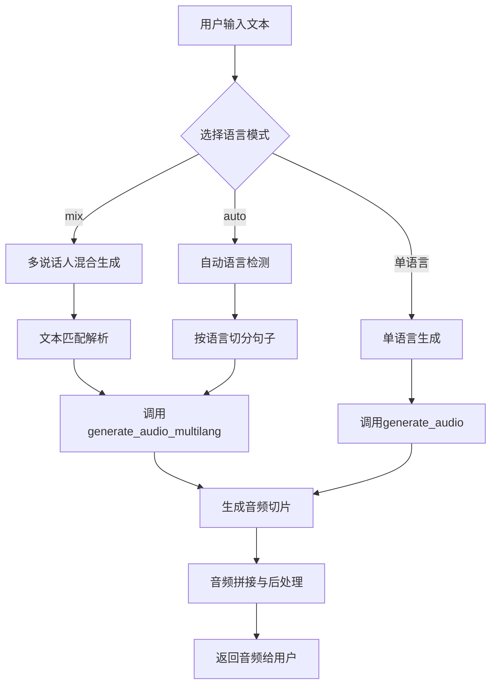
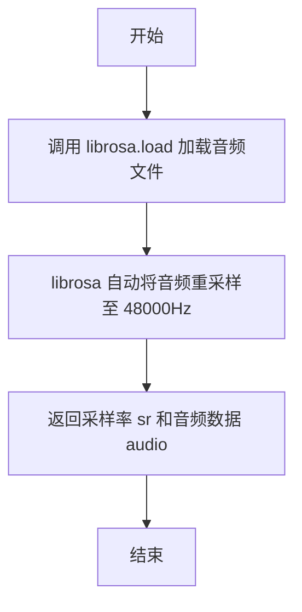
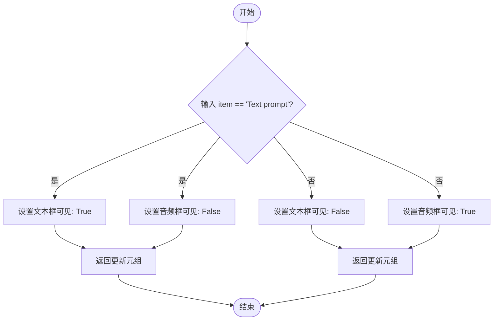

# `Bert-VITS2\for_deploy\webui.py` 详细设计文档

这是一个基于Gradio的文本到语音(TTS) Web应用界面，通过深度学习模型（VITS）实现多语言、多说话人的语音合成，支持情感合成和音频提示功能。

## 整体流程



## 类结构

```
无显式类定义
└── 主要为模块级函数集合
    ├── generate_audio
    ├── generate_audio_multilang
    ├── tts_split
    ├── tts_fn
    ├── load_audio
    └── gr_util
```

## 全局变量及字段


### `net_g`
    
全局变量 - 语音合成模型实例,用于生成音频的神经网络模型对象

类型：`torch.nn.Module or None`
    


### `device`
    
全局变量 - 计算设备标识,指定模型运行在CPU/CUDA/MPS哪个设备上

类型：`str`
    


### `bert_feature_map`
    
全局变量 - BERT特征提取器字典,按语言(ZH/JP/EN)映射到对应的BertFeature对象用于提取文本语义特征

类型：`dict[str, BertFeature]`
    


### `clap_feature`
    
全局变量 - CLAP情感特征提取器,用于从参考音频中提取情感特征以控制生成语音的情感风格

类型：`ClapFeature`
    


### `hps`
    
局部变量 - 超参数配置对象,从配置文件加载的模型超参数和数据配置,包含模型结构、采样率、说话人映射等信息

类型：`HParams or namespace`
    


    

## 全局函数及方法


### `generate_audio`

该函数是VITS语音合成系统的核心推理函数，负责将输入的文本切片列表逐片进行推理，生成对应的音频片段。它通过遍历所有文本切片，调用`infer`函数进行单次推理，并使用Gradio的音频处理工具将输出转换为16位WAV格式，最终返回合并的音频列表。

参数：

- `slices`：`List[str]`，待合成的文本切片列表，每个元素为一段待转语音的文本
- `sdp_ratio`：`float`，SDP（Stochastic Duration Predictor）比率，用于控制音素时长的随机性，值越大随机性越强
- `noise_scale`：`float`，噪声规模，控制音频生成过程中的噪声水平，影响音色多样性
- `noise_scale_w`：`float`，噪声权重，用于调节噪声在时长预测中的权重
- `length_scale`：`float`，长度缩放因子，用于调整生成音频的长度/语速
- `speaker`：`int`，说话人ID，用于指定目标说话人的音色
- `language`：`str`，语言代码（如"ZH"、"JP"、"EN"），指定文本的语言类型
- `reference_audio`：`Optional[str]`或`np.ndarray`，参考音频路径或数据，用于风格迁移和情感迁移
- `emotion`：`str`，情感标签（如"Happy"、"Sad"），用于控制生成音频的情感风格
- `skip_start`：`bool`，是否跳过片头静音，True则移除首片开头可能存在的静音段
- `skip_end`：`bool`，是否跳过片尾静音，True则移除末尾片结尾可能存在的静音段

返回值：`List[np.ndarray]`，返回16位PCM格式的音频数据列表，每个元素为一段切片对应的音频数组

#### 流程图

```mermaid
flowchart TD
    A[开始 generate_audio] --> B[初始化空音频列表 audio_list]
    B --> C[启用torch.no_grad禁用梯度计算]
    C --> D[遍历slices中的每个piece]
    D --> E{当前索引idx}
    E -->|idx=0| F[skip_start保持原值]
    E -->|idx>0| G[skip_start = 原skip_start and True]
    G --> H{idx != len(slices)-1}
    H -->|是最后一片| I[skip_end = False]
    H -->|不是最后一片| J[skip_end = 原skip_end and True]
    F --> K[调用infer函数生成音频]
    I --> K
    J --> K
    K --> L[调用gr.processing_utils.convert_to_16_bit_wav转换音频格式]
    L --> M[将转换后的音频添加到audio_list]
    M --> N{是否还有更多切片}
    N -->|是| D
    N -->|否| O[返回audio_list]
    O --> P[结束]
```

#### 带注释源码

```python
def generate_audio(
    slices,              # List[str]: 待合成的文本切片列表
    sdp_ratio,           # float: SDP比率，控制音素时长随机性
    noise_scale,         # float: 噪声规模，控制音色多样性
    noise_scale_w,       # float: 噪声权重，调节噪声在时长预测中的权重
    length_scale,        # float: 长度缩放因子，调整语速
    speaker,             # int: 说话人ID，指定目标音色
    language,            # str: 语言代码，指定文本语言类型
    reference_audio,     # Optional: 参考音频，用于风格迁移
    emotion,             # str: 情感标签，控制生成音频情感
    skip_start=False,    # bool: 是否跳过片头静音
    skip_end=False,      # bool: 是否跳过片尾静音
):
    audio_list = []  # 初始化空列表用于存储生成的音频片段
    # silence = np.zeros(hps.data.sampling_rate // 2, dtype=np.int16)  # 可选的静音段（已注释）
    
    # 使用torch.no_grad()上下文管理器禁用梯度计算，节省显存并加速推理
    with torch.no_grad():
        # 遍历所有文本切片，逐个进行推理
        for idx, piece in enumerate(slices):
            # 根据当前索引动态调整skip_start和skip_end
            # 除了第一片外，其他片通常需要跳过开头静音
            skip_start = (idx != 0) and skip_start
            # 除了最后一片外，其他片需要跳过结尾静音
            skip_end = (idx != len(slices) - 1) and skip_end
            
            # 调用infer函数进行单片音频推理
            audio = infer(
                piece,                   # 待合成的文本内容
                reference_audio=reference_audio,  # 参考音频
                emotion=emotion,         # 情感标签
                sdp_ratio=sdp_ratio,     # SDP比率
                noise_scale=noise_scale,        # 噪声规模
                noise_scale_w=noise_scale_w,    # 噪声权重
                length_scale=length_scale,      # 长度缩放
                sid=speaker,             # 说话人ID
                language=language,       # 语言代码
                hps=hps,                 # 超参数配置
                net_g=net_g,             # 生成器网络
                device=device,           # 计算设备
                skip_start=skip_start,   # 是否跳过片头
                skip_end=skip_end,       # 是否跳过片尾
                bert=bert_feature_map,  # BERT特征提取器映射
                clap=clap_feature,      # CLAP情感特征提取器
            )
            
            # 使用Gradio工具将音频转换为16位WAV格式
            audio16bit = gr.processing_utils.convert_to_16_bit_wav(audio)
            audio_list.append(audio16bit)  # 添加到音频列表
            # audio_list.append(silence)  # 可选：添加静音段（已注释）
    
    # 返回生成的音频列表
    return audio_list
```


### `generate_audio_multilang`

该函数用于根据输入的多语言文本切片列表生成对应的音频波形，支持不同切片使用不同的语言，通过调用 `infer_multilang` 推理函数逐片生成音频，并统一转换为16位PCM格式后返回音频列表。

参数：

- `slices`：`list`，要生成音频的文本切片列表，每个切片为一段待合成语音的文本
- `sdp_ratio`：`float`，SDP（Speaker Decoder Prompt）比率，控制语音合成的随机性，值越大越具随机性
- `noise_scale`：`float`，噪声比例，用于控制音频生成过程中的噪声强度
- `noise_scale_w`：`float`，噪声宽度比例，影响语音的时长和节奏
- `length_scale`：`float`，长度比例，用于调整生成音频的时长缩放
- `speaker`：`int` 或 `str`，说话人ID，用于指定使用哪个说话人的声音模型
- `language`：`list`，语言代码列表，与`slices`一一对应，指定每个切片使用的语言（如"ZH"、"JP"、"EN"）
- `reference_audio`：参考音频路径或数据，用于风格迁移和情感克隆
- `emotion`：`str`，情感标签，指定生成音频的情感风格
- `skip_start`：`bool`，可选参数，是否跳过片头静音段，默认为`False`
- `skip_end`：`bool`，可选参数，是否跳过片尾静音段，默认为`False`

返回值：`list`，返回16位PCM格式的音频数据列表，每个元素为一段音频的numpy数组

#### 流程图

```mermaid
flowchart TD
    A[开始 generate_audio_multilang] --> B[初始化空列表 audio_list]
    B --> C[进入 torch.no_grad 上下文]
    C --> D[遍历 slices 列表]
    D --> E{idx < len(slices)?}
    E -->|是| F[计算 skip_start: idx != 0 and skip_start]
    F --> G[计算 skip_end: idx != len(slices)-1 and skip_end]
    G --> H[调用 infer_multilang 生成音频]
    H --> I[将音频转换为16位WAV格式]
    I --> J[将16位音频添加到 audio_list]
    J --> K[idx + 1]
    K --> D
    E -->|否| L[返回 audio_list 列表]
    L --> M[结束]
```

#### 带注释源码

```python
def generate_audio_multilang(
    slices,                      # 要生成音频的文本切片列表
    sdp_ratio,                   # SDP比率，控制语音合成随机性
    noise_scale,                # 噪声比例，控制生成噪声强度
    noise_scale_w,              # 噪声宽度比例，影响语音时长节奏
    length_scale,               # 长度比例，调整音频时长
    speaker,                    # 说话人ID，指定声音模型
    language,                   # 语言代码列表，与切片一一对应
    reference_audio,            # 参考音频，用于风格迁移
    emotion,                    # 情感标签，指定情感风格
    skip_start=False,          # 是否跳过片头静音
    skip_end=False,            # 是否跳过片尾静音
):
    audio_list = []             # 初始化空音频列表用于存放生成的音频片段
    
    # silence = np.zeros(hps.data.sampling_rate // 2, dtype=np.int16)  # 预留静音片段（已注释）
    
    # 使用torch.no_grad()上下文管理器，禁用梯度计算以节省显存和计算资源
    with torch.no_grad():
        # 遍历每个文本切片，依次生成对应音频
        for idx, piece in enumerate(slices):
            # 计算skip_start：仅当不是第一个切片且skip_start为True时才跳过片头
            skip_start = (idx != 0) and skip_start
            # 计算skip_end：仅当不是最后一个切片且skip_end为True时才跳过片尾
            skip_end = (idx != len(slices) - 1) and skip_end
            
            # 调用多语言推理函数生成音频片段
            audio = infer_multilang(
                piece,                      # 当前切片要生成的文本
                reference_audio=reference_audio,  # 参考音频
                emotion=emotion,            # 情感标签
                sdp_ratio=sdp_ratio,        # SDP比率
                noise_scale=noise_scale,   # 噪声比例
                noise_scale_w=noise_scale_w,  # 噪声宽度比例
                length_scale=length_scale, # 长度比例
                sid=speaker,               # 说话人ID
                language=language[idx],    # 当前切片对应的语言
                hps=hps,                   # 超参数配置
                net_g=net_g,               # 生成器网络
                device=device,             # 计算设备
                skip_start=skip_start,    # 跳过片头标志
                skip_end=skip_end,        # 跳过片尾标志
            )
            
            # 使用Gradio工具将音频转换为16位WAV格式
            audio16bit = gr.processing_utils.convert_to_16_bit_wav(audio)
            
            # 将转换后的音频片段添加到列表中
            audio_list.append(audio16bit)
            
            # audio_list.append(silence)  # 可选：添加静音片段（已注释）
    
    # 返回所有生成的音频片段列表
    return audio_list
```


### `tts_split`

该函数是 TTS WebUI 中的核心切分与生成逻辑函数。它接收用户输入的文本、说话人配置及多种音频生成参数，首先对文本进行预处理（去除多余空行），然后根据用户选择的切分模式（按段落或按句子）调用推理引擎 `infer` 生成对应的音频片段，并在片段之间插入指定时长的静音，最后将所有音频片段拼接为一整段音频返回。

#### 参数

- `text`：`str`，需要转换为语音的输入文本。
- `speaker`：`Any`（通常为 `str` 或 `int`），选定的说话人 ID 或名称，用于控制音色。
- `sdp_ratio`：`float`，SDP (Stochastic Duration Predictor) 比率，控制音素时长的随机性（0.0 - 1.0）。
- `noise_scale`：`float`，噪音比例，控制音频的随机程度（0.1 - 2.0）。
- `noise_scale_w`：`float`，噪音宽度，控制波形生成过程中的噪音水平（0.1 - 2.0）。
- `length_scale`：`float`，长度缩放因子，用于调整生成音频的语速（0.1 - 2.0）。
- `language`：`str`，目标语言（如 "ZH", "JP", "EN"）。不支持 "mix" 模式。
- `cut_by_sent`：`bool`，是否开启按句子切分模式。若为 `False`，则按段落切分；若为 `True`，则在段落内再按句子切分。
- `interval_between_para`：`float`，段落之间的静音间隔时间（秒）。
- `interval_between_sent`：`float`，句子之间的静音间隔时间（秒）。
- `reference_audio`：`Any`（通常为 `str` 或 `None`），参考音频路径，用于风格迁移或情感克隆。
- `emotion`：`str`，情感标签，用于生成带有特定情感色彩的音频。

#### 返回值

`tuple`，返回元组 `(status, audio_data)`。
- `status`：`str`，操作状态。若成功返回 `"Success"`，若语言不支持返回 `"invalid"`。
- `audio_data`：`tuple` 或 `None`，包含采样率（44100）和拼接后的音频数据（`np.ndarray`）的元组，失败时为 `None`。

#### 流程图

```mermaid
flowchart TD
    A([开始 tts_split]) --> B{语言是否为 'mix'?}
    B -- 是 --> C[返回 ('invalid', None)]
    B -- 否 --> D[预处理文本: 替换双换行符为单换行]
    D --> E[使用 re_matching.cut_para 切分段落列表]
    E --> F{cut_by_sent == True?}
    
    %% 分支1: 按段落生成
    F -- 否 --> G[遍历段落列表 para_list]
    G --> H[调用 infer 生成单段落音频]
    H --> I[转换为 16bit Wav]
    I --> J[添加段落间静音]
    J --> K[将音频加入 audio_list]
    
    %% 分支2: 按句子生成
    F -- 是 --> L[遍历段落列表 para_list]
    L --> M[使用 re_matching.cut_sent 切分当前段落句子]
    M --> N[遍历句子列表 sent_list]
    N --> O[调用 infer 生成单句子音频]
    O --> P[添加句子间静音]
    P --> Q{当前句子是否为当前段落最后一句?}
    Q -- 否 --> N
    Q -- 是 --> R[拼接当前段落所有句子音频]
    R --> S[转换为 16bit Wav]
    S --> T[补充段落间额外静音]
    T --> U[将当前段落音频加入 audio_list]
    
    K --> V[拼接所有音频片段]
    U --> V
    V --> W[返回 ('Success', (44100, audio_concat))]
```

#### 带注释源码

```python
def tts_split(
    text: str,
    speaker,
    sdp_ratio,
    noise_scale,
    noise_scale_w,
    length_scale,
    language,
    cut_by_sent,
    interval_between_para,
    interval_between_sent,
    reference_audio,
    emotion,
):
    # 1. 基础校验：混合语言模式不支持切分生成，直接返回无效
    if language == "mix":
        return ("invalid", None)
    
    # 2. 文本预处理：规范化换行符，将双换行符替换为单换行
    while text.find("\n\n") != -1:
        text = text.replace("\n\n", "\n")
    
    # 3. 初步切分：使用正则匹配工具将文本切分为段落列表
    para_list = re_matching.cut_para(text)
    audio_list = []
    
    # 4. 流程分支：根据 cut_by_sent 参数决定切分粒度
    if not cut_by_sent:
        # --- 模式 A: 按段落切分 (不细分句子) ---
        for idx, p in enumerate(para_list):
            # 确定当前段落是否为文本的首段或尾段，用于控制是否跳过前/后处理
            skip_start = idx != 0
            skip_end = idx != len(para_list) - 1
            
            # 调用推理核心函数生成当前段落的音频
            audio = infer(
                p,
                reference_audio=reference_audio,
                emotion=emotion,
                sdp_ratio=sdp_ratio,
                noise_scale=noise_scale,
                noise_scale_w=noise_scale_w,
                length_scale=length_scale,
                sid=speaker,
                language=language,
                hps=hps,
                net_g=net_g,
                device=device,
                skip_start=skip_start,
                skip_end=skip_end,
            )
            
            # 转换为 Gradio 需要的 16-bit PCM 格式
            audio16bit = gr.processing_utils.convert_to_16_bit_wav(audio)
            audio_list.append(audio16bit)
            
            # 在段落之间插入静音 (采样率固定为 44100)
            silence = np.zeros((int)(44100 * interval_between_para), dtype=np.int16)
            audio_list.append(silence)
    else:
        # --- 模式 B: 按句子切分 (在段落内再切分句子) ---
        for idx, p in enumerate(para_list):
            skip_start = idx != 0
            skip_end = idx != len(para_list) - 1
            
            audio_list_sent = [] # 用于存储当前段落内的所有句子音频
            # 进一步切分句子
            sent_list = re_matching.cut_sent(p)
            
            for idx, s in enumerate(sent_list):
                # 逻辑同段落，处理句子的首尾skip标记
                skip_start = (idx != 0) and skip_start
                skip_end = (idx != len(sent_list) - 1) and skip_end
                
                audio = infer(
                    s,
                    reference_audio=reference_audio,
                    emotion=emotion,
                    sdp_ratio=sdp_ratio,
                    noise_scale=noise_scale,
                    noise_scale_w=noise_scale_w,
                    length_scale=length_scale,
                    sid=speaker,
                    language=language,
                    hps=hps,
                    net_g=net_g,
                    device=device,
                    skip_start=skip_start,
                    skip_end=skip_end,
                )
                audio_list_sent.append(audio)
                
                # 插入句子间静音
                silence = np.zeros((int)(44100 * interval_between_sent))
                audio_list_sent.append(silence)
            
            # 段落级别的静音补偿：如果段落停顿大于句子停顿，补充额外静音
            if (interval_between_para - interval_between_sent) > 0:
                silence = np.zeros(
                    (int)(44100 * (interval_between_para - interval_between_sent))
                )
                audio_list_sent.append(silence)
            
            # 注意：这里先将一个段落内的所有内容拼接，再统一转换为16bit
            # 这与按段落切分的逐个转换略有不同
            audio16bit = gr.processing_utils.convert_to_16_bit_wav(
                np.concatenate(audio_list_sent)
            )
            audio_list.append(audio16bit)
            
    # 5. 最终合并：拼接所有段落/句子的音频流
    audio_concat = np.concatenate(audio_list)
    return ("Success", (44100, audio_concat))
```


### `tts_fn`

`tts_fn` 是 TTS（文本到语音）系统的主处理函数，负责根据输入的文本、说话人、语言模式等参数生成对应的音频。该函数支持多种语言模式（包括混合语言 "mix"、自动检测 "auto" 和特定语言），并处理不同的提示模式（文字提示和音频提示），最终返回生成的音频数据。

参数：

- `text`：`str`，输入的待合成文本内容
- `speaker`：`speaker`，说话人ID，用于选择特定的语音模型
- `sdp_ratio`：`float`，SDP（Silence Decision Pointer）比率，控制生成过程中的静音决策
- `noise_scale`：`float`，噪声比例，控制音频生成中的噪声水平
- `noise_scale_w`：`float`，噪声宽度比例，控制噪声的时间维度
- `length_scale`：`float`，长度比例，控制输出音频的时长缩放
- `language`：`str`，语言标识（如 "ZH"、"JP"、"EN"、"mix"、"auto"）
- `reference_audio`：`reference_audio`，参考音频路径，用于音频提示模式
- `emotion`：`emotion`，情感标签，控制生成音频的情感风格
- `prompt_mode`：`str`，提示模式选择（"Audio prompt" 或 "Text prompt"）

返回值：`tuple`，返回包含状态信息和音频数据的元组，格式为 `("状态字符串", (采样率, 音频numpy数组))`

#### 流程图

```mermaid
flowchart TD
    A[开始 tts_fn] --> B{prompt_mode == 'Audio prompt'?}
    B -->|Yes| C{reference_audio is not None?}
    B -->|No| D[reference_audio = None]
    C -->|Yes| E[load_audio加载参考音频]
    C -->|No| F[return 'Invalid audio prompt', None]
    E --> G
    D --> G
    
    G{language == 'mix'?}
    G -->|Yes| H[验证文本有效性]
    H --> I{验证通过?}
    I -->|No| J[返回错误信息和静音]
    I -->|Yes| K[text_matching解析混合文本]
    K --> L[遍历解析结果生成音频]
    
    G -->|No| M{language.lower() == 'auto'?}
    M -->|Yes| N[按|分割文本]
    N --> O[split_by_language自动检测语言]
    O --> P[遍历检测结果生成音频]
    
    M -->|No| Q[直接按|分割文本]
    Q --> R[调用generate_audio生成音频]
    
    L --> S[concat所有音频片段]
    P --> S
    R --> S
    S --> T[return 'Success', 采样率和音频数据]
```

#### 带注释源码

```python
def tts_fn(
    text: str,
    speaker,
    sdp_ratio,
    noise_scale,
    noise_scale_w,
    length_scale,
    language,
    reference_audio,
    emotion,
    prompt_mode,
):
    # 根据提示模式处理参考音频
    if prompt_mode == "Audio prompt":
        # 音频提示模式：需要提供参考音频
        if reference_audio == None:
            return ("Invalid audio prompt", None)
        else:
            # 加载参考音频
            reference_audio = load_audio(reference_audio)[1]
    else:
        # 文字提示模式：无参考音频
        reference_audio = None
    
    audio_list = []
    
    # 混合语言模式处理
    if language == "mix":
        # 验证混合语言文本格式
        bool_valid, str_valid = re_matching.validate_text(text)
        if not bool_valid:
            # 返回验证错误信息及静音音频
            return str_valid, (
                hps.data.sampling_rate,
                np.concatenate([np.zeros(hps.data.sampling_rate // 2)]),
            )
        
        # 解析混合语言文本为片段列表
        result = []
        for slice in re_matching.text_matching(text):
            _speaker = slice.pop()
            temp_contant = []
            temp_lang = []
            for lang, content in slice:
                # 处理包含|分隔的内容
                if "|" in content:
                    temp = []
                    temp_ = []
                    for i in content.split("|"):
                        if i != "":
                            temp.append([i])
                            temp_.append([lang])
                        else:
                            temp.append([])
                            temp_.append([])
                    temp_contant += temp
                    temp_lang += temp_
                else:
                    if len(temp_contant) == 0:
                        temp_contant.append([])
                        temp_lang.append([])
                    temp_contant[-1].append(content)
                    temp_lang[-1].append(lang)
            # 组合语言、内容和说话人
            for i, j in zip(temp_lang, temp_contant):
                result.append([*zip(i, j), _speaker])
        
        # 遍历每个片段生成音频
        for i, one in enumerate(result):
            skip_start = i != 0
            skip_end = i != len(result) - 1
            _speaker = one.pop()
            idx = 0
            while idx < len(one):
                text_to_generate = []
                lang_to_generate = []
                while True:
                    lang, content = one[idx]
                    temp_text = 
                    # 合并相邻的相同语言文本
                    if len(text_to_generate) > 0:
                        text_to_generate[-1] += [temp_text.pop(0)]
                        lang_to_generate[-1] += [lang]
                    if len(temp_text) > 0:
                        text_to_generate += [[i] for i in temp_text]
                        lang_to_generate += [[lang]] * len(temp_text)
                    if idx + 1 < len(one):
                        idx += 1
                    else:
                        break
                skip_start = (idx != 0) and skip_start
                skip_end = (idx != len(one) - 1) and skip_end
                print(text_to_generate, lang_to_generate)
                # 调用多语言音频生成函数
                audio_list.extend(
                    generate_audio_multilang(
                        text_to_generate,
                        sdp_ratio,
                        noise_scale,
                        noise_scale_w,
                        length_scale,
                        _speaker,
                        lang_to_generate,
                        reference_audio,
                        emotion,
                        skip_start,
                        skip_end,
                    )
                )
                idx += 1
    
    # 自动语言检测模式
    elif language.lower() == "auto":
        # 按|分割处理每个片段
        for idx, slice in enumerate(text.split("|")):
            if slice == "":
                continue
            skip_start = idx != 0
            skip_end = idx != len(text.split("|")) - 1
            # 自动检测zh/ja/en语言
            sentences_list = split_by_language(
                slice, target_languages=["zh", "ja", "en"]
            )
            idx = 0
            while idx < len(sentences_list):
                text_to_generate = []
                lang_to_generate = []
                while True:
                    content, lang = sentences_list[idx]
                    temp_text = 
                    lang = lang.upper()
                    # 日语代码转换
                    if lang == "JA":
                        lang = "JP"
                    if len(text_to_generate) > 0:
                        text_to_generate[-1] += [temp_text.pop(0)]
                        lang_to_generate[-1] += [lang]
                    if len(temp_text) > 0:
                        text_to_generate += [[i] for i in temp_text]
                        lang_to_generate += [[lang]] * len(temp_text)
                    if idx + 1 < len(sentences_list):
                        idx += 1
                    else:
                        break
                skip_start = (idx != 0) and skip_start
                skip_end = (idx != len(sentences_list) - 1) and skip_end
                print(text_to_generate, lang_to_generate)
                audio_list.extend(
                    generate_audio_multilang(
                        text_to_generate,
                        sdp_ratio,
                        noise_scale,
                        noise_scale_w,
                        length_scale,
                        speaker,
                        lang_to_generate,
                        reference_audio,
                        emotion,
                        skip_start,
                        skip_end,
                    )
                )
                idx += 1
    
    # 单语言模式（固定语言）
    else:
        audio_list.extend(
            generate_audio(
                text.split("|"),
                sdp_ratio,
                noise_scale,
                noise_scale_w,
                length_scale,
                speaker,
                language,
                reference_audio,
                emotion,
            )
        )

    # 合并所有音频片段
    audio_concat = np.concatenate(audio_list)
    return "Success", (hps.data.sampling_rate, audio_concat)
```


### `load_audio`

该函数用于加载音频文件并通过 librosa 库将其重采样至 48000Hz，返回采样率和音频数据，供后续音频提示或推理使用。

参数：

- `path`：`str`，音频文件的路径（支持多种音频格式，如 wav、mp3、flac 等）

返回值：

- `sr`：`int`，音频的采样率（固定为 48000）
- `audio`：`numpy.ndarray`，音频数据，类型为浮点数，范围在 [-1, 1] 之间

#### 流程图



#### 带注释源码

```python
def load_audio(path):
    """
    加载音频文件并重采样至 48000Hz

    参数:
        path (str): 音频文件路径

    返回:
        tuple: (采样率, 音频数据)
            - 采样率为 int 类型，固定返回 48000
            - 音频数据为 numpy.ndarray，浮点类型，范围 [-1, 1]
    """
    # 使用 librosa 加载音频，sr=48000 表示强制重采样至 48000Hz
    # librosa.load 会自动处理不同采样率的音频文件并转换目标采样率
    audio, sr = librosa.load(path, 48000)
    
    # 注释: 原本有 resample 代码用于手动重采样，但 librosa.load 已内置该功能
    # audio = librosa.resample(audio, 44100, 48000)
    
    # 返回采样率和音频数据
    return sr, audio
```


### `gr_util`

这是一个 Gradio 工具函数，用于根据用户选择的提示模式（Prompt Mode）动态切换界面中“文本提示”输入框和“音频提示”上传组件的可见性，从而优化用户交互体验。

参数：

- `item`：`str`，表示当前选中的提示模式类型（例如 "Text prompt" 或 "Audio prompt"）。

返回值：`tuple[dict, dict]`。返回两个字典组成的元组，分别用于更新“文本提示”组件和“音频提示”组件的 `visible` 属性。

#### 流程图



#### 带注释源码

```python
def gr_util(item):
    """
    根据传入的提示模式项，切换对应的UI组件可见性。
    此函数通常绑定到 Radio 组件的 change 事件上。

    参数:
        item (str): 来自 Gradio Radio 组件的值，代表当前选择的模式。
                   预期值为 "Text prompt" 或 "Audio prompt"。

    返回:
        tuple: 包含两个字典的元组。
              字典1: 控制 text_prompt (文本框) 的 visible 属性。
              字典2: 控制 audio_prompt (音频框) 的 visible 属性。
              每个字典包含 'visible' 状态和 '__type__: update' 以通知 Gradio 更新组件。
    """
    # 判断用户是否选择了 "Text prompt" 模式
    if item == "Text prompt":
        # 如果是文本模式，文本框显示，音频框隐藏
        return {"visible": True, "__type__": "update"}, {
            "visible": False,
            "__type__": "update",
        }
    else:
        # 否则（音频模式），文本框隐藏，音频框显示
        return {"visible": False, "__type__": "update"}, {
            "visible": True,
            "__type__": "update",
        }
```

## 关键组件


### 张量索引与惰性加载

bert_feature_map是一个字典，存储不同语言的BertFeature实例（ZH、JP、EN），采用惰性加载方式，在需要时才加载对应的BERT模型，避免启动时占用过多内存。

### 反量化支持

使用gr.processing_utils.convert_to_16_bit_wav()函数将推理输出的音频转换为16位WAV格式，确保音频数据符合标准格式要求。

### 量化策略

代码中通过os.environ设置单线程环境变量（OMP_NUM_THREADS=1、MKL_NUM_THREADS=1），配合torch.no_grad()上下文管理器禁用梯度计算，实现推理阶段的内存和计算优化。

### 多语言推理引擎

支持ZH（中）、JP（日）、EN（英）三种语言以及mix（混合）和auto（自动检测）模式，通过infer_multilang函数和generate_audio_multilang函数处理多语言文本到语音的转换。

### 文本正则匹配与切分

re_matching模块提供cut_para（段落切分）、cut_sent（句子切分）、validate_text（文本验证）和text_matching（混合语言文本解析）功能，支持复杂的混合语言文本处理。

### 音频特征提取

ClapFeature和BertFeature分别用于提取情感特征和语言文本特征，与生成网络配合使用以提升合成语音的质量和表现力。

### TTS推理管道

tts_fn是主推理函数，支持多种模式（Text prompt/Audio prompt），处理单语言和多语言文本，调用generate_audio或generate_audio_multilang生成音频列表，最后通过np.concatenate合并为完整音频。

### Gradio Web UI组件

提供文本输入、说话人选择、语言选择、推理参数调节（SDP Ratio、Noise、Noise_W、Length）、音频提示上传、实时翻译和切分生成等功能，构建完整的交互式TTSWeb界面。


## 问题及建议


### 已知问题

- **全局变量滥用**：`net_g`、`bert_feature_map`、`clap_feature` 等作为全局变量在模块级别初始化，可能导致状态管理混乱和测试困难
- **硬编码路径和参数**：采样率 44100/48000、模型路径 "./bert/..."、阈值 0.2/0.6/0.8 等多处硬编码，缺乏配置化管理
- **重复代码严重**：`generate_audio` 与 `generate_audio_multilang` 存在大量重复逻辑；`tts_fn` 中处理 "mix" 和 "auto" 语言的代码块高度相似
- **变量名遮蔽**：嵌套循环中重复使用 `idx` 变量（如 `tts_split` 中外层 `idx` 与内层 `idx` 遮蔽），易导致逻辑错误
- **类型注解缺失**：多个函数缺少参数或返回值类型注解（如 `generate_audio`、`tts_split` 等），降低代码可维护性
- **缺少错误处理**：`load_audio` 返回值未做空值检查；网络加载、文件读取等操作缺乏异常捕获
- **魔法数字散落**：音频切片长度、停顿时间计算等使用裸数字（44100 * interval），应提取为常量或配置
- **日志记录不足**：仅在入口处配置 logging，核心函数缺少日志输出，难以追踪运行时问题

### 优化建议

- **消除全局变量**：将 `net_g`、`bert_feature_map`、`clap_feature` 封装为类或依赖注入方式管理
- **提取配置项**：建立专门配置类/文件管理采样率、模型路径、默认参数等常量
- **重构重复逻辑**：抽象通用生成逻辑为基函数，`generate_audio_multilang` 复用 `generate_audio` 的核心逻辑
- **统一类型注解**：为所有公开函数补充完整的类型注解，使用 typing 模块
- **完善错误处理**：为文件加载、网络请求、模型推理等添加 try-except 块和合理异常信息
- **提取常量定义**：将 44100、48000 等数字定义为采样率常量，停顿时间计算封装为工具函数
- **修复变量遮蔽**：内层循环使用不同变量名（如 `sent_idx`），或重构为更清晰的循环结构
- **增强日志记录**：在关键路径（推理入口、异常分支）添加 logger.info/debug 调用

## 其它


### 设计目标与约束

本项目旨在构建一个基于Gradio的文本到语音(TTS)Web服务，支持多语言（包括中文、日文、英文及混合语言）的高质量语音合成。核心约束包括：模型推理需在GPU或MPS设备上运行以保证实时性；支持单句和多句批量生成；提供音频提示和文本提示两种风格控制模式；Web界面需支持快速切分和连续生成功能。性能目标是单句生成延迟控制在合理范围内，音频采样率为44.1kHz。

### 错误处理与异常设计

代码中包含多处错误处理机制。在`tts_fn`函数中，当语言设置为"mix"时，会调用`re_matching.validate_text`进行文本验证，验证失败返回错误信息和静音音频。当reference_audio为None但选择"Audio prompt"模式时，返回"Invalid audio prompt"错误。全局变量`net_g`在模型加载失败时会导致后续推理失败。潜在改进：增加更详细的错误日志记录、模型加载重试机制、输入参数校验、异常状态恢复策略。

### 数据流与状态机

主要数据流如下：用户输入文本→语言模式判断→文本切分（按段落或句子）→循环调用推理函数→音频片段收集→音频拼接→返回结果。状态机包括：输入状态（等待文本输入）、处理状态（生成中）、完成状态（返回音频或错误）、错误状态（验证失败或模型异常）。多语言混合模式需维护语言-内容对列表的复杂状态转换。

### 外部依赖与接口契约

核心依赖包括：PyTorch（模型推理）、Gradio（Web界面）、librosa（音频加载处理）、numpy（数值计算）、re_matching（文本切分匹配）、transformers（BERT特征提取）。config模块提供配置管理。infer模块提供推理入口。接口契约：tts_fn/tts_split返回格式为(状态字符串, (采样率, 音频数组))元组；generate_audio系列函数接收多参数返回音频列表；load_audio返回(采样率, 音频数组)。

### 性能考虑与优化空间

当前实现使用torch.no_grad()禁用梯度计算以提升推理性能。潜在优化：批量推理替代逐句循环；模型预加载和缓存策略；音频片段异步生成；MPS设备兼容性已有fallback处理；线程环境变量已设置(OMP_NUM_THREADS=1, MKL_NUM_THREADS=1)。可改进点：支持流式输出、增量加载模型、内存管理优化。

### 安全性考虑

代码未包含用户认证和授权机制，在生产环境部署需添加访问控制。音频文件上传未进行恶意文件检测。模型文件和配置文件路径直接暴露，需确保文件权限控制。日志级别可根据环境调整，当前生产环境建议使用WARNING级别以减少敏感信息泄露。

### 配置管理

通过config模块集中管理配置，包括设备选择(webui_config.device)、模型路径(webui_config.model)、配置文件路径(webui_config.config_path)、端口号(webui_config.port)、调试模式(webui_config.debug)、分享开关(webui_config.share)。配置项建议支持环境变量覆盖和环境配置文件。

### 部署与运维建议

建议使用Docker容器化部署，NVIDIA GPU环境需安装CUDA和cuDNN，MPS设备需macOS 13+系统。日志持久化方案需另行实现。可添加健康检查接口、模型热更新机制、请求Metrics统计。生产环境建议使用gunicorn等WSGI服务器替代直接启动。

### 测试策略建议

单元测试：文本切分函数、参数校验逻辑、音频处理工具函数。集成测试：完整TTS流程验证、多语言混合场景、界面交互流程。性能测试：并发请求处理能力、内存占用监控。测试数据应覆盖边界情况如空文本、超长文本、特殊字符等。

### 版本兼容性与依赖管理

代码中设置了numba、markdown_it、urllib3、matplotlib日志级别过滤以减少无关输出。需注意PyTorch版本兼容性（特别是MPS支持）。BERT模型路径硬编码，需确保模型文件存在。建议使用requirements.txt或poetry.lock锁定依赖版本。

### 监控与日志设计

使用Python标准logging模块，日志格式为"| %(name)s | %(levelname)s | %(message)s"。支持DEBUG和INFO级别切换。关键操作点：模型加载、推理请求、错误异常。建议添加结构化日志便于后续分析。

### 资源管理

GPU内存管理：使用torch.no_grad()和及时释放中间变量。音频内存：音频数据使用numpy数组存储，大音频可能占用较多内存。模型内存：net_g全局变量保持模型常驻内存。建议添加资源使用监控和内存泄漏检测。

    