# `Bert-VITS2\hiyoriUI.py` 详细设计文档

这是一个基于FastAPI的多版本多模型语音合成（TTS）服务，提供HTTP API接口进行语音推理，支持多模型管理、多种语言（中文/英文/日文）、情感控制、风格控制、参考音频等功能，并包含翻译、随机示例获取、系统状态监控等辅助工具。

## 整体流程

```mermaid
graph TD
    A[服务启动] --> B[初始化FastAPI应用]
    B --> C[挂载静态文件目录]
    C --> D[创建Models管理器]
    D --> E[加载配置中的模型]
    E --> F[注册API路由]
    F --> G[启动uvicorn服务]
    G --> H{等待HTTP请求}
    H --> I[/voice 语音合成]
    H --> J[/models/* 模型管理]
    H --> K[/status 系统状态]
    H --> L[/tools/* 辅助工具]
    I --> M[调用_infer函数]
    M --> N[文本预处理语言切分]
    N --> O[循环调用infer模块]
    O --> P[拼接音频并返回]
```

## 类结构

```
Models (模型管理器)
└── Model (单个模型封装)
    ├── 依赖: utils.get_hparams_from_file
    └── 依赖: infer.get_net_g
```

## 全局变量及字段


### `app`
    
FastAPI应用实例，提供REST API服务

类型：`FastAPI`
    


### `loaded_models`
    
Models管理器实例，负责模型的加载、删除和查询

类型：`Models`
    


### `StaticDir`
    
静态文件目录路径，用于存放网页前端资源

类型：`str`
    


### `all_examples`
    
示例数据缓存字典，存储训练/验证数据用于随机示例获取

类型：`Dict[str, Dict[str, List]]`
    


### `Model.config_path`
    
模型配置文件路径

类型：`str`
    


### `Model.model_path`
    
模型权重文件路径

类型：`str`
    


### `Model.device`
    
模型推理使用的设备（cuda/cpu）

类型：`str`
    


### `Model.language`
    
模型默认语言设置（ZH/EN/JP）

类型：`str`
    


### `Model.hps`
    
超参数配置对象，包含模型训练和推理配置

类型：`Hps`
    


### `Model.spk2id`
    
说话人名称到ID的映射字典

类型：`Dict[str, int]`
    


### `Model.id2spk`
    
说话人ID到名称的反向映射字典

类型：`Dict[int, str]`
    


### `Model.version`
    
模型版本号

类型：`str`
    


### `Model.net_g`
    
生成器网络模型实例

类型：`torch.nn.Module`
    


### `Models.models`
    
模型字典，通过ID索引已加载的模型

类型：`Dict[int, Model]`
    


### `Models.num`
    
模型计数器，记录已加载模型的数量

类型：`int`
    


### `Models.spk_info`
    
说话人信息，存储各说话人在不同模型中的ID映射

类型：`Dict[str, Dict[int, int]]`
    


### `Models.path2ids`
    
路径到模型ID集合的映射，用于模型去重和引用计数

类型：`Dict[str, Set[int]]`
    
    

## 全局函数及方法


### `_voice`

TTS（语音合成）核心实现函数，负责将输入文本转换为语音波形音频，支持多说话人、多语言、自动翻译与文本切分等功能。

参数：

- `text`：`str`，待合成的输入文本
- `model_id`：`int`，已加载模型的唯一标识ID
- `speaker_name`：`str`，说话人名称（与speaker_id二选一）
- `speaker_id`：`int`，说话人ID（与speaker_name二选一）
- `sdp_ratio`：`float`，SDP/DP混合比例（0.2），控制语音生成随机性
- `noise`：`float`，感情参数（0.2），控制情感变化程度
- `noisew`：`float`，音素长度参数（0.9），控制语音持续时间
- `length`：`float`，语速比例（1.0），控制整体语速
- `language`：`str`，合成语言（ZH/EN/JP/AUTO/MIX），不指定则使用模型默认语言
- `auto_translate`：`bool`，是否启用自动翻译
- `auto_split`：`bool`，是否启用自动文本切分
- `emotion`：`Optional[Union[int, str]]`，情感参数（可选）
- `reference_audio`：`Optional[UploadFile]`（实际类型），参考音频文件用于音色克隆（可选）
- `style_text`：`Optional[str]`，风格文本，用于控制语音风格（可选）
- `style_weight`：`float`，风格权重（默认0.7），控制风格化程度

返回值：`Union[Response, Dict[str, any]]`，成功时返回WAV音频的HTTP Response，失败时返回包含status和detail的错误字典

#### 流程图

```mermaid
flowchart TD
    A[开始 _voice] --> B{检查model_id是否存在}
    B -->|否| C[返回错误: 模型未加载]
    B -->|是| D{speaker_name或speaker_id是否存在}
    D -->|都无| D1[返回错误: 未提供speaker]
    D -->|有speaker_id| E{speaker_id是否存在}
    D -->|有speaker_name| F{speaker_name是否存在}
    E -->|否| G[返回错误: speaker_id不存在]
    E -->|是| H[speaker_name = id2spk[speaker_id]]
    F -->|否| I[返回错误: speaker_name不存在]
    F -->|是| J[获取speaker_id]
    H --> K{语言是否为auto或mix}
    J --> K
    K -->|是且auto_translate| L[返回错误: 语言冲突]
    K -->|否| M{auto_translate为真?}
    M -->|是| N[翻译文本到目标语言]
    M -->|否| O{有reference_audio?}
    N --> O
    O -->|是| P[读取并处理参考音频]
    O -->|否| Q[ref_audio = None]
    P --> R[文本按 \|\| 切分]
    Q --> R
    R --> S{语言模式?}
    S -->|MIX| T[解析MIX语法构建多说话人列表]
    S -->|AUTO| U[自动检测语言切分文本]
    S -->|其他| V[使用指定语言构建文本列表]
    T --> W{auto_split为真?}
    U --> W
    V --> W
    W -->|是| X[对文本进行句子级别切分]
    W -->|否| Y[直接使用当前列表]
    X --> Z[遍历文本列表进行推理]
    Y --> Z
    Z --> AA[调用infer函数生成音频片段]
    AA --> AB[音频片段拼接]
    AB --> AC[转换为16-bit WAV]
    AC --> AD[构建Response返回]
    AD --> AE[结束]
    
    C --> AE
    D1 --> AE
    G --> AE
    I --> AE
    L --> AE
```

#### 带注释源码

```python
async def _voice(
    text: str,                       # 待合成文本
    model_id: int,                   # 模型ID
    speaker_name: str,               # 说话人名称
    speaker_id: int,                 # 说话人ID
    sdp_ratio: float,               # SDP/DP混合比，控制语音随机性
    noise: float,                    # 感情参数，控制情感变化
    noisew: float,                   # 音素长度参数，控制语音持续时间
    language: str,                   # 目标语言
    auto_translate: bool,            # 是否自动翻译
    auto_split: bool,                # 是否自动切分句子
    emotion: Optional[Union[int, str]] = None,  # 情感参数
    reference_audio = None,         # 参考音频（用于音色克隆）
    style_text: Optional[str] = None,  # 风格文本
    style_weight: float = 0.7,       # 风格权重
) -> Union[Response, Dict[str, any]]:
    """TTS实现函数"""

    # ========== 参数校验阶段 ==========
    # 检查模型是否已加载
    if model_id not in loaded_models.models.keys():
        logger.error(f"/voice 请求错误：模型model_id={model_id}未加载")
        return {"status": 10, "detail": f"模型model_id={model_id}未加载"}
    
    # 检查speaker参数是否提供
    if speaker_name is None and speaker_id is None:
        logger.error("/voice 请求错误：推理请求未提供speaker_name或speaker_id")
        return {"status": 11, "detail": "请提供speaker_name或speaker_id"}
    elif speaker_name is None:
        # 通过speaker_id获取speaker_name
        if speaker_id not in loaded_models.models[model_id].id2spk.keys():
            logger.error(f"/voice 请求错误：角色speaker_id={speaker_id}不存在")
            return {"status": 12, "detail": f"角色speaker_id={speaker_id}不存在"}
        speaker_name = loaded_models.models[model_id].id2spk[speaker_id]
    
    # 验证speaker_name是否存在
    if speaker_name not in loaded_models.models[model_id].spk2id.keys():
        logger.error(f"/voice 请求错误：角色speaker_name={speaker_name}不存在")
        return {"status": 13, "detail": f"角色speaker_name={speaker_name}不存在"}
    
    # 使用模型默认语言（如果未指定）
    if language is None:
        language = loaded_models.models[model_id].language
    
    # ========== 自动翻译处理 ==========
    # auto_translate与auto/mix语言不兼容
    if auto_translate:
        if language == "auto" or language == "mix":
            logger.error(
                f"/voice 请求错误：请勿同时使用language = {language}与auto_translate模式"
            )
            return {
                "status": 20,
                "detail": f"请勿同时使用language = {language}与auto_translate模式",
            }
        # 调用翻译工具将文本翻译到目标语言
        text = trans.translate(Sentence=text, to_Language=language.lower())
    
    # ========== 参考音频处理 ==========
    if reference_audio is not None:
        ref_audio = BytesIO(await reference_audio.read())
        # v2.2模型需要48k采样率的音频
        if loaded_models.models[model_id].version == "2.2":
            ref_audio, _ = librosa.load(ref_audio, 48000)
    else:
        ref_audio = reference_audio

    # ========== 文本预处理与切分 ==========
    # 按 || 进行主动切分（最高优先级）
    text2 = text.replace("\n", "").lstrip()
    texts: List[str] = text2.split("||")

    # ========== 多语言/多说话人处理 ==========
    # MIX模式：支持多说话人+多语言 [speaker]text<lang>
    if language == "MIX":
        text_language_speakers: List[Tuple[str, str, str]] = []
        for _text in texts:
            speaker_pieces = _text.split("[")  # 按说话人分割多块
            for speaker_piece in speaker_pieces:
                if speaker_piece == "":
                    continue
                speaker_piece2 = speaker_piece.split("]")
                if len(speaker_piece2) != 2:
                    return {"status": 21, "detail": "MIX语法错误"}
                speaker = speaker_piece2[0].strip()
                lang_pieces = speaker_piece2[1].split("<")
                for lang_piece in lang_pieces:
                    if lang_piece == "":
                        continue
                    lang_piece2 = lang_piece.split(">")
                    if len(lang_piece2) != 2:
                        return {"status": 21, "detail": "MIX语法错误"}
                    lang = lang_piece2[0].strip()
                    if lang.upper() not in ["ZH", "EN", "JP"]:
                        return {"status": 21, "detail": "MIX语法错误"}
                    t = lang_piece2[1]
                    text_language_speakers.append((t, lang.upper(), speaker))

    # AUTO模式：自动检测语言（zh/ja/en）
    elif language == "AUTO":
        text_language_speakers: List[Tuple[str, str, str]] = [
            (final_text, language.upper().replace("JA", "JP"), speaker_name)
            for sub_list in [
                split_by_language(_text, target_languages=["zh", "ja", "en"])
                for _text in texts
                if _text != ""
            ]
            for final_text, language in sub_list
            if final_text != ""
        ]
    # 其他模式：使用指定语言
    else:
        text_language_speakers: List[Tuple[str, str, str]] = [
            (_text, language, speaker_name) for _text in texts if _text != ""
        ]

    # ========== 自动句子切分 ==========
    if auto_split:
        text_language_speakers: List[Tuple[str, str, str]] = [
            (final_text, lang, speaker)
            for _text, lang, speaker in text_language_speakers
            for final_text in cut_sent(_text)
        ]

    # ========== 推理与音频生成 ==========
    audios = []
    with torch.no_grad():  # 关闭梯度计算以提升推理速度
        for _text, lang, speaker in text_language_speakers:
            # 调用核心推理函数infer生成音频片段
            audios.append(
                infer(
                    text=_text,
                    sdp_ratio=sdp_ratio,
                    noise_scale=noise,
                    noise_scale_w=noisew,
                    length_scale=length,
                    sid=speaker,
                    language=lang,
                    hps=loaded_models.models[model_id].hps,     # 超参数配置
                    net_g=loaded_models.models[model_id].net_g,  # 生成器网络
                    device=loaded_models.models[model_id].device,
                    emotion=emotion,
                    reference_audio=ref_audio,
                    style_text=style_text,
                    style_weight=style_weight,
                )
            )
    
    # ========== 后处理 ==========
    # 拼接所有音频片段
    audio = np.concatenate(audios)
    # 转换为16位WAV格式
    audio = gradio.processing_utils.convert_to_16_bit_wav(audio)
    
    # ========== 构建响应 ==========
    with BytesIO() as wavContent:
        # 写入WAV文件到内存
        wavfile.write(
            wavContent, loaded_models.models[model_id].hps.data.sampling_rate, audio
        )
        # 返回WAV音频Response
        response = Response(content=wavContent.getvalue(), media_type="audio/wav")
        return response
```


### `_get_all_models`

该函数用于在指定目录（默认为"Data"）中扫描并获取所有可用的本地模型文件（包括直接在该目录下和"models"子目录下的模型），并根据步数排序后返回模型文件列表。

参数：

- `root_dir`：`str`，搜索的根目录，默认为"Data"
- `only_unloaded`：`bool`，是否仅返回未加载的模型，默认为False

返回值：`Dict[str, List[str]]`，返回以目录名为键、模型文件名列表为值的字典

#### 流程图

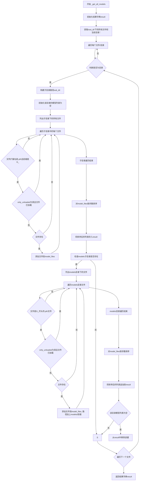

#### 带注释源码

```python
def _get_all_models(root_dir: str = "Data", only_unloaded: bool = False):
    """从root_dir搜索获取所有可用模型"""
    # 初始化结果字典，键为目录名，值为模型文件列表
    result: Dict[str, List[str]] = dict()
    # 获取root_dir下的所有文件列表，并添加当前目录"."
    files = os.listdir(root_dir) + ["."]
    # 遍历root_dir下的每个文件或目录
    for file in files:
        # 判断是否为目录
        if os.path.isdir(os.path.join(root_dir, file)):
            # 构建子目录的完整路径
            sub_dir = os.path.join(root_dir, file)
            # 搜索 "sub_dir" 、 "sub_dir/models" 两个路径
            result[file] = list()  # 初始化该目录的模型列表
            sub_files = os.listdir(sub_dir)  # 列出子目录内容
            model_files = []  # 用于存放找到的模型文件
            
            # 遍历子目录中的每个文件
            for sub_file in sub_files:
                # 获取文件的绝对路径
                relpath = os.path.realpath(os.path.join(sub_dir, sub_file))
                # 如果只查询未加载的模型，且该模型已加载，则跳过
                if only_unloaded and relpath in loaded_models.path2ids.keys():
                    continue
                # 检查文件扩展名是否为.pth且前缀为G_（通常表示生成器模型）
                if sub_file.endswith(".pth") and sub_file.startswith("G_"):
                    # 进一步检查文件是否真实存在
                    if os.path.isfile(relpath):
                        model_files.append(sub_file)
            
            # 对模型文件按步数排序（数字大的排在前面）
            model_files = sorted(
                model_files,
                key=lambda pth: (
                    int(pth.lstrip("G_").rstrip(".pth"))
                    if pth.lstrip("G_").rstrip(".pth").isdigit()
                    else 10**10  # 非数字命名的模型排在后面
                ),
            )
            result[file] = model_files  # 存入结果
            
            # 检查是否存在models子目录
            models_dir = os.path.join(sub_dir, "models")
            model_files = []
            if os.path.isdir(models_dir):
                sub_files = os.listdir(models_dir)
                for sub_file in sub_files:
                    relpath = os.path.realpath(os.path.join(models_dir, sub_file))
                    if only_unloaded and relpath in loaded_models.path2ids.keys():
                        continue
                    if sub_file.endswith(".pth") and sub_file.startswith("G_"):
                        if os.path.isfile(os.path.join(models_dir, sub_file)):
                            # 添加时加上models/前缀
                            model_files.append(f"models/{sub_file}")
                # 对模型文件按步数排序
                model_files = sorted(
                    model_files,
                    key=lambda pth: (
                        int(pth.lstrip("models/G_").rstrip(".pth"))
                        if pth.lstrip("models/G_").rstrip(".pth").isdigit()
                        else 10**10
                    ),
                )
                result[file] += model_files  # 追加到已有列表
            
            # 如果该目录下没有找到任何模型，则从结果中移除该键
            if len(result[file]) == 0:
                result.pop(file)

    return result
```


### `index`

这是一个FastAPI应用的首页路由处理函数，当用户访问网站根路径"/"时，该函数被调用以返回预先构建的Web前端页面（index.html），实现基本的网页服务功能。

参数：该函数没有显式参数

返回值：`FileResponse`，返回一个HTML文件响应，用于在浏览器中渲染Web前端页面

#### 流程图

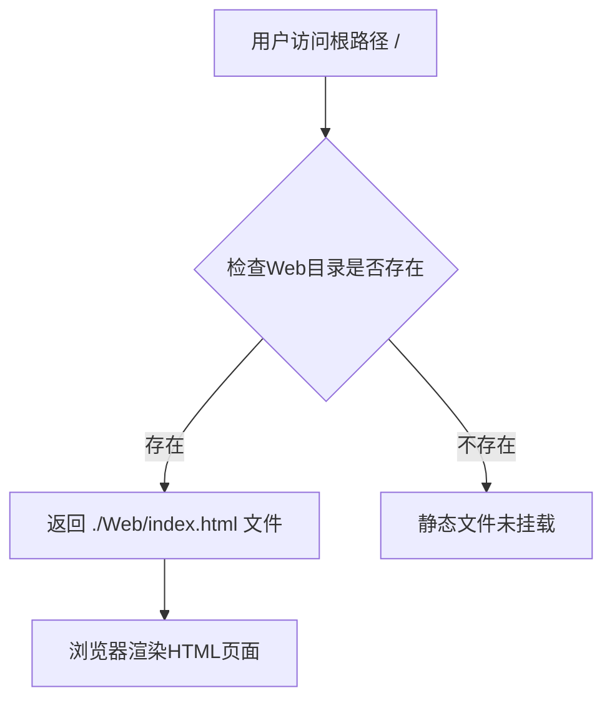

#### 带注释源码

```python
@app.get("/")
async def index():
    """
    首页路由处理函数
    
    当用户访问网站根路径时，返回预构建的HTML前端页面。
    该函数对应 FastAPI 应用的根路径 '/'，提供 Web UI 的入口。
    
    Returns:
        FileResponse: ./Web/index.html 文件的响应对象
        
    Note:
        - 这是一个异步函数 (async def)
        - 返回的 HTML 页面是 Web 应用的前端入口
        - 静态文件的挂载在应用启动时通过 StaticFiles 完成
    """
    return FileResponse("./Web/index.html")
```


### `voice` (POST)

这是FastAPI应用的语音合成POST接口，接收文本、模型参数和可选的参考音频，执行TTS推理并返回WAV音频文件。

参数：

- `request`：`Request`，FastAPI自动注入的请求对象，用于获取客户端信息
- `text`：`str`，要合成语音的文本内容，通过Form表单传递
- `model_id`：`int`，已加载模型的ID序号
- `speaker_name`：`Optional[str]`，说话人名称，与speaker_id二选一
- `speaker_id`：`Optional[int]`，说话人ID，与speaker_name二选一
- `sdp_ratio`：`float`，SDP/DP混合比，默认0.2
- `noise`：`float`，感情参数，控制音频情感变化，默认0.2
- `noisew`：`float`，音素长度参数，默认0.9
- `length`：`float`，语速控制，默认1.0
- `language`：`Optional[str]`，语言参数，若不指定则使用模型默认语言
- `auto_translate`：`bool`，是否自动翻译，默认False
- `auto_split`：`bool`，是否自动切分句子，默认False
- `emotion`：`Optional[Union[int, str]]`，情感参数
- `reference_audio`：`Optional[UploadFile]`，参考音频文件，用于声音克隆
- `style_text`：`Optional[str]`，风格文本，用于风格迁移
- `style_weight`：`float`，风格权重，默认0.7

返回值：`Union[Response, Dict[str, any]]`，成功时返回WAV音频文件的Response，失败时返回包含状态码和详情的字典

#### 流程图

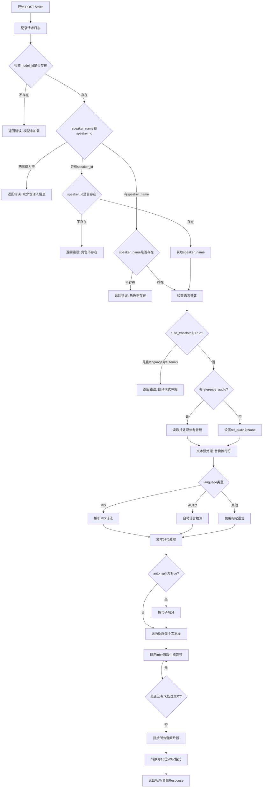

#### 带注释源码

```python
@app.post("/voice")
async def voice(
    request: Request,  # fastapi自动注入
    text: str = Form(...),  # 要合成的文本，通过Form表单接收
    model_id: int = Query(..., description="模型ID"),  # 已加载的模型序号
    speaker_name: str = Query(
        None, description="说话人名"
    ),  # speaker_name与 speaker_id二者选其一
    speaker_id: int = Query(None, description="说话人id，与speaker_name二选一"),
    sdp_ratio: float = Query(0.2, description="SDP/DP混合比"),  # 控制语音自然度
    noise: float = Query(0.2, description="感情"),  # 情感变化参数
    noisew: float = Query(0.9, description="音素长度"),  # 音素持续时间参数
    length: float = Query(1, description="语速"),  # 语速倍率
    language: str = Query(None, description="语言"),  # 若不指定使用语言则使用默认值
    auto_translate: bool = Query(False, description="自动翻译"),  # 是否自动翻译
    auto_split: bool = Query(False, description="自动切分"),  # 是否自动切分句子
    emotion: Optional[Union[int, str]] = Query(None, description="emo"),  # 情感参数
    reference_audio: UploadFile = File(None),  # 参考音频，用于声音克隆
    style_text: Optional[str] = Form(None, description="风格文本"),  # 风格文本
    style_weight: float = Query(0.7, description="风格权重"),  # 风格权重
):
    """语音接口，若需要上传参考音频请仅使用post请求"""
    # 记录请求日志，包含客户端IP、端口和查询参数
    logger.info(
        f"{request.client.host}:{request.client.port}/voice  { unquote(str(request.query_params) )} text={text}"
    )
    # 调用内部_voice函数处理实际TTS逻辑
    return await _voice(
        text=text,
        model_id=model_id,
        speaker_name=speaker_name,
        speaker_id=speaker_id,
        sdp_ratio=sdp_ratio,
        noise=noise,
        noisew=noisew,
        length=length,
        language=language,
        auto_translate=auto_translate,
        auto_split=auto_split,
        emotion=emotion,
        reference_audio=reference_audio,
        style_text=style_text,
        style_weight=style_weight,
    )
```


### `voice` (GET请求)

GET语音合成接口，用于将文本转换为语音。该接口接受多个参数包括文本内容、模型ID、说话人信息、语音生成参数等，返回WAV格式的音频数据。

参数：

-  `request`：`Request`，fastapi自动注入的请求对象
-  `text`：`str`，输入的要合成语音的文字
-  `model_id`：`int`，模型ID，指定使用哪个已加载的模型
-  `speaker_name`：`Optional[str]`，说话人名称，与speaker_id二选一
-  `speaker_id`：`Optional[int]`，说话人ID，与speaker_name二选一
-  `sdp_ratio`：`float`，SDP/DP混合比，默认为0.2
-  `noise`：`float`，感情参数，控制语音的情感程度，默认为0.2
-  `noisew`：`float`，音素长度参数，控制语音的发音长度，默认为0.9
-  `length`：`float`，语速参数，控制语音的播放速度，默认为1.0
-  `language`：`Optional[str]`，语言参数，若不指定则使用模型默认语言
-  `auto_translate`：`bool`，是否自动翻译，默认为False
-  `auto_split`：`bool`，是否自动切分文本，默认为False
-  `emotion`：`Optional[Union[int, str]]`，情感参数，用于控制语音情感
-  `style_text`：`Optional[str]`，风格文本，用于风格迁移
-  `style_weight`：`float`，风格权重，控制风格迁移的程度，默认为0.7

返回值：`Response`，返回WAV格式的音频数据，Content-Type为"audio/wav"

#### 流程图

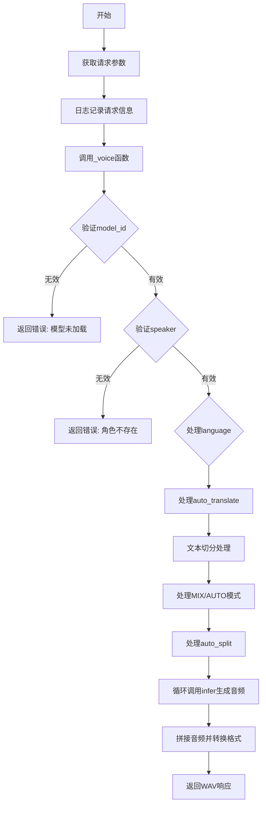

#### 带注释源码

```python
@app.get("/voice")
async def voice(
    request: Request,  # fastapi自动注入
    text: str = Query(..., description="输入文字"),
    model_id: int = Query(..., description="模型ID"),  # 模型序号
    speaker_name: str = Query(
        None, description="说话人名"
    ),  # speaker_name与 speaker_id二者选其一
    speaker_id: int = Query(None, description="说话人id，与speaker_name二选一"),
    sdp_ratio: float = Query(0.2, description="SDP/DP混合比"),
    noise: float = Query(0.2, description="感情"),
    noisew: float = Query(0.9, description="音素长度"),
    length: float = Query(1, description="语速"),
    language: str = Query(None, description="语言"),  # 若不指定使用语言则使用默认值
    auto_translate: bool = Query(False, description="自动翻译"),
    auto_split: bool = Query(False, description="自动切分"),
    emotion: Optional[Union[int, str]] = Query(None, description="emo"),
    style_text: Optional[str] = Query(None, description="风格文本"),
    style_weight: float = Query(0.7, description="风格权重"),
):
    """语音接口，不建议使用"""
    # 记录请求日志，包含客户端IP、端口和查询参数
    logger.info(
        f"{request.client.host}:{request.client.port}/voice  { unquote(str(request.query_params) )}"
    )
    # 调用内部_voice函数处理实际逻辑
    return await _voice(
        text=text,
        model_id=model_id,
        speaker_name=speaker_name,
        speaker_id=speaker_id,
        sdp_ratio=sdp_ratio,
        noise=noise,
        noisew=noisew,
        length=length,
        language=language,
        auto_translate=auto_translate,
        auto_split=auto_split,
        emotion=emotion,
        style_text=style_text,
        style_weight=style_weight,
    )
```


### `get_loaded_models_info`

获取当前服务中已加载的所有模型的基本信息，以字典形式返回每个模型的配置、路径、设备、语言、说话人映射等核心属性。

参数：

-  `request`：`Request`，FastAPI 自动注入的 HTTP 请求对象，用于记录日志等用途

返回值：`Dict[str, Dict]`，返回键值对集合，其中键为模型 ID（字符串类型），值为模型属性字典，包含 config_path、model_path、device、language、spk2id、id2spk、version 等字段

#### 流程图

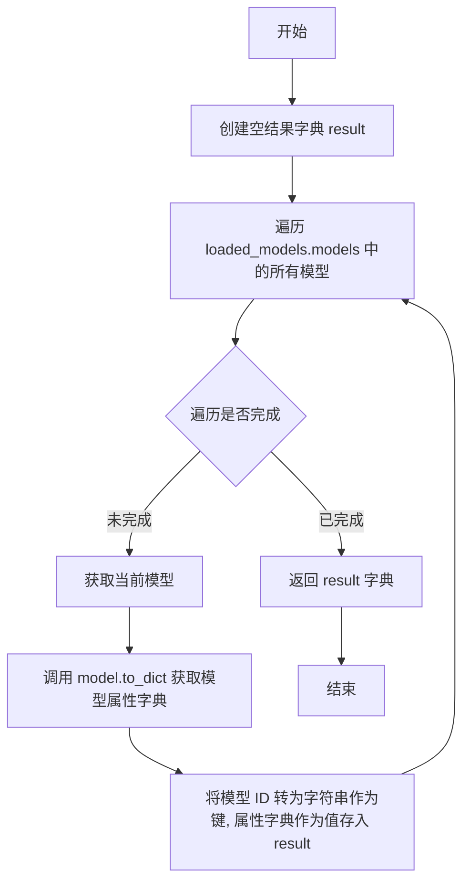

#### 带注释源码

```python
@app.get("/models/info")
def get_loaded_models_info(request: Request):
    """获取已加载模型信息"""
    # 初始化一个空字典用于存放所有模型的属性信息
    result: Dict[str, Dict] = dict()
    # 遍历已加载模型字典中的每一对 key-value
    # key 为模型序号（int 类型），value 为 Model 对象实例
    for key, model in loaded_models.models.items():
        # 将模型对象转换为字典格式（包含 config_path, model_path, device 等属性）
        # 并以字符串形式的模型 ID 作为键，存入结果字典
        result[str(key)] = model.to_dict()
    # 返回包含所有已加载模型信息的字典
    return result
```


### `delete_model`

删除指定模型接口，用于从服务器中移除已加载的模型，释放相关资源（内存、GPU显存等）。

参数：

- `request`：`Request`，FastAPI 自动注入的请求对象，用于获取客户端信息
- `model_id`：`int`，要删除的模型 ID

返回值：`Dict[str, any]`，包含删除操作状态的字典。若成功，返回 `{"status": 0, "detail": "删除成功"}`；若失败，返回 `{"status": 14, "detail": "模型{model_id}不存在，删除失败"}`

#### 流程图

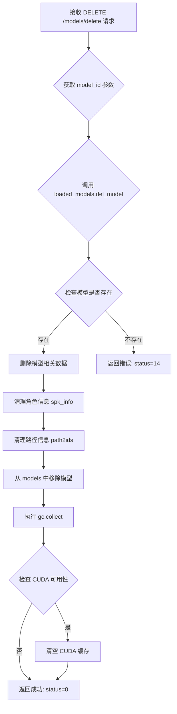

#### 带注释源码

```python
@app.get("/models/delete")
def delete_model(
    request: Request, model_id: int = Query(..., description="删除模型id")
):
    """删除指定模型"""
    # 记录删除操作的日志信息，包含客户端IP、端口和查询参数
    logger.info(
        f"{request.client.host}:{request.client.port}/models/delete  { unquote(str(request.query_params) )}"
    )
    # 调用 Models 类的 del_model 方法执行实际的模型删除逻辑
    result = loaded_models.del_model(model_id)
    # 如果返回 None，说明模型不存在，删除失败
    if result is None:
        logger.error(f"/models/delete 模型删除错误：模型{model_id}不存在，删除失败")
        return {"status": 14, "detail": f"模型{model_id}不存在，删除失败"}

    # 删除成功，返回状态码 0 和成功信息
    return {"status": 0, "detail": "删除成功"}
```


### `/models/add` (add_model)

添加指定模型接口，允许重复添加相同路径模型，且不重复占用内存。通过接收模型路径、配置文件路径、设备和语言等参数，自动查找配置文件并调用模型初始化方法将模型加载到内存中。

参数：

- `request`：`Request`，FastAPI 自动注入的请求对象，用于获取客户端信息
- `model_path`：`str`，添加模型路径，指向模型权重文件（.pth）
- `config_path`：`str | None`，添加模型配置文件路径，不填则使用模型目录下的 config.json 或上级目录的 config.json
- `device`：`str`，推理使用设备，默认为 "cuda"
- `language`：`str`，模型默认语言，默认为 "ZH"

返回值：`Dict[str, any]`，包含状态码、详情和模型信息的字典。成功时返回 `{"status": 0, "detail": "模型添加成功", "Data": {"model_id": int, "model_info": dict}}`，失败时返回错误状态码和错误详情

#### 流程图

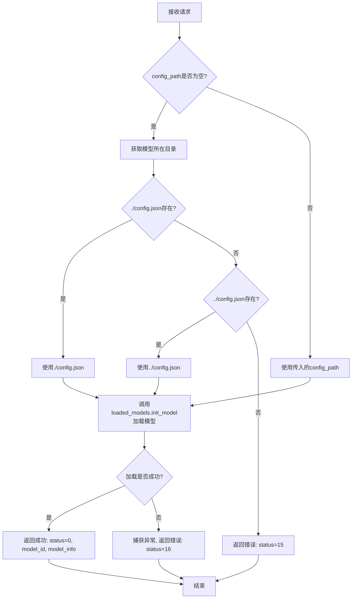

#### 带注释源码

```python
@app.get("/models/add")
def add_model(
    request: Request,
    model_path: str = Query(..., description="添加模型路径"),
    config_path: str = Query(
        None,
        description="添加模型配置文件路径，不填则使用./config.json或../config.json",
    ),
    device: str = Query("cuda", description="推理使用设备"),
    language: str = Query("ZH", description="模型默认语言"),
):
    """添加指定模型：允许重复添加相同路径模型，且不重复占用内存"""
    # 记录请求日志，包含客户端IP、端口和查询参数
    logger.info(
        f"{request.client.host}:{request.client.port}/models/add  { unquote(str(request.query_params) )}"
    )
    
    # 若未传入配置文件路径，则自动查找
    if config_path is None:
        # 获取模型所在目录
        model_dir = os.path.dirname(model_path)
        # 优先查找模型目录下的config.json
        if os.path.isfile(os.path.join(model_dir, "config.json")):
            config_path = os.path.join(model_dir, "config.json")
        # 其次查找上级目录的config.json
        elif os.path.isfile(os.path.join(model_dir, "../config.json")):
            config_path = os.path.join(model_dir, "../config.json")
        else:
            # 两者都不存在则返回错误
            logger.error(
                "/models/add 模型添加失败：未在模型所在目录以及上级目录找到config.json文件"
            )
            return {
                "status": 15,
                "detail": "查询未传入配置文件路径，同时默认路径./与../中不存在配置文件config.json。",
            }
    
    # 尝试初始化并加载模型
    try:
        model_id = loaded_models.init_model(
            config_path=config_path,
            model_path=model_path,
            device=device,
            language=language,
        )
    except Exception:
        # 捕获加载过程中的异常并记录
        logging.exception("模型加载出错")
        return {
            "status": 16,
            "detail": "模型加载出错，详细查看日志",
        }
    
    # 返回成功结果，包含模型ID和模型信息
    return {
        "status": 0,
        "detail": "模型添加成功",
        "Data": {
            "model_id": model_id,
            "model_info": loaded_models.models[model_id].to_dict(),
        },
    }
```


### `get_unloaded_models_info`

该函数是一个 FastAPI 的 GET 路由处理方法（Endpoint），对应客户端请求 `/models/get_unloaded`。其核心功能是扫描服务器本地文件系统中指定目录（默认为 `Data`）下的模型文件，并过滤出当前系统**未加载**的模型，最终以字典形式返回给前端，供用户在界面上选择并加载模型。

#### 参数

- `request`：`Request`，FastAPI 框架自动注入的请求对象，用于获取客户端的地址和端口信息，以便记录日志。
- `root_dir`：`str` (Query参数，可选，默认值为 "Data")，指定要搜索的模型根目录。

#### 返回值

`Dict[str, List[str]]`，返回值为一个字典（JSON格式）。
- **键 (Key)**：字符串，表示模型所属的子目录名称（例如 "speaker_name"）。
- **值 (Value)**：字符串列表，表示该目录下未加载的模型文件名（以 `.pth` 结尾，且以 `G_` 开头），列表按模型步数排序。

#### 流程图

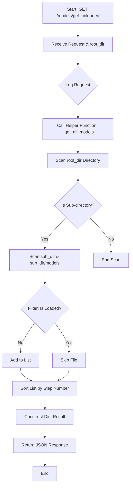

#### 带注释源码

```python
@app.get("/models/get_unloaded")
def get_unloaded_models_info(
    request: Request, root_dir: str = Query("Data", description="搜索根目录")
):
    """获取未加载模型
    
    该接口供前端调用，用于展示当前系统中尚未加载的模型文件。
    内部调用通用扫描函数，并设置 only_unloaded=True 进行过滤。
    """
    # 记录访问日志，包含客户端IP、端口和查询参数
    logger.info(
        f"{request.client.host}:{request.client.port}/models/get_unloaded  { unquote(str(request.query_params) )}"
    )
    # 调用内部函数 _get_all_models，only_unloaded 设为 True 表示仅返回未加载的模型
    return _get_all_models(root_dir, only_unloaded=True)
```


### `get_local_models_info`

获取本地所有模型信息，扫描指定目录下的所有模型文件（.pth文件），返回以目录名为键、模型文件列表为值的字典。

参数：

-  `request`：`Request`，FastAPI 自动注入的请求对象，用于记录日志
-  `root_dir`：`str`，搜索根目录，默认为 "Data"，描述待搜索的模型根目录路径

返回值：`Dict[str, List[str]]`，返回以子目录名为键、该目录下所有模型文件列表为值的字典，模型文件按步数排序

#### 流程图

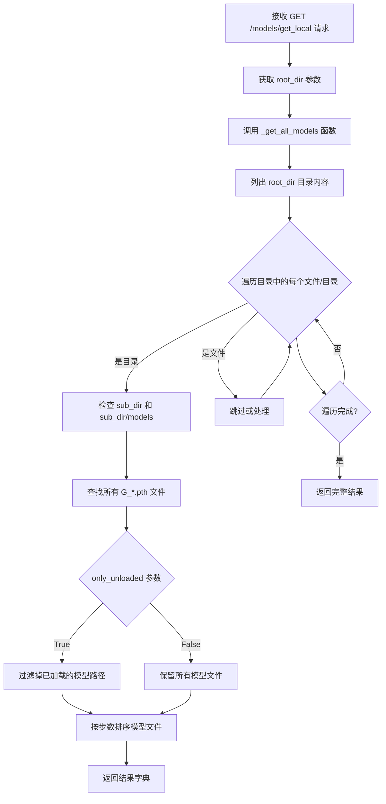

#### 带注释源码

```python
@app.get("/models/get_local")  # 定义 GET 路由
def get_local_models_info(
    request: Request,  # FastAPI 自动注入的请求对象
    root_dir: str = Query("Data", description="搜索根目录")  # 查询参数：搜索根目录
):
    """获取全部本地模型"""
    # 记录请求日志，包含客户端IP、端口和查询参数
    logger.info(
        f"{request.client.host}:{request.client.port}/models/get_local  { unquote(str(request.query_params) )}"
    )
    # 调用内部函数获取所有模型，only_unloaded=False 表示获取所有模型（包括已加载的）
    return _get_all_models(root_dir, only_unloaded=False)
```

#### 内部函数 `_get_all_models` 源码

```python
def _get_all_models(root_dir: str = "Data", only_unloaded: bool = False):
    """
    从root_dir搜索获取所有可用模型
    
    参数:
        root_dir: str, 搜索根目录，默认为 "Data"
        only_unloaded: bool, 是否只返回未加载的模型，默认为 False
    
    返回:
        Dict[str, List[str]]: 以子目录名为键，模型文件列表为值的字典
    """
    result: Dict[str, List[str]] = dict()
    # 遍历根目录 + 当前目录(.)
    files = os.listdir(root_dir) + ["."]
    
    for file in files:
        # 如果是目录
        if os.path.isdir(os.path.join(root_dir, file)):
            sub_dir = os.path.join(root_dir, file)
            # 搜索 "sub_dir" 和 "sub_dir/models" 两个路径
            result[file] = list()
            sub_files = os.listdir(sub_dir)
            model_files = []
            
            # 第一次遍历：检查 sub_dir 下的直接模型文件
            for sub_file in sub_files:
                relpath = os.path.realpath(os.path.join(sub_dir, sub_file))
                # 如果只获取未加载的模型，跳过已加载的
                if only_unloaded and relpath in loaded_models.path2ids.keys():
                    continue
                # 查找以 G_ 开头且以 .pth 结尾的模型文件
                if sub_file.endswith(".pth") and sub_file.startswith("G_"):
                    if os.path.isfile(relpath):
                        model_files.append(sub_file)
            
            # 对模型文件按步数排序（数字大的排在前面）
            model_files = sorted(
                model_files,
                key=lambda pth: (
                    int(pth.lstrip("G_").rstrip(".pth"))
                    if pth.lstrip("G_").rstrip(".pth").isdigit()
                    else 10**10  # 非数字的排到最后
                ),
            )
            result[file] = model_files
            
            # 第二次遍历：检查 sub_dir/models 下的模型文件
            models_dir = os.path.join(sub_dir, "models")
            model_files = []
            if os.path.isdir(models_dir):
                sub_files = os.listdir(models_dir)
                for sub_file in sub_files:
                    relpath = os.path.realpath(os.path.join(models_dir, sub_file))
                    if only_unloaded and relpath in loaded_models.path2ids.keys():
                        continue
                    if sub_file.endswith(".pth") and sub_file.startswith("G_"):
                        if os.path.isfile(os.path.join(models_dir, sub_file)):
                            model_files.append(f"models/{sub_file}")
                
                # 同样按步数排序
                model_files = sorted(
                    model_files,
                    key=lambda pth: (
                        int(pth.lstrip("models/G_").rstrip(".pth"))
                        if pth.lstrip("models/G_").rstrip(".pth").isdigit()
                        else 10**10
                    ),
                )
                result[file] += model_files  # 追加到结果中
            
            # 如果该目录下没有模型文件，移除该键
            if len(result[file]) == 0:
                result.pop(file)

    return result
```


### `get_status`

获取电脑运行状态，返回包含CPU、内存和GPU信息的字典。

参数：
- 该函数无参数

返回值：`Dict[str, Any]`，返回包含设备列表、CPU使用率、内存信息和GPU信息的字典

#### 流程图

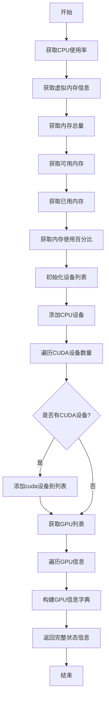

#### 带注释源码

```python
@app.get("/status")
def get_status():
    """获取电脑运行状态"""
    # 获取CPU使用率，interval=1表示等待1秒以获取准确的CPU使用率
    cpu_percent = psutil.cpu_percent(interval=1)
    
    # 获取虚拟内存信息
    memory_info = psutil.virtual_memory()
    memory_total = memory_info.total
    memory_available = memory_info.available
    memory_used = memory_info.used
    memory_percent = memory_info.percent
    
    # 初始化GPU信息列表和设备列表
    gpuInfo = []
    devices = ["cpu"]
    
    # 遍历CUDA设备数量，添加cuda设备到列表
    for i in range(torch.cuda.device_count()):
        devices.append(f"cuda:{i}")
    
    # 获取GPU列表
    gpus = GPUtil.getGPUs()
    
    # 遍历每个GPU，构建GPU信息字典
    for gpu in gpus:
        gpuInfo.append(
            {
                "gpu_id": gpu.id,
                "gpu_load": gpu.load,
                "gpu_memory": {
                    "total": gpu.memoryTotal,
                    "used": gpu.memoryUsed,
                    "free": gpu.memoryFree,
                },
            }
        )
    
    # 返回包含所有系统状态信息的字典
    return {
        "devices": devices,
        "cpu_percent": cpu_percent,
        "memory_total": memory_total,
        "memory_available": memory_available,
        "memory_used": memory_used,
        "memory_percent": memory_percent,
        "gpu": gpuInfo,
    }
```


### `translate` (/tools/translate)

翻译工具接口，提供文本翻译功能，将输入的文本翻译成指定的目标语言。

参数：

- `request`：`Request`，FastAPI 自动注入的请求对象，包含客户端信息
- `texts`：`str`，待翻译的文本内容
- `to_language`：`str`，翻译目标语言（如 "en", "zh", "ja" 等）

返回值：`Dict[str, str]`，返回包含翻译结果的字典，键为 "texts"，值为翻译后的文本

#### 流程图

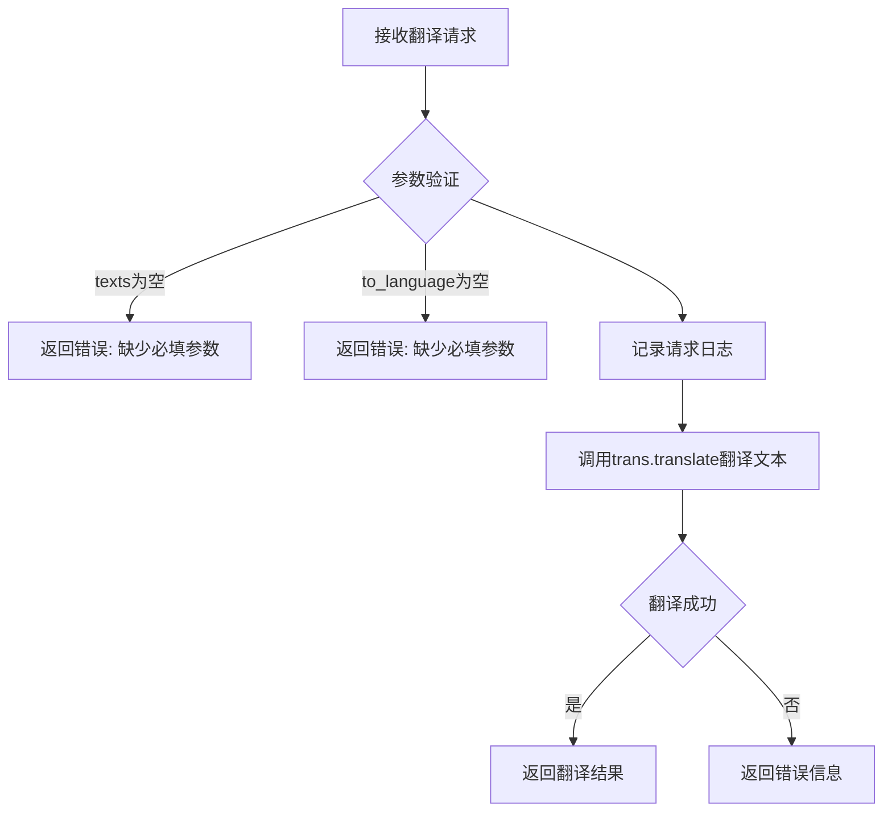

#### 带注释源码

```python
@app.get("/tools/translate")
def translate(
    request: Request,  # FastAPI自动注入的请求对象，用于获取客户端信息
    texts: str = Query(..., description="待翻译文本"),  # 待翻译的文本，必填参数
    to_language: str = Query(..., description="翻译目标语言"),  # 目标语言代码，必填参数
):
    """
    翻译接口
    将指定文本翻译成目标语言
    """
    # 记录请求日志，包含客户端IP、端口和查询参数
    logger.info(
        f"{request.client.host}:{request.client.port}/tools/translate  { unquote(str(request.query_params) )}"
    )
    # 调用翻译工具进行翻译，返回包含翻译结果的字典
    return {"texts": trans.translate(Sentence=texts, to_Language=to_language)}
```


### `random_example`

获取一个随机音频+文本示例，用于对比，音频会从本地目录随机选择。优先从 `train.list` 或 `val.list` 文件中读取数据。

参数：

- `request`：`Request`，FastAPI 自动注入的请求对象，用于获取客户端信息
- `language`：`Optional[str]`，指定语言，未指定则随机返回（可选）
- `root_dir`：`str`，搜索根目录，默认为 "Data"（可选）

返回值：`Dict`，包含状态和数据的字典。成功时返回 `{"status": 0, "Data": {"text": ..., "audio": ..., "speaker": ...}}`，无数据时返回 `{"status": 17, "detail": "没有加载任何示例数据"}`

#### 流程图

```mermaid
flowchart TD
    A[开始 random_example] --> B{检查 root_dir 是否在 all_examples 中}
    B -->|否| C[初始化 all_examples[root_dir] = {'ZH': [], 'JP': [], 'EN': []}]
    B -->|是| E
    C --> D[遍历 root_dir 目录]
    D --> F{查找 train.list 或 val.list}
    F -->|找到| G[读取文件内容]
    F -->|未找到| H[继续遍历]
    G --> I{解析行数据}
    I -->|格式正确| J{检查音频文件存在 且语言为 ZH/JP/EN}
    J -->|是| K[添加到对应语言列表]
    J -->|否| L[跳过]
    I -->|格式错误| L
    K --> M[完成文件遍历]
    H --> M
    L --> M
    M --> E
    E --> N{判断 language 参数}
    N -->|None| O{检查总示例数}
    N -->|指定语言| P{检查该语言示例数}
    O -->|为 0| Q[返回 status: 17, 无数据]
    O -->|不为 0| R[生成随机数 0 到总数-1]
    P -->|为 0| S[返回 status: 17, 无该语言数据]
    P -->|不为 0]--> T[该语言随机取一条]
    R --> U{随机数位置判断}
    U -->|在 ZH 范围| V[返回 ZH 示例]
    U -->|在 JP 范围| W[返回 JP 示例]
    U -->|在 EN 范围| X[返回 EN 示例]
    V --> Y[结束]
    W --> Y
    X --> Y
    T --> Y
    Q --> Y
    S --> Y
```

#### 带注释源码

```python
@app.get("/tools/random_example")
def random_example(
    request: Request,
    language: str = Query(None, description="指定语言，未指定则随机返回"),
    root_dir: str = Query("Data", description="搜索根目录"),
):
    """
    获取一个随机音频+文本，用于对比，音频会从本地目录随机选择。
    """
    # 记录请求日志，包含客户端IP、端口和查询参数
    logger.info(
        f"{request.client.host}:{request.client.port}/tools/random_example  { unquote(str(request.query_params) )}"
    )
    global all_examples  # 引用全局变量存储示例数据
    
    # 数据初始化：如果该 root_dir 尚未加载过示例数据
    if root_dir not in all_examples.keys():
        # 初始化三个语言的示例列表
        all_examples[root_dir] = {"ZH": [], "JP": [], "EN": []}

        examples = all_examples[root_dir]

        # 从项目 Data 目录中搜索 train/val.list 文件
        for root, directories, _files in os.walk(root_dir):
            for file in _files:
                # 只处理训练/验证列表文件
                if file in ["train.list", "val.list"]:
                    # 读取文件内容
                    with open(
                        os.path.join(root, file), mode="r", encoding="utf-8"
                    ) as f:
                        lines = f.readlines()
                        for line in lines:
                            # 按 | 分割数据，格式：音频路径|说话人|语言|文本...
                            data = line.split("|")
                            if len(data) != 7:  # 格式不正确则跳过
                                continue
                            # 检查音频文件存在 且语言为 ZH/EN/JP
                            if os.path.isfile(data[0]) and data[2] in [
                                "ZH",
                                "JP",
                                "EN",
                            ]:
                                # 添加到对应语言的示例列表
                                examples[data[2]].append(
                                    {
                                        "text": data[3],      # 文本内容
                                        "audio": data[0],     # 音频文件路径
                                        "speaker": data[1],   # 说话人名称
                                    }
                                )

    # 获取当前 root_dir 的示例数据
    examples = all_examples[root_dir]
    
    # 如果未指定语言，则随机选择任意语言
    if language is None:
        # 计算总示例数量
        total_count = len(examples["ZH"]) + len(examples["JP"]) + len(examples["EN"])
        
        if total_count == 0:
            # 没有加载任何示例数据
            return {"status": 17, "detail": "没有加载任何示例数据"}
        else:
            # 生成随机索引
            rand_num = random.randint(0, total_count - 1)
            
            # 根据随机数范围确定所属语言并返回对应示例
            # ZH 范围：[0, len(ZH))
            if rand_num < len(examples["ZH"]):
                return {"status": 0, "Data": examples["ZH"][rand_num]}
            
            # JP 范围：[len(ZH), len(ZH) + len(JP))
            if rand_num < len(examples["ZH"]) + len(examples["JP"]):
                return {
                    "status": 0,
                    "Data": examples["JP"][rand_num - len(examples["ZH"])],
                }
            
            # EN 范围：剩余部分
            return {
                "status": 0,
                "Data": examples["EN"][
                    rand_num - len(examples["ZH"]) - len(examples["JP"])
                ],
            }

    else:
        # 指定了语言，直接从对应语言列表中随机选择
        if len(examples[language]) == 0:
            return {"status": 17, "detail": f"没有加载任何{language}数据"}
        
        return {
            "status": 0,
            "Data": examples[language][
                random.randint(0, len(examples[language]) - 1)
            ],
        }
```


### `/tools/get_audio`

获取本地音频文件接口，根据传入的音频路径返回对应的WAV音频文件。

参数：

- `request`：`Request`，FastAPI 自动注入的请求对象，包含客户端连接信息
- `path`：`str`，本地音频路径，通过 Query 参数传递

返回值：
- 成功时：`FileResponse`，返回对应的音频文件（WAV格式）
- 失败时：`Dict[str, any]`，包含状态码和错误详情字典

#### 流程图

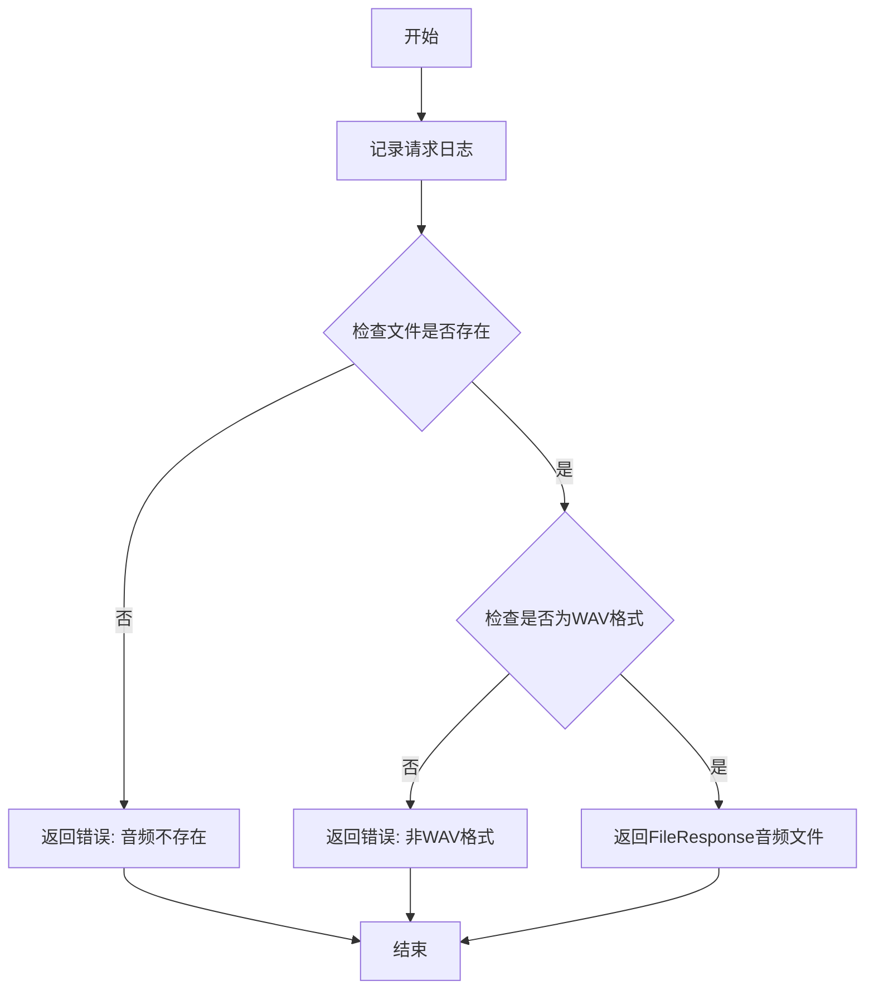

#### 带注释源码

```python
@app.get("/tools/get_audio")  # 定义GET请求端点 /tools/get_audio
def get_audio(request: Request, path: str = Query(..., description="本地音频路径")):
    """
    获取本地音频文件接口
    
    参数:
        request: FastAPI自动注入的请求对象
        path: 本地音频文件的完整路径
    
    返回:
        成功: FileResponse 音频文件响应
        失败: 包含错误信息的字典
    """
    # 记录请求日志，包含客户端IP、端口和查询参数
    logger.info(
        f"{request.client.host}:{request.client.port}/tools/get_audio  { unquote(str(request.query_params) )}"
    )
    
    # 检查指定的音频文件路径是否存在
    if not os.path.isfile(path):
        # 文件不存在，记录错误日志并返回错误响应
        logger.error(f"/tools/get_audio 获取音频错误：指定音频{path}不存在")
        return {"status": 18, "detail": "指定音频不存在"}
    
    # 检查文件是否为WAV格式
    if not path.lower().endswith(".wav"):
        # 非WAV格式，记录错误日志并返回错误响应
        logger.error(f"/tools/get_audio 获取音频错误：音频{path}非wav文件")
        return {"status": 19, "detail": "非wav格式文件"}
    
    # 所有检查通过，返回音频文件响应
    return FileResponse(path=path)
```


### `Model.to_dict`

将模型对象的当前状态转换为字典格式，用于序列化或返回模型信息。

**参数：**

- 无（仅包含隐式参数 `self`）

返回值：`Dict[str, any]`，返回一个包含模型配置信息的字典，包含以下键值对：

- `config_path`：配置文件路径
- `model_path`：模型文件路径
- `device`：推理设备
- `language`：默认语言
- `spk2id`：说话人名称到ID的映射字典
- `id2spk`：说话人ID到名称的映射字典
- `version`：模型版本

#### 流程图

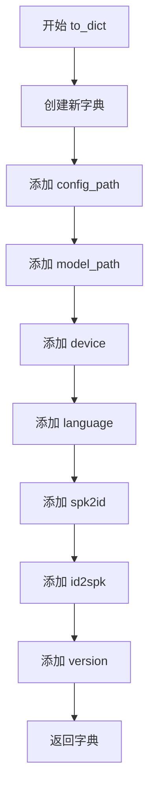

#### 带注释源码

```python
def to_dict(self) -> Dict[str, any]:
    """
    将模型对象的当前状态转换为字典格式
    
    Returns:
        Dict[str, any]: 包含模型关键信息的字典，包括配置路径、模型路径、
                       设备、语言、说话人映射关系及版本等
    """
    return {
        "config_path": self.config_path,      # 模型配置文件路径
        "model_path": self.model_path,         # 模型权重文件路径
        "device": self.device,                 # 推理设备 (cuda/cpu)
        "language": self.language,             # 默认语言设置
        "spk2id": self.spk2id,                 # 说话人名称到ID的映射字典
        "id2spk": self.id2spk,                 # 说话人ID到名称的映射字典
        "version": self.version,               # 模型版本号
    }
```


### `Models.init_model`

初始化并添加一个模型到模型管理器中，检查模型文件和配置文件是否存在，若模型路径已存在则添加引用，否则创建新的模型实例，并维护角色信息映射。

**参数：**

- `config_path`：`str`，模型 config.json 配置文件路径
- `model_path`：`str`，模型权重文件路径
- `device`：`str`，模型推理使用的设备（如 "cuda" 或 "cpu"）
- `language`：`str`，模型推理的默认语言（如 "ZH"、"EN"、"JP"）

**返回值：**`int`，返回添加的模型的 ID（即 `self.num - 1`），如果文件不存在则返回当前计数值

#### 流程图

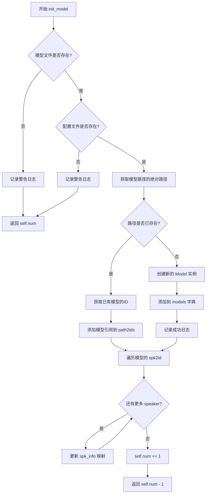

#### 带注释源码

```python
def init_model(
    self, config_path: str, model_path: str, device: str, language: str
) -> int:
    """
    初始化并添加一个模型

    :param config_path: 模型config.json路径
    :param model_path: 模型路径
    :param device: 模型推理使用设备
    :param language: 模型推理默认语言
    """
    # 若文件不存在则不进行加载
    if not os.path.isfile(model_path):
        if model_path != "":
            logger.warning(f"模型文件{model_path} 不存在，不进行初始化")
        return self.num  # 返回当前模型数量，不做添加
    
    if not os.path.isfile(config_path):
        if config_path != "":
            logger.warning(f"配置文件{config_path} 不存在，不进行初始化")
        return self.num  # 返回当前模型数量，不做添加

    # 若路径中的模型已存在，则不添加模型，若不存在，则进行初始化。
    model_path = os.path.realpath(model_path)  # 获取绝对路径
    
    if model_path not in self.path2ids.keys():
        # 路径不存在，创建新的模型实例
        self.path2ids[model_path] = {self.num}  # 建立路径到ID的映射
        self.models[self.num] = Model(
            config_path=config_path,
            model_path=model_path,
            device=device,
            language=language,
        )
        logger.success(
            f"添加模型{model_path}，使用配置文件{os.path.realpath(config_path)}"
        )
    else:
        # 路径已存在，添加模型引用（共享同一个模型对象，节省内存）
        m_id = next(iter(self.path2ids[model_path]))  # 获取已有的模型ID
        self.models[self.num] = self.models[m_id]     # 指向已有模型
        self.path2ids[model_path].add(self.num)        # 添加新的引用ID
        logger.success("模型已存在，添加模型引用。")
    
    # 添加角色信息，建立 speaker -> {model_id: speaker_id} 的映射
    for speaker, speaker_id in self.models[self.num].spk2id.items():
        if speaker not in self.spk_info.keys():
            self.spk_info[speaker] = {self.num: speaker_id}
        else:
            self.spk_info[speaker][self.num] = speaker_id
    
    # 修改计数，模型数量加一
    self.num += 1
    return self.num - 1  # 返回刚添加的模型ID
```


### `Models.del_model()`

删除指定索引位置的模型，释放相关资源（角色信息、路径映射、模型对象），并清理 CUDA 缓存。

参数：

-  `index`：`int`，要删除的模型索引 ID

返回值：`Optional[int]`：成功删除时返回被删除模型的索引 ID（`index`）；若模型不存在则返回 `None`

#### 流程图

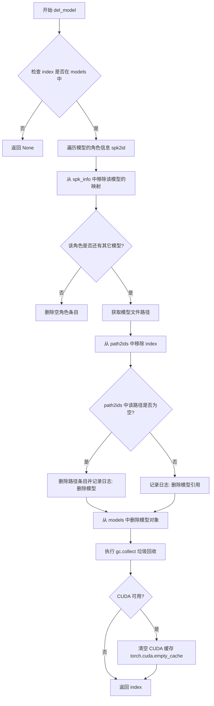

#### 带注释源码

```python
def del_model(self, index: int) -> Optional[int]:
    """删除对应序号的模型，若不存在则返回None"""
    # 1. 检查模型是否存在
    if index not in self.models.keys():
        return None  # 模型不存在，返回 None
    
    # 2. 删除角色信息
    # 遍历该模型的所有角色 (speaker -> speaker_id)
    for speaker, speaker_id in self.models[index].spk2id.items():
        self.spk_info[speaker].pop(index)  # 移除该模型对角色的映射
        if len(self.spk_info[speaker]) == 0:
            # 若对应角色的所有模型都被删除，则清除该角色信息
            self.spk_info.pop(speaker)
    
    # 3. 删除路径信息
    model_path = os.path.realpath(self.models[index].model_path)  # 获取模型文件的绝对路径
    self.path2ids[model_path].remove(index)  # 从路径映射中移除该模型索引
    
    if len(self.path2ids[model_path]) == 0:
        # 如果该路径下没有其他模型引用，则删除整个路径条目
        self.path2ids.pop(model_path)
        logger.success(f"删除模型{model_path}, id = {index}")
    else:
        # 否则只删除引用（其他模型仍在使用该路径）
        logger.success(f"删除模型引用{model_path}, id = {index}")
    
    # 4. 删除模型对象
    self.models.pop(index)  # 从模型字典中移除
    
    # 5. 清理内存
    gc.collect()  # 强制进行 Python 垃圾回收
    if torch.cuda.is_available():
        # 如果使用 CUDA，清空 GPU 缓存
        torch.cuda.empty_cache()
    
    # 6. 返回被删除的模型索引
    return index
```


### Models.get_models

获取所有已加载的模型，返回模型字典。

参数：
- 无

返回值：`Dict[int, Model]`，返回所有已加载的模型，键为模型ID，值为Model对象实例。

#### 流程图

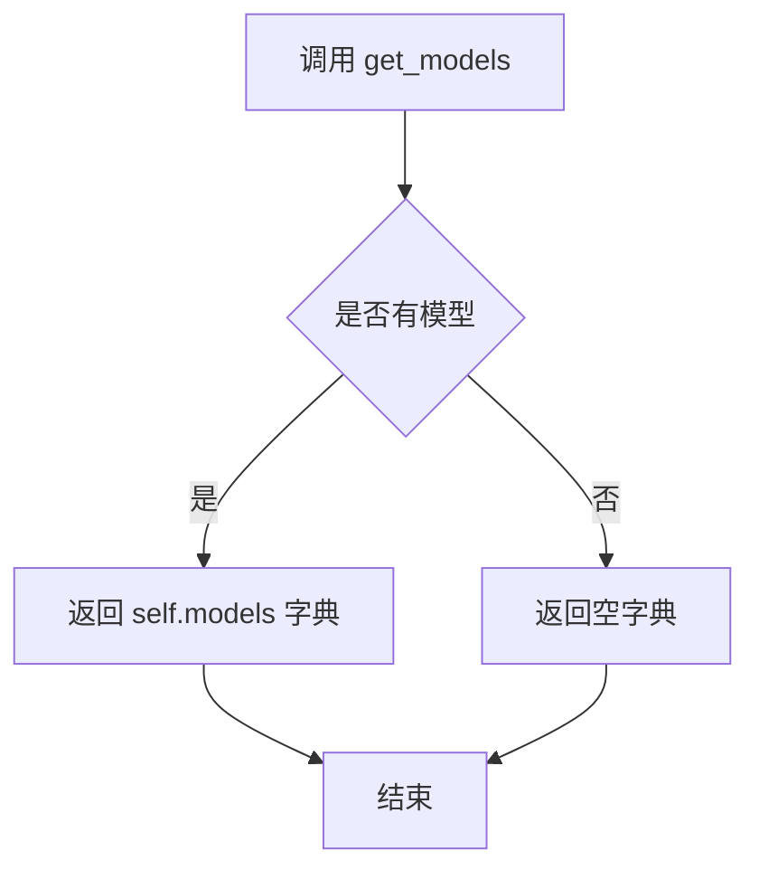

#### 带注释源码

```python
def get_models(self):
    """获取所有模型"""
    # 直接返回内部维护的模型字典
    # 字典键为模型ID (int)，值为Model对象实例
    # 若未加载任何模型，返回空字典 {}
    return self.models
```

## 关键组件


### 模型封装类 (Model)

单个TTS模型的封装，包含模型配置、权重加载、说话人映射等功能，支持多版本模型管理。

### 多模型管理器 (Models)

管理多个TTS模型的类，提供模型的添加、删除、查询等操作，支持模型复用和内存优化。

### 语音合成接口 (/voice)

FastAPI端点，支持GET和POST请求，实现文本到语音的转换，支持多语言、说话人选择、情感控制等功能。

### 模型信息接口 (/models/info)

获取当前已加载的所有模型信息，包括配置路径、说话人列表、模型版本等。

### 模型动态管理接口 (/models/add, /models/delete)

支持在运行时动态添加或删除TTS模型，无需重启服务，支持模型复用（相同路径不重复加载）。

### 状态监控接口 (/status)

获取系统运行状态，包括CPU、内存、GPU使用情况，用于资源监控和调度。

### 翻译工具接口 (/tools/translate)

集成翻译功能，支持将文本翻译为指定语言，用于跨语言语音合成。

### 随机示例接口 (/tools/random_example)

从训练数据中随机获取音频和文本对，用于演示或对比测试。

### 多语言处理引擎

支持ZH（中文）、EN（英文）、JP（日文）三种语言，以及MIX（混合说话人）和AUTO（自动检测语言）模式。

### 说话人映射系统 (spk2id/id2spk)

维护说话人名称与ID之间的双向映射，支持多模型间的说话人信息整合。

### GPU设备管理

支持CUDA设备管理，包括模型加载设备指定、显存清理等功能。

### 参考音频处理

支持通过reference_audio实现语音克隆和风格迁移，支持版本2.2的音频格式适配。

### 文本预处理管道

包含文本切分（按||符号）、自动句子切分、语言检测等文本处理功能。


## 问题及建议


### 已知问题

-   **全局状态管理混乱**：使用全局变量`loaded_models`，在`if __name__ == "__main__"`块中直接定义路由和挂载静态文件，违反了模块化设计原则，难以测试和复用。
-   **请求参数验证缺失**：未使用Pydantic模型定义请求体和响应体，直接使用`Query`、`Form`、`File`等原始FastAPI参数装饰器，缺乏对输入参数的严格类型校验和自动文档生成。
-   **错误处理不一致**：错误响应格式不统一，部分返回`{"status": code, "detail": message}`，部分返回`Response`，部分仅记录日志，导致调用方难以统一处理。
-   **同步阻塞操作**：模型推理在`with torch.no_grad()`块中同步执行，`get_status`中使用`interval=1`的`cpu_percent`会阻塞1秒，可能影响并发性能。
-   **安全风险**：`/tools/get_audio`接口的`path`参数未做路径遍历攻击防护，攻击者可利用`../../`访问任意文件。
-   **资源泄漏风险**：`del_model`中仅在模型引用完全删除时才释放GPU显存，若存在引用残留可能导致显存无法释放。
-   **重复代码**：`_voice`函数中存在大量重复的参数检查逻辑，与`voice`路由函数参数高度重复；模型加载逻辑在多处重复。
-   **硬编码与魔法数字**：多处使用硬编码值如`10**10`用于排序默认值，`0.2`、`0.9`、`0.7`等参数无配置化。
-   **日志敏感信息泄露**：记录完整请求参数（包括可能包含敏感信息的query strings），未做脱敏处理。
-   **类型注解不完整**：`to_dict`方法返回类型为`Dict[str, any]`，其中`any`不是有效类型注解。

### 优化建议

-   **拆分代码结构**：将模型管理、API路由、业务逻辑分离到不同模块；使用应用工厂模式创建FastAPI实例。
-   **引入Pydantic模型**：为请求和响应定义数据类，实现自动校验、文档生成和类型提示。
-   **统一错误处理**：创建自定义异常类和使用全局异常处理器，统一返回格式。
-   **异步化优化**：使用`run_in_executor`将同步的模型推理和状态获取操作放入线程池，避免阻塞事件循环。
-   **安全加固**：对文件路径参数进行严格校验，限制在允许的目录范围内；实现请求频率限制。
-   **配置管理**：将硬编码参数抽取到配置文件或环境变量，使用配置类统一管理。
-   **日志脱敏**：对敏感请求参数进行过滤或掩码处理。
-   **完善类型注解**：使用`Any`替代`any`，为所有函数补充完整的类型注解。

## 其它


### 设计目标与约束

本服务是一个基于FastAPI的语音合成（TTS）Web API服务，支持多版本（2.2等）、多模型的语音合成，采用Bert-VITS2模型实现。核心目标是为前端网页提供语音合成能力，支持多说话人、多语言（包括MIX混合语言和AUTO自动检测）、语音风格控制、参考音频克隆等功能。约束条件包括：仅支持wav格式输出、不支持流式输出、模型加载需要较大显存、不支持分布式部署。

### 错误处理与异常设计

服务采用统一的错误码体系进行错误处理，不同的错误类型对应不同的状态码：模型未加载返回10、缺少speaker信息返回11、speaker_id不存在返回12、speaker_name不存在返回13、模型删除失败返回14、配置文件查找失败返回15、模型加载异常返回16、无示例数据返回17、音频文件不存在返回18、非wav格式返回19、语言模式冲突返回20、MIX语法错误返回21。异常处理主要通过try-except捕获关键操作（模型加载、文件读取）的异常，并结合日志记录详细错误信息。

### 数据流与状态机

服务的数据流主要分为三个阶段：请求接收阶段、模型推理阶段、响应返回阶段。请求通过FastAPI的Query和Form参数接收，经过参数校验后进入_voice函数进行核心处理。在_voice函数中，首先进行模型和说话人验证，然后根据语言模式（ZH/EN/JP/MIX/AUTO）对文本进行预处理和分割，最后循环调用infer函数进行推理，推理结果通过numpy数组拼接、转换为16位wav格式，最后封装为FastAPI Response返回。状态机体现在Models类对模型生命周期的管理（加载、引用计数、删除）和静态资源的按需加载。

### 外部依赖与接口契约

主要外部依赖包括：fastapi（Web框架）、uvicorn（ASGI服务器）、torch（深度学习推理）、librosa（音频处理）、numpy（数值计算）、scipy（wav文件写入）、gradio（音频格式转换）、psutil（系统监控）、GPUtil（GPU监控）、urllib（URL解析）。配置文件依赖config模块的server_config对象，模型推理依赖infer模块的infer函数和get_net_g函数，翻译功能依赖tools.translate模块，分词功能依赖tools.sentence和re_matching模块。

### 安全性考虑

服务存在以下安全隐患：当前配置允许通过0.0.0.0监听地址（代码中有警告"本地服务，请勿将服务端口暴露于外网"），但未实现任何身份验证或访问控制机制。文件上传接口（reference_audio）未对文件大小和类型进行严格校验。API接口未实现速率限制，容易遭受滥用。模型路径和配置文件路径通过API参数传入，存在路径遍历风险。建议生产环境添加API Key认证、请求频率限制、输入验证等安全措施。

### 性能考虑与优化空间

当前实现存在以下性能瓶颈和优化空间：模型推理在主线程执行，大文本时会阻塞响应，建议使用后台任务或异步队列；每次推理都创建新的torch.no_grad()上下文，可以考虑批量推理优化；音频拼接使用numpy操作，可以预分配数组减少内存分配；模型加载后不会释放，即使内存不足也不会主动卸载低频使用模型，建议实现LRU缓存策略；静态文件扫描每次调用_get_all_models都重新扫描目录，建议缓存结果或使用文件系统监控；日志记录使用同步方式，高并发时可能成为瓶颈。

### 配置管理

服务配置通过config模块的config对象集中管理，主要配置项包括：server_config.port（服务端口）、server_config.models（模型配置列表，每个模型包含config、model、device、language四个参数）。模型配置在启动时一次性加载，支持通过API动态添加和删除模型。配置管理设计较为简单，缺少热重载机制，修改配置需要重启服务。

### 日志与监控

日志记录使用统一的logger对象（来自tools.log模块），根据不同操作输出不同级别的日志：模型加载成功使用success级别、警告信息使用warning级别、错误使用error级别、异常使用exception级别记录完整堆栈。监控接口/status提供CPU、内存、GPU的实时状态信息。日志记录包含客户端IP、端口、请求参数等调试信息，便于问题排查。但缺少请求耗时统计、错误率监控等生产环境必要的监控指标。

    