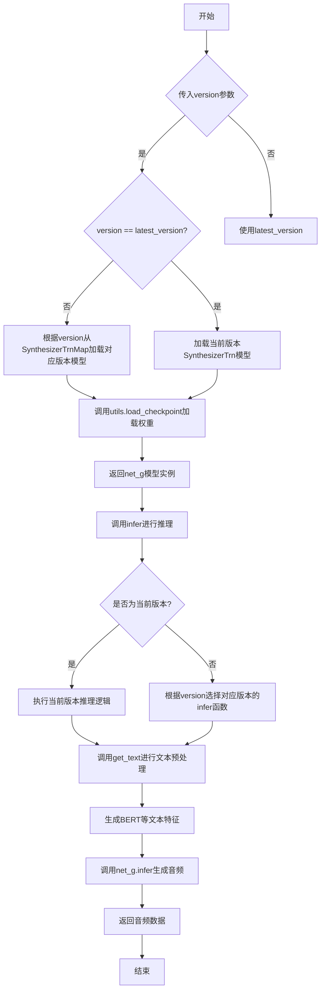
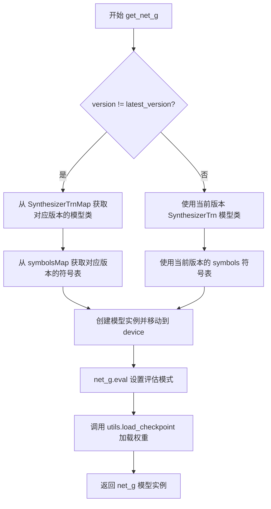
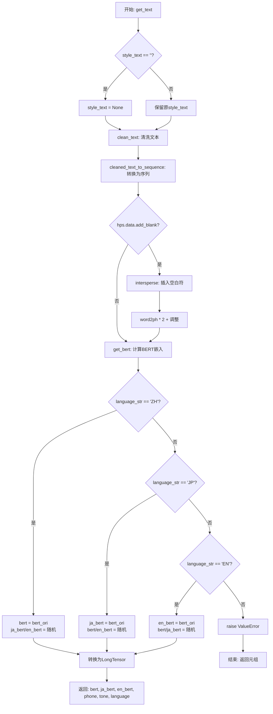
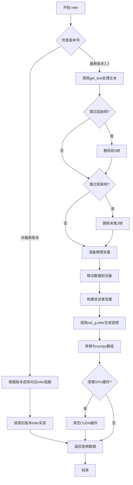
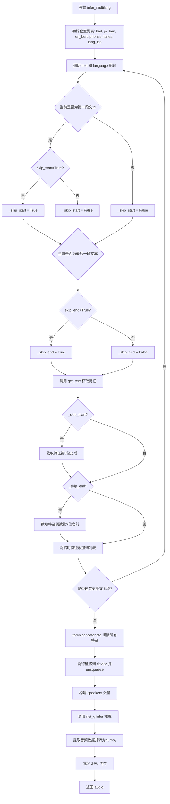

# `Bert-VITS2\infer.py` 详细设计文档

这是一个VITS（Variational Inference with Adversarial Learning for End-to-End Text-to-Speech）模型的版本管理、兼容推理及模型加载实现模块。该模块支持从V1.0到V2.3的多个模型版本，通过版本映射机制动态加载对应版本的模型类和符号集，并提供统一的推理接口（infer和infer_multilang）来处理单语言和多语言文本到语音的转换任务。

## 整体流程



## 类结构

```
全局模块
├── latest_version (全局变量)
├── SynthesizerTrnMap (版本映射字典)
├── symbolsMap (符号集映射字典)
├── get_net_g (函数)
├── get_text (函数)
├── infer (函数)
└── infer_multilang (函数)

外部依赖模块
├── torch
├── commons
├── text (cleaned_text_to_sequence, get_bert, clean_text, symbols)
├── utils
└── models (SynthesizerTrn)

旧版本模块 (oldVersion)
├── V101
├── V110
├── V111
├── V200
├── V210
└── V220
```

## 全局变量及字段


### `latest_version`
    
当前最新版本号，值为'2.3'

类型：`str`
    


### `SynthesizerTrnMap`
    
版本号到模型类的映射字典，用于根据版本动态加载对应的SynthesizerTrn模型类

类型：`dict`
    


### `symbolsMap`
    
版本号到符号集的映射字典，用于获取对应版本的音素符号集

类型：`dict`
    


    

## 全局函数及方法


### `get_net_g`

根据版本号加载对应的VITS模型网络，支持版本兼容性处理。该函数通过版本号映射到对应的模型类，处理旧版本与新版本的模型结构差异，并从检查点加载预训练权重。

参数：

- `model_path`：`str`，模型检查点文件路径，用于加载预训练权重
- `version`：`str`，版本号字符串，标识模型训练的版本，用于选择对应的模型类
- `device`：`str`，计算设备标识（如"cpu"或"cuda"），指定模型加载到哪个设备
- `hps`：超参数配置对象，包含模型配置、训练参数和数据配置等信息

返回值：`torch.nn.Module`（SynthesizerTrn类型），返回加载并初始化完成的VITS生成器模型实例，已设置为评估模式

#### 流程图



#### 带注释源码

```python
def get_net_g(model_path: str, version: str, device: str, hps):
    """
    根据版本号加载对应的VITS模型网络
    
    参数:
        model_path: str, 模型检查点文件路径
        version: str, 版本号字符串
        device: str, 计算设备标识
        hps: 超参数配置对象
    
    返回:
        net_g: VITS生成器模型实例
    """
    # 判断是否为最新版本，如果不是则需要使用旧版本模型类进行兼容处理
    if version != latest_version:
        # 从预定义的映射表中获取对应版本的SynthesizerTrn模型类
        # 不同版本的模型可能具有不同的结构（如符号数量、层配置等）
        net_g = SynthesizerTrnMap[version](
            # 获取对应版本的符号表长度，作为模型输入维度
            len(symbolsMap[version]),
            # 计算频谱帧数：filter_length/2 + 1
            hps.data.filter_length // 2 + 1,
            # 计算每段音频的帧数：segment_size / hop_length
            hps.train.segment_size // hps.data.hop_length,
            # 说话人数量，从数据配置中获取
            n_speakers=hps.data.n_speakers,
            # 解包模型配置参数（如隐藏层大小、注意力头数等）
            **hps.model,
        ).to(device)  # 将模型参数移至指定设备（CPU/CUDA）
    else:
        # 当前版本使用最新的模型类和符号表
        net_g = SynthesizerTrn(
            len(symbols),  # 当前版本的符号数量
            hps.data.filter_length // 2 + 1,
            hps.train.segment_size // hps.data.hop_length,
            n_speakers=hps.data.n_speakers,
            **hps.model,
        ).to(device)
    
    # 设置模型为评估模式，禁用Dropout、BatchNorm使用训练模式等
    _ = net_g.eval()
    
    # 从检查点文件加载模型权重
    # 参数: 模型路径, 模型实例, 优化器(此处为None), 是否跳过优化器
    _ = utils.load_checkpoint(model_path, net_g, None, skip_optimizer=True)
    
    # 返回加载完成的生成器模型
    return net_g
```


### `get_text`

文本预处理函数，将输入文本转换为音素、韵律特征和BERT嵌入向量。该函数首先对原始文本进行清洗和分词，然后根据语言类型生成相应的BERT嵌入表示，最后将所有处理结果转换为PyTorch张量以供后续模型使用。

参数：

- `text`：`str`，待处理的原始输入文本
- `language_str`：`str`，语言标识符，支持"ZH"（中文）、"JP"（日语）、"EN"（英语）
- `hps`：配置对象，包含数据处理和模型配置参数（如`hps.data.add_blank`用于控制是否插入空白符）
- `device`：`str`，计算设备标识（如"cuda"或"cpu"），用于BERT嵌入计算
- `style_text`：`Optional[str]`，可选的样式文本，用于风格控制，默认为None
- `style_weight`：`float`，样式权重，控制风格影响的程度，默认值为0.7

返回值：`(bert, ja_bert, en_bert, phone, tone, language)`，包含六个元素的元组：
- `bert`：`torch.Tensor`，主语言BERT嵌入向量，形状为(1024, seq_len)
- `ja_bert`：`torch.Tensor`，日语BERT嵌入向量，形状为(1024, seq_len)
- `en_bert`：`torch.Tensor`，英语BERT嵌入向量，形状为(1024, seq_len)
- `phone`：`torch.LongTensor`，音素序列
- `tone`：`torch.LongTensor`，韵律/声调序列
- `language`：`torch.LongTensor`，语言标识序列

#### 流程图



#### 带注释源码

```python
def get_text(text, language_str, hps, device, style_text=None, style_weight=0.7):
    """
    文本预处理函数，将输入文本转换为音素、韵律特征和BERT嵌入向量
    
    参数:
        text: str - 待处理的原始输入文本
        language_str: str - 语言标识符，支持"ZH"、"JP"、"EN"
        hps: 配置对象 - 包含数据处理和模型配置参数
        device: str - 计算设备标识
        style_text: Optional[str] - 可选的样式文本，用于风格控制
        style_weight: float - 样式权重，默认0.7
    
    返回:
        tuple: (bert, ja_bert, en_bert, phone, tone, language)
    """
    # 处理空字符串样式文本
    style_text = None if style_text == "" else style_text
    
    # 步骤1: 清洗文本，获取规范化的文本、音素、声调和词到音素的映射
    norm_text, phone, tone, word2ph = clean_text(text, language_str)
    
    # 步骤2: 将清洗后的文本转换为序列表示
    phone, tone, language = cleaned_text_to_sequence(phone, tone, language_str)
    
    # 步骤3: 如果配置中启用了添加空白符，则在序列中插入0作为间隔符
    if hps.data.add_blank:
        # 使用0作为间隔符插入序列
        phone = commons.intersperse(phone, 0)
        tone = commons.intersperse(tone, 0)
        language = commons.intersperse(language, 0)
        # 同步更新word2ph，每个映射值翻倍
        for i in range(len(word2ph)):
            word2ph[i] = word2ph[i] * 2
        # 第一个位置额外加1以保持对齐
        word2ph[0] += 1
    
    # 步骤4: 计算BERT嵌入向量（基于规范化文本和词-音素映射）
    bert_ori = get_bert(
        norm_text, word2ph, language_str, device, style_text, style_weight
    )
    
    # 释放word2ph内存
    del word2ph
    
    # 验证BERT嵌入长度与音素序列长度一致
    assert bert_ori.shape[-1] == len(phone), phone
    
    # 步骤5: 根据语言类型分配BERT嵌入向量到对应语言槽位
    if language_str == "ZH":
        # 中文：使用原始BERT作为中文嵌入，日语和英语用随机填充
        bert = bert_ori
        ja_bert = torch.randn(1024, len(phone))
        en_bert = torch.randn(1024, len(phone))
    elif language_str == "JP":
        # 日语：使用原始BERT作为日语嵌入，中文和英语用随机填充
        bert = torch.randn(1024, len(phone))
        ja_bert = bert_ori
        en_bert = torch.randn(1024, len(phone))
    elif language_str == "EN":
        # 英语：使用原始BERT作为英语嵌入，中文和日语用随机填充
        bert = torch.randn(1024, len(phone))
        ja_bert = torch.randn(1024, len(phone))
        en_bert = bert_ori
    else:
        # 不支持的语言类型
        raise ValueError("language_str should be ZH, JP or EN")
    
    # 验证主BERT嵌入长度一致性
    assert bert.shape[-1] == len(
        phone
    ), f"Bert seq len {bert.shape[-1]} != {len(phone)}"
    
    # 步骤6: 将序列转换为PyTorch LongTensor
    phone = torch.LongTensor(phone)
    tone = torch.LongTensor(tone)
    language = torch.LongTensor(language)
    
    # 返回六个元素的元组：三种语言的BERT嵌入和三种序列
    return bert, ja_bert, en_bert, phone, tone, language
```


### `infer`

单语言文本到语音推理的主入口函数，支持版本兼容调度。该函数根据模型版本号选择对应的推理实现，处理文本清洗、特征提取、音频生成等完整流程，并返回合成的语音波形数据。

参数：

- `text`：`str`，待转换为语音的输入文本
- `emotion`：`Union[int, str]`，情感参数，用于控制生成语音的情感风格，可为情感ID或情感描述字符串
- `sdp_ratio`：`float`，SDP（Soft Decision Priority）比率，控制时长预测的随机性，值越大随机性越高
- `noise_scale`：`float`，噪声比例，控制音频生成过程中的噪声水平
- `noise_scale_w`：`float`，噪声权重，控制噪声在声学特征层面的权重
- `length_scale`：`float`，长度比例，用于调整生成语音的速度，值大于1减速，小于1加速
- `sid`：`str`，说话者ID，指定使用哪个说话人的声音模型
- `language`：`str`，语言代码，支持"ZH"（中文）、"JP"（日语）、"EN"（英语）
- `hps`：`object`，超参数配置对象，包含模型配置、数据配置和训练配置
- `net_g`：`torch.nn.Module`，生成器神经网络模型
- `device`：`str`，计算设备标识符，如"cuda"或"cpu"
- `reference_audio`：`Optional[Any]`，参考音频，用于情感迁移或声音克隆（可选，默认None）
- `skip_start`：`bool`，是否跳过开头的音素帧（可选，默认False）
- `skip_end`：`bool`，是否跳过结尾的音素帧（可选，默认False）
- `style_text`：`Optional[str]`，风格文本，用于指定参考文本风格（可选，默认None）
- `style_weight`：`float`，风格权重，控制风格文本的影响程度（可选，默认0.7）

返回值：`numpy.ndarray`，合成的语音音频数据，一维浮点数组

#### 流程图



#### 带注释源码

```python
def infer(
    text,
    emotion: Union[int, str],
    sdp_ratio,
    noise_scale,
    noise_scale_w,
    length_scale,
    sid,
    language,
    hps,
    net_g,
    device,
    reference_audio=None,
    skip_start=False,
    skip_end=False,
    style_text=None,
    style_weight=0.7,
):
    """
    单语言文本到语音推理主入口函数，支持多版本模型推理调度
    
    参数:
        text: 输入文本
        emotion: 情感参数
        sdp_ratio: SDP比率
        noise_scale: 噪声比例
        noise_scale_w: 噪声权重
        length_scale: 长度比例
        sid: 说话者ID
        language: 语言代码
        hps: 超参数配置
        net_g: 生成器网络
        device: 计算设备
        reference_audio: 参考音频
        skip_start: 跳过起始帧
        skip_end: 跳过结束帧
        style_text: 风格文本
        style_weight: 风格权重
    
    返回:
        audio: 合成音频数据
    """
    
    # 版本兼容映射表定义
    # V4版本(2.2)参数顺序与当前一致
    inferMap_V4 = {
        "2.2": V220.infer,
    }
    # V3版本(2.1)参数顺序不同，新增了emotion等参数
    inferMap_V3 = {
        "2.1": V210.infer,
    }
    # V2版本支持中日英三语
    inferMap_V2 = {
        "2.0.2-fix": V200.infer,
        "2.0.1": V200.infer,
        "2.0": V200.infer,
        "1.1.1-fix": V111.infer_fix,
        "1.1.1": V111.infer,
        "1.1": V110.infer,
        "1.1.0": V110.infer,
    }
    # V1版本仅支持中文
    inferMap_V1 = {
        "1.0.1": V101.infer,
        "1.0": V101.infer,
        "1.0.0": V101.infer,
    }
    
    # 获取模型版本号，默认为最新版本
    version = hps.version if hasattr(hps, "version") else latest_version
    
    # ==================== 版本兼容调度逻辑 ====================
    # 如果模型版本不是最新版本，根据版本号选择对应的推理实现
    if version != latest_version:
        # V4版本(2.2)调度
        if version in inferMap_V4.keys():
            return inferMap_V4[version](
                text,
                emotion,
                sdp_ratio,
                noise_scale,
                noise_scale_w,
                length_scale,
                sid,
                language,
                hps,
                net_g,
                device,
                reference_audio,
                skip_start,
                skip_end,
                style_text,
                style_weight,
            )
        # V3版本(2.1)调度，参数顺序不同
        if version in inferMap_V3.keys():
            return inferMap_V3[version](
                text,
                sdp_ratio,
                noise_scale,
                noise_scale_w,
                length_scale,
                sid,
                language,
                hps,
                net_g,
                device,
                reference_audio,
                emotion,  # V3版本emotion参数位置不同
                skip_start,
                skip_end,
                style_text,
                style_weight,
            )
        # V2版本调度，不支持部分新增参数
        if version in inferMap_V2.keys():
            return inferMap_V2[version](
                text,
                sdp_ratio,
                noise_scale,
                noise_scale_w,
                length_scale,
                sid,
                language,
                hps,
                net_g,
                device,
            )
        # V1版本调度，仅支持基本参数
        if version in inferMap_V1.keys():
            return inferMap_V1[version](
                text,
                sdp_ratio,
                noise_scale,
                noise_scale_w,
                length_scale,
                sid,
                hps,
                net_g,
                device,
            )
    
    # ==================== 当前版本(2.3)推理实现 ====================
    
    # 第一步：文本处理与特征提取
    # 调用get_text进行文本清洗、音素转换、BERT特征提取
    bert, ja_bert, en_bert, phones, tones, lang_ids = get_text(
        text,
        language,
        hps,
        device,
        style_text=style_text,
        style_weight=style_weight,
    )
    
    # 第二步：跳过帧处理（用于多段拼接时的重叠处理）
    # 跳过起始帧：删除前3帧以实现平滑过渡
    if skip_start:
        phones = phones[3:]
        tones = tones[3:]
        lang_ids = lang_ids[3:]
        bert = bert[:, 3:]
        ja_bert = ja_bert[:, 3:]
        en_bert = en_bert[:, 3:]
    
    # 跳过结束帧：删除末尾2帧
    if skip_end:
        phones = phones[:-2]
        tones = tones[:-2]
        lang_ids = lang_ids[:-2]
        bert = bert[:, :-2]
        ja_bert = ja_bert[:, :-2]
        en_bert = en_bert[:, :-2]
    
    # 第三步：推理计算
    with torch.no_grad():
        # 准备输入张量并移至指定设备
        x_tst = phones.to(device).unsqueeze(0)       # 音素序列 [1, seq_len]
        tones = tones.to(device).unsqueeze(0)        # 音调序列 [1, seq_len]
        lang_ids = lang_ids.to(device).unsqueeze(0)  # 语言ID序列 [1, seq_len]
        bert = bert.to(device).unsqueeze(0)          # BERT特征 [1, 1024, seq_len]
        ja_bert = ja_bert.to(device).unsqueeze(0)    # 日语BERT特征
        en_bert = en_bert.to(device).unsqueeze(0)    # 英语BERT特征
        
        # 序列长度张量
        x_tst_lengths = torch.LongTensor([phones.size(0)]).to(device)
        
        # 释放phones显存
        del phones
        
        # 说话者ID张量
        speakers = torch.LongTensor([hps.data.spk2id[sid]]).to(device)
        
        # 调用生成器网络进行推理
        audio = (
            net_g.infer(
                x_tst,
                x_tst_lengths,
                speakers,
                tones,
                lang_ids,
                bert,
                ja_bert,
                en_bert,
                sdp_ratio=sdp_ratio,
                noise_scale=noise_scale,
                noise_scale_w=noise_scale_w,
                length_scale=length_scale,
            )[0][0, 0]  # 解包输出音频数据
            .data.cpu()  # 移至CPU
            .float()     # 转换为Float32
            .numpy()     # 转换为numpy数组
        )
        
        # 第四步：内存清理
        del (
            x_tst,
            tones,
            lang_ids,
            bert,
            x_tst_lengths,
            speakers,
            ja_bert,
            en_bert,
        )
        
        # 如果使用CUDA，清空缓存
        if torch.cuda.is_available():
            torch.cuda.empty_cache()
        
        return audio
```


### `infer_multilang`

多语言文本到语音推理函数，支持混合语言的语音合成。该函数接收多语言文本列表和对应的语言标识，逐段处理文本并提取文本特征（phonemes、tones、language IDs、BERT embeddings等），将多段特征拼接后送入声码器模型进行推理，最终生成连续的语音波形。

参数：

- `text`：`List[str]`，多语言文本列表，每个元素对应一段文本
- `sdp_ratio`：`float`，SDP (Stochastic Duration Predictor) 比率，控制音素时长的随机性
- `noise_scale`：`float`，噪声 scale，用于控制音频生成的随机性
- `noise_scale_w`：`float`，噪声 scale w，用于控制持续时间预测的随机性
- `length_scale`：`float`，长度 scale，用于调节语速
- `sid`：`str`，说话者 ID，用于指定目标说话人
- `language`：`List[str]`，语言列表，与 text 长度对应，支持 "ZH"、"JP"、"EN"
- `hps`：`object`，超参数配置对象，包含模型配置、数据配置等
- `net_g`：`torch.nn.Module`，生成器模型（声码器）
- `device`：`str`，计算设备标识（如 "cuda" 或 "cpu"）
- `reference_audio`：`Optional[Any]`，参考音频，用于情感迁移（当前代码中未实际使用）
- `emotion`：`Optional[Any]`，情感标签，用于情感控制（当前代码中未实际使用）
- `skip_start`：`bool`，是否跳过每段文本的前3个token
- `skip_end`：`bool`，是否跳过每段文本的后2个token

返回值：`numpy.ndarray`，生成的音频波形数据

#### 流程图



#### 带注释源码

```python
def infer_multilang(
    text,               # List[str]: 多语言文本列表，如 ["你好", "Hello", "こんにちは"]
    sdp_ratio,          # float: SDP比率，控制音素时长的随机性，值越大时长越不确定
    noise_scale,       # float: 噪声scale，控制生成音频的随机程度
    noise_scale_w,     # float: 噪声scale_w，控制时长预测的随机程度
    length_scale,      # float: 长度scale，用于调节语速，大于1减速小于1加速
    sid,               # str: 说话者ID，用于从spk2id映射获取说话人向量索引
    language,          # List[str]: 语言列表，与text对应，如 ["ZH", "EN", "JP"]
    hps,               # object: 包含模型配置、数据配置、版本号等的超参数对象
    net_g,             # torch.nn.Module: 生成器模型，负责将特征转换为音频波形
    device,            # str: 计算设备，"cuda"或"cpu"
    reference_audio=None,  # Optional: 参考音频路径或数据，用于情感迁移（当前未启用）
    emotion=None,      # Optional: 情感标签，用于情感控制（当前未启用）
    skip_start=False,  # bool: 是否跳过每段文本的前3个token（用于句间衔接）
    skip_end=False,    # bool: 是否跳过每段文本的后2个token（用于句间衔接）
):
    # 步骤1: 初始化空列表，用于存储每段文本处理后的特征
    bert, ja_bert, en_bert, phones, tones, lang_ids = [], [], [], [], [], []
    # 注: emo相关代码被注释，reference_audio和emotion参数暂未使用

    # 步骤2: 遍历每段文本和对应的语言，逐段处理
    for idx, (txt, lang) in enumerate(zip(text, language)):
        # 根据索引位置和skip标志计算当前段是否需要跳过开头/结尾
        # 首段且skip_start=True时跳过开头；非首段始终跳过开头（idx!=0保证句间平滑过渡）
        _skip_start = (idx != 0) or (skip_start and idx == 0)
        # 末段且skip_end=True时跳过结尾；非末段始终跳过结尾
        _skip_end = (idx != len(language) - 1) or skip_end

        # 步骤3: 调用get_text获取当前文本段的特征
        # 返回: bert(中文bert), ja_bert(日语bert), en_bert(英语bert), phones, tones, lang_ids
        (
            temp_bert,
            temp_ja_bert,
            temp_en_bert,
            temp_phones,
            temp_tones,
            temp_lang_ids,
        ) = get_text(txt, lang, hps, device)

        # 步骤4: 根据_skip标志截取特征，去除句首/句尾的边界token
        if _skip_start:
            # 去除前3个token（phoneme/bert等），保持句间连贯
            temp_bert = temp_bert[:, 3:]
            temp_ja_bert = temp_ja_bert[:, 3:]
            temp_en_bert = temp_en_bert[:, 3:]
            temp_phones = temp_phones[3:]
            temp_tones = temp_tones[3:]
            temp_lang_ids = temp_lang_ids[3:]
        if _skip_end:
            # 去除后2个token，避免句间重叠
            temp_bert = temp_bert[:, :-2]
            temp_ja_bert = temp_ja_bert[:, :-2]
            temp_en_bert = temp_en_bert[:, :-2]
            temp_phones = temp_phones[:-2]
            temp_tones = temp_tones[:-2]
            temp_lang_ids = temp_lang_ids[:-2]

        # 步骤5: 将当前段的特征添加到列表中
        bert.append(temp_bert)
        ja_bert.append(temp_ja_bert)
        en_bert.append(temp_en_bert)
        phones.append(temp_phones)
        tones.append(temp_tones)
        lang_ids.append(temp_lang_ids)

    # 步骤6: 拼接所有文本段的特征，形成连续的特征序列
    # dim=1 拼接bert（特征维度），dim=0 拼接phoneme序列
    bert = torch.concatenate(bert, dim=1)
    ja_bert = torch.concatenate(ja_bert, dim=1)
    en_bert = torch.concatenate(en_bert, dim=1)
    phones = torch.concatenate(phones, dim=0)
    tones = torch.concatenate(tones, dim=0)
    lang_ids = torch.concatenate(lang_ids, dim=0)

    # 步骤7: 推理阶段，禁用梯度计算以节省显存
    with torch.no_grad():
        # 将所有特征移到指定设备并增加batch维度
        x_tst = phones.to(device).unsqueeze(0)          # [1, seq_len]
        tones = tones.to(device).unsqueeze(0)           # [1, seq_len]
        lang_ids = lang_ids.to(device).unsqueeze(0)     # [1, seq_len]
        bert = bert.to(device).unsqueeze(0)             # [1, 1024, seq_len]
        ja_bert = ja_bert.to(device).unsqueeze(0)       # [1, 1024, seq_len]
        en_bert = en_bert.to(device).unsqueeze(0)       # [1, 1024, seq_len]

        # 构建序列长度张量
        x_tst_lengths = torch.LongTensor([phones.size(0)]).to(device)

        # 删除phones以释放内存（已在GPU上转换为x_tst）
        del phones

        # 构建说话人向量
        speakers = torch.LongTensor([hps.data.spk2id[sid]]).to(device)

        # 步骤8: 调用模型推理，生成音频波形
        # net_g.infer返回tuple，取[0][0,0]得到[seq_len]的音频数据
        audio = (
            net_g.infer(
                x_tst,              # phoneme序列
                x_tst_lengths,      # 序列长度
                speakers,           # 说话人ID
                tones,              # 音调序列
                lang_ids,           # 语言ID序列
                bert,               # 中文bert特征
                ja_bert,            # 日语bert特征
                en_bert,            # 英语bert特征
                sdp_ratio=sdp_ratio,
                noise_scale=noise_scale,
                noise_scale_w=noise_scale_w,
                length_scale=length_scale,
            )[0][0, 0]              # 解包获取音频数据
            .data.cpu()             # 移到CPU
            .float()                # 转为FloatTensor
            .numpy()                # 转为numpy数组
        )

        # 步骤9: 清理中间变量，释放GPU显存
        del (
            x_tst,
            tones,
            lang_ids,
            bert,
            x_tst_lengths,
            speakers,
            ja_bert,
            en_bert,
        )  # , emo

        # 如果使用CUDA，显式清空缓存
        if torch.cuda.is_available():
            torch.cuda.empty_cache()

        # 步骤10: 返回生成的音频波形
        return audio
```

## 关键组件


### 版本管理系统

负责管理模型版本号，支持从1.0.0到2.3的多个版本，通过latest_version变量和版本映射字典实现版本追踪与兼容性判断。

### 模型加载器 (get_net_g)

根据指定版本号动态加载对应版本的VITS模型(SynthesizerTrn)，处理模型权重恢复并将模型移至指定设备，是连接模型文件与推理过程的桥梁。

### 文本处理器 (get_text)

将输入文本转换为模型所需的音素序列、音调、语言ID以及多语言BERT特征，支持中文、日文、英文三种语言的处理与嵌入生成。

### 推理调度器 (infer)

主推理入口函数，根据版本号选择对应的推理实现，处理风格文本、参考音频等参数，通过版本兼容映射(inferMap_V1-V4)实现向后兼容，支持跳过起始/结束标记的控制。

### 多语言推理器 (infer_multilang)

支持多段落、多语言文本的联合推理，将不同语言的文本片段分别处理后拼接，再进行统一推理，实现跨语言合成。

### 版本-模型映射表 (SynthesizerTrnMap)

字典结构，将版本号字符串映射到对应的模型类，实现不同版本模型类的动态加载与实例化。

### 推理函数映射表 (inferMap_V1-V4)

按版本分组的历史推理函数引用，支持v1(仅中文)、v2(中日英)、v3(新增情感参数)、v2.2(参数位置调整)四个兼容级别的推理调用。

### 符号映射表 (symbolsMap)

版本对应的音素符号表映射，确保不同版本模型使用正确的发音符号集合进行文本到音素的转换。


## 问题及建议


### 已知问题

-   **硬编码的版本映射表**：SynthesizerTrnMap、symbolsMap、inferMap_V1~V4 等多处硬编码版本与类的映射，添加新版本需要修改多处代码，缺乏配置驱动或自动发现机制
-   **代码重复**：infer 和 infer_multilang 函数存在大量重复的张量处理、设备转移、内存清理逻辑，可提取为通用工具函数
-   **缺少版本校验**：get_net_g 和 infer 函数中未验证 version 是否存在于映射表中，传入无效版本会导致运行时 KeyError 异常
-   **硬编码的BERT维度**：代码中直接使用 `torch.randn(1024, len(phone))`，1024 为魔法数字，缺乏配置管理
-   **语言支持硬编码**：在 get_text 和 infer 中使用字符串常量 "ZH"、"JP"、"EN"，缺少统一的语言枚举或常量定义
-   **被注释掉的代码未清理**：get_emo_、clap_wrapper 相关的注释代码长期存在，增加代码理解成本
-   **类型注解不完整**：get_net_g 函数缺少返回类型注解，部分参数缺少类型定义
-   **参数顺序不一致**：不同版本infer函数参数顺序不同，通过大量参数传递维持兼容，缺乏统一的接口抽象
-   **全局状态依赖**：函数依赖 hps 对象隐式包含 version、data、spk2id 等属性，缺乏显式的参数传递

### 优化建议

-   **引入配置驱动**：使用配置文件或注册机制管理版本映射，实现版本类的自动发现和注册，减少手动维护成本
-   **提取公共逻辑**：将设备转移、张量处理、内存清理等重复代码抽取为独立函数（如 to_device、cleanup_memory）
-   **增加输入校验**：在版本相关操作前验证 version、model_path、device 等参数的合法性，提供友好的错误信息
-   **使用枚举或常量**：定义 Language 枚举和 VERSION、BERT_DIM 等常量替代魔法数字和字符串常量
-   **统一推理接口**：设计抽象的 InferenceStrategy 接口，通过策略模式处理不同版本的推理差异，简化调用方逻辑
-   **清理死代码**：移除被注释的 get_emo_ 和 clap_wrapper 相关代码，或标记为 TODO 待处理
-   **完善类型注解**：为所有公开函数添加完整的类型注解，提升代码可维护性和 IDE 支持
-   **依赖注入**：将 hps 中的关键配置（version、spk2id等）显式作为参数传入，提高函数的可测试性和明确性


## 其它


### 设计目标与约束

本模块旨在实现VITS多版本模型的统一管理和推理支持，确保不同训练版本的模型能够在同一推理框架下正确运行。设计目标包括：1）版本兼容性 - 支持从1.0.0到2.3共12个版本的模型；2）多语言支持 - 支持中文、日文、英文三种语言的文本转语音；3）向后兼容 - 新版本推理代码能够正确调用旧版本模型。

### 错误处理与异常设计

版本号验证：infer函数通过hps.version获取版本号，若不存在则默认为最新版本2.3；语言参数验证：get_text函数中检查language_str参数，仅接受"ZH"、"JP"、"EN"三种语言，其他值抛出ValueError异常；模型加载异常：get_net_g函数中模型路径不存在或格式错误时，utils.load_checkpoint会抛出相应异常；版本映射异常：当传入未在SynthesizerTrnMap中定义的版本号时，会触发KeyError，建议在调用前进行版本有效性验证。

### 数据流与状态机

单语言推理流程（infer函数）：1）接收原始文本、情感参数、推理参数；2）调用get_text进行文本预处理，得到bert特征、音素序列、语调、语言标识；3）根据skip_start和skip_end参数进行序列裁剪；4）将所有张量传输到指定设备；5）调用net_g.infer进行推理生成音频；6）清理GPU缓存并返回音频数据。多语言推理流程（infer_multilang）：对每种语言分别调用get_text处理，然后沿时间维度拼接所有特征，再进行统一推理，支持任意多语言组合。

### 外部依赖与接口契约

核心依赖模块包括：1）torch - 张量计算和模型操作；2）commons - 工具函数如intersperse；3）text模块 - clean_text、cleaned_text_to_sequence、get_bert；4）models.SynthesizerTrn - 当前版本模型类；5）utils - 模型加载工具load_checkpoint；6）oldVersion包 - 包含各历史版本的模型和推理实现。配置依赖：hps对象必须包含data（filter_length、hop_length、n_speakers、add_blank、spk2id）、train（segment_size）、model等子配置项，且需包含version字段声明版本号。

### 配置与参数说明

infer函数核心参数：text(字符串-输入文本)、emotion(Union[int, str]-情感标签)、sdp_ratio(float-采样策略比例)、noise_scale(float-噪声尺度)、noise_scale_w(float-噪声宽度尺度)、length_scale(float-语速比例)、sid(str-说话人ID)、language(str-语言代码)、hps(配置对象-超参数)、net_g(模型-生成器网络)、device(str-计算设备)、reference_audio(可选-参考音频)、skip_start/skip_end(bool-是否跳过起始/结束标记)、style_text(可选-风格文本)、style_weight(float-风格权重)。

### 版本兼容性策略

采用分层映射策略管理版本差异：1）模型结构映射 - SynthesizerTrnMap字典存储各版本对应的模型类；2）符号表映射 - symbolsMap存储各版本对应的音素符号表；3）推理函数映射 - inferMap_V1到inferMap_V4分别对应不同版本的infer函数实现；4）参数适配 - V2.2版本参数位置变化、V2.1版本新增emotion等参数，需根据版本选择正确的参数传递顺序。

### 性能考虑与优化

GPU内存管理：1）使用torch.no_grad()禁用梯度计算；2）推理完成后显式删除不再使用的张量变量；3）调用torch.cuda.empty_cache()清理CUDA缓存；4）使用np.float32格式存储最终音频结果减少内存占用。计算优化：1）批量处理多语言时使用torch.concatenate进行特征拼接；2）使用inplace操作减少内存分配；3）模型推理使用eval模式禁用dropout和batch normalization的训练行为。

### 安全性考虑

输入验证：1）检查model_path路径安全性，防止路径遍历攻击；2）验证hps.data.spk2id中说话人ID有效性；3）检查文本长度防止超长输入导致内存溢出。设备安全：1）device参数应限制为"cpu"、"cuda"或"cuda:0"等合法值；2）使用torch.cuda.is_available()检查GPU可用性后再执行GPU相关操作。

### 测试策略建议

版本兼容性测试：针对SynthesizerTrnMap中的每个版本号进行加载和推理测试；多语言组合测试：测试ZH-JP-EN任意组合的多语言推理；边界条件测试：空字符串、单字符、极长文本、特殊符号等；参数边界测试：sdp_ratio=0/1、length_scale=0.5/2.0等极端值；模型版本不匹配测试：使用V2.3的config加载V1.0模型。

### 部署注意事项

模型文件要求：1）每个版本的模型需配套config.json并包含version字段；2）模型检查点文件需与版本对应；3）旧版本模型文件需保留在oldVersion目录下。环境依赖：1）PyTorch版本需支持CUDA计算；2）需要安装commons、text、utils等配套模块；3）确保所有oldVersion子模块可正确导入。版本管理：新增版本时需同时更新SynthesizerTrnMap、symbolsMap及相应的inferMap。

### 潜在技术债务

1）硬编码版本号 - 最新版本号2.3和latest_version变量可能需要手动同步更新；2）重复代码 - infer和infer_multilang存在大量重复的推理逻辑，可抽象公共方法；3）注释代码 - 包含被注释的emotion和clap相关功能代码，需清理或实现；4）版本映射字典冗余 - V2.0系列三个版本映射到同一模型类，可优化为范围匹配；5）错误信息不够具体 - 异常信息可提供更多调试上下文。

    